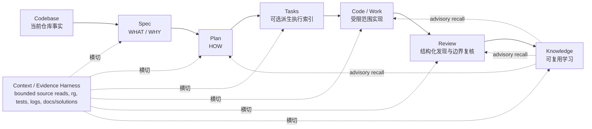
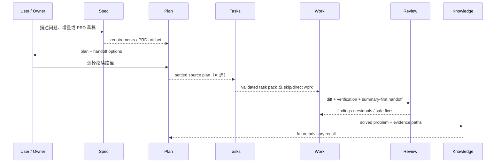

本页解释 spec-first 的核心研发闭环：它把一次性的 AI coding 对话，转换为仓库内可检查、可交接、可复用的工程轨迹。这个闭环不是“多几个 prompt”或“多几个 agent”，而是围绕 `Codebase → Spec → Plan → Tasks → Code → Review → Knowledge` 建立边界、证据、产物和下游 handoff；其中 Context 是横切的 evidence / harness layer，而不是顺序节点。Sources: [CONCEPTS.md](CONCEPTS.md#L9-L19), [workflow-skill-agent-map.md](docs/workflow-skill-agent-map.md#L4-L20)

本页位于“深入解析 / 架构与设计理念”下，当前页面只聚焦 Spec、Plan、Tasks、Code、Review、Knowledge 之间如何形成闭环；CLI 初始化、宿主投影、运行时 Drift、测试体系、知识库细节分别属于后续页面。建议先读 [AI Coding Harness 架构总览](11-ai-coding-harness-jia-gou-zong-lan)，再读本页，随后进入 [事实地板与语义判断：脚本、契约、证据和 LLM 的边界](13-shi-shi-di-ban-yu-yu-yi-pan-duan-jiao-ben-qi-yue-zheng-ju-he-llm-de-bian-jie) 与 [核心研发链路：brainstorm、prd、plan、write-tasks、work、review、compound](20-he-xin-yan-fa-lian-lu-brainstorm-prd-plan-write-tasks-work-review-compound)。Sources: [ai-coding-harness.md](docs/contracts/ai-coding-harness.md#L7-L14), [workflow-skill-agent-map.md](docs/workflow-skill-agent-map.md#L12-L20)

## 架构假设：闭环的最小单位不是回答，而是可继承的仓库产物

本页的架构假设是：AI coding 的主要风险不在“模型能不能生成一段代码”，而在“需求、计划、范围、证据、审查结论和经验是否能跨会话、跨人、跨宿主继承”。spec-first 因此把一次 workflow 的最小成功信号定义为仓库内 artifact，例如 requirements brief、plan、task pack、review findings 或 learning，而不是会话中的即时回答。Sources: [README.zh-CN.md](README.zh-CN.md#L30-L35), [README.zh-CN.md](README.zh-CN.md#L125-L141)

这个假设在实现层被拆成两类 durable surface：一类是仓库内 workflow artifacts，沿 `ideation -> brainstorms -> plans -> tasks -> work/review/debug -> learnings` 积累；另一类是 generated host runtime assets，由 source assets 经 `spec-first init` 投影到不同宿主。前者承载工程判断，后者承载宿主入口；本页只讨论前者如何组成闭环。Sources: [README.zh-CN.md](README.zh-CN.md#L193-L199)



上图的关键点是：Context 不作为“第一步”单独完成，而是每个节点都按自己的边界读取直接证据、摘要、历史经验和验证事实；Knowledge 回流也是 advisory recall，必须在当前代码、测试、日志、契约或用户确认前保持候选状态。Sources: [workflow-skill-agent-map.md](docs/workflow-skill-agent-map.md#L10-L20), [spec-work/SKILL.md](skills/spec-work/SKILL.md#L124-L130), [spec-compound/SKILL.md](skills/spec-compound/SKILL.md#L88-L99)

## 节点职责：每一步都减少一种不确定性

Spec 节点负责定义 WHAT / WHY。`spec-brainstorm` 用于行为、范围、用户、成功标准或计划 handoff 仍不清楚的场景，产出 `docs/brainstorms/` 下的 durable handoff；`spec-prd` 面向 brownfield 增量，把已有系统变更、粗糙 PRD 或产品笔记转成 PRD-grade requirements，并明确不创建 `docs/prds/`、不写实现计划、不实现代码。Sources: [spec-brainstorm/SKILL.md](skills/spec-brainstorm/SKILL.md#L9-L37), [spec-prd/SKILL.md](skills/spec-prd/SKILL.md#L8-L19)

Plan 节点负责定义 HOW。`spec-plan` 接收清晰目标、requirements artifact、bug、项目或已有 plan，输出 durable implementation plan；它明确要求在 handoff 前只做规划，不修改代码、不运行实现 workflow、不声称已经开始实现，并在计划完成后等待用户选择下一步。Sources: [spec-plan/SKILL.md](skills/spec-plan/SKILL.md#L8-L18), [spec-plan/SKILL.md](skills/spec-plan/SKILL.md#L20-L27)

Tasks 节点是可选派生层，不是新的真相源。`spec-write-tasks` 只在 settled source plan 过大、依赖复杂、用户显式要求拆分，或已有 task pack 需要验证时使用；它的核心规则是 `spec-plan` 始终是 single source of truth，task pack 可以重排执行切片，但不得改变 scope、acceptance criteria、non-goals、repo ownership 或 product decisions。Sources: [spec-write-tasks/SKILL.md](skills/spec-write-tasks/SKILL.md#L6-L15), [spec-write-tasks/SKILL.md](skills/spec-write-tasks/SKILL.md#L56-L65)

Code / Work 节点负责在已验证范围内执行。`spec-work` 接收 settled plan、validated task pack、spec path 或明确实现请求，产出受限范围内的代码、文档或配置变更，并以 diff、tests/checks、commits/PRs、residual review docs 或实际下游 artifacts 作为权威工作证据。Sources: [spec-work/SKILL.md](skills/spec-work/SKILL.md#L11-L18), [spec-work/SKILL.md](skills/spec-work/SKILL.md#L25-L43)

Review 节点把“看起来完成”变成结构化复核。`spec-code-review` 审查 diff、PR 或分支实现，输出 severity、confidence、evidence、autofix class、residual status、Coverage 等结构化 findings；`spec-doc-review` 审查 requirements、plans、task packs 的一致性、可行性、范围、风险和下游执行就绪度。Sources: [spec-code-review/SKILL.md](skills/spec-code-review/SKILL.md#L11-L43), [spec-doc-review/SKILL.md](skills/spec-doc-review/SKILL.md#L11-L43)

Knowledge 节点把刚解决的问题沉淀为可复用经验。`spec-compound` 只在真实问题已经解决且经验值得保存时使用，主产物是一份 `docs/solutions/` learning document；它不是 active debugging、未完成实现、一次性摘要、transcript 归档或强制完成门禁。Sources: [spec-compound/SKILL.md](skills/spec-compound/SKILL.md#L10-L24), [spec-compound/SKILL.md](skills/spec-compound/SKILL.md#L30-L48)

| 链路节点 | 主要入口 | 主要不确定性 | 仓库产物 / 证据 | 下游消费者 |
|---|---|---|---|---|
| Spec | `spec-brainstorm`, `spec-prd` | WHAT / WHY、范围、验收、当前系统事实 | `docs/brainstorms/` requirements / PRD-grade artifact | `spec-plan`, reviewer, owner |
| Plan | `spec-plan` | HOW、实施边界、文件与测试路径、风险与顺序 | `docs/plans/` implementation plan | `spec-write-tasks`, `spec-work`, `spec-doc-review` |
| Tasks | `spec-write-tasks` | 执行切片、依赖波次、handoff 结构 | `docs/tasks/` task pack，含 hash / contract | `spec-work`, doc review, human reviewer |
| Code | `spec-work` | 受限范围实现、最小反馈回路、验证证据 | repo diff、tests/checks、completion evidence | `spec-code-review`, PR, `spec-compound` |
| Review | `spec-code-review`, `spec-doc-review` | findings 是否成立、范围是否越界、验证是否足够 | structured findings、Coverage、residual status | `spec-work`, human reviewer, `spec-compound` |
| Knowledge | `spec-compound` | 经验是否已解决、可复用、可被未来召回 | `docs/solutions/` learning document | future plan/work/review/sessions |

该表概括的是当前 repository 中公开 workflow 的职责边界：Spec 输出需求，Plan 输出计划，Tasks 只作为可选派生索引，Work 执行受限变更，Review 结构化复核，Compound 沉淀已验证经验。Sources: [workflow-skill-agent-map.md](docs/workflow-skill-agent-map.md#L12-L20), [README.zh-CN.md](README.zh-CN.md#L143-L158)

## Handoff 机制：上游不是“提示词”，而是带边界的输入

Spec 到 Plan 的 handoff 要防止计划阶段发明 WHAT。`spec-plan` 的第一条核心原则就是使用 requirements 作为 source of truth：如果 `spec-brainstorm` 已产生 requirements document，规划应基于它而不是重新发明行为；`spec-prd` 也明确其下游消费者包括 `spec-plan`、`spec-doc-review`、产品 owner 和未来 work/review flows。Sources: [spec-plan/SKILL.md](skills/spec-plan/SKILL.md#L95-L104), [spec-prd/SKILL.md](skills/spec-prd/SKILL.md#L52-L55)

Plan 到 Tasks 的 handoff 要防止任务包变成第二套计划。`spec-write-tasks` 要验证 source plan 身份、repo scope、hash、结构和 branch decision；输出必须携带 `spec_id`、`source_plan`、`source_plan_hash`、`generated_by: spec-write-tasks`、`mode: derived` 和有效的 `Task Pack Contract` JSON block。Sources: [spec-write-tasks/SKILL.md](skills/spec-write-tasks/SKILL.md#L34-L45), [spec-write-tasks/SKILL.md](skills/spec-write-tasks/SKILL.md#L85-L114)

Tasks 到 Work 的 handoff 要防止实现阶段扩大范围。`spec-work` 在输入 triage 中要求识别 plan 或 task pack、验证 repo/branch/task-pack 边界，并在 WHAT/HOW 未解决、repo scope 模糊、task pack stale/unverifiable 或 scope 会超出计划时停止并返回用户可见 handoff，而不是静默扩大范围。Sources: [spec-work/SKILL.md](skills/spec-work/SKILL.md#L37-L44), [spec-work/SKILL.md](skills/spec-work/SKILL.md#L150-L180)

Work 到 Review 的 handoff 要防止“实现者自述”替代证据。`spec-code-review` 从 diff scope、当前请求、plan/task/work artifacts、项目指令、package/test context、附近源码和测试结果定向审查；并把 “diff 是否停留在授权范围内” 作为一等审查轴，而不是偶然检查。Sources: [spec-code-review/SKILL.md](skills/spec-code-review/SKILL.md#L59-L67), [spec-code-review/SKILL.md](skills/spec-code-review/SKILL.md#L107-L127)

Review / Work 到 Knowledge 的 handoff 要防止把 raw transcript 或未经确认的工具输出写成知识。`spec-compound` 要先消费 summary-first handoff，只记录 reusable lesson delta 和 evidence paths；如果上游包含 external-tool 或 broad impact evidence，必须回到 changed source、tests、logs、contracts 或 review findings 进行 source-confirmed 后，才可进入 durable learning。Sources: [spec-compound/SKILL.md](skills/spec-compound/SKILL.md#L88-L104)



这个交互图强调一个治理原则：每个节点只能把自己有权判断的内容交给下游，不能越权替下游执行，也不能把下游需要验证的事实提前写死。Plan 不执行，Tasks 不改变计划真相，Work 不在范围未定时实现，Review 不把 advisory 当 confirmed，Knowledge 不收录未解决假设。Sources: [spec-plan/SKILL.md](skills/spec-plan/SKILL.md#L20-L27), [spec-write-tasks/SKILL.md](skills/spec-write-tasks/SKILL.md#L56-L65), [spec-work/SKILL.md](skills/spec-work/SKILL.md#L21-L39), [spec-code-review/SKILL.md](skills/spec-code-review/SKILL.md#L75-L83), [spec-compound/SKILL.md](skills/spec-compound/SKILL.md#L22-L45)

## 事实地板：脚本守机械不变量，LLM 做语义判断

闭环不是让 LLM 记住所有状态，而是把可机械检查的事实交给 scripts、hooks、validators，把语义充分性留给 LLM workflow。Harness 合同明确规定：scripts enforce deterministic invariants and prepare deterministic facts，包括路径、schema validity、hash、readiness、budget、reason code、artifact refs 和 raw-log refs；LLM workflows 在这层事实地板之上判断 scope、架构取舍、finding、root cause、task ordering 和 degraded evidence 是否足够。Sources: [ai-coding-harness.md](docs/contracts/ai-coding-harness.md#L26-L33)

在 task pack handoff 中，这条边界非常具体：脚本验证 identity、freshness、structure、hash、concrete paths 和 same-wave overlap；LLM/reviewers 判断 semantic task quality。也就是说，validator 可以证明“这个任务包仍指向同一个 plan 且结构有效”，但不能证明“这个任务拆得足够好”。Sources: [spec-write-tasks/SKILL.md](skills/spec-write-tasks/SKILL.md#L56-L65), [spec-write-tasks/SKILL.md](skills/spec-write-tasks/SKILL.md#L102-L116)

在 work 与 review 中，事实地板表现为 direct evidence lane：普通实现与审查不要求 external-tool readiness，而是优先使用 direct source reads、`rg`、ast-grep、git diff、focused tests、logs、package metadata 和用户提供 artifacts；外部工具证据不可用时必须披露限制，不能声称未经确认的 impact 或 test coverage。Sources: [spec-work/SKILL.md](skills/spec-work/SKILL.md#L128-L135), [spec-code-review/SKILL.md](skills/spec-code-review/SKILL.md#L101-L105)

| 边界类型 | 由谁负责 | 可以判断什么 | 不可以替代什么 |
|---|---|---|---|
| Deterministic invariant | script / hook / validator | path、schema、hash、reason code、readiness、artifact ref | 架构取舍、需求充分性、finding 是否成立 |
| Direct evidence | source read / diff / test / log | 当前代码、测试、日志、契约中的可确认事实 | repo-wide impact 的未经验证结论 |
| Semantic judgment | LLM workflow / reviewer | scope 是否合理、任务是否足够好、风险是否可接受 | 机械校验结果、真实测试输出 |
| Advisory recall | docs/solutions、session、graph、external tool | 提供候选方向和待检查线索 | source of truth、scope authority、mutation authority |

这个分工让闭环既不过度自动化，也不退回纯聊天：机械边界失败时 fail closed，语义边界不足时返回 plan、ask owner、review 或 disclose limitation，而不是用一句“应该可以”继续推进。Sources: [ai-coding-harness.md](docs/contracts/ai-coding-harness.md#L35-L46), [spec-work/SKILL.md](skills/spec-work/SKILL.md#L97-L106), [spec-code-review/SKILL.md](skills/spec-code-review/SKILL.md#L75-L83)

## 仓库轨迹：你应该能在目录里看到闭环

从使用者视角，闭环最容易检查的方式是看仓库目录：requirements 与 PRD 进入 `docs/brainstorms/`，implementation plans 进入 `docs/plans/`，derived task packs 进入 `docs/tasks/`，reviews 记录结构化 findings，solutions 保存可复用经验，work closeout evidence 默认进入 `.spec-first/workflows/`。Sources: [README.zh-CN.md](README.zh-CN.md#L127-L141)

```text
docs/
  brainstorms/   Spec：requirements brief / PRD-grade WHAT
  plans/         Plan：HOW、边界、文件、测试、风险
  tasks/         Tasks：可选派生任务包
  reviews/       Review：文档或代码审查 findings
  solutions/     Knowledge：source-confirmed learning
.spec-first/
  workflows/     Work：structured closeout evidence（默认 gitignore）
```

这棵结构不是要求每次 workflow 都写满所有目录；README 明确说明第一次运行通常只在 `docs/brainstorms/` 写一个文件，更深链路会随着时间积累 plans、tasks、代码变更、review findings 和 learnings。关键是每一步留下可检查轨迹，而不是把上下文锁在会话里。Sources: [README.zh-CN.md](README.zh-CN.md#L103-L123), [README.zh-CN.md](README.zh-CN.md#L127-L141)

## 反模式：看起来更快，但会破坏闭环

第一个反模式是从模糊需求直接进入实现。`spec-work` 明确要求当 bare prompt 的产品 WHAT 不清楚时推荐 brainstorm；如果目标清楚但没有 settled plan，则返回 plan 入口，而不是让 `spec-work` 一边计划一边实现。Sources: [spec-work/SKILL.md](skills/spec-work/SKILL.md#L174-L180)

第二个反模式是把 task pack 当成计划本身。`spec-write-tasks` 明确规定 task pack 不是 progress state、approval state、lifecycle database 或 second plan；它只是减少执行风险或 context load 的 derived execution index。Sources: [spec-write-tasks/SKILL.md](skills/spec-write-tasks/SKILL.md#L56-L65)

第三个反模式是用审查结论替代证据。`spec-code-review` 的红旗提醒要求在 finding “大概成立”时回到 source、diff、test、log 或 artifact 证据核对，advisory 不能当 confirmed；`spec-doc-review` 也要求文档声称当前代码事实时使用 bounded direct reads、`rg`、ast-grep、package/test facts、logs 或用户 artifacts 检查。Sources: [spec-code-review/SKILL.md](skills/spec-code-review/SKILL.md#L75-L83), [spec-doc-review/SKILL.md](skills/spec-doc-review/SKILL.md#L70-L76)

第四个反模式是把刚结束的工作原样归档为知识。`spec-compound` 的 durable output 应是一个 learning document 和 evidence paths，不应建立完整 transcript、raw tool output 或完整 review bundle；未解决假设、active debugging 和一次性摘要都不属于 compound 的输入。Sources: [spec-compound/SKILL.md](skills/spec-compound/SKILL.md#L22-L45), [spec-compound/SKILL.md](skills/spec-compound/SKILL.md#L100-L105)

## 如何阅读后续页面

如果你想理解这个闭环为什么能在不同宿主中保持一致，下一步读 [Generated Runtime 与 Source of Truth 的治理模型](14-generated-runtime-yu-source-of-truth-de-zhi-li-mo-xing)；如果你想看每个公开入口的具体路由与使用场景，读 [核心研发链路：brainstorm、prd、plan、write-tasks、work、review、compound](20-he-xin-yan-fa-lian-lu-brainstorm-prd-plan-write-tasks-work-review-compound)。Sources: [README.zh-CN.md](README.zh-CN.md#L193-L199), [workflow-skill-agent-map.md](docs/workflow-skill-agent-map.md#L24-L48)

如果你关心“什么时候相信脚本、什么时候相信 LLM”，继续读 [事实地板与语义判断：脚本、契约、证据和 LLM 的边界](13-shi-shi-di-ban-yu-yu-yi-pan-duan-jiao-ben-qi-yue-zheng-ju-he-llm-de-bian-jie)；如果你关心 task pack、运行证据和完成声明，继续读 [任务包、运行证据与 Honest Closeout](24-ren-wu-bao-yun-xing-zheng-ju-yu-honest-closeout)。Sources: [ai-coding-harness.md](docs/contracts/ai-coding-harness.md#L26-L46), [spec-write-tasks/SKILL.md](skills/spec-write-tasks/SKILL.md#L102-L116), [spec-work/SKILL.md](skills/spec-work/SKILL.md#L140-L145)

如果你关心经验如何从一次解决变成团队资产，读 [docs/solutions 知识库与 Compound 机制](27-docs-solutions-zhi-shi-ku-yu-compound-ji-zhi)；如果你准备新增或改造 workflow / skill，读 [新增或修改 Skill 的开发、审计与发布流程](30-xin-zeng-huo-xiu-gai-skill-de-kai-fa-shen-ji-yu-fa-bu-liu-cheng)。Sources: [CONCEPTS.md](CONCEPTS.md#L109-L122), [spec-compound/SKILL.md](skills/spec-compound/SKILL.md#L72-L82)