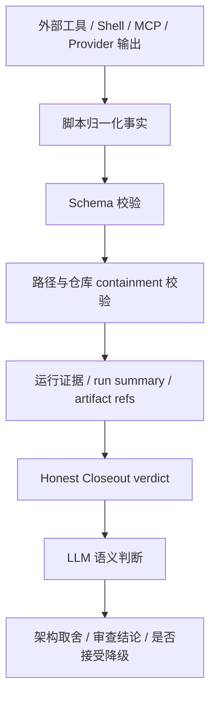
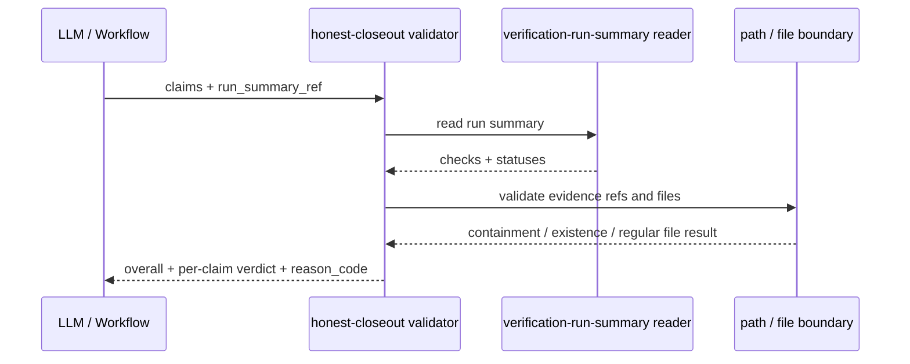

本文对应目录中的当前页「事实地板与语义判断：脚本、契约、证据和 LLM 的边界」。我的架构假设是：spec-first 并不试图让脚本替代工程判断，而是先用脚本、Schema、路径边界和运行证据建立一个**可验证的事实地板**；在这个地板之上，LLM 才负责产品范围、架构取舍、工作流建议、审查结论以及「降级证据是否足够」这类语义判断。该假设由 source/runtime 边界合同直接确认：工具可准备 `reason_code`、artifact path、exit code、schema validation result、readiness/freshness status、bounded excerpts 与 raw log refs，而 LLM 决定 product scope、architecture tradeoffs、workflow recommendation、review conclusion 和 degraded evidence 是否足够。Sources: [source-runtime-customization-boundary.md](docs/contracts/source-runtime-customization-boundary.md#L77-L99)

## 核心边界：脚本给事实，LLM 给判断

spec-first 的事实地板不是「相信模型说测试通过」，而是把可机械判定的内容收束为结构化事实：运行摘要记录 `schema_version`、`profile`、`checks`，每个 check 必须包含 `id`、`service`、`command`、`status`、`exit_code`、`ran`、`required_tools`、`missing_tools`、`log_path`、`reason_code` 与 `redaction_status`；Schema 描述也明确说该合同捕获执行后的结果，不运行命令，也不推断 exit code。Sources: [verification-run-summary.schema.json](docs/contracts/verification/verification-run-summary.schema.json#L1-L80)

LLM 的角色因此被限制在事实地板之上：它可以解释为何某个失败重要、是否接受降级路径、是否需要继续追问或重构方案，但不能把自然语言中的「已验证」「测试通过」直接升级为事实；Honest Closeout 合同明确说明 validator 只检查 structured claim-to-evidence relationships，自然语言 lint 只能 advisory，不能把 closeout 标记为 verified。Sources: [honest-closeout.md](docs/contracts/workflows/honest-closeout.md#L11-L21)

上图中的关键分层是「事实先被校验，再进入判断」。本仓库的内部 CLI 暴露 `verification-run-summary` 和 `honest-closeout` 两个内部子命令：前者负责记录或读取验证摘要，后者负责校验 closeout claims；这说明事实记录与 closeout 判定是明确的脚本边界，而不是散落在 prompt 里的非结构化口头承诺。Sources: [internal.js](src/cli/commands/internal.js#L30-L44)

## 事实地板的四个组成部分

| 组成部分 | 机器能判定什么 | 不能替代什么 |
| --- | --- | --- |
| Schema 合同 | 字段是否存在、类型是否正确、枚举/const/required 等约束是否满足 | 字段背后的业务意义是否合理 |
| 运行摘要 | check 是否记录为 passed/failed/not-run/degraded，exit code 与 ran 是否一致 | 是否覆盖了当前需求的全部风险 |
| 路径边界 | artifact 是否留在 target repo 内，是否避开 generated runtime、Git internals、secret-denied paths | 证据是否足以支持产品或架构决策 |
| Honest Closeout | claim 是否有 evidence refs，refs 是否可解析，状态是否匹配 | 是否应该继续投入、降级发布或改变方案 |

表中的分工来自多个可验证实现：轻量 Schema validator 支持 `type`、`enum`、`const`、`required`、`properties`、`items`、`additionalProperties`、组合关键字、长度/数量/模式/数值边界等，但文档也明确它不是完整 JSON Schema 实现；路径边界由 target repo helper 校验 Git 根、输出 containment、repo-relative 字段、generated runtime denylist 与 `.spec-first/workflows` 例外；运行摘要校验 check 状态与 `ran`/`exit_code` 的一致性。Sources: [schema-validator.md](docs/contracts/schema-validator.md#L1-L30), [target-repo.js](src/cli/helpers/target-repo.js#L44-L126), [verification-run-summary.js](src/cli/helpers/verification-run-summary.js#L391-L435)

## Schema：合同不是语义权威，而是输入门槛

`src/contracts/schema-validator.js` 是事实地板的低层组件。它支持本项目合同测试和 doctor evidence checks 所需的确定性校验，但文档明确说它不是 Ajv 或标准完整 validator 的替代品；如果某个消费者需要完整 JSON Schema 行为，必须引入显式依赖和测试，而不能假设这个 lightweight validator 已覆盖全部语义。Sources: [schema-validator.md](docs/contracts/schema-validator.md#L1-L30)

代码实现也体现了「门槛」而非「全能解释器」：validator 会解析 `$ref`、执行 `allOf`/`anyOf`/`oneOf`、处理 `if/then/else`，检查 expected type、enum、const、required、properties 和 additionalProperties；当类型不匹配时直接产生错误并返回。这些逻辑能证明 payload 是否符合合同形状，却不判断某个架构选择是否合理。Sources: [schema-validator.js](src/contracts/schema-validator.js#L48-L155)

## 运行摘要：把执行事实从口头描述中剥离出来

`verification-run-summary` 的写入路径要求 target repo 必须是 Git repository root，run id 必须是安全标识，workflow 必须属于允许集合；随后它把摘要写入 `.spec-first/workflows/<workflow>/<workspaceSlug>/<runId>/verification-run-summary.json`，并在写入前做 containment 与 Schema 校验。这个流程把「运行过什么」变成一个可读、可复查、可引用的本地证据，而不是依赖 LLM 在对话中记忆。Sources: [verification-run-summary.js](src/cli/helpers/verification-run-summary.js#L140-L219)

运行摘要还把状态一致性变成硬约束：`passed` 必须 `ran === true` 且 `exit_code === 0`，`failed` 必须 `ran === true` 且 `exit_code` 为非零整数，`not-run` 必须 `ran === false` 且 `exit_code === null`；当 `reason_code` 为 `missing_dependency` 或存在 `missing_tools` 时，状态也必须是 `not-run`。这类规则就是事实地板的典型职责：防止「没跑但说通过」「缺依赖但标成功」这类自相矛盾的证据进入后续判断。Sources: [verification-run-summary.js](src/cli/helpers/verification-run-summary.js#L391-L435)

日志路径同样被纳入事实地板。对于已运行 check，`log_path` 必须是允许的 repo-relative `.spec-first/workflows/.../logs/...` 路径，必须留在对应 workflow/run 目录下，必须是普通文件，且会被扫描 credential-bearing URL、credential query parameter 与 secret-like value；即便声明 `redaction_status=redacted`，残留 secret 仍会拒绝写入。Sources: [verification-run-summary.js](src/cli/helpers/verification-run-summary.js#L437-L507)

## Honest Closeout：把「我完成了」拆成可验证 claim

Honest Closeout 合同定义 `honest-closeout.v1` 是 workflow closeout claims 的 structured verdict model，并且明确它是 validator output，不是第二份 durable closeout artifact；核心字段包括 `claims[]` 中的 `claim_type`、`asserted_status`、`evidence_refs[]`、`verdict`、`reason_code`，以及整体 `overall`。Sources: [honest-closeout.md](docs/contracts/workflows/honest-closeout.md#L1-L10), [honest-closeout.schema.json](docs/contracts/workflows/honest-closeout.schema.json#L1-L42)

Honest Closeout 的输入面很窄：payload 只允许 `run_summary_ref` 和 `claims`，claim 只允许 `claim_type`、`asserted_status`、`evidence_refs`，claim type 只能是 `validation`、`impact_surface`、`review`、`knowledge_promotion`；空 claims 会返回 degraded 和 `missing-structured-claims`，而不是让自然语言 closeout 自动通过。Sources: [honest-closeout.js](src/cli/helpers/honest-closeout.js#L14-L18), [honest-closeout.js](src/cli/helpers/honest-closeout.js#L103-L132)

这个交互中，LLM 不能凭「我认为已经验证」直接写结论；它必须提供 structured claims 和 evidence refs。validator 会读取 run summary、解析 `verification-run-summary:<check-id>` refs、检查 evidence status 是否与 asserted status 匹配，并为每条 claim 产生 `consistent`、`unsupported` 或 `degraded`。Sources: [honest-closeout.js](src/cli/helpers/honest-closeout.js#L177-L227)

## 防 cherry-pick：不能只引用通过的子集来伪造通过

验证型 claim 的关键防线是：如果 asserted status 是 `passed`，validator 不只检查被引用的 check 是否通过，还会对整个 run summary 做聚合；如果 run summary 中存在未覆盖的 not-run/failed/degraded check，即便 claim 只引用了 passed 子集，也会返回 degraded 和 `run-summary-checks-uncovered`。代码注释直接说明这是为了防 cherry-pick，避免隐藏未覆盖 check。Sources: [honest-closeout.js](src/cli/helpers/honest-closeout.js#L210-L227)

该行为有回归测试覆盖：测试构造了 `typecheck`、`unit` 两个 passed check 和一个因缺少 docker 而 not-run 的 `integration` check，然后只在 closeout claim 中引用前两个 passed refs；期望输出是 `overall=degraded`，claim verdict 为 `degraded`，reason_code 为 `run-summary-checks-uncovered`。Sources: [honest-closeout.test.js](tests/unit/honest-closeout.test.js#L268-L315)

## 证据引用：路径必须存在、留在仓库内、避开不可信面

对于 `impact_surface`、`review` 和 `knowledge_promotion` 这类路径型 claim，validator 会先用 `validateRepoRelativeField` 校验 evidence refs，再用 containment 检查绝对路径仍在 target repo 内，随后要求 evidence ref 对应的是存在的普通文件，不能是 symlink，也不能 realpath 后逃逸出仓库。Sources: [honest-closeout.js](src/cli/helpers/honest-closeout.js#L229-L294)

路径规则并不把所有本地文件都当作可用证据。target repo helper 明确禁止 `.git` internals、secret-denied paths、generated runtime mirrors，并且只有在显式允许 `allowSpecFirstWorkflows` 且路径以 `.spec-first/workflows/` 开头时，`.spec-first` artifact path 才可被接受。这能防止 generated runtime 或本机状态被误当作 source truth。Sources: [target-repo.js](src/cli/helpers/target-repo.js#L104-L126)

`knowledge_promotion` 的边界更窄：它必须指向 `docs/solutions/**` 下的既有文件，否则返回 `knowledge-evidence-not-solution-doc` 或路径/文件相关错误。测试也覆盖了支持 `docs/solutions/pattern.md`、拒绝 `README.md` 作为 knowledge promotion evidence 的场景。Sources: [honest-closeout.js](src/cli/helpers/honest-closeout.js#L229-L239), [honest-closeout.test.js](tests/unit/honest-closeout.test.js#L364-L399)

## Provider、MCP、Shell 输出：证据来源不是语义权威

source/runtime/customization 边界把 provider 和 external tool facts 明确降级为 evidence、capabilities、logs 与 readiness facts，而不是 semantic authority。它允许脚本准备 `reason_code`、artifact paths、exit codes、schema validation results、readiness/freshness status、bounded excerpts 和 raw log references；同时要求 raw provider/MCP/browser/CLI/shell 输出在进入 prompts、facts blocks、review reports 或 durable artifacts 前经过 schema validation、path containment、excerpt cap、escaping、provenance classification、readiness/freshness classification 与 prompt-injection boundary。Sources: [source-runtime-customization-boundary.md](docs/contracts/source-runtime-customization-boundary.md#L77-L113)

这条边界对高级开发者很重要：外部工具可以显著提高检索和诊断效率，但它们输出的是「被引用的数据」，不是「对当前任务的指令」。因此 raw MCP dump、browser output 或 shell output 不应被广播进普通 prompt bundle；更推荐 compact direct-evidence summaries、changed-file lists、test/log summaries 和 precise source refs。Sources: [source-runtime-customization-boundary.md](docs/contracts/source-runtime-customization-boundary.md#L101-L113)

## Quality Gate：门禁结果是事实输入，不是最终工程裁决

`run-ai-dev-quality-gate.js` 把质量门禁拆成 blocking checks 和 advisory checks：workflow runtime contracts 是阻塞性检查，benchmark fixtures 被加入 checks 并标记 advisory；最终 `passed` 只由非 advisory 的 blocking checks 决定，而 advisory failures 被单独收集 reason_code 和 artifact paths。Sources: [run-ai-dev-quality-gate.js](scripts/run-ai-dev-quality-gate.js#L49-L103)

门禁执行会运行一组固定的 Jest contract tests，输出 `workflow-runtime-contracts.junit.json`，再写入 `ai-dev-quality-gate-result.json` 与 `quality-feedback-topics.json`；返回值包含 gate result artifact path 和 feedback artifact path。这说明质量门禁的产物是可引用事实，后续是否升级为修复计划、是否接受 advisory 风险，仍属于语义判断。Sources: [run-ai-dev-quality-gate.js](scripts/run-ai-dev-quality-gate.js#L105-L164)

`quality-feedback` 也保持被动事实姿态：它只把 failed check 归一化为 topic，包含 `topic_id`、`kind`、`summary`、`scope_hint`、`artifact_paths` 和 tags；它不会自动决定修复方案，也不会替代 reviewer 对失败影响面的判断。Sources: [quality-feedback.js](src/verification/quality-feedback.js#L7-L55)

## Source、Runtime 与 Artifact 的权威层级

| 层级 | 典型路径或对象 | 权威性质 |
| --- | --- | --- |
| Source of Truth | `skills/`、`agents/`、`templates/`、`src/cli/`、`docs/`、`README*`、`AGENTS.md`、`CLAUDE.md`、`CHANGELOG.md` | 改变 spec-first 行为的源头 |
| Generated Runtime Mirrors | `.claude/`、`.codex/`、`.agents/skills/`、`.cursor/skills/`、`.kiro/skills/`、`.qoder/skills/` 等 | 由 source 投影生成，不应手改作为 source fix |
| Workflow Artifacts | `docs/brainstorms/`、`docs/plans/`、`docs/tasks/`、`docs/validation/`、`docs/solutions/`、`.spec-first/workflows/` | 本地证据与工程轨迹，可被读取但不覆盖 source contracts |
| Provider / Tool Facts | shell、MCP、browser、ast-grep、package manager 等输出 | 证据、能力、日志、readiness facts，不拥有语义权威 |

该层级来自 source/runtime/customization boundary：文档列出 source-of-truth 文件，列出 generated runtime mirrors，并说明 workflow artifacts 是 local evidence、not source of behavior，不能覆盖 `skills/`、`agents/`、`templates/`、`src/cli/` 或 `docs/contracts/**` 中的 source contracts。Sources: [source-runtime-customization-boundary.md](docs/contracts/source-runtime-customization-boundary.md#L7-L24), [source-runtime-customization-boundary.md](docs/contracts/source-runtime-customization-boundary.md#L25-L76)

## 普通上下文读取：summary-first，而不是全量吞入运行时目录

Context Governance 合同进一步约束事实进入 LLM 的方式：普通 workflow 默认不把 runtime/generated/audit artifacts 当作普通上下文，而是保留 source-first、summary-first、path-backed evidence 的读取方式；当超出默认上下文预算时应记录 reason，而不是静默读取全量目录。Sources: [context-governance.md](docs/contracts/context-governance.md#L1-L14)

对于 `.spec-first/workflows/**`、`.spec-first/app-audit/**`、`.spec-first/governance/**` 等 runtime artifacts，下游 workflow 应优先读取 canonical summary、validated contract 或明确路径，而不是扫描整棵 `.spec-first/**`；如果需要更深证据，再按具体 artifact path 精确读取，并且不把 raw logs、大 JSON、旧 audit snapshots 或 generated mirrors 广播给 reviewer/worker。Sources: [context-governance.md](docs/contracts/context-governance.md#L71-L83)

## 实战阅读：如何判断一条 closeout 是否可信

判断 closeout 可信度时，先看是否有 structured claims；没有 claims 时，即使自然语言写得很完整，也只应视为 degraded。然后看 validation claim 是否引用 `verification-run-summary:<check-id>`，run summary 是否可读，引用的 check 是否存在，asserted status 是否与 evidence status 匹配；如果 claim 声称 passed，还要确认整个 run summary 的聚合状态也是 passed。Sources: [honest-closeout.md](docs/contracts/workflows/honest-closeout.md#L11-L21), [honest-closeout.js](src/cli/helpers/honest-closeout.js#L188-L227)

再看非 validation claim 的 evidence refs：路径必须是具体 repo-relative path，不能指向 `.git`、secret-denied paths、generated runtime mirrors 或不受支持的 `.spec-first` artifact path；实际文件必须存在、是普通文件、realpath 后仍位于 target repo 内。对 knowledge promotion，还必须落在 `docs/solutions/**`。Sources: [target-repo.js](src/cli/helpers/target-repo.js#L104-L126), [honest-closeout.js](src/cli/helpers/honest-closeout.js#L229-L294)

最后才进入 LLM 语义判断：如果事实地板显示 `degraded`，高级开发者需要判断该降级是否可接受；如果事实地板显示 `unsupported`，应先补证据或修正 claim，而不是让模型用解释性文字弥补证据缺口。这个边界与 source/runtime 合同一致：LLM 可以决定 degraded evidence 是否足够，但 advisory facts 不是 confirmed truth。Sources: [source-runtime-customization-boundary.md](docs/contracts/source-runtime-customization-boundary.md#L91-L99)

## 常见反模式与正确替代

| 反模式 | 为什么越界 | 正确替代 |
| --- | --- | --- |
| 在 closeout 中写「测试已通过」但没有 run summary | 自然语言不能把 closeout 标记为 verified | 记录 `verification-run-summary.v1`，再引用 `verification-run-summary:<check-id>` |
| 只引用通过的 check，隐藏 not-run/failed check | cherry-pick 会降级为 `run-summary-checks-uncovered` | 让 passed claim 反映整个 run summary 的聚合状态 |
| 把 generated runtime mirror 当 source 修复 | generated runtime mirrors 不是 source truth | 修改 source-of-truth 文件，再运行 init/update 刷新 runtime |
| 把 raw MCP 或 shell dump 直接塞进 prompt | raw output 是 untrusted quoted data，不是 instruction | 传 compact summary、bounded excerpt、artifact path 和 provenance |
| 用 `docs/solutions` 之外的文件证明 knowledge promotion | knowledge promotion evidence 必须指向 `docs/solutions/**` | 先沉淀 solution doc，再引用该文件 |

这些替代路径都不是风格偏好，而是本仓库合同和测试中的硬边界：Honest Closeout 对 structured claims、run summary refs 和 knowledge promotion refs 有明确要求；source/runtime boundary 禁止手改 generated runtime mirrors 作为 source fix，并要求 raw output 通过安全边界后再进入提示或 durable artifacts。Sources: [honest-closeout.md](docs/contracts/workflows/honest-closeout.md#L11-L21), [honest-closeout.js](src/cli/helpers/honest-closeout.js#L188-L239), [source-runtime-customization-boundary.md](docs/contracts/source-runtime-customization-boundary.md#L25-L55), [source-runtime-customization-boundary.md](docs/contracts/source-runtime-customization-boundary.md#L101-L113)

## 本页与相邻页面的边界

本页只解释事实地板与语义判断的职责分界：脚本、Schema、路径和证据如何防止 unsupported claim 进入工程结论，以及 LLM 在何处重新接管判断。若你要继续理解 source/runtime 的治理模型，应阅读 [Generated Runtime 与 Source of Truth 的治理模型](14-generated-runtime-yu-source-of-truth-de-zhi-li-mo-xing)；若要理解契约体系本身，应阅读 [契约文档与 Schema 校验体系](23-qi-yue-wen-dang-yu-schema-xiao-yan-ti-xi)；若要理解 closeout 在任务包和运行证据中的使用，应阅读 [任务包、运行证据与 Honest Closeout](24-ren-wu-bao-yun-xing-zheng-ju-yu-honest-closeout)。Sources: [source-runtime-customization-boundary.md](docs/contracts/source-runtime-customization-boundary.md#L1-L6), [schema-validator.md](docs/contracts/schema-validator.md#L1-L30), [honest-closeout.md](docs/contracts/workflows/honest-closeout.md#L1-L21)