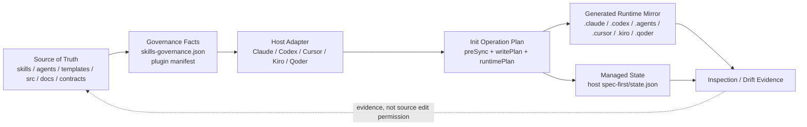
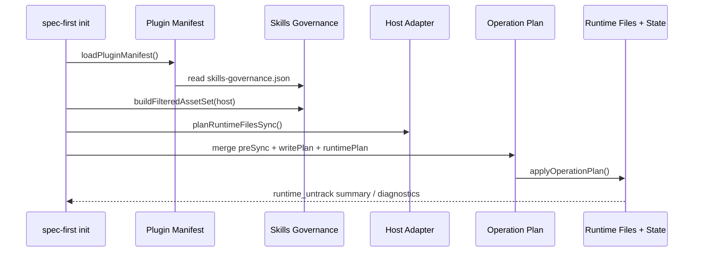
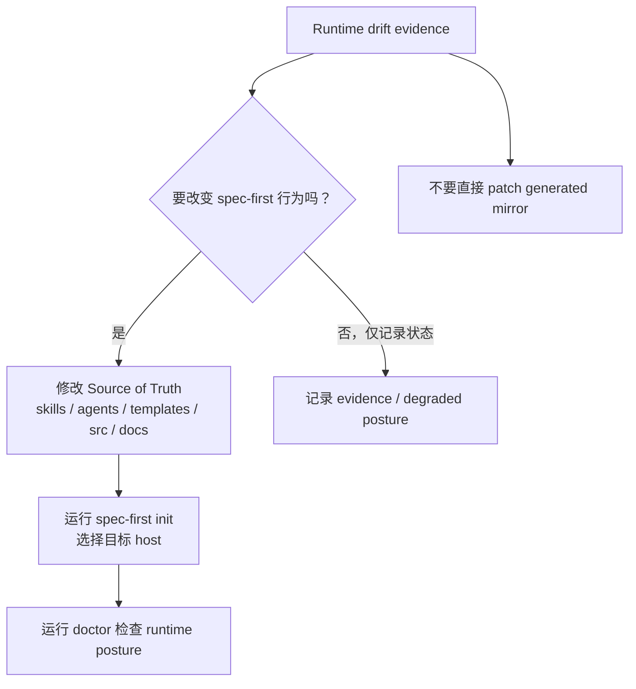
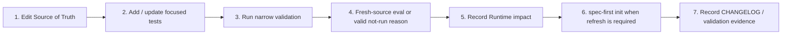

本页解释 spec-first 如何治理 **Generated Runtime（宿主运行时镜像）** 与 **Source of Truth（行为事实源）** 的边界：哪些文件应该被开发者修改，哪些文件只应由 `spec-first init` 生成或刷新，运行时漂移如何被发现与重建，以及为什么外部工具事实不能取代语义判断。本页位于深入解析的「架构与设计理念」部分，专注治理模型本身；CLI 命令细节、初始化流水线、宿主适配器与 drift 检测的操作说明分别属于后续页面。Sources: [source-runtime-customization-boundary.md](docs/contracts/source-runtime-customization-boundary.md#L1-L6), [init.js](src/cli/commands/init.js#L974-L1018)

## 核心假设：运行时是投影，不是事实源

spec-first 的第一性原则是：**行为从仓库内受版本控制的源资产产生，宿主目录只是这些源资产在不同 AI Coding Host 上的运行时投影**。契约明确列出 Source of Truth 包括 `skills/`、`agents/`、`templates/`、`src/cli/`、`src/cli/contracts/**`、`docs/`、`README*`、`AGENTS.md`、`CLAUDE.md`、`CHANGELOG.md`；同时声明 `.claude/`、`.codex/`、`.agents/skills/`、`.cursor/skills/`、`.kiro/skills/`、`.qoder/commands/spec-*.md` 等为 generated runtime mirrors 或 host-local config output，不应作为源码修复入口。Sources: [source-runtime-customization-boundary.md](docs/contracts/source-runtime-customization-boundary.md#L7-L24), [source-runtime-customization-boundary.md](docs/contracts/source-runtime-customization-boundary.md#L25-L46)

这个边界不是文档约定而已，CLI 实现也把它编码为生成链路：`buildInitPlan` 先规范化目标 host 与 target，再进入 project 或 workspace 初始化计划；`applyInitPlan` 根据 plan mode 分派到 project 或 workspace 应用逻辑。也就是说，运行时写入不是临时脚本散落执行，而是通过可预览、可汇总、可回滚的 operation plan 执行。Sources: [init.js](src/cli/commands/init.js#L974-L1018), [init.js](src/cli/commands/init.js#L1231-L1256)

上图中的关键约束是单向性：Source of Truth 经治理事实与宿主适配器生成 Runtime；Runtime 与 State 可被检查并产生 drift evidence，但 drift evidence 的含义是「源与运行时可能需要重新对齐」，不是允许直接 patch mirror。契约明确要求修改行为时先改 source，再运行 `spec-first init`，并用 `spec-first doctor --claude|--codex|--cursor|--kiro|--qoder` 检查 runtime drift。Sources: [source-runtime-customization-boundary.md](docs/contracts/source-runtime-customization-boundary.md#L46-L56), [plugin.js](src/cli/plugin.js#L107-L150)

## Source of Truth 的组成：行为、契约与入口文档

Source of Truth 覆盖三类源资产：第一类是行为资产，如 `skills/`、`agents/`、`templates/`；第二类是生成与校验代码，如 `src/cli/` 与 `src/cli/contracts/**`；第三类是治理文档与入口文件，如 `docs/`、`AGENTS.md`、`CLAUDE.md`、`CHANGELOG.md`。其中 `AGENTS.md` 与 `CLAUDE.md` 是 checked-in host entry documents，其 spec-first managed blocks 是由生成器治理的 source slices，但它们不等同于 generated runtime mirrors。Sources: [source-runtime-customization-boundary.md](docs/contracts/source-runtime-customization-boundary.md#L7-L24), [instruction-bootstrap.js](src/cli/instruction-bootstrap.js#L132-L138)

Source of Truth 的另一个组成是技能治理数据。`plugin.js` 从 `src/cli/contracts/dual-host-governance/skills-governance.json` 读取技能治理事实，并结合 `package.json`、`templates/claude/commands/spec`、`skills`、`agents` 生成 plugin manifest；该 manifest 决定哪些 workflow command、skill 与 agent 会进入 host runtime。Sources: [plugin.js](src/cli/plugin.js#L15-L30), [plugin.js](src/cli/plugin.js#L107-L150)

| 资产类别 | 示例路径 | 治理角色 | 修改入口 |
|---|---|---|---|
| 行为源资产 | `skills/`, `agents/`, `templates/` | 定义 skill、agent、command template 的原始行为 | 直接修改 source |
| 生成代码 | `src/cli/`, `src/cli/contracts/**` | 定义 init、adapter、state、schema 与生成逻辑 | 直接修改 source 并测试 |
| 契约与文档 | `docs/`, `docs/contracts/**` | 约束边界、质量门禁与团队共识 | 直接修改 source |
| Host entry source slice | `AGENTS.md`, `CLAUDE.md` | 仓库级入口指令与 managed block | 修改受控源或生成器，不把 runtime mirror 当源 |
| Generated runtime mirror | `.claude/`, `.codex/`, `.cursor/`, `.kiro/`, `.qoder/` | 宿主可加载的投影产物 | 不手改，改 source 后 init 刷新 |

Sources: [source-runtime-customization-boundary.md](docs/contracts/source-runtime-customization-boundary.md#L7-L24), [source-runtime-customization-boundary.md](docs/contracts/source-runtime-customization-boundary.md#L25-L46)

## Runtime Mirror 的范围：宿主表面各不相同，但治理规则一致

不同宿主暴露不同 runtime surface。Claude 使用 `.claude/commands`、`.claude/skills`、`.claude/spec-first/workflows`、`.claude/agents` 与 `.claude/spec-first/state.json`；Codex 使用 `.agents/skills` 作为用户可见 workflow entrypoint，`.codex/agents` 作为 agent profile，`.codex/spec-first/state.json` 保存状态，并把 `.codex/commands/spec/` 定义为 legacy compatibility cleanup target；Cursor P0 不生成 command，也不投影 spec-first agents，使用 `.cursor/skills` 与 `.cursor/spec-first/state.json`；Kiro 使用 `.kiro/skills`、`.kiro/agents`、`.kiro/spec-first/state.json`；Qoder 使用 `.qoder/commands`、`.qoder/skills`、`.qoder/agents` 与 `.qoder/spec-first/state.json`。Sources: [claude.js](src/cli/adapters/claude.js#L48-L82), [codex.js](src/cli/adapters/codex.js#L27-L75), [cursor.js](src/cli/adapters/cursor.js#L63-L101), [kiro.js](src/cli/adapters/kiro.js#L37-L70), [qoder.js](src/cli/adapters/qoder.js#L39-L72)

| Host | Command surface | Skill / workflow surface | Agent surface | State path | 治理含义 |
|---|---|---|---|---|---|
| Claude | `.claude/commands` | `.claude/skills`, `.claude/spec-first/workflows` | `.claude/agents` | `.claude/spec-first/state.json` | command 与 workflow skill 分离 |
| Codex | 不生成当前 command；legacy `.codex/commands/spec` 仅清理 | `.agents/skills` | `.codex/agents` | `.codex/spec-first/state.json` | project-scoped skill discovery |
| Cursor | 不生成 command | `.cursor/skills` | 不投影 spec-first agents | `.cursor/spec-first/state.json` | generated-runtime preview |
| Kiro | 不生成 command | `.kiro/skills` | `.kiro/agents` | `.kiro/spec-first/state.json` | skill-first runtime |
| Qoder | `.qoder/commands` | `.qoder/skills` | `.qoder/agents` | `.qoder/spec-first/state.json` | command 与 skill 同宿主投影 |

Sources: [claude.js](src/cli/adapters/claude.js#L48-L82), [codex.js](src/cli/adapters/codex.js#L27-L75), [cursor.js](src/cli/adapters/cursor.js#L63-L101), [kiro.js](src/cli/adapters/kiro.js#L37-L70), [qoder.js](src/cli/adapters/qoder.js#L39-L72)

尽管 surface 不同，adapter 抽象保持一致：每个平台必须定义 `runtimeRoot`、`managedRoot`、`commandRoot`、`skillsRoot`、`workflowsRoot`、`agentsRoot`、`stateFile` 与 `instructionFile`；平台可以通过 `hasCommands` 与 `supportsAgents` 声明当前是否安装 command 或 agent profile。这让治理模型可以用统一 plan/state/clean 机制处理差异，而不是让每个宿主成为独立规则岛。Sources: [base.js](src/cli/adapters/base.js#L13-L84), [base.js](src/cli/adapters/base.js#L35-L48)

## 生成链路：从治理事实到 Operation Plan

生成链路的入口是 `buildProjectInitPlan`。它先读取 bundled agents、agent support files、plugin manifest 与按宿主过滤后的 asset set，然后调用 `planBundledAssetSync` 生成资产同步计划，并调用 adapter 的 `planRuntimeFilesSync` 生成宿主特有 runtime 文件计划。接着它构造 `previewState`，把将要同步的 commands、skills、workflowSkills、agents 与 support files 固化为下一版 managed state。Sources: [init.js](src/cli/commands/init.js#L1020-L1119), [init.js](src/cli/commands/init.js#L1146-L1150)

技能是否投影到某个宿主由 `buildFilteredAssetSet` 基于 skills governance 决定。对于 `workflow_command`，若某宿主 delivery 是 `command`，则加入 commands 与 workflowSkills；若 delivery 是 `skill`，则只加入 workflowSkills；其他 delivery 被记录为 skipped。这个机制把「同一个源 skill 如何进入不同 host runtime」收敛为治理数据，而不是散落在文档或模板命名约定中。Sources: [plugin.js](src/cli/plugin.js#L586-L620), [plugin.js](src/cli/plugin.js#L252-L279)

最终写入由 `applyProjectInitPlan` 完成：若检测到 destructive reset plan，它会先创建 runtime rollback backup，再依次应用 destructive reset、preSyncPlan 与 writePlan；若无 destructive reset，则直接应用 preSyncPlan 与 writePlan。成功后还会执行全局 developer profile 写入，并返回 runtime untrack summary。Sources: [init.js](src/cli/commands/init.js#L1259-L1295), [state.js](src/cli/state.js#L575-L620)

## Managed State：清理、增量更新与 hard reset 的判定依据

Managed State 是运行时治理的索引，而不是业务事实源。`state.js` 要求 managed state 至少包含 `commands`、`skills`、`workflowSkills`、`agents`、`agentSupportFiles`，并通过 `manifestVersion`、`platform` 与这些数组描述当前 host runtime 中由 spec-first 管理的资产集合。写入 state 时会 normalize、validate，再通过 atomic write 写入 host 的 state file。Sources: [state.js](src/cli/state.js#L6-L12), [state.js](src/cli/state.js#L86-L124)

State 的安全边界也被机械化校验：路径必须是相对路径，不能包含 NUL、反斜杠、绝对盘符、危险片段、Windows reserved names，且部分字段默认不允许嵌套路径。这使 clean、obsolete removal、hard reset 等删除操作可以依赖 state，同时避免被不安全 state 条目引导到项目根之外。Sources: [state.js](src/cli/state.js#L127-L187), [state.js](src/cli/state.js#L575-L585)

当上一版 state 存在时，init 会比较 previousState 与 previewState，生成 obsolete asset removal plan；如果检测到 legacy state 或 current runtime drift，则生成 hard reset plan。hard reset 会删除 state 中记录的 managed assets，并在需要时删除 command root 或 workflow root，以确保 runtime mirror 回到由当前 source 可重新生成的形态。Sources: [init.js](src/cli/commands/init.js#L1175-L1206), [state.js](src/cli/state.js#L287-L389), [state.js](src/cli/state.js#L395-L467)

| 状态场景 | 触发机制 | 处理方式 | 目的 |
|---|---|---|---|
| 正常增量刷新 | previousState 可读且未检测到 drift | 移除 obsolete managed assets，再写入新 runtime | 避免旧 managed 文件残留 |
| Legacy state | state shape 不符合当前结构 | managed hard reset 后重建 | 从旧安装格式迁移到当前治理模型 |
| Current runtime drift | 当前 runtime 与 managed 预期不一致 | managed hard reset 后重建 | 用 source 重新投影，避免手改 runtime 扩散 |
| Retired runtime asset | 已退役路径仍存在 | prune retired runtime assets | 清除历史命名空间或废弃目录 |
| Namespace stray command | command dir 中存在非当前 managed 的 `spec-*.md` | prune command namespace | 保持公开入口面受治理 |

Sources: [init.js](src/cli/commands/init.js#L1175-L1225), [state.js](src/cli/state.js#L360-L389), [state.js](src/cli/state.js#L473-L535)

## Managed Blocks：入口文件中的可替换 source slice

`AGENTS.md` 与 `CLAUDE.md` 不是 runtime mirror，但它们内部包含 spec-first managed bootstrap block。`instruction-bootstrap.js` 用 `<!-- spec-first:bootstrap:start -->` 与 `<!-- spec-first:bootstrap:end -->` 包裹受管区域；写入时若已有完整 marker，则替换 marker 内内容；若 marker 损坏，则按更保守规则清理已知 bootstrap bodies；删除时只移除受管 block 或已知旧内容。Sources: [instruction-bootstrap.js](src/cli/instruction-bootstrap.js#L5-L20), [instruction-bootstrap.js](src/cli/instruction-bootstrap.js#L84-L130)

这个设计体现了「源文件内局部受管」与「生成 runtime mirror」的区别：入口文件本身是 checked-in source，受管 block 是 source slice；而 `.claude/skills`、`.agents/skills`、`.cursor/skills` 等是宿主运行时镜像。前者可作为仓库指令源参与版本控制，后者不应通过手改来改变 spec-first 行为。Sources: [source-runtime-customization-boundary.md](docs/contracts/source-runtime-customization-boundary.md#L23-L24), [source-runtime-customization-boundary.md](docs/contracts/source-runtime-customization-boundary.md#L25-L46)

Bootstrap block 的内容也承载 source/runtime 治理语义：它要求 substantial work 前进入公开 workflow，轻量事实问答或低风险小改动可直接处理；同时声明 runtime context 默认排除 `.spec-first/audits/**`、`.spec-first/governance/**` 和 generated mirrors，只有 setup/update/runtime-drift/audit/governance-health 等明确运行时任务才按需读取这些路径。Sources: [instruction-bootstrap.js](src/cli/instruction-bootstrap.js#L152-L168), [instruction-bootstrap.js](src/cli/instruction-bootstrap.js#L183-L199)

## Git Ignore 与 Untrack：让 runtime 留在本地，不污染源码历史

Generated runtime 的另一个治理层是 `.gitignore`。`gitignore-policy.js` 定义 spec-first generated runtime assets，包括 `.claude/commands/spec/`、`.claude/skills/`、`.codex/`、`.agents/skills/`、`.cursor/skills/`、`.kiro/skills/`、`.qoder/commands/spec-*.md`、`.context/spec-first/` 等；同时忽略 local setup 与 workflow runtime artifacts，如 `.spec-first/config.local.yaml`、`.spec-first/audits/`、`.spec-first/governance/`、`.spec-first/workflows/`、`.spec-first/sessions/`。Sources: [gitignore-policy.js](src/cli/gitignore-policy.js#L6-L61), [gitignore-policy.js](src/cli/gitignore-policy.js#L73-L120)

当这些 runtime 路径已经被 Git 跟踪时，`runtime-untrack.js` 会用 `git ls-files -z --` 查出匹配 spec-first ignore patterns 的 tracked paths，生成 `untrack_index` operations；应用时逐个执行 `git rm --cached --quiet -f -- <path>`，只从 index 移除，不删除工作区文件。Sources: [runtime-untrack.js](src/cli/runtime-untrack.js#L9-L41), [runtime-untrack.js](src/cli/runtime-untrack.js#L43-L89)

这一层的治理意图非常明确：runtime 可以存在于本地以供宿主加载，但不应成为长期源码历史的一部分。初始化成功输出也会打印 generated commands、generated skills、generated agents、gitignore 更新与 runtime untrack summary，让开发者看到 source 与 runtime 的分离是否已落实。Sources: [init.js](src/cli/commands/init.js#L1320-L1359), [state.js](src/cli/state.js#L611-L620)

## Drift Evidence：证据推动重新生成，不授权手改 mirror

契约把 `spec-first doctor --claude|--codex|--cursor|--kiro|--qoder` 的结果定义为 runtime drift evidence：它说明 source 与 runtime 可能需要 reconciliation，但不是直接 patch mirror 的许可。Cursor 的 doctor 还被特别限定为 generated-runtime preview posture，不证明 Cursor 本地 loader 已成功发现或调用这些 assets。Sources: [source-runtime-customization-boundary.md](docs/contracts/source-runtime-customization-boundary.md#L52-L56), [cursor.js](src/cli/adapters/cursor.js#L139-L144)

各 adapter 的 `inspectRuntimeFiles` 会产出宿主特有检查。例如 Claude 会扫描 runtime skill 与 agent markdown，检查 canonical agent name 是否残留、Task agent refs 是否 unresolved；Cursor 会报告 generated-runtime preview，并检查意外 command runtime directory 或 agents runtime directory；Kiro 会检查意外 command runtime directory、skill names 与 agent frontmatter；Qoder 会检查 command files、skill names 与 agent frontmatter。Sources: [claude.js](src/cli/adapters/claude.js#L132-L181), [cursor.js](src/cli/adapters/cursor.js#L133-L174), [kiro.js](src/cli/adapters/kiro.js#L122-L150), [qoder.js](src/cli/adapters/qoder.js#L150-L173)

该流程避免了一个常见反模式：在 `.claude/skills` 或 `.qoder/commands` 中快速修一个 prompt，然后忘记回写 source，导致下次 init 被覆盖。正确做法是将 runtime drift 当作定位线索，将语义修复落到 Source of Truth，再通过 init 重新投影到目标宿主。Sources: [source-runtime-customization-boundary.md](docs/contracts/source-runtime-customization-boundary.md#L46-L56), [init.js](src/cli/commands/init.js#L1208-L1225)

## Provider 与 Tool Facts：事实地板，不是语义权威

契约把 ast-grep、browser tools、MCP tools、package managers、shell commands 与其他外部工具定位为 evidence/capability/log/readiness facts 的提供者，而不是 semantic authority。脚本与工具可以准备 `reason_code`、artifact paths、exit codes、schema validation results、readiness/freshness status、bounded excerpts 与 raw log references；LLM 负责 product scope、architecture tradeoffs、workflow recommendation、review conclusion，以及 degraded evidence 是否足够。Sources: [source-runtime-customization-boundary.md](docs/contracts/source-runtime-customization-boundary.md#L77-L100)

Raw output 进入 prompt、facts block、review report、validation doc 或 durable artifact 前必须穿过安全边界，包括 schema validation、target-repo path containment、excerpt length cap、Markdown/JSON/YAML/shell/prompt escaping、provenance classification、readiness/freshness classification 与 prompt-injection boundary。这个边界保证 runtime 治理不被外部工具输出反向劫持。Sources: [source-runtime-customization-boundary.md](docs/contracts/source-runtime-customization-boundary.md#L101-L114)

## Workflow Artifacts：本地证据，不覆盖行为契约

`docs/brainstorms/`、`docs/plans/`、`docs/tasks/`、`docs/validation/`、`docs/solutions/`、`.spec-first/workflows/` 与 `.spec-first/app-audit/` 被契约定义为 target-repo workflow artifacts。它们可以被下游 workflows、reviews 与 humans 读取，但不能覆盖 `skills/`、`agents/`、`templates/`、`src/cli/` 或 `docs/contracts/**` 中的 source contracts。Sources: [source-runtime-customization-boundary.md](docs/contracts/source-runtime-customization-boundary.md#L63-L75)

这一区分对高级开发者尤其重要：artifact 可以保存决策过程、验证结果或知识沉淀，但它不是行为分发面。若要改变 workflow 如何运行、agent 如何审查、host runtime 如何生成，仍必须修改 source-of-truth 文件并通过 init 或测试验证治理链路。Sources: [source-runtime-customization-boundary.md](docs/contracts/source-runtime-customization-boundary.md#L136-L148), [plugin.js](src/cli/plugin.js#L561-L584)

## Customization Flow：治理模型的最小闭环

契约规定的自定义闭环是：先编辑 source-of-truth 文件；为变更的 contract 添加或更新聚焦测试；先运行窄验证命令；若涉及 skill/agent prose，则运行 fresh-source eval 或记录合法 not-run reason；显式记录 `Runtime impact`；只有当任务或发布需要 runtime refresh 时，才运行 `spec-first init` 并选择目标 host；最后在 `CHANGELOG.md` 与 phase validation artifact 中记录 runtime impact 与 validation。Sources: [source-runtime-customization-boundary.md](docs/contracts/source-runtime-customization-boundary.md#L136-L148)

这个闭环的实际价值在于把三种责任拆开：脚本负责机械可判定的不变量与 deterministic facts；LLM 负责语义充分性判断；宿主 runtime 负责加载当前投影结果。任何绕开 Source of Truth 直接修改 runtime mirror 的做法，都会破坏这三者的责任分离。Sources: [source-runtime-customization-boundary.md](docs/contracts/source-runtime-customization-boundary.md#L147-L148), [state.js](src/cli/state.js#L575-L620)

## 与相邻页面的阅读关系

如果你需要理解这套治理模型在 CLI 中如何被用户触发，下一步阅读 [CLI 命令体系：doctor、init、update、clean、tasks 与 session](15-cli-ming-ling-ti-xi-doctor-init-update-clean-tasks-yu-session)；如果你需要跟踪 `spec-first init` 如何从资产发现走到原子写入，阅读 [初始化流水线：资产发现、操作计划、原子写入与状态记录](16-chu-shi-hua-liu-shui-xian-zi-chan-fa-xian-cao-zuo-ji-hua-yuan-zi-xie-ru-yu-zhuang-tai-ji-lu)；如果你关注不同宿主 runtime surface 的具体投影差异，阅读 [宿主适配器设计：统一源资产到不同 Runtime Surface 的投影](17-su-zhu-gua-pei-qi-she-ji-tong-yuan-zi-chan-dao-bu-tong-runtime-surface-de-tou-ying)；如果你要操作 drift 检查与修复路径，阅读 [运行时健康检查与 Drift 检测](18-yun-xing-shi-jian-kang-jian-cha-yu-drift-jian-ce)。Sources: [init.js](src/cli/commands/init.js#L115-L150), [init.js](src/cli/commands/init.js#L933-L971), [adapters/index.js](src/cli/adapters/index.js#L1-L40), [source-runtime-customization-boundary.md](docs/contracts/source-runtime-customization-boundary.md#L52-L56)