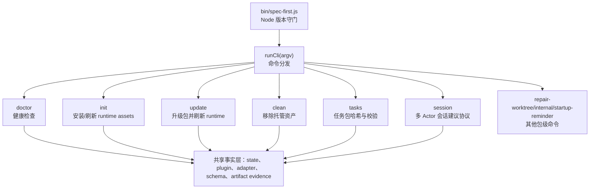
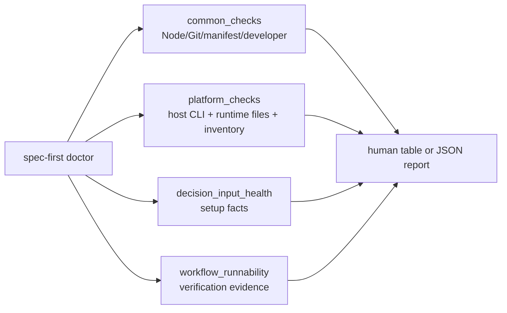
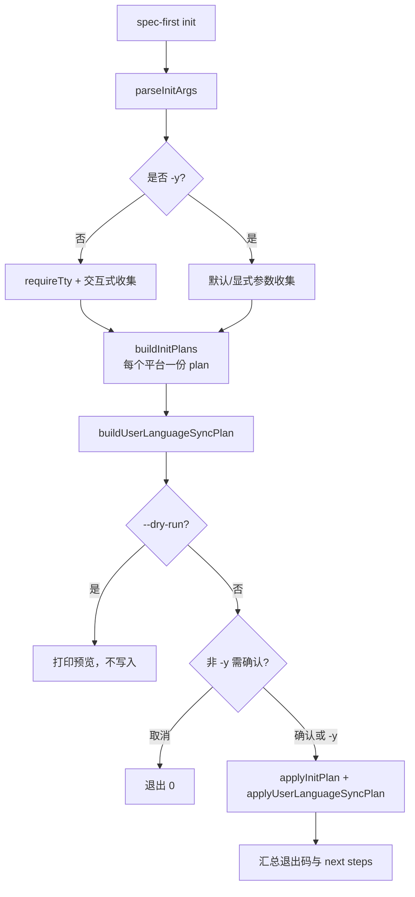

本页位于“命令行与运行时生成”小节，当前目录位置是 [CLI 命令体系：doctor、init、update、clean、tasks 与 session](15-cli-ming-ling-ti-xi-doctor-init-update-clean-tasks-yu-session)。它只解释 `spec-first` 包级 CLI 的命令分发、命令职责、退出码语义与可观测输出，不展开初始化流水线内部、宿主适配器投影细节或 Drift 检测算法；这些内容分别应继续阅读 [初始化流水线：资产发现、操作计划、原子写入与状态记录](16-chu-shi-hua-liu-shui-xian-zi-chan-fa-xian-cao-zuo-ji-hua-yuan-zi-xie-ru-yu-zhuang-tai-ji-lu)、[宿主适配器设计：统一源资产到不同 Runtime Surface 的投影](17-su-zhu-gua-pei-qi-she-ji-tong-yuan-zi-chan-dao-bu-tong-runtime-surface-de-tou-ying) 与 [运行时健康检查与 Drift 检测](18-yun-xing-shi-jian-kang-jian-cha-yu-drift-jian-ce)。Sources: [index.js](src/cli/index.js#L158-L181), [bin/spec-first.js](bin/spec-first.js#L1-L24)

## 架构假设：CLI 是“薄分发层 + 命令模块 + 共享事实层”

从第一原则看，`spec-first` CLI 的核心不是把所有逻辑堆在入口文件，而是把入口保持为**运行环境守门 + 参数分发 + 统一退出码收口**。可验证的证据是：可执行文件 `bin/spec-first.js` 先调用 Node 版本检查，再把 `process.argv.slice(2)` 交给 `runCli(argv)`，最后把返回值写入 `process.exitCode`；未知异常统一转成错误消息与退出码 `1`。Sources: [bin/spec-first.js](bin/spec-first.js#L1-L24)

`src/cli/index.js` 是命令分发器：它导入 `doctor`、`init`、`clean`、`update`、`tasks`、`session` 等命令模块，并按第一个参数选择对应 `run*` 函数；没有命令或传入 `--help/-h` 时打印帮助，`--version/-v` 打印版本，未知命令返回 `2`。Sources: [index.js](src/cli/index.js#L1-L80)

这个分层解释了为什么本文把 CLI 命令理解为“控制面”：`doctor` 读取事实并报告，`init` 生成和写入托管资产，`update` 先升级包再重新调用 `init` 刷新 runtime，`clean` 依据 state 删除托管范围内的资产，`tasks` 只做任务包身份与结构验证，`session` 只写入建议性会话记录而不是强锁。Sources: [index.js](src/cli/index.js#L44-L73), [update.js](src/cli/commands/update.js#L18-L29), [tasks.js](src/cli/commands/tasks.js#L181-L192), [session.js](src/cli/commands/session.js#L288-L303)

## 命令速查表

`spec-first --help` 暴露的公开命令包括 `doctor`、`init`、`update`、`clean`、`repair-worktree`、`tasks` 与 `session`；其中本页聚焦 `doctor/init/update/clean/tasks/session` 六类日常命令。CLI 帮助文本也明确说明：安装后的 workflow entrypoints 由宿主在 `spec-first init` 之后提供，因此 `spec-first` 包级命令与宿主内的工作流入口不是同一层。Sources: [index.js](src/cli/index.js#L158-L181)

| 命令 | 核心用途 | 常见选项 | 成功退出码 | 失败/异常退出码 |
|---|---|---|---:|---|
| `doctor` | 检查 Node/Git、manifest、developer profile、宿主 CLI、runtime assets 与 workflow runnability | `--claude --codex --cursor --kiro --qoder --json` | `0` | JSON 模式有错误返回 `3`；用法错误返回 `2` |
| `init` | 交互式或非交互式安装/刷新 workflows、skills、agents、developer profile 与语言偏好同步 | `--claude --codex --cursor --kiro --qoder -y --all-repos --repo <path> --lang <zh|en> --dry-run` | `0` | 用法/非交互环境错误返回 `2`；计划或应用失败返回 `1` |
| `update` | 执行 `npm install -g spec-first@latest`，成功后启动 fresh `spec-first init` 刷新 runtime | `-h/--help` | `0` | 用法错误 `2`；npm 或 runtime refresh 失败 `1` |
| `clean` | 删除当前项目中 spec-first 托管资产，或清理 workspace orphan 证据列出的支持路径 | `--claude|--codex|--cursor|--kiro|--qoder --dry-run`、`--workspace-orphans --confirm` | `0` | 用法错误 `2`；state/JSON/安全校验失败 `1` |
| `tasks` | 计算 source plan 规范化哈希，或校验派生 task pack 的身份、新鲜度与结构 | `hash <plan> --json`、`validate <task-pack> --repo <path> --json` | `0` | 缺参/未知选项 `2`；校验失败或文件错误 `1` |
| `session` | 注册、心跳、注销、列出多 Actor 会话记录；记录是 advisory，不是 hard lock | `register/list/heartbeat/unregister --json` | `0` | 缺参/未知选项 `2`；注册冲突或存储操作失败 `1` |

上表的边界来自各命令实现：`doctor` 在 JSON 输出时根据 `has_error` 返回 `3`，`init` 在参数解析、TTY 缺失、计划错误与应用结果之间区分退出码，`update` 文档注释固定了 `0/1/2` 语义，`clean` 对 host flag 和 workspace orphan 模式做互斥校验，`tasks` 的帮助明确“不判断任务拆分质量或业务范围”，`session` 的帮助明确记录位于 `.spec-first/sessions/<id>.json` 且不是强锁。Sources: [doctor.js](src/cli/commands/doctor.js#L68-L103), [init.js](src/cli/commands/init.js#L126-L150), [init.js](src/cli/commands/init.js#L210-L266), [update.js](src/cli/commands/update.js#L18-L43), [clean.js](src/cli/commands/clean.js#L25-L55), [tasks.js](src/cli/commands/tasks.js#L181-L192), [session.js](src/cli/commands/session.js#L288-L303)

## `doctor`：把“能不能跑”拆成可检查事实

`doctor` 的第一层逻辑是选择平台：用户显式传入 `--claude/--codex/--cursor/--kiro/--qoder` 时只检查这些平台；没有传 host 参数时自动检测；如果没有检测到任何平台，普通输出提示运行 `spec-first init`，JSON 输出则仍打印空平台报告。Sources: [doctor.js](src/cli/commands/doctor.js#L28-L72)

`doctor` 的公共检查包含 Node.js 版本、Git、runtime asset manifest 与全局 developer profile；其中 Node.js 要求主版本大于等于 20，Git 通过 `git --version` 检查，manifest 通过 `loadPluginManifest()` 和 `listBundledCommands()` 读取，developer profile 位于 `~/.spec-first/.developer` 并要求包含非空 `name` 与 `lang`，且 `lang` 只能是 `zh` 或 `en`。Sources: [doctor.js](src/cli/commands/doctor.js#L106-L146), [doctor.js](src/cli/commands/doctor.js#L415-L440), [doctor.js](src/cli/commands/doctor.js#L828-L869)

平台检查分为三组：宿主 CLI 可用性、核心 runtime 文件与 inventory。宿主 CLI 检查会按平台选择 `claude`、`codex`、`agent`、`kiro` 或 `qodercli` 并执行 `--version`；runtime 文件来自 adapter 的 `inspectRuntimeFiles`，命令文件在 adapter 支持 commands 时检查；inventory 检查 bundled skills、agents 与 agent support files，且当 adapter 声明不支持 agents 时会跳过 agent 检查。Sources: [doctor.js](src/cli/commands/doctor.js#L148-L200), [doctor.js](src/cli/commands/doctor.js#L443-L487)

`doctor --json` 输出的不只是 check 列表，还包含 `install_health`、`runtime_asset_health`、`host_readiness`、`decision_input_health` 与 `workflow_runnability` 等汇总字段；这些字段由公共检查、平台 runtime 检查、宿主检查、setup facts 和 workflow verification evidence 汇总而来。Sources: [doctor.js](src/cli/commands/doctor.js#L489-L553)

`workflow_runnability` 的含义是“是否具备可运行工作流的事实基础”，不是 LLM 对业务质量的判断。实现上，它要求 runtime assets ready、host readiness 非 error、managed state 存在、workflow surface resolved，并读取 workflow verification evidence；证据缺失、schema invalid、gate 未解析、不相关、过期或 freshness unknown 都会给出 fallback reason。Sources: [doctor.js](src/cli/commands/doctor.js#L555-L614), [doctor.js](src/cli/commands/doctor.js#L802-L826)

## `init`：安装与刷新 runtime assets 的统一入口

`init` 支持五类宿主选择：Claude Code、Codex、Cursor、Kiro、Qoder；其中 `-y/--yes` 的默认宿主是 `defaultForYes: true` 的 Claude Code 与 Codex，Cursor/Kiro/Qoder 默认不随 `-y` 自动选择，除非用户显式传入对应 host flag。Sources: [init.js](src/cli/commands/init.js#L77-L113), [init.js](src/cli/commands/init.js#L580-L584)

参数层面，`init` 解析 `--claude/--codex/--cursor/--kiro/--qoder`、`-y/--yes`、`--dry-run`、`--all-repos`、`--repo`、`-u/--user`、`--lang`、`--sync-user-language` 与 `--no-sync-user-language`；当没有 `-y` 时必须有交互式终端，否则返回错误，并提示使用 `-y/--yes` 搭配默认或显式 host flag。Sources: [init.js](src/cli/commands/init.js#L126-L145), [init.js](src/cli/commands/init.js#L276-L360)

输入收集阶段会先解析语言、宿主、开发者身份、语言同步偏好和目标仓库范围。宿主选择可来自显式参数、`-y` 默认值、或交互式多选框；交互式多选会使用上次记录的 host 选择做预勾选，但会过滤未知或已停用 host id。Sources: [init.js](src/cli/commands/init.js#L430-L455), [init.js](src/cli/commands/init.js#L586-L604)

执行阶段先为每个平台构建 init plan，再构建 user-language sync plan；如果发现 plan error，命令返回 `1`；如果是 `--dry-run`，只打印预览并返回 `0`；非 `--yes` 模式会打印预览并要求用户确认，取消时返回 `0`。Sources: [init.js](src/cli/commands/init.js#L200-L231)

真正写入时，`init` 对每个 plan 调用 `applyInitPlan`，随后应用 user-language sync plan，并根据所有 plan 结果、语言同步结果和 workspace summary 更新失败情况决定最终退出码；成功时会打印平台相关 next steps。Sources: [init.js](src/cli/commands/init.js#L233-L266)

## `update`：升级包后启动 fresh `init`

`update` 的边界非常明确：它不做版本比较、不检测安装方式，而是直接运行 `npm install -g spec-first@latest`；升级成功后不在旧进程内继续生成 runtime，而是启动新的 `spec-first init` 子进程刷新本地 runtime，以避免旧进程与新生成逻辑版本错位。Sources: [update.js](src/cli/commands/update.js#L18-L29)

`update` 目前只接受 `-h/--help`；任何其他旧式 check-only flag 或 host flag 都被视为用法错误并返回 `2`。升级阶段如果找不到 npm，返回 `1` 并提示安装 Node.js/npm 或自行用包管理器升级；如果 npm 非零退出，也返回失败并打印手动重试命令。Sources: [update.js](src/cli/commands/update.js#L30-L68)

runtime refresh 的命令由当前目录决定：如果当前目录位于 Git 仓库中，就构造单仓库 `init` 刷新参数；如果是父 workspace 且发现子 Git 仓库，会根据父目录或子仓库已安装 runtime platform 决定是否加 `--all-repos`；如果无法安全确定范围，则跳过 refresh 并打印 fallback。Sources: [update.js](src/cli/commands/update.js#L72-L93), [update.js](src/cli/commands/update.js#L132-L175)

`update` 成功后会提示 Claude Code plugin 安装方式的 caveat：如果用户不是通过 npm global 安装，而是作为 Claude Code plugin 安装，应使用 `claude plugin update`；这条提示不会改变已经成功的 npm 升级结果。Sources: [update.js](src/cli/commands/update.js#L94-L102)

## `clean`：只删除 spec-first 托管范围

`clean` 的普通模式必须且只能选择一个 host flag：`--claude`、`--codex`、`--cursor`、`--kiro` 或 `--qoder`；如果没有选择 host、选择多个 host、或传入未知参数，命令返回用法错误 `2`。Sources: [clean.js](src/cli/commands/clean.js#L25-L55)

普通清理依赖对应 adapter 的 managed state。命令会读取 state；如果检测到 legacy managed state，则不会迁移或直接删除，而是提示先运行 init 进行 managed hard reset；如果 state 缺失，输出 “No spec-first managed project assets found.” 并返回 `0`。Sources: [clean.js](src/cli/commands/clean.js#L56-L86)

Claude 平台在清理前还会校验 `.claude/settings.json` 是否是有效 JSON；如果无法读取或 JSON 无效，命令会要求修复后再执行 `spec-first clean --claude`，避免在 settings 文件不可信时继续修改。Sources: [clean.js](src/cli/commands/clean.js#L88-L100)

清理计划由 managed asset removal、runtime cleanup preview 与 empty managed root cleanup 组成。`--dry-run` 只打印 summary，不应用操作；真实执行会应用 managed plan 与 runtime cleanup，再清理空的 managed root，最后明确说明只删除 spec-first managed assets，自定义资产不受影响。Sources: [clean.js](src/cli/commands/clean.js#L102-L115), [clean.js](src/cli/commands/clean.js#L392-L397)

`clean --workspace-orphans` 是独立模式，不能与 host flags 混用。它读取 `.spec-first/workspace/parent-artifact-quarantine.json`，默认只预览；必须加 `--confirm` 才会删除，并且只允许删除 `.spec-first/config/tool-facts.json` 与 `.spec-first/config/runtime-capabilities.json` 两类支持路径。Sources: [clean.js](src/cli/commands/clean.js#L166-L183), [clean.js](src/cli/commands/clean.js#L206-L243), [clean.js](src/cli/commands/clean.js#L343-L347)

workspace orphan 删除还有路径安全校验：待删除路径必须在项目根内，不能指向项目根本身，并会通过 nearest existing path 的 realpath 检查防止 symlink 逃逸。Sources: [clean.js](src/cli/commands/clean.js#L322-L340)

## `tasks`：任务包的确定性交接检查

`tasks` 只有两个子命令：`hash` 与 `validate`。`hash <plan-path>` 读取 source plan，移除 frontmatter 后对正文计算 SHA-256，并输出 `task-plan-hash/v1` payload；普通模式只输出 hash，`--json` 输出 plan path、canonicalization version、是否移除 frontmatter 与规范正文大小。Sources: [tasks.js](src/cli/commands/tasks.js#L9-L33), [tasks.js](src/cli/commands/tasks.js#L35-L85), [task-pack.js](src/cli/task-pack.js#L168-L195)

`validate <task-pack-path>` 校验派生 task pack；它支持 `--repo=<path>` 或 `--repo <path>` 指定 repo root，默认 repo root 是当前工作目录。普通输出在 deterministic handoff 成立时打印 `task pack valid`，否则打印 validity 与错误列表；JSON 模式直接输出完整 result。Sources: [tasks.js](src/cli/commands/tasks.js#L88-L133), [tasks.js](src/cli/commands/tasks.js#L161-L179)

`tasks validate` 的边界很重要：帮助文本明确说明它只检查 identity、freshness 与 structure，不判断任务拆分质量或业务 scope。底层 task-pack 模块也把字段集合、review gate 允许值、生成 runtime mirror 路径等作为结构性事实处理，而不是替代人工或 LLM 的语义判断。Sources: [tasks.js](src/cli/commands/tasks.js#L181-L192), [task-pack.js](src/cli/task-pack.js#L13-L50), [task-pack.js](src/cli/task-pack.js#L54-L86)

## `session`：多 Actor 协作的 advisory 协议

`session` 提供 `register`、`heartbeat`、`unregister` 与 `list` 四个子命令；没有子命令时打印帮助并返回 `2`，传 `--help/-h` 时返回 `0`，未知子命令返回 `2`。Sources: [session.js](src/cli/commands/session.js#L18-L43)

`session register` 可以指定 `--id`、`--agent-kind`、`--scope-hint`、`--host-marker`、`--pid` 与 `--json`。如果不传 id，会生成 session id；`agent_kind` 默认是 `other`，允许值来自 session store 的 `claude-code`、`codex`、`other`；注册成功会写入 `.spec-first/sessions/<id>.json` 并输出相对路径。Sources: [session.js](src/cli/commands/session.js#L121-L178), [session-store.js](src/cli/helpers/session-store.js#L10-L16), [session-store.js](src/cli/helpers/session-store.js#L87-L90)

session store 对记录做了路径和字段约束：session id 长度 1 到 128 且只能包含字母数字、点、下划线和短横线；`host_marker_path` 必须是精确 repo-relative path；`scope_hint` 不能包含绝对路径、盘符、父级遍历、反斜杠或控制字符。Sources: [session-store.js](src/cli/helpers/session-store.js#L49-L80)

`heartbeat` 根据 `--id` 更新心跳，`unregister` 根据 `--id` 删除记录；两者缺少 id 时返回用法错误 `2`，存储操作失败时返回 `1`。Sources: [session.js](src/cli/commands/session.js#L180-L241)

`session list` 会解析当前 Git root，读取 `.spec-first/sessions` 下的 JSON 记录，默认过滤 stale session；传 `--include-stale` 会包含过期记录。store 中定义超过 24 小时没有 heartbeat 的记录为 stale，list 输出会统计 active、stale 与 invalid 数量。Sources: [session.js](src/cli/commands/session.js#L45-L56), [session.js](src/cli/commands/session.js#L244-L285), [session-store.js](src/cli/helpers/session-store.js#L109-L168)

`session` 的设计边界不是锁。帮助文本明确写明 records are advisory, not a hard lock；也就是说，CLI 提供多 Actor 可见的事实记录，是否 defer 或 proceed 仍由上层 LLM/人类流程决定。Sources: [session.js](src/cli/commands/session.js#L288-L303)

## 推荐操作路径

首次接入项目时，先运行 `spec-first doctor` 获取当前安装、宿主与 runtime 事实；如果没有平台被检测到，按提示运行 `spec-first init` 选择宿主并写入托管资产；之后再用 `spec-first doctor --json` 获取机器可读报告，确认 install health、runtime asset health、host readiness 与 workflow runnability。Sources: [doctor.js](src/cli/commands/doctor.js#L57-L72), [doctor.js](src/cli/commands/doctor.js#L537-L553)

日常维护时，升级优先使用 `spec-first update`，因为它会先升级 npm global 包，再启动 fresh `spec-first init` 刷新 runtime；如果只想查看将要写入或删除什么，用 `spec-first init --dry-run` 或 `spec-first clean --<host> --dry-run`。Sources: [update.js](src/cli/commands/update.js#L18-L29), [update.js](src/cli/commands/update.js#L72-L93), [init.js](src/cli/commands/init.js#L218-L231), [clean.js](src/cli/commands/clean.js#L102-L115)

多人或多 AI Actor 在同一仓库工作时，可用 `spec-first session register` 注册 advisory 记录，并用 `heartbeat` 保持活跃，用 `list` 观察并发参与者；如果需要执行任务包交接，则用 `spec-first tasks hash` 固定 source plan 身份，用 `spec-first tasks validate` 检查派生 task pack 的确定性条件。Sources: [session.js](src/cli/commands/session.js#L121-L178), [session.js](src/cli/commands/session.js#L180-L285), [tasks.js](src/cli/commands/tasks.js#L35-L133)

## 下一步阅读

如果你想理解 `init` 为什么能做到预览、原子写入和状态记录，下一页应读 [初始化流水线：资产发现、操作计划、原子写入与状态记录](16-chu-shi-hua-liu-shui-xian-zi-chan-fa-xian-cao-zuo-ji-hua-yuan-zi-xie-ru-yu-zhuang-tai-ji-lu)。如果你更关心 Claude Code、Codex、Cursor、Kiro 与 Qoder 的目录差异和投影规则，应读 [宿主适配器设计：统一源资产到不同 Runtime Surface 的投影](17-su-zhu-gua-pei-qi-she-ji-tong-yuan-zi-chan-dao-bu-tong-runtime-surface-de-tou-ying)。如果你想把 `doctor` 的 WARNING/ERROR 与 drift 状态对应起来，应读 [运行时健康检查与 Drift 检测](18-yun-xing-shi-jian-kang-jian-cha-yu-drift-jian-ce)。Sources: [index.js](src/cli/index.js#L165-L173), [doctor.js](src/cli/commands/doctor.js#L443-L553)