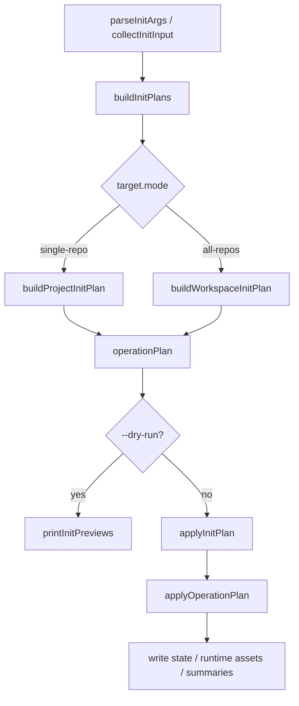
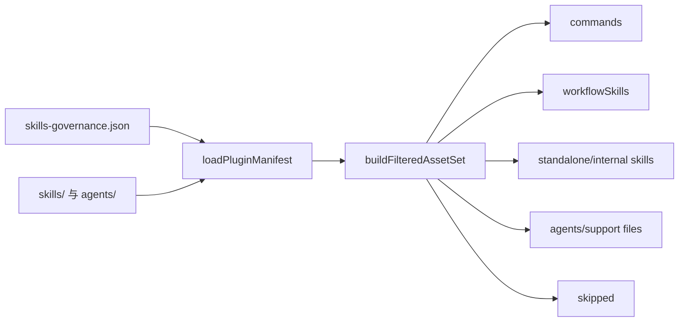
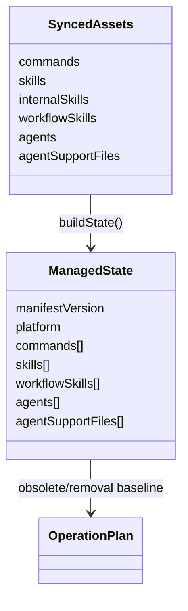

本页位于“深入解析 / 命令行与运行时生成”下，聚焦 `spec-first init` 的内部流水线：它如何从用户输入与目标仓库定位开始，发现可投影资产，构造可预览的操作计划，再以受控写入和状态文件记录完成初始化。本文不展开宿主适配器的逐项差异，也不讨论后续健康检查的完整机制；这些主题分别属于 [宿主适配器设计：统一源资产到不同 Runtime Surface 的投影](17-su-zhu-gua-pei-qi-she-ji-tong-yuan-zi-chan-dao-bu-tong-runtime-surface-de-tou-ying) 与 [运行时健康检查与 Drift 检测](18-yun-xing-shi-jian-kang-jian-cha-yu-drift-jian-ce)。Sources: [init.js](src/cli/commands/init.js#L115-L200), [init.js](src/cli/commands/init.js#L974-L1018)

## 架构假设与验证结论

可验证的架构假设是：初始化并不是“边判断边写文件”的脚本，而是一个 **Plan-first 写入流水线**。`runInit` 先解析参数、收集交互输入、构造一个或多个 init plan；`--dry-run` 分支只打印预览；非 dry-run 才进入 `applyInitPlan`。面向编程调用的 `src/cli/init-plan.js` 也只重新导出 `buildInitPlan` 与 `applyInitPlan`，说明“构造计划”和“应用计划”是公开边界。Sources: [init.js](src/cli/commands/init.js#L115-L200), [init.js](src/cli/commands/init.js#L261-L274), [init-plan.js](src/cli/init-plan.js#L1-L9)

这条流水线的核心不变量是：**计划阶段必须能完整表达将要写入、删除、清理、untrack 的内容；应用阶段只执行计划中声明的操作**。测试用例直接验证 `buildInitPlan` 不写入文件，同时 plan 中包含将要生成的 `AGENTS.md` 与宿主状态文件；另一个测试再验证 `applyInitPlan` 才实际写入 `CLAUDE.md`、命令、hook 与 state。Sources: [init-plan.test.js](tests/unit/init-plan.test.js#L57-L85), [init-plan.test.js](tests/unit/init-plan.test.js#L87-L110)

## 输入收集：宿主、身份、语言与目标仓库

初始化入口支持 `--claude`、`--codex`、`--cursor`、`--kiro`、`--qoder`、`-y/--yes`、`--dry-run`、`--all-repos`、`--repo`、`--user`、`--lang` 与用户语言同步相关开关；解析阶段会拒绝未知选项、非法语言、`--repo` 与 `--all-repos` 组合，以及同步语言开关的互斥组合。Sources: [init.js](src/cli/commands/init.js#L276-L389)

交互收集阶段会解析语言、宿主、多宿主选择、开发者名称与目标范围；当存在全局 developer profile 且用户未显式覆盖时，交互路径会尝试复用已存在的名称与语言；宿主多选会读取上次记录的 hosts，并过滤到当前支持的 host id。Sources: [init.js](src/cli/commands/init.js#L391-L460), [init.js](src/cli/commands/init.js#L580-L604)

目标仓库定位分为三类：当前目录已经在 Git repo 内时走 single-repo；父工作区包含子 Git repo 时可以选择 workspace-root-only、all-repos 或某个子 repo；非交互显式 `--repo` 会校验目标存在、位于当前 workspace 内，并能解析为 workspace 内的 Git root。Sources: [init.js](src/cli/commands/init.js#L622-L759)

## 资产发现：从治理清单到宿主过滤资产集

初始化使用 `loadPluginManifest()` 从源码构建插件 manifest：命令来自 skills governance 中 `entry_surface === "workflow_command"` 的记录，命令模板优先来自 `templates/claude/commands/spec/<command>.md`，缺失时回退到对应 skill 的 `SKILL.md`；manifest 同时记录 skills、agents 与 package version，并经过 `validateManifest()` 校验。Sources: [plugin.js](src/cli/plugin.js#L107-L150), [plugin.js](src/cli/plugin.js#L160-L181), [plugin.js](src/cli/plugin.js#L223-L241)

宿主过滤通过 `buildFilteredAssetSet(platformOrAdapter)` 完成：它读取 governance，按每个 skill 的 `entry_surface` 与 `host_delivery.<platform>` 决定进入 commands、workflowSkills、standalone skills、internalSkills，或进入 skipped；agents 与 agentSupportFiles 会根据宿主是否支持 agents 决定是否纳入。Sources: [plugin.js](src/cli/plugin.js#L586-L656), [plugin.js](src/cli/plugin.js#L672-L677)

资产同步计划由 `planBundledAssetSync()` 组装：命令计划、skills 计划、agents 计划先分别生成，再通过 `mergeOperationPlans()` 合并；返回值同时包含 `plan` 与 `syncedAssets`，后者会继续用于状态文件构造。Sources: [plugin.js](src/cli/plugin.js#L690-L710), [state.js](src/cli/state.js#L216-L238)

## 操作计划：把初始化拆成可排序、可预览、可应用的操作集

单仓库计划由 `buildProjectInitPlan()` 构造。它先规范化项目根目录，读取已存在的 managed state，加载 manifest 与宿主过滤资产集，然后生成资产同步计划、宿主 runtime 文件同步计划、预览状态，并在必要时添加诊断或错误，例如 Cursor preview warning、Claude agent bare name 冲突、Claude settings JSON 读取失败。Sources: [init.js](src/cli/commands/init.js#L1020-L1085), [init.js](src/cli/commands/init.js#L1120-L1173)

当检测到 legacy state 或当前 runtime drift 时，计划阶段不会直接删除文件，而是构造 destructive reset plan 并记录 `destructiveResetReason`；legacy reset state 会合并旧 state、当前命令文件名、bundled skills、workflow command skills、agents 与 support files，使重置边界可由 state 结构表达。Sources: [init.js](src/cli/commands/init.js#L1175-L1206), [init.js](src/cli/commands/init.js#L2559-L2585)

pre-sync 计划负责清理过期 managed assets、命令命名空间中不再受管的 `spec-*.md`、退役 runtime asset 与 legacy project developer profile；write plan 再把资产同步、runtime 文件、`.gitignore`、metadata/state 与 runtime untrack 计划合并。Sources: [init.js](src/cli/commands/init.js#L1208-L1225), [init.js](src/cli/commands/init.js#L2723-L2745)

| 计划层级 | 主要职责 | 典型 operation kind |
|---|---|---|
| destructiveResetPlan | legacy state 或 drift 后的受管资产重置 | `remove_file`, `remove_dir` |
| preSyncPlan | 写入前清理 obsolete、retired、namespace drift | `remove_file`, `remove_dir`, `prune_command` |
| writePlan | 生成 runtime assets、指令文件、状态、gitignore、untrack | `ensure_dir`, `write_file`, `update_file`, `untrack_index` |
| operationPlan | 合并后的最终执行视图 | 去重后的完整操作集 |

operation 的合并逻辑按 `kind:path` 去重并重新汇总 summary；文件写入 operation 会根据目标是否已存在自动标记为 `write_file` 或 `update_file`，并把内容、mode、encoding 放入 operation 中。Sources: [state.js](src/cli/state.js#L216-L285)

## 写入计划的内容边界：runtime、metadata、gitignore 与 untrack

资产计划会为命令、skills、agents 生成目录与文件写入操作。命令会通过 adapter 映射运行时文件名并渲染内容；skills 会先计划删除目标 skill 目录，再按源码目录生成转换后的文件写入操作；agents 与 support files 也以 copy-with-transform 的方式进入计划。Sources: [plugin.js](src/cli/plugin.js#L734-L759), [plugin.js](src/cli/plugin.js#L799-L858), [plugin.js](src/cli/plugin.js#L887-L912)

metadata 计划会更新宿主 instruction file，例如 `CLAUDE.md` 或 `AGENTS.md`：它先移除旧 runtime tools block 与旧 coding guidelines block，再应用语言 managed block 与 bootstrap block，最后以 `managed_instruction_file` 写回。Sources: [init.js](src/cli/commands/init.js#L2796-L2825)

`.gitignore` 计划通过 `applySpecFirstGitignoreBlock()` 计算结果；如果已经是 current，就返回空计划；否则生成 `managed_gitignore_policy` 的写入 operation，并在 operation 上记录 `gitignoreStatus` 供应用成功输出使用。Sources: [init.js](src/cli/commands/init.js#L2751-L2777), [init.js](src/cli/commands/init.js#L1339-L1344)

runtime untrack 计划来自 `planRuntimeUntrack({ projectRoot })`，其 operations 会进入 write plan；应用阶段对 `untrack_index` 使用 `runtimeUntrack.applyOne()` 并汇总 applied/skipped、reason codes 与 diagnostic。Sources: [init.js](src/cli/commands/init.js#L2779-L2794), [state.js](src/cli/state.js#L611-L638)

## 状态记录：managed state 是下一次初始化的差分基线

状态文件路径由 adapter 提供，`readState()` 会读取 JSON、校验 managed state shape，再 normalize；`writeState()` 会 normalize、校验并通过 atomic write 写入。状态结构包含 `manifestVersion`、`platform`、`commands`、`skills`、`workflowSkills`、`agents`、`agentSupportFiles`。Sources: [state.js](src/cli/state.js#L62-L91), [state.js](src/cli/state.js#L99-L125)

状态校验明确限制 required array fields 必须存在且元素必须是非空字符串，并通过 `isSafeManagedStatePath()` 防止绝对路径、Windows drive path、反斜杠、空段、`.`、`..`、Windows reserved names 与不安全字符进入状态记录；agents 与 agentSupportFiles 允许 nested path，其它字段默认不允许 nested。Sources: [state.js](src/cli/state.js#L127-L187)

`buildState()` 从 `syncedAssets` 构造下一版 state：commands 存 runtime filename，skills 合并 standalone skills 与 internalSkills，workflowSkills、agents、agentSupportFiles 分别记录对应资产列表。这使下一次 init 能通过 previousState 与 previewState 计算 obsolete removal。Sources: [state.js](src/cli/state.js#L99-L112), [state.js](src/cli/state.js#L395-L467)

## 原子写入与路径防护

所有 managed file 写入最终会走 `writeManagedFile()`，而该函数调用共享的 `writeFileAtomic()`；atomic write 会先确保父目录存在，生成带进程号、时间戳与随机后缀的临时文件，写入临时文件后 rename 到目标路径，失败时删除临时文件。Sources: [state.js](src/cli/state.js#L641-L654), [atomic-write.js](src/cli/atomic-write.js#L13-L57)

Windows 上 rename 覆盖已有文件可能遇到 `EPERM`、`EACCES` 或 `EBUSY`，共享写入器会对这些 transient code 进行最多 10 次、每次 20ms 的同步退避重试；非 Windows 直接使用 `fs.renameSync()`。Sources: [atomic-write.js](src/cli/atomic-write.js#L5-L45)

应用计划前，`applyOperationPlan()` 会把 operation path 解析到 project root 下，并用真实路径检查最近已存在路径是否仍在 project root 真实路径内，防止通过 symlink 逃逸；删除类操作还禁止直接指向 project root。Sources: [state.js](src/cli/state.js#L575-L620), [state.js](src/cli/state.js#L656-L677)

## 应用阶段：按计划执行，并在破坏性重置时建立回滚备份

`applyProjectInitPlan()` 在计划包含错误时直接返回失败；若存在 destructive reset plan，它会为 destructive、preSync、write 三组计划创建 runtime rollback backup，然后依次应用 destructive reset、preSync、write；如果任一步抛错，则恢复备份并清理备份目录。无 destructive reset 时，它只执行 preSync 与 write。Sources: [init.js](src/cli/commands/init.js#L1259-L1295), [init.js](src/cli/commands/init.js#L2459-L2553)

回滚备份只覆盖会删除或写入的路径类型，包括 `remove_file`、`remove_dir`、`prune_command`、`write_file`、`update_file`；它会按路径长度排序并避免重复备份父目录下的嵌套路径，记录每个 entry 是否存在、是否目录与 mode。Sources: [init.js](src/cli/commands/init.js#L2459-L2520), [init.js](src/cli/commands/init.js#L2522-L2557)

`applyOperationPlan()` 支持的 operation kind 是有限集合：`ensure_dir`、`write_file`、`update_file`、`remove_file`、`prune_command`、`remove_dir`、`remove_empty_root`、`untrack_index`；删除文件或目录后会递归清理空父目录，但停止在 project root。Sources: [state.js](src/cli/state.js#L575-L620), [state.js](src/cli/state.js#L698-L740)

## Workspace all-repos：父 runtime 与子仓库初始化摘要

当 target mode 是 `all-repos` 时，`buildInitPlan()` 会转入 `buildWorkspaceInitPlan()`：父 workspace 生成一个 `gitRootTopology: "multi-repo-workspace"` 的 parentPlan，每个子 Git repo 生成一个 single-repo child plan，最终返回 `mode: "all-repos"` 的计划对象。Sources: [init.js](src/cli/commands/init.js#L974-L1006), [init.js](src/cli/commands/init.js#L1605-L1674)

应用 workspace plan 时，父 runtime 与每个子 repo 分别调用 `applyProjectInitPlan()`；随后 `buildWorkspaceInitSummary()` 生成 `workspace-init-summary.v1`，包含 parent runtime 状态、每个 child result、ready/action_required 计数、overall_status、reason_code 与 next_action。Sources: [init.js](src/cli/commands/init.js#L1676-L1768), [init.js](src/cli/commands/init.js#L1770-L1823)

workspace summary 会写入 `.spec-first/workspace/init-summary-<platform>.json` 与 `.spec-first/workspace/init-summary.json`；多平台场景下，`init-summary.json` 会成为 `workspace-init-summary-index.v1`，按 platform 聚合各自 summary entry。写入前会校验目标路径没有通过 symlink 逃逸 workspace root，并使用 atomic JSON 写入。Sources: [init.js](src/cli/commands/init.js#L1884-L1928), [init.js](src/cli/commands/init.js#L1930-L2018), [init.js](src/cli/commands/init.js#L2378-L2394)

## 开发者可观察点：如何阅读一个 init plan

对高级开发者而言，最有诊断价值的对象是 `spec-first-init-plan.v1`：single-repo plan 暴露 `previousState`、`previewState`、`destructiveResetPlan`、`preSyncPlan`、`writePlan`、`operationPlan`、`syncedAssets`、`diagnostics`、`errors` 与 summary；这些字段能解释“为什么要删、为什么要写、下一次如何 diff”。Sources: [init.js](src/cli/commands/init.js#L1231-L1256)

如果只需要验证计划而不修改仓库，可以使用 `--dry-run` 路径；代码在 dry-run 下调用 `printInitPreviews()`，而不是 `applyInitPlan()`。测试也验证了 `buildInitPlan` 构造计划前后目录快照不变。Sources: [init.js](src/cli/commands/init.js#L200-L260), [init-plan.test.js](tests/unit/init-plan.test.js#L57-L85)

## 下一步阅读

读完本页后，建议继续阅读 [宿主适配器设计：统一源资产到不同 Runtime Surface 的投影](17-su-zhu-gua-pei-qi-she-ji-tong-yuan-zi-chan-dao-bu-tong-runtime-surface-de-tou-ying)，因为初始化流水线只定义“何时生成计划、何时写入”，而 adapter 才定义不同宿主的 command root、skills root、agents root、state file、instruction file 与内容转换。Sources: [base.js](src/cli/adapters/base.js#L5-L177), [claude.js](src/cli/adapters/claude.js#L43-L130)

随后可阅读 [运行时健康检查与 Drift 检测](18-yun-xing-shi-jian-kang-jian-cha-yu-drift-jian-ce)，因为本页只覆盖 init 时的 drift 检测入口与 reset 计划，完整健康检查、doctor 与 drift 语义需要在运行时健康检查页面继续展开。Sources: [init.js](src/cli/commands/init.js#L2418-L2457), [init.js](src/cli/commands/init.js#L1175-L1206)