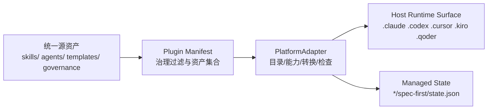
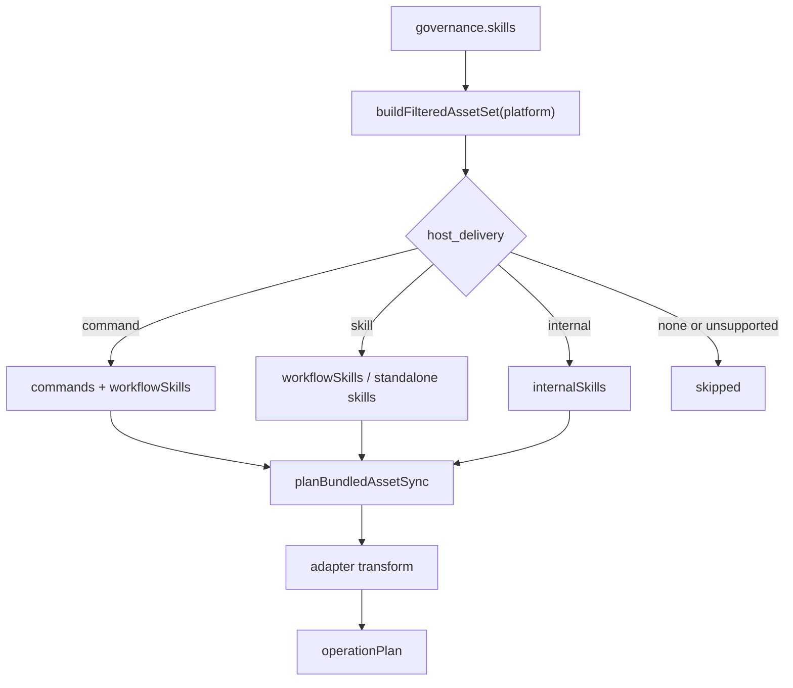
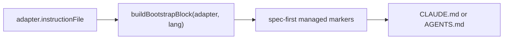
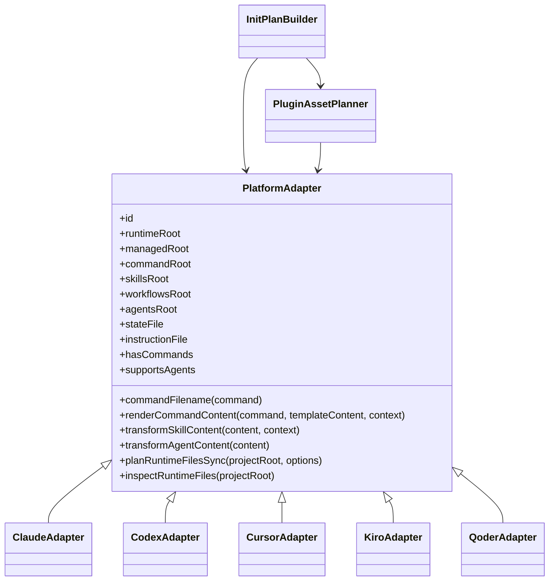

本页位于“命令行与运行时生成”小节，聚焦 `spec-first` 如何通过宿主适配器把同一组源资产——`skills/`、`agents/`、治理清单和命令模板——投影到 Claude Code、Codex、Cursor、Kiro 与 Qoder 各自可发现、可执行、可检查的 Runtime Surface。这里不展开 `init` 的完整交互流程，也不展开 drift 检测细节；它只解释适配器边界、资产过滤、内容转换和宿主目录形态。Sources: [base.js](src/cli/adapters/base.js#L5-L177), [index.js](src/cli/adapters/index.js#L1-L40)

## 架构假设与验证结论

本页采用的架构假设是：**宿主差异不应反向污染源资产**；源资产保持统一，差异被封装在 `PlatformAdapter` 的目录属性、能力开关、文件名映射、内容转换、运行时附加文件规划和检查逻辑中。代码验证显示，`PlatformAdapter` 明确定义了 `runtimeRoot`、`managedRoot`、`commandRoot`、`skillsRoot`、`workflowsRoot`、`agentsRoot`、`stateFile`、`instructionFile` 等投影坐标，并通过 `hasCommands`、`supportsAgents`、`commandFilename()`、`renderCommandContent()`、`transformSkillContent()`、`transformAgentContent()`、`planRuntimeFilesSync()`、`inspectRuntimeFiles()` 等扩展点把宿主差异隔离在适配层。Sources: [base.js](src/cli/adapters/base.js#L5-L177)

第二个验证结论是：**适配器不是资产选择的唯一决策点**。资产选择先由治理清单驱动的 `buildFilteredAssetSet()` 决定某个 skill 在某个 host 上以 `command`、`skill`、`internal` 或跳过的方式交付；适配器随后负责把这些被选中的资产写到该 host 的 runtime surface，并在复制过程中改写路径、frontmatter、名称和 host pin。Sources: [plugin.js](src/cli/plugin.js#L586-L655), [plugin.js](src/cli/plugin.js#L690-L710)

第三个验证结论是：**`init` 的核心职责是编排投影计划，而不是硬编码宿主细节**。`buildProjectInitPlan()` 通过 `getAdapter()` 获得当前 host 的适配器，调用 `buildFilteredAssetSet()` 得到交付集合，调用 `planBundledAssetSync()` 生成命令、skill、agent 的同步计划，再调用 `adapter.planRuntimeFilesSync()` 拼入宿主特有的 hook 或 cleanup 操作；最终把 pre-sync、runtime sync、state、gitignore、bootstrap 等写入合并成一个 operation plan。Sources: [init.js](src/cli/commands/init.js#L1020-L1123), [init.js](src/cli/commands/init.js#L1208-L1256)

## 适配器抽象：把宿主差异压缩成投影接口

`PlatformAdapter` 可以理解为“源资产到宿主 runtime surface 的投影函数”。它的目录 getter 描述投影目的地，能力 getter 描述是否生成命令和 agent，转换函数描述 Markdown/metadata 如何变形，检查与移除函数描述宿主 runtime 的生命周期边界；默认实现保持中性，具体宿主只覆盖自身需要差异化的部分。Sources: [base.js](src/cli/adapters/base.js#L13-L84), [base.js](src/cli/adapters/base.js#L86-L174)

上图的关键点是单向依赖：源资产不会为了某个宿主复制一份“源级 fork”，宿主差异在投影时发生；`plugin.js` 先从治理记录构造 manifest 与过滤后的资产集合，`init.js` 再用适配器把集合变成可执行的写入计划。Sources: [plugin.js](src/cli/plugin.js#L107-L150), [plugin.js](src/cli/plugin.js#L586-L655), [init.js](src/cli/commands/init.js#L1084-L1119)

适配器注册表是固定宿主集合的入口：当前支持 `claude`、`codex`、`cursor`、`kiro`、`qoder` 五类宿主，`getAdapter(platformId)` 对未知平台直接抛错，`getSupportedPlatforms()` 返回注册表 key。这使 CLI 层可以通过 platform id 选择投影策略，而不需要在调用点分支处理每个 runtime surface。Sources: [index.js](src/cli/adapters/index.js#L1-L40)

## Runtime Surface 矩阵

| 宿主 | 命令面 | Workflow/Skill 面 | Agent 面 | Instruction 文件 | State 文件 | 投影特征 |
|---|---|---|---|---|---|---|
| Claude Code | `.claude/commands`，命令文件名为 `spec-${name}.md` | standalone skills 在 `.claude/skills`，workflow skills 在 `.claude/spec-first/workflows` | `.claude/agents` | `CLAUDE.md` | `.claude/spec-first/state.json` | 命令与 workflow skill 分离，并安装 Claude managed hooks。Sources: [claude.js](src/cli/adapters/claude.js#L43-L82), [claude.js](src/cli/adapters/claude.js#L184-L199) |
| Codex | `hasCommands=false`，`.codex/commands/spec` 仅作为 legacy cleanup 目标 | `.agents/skills` 同时承载 user-visible workflow skills | `.codex/agents` | `AGENTS.md` | `.codex/spec-first/state.json` | 以 project-scoped `.agents/skills` 作为 workflow 入口，并管理 Codex SessionStart hook。Sources: [codex.js](src/cli/adapters/codex.js#L27-L75), [codex.js](src/cli/adapters/codex.js#L139-L188) |
| Cursor | `hasCommands=false` | `.cursor/skills` | 不投影 spec-first agents，`supportsAgents=false` | `AGENTS.md` | `.cursor/spec-first/state.json` | 生成 runtime preview，检查中明确提示本机未验证 Cursor loader。Sources: [cursor.js](src/cli/adapters/cursor.js#L58-L101), [cursor.js](src/cli/adapters/cursor.js#L133-L174) |
| Kiro | `hasCommands=false` | `.kiro/skills` | `.kiro/agents` | `AGENTS.md` | `.kiro/spec-first/state.json` | workflow 以 skill 形态投影，并将 agent frontmatter 规范化为 Kiro 可读结构。Sources: [kiro.js](src/cli/adapters/kiro.js#L32-L71), [kiro.js](src/cli/adapters/kiro.js#L73-L120) |
| Qoder | `.qoder/commands`，命令文件名为 `spec-${name}.md` | `.qoder/skills` | `.qoder/agents` | `AGENTS.md` | `.qoder/spec-first/state.json` | 同时生成 command、skill、agent，并规范化 command/agent frontmatter 与工具列表。Sources: [qoder.js](src/cli/adapters/qoder.js#L34-L73), [qoder.js](src/cli/adapters/qoder.js#L75-L148) |

这张矩阵说明了一个容易误解的点：**“同名 `spec-*` 入口”不等于“同一种宿主文件形态”**。Claude 和 Qoder 有 command 文件投影；Codex、Cursor、Kiro 主要通过 skill 目录承载 workflow；Cursor 当前还显式关闭 spec-first agent 投影。Sources: [base.js](src/cli/adapters/base.js#L34-L49), [codex.js](src/cli/adapters/codex.js#L49-L67), [cursor.js](src/cli/adapters/cursor.js#L71-L93)

## 投影流水线：从治理记录到写入计划

投影流水线从治理清单和源目录生成 manifest 开始：`buildPluginManifestFromSources()` 读取 package metadata 与 skills governance truth source，对 `entry_surface === 'workflow_command'` 的记录生成 command 定义，并记录 `commands`、`skills`、`agents`、版本等基础信息。Sources: [plugin.js](src/cli/plugin.js#L107-L150)

随后 `buildFilteredAssetSet(platform)` 按 `host_delivery[platform]` 过滤资产：workflow skill 若交付为 `command` 会进入 `commands` 且被记入 `workflowSkills`，交付为 `skill` 则只进入 `workflowSkills`；standalone skill 仅在交付为 `skill` 时进入 `skills`；internal-only skill 只有在交付为 `internal` 且属于允许集合时进入 `internalSkills`；不交付的记录进入 `skipped`。Sources: [plugin.js](src/cli/plugin.js#L586-L655)

实际写入计划由 `planBundledAssetSync()` 组合：如果适配器 `hasCommands`，则规划 command sync；skill sync 始终规划；如果 `supportsAgents === false`，agent 计划为空，否则规划 agent sync。这个设计使 Cursor 这类 agentless preview host 可以复用同一条流水线，但在 agent 阶段自然短路。Sources: [plugin.js](src/cli/plugin.js#L690-L710), [cursor.js](src/cli/adapters/cursor.js#L71-L77)

`planCommandsSync()` 使用 `adapter.commandFilename()` 决定 runtime 文件名，并通过 `renderRuntimeCommandContent()` 让适配器改写命令内容；`planSkillsSync()` 则按 workflow/standalone/internal 分类决定目标目录，先规划 reset，再对目录内文本文件应用 `transformSkillTextFile()`；`planAgentsSync()` 对 agent markdown 应用 `adapter.transformAgentContent()`，对 agent support files 原样复制。Sources: [plugin.js](src/cli/plugin.js#L734-L758), [plugin.js](src/cli/plugin.js#L799-L857), [plugin.js](src/cli/plugin.js#L887-L900)

## 内容转换：路径、frontmatter、名称与 Host Pin

内容转换的第一类工作是路径重写。多个适配器都把其他宿主的 runtime 路径改写为当前宿主路径，例如 Codex 将 Claude command 或 skill 路径转成 `.agents/skills/...`，Cursor 将各宿主的 skills/agents/settings 引用改成 `.cursor/...`，Kiro 转成 `.kiro/...`，Qoder 转成 `.qoder/...`。Sources: [codex.js](src/cli/adapters/codex.js#L222-L252), [cursor.js](src/cli/adapters/cursor.js#L181-L233), [kiro.js](src/cli/adapters/kiro.js#L157-L193), [qoder.js](src/cli/adapters/qoder.js#L193-L240)

路径重写还有一个保护机制：`rewriteSourceSkillRuntimePaths()` 只在非 source-of-truth 语境中把 `skills/<skillName>/` 改成 runtime skill root；如果某行包含 source-of-truth、current source、source directory、not source 等标记，或是 Inputs 表格行，则保留源路径。这避免了 runtime 镜像在说明“源资产位置”时被错误改写。Sources: [skill-path-rewrite-markers.js](src/cli/skill-path-rewrite-markers.js#L3-L34), [skill-path-rewrite-markers.js](src/cli/skill-path-rewrite-markers.js#L36-L74)

内容转换的第二类工作是 frontmatter 与 runtime 名称规范化。Cursor 只保留 `name`、`description`、`paths`、`disable-model-invocation`、`metadata` 等允许字段，并在 workflow skill 上写入 `disable-model-invocation: true`；Kiro 和 Qoder 会从源 agent frontmatter 提取 name/description/tools，再按各自规则生成新的 agent frontmatter。Sources: [cursor.js](src/cli/adapters/cursor.js#L10-L16), [cursor.js](src/cli/adapters/cursor.js#L272-L302), [kiro.js](src/cli/adapters/kiro.js#L88-L104), [qoder.js](src/cli/adapters/qoder.js#L114-L130)

内容转换的第三类工作是 setup workflow 的 Host Pin。Claude、Codex、Cursor、Kiro、Qoder 都在 `spec-mcp-setup` 相关 runtime surface 中插入宿主 pin，要求调用 `skills/spec-mcp-setup/scripts/*` 时设置对应的 `MCP_SETUP_HOST`，避免同一机器上多个宿主 CLI 共存时通过 PATH 自动推断出错。Sources: [claude.js](src/cli/adapters/claude.js#L242-L259), [codex.js](src/cli/adapters/codex.js#L278-L280), [cursor.js](src/cli/adapters/cursor.js#L304-L320), [kiro.js](src/cli/adapters/kiro.js#L248-L265), [qoder.js](src/cli/adapters/qoder.js#L283-L301)

## 命令面与 Skill 面的分离规则

Claude 的 `renderCommandContent()` 展示了“命令只是 workflow skill 的 runtime 入口”的模式：当存在 `context.skillContent` 时，它保留 command template 的 frontmatter，但正文使用 skill 的 body，并把结果作为 workflow skill 进行路径改写。这使 Claude command 文件成为 user-facing entrypoint，而 workflow 逻辑仍来自统一 skill 源。Sources: [claude.js](src/cli/adapters/claude.js#L84-L109)

Qoder 的 `renderCommandContent()` 采用另一种 runtime 形态：它从 skill body 构造 Qoder command markdown，写入规范化后的 `name` 与 JSON-safe `description` frontmatter，再交给 `transformSkillContent()` 继续做路径、名称和 host pin 转换。Sources: [qoder.js](src/cli/adapters/qoder.js#L75-L112)

Codex、Cursor、Kiro 则通过 `hasCommands=false` 避免生成 command 文件；它们仍可暴露同名 `spec-*` workflow，但 runtime surface 是 skill 目录，而不是 command 目录。这个差异由适配器能力开关和 `planBundledAssetSync()` 的短路逻辑统一处理。Sources: [codex.js](src/cli/adapters/codex.js#L49-L63), [cursor.js](src/cli/adapters/cursor.js#L71-L89), [kiro.js](src/cli/adapters/kiro.js#L45-L59), [plugin.js](src/cli/plugin.js#L690-L697)

## Instruction Bootstrap：统一入口语义，分宿主落盘

除了命令和 skill 文件，适配器还提供 `instructionFile`，用于把 using-spec-first 的最小入口治理 block 写入宿主读取的根级指令文件：Claude 使用 `CLAUDE.md`，Codex、Cursor、Kiro、Qoder 使用 `AGENTS.md`。`writeInstructionBootstrap()` 根据 adapter 的 `instructionFile` 定位文件，并通过 managed marker 替换或追加 block。Sources: [base.js](src/cli/adapters/base.js#L78-L84), [claude.js](src/cli/adapters/claude.js#L80-L82), [codex.js](src/cli/adapters/codex.js#L73-L75), [instruction-bootstrap.js](src/cli/instruction-bootstrap.js#L8-L20)

Bootstrap block 的入口命名策略在当前实现中是统一的：`workflowEntrypointPrefix()` 返回 `spec-`，`zhHostEntrypointLine()` 与 `enHostEntrypointLine()` 都声明 workflow entrypoints 使用同名 `spec-*`。对 Codex 及共享 `AGENTS.md` 的宿主，block 还会加入 Codex startup reminder 与 dispatch authorization 相关提示。Sources: [instruction-bootstrap.js](src/cli/instruction-bootstrap.js#L140-L168), [instruction-bootstrap.js](src/cli/instruction-bootstrap.js#L171-L199), [instruction-bootstrap.js](src/cli/instruction-bootstrap.js#L212-L225)

这个 block 不取代各 workflow skill 的完整说明；它只提供会话启动即可在场的最小入口锚点，并把完整路由表指向 `skills/using-spec-first/SKILL.md` 及其 references。该行为属于“宿主入口语义投影”，不是额外的 workflow 实现。Sources: [instruction-bootstrap.js](src/cli/instruction-bootstrap.js#L152-L168), [instruction-bootstrap.js](src/cli/instruction-bootstrap.js#L183-L199)

## 宿主特有 Runtime 文件：hooks、cleanup 与 preview 警告

Claude 适配器会规划四类 managed hook 文件：SessionStart、spec-plan guard、PRD prewrite guard、PRD readiness guard；`planRuntimeFilesSync()` 为每个 hook 生成 write/update 操作并设置可执行 mode，`inspectRuntimeFiles()` 检查 hook 缺失、漂移和执行权限。Sources: [claude.js](src/cli/adapters/claude.js#L7-L38), [claude.js](src/cli/adapters/claude.js#L132-L199), [claude.js](src/cli/adapters/claude.js#L310-L350)

Codex 适配器会规划 project-scoped SessionStart hook、Windows `.cmd` hook 和 `.codex/hooks.json`，但当当前 projectRoot 的 `.codex` 是 Codex global hook directory 时会跳过 hook 写入，以避免全局双重注入；同时它会规划 legacy command/plugin 目录清理。Sources: [codex.js](src/cli/adapters/codex.js#L12-L25), [codex.js](src/cli/adapters/codex.js#L139-L188), [codex.js](src/cli/adapters/codex.js#L206-L216)

Cursor 适配器目前明确把自身标记为 generated-runtime preview：检查结果会提示 Cursor skill discovery/invocation 尚未在本机验证，并把意外出现的 `.cursor/commands/spec` 与 `.cursor/agents` 视为 drift 警告。这不是功能失败，而是适配器用检查逻辑表达宿主支持成熟度。Sources: [cursor.js](src/cli/adapters/cursor.js#L133-L174)

Kiro 与 Qoder 的检查逻辑更强调 runtime 形态合法性：Kiro 检查 skill name 与 folder 是否一致、是否包含非 Kiro runtime 路径、agent frontmatter 是否符合 Kiro 要求；Qoder 检查 command、skill、agent 的名称/frontmatter 与路径改写状态。Sources: [kiro.js](src/cli/adapters/kiro.js#L122-L150), [kiro.js](src/cli/adapters/kiro.js#L324-L350), [qoder.js](src/cli/adapters/qoder.js#L150-L187)

## 适配器与 Init Plan 的交互边界

`buildProjectInitPlan()` 是适配器被消费的主要位置：它读取当前 adapter 的 state，构造 filtered asset set，按 adapter 能力生成 runtime commands，规划 bundled asset sync，再拼入 adapter 的 runtime file sync。这里的边界很清晰：init 负责计划、状态和错误处理，adapter 负责“这个宿主该长什么样”。Sources: [init.js](src/cli/commands/init.js#L1020-L1119)

当检测到 legacy state 或当前 runtime drift 时，init 会先规划 managed hard reset，再做 obsolete asset removal、command namespace prune、retired runtime asset prune 和 developer profile cleanup，最后才执行新的 init write plan。适配器参与这些流程的方式是提供 state 路径、runtime 根目录、命令命名和移除/检查策略。Sources: [init.js](src/cli/commands/init.js#L1175-L1225), [base.js](src/cli/adapters/base.js#L72-L84), [base.js](src/cli/adapters/base.js#L147-L174)

`applyProjectInitPlan()` 不再理解宿主差异；它只按 operation plan 应用 pre-sync 与 write plan，在 destructive reset 时创建 rollback backup，并在成功后写 global developer profile。这证明投影差异已经在 plan 构造阶段被吸收，而不是散落到执行阶段。Sources: [init.js](src/cli/commands/init.js#L1259-L1295)

## 设计取舍：统一入口名，不统一物理形态

| 设计点 | 当前实现 | 收益 | 代价 |
|---|---|---|---|
| 统一 `spec-*` 入口名 | Bootstrap 中声明各宿主 workflow entrypoints 使用同名 `spec-*`。Sources: [instruction-bootstrap.js](src/cli/instruction-bootstrap.js#L212-L225) | 用户心智一致，跨宿主文档可复用。 | runtime 文件位置必须由适配器改写，不能假设单一路径。 |
| 分宿主 runtime root | 每个 adapter 定义自己的 `.claude`、`.codex`、`.cursor`、`.kiro`、`.qoder` root。Sources: [claude.js](src/cli/adapters/claude.js#L48-L82), [codex.js](src/cli/adapters/codex.js#L41-L75), [cursor.js](src/cli/adapters/cursor.js#L63-L101), [kiro.js](src/cli/adapters/kiro.js#L37-L71), [qoder.js](src/cli/adapters/qoder.js#L39-L73) | 避免一个宿主的 runtime 约束泄漏到另一个宿主。 | 需要维护多套路径重写与 drift 检查规则。 |
| 能力开关 | `hasCommands` 与 `supportsAgents` 控制是否生成 command/agent。Sources: [base.js](src/cli/adapters/base.js#L34-L49), [plugin.js](src/cli/plugin.js#L690-L697) | 同一流水线支持 command host、skill host 和 agentless host。 | 文档与测试必须覆盖“有入口但无 command 文件”的情况。 |
| Runtime mirror 非源资产 | 转换函数重写 operational path，但保留 source-of-truth 行。Sources: [skill-path-rewrite-markers.js](src/cli/skill-path-rewrite-markers.js#L12-L34), [skill-path-rewrite-markers.js](src/cli/skill-path-rewrite-markers.js#L36-L55) | 保持源资产治理边界清晰。 | 内容转换需要识别语义行，不能只做全局替换。 |

这个取舍的核心是：**统一的是 workflow 语义和资产来源，不统一的是宿主物理形态**。因此阅读 runtime 文件时，应把 `.claude/**`、`.codex/**`、`.cursor/**`、`.kiro/**`、`.qoder/**` 视为投影产物；修改源逻辑时应回到 `skills/`、`agents/`、templates 和治理清单。Sources: [plugin.js](src/cli/plugin.js#L25-L35), [plugin.js](src/cli/plugin.js#L761-L857), [skill-path-rewrite-markers.js](src/cli/skill-path-rewrite-markers.js#L3-L34)

## 模块交互图

模块关系的实际代码对应关系是：`adapters/index.js` 暴露宿主实例，`init.js` 在 plan 构造时取 adapter，`plugin.js` 在 command/skill/agent 规划时调用 adapter 的命名与转换函数，具体 adapter 文件封装宿主规则。Sources: [index.js](src/cli/adapters/index.js#L1-L40), [init.js](src/cli/commands/init.js#L974-L1006), [plugin.js](src/cli/plugin.js#L690-L710), [plugin.js](src/cli/plugin.js#L734-L758)

## 阅读与调试建议

如果你要理解“初始化为何生成这些目录”，下一步读 [初始化流水线：资产发现、操作计划、原子写入与状态记录](16-chu-shi-hua-liu-shui-xian-zi-chan-fa-xian-cao-zuo-ji-hua-yuan-zi-xie-ru-yu-zhuang-tai-ji-lu)；如果你要验证 runtime 是否过期或被手改，下一步读 [运行时健康检查与 Drift 检测](18-yun-xing-shi-jian-kang-jian-cha-yu-drift-jian-ce)。Sources: [init.js](src/cli/commands/init.js#L974-L1006), [init.js](src/cli/commands/init.js#L1175-L1225)

如果你关注“为什么 generated runtime 不是 source of truth”，应回到 [Generated Runtime 与 Source of Truth 的治理模型](14-generated-runtime-yu-source-of-truth-de-zhi-li-mo-xing)；如果你关注公开 workflow 与 skill 的治理边界，应继续读 [公开工作流命令与 Skill 治理模型](19-gong-kai-gong-zuo-liu-ming-ling-yu-skill-zhi-li-mo-xing)。Sources: [skill-path-rewrite-markers.js](src/cli/skill-path-rewrite-markers.js#L3-L34), [plugin.js](src/cli/plugin.js#L586-L655)