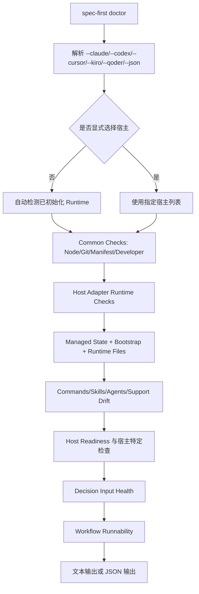
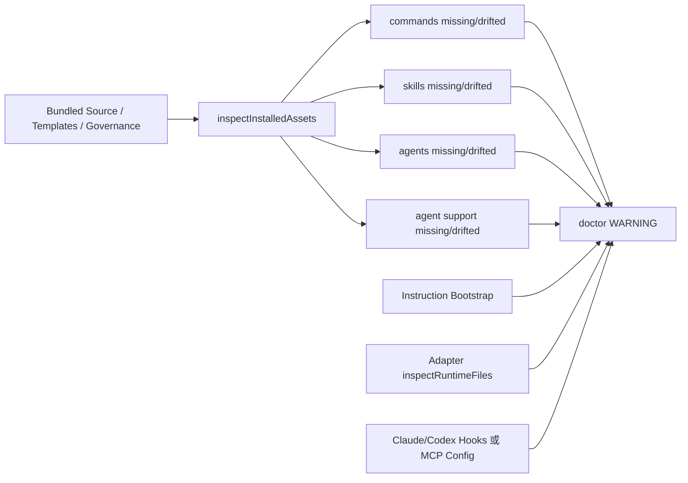
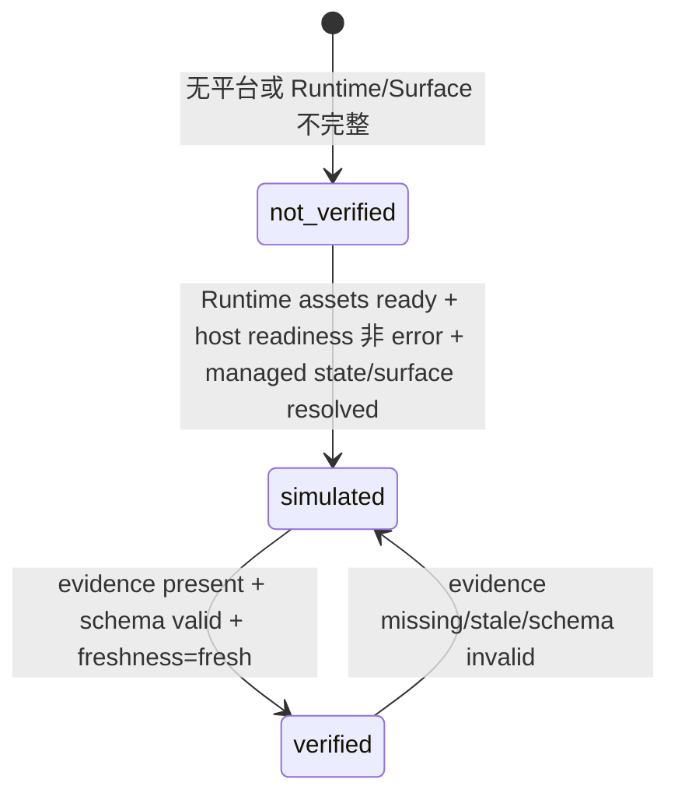

本页解释 `spec-first doctor` 如何把“CLI 能否运行、宿主 Runtime 是否完整、生成资产是否漂移、运行证据是否足够新鲜”收敛成可读的健康状态；范围仅覆盖运行时健康检查与 Drift 检测，不展开初始化写入、宿主适配器生成或 Skill 治理的完整机制。`doctor` 是 CLI 顶层命令之一，由 `src/cli/index.js` 分发到 `runDoctor`，帮助文本明确它用于检查环境、runtime asset manifest 与 managed runtime assets。Sources: [index.js](src/cli/index.js#L44-L46), [index.js](src/cli/index.js#L158-L170)

## 架构假设与验证结论

**架构假设**：运行时健康检查不是单点探测，而是一个分层诊断器：先确认本机与包级基础条件，再按宿主 Adapter 检查生成 Runtime Surface，随后把 managed state、manifest 版本、指令 bootstrap、宿主 CLI、MCP/Hook 等宿主特定接线，以及 workflow verification evidence 汇总成 JSON 状态。源码验证支持这一假设：`buildDoctorReport` 构造 common checks、runtime checks、host checks，并输出 `install_health`、`runtime_asset_health`、`host_readiness`、`decision_input_health` 与 `workflow_runnability`。Sources: [doctor.js](src/cli/commands/doctor.js#L434-L440), [doctor.js](src/cli/commands/doctor.js#L443-L527)



上图中的“自动检测”由 `detectPlatforms` 和 `isPlatformRuntimeDetected` 完成：Claude/Codex 通过 runtime root 是否存在判断，Cursor/Qoder 以 state file 为检测入口，Kiro 则检查 state、skills、agents 等 runtime 路径；显式传入宿主参数时，`runDoctor` 直接使用指定平台列表。Sources: [doctor.js](src/cli/commands/doctor.js#L44-L68), [doctor.js](src/cli/commands/doctor.js#L1105-L1132)

## doctor 的状态模型

`doctor --json` 暴露的是面向自动化消费的状态模型：`install_health` 表示 Node、Git、包内 runtime manifest、全局 developer profile 等基础检查；`runtime_asset_health` 表示 `spec-first init` 生成并管理的宿主 Runtime 资产；`host_readiness` 表示宿主 CLI 与宿主特定项目接线；`decision_input_health` 表示 `.spec-first/config/tool-facts.json` 是否足以支撑决策输入；`workflow_runnability` 表示当前 workflow 是否仅完成静态模拟，还是已有新鲜运行证据。Sources: [doctor.js](src/cli/commands/doctor.js#L537-L552), [doctor.js](src/cli/commands/doctor.js#L1074-L1097)

| 字段 | 取值来源 | 通过条件 | 常见降级含义 |
|---|---|---|---|
| `install_health` | common checks | common checks 无 `ERROR` 且无 `WARNING` | Node/Git/profile/manifest 存在警告或错误 |
| `runtime_asset_health` | 每个宿主的 managed runtime checks | state、bootstrap、runtime files、commands/skills/agents 检查均通过 | 生成文件缺失、漂移、manifest 版本不一致 |
| `host_readiness` | 宿主 CLI 与宿主特定接线 | 宿主 CLI 可探测且宿主特定配置通过 | 宿主 CLI 不在 PATH、MCP 配置缺失、Hook 污染 |
| `decision_input_health` | setup facts 投影 | setup facts 存在、新鲜、无必需动作 | facts 缺失、过期、宿主不匹配、必需 runtime 动作未解决 |
| `workflow_runnability` | runtime/host 状态 + verification evidence | Runtime surface ready 且 evidence 新鲜有效 | 只有静态 ready，无新鲜运行证据时为 `simulated` |

这些字段并非独立字符串拼接，而是由检查结果聚合而来：`summarizeChecks` 将检查列表折叠为 `pass`、`warn`、`error` 或 `not_applicable`；`printDoctorJson` 输出 schema version、平台列表、健康字段、basis、checks、common checks、platform checks 与 warnings。Sources: [doctor.js](src/cli/commands/doctor.js#L489-L527), [doctor.js](src/cli/commands/doctor.js#L530-L552)

## Drift 检测的核心边界

Drift 在这里指“已生成 Runtime 与当前包内 Source/Template/治理期望不一致”，检测范围包括 command 文件、skill 镜像、agent 文件、agent support 文件、instruction bootstrap、宿主 runtime 文件以及 Claude settings hook；`init` 在已有 state 的情况下也会调用同一类检查，如果发现 current runtime drift，会准备 managed hard reset 后重新初始化。Sources: [init.js](src/cli/commands/init.js#L1193-L1205), [init.js](src/cli/commands/init.js#L2418-L2456)



`inspectInstalledAssets` 是 Drift 检测的核心入口，它根据 Adapter 构造过滤后的资产集合，并分别调用 `inspectCommands`、`inspectSkills`、`inspectAgents`、`inspectAgentSupportFiles`；每类检查都会返回 `targetRoot`、`entries`、`missing` 与 `drifted`，供 `doctor` 再转换成 PASS/WARNING/ERROR。Sources: [plugin.js](src/cli/plugin.js#L926-L939), [plugin.js](src/cli/plugin.js#L941-L1001)

`doctor` 对 command、skill、agent、support asset 的处理模式一致：目标根目录不存在时提示 missing；全部存在且无 drift 时 PASS；只有 drift 时 WARNING 并建议重新 init；既缺失又漂移时合并显示缺失项与 drift 摘要。`formatDriftSummary` 最多展示前三个漂移条目，并优先展示条目的首个 issue。Sources: [doctor.js](src/cli/commands/doctor.js#L203-L252), [doctor.js](src/cli/commands/doctor.js#L254-L303), [doctor.js](src/cli/commands/doctor.js#L305-L413), [doctor.js](src/cli/commands/doctor.js#L651-L663)

## 运行时资产检查维度

运行时资产检查首先依赖 managed state：`checkManagedState` 会读取宿主 Adapter 指定的 state file，校验 state 是否存在、是否可解析、是否带有 `manifestVersion`，并与当前 bundled manifest version 对比；manifest 版本不一致时不会静默通过，而是 WARNING 并建议重新 init 以同步升级后的 managed assets。Sources: [doctor.js](src/cli/commands/doctor.js#L871-L926)

`checkPluginManifest` 则验证包内 runtime asset manifest 本身可加载，并报告 manifest 的 name、version 与 command definition 数量；如果 manifest 或 bundled governance、command templates、skills、agents 缺失，会返回 ERROR，提示恢复包内资产并重新安装 package。Sources: [doctor.js](src/cli/commands/doctor.js#L415-L431)

| 检查对象 | 实现入口 | PASS 条件 | Drift/异常表现 |
|---|---|---|---|
| Managed state | `checkManagedState` | state 存在、可读、manifestVersion 等于 bundled manifest | missing、invalid、legacy、manifest version mismatch |
| Command runtime | `checkGeneratedCommands` | command root 存在，所有 command 文件未缺失且未 drift | command 文件 missing 或 drifted |
| Skill runtime | `checkInstalledSkills` | skill root 中所有应安装 skill 的 `SKILL.md` 存在且未 drift | skill 缺失、内容漂移、安装数不完整 |
| Agent runtime | `checkInstalledAgents` | agent root 中所有应安装 agent 存在且未 drift | agent 缺失或内容漂移 |
| Support assets | `checkInstalledAgentSupportFiles` | support files 全部存在且未 drift；没有 support files 时 PASS | support 文件缺失或漂移 |
| Bootstrap | `checkInstructionBootstrap` | instruction bootstrap status 为 `installed` | bootstrap 缺失或状态非 installed |

表中每类 runtime 检查都进入 `buildDoctorReport` 的 `runtimeChecks`，而 `runtime_asset_health` 是这些检查列表的聚合结果；这意味着一个宿主 CLI 可用并不等于 spec-first Runtime Surface 健康，二者分别属于 `host_readiness` 与 `runtime_asset_health`。Sources: [doctor.js](src/cli/commands/doctor.js#L449-L487), [doctor.js](src/cli/commands/doctor.js#L489-L502)

## 宿主特定 Drift 与健康检查

Claude 与 Codex 有 Hook 级别的 runtime 文件检查：Claude 的 managed hook 文件会与模板渲染结果逐字比较，并校验可执行权限；Codex 的 SessionStart hook 与 Windows wrapper 也会与模板渲染结果比较，`hooks.json` 还会判断 managed SessionStart 配置是否缺失或因 node/project/host 变化而过期。Sources: [claude.js](src/cli/adapters/claude.js#L310-L350), [codex.js](src/cli/adapters/codex.js#L380-L438), [codex.js](src/cli/adapters/codex.js#L440-L485)

Cursor、Kiro、Qoder 的 Adapter 体现了不同 Runtime Surface 的边界：Cursor 会固定给出 generated-runtime preview 的 WARNING，并检查不应出现的 command/agents runtime 目录；Kiro 会检查不应出现的 command runtime 目录，以及 skill/agent 命名或 frontmatter；Qoder 会检查 command、skill、agent runtime 文件形态，若无异常则返回 “no Qoder-specific runtime drift detected”。Sources: [cursor.js](src/cli/adapters/cursor.js#L133-L174), [kiro.js](src/cli/adapters/kiro.js#L122-L150), [qoder.js](src/cli/adapters/qoder.js#L150-L173)

宿主健康还包括 MCP 或全局 Hook 污染类检查：Cursor 项目级 `.cursor/mcp.json` 与 Qoder 本地 `.qoder/settings.local.json` 会检查 JSON 是否存在、是否可解析、是否包含 `mcpServers`；Codex 会检测全局 `CODEX_HOME/hooks.json` 中是否存在 spec-first SessionStart hook 污染，因为全局 hook 会与项目 hook 叠加触发。Sources: [doctor.js](src/cli/commands/doctor.js#L946-L973), [doctor.js](src/cli/commands/doctor.js#L976-L1048), [doctor.js](src/cli/commands/doctor.js#L1050-L1072)

## Workflow Runnability：静态就绪与真实证据的分界

`workflow_runnability` 是本页最容易误解的字段：当 runtime assets、host readiness、managed state、workflow surface 都 ready，但缺少新鲜且 schema 有效的 verification evidence 时，它不是 `verified`，而是 `simulated`；只有同时满足 Runtime Surface ready 与 fresh execution evidence present，才返回 `verified`。Sources: [doctor.js](src/cli/commands/doctor.js#L555-L645)



证据读取路径由当前项目名构造：`readWorkflowVerificationEvidence` 使用 `resolveWorkflowArtifactDir(projectRoot, 'verification', slug)` 找到 `verification-evidence.json`，随后用 `verification-evidence.schema.json` 校验 schema，从 `evidence_items` 推导 gate ids、presence、freshness、age summary 与 fallback reason。Sources: [doctor.js](src/cli/commands/doctor.js#L16-L26), [doctor.js](src/cli/commands/doctor.js#L665-L699)

Verification evidence 的新鲜度窗口是 7 天：任一 evidence item 缺失或无法解析 `captured_at` 会变成 `unknown`，超过 `VERIFICATION_EVIDENCE_MAX_AGE_MS` 会变成 `stale`，全部有效且未过期才是 `fresh`；fallback reason 会区分 evidence missing、schema invalid、gate unresolved、not relevant、stale 与 freshness unknown。Sources: [doctor.js](src/cli/commands/doctor.js#L16-L16), [doctor.js](src/cli/commands/doctor.js#L735-L754), [doctor.js](src/cli/commands/doctor.js#L802-L826)

## Decision Input Health：setup facts 的健康投影

`decision_input_health` 读取 `.spec-first/config/tool-facts.json`，并不是重新执行 MCP/helper setup；当没有选择宿主时状态为 `not_checked`，文件缺失为 `missing`，不可读或 schema unsupported 为 `error`，facts host 与请求宿主不一致为 `missing`，超过 7 天为 `stale`，必需 runtime action 未解决为 `error`，可选能力降级或 provider evidence 缺失/过期则为 `warn`。Sources: [setup-facts.js](src/cli/helpers/setup-facts.js#L474-L519)

setup facts 的基础归一化支持 `tool-facts.v1` 与 `tool-facts.v2`，会计算 generated_at freshness、required/degraded/skipped/ready 计数、configured dependency 计数、provider readiness 计数，并把这些内容放进 `decision_input_health_basis`；因此 `doctor` 能说明“为什么不能把当前事实当成可靠决策输入”，而不是只给出一个失败标志。Sources: [setup-facts.js](src/cli/helpers/setup-facts.js#L64-L118), [setup-facts.js](src/cli/helpers/setup-facts.js#L393-L431), [setup-facts.js](src/cli/helpers/setup-facts.js#L521-L541)

| `decision_input_health` | 触发条件 | 建议动作来源 |
|---|---|---|
| `pass` | facts 新鲜、宿主匹配、无必需动作、无降级计数 | 无额外动作 |
| `warn` | configured scan degraded、可选能力 degraded/skipped、provider evidence missing/stale/degraded | 重新运行匹配宿主的 setup workflow 刷新事实 |
| `error` | facts 无法读取、schema 不支持、必需 runtime action 未解决 | 重新 setup 并解决 required runtime actions |
| `stale` | `generated_at` 超过 7 天 | 重新运行 setup workflow 刷新 facts |
| `missing` | facts 缺失或 host mismatch | 从当前宿主重新生成 host-aligned setup facts |
| `not_checked` | 未选择任何宿主 | 选择或检测宿主后再检查 |

这些 next action 文案由 `decisionInputNextAction` 生成，会根据请求宿主选择 setup workflow command，并针对 host mismatch、facts missing、stale、required action、configured scan degraded 与 optional capability degraded 给出不同修复建议。Sources: [setup-facts.js](src/cli/helpers/setup-facts.js#L544-L568)

## 读 doctor 输出时的判断顺序

建议按“基础安装 → Runtime Drift → 宿主接线 → 决策事实 → 运行证据”的顺序阅读 `doctor` 输出：先看 common checks 是否有 ERROR，再看每个宿主的 managed state、bootstrap、commands/skills/agents 是否 WARNING，然后区分 host CLI/MCP/Hook 类警告，最后查看 JSON 中的 `decision_input_health_basis` 与 `workflow_runnability_basis`。Sources: [doctor.js](src/cli/commands/doctor.js#L75-L103), [doctor.js](src/cli/commands/doctor.js#L512-L527), [doctor.js](src/cli/commands/doctor.js#L537-L552)

| 观察到的输出 | 含义 | 首选修复路径 |
|---|---|---|
| `runtime asset manifest` ERROR | 包内 manifest 或 bundled assets 不可加载 | 重新安装 spec-first package |
| state file `recorded x, bundled y` | 已初始化 runtime 的 manifest 版本落后于当前包 | 重新运行对应宿主 `spec-first init --<host>` |
| commands/skills/agents `drifted ...` | 生成 Runtime 被手改或与当前模板不一致 | 重新 init 以恢复 managed runtime |
| `workflow_runnability=simulated` | Runtime Surface 静态就绪，但缺少 verification-grade evidence | 执行相关 workflow 并记录新鲜 verification evidence |
| `decision_input_health=stale/missing` | setup facts 不足以支撑当前决策 | 从当前宿主重新运行 setup workflow |

这些修复路径与 `doctor` 的边界一致：`doctor` 本身只读检查，不负责安装 MCP/helper runtime；帮助文本明确 MCP/helper setup 由匹配的 `spec-mcp-setup` workflow entrypoint 处理，`doctor` 只读取已存在的 setup facts 作为 decision input health 的依据。Sources: [doctor.js](src/cli/commands/doctor.js#L1074-L1097)

## Runtime Surface 与 Drift 检测的路径视图

当前 runtime capability catalog 明确列出各宿主生成路径：Claude 生成 `.claude/commands/spec-*.md`、`.claude/skills/`、`.claude/spec-first/workflows/`、`.claude/agents/`；Codex 使用 `.agents/skills/` 与 `.codex/agents/`；Cursor 使用 `.cursor/skills/`、`.cursor/spec-first/` 与 `.cursor/mcp.json`；Kiro 使用 `.kiro/skills/`、`.kiro/agents/`、`.kiro/spec-first/` 与 `.kiro/settings/mcp.json`；Qoder 使用 `.qoder/commands/spec-*.md`、`.qoder/skills/`、`.qoder/agents/`、`.qoder/spec-first/` 与 `.qoder/settings.local.json`。Sources: [runtime-capabilities.md](docs/catalog/runtime-capabilities.md#L92-L119)

```text
项目根目录
├── .claude/                 # Claude Code generated runtime
│   ├── commands/spec-*.md
│   ├── skills/
│   ├── spec-first/workflows/
│   └── agents/
├── .agents/skills/          # Codex skill runtime
├── .codex/agents/           # Codex agent runtime
├── .cursor/
│   ├── skills/
│   ├── spec-first/
│   └── mcp.json
├── .kiro/
│   ├── skills/
│   ├── agents/
│   ├── spec-first/
│   └── settings/mcp.json
└── .qoder/
    ├── commands/spec-*.md
    ├── skills/
    ├── agents/
    ├── spec-first/
    └── settings.local.json
```

这些目录是 Drift 检测的主要对象，但它们不是新的 Source of Truth；catalog 本身说明它由 `src/cli/plugin.js`、skills governance、workflow schemas、当前 `skills/` 与 `agents/` source 资产派生生成，并且是只读 catalog，修改 runtime 能力应先修改 source/governance 再重新生成。Sources: [runtime-capabilities.md](docs/catalog/runtime-capabilities.md#L1-L15)

## 与相邻页面的阅读关系

如果你想理解这些 Runtime 文件为什么应被视为“生成镜像”而不是手工维护对象，下一步阅读 [Generated Runtime 与 Source of Truth 的治理模型](14-generated-runtime-yu-source-of-truth-de-zhi-li-mo-xing)；如果你想理解 `doctor`、`init`、`update`、`clean` 在 CLI 命令体系中的位置，阅读 [CLI 命令体系：doctor、init、update、clean、tasks 与 session](15-cli-ming-ling-ti-xi-doctor-init-update-clean-tasks-yu-session)；如果你需要追踪初始化如何写入这些资产，阅读 [初始化流水线：资产发现、操作计划、原子写入与状态记录](16-chu-shi-hua-liu-shui-xian-zi-chan-fa-xian-cao-zuo-ji-hua-yuan-zi-xie-ru-yu-zhuang-tai-ji-lu)。Sources: [index.js](src/cli/index.js#L158-L170), [doctor.js](src/cli/commands/doctor.js#L1074-L1097)

如果你正在处理健康检查后的质量闭环，建议继续阅读 [任务包、运行证据与 Honest Closeout](24-ren-wu-bao-yun-xing-zheng-ju-yu-honest-closeout) 与 [测试体系：单元测试、集成测试、Smoke Test 与发布检查](26-ce-shi-ti-xi-dan-yuan-ce-shi-ji-cheng-ce-shi-smoke-test-yu-fa-bu-jian-cha)，因为本页的 `workflow_runnability` 只判断 evidence 是否存在、新鲜、schema 有效，不替代具体 workflow 或测试体系本身。Sources: [doctor.js](src/cli/commands/doctor.js#L555-L645), [doctor.js](src/cli/commands/doctor.js#L665-L699)