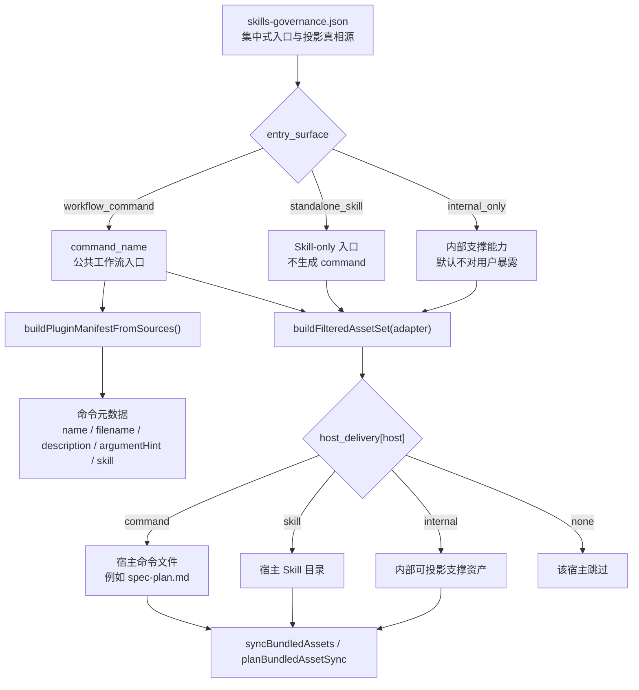

本页解释 spec-first 如何把“用户可见的工作流入口”与“可复用 Skill 资产”分开治理：公开工作流不是散落在文档里的命令别名，而是由集中式 `skills-governance.json` 声明，再由 CLI manifest、宿主适配器、运行时投影和 lint/test 契约共同约束。当前页只覆盖公开工作流命令与 Skill 治理模型；核心研发链路的执行细节请继续阅读 [核心研发链路：brainstorm、prd、plan、write-tasks、work、review、compound](20-he-xin-yan-fa-lian-lu-brainstorm-prd-plan-write-tasks-work-review-compound)，Agent 触发与降级策略请阅读 [Agent 编排策略：Always-on、条件触发、Opt-in 与降级模式](21-agent-bian-pai-ce-lue-always-on-tiao-jian-hong-fa-opt-in-yu-jiang-ji-mo-shi)。Sources: [skills-governance.json](src/cli/contracts/dual-host-governance/skills-governance.json#L1-L4), [plugin.js](src/cli/plugin.js#L107-L150), [skill-agent-quality-governance.md](docs/contracts/workflows/skill-agent-quality-governance.md#L1-L8)

## 架构假设与验证结论

本文的架构假设是：spec-first 的公开入口不是由 `.claude/`、`.codex/`、`.cursor/`、`.kiro/` 或 `.qoder/` 这些 generated runtime 决定，而是由源码侧的 `skills/`、`templates/`、`src/cli/` 与治理契约决定；运行时目录只是宿主适配器按治理表投影出来的镜像。代码验证支持这个假设：`plugin.js` 固定把命令源目录、Skill 源目录与 Agent 源目录定义为 `templates/claude/commands/spec`、`skills`、`agents`，并把 `skills-governance.json` 作为 skills governance truth source 读取；质量治理文档也明确 generated runtime mirrors 不是 source of truth。Sources: [plugin.js](src/cli/plugin.js#L15-L29), [plugin.js](src/cli/plugin.js#L113-L150), [skill-agent-quality-governance.md](docs/contracts/workflows/skill-agent-quality-governance.md#L3-L8), [skill-agent-quality-governance.md](docs/contracts/workflows/skill-agent-quality-governance.md#L74-L80)

第二个验证结论是：公开 workflow command 与 standalone skill 是两个不同入口面。`entry_surface` 只允许 `workflow_command`、`standalone_skill`、`internal_only` 三类；workflow command 必须绑定 `command_name` 并能在 manifest 中找到对应命令，standalone skill 必须保持 `command_name=null` 且不能投影为 command，internal-only skill 不能以 command 或 skill 形式对用户可见。Sources: [skills-governance.schema.json](src/cli/contracts/dual-host-governance/skills-governance.schema.json#L36-L57), [plugin.js](src/cli/plugin.js#L281-L388), [plugin.js](src/cli/plugin.js#L337-L366)

## 概念关系图

下面的图展示公开入口从治理真相源到宿主运行时的投影链路：治理表决定一个 Skill 是 workflow command、standalone skill 还是 internal-only；CLI manifest 只为 workflow command 生成命令元数据；宿主适配器再决定该宿主上表现为 command、skill、internal 或 none。Sources: [plugin.js](src/cli/plugin.js#L107-L150), [plugin.js](src/cli/plugin.js#L586-L656), [skills-governance.schema.json](src/cli/contracts/dual-host-governance/skills-governance.schema.json#L50-L57)



这张图的关键点是：`workflow_command` 不是“某个宿主上的 slash command 文件”，而是“治理表里的公共工作流身份”；某些宿主会把它投影成 command，另一些宿主会把同一个 workflow skill 投影成 skill。`buildFilteredAssetSet()` 正是按 `host_delivery[platform]` 把 workflow skill 分流到 `commands`、`workflowSkills`、`skills`、`internalSkills` 或 `skipped`。Sources: [plugin.js](src/cli/plugin.js#L586-L656), [plugin.js](src/cli/plugin.js#L679-L710)

## Source of Truth：治理表，而不是运行时目录

`skills-governance.json` 是公开工作流入口的集中式事实表。每条记录包含 `skill_name`、`entry_surface`、`command_name`、`host_scope`、`owner_host` 与五个宿主的 `host_delivery`；schema 明确禁止额外属性，因此它只表达入口与投影拓扑，不承担 owner、maturity、review cadence 等生命周期元数据。Sources: [skills-governance.schema.json](src/cli/contracts/dual-host-governance/skills-governance.schema.json#L58-L129), [skill-agent-quality-governance.md](docs/contracts/workflows/skill-agent-quality-governance.md#L81-L88), [tests/unit/skill-agent-quality-governance-contracts.test.js](tests/unit/skill-agent-quality-governance-contracts.test.js#L63-L81)

治理表的验证逻辑比普通 JSON schema 更进一步：它会确认每个 `skill_name` 对应真实 bundled skill，禁止重复 skill，校验 `entry_surface`、`host_scope`、`host_delivery` 是否属于允许集合，并把 workflow command 与 manifest 中的命令定义进行交叉验证。这样做的结果是，用户可见入口必须同时满足“源码资产存在”“治理记录存在”“命令元数据存在”三层条件。Sources: [plugin.js](src/cli/plugin.js#L252-L279), [plugin.js](src/cli/plugin.js#L281-L347)

## 三种 Entry Surface 的职责边界

| Entry Surface | 用户可见性 | `command_name` 规则 | 投影约束 | 典型含义 |
|---|---:|---|---|---|
| `workflow_command` | 是 | 必须是字符串，且等于 manifest 中对应命令名 | 可按宿主投影为 `command` 或 `skill` | 公开工作流，例如 `spec-plan`、`spec-work` |
| `standalone_skill` | 是 | 必须为 `null` | 不允许任何宿主投影为 `command` | 独立能力入口，例如 `using-spec-first` |
| `internal_only` | 否 | 必须为 `null` | 不允许投影为用户可见 `command` 或 `skill` | 内部支撑 Skill 或 helper capability |

这三类入口的区别直接由校验代码强制：workflow command 若缺少 manifest command 会报错，非 workflow skill 若存在 command 会报错，standalone skill 若被投影为 command 会报错，internal-only skill 若被投影为 command 或 skill 也会报错。Sources: [plugin.js](src/cli/plugin.js#L337-L375), [skills-governance.schema.json](src/cli/contracts/dual-host-governance/skills-governance.schema.json#L36-L57)

## 当前公开工作流命令清单

| Public workflow skill | `command_name` | Claude | Codex | Cursor | Kiro | Qoder |
|---|---|---|---|---|---|---|
| `spec-doc-review` | `doc-review` | command | skill | skill | skill | command |
| `spec-app-consistency-audit` | `app-consistency-audit` | command | skill | skill | skill | command |
| `spec-brainstorm` | `brainstorm` | command | skill | skill | skill | command |
| `spec-prd` | `prd` | command | skill | skill | skill | command |
| `spec-compound` | `compound` | command | skill | skill | skill | command |
| `spec-compound-refresh` | `compound-refresh` | command | skill | skill | skill | command |
| `spec-debug` | `debug` | command | skill | skill | skill | command |
| `spec-ideate` | `ideate` | command | skill | skill | skill | command |
| `spec-mcp-setup` | `mcp-setup` | command | skill | skill | skill | command |
| `spec-optimize` | `optimize` | command | skill | skill | skill | command |
| `spec-plan` | `plan` | command | skill | skill | skill | command |
| `spec-polish-beta` | `polish-beta` | command | skill | skill | skill | command |
| `spec-release-notes` | `release-notes` | command | skill | skill | skill | command |
| `spec-code-review` | `code-review` | command | skill | skill | skill | command |
| `spec-sessions` | `sessions` | command | skill | skill | skill | command |
| `spec-write-skill` | `write-skill` | command | skill | skill | skill | command |
| `spec-skill-audit` | `skill-audit` | command | skill | skill | skill | command |
| `spec-slack-research` | `slack-research` | command | skill | skill | skill | command |
| `spec-write-tasks` | `write-tasks` | command | skill | skill | skill | command |
| `spec-work` | `work` | command | skill | skill | skill | command |

这个清单体现当前治理策略：同一组公开 workflow skill 在 Claude 与 Qoder 上投影为 command，在 Codex、Cursor、Kiro 上投影为 skill；这不是文档约定，而是 `host_delivery` 字段直接声明的结果。Sources: [skills-governance.json](src/cli/contracts/dual-host-governance/skills-governance.json#L33-L45), [skills-governance.json](src/cli/contracts/dual-host-governance/skills-governance.json#L202-L283), [skills-governance.json](src/cli/contracts/dual-host-governance/skills-governance.json#L300-L395), [skills-governance.json](src/cli/contracts/dual-host-governance/skills-governance.json#L397-L480)

## Standalone Skill 与 Internal-only Skill 的治理位置

`using-spec-first`、`spec-rule-miner` 与 `spec-team-standards-governance` 当前是 standalone skill：它们在五个宿主上都以 `skill` 投影，并且 `command_name` 为 `null`。这意味着它们可以被宿主作为 Skill 使用，但不应该被描述成 public workflow command。Sources: [skills-governance.json](src/cli/contracts/dual-host-governance/skills-governance.json#L188-L199), [skills-governance.json](src/cli/contracts/dual-host-governance/skills-governance.json#L482-L493), [skills-governance.json](src/cli/contracts/dual-host-governance/skills-governance.json#L523-L535)

internal-only skill 包括 `agent-native-architecture`、`changelog`、`feature-video`、`frontend-design`、`git-commit`、`proof`、`report-bug` 等支撑能力，它们在治理表中的 `host_delivery` 为 `internal`。校验逻辑要求 internal-only skill 不得对用户暴露为 command 或 skill；`buildFilteredAssetSet()` 也只会在少数显式允许的内部 Skill 集合中投影内部支撑资产。Sources: [skills-governance.json](src/cli/contracts/dual-host-governance/skills-governance.json#L5-L32), [skills-governance.json](src/cli/contracts/dual-host-governance/skills-governance.json#L48-L185), [plugin.js](src/cli/plugin.js#L36-L38), [plugin.js](src/cli/plugin.js#L630-L637)

## 命令元数据如何生成

公开 workflow command 的 manifest 不是手写静态列表，而是从治理表中筛选 `entry_surface === "workflow_command"` 的记录生成。生成过程中，每条 workflow 记录必须有 `command_name` 与 `skill_name`；CLI 会读取对应命令模板或 Skill frontmatter，提取 `description` 与 `argument-hint`，再输出 `name`、`filename`、`description`、`argumentHint`、`skill`。Sources: [plugin.js](src/cli/plugin.js#L113-L139), [plugin.js](src/cli/plugin.js#L160-L181)

`src/cli/spec-commands.js` 本身只是一个薄出口：它调用 `listBundledCommands()` 得到命令列表，并导出 `COMMANDS` 与 `commandNames()`。这说明公开命令集合的来源仍然是 plugin manifest 与治理表，而不是 `spec-commands.js` 里的重复配置。Sources: [spec-commands.js](src/cli/spec-commands.js#L1-L12), [plugin.js](src/cli/plugin.js#L1004-L1023)

## Skill 源文件与命令模板的分工

对于 Claude 这类 command 宿主，命令模板可以只承载 metadata。例如 `templates/claude/commands/spec/plan.md` 明确说明该模板只定义 Claude command metadata，运行时命令由该 frontmatter 与 `skills/spec-plan/SKILL.md` 的正文组合生成；真正改变工作流行为时，应编辑配对 Skill。Sources: [templates/claude/commands/spec/plan.md](templates/claude/commands/spec/plan.md#L1-L13), [src/cli/adapters/claude.js](src/cli/adapters/claude.js#L84-L96)

`skills/spec-plan/SKILL.md` 则承载实际工作流语义：它包含用途、边界、安全契约、Contract Summary、输入输出、失败模式、下游消费者与 workflow 骨架。公共 workflow skill 需要在入口附近暴露紧凑 I/O 与 failure summary，这一点由测试覆盖。Sources: [skills/spec-plan/SKILL.md](skills/spec-plan/SKILL.md#L20-L60), [tests/unit/public-workflow-contract-summary.test.js](tests/unit/public-workflow-contract-summary.test.js#L25-L46)

## 宿主投影模型

| 宿主 | command 支持 | workflow 投影目录 | standalone skill 投影目录 | Agent 投影 | 关键差异 |
|---|---:|---|---|---:|---|
| Claude | 是 | `.claude/spec-first/workflows` | `.claude/skills` | 是 | workflow command 文件在 `.claude/commands`，Skill 正文会重写到 runtime workflow root |
| Codex | 否 | `.agents/skills` | `.agents/skills` | 是 | `.codex/commands/spec` 是 legacy cleanup target，用户可见入口从 Skill 发现 |
| Cursor | 否 | `.cursor/skills` | `.cursor/skills` | 否 | P0 不投影 spec-first agents，并对 generated runtime preview 给出 warning |
| Qoder | 是 | `.qoder/skills` | `.qoder/skills` | 是 | workflow command 文件在 `.qoder/commands`，命令 frontmatter 规范化为 Qoder 格式 |

这些差异来自各宿主 adapter 的属性：Claude 设置 `commandRoot=.claude/commands`、`skillsRoot=.claude/skills`、`workflowsRoot=.claude/spec-first/workflows`；Codex 设置 `hasCommands=false` 且 workflow 与 skill 都在 `.agents/skills`；Cursor 设置 `hasCommands=false`、`supportsAgents=false` 且 workflow 与 skill 都在 `.cursor/skills`；Qoder 设置 `commandRoot=.qoder/commands` 且 workflow 与 skill 都在 `.qoder/skills`。Sources: [src/cli/adapters/claude.js](src/cli/adapters/claude.js#L43-L74), [src/cli/adapters/codex.js](src/cli/adapters/codex.js#L36-L67), [src/cli/adapters/cursor.js](src/cli/adapters/cursor.js#L58-L100), [src/cli/adapters/qoder.js](src/cli/adapters/qoder.js#L34-L73)

## 运行时同步与计划执行

CLI 同步资产时会先调用 `buildFilteredAssetSet(adapter)`，再按宿主能力同步 commands、skills 与 agents。`syncBundledAssets()` 对支持 command 的宿主调用 `syncCommands()`，对所有宿主调用 `syncSkills()`，再按 `supportsAgents` 决定是否同步 agents；`planBundledAssetSync()` 提供对应的 operation plan，用于初始化流水线中的可预览写入。Sources: [plugin.js](src/cli/plugin.js#L679-L710), [plugin.js](src/cli/plugin.js#L713-L759), [plugin.js](src/cli/plugin.js#L761-L858)

Skill 同步时会把 standalone、internal 与 workflow 三类名字合并去重，并根据 `isWorkflowSkill` 决定目标目录；如果 workflow root 与 standalone root 不同，还会清理 standalone root 下的同名 workflow skill，避免同一个公开 workflow 在两个入口面重复出现。Sources: [plugin.js](src/cli/plugin.js#L761-L797), [plugin.js](src/cli/plugin.js#L799-L858)

## 项目结构视图

```text
spec-first/
├── src/cli/contracts/dual-host-governance/
│   ├── skills-governance.json          # Skill 入口面与宿主投影真相源
│   └── skills-governance.schema.json   # 治理表形态约束
├── src/cli/
│   ├── plugin.js                       # manifest 构建、治理校验、资产过滤与同步
│   ├── spec-commands.js                # 公开命令薄导出
│   └── adapters/                       # Claude / Codex / Cursor / Kiro / Qoder 投影规则
├── templates/claude/commands/spec/     # command 宿主的命令 metadata 模板
├── skills/
│   └── */SKILL.md                      # 工作流与 Skill 语义源文件
├── scripts/
│   ├── lint-skill-entrypoints.js       # 入口写法 lint
│   └── lint-skill-entrypoints.config.json
└── tests/unit/
    ├── public-workflow-contract-summary.test.js
    └── lint-skill-entrypoints.test.js
```

这个结构体现“源码治理、运行时生成”的边界：治理、Skill 语义和模板都在源码目录；`.claude/`、`.codex/`、`.cursor/`、`.kiro/`、`.qoder/` 只是在目标项目中由 adapter 生成或检查的 runtime surface。Sources: [plugin.js](src/cli/plugin.js#L15-L29), [skill-agent-quality-governance.md](docs/contracts/workflows/skill-agent-quality-governance.md#L74-L80), [src/cli/adapters/claude.js](src/cli/adapters/claude.js#L48-L78), [src/cli/adapters/codex.js](src/cli/adapters/codex.js#L41-L75), [src/cli/adapters/cursor.js](src/cli/adapters/cursor.js#L63-L100), [src/cli/adapters/qoder.js](src/cli/adapters/qoder.js#L39-L73)

## 入口命名与文档 lint

公开入口治理不仅限制运行时投影，也限制文档写法。`lint-skill-entrypoints.js` 会扫描 `skills`、`CLAUDE.md` 与 `AGENTS.md`，阻止 heading 以 slash command 开头、阻止旧的宿主特定入口写法，并根据治理表动态构造 standalone skill 的 slash-command 禁用规则。Sources: [scripts/lint-skill-entrypoints.config.json](scripts/lint-skill-entrypoints.config.json#L1-L32), [scripts/lint-skill-entrypoints.js](scripts/lint-skill-entrypoints.js#L13-L51), [scripts/lint-skill-entrypoints.js](scripts/lint-skill-entrypoints.js#L53-L71)

这个 lint 有一个重要例外：如果一句话是在明确禁止某个 standalone command alias，例如“Do not route users to `/spec:using-spec-first`”，则不会报错；如果文档正向引导用户使用 standalone skill 的 slash command，就会报 `standalone-command-entrypoint`。测试同时保证 workflow command prose，例如 `spec-work`、`spec-write-tasks`，不会被误报。Sources: [scripts/lint-skill-entrypoints.js](scripts/lint-skill-entrypoints.js#L73-L104), [scripts/lint-skill-entrypoints.js](scripts/lint-skill-entrypoints.js#L173-L178), [tests/unit/lint-skill-entrypoints.test.js](tests/unit/lint-skill-entrypoints.test.js#L40-L104)

## Contract Summary：公开 workflow 的最小可理解边界

所有 public workflow skill，以及必需的 standalone entry skill，需要在入口附近提供紧凑的 Contract Summary。测试要求前 120 行包含 `When To Use`、`When Not To Use`、`Inputs`、`Outputs`、`Artifacts`、`Failure Modes`、`Workflow` 与 `Downstream Consumers`。这让中级开发者在打开 `SKILL.md` 时可以先理解入口边界，再阅读完整 prompt。Sources: [tests/unit/public-workflow-contract-summary.test.js](tests/unit/public-workflow-contract-summary.test.js#L15-L46), [skills/spec-plan/SKILL.md](skills/spec-plan/SKILL.md#L28-L60)

Contract Summary 的定位不是把 workflow 变成硬编码状态机，而是让执行姿态可理解。薄契约要求 public workflow skill 说明 trigger、non-trigger、inputs、outputs、workflow skeleton、failure mode 与 done signal，同时强调 examples-as-context 不能替代 LLM 判断。Sources: [skill-agent-quality-governance.md](docs/contracts/workflows/skill-agent-quality-governance.md#L18-L33)

## 脚本、LLM 与治理边界

公开工作流治理采用“确定性事实地板 + LLM 语义判断”的边界：脚本负责校验文件存在、JSON 形态、必需字符串、路径安全和危险模式；LLM 负责解释风险、选择降级、判断语义质量以及决定是否回到上游 workflow。质量治理文档明确 deterministic tests 不能伪装成语义质量判断。Sources: [skill-agent-quality-governance.md](docs/contracts/workflows/skill-agent-quality-governance.md#L34-L48), [skill-agent-quality-governance.md](docs/contracts/workflows/skill-agent-quality-governance.md#L74-L80)

这个边界也体现在 Contract Summary 的回归测试中：测试不仅检查字段存在，还检查关键 workflow 的边界语言没有漂移，例如 `spec-plan` 中 setup/runtime facts 只是 advisory、implementation-dependent questions 应交给 `spec-work`，`spec-write-tasks` 的 task packs 是 derived execution indexes，`spec-work` 不把 planned run JSON schema 当成当前 runtime truth。Sources: [tests/unit/public-workflow-contract-summary.test.js](tests/unit/public-workflow-contract-summary.test.js#L48-L60)

## 维护者修改公开入口时的安全路径

修改公开 workflow 入口时，先改 `skills-governance.json`，再确保对应 `skills/<skill>/SKILL.md` 存在，并在命令宿主需要 metadata 时提供或复用命令模板 frontmatter；随后通过治理校验、entrypoint lint 与 Contract Summary 测试确认入口面、宿主投影、文档写法与最小契约没有漂移。Sources: [plugin.js](src/cli/plugin.js#L113-L181), [plugin.js](src/cli/plugin.js#L281-L388), [scripts/lint-skill-entrypoints.js](scripts/lint-skill-entrypoints.js#L180-L220), [tests/unit/public-workflow-contract-summary.test.js](tests/unit/public-workflow-contract-summary.test.js#L25-L46)

不应该为了一个公开 workflow 的局部审计发现而新增 `skills/<skill>/manifest.json`、`agents/interface.yaml`、owner/cadence 字段或 maturity metadata；当前集中式 dual-host governance contract 只记录 delivery topology。只有当 owner、review cadence、maturity 或 lifecycle state 存在真实 consumer 且已有聚焦 consumer tests 时，才应设计独立的集中式 advisory lifecycle contract。Sources: [skill-agent-quality-governance.md](docs/contracts/workflows/skill-agent-quality-governance.md#L81-L88), [tests/unit/skill-agent-quality-governance-contracts.test.js](tests/unit/skill-agent-quality-governance-contracts.test.js#L63-L81)

## 阅读建议

如果你想理解这些公开 workflow 在研发过程中的顺序、交接与产物关系，下一步阅读 [核心研发链路：brainstorm、prd、plan、write-tasks、work、review、compound](20-he-xin-yan-fa-lian-lu-brainstorm-prd-plan-write-tasks-work-review-compound)；如果你想理解 public workflow 如何调用或不调用 Agent，阅读 [Agent 编排策略：Always-on、条件触发、Opt-in 与降级模式](21-agent-bian-pai-ce-lue-always-on-tiao-jian-hong-fa-opt-in-yu-jiang-ji-mo-shi)；如果你要新增或修改 Skill，阅读 [新增或修改 Skill 的开发、审计与发布流程](30-xin-zeng-huo-xiu-gai-skill-de-kai-fa-shen-ji-yu-fa-bu-liu-cheng)。Sources: [skill-agent-quality-governance.md](docs/contracts/workflows/skill-agent-quality-governance.md#L1-L8), [tests/unit/skill-agent-quality-governance-contracts.test.js](tests/unit/skill-agent-quality-governance-contracts.test.js#L36-L88)