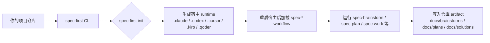
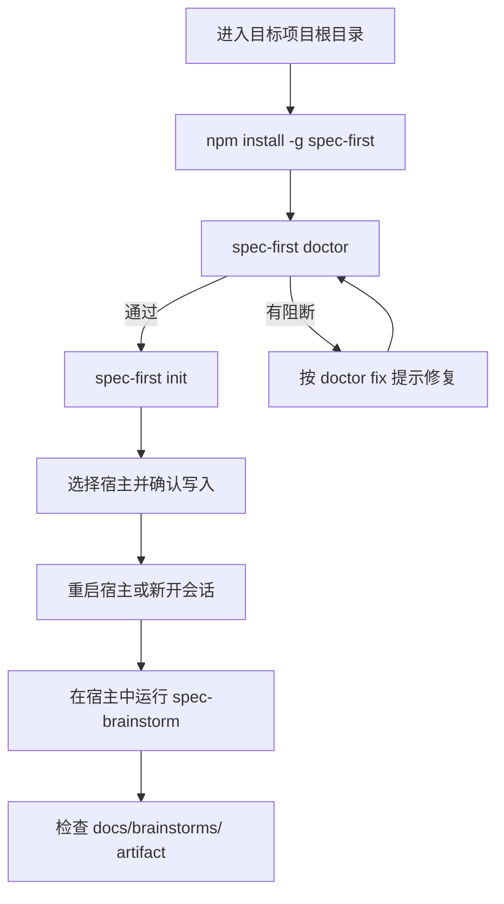

本页是你在目录中的当前位置：[快速开始](2-kuai-su-kai-shi)。它只回答一个问题：**如何在约 5 分钟内把 `spec-first` 装进一个项目，并跑通第一个可检查的 workflow artifact**；更完整的安装细节、首次走查、入口路由和产物解释，请按文末阅读路径继续。Sources: [README.zh-CN.md](README.zh-CN.md#L36-L45), [docs/05-用户手册/01-快速开始.md](docs/05-用户手册/01-快速开始.md#L42-L70)

## 先理解：spec-first 装进去的是什么

我的架构假设是：`spec-first` 不是一个只在终端里运行的“聊天命令集合”，而是一个 **CLI 生成器 + 宿主 runtime + 仓库 artifact** 的轻量闭环；代码验证显示，package CLI 负责 `doctor`、`init`、`update`、`tasks` 等确定性操作，而 `spec-*` workflow 入口是在 `init` 后由 Claude Code、Codex、Cursor、Kiro 或 Qoder 这些宿主加载的 runtime 入口。Sources: [src/cli/index.js](src/cli/index.js#L44-L79), [src/cli/index.js](src/cli/index.js#L158-L181), [src/cli/index.js](src/cli/index.js#L196-L214)



上图只表达快速开始所需的最小路径：先安装 CLI，再在项目根目录执行 `doctor` 和 `init`，然后重启宿主，在宿主会话里运行 workflow；第一次最容易验证的结果通常是 `docs/brainstorms/` 或 `docs/plans/` 中出现新的 Markdown artifact。Sources: [README.zh-CN.md](README.zh-CN.md#L30-L34), [README.zh-CN.md](README.zh-CN.md#L90-L111), [docs/05-用户手册/01-快速开始.md](docs/05-用户手册/01-快速开始.md#L122-L160)

## 前置条件

开始前请确认：Node.js 版本至少为 `20.0.0`，npm 可用，Git 已安装并在 `PATH` 中，并且你已经准备好至少一个宿主：Claude Code、Codex、Cursor、Kiro 或 Qoder；如果只是首次评估，建议先在测试仓库或临时仓库里体验，再初始化真实项目。Sources: [package.json](package.json#L112-L114), [README.zh-CN.md](README.zh-CN.md#L40-L45)

| 需要准备 | 用途 | 最小判断方式 |
|---|---|---|
| Node.js `>=20.0.0` | 运行 `spec-first` npm CLI | `node -v` |
| npm | 全局安装 CLI | `npm -v` |
| Git | 让 `doctor`、setup 和 workflow 读取仓库事实 | `git --version` |
| Claude Code / Codex / Cursor / Kiro / Qoder | 加载 `spec-*` workflow runtime | 安装后由 `spec-first doctor` 检查 |
| 项目仓库根目录 | runtime 和 artifact 都落在当前项目内 | 在目标 repo 根目录执行命令 |

这些检查不是额外概念，而是 `doctor` 的真实职责：代码中会检查 Node.js 主版本、Git 可用性，并按平台尝试验证宿主 CLI；无参数时，`doctor` 会自动检测当前项目里已经初始化过的 spec-first 平台。Sources: [src/cli/commands/doctor.js](src/cli/commands/doctor.js#L42-L66), [src/cli/commands/doctor.js](src/cli/commands/doctor.js#L106-L146), [src/cli/commands/doctor.js](src/cli/commands/doctor.js#L148-L200)

## 第 1 步：安装 CLI

在 macOS、Linux 或 Windows 的终端中安装 npm 包；包名和可执行命令都叫 `spec-first`，`package.json` 中的 `bin` 映射把 `spec-first` 指向 `bin/spec-first.js`。Sources: [package.json](package.json#L2-L8), [README.zh-CN.md](README.zh-CN.md#L47-L68)

```bash
npm install -g spec-first
```

安装后可以先查看版本页；版本页会直接提示快速上手顺序：`spec-first doctor`、`spec-first init`、重启宿主，然后在对话中使用 `spec-plan`、`spec-work`、`spec-code-review`、`spec-mcp-setup` 等宿主 workflow 入口。Sources: [src/cli/index.js](src/cli/index.js#L192-L218)

```bash
spec-first -v
```

如果你在 macOS/Linux shell 中刚替换过旧版本，且终端缓存了旧路径，可以执行 `hash -r`；Windows PowerShell 或 `cmd.exe` 没有 `hash -r`，直接新开终端窗口即可。Sources: [docs/05-用户手册/01-快速开始.md](docs/05-用户手册/01-快速开始.md#L24-L31)

## 第 2 步：检查环境

安装后的第一个项目内命令应该是 `spec-first doctor`；它用于确认 Node、Git、宿主 CLI、已生成的 commands、skills、agents 和 managed state 是否处于可用状态。Sources: [docs/05-用户手册/01-快速开始.md](docs/05-用户手册/01-快速开始.md#L42-L58), [src/cli/commands/doctor.js](src/cli/commands/doctor.js#L203-L354)

```bash
spec-first doctor
```

如果你已经知道当前要检查哪个宿主，可以显式指定平台；`doctor` 支持 `--claude`、`--codex`、`--cursor`、`--kiro`、`--qoder` 和 `--json`。Sources: [src/cli/commands/doctor.js](src/cli/commands/doctor.js#L28-L40), [src/cli/commands/doctor.js](src/cli/commands/doctor.js#L44-L55)

```bash
spec-first doctor --claude
spec-first doctor --codex
spec-first doctor --cursor
spec-first doctor --kiro
spec-first doctor --qoder
```

## 第 3 步：初始化项目 runtime

在目标项目仓库根目录执行 `spec-first init`，按交互引导选择宿主、确认开发者姓名和语言，然后预览写入内容并确认；当前实现支持 Claude Code、Codex、Cursor、Kiro、Qoder 五类宿主选择。Sources: [docs/05-用户手册/01-快速开始.md](docs/05-用户手册/01-快速开始.md#L56-L70), [src/cli/commands/init.js](src/cli/commands/init.js#L77-L113), [src/cli/commands/init.js](src/cli/commands/init.js#L170-L231)

```bash
spec-first init
```

`init` 的常用非交互参数如下；初学者通常先用交互模式即可，只有在脚本化初始化、指定宿主或多仓库 workspace 时才需要这些参数。Sources: [src/cli/commands/init.js](src/cli/commands/init.js#L126-L145), [src/cli/commands/init.js](src/cli/commands/init.js#L276-L388)

| 参数 | 作用 | 初学者建议 |
|---|---|---|
| `--claude` / `--codex` / `--cursor` / `--kiro` / `--qoder` | 明确选择要生成 runtime 的宿主 | 不确定时用交互选择 |
| `-y` / `--yes` | 跳过交互，使用默认或显式宿主 | 脚本化时使用 |
| `--dry-run` | 只预览计划，不写入文件 | 担心覆盖时先运行 |
| `--repo <path>` | 在父 workspace 中只初始化某个 child repo | 多仓库时使用 |
| `--all-repos` | 显式批量处理 child repos | 只有维护多仓库时使用 |
| `--user <name>` | 指定开发者姓名 | 需要固定身份时使用 |
| `--lang zh|en` | 指定语言偏好 | 中文文档/团队可用 `--lang zh` |

初始化完成后，项目内会出现宿主 runtime 目录：Claude Code 常见为 `.claude/commands/spec-*.md`、`.claude/skills`、`.claude/spec-first/workflows`、`.claude/agents`；Codex 常见为 `.agents/skills`、`.codex/agents`；不同宿主的 generated runtime 都可以通过重新执行 `spec-first init` 重建。Sources: [docs/05-用户手册/01-快速开始.md](docs/05-用户手册/01-快速开始.md#L62-L70), [README.zh-CN.md](README.zh-CN.md#L80-L88)

```text
your-project/
├── .claude/                 # 选择 Claude Code 时生成
│   ├── commands/spec-*.md
│   ├── skills/
│   ├── agents/
│   └── spec-first/
├── .codex/                  # 选择 Codex 时生成
│   └── agents/
├── .agents/
│   └── skills/              # Codex skill runtime
├── .cursor/                 # 选择 Cursor preview 时生成
├── .kiro/                   # 选择 Kiro 时生成
├── .qoder/                  # 选择 Qoder 时生成
├── docs/
│   ├── brainstorms/         # 第一个需求类 artifact 常在这里
│   ├── plans/
│   └── solutions/
└── .spec-first/             # workflow 运行证据等本地状态
```

## 第 4 步：重启宿主

执行 `init` 后，请重启 Claude Code、Codex、Cursor、Kiro 或 Qoder，或开启一个新会话；这是因为 `spec-brainstorm`、`spec-plan`、`spec-work` 等不是 package CLI 子命令，而是由宿主加载的 workflow 入口。Sources: [README.zh-CN.md](README.zh-CN.md#L90-L101), [src/cli/index.js](src/cli/index.js#L208-L214)

```text
# 不要在 shell 里当作 CLI 子命令运行：
spec-brainstorm "描述你的第一个任务"

# 正确位置：
# 在 Claude Code / Codex / Cursor / Kiro / Qoder 的会话中输入上面的 workflow 入口
```

## 第 5 步：运行第一个 workflow

初学者建议从 `spec-brainstorm` 开始，因为它的职责是把一个已选定的问题、功能或改进方向澄清成可交接的 WHAT，并把持久化产物写入 `docs/brainstorms/`。Sources: [README.zh-CN.md](README.zh-CN.md#L94-L111), [skills/spec-brainstorm/SKILL.md](skills/spec-brainstorm/SKILL.md#L9-L29)

```text
spec-brainstorm "添加用户登录功能"
```

如果你的需求已经足够明确，也可以从 `spec-plan` 开始；`spec-plan` 的职责是把清晰目标、需求文档、bug 或粗略任务转成 HOW 层面的计划，但它不会直接执行代码变更，执行应交给后续 `spec-work`。Sources: [skills/spec-plan/SKILL.md](skills/spec-plan/SKILL.md#L8-L18), [skills/spec-plan/SKILL.md](skills/spec-plan/SKILL.md#L20-L27)

| 你的当前状态 | 推荐入口 | 预期产物 |
|---|---|---|
| 只有粗略想法、功能方向或产品变化 | `spec-brainstorm` | `docs/brainstorms/` |
| 已有 PRD、需求笔记或 brownfield change request | `spec-prd` | 需求类 artifact |
| 目标清楚，需要技术计划 | `spec-plan` | `docs/plans/` |
| 已有计划或任务，准备实现 | `spec-work` | 源码变更 + 运行证据 |
| 需要审查文档、计划、task pack 或代码 diff | `spec-doc-review` / `spec-code-review` | 结构化审查结论 |
| 工作完成后想沉淀经验 | `spec-compound` | `docs/solutions/` |

这张表只用于快速开始路由；完整入口速查属于后续页面，请继续阅读 [工作流入口速查与任务路由](6-gong-zuo-liu-ru-kou-su-cha-yu-ren-wu-lu-you)。Sources: [README.zh-CN.md](README.zh-CN.md#L113-L123), [docs/05-用户手册/01-快速开始.md](docs/05-用户手册/01-快速开始.md#L126-L160)

## 第 6 步：确认成功

第一次成功的最小信号不是“AI 回答得很好”，而是仓库里出现了可检查的 artifact；`spec-brainstorm` 完成后，优先检查 `docs/brainstorms/YYYY-MM-DD-NNN-<topic>-requirements.md` 这类文件。Sources: [README.zh-CN.md](README.zh-CN.md#L103-L111), [skills/spec-brainstorm/SKILL.md](skills/spec-brainstorm/SKILL.md#L24-L29)

```text
docs/
└── brainstorms/
    └── YYYY-MM-DD-NNN-<topic>-requirements.md
```

后续更完整的链路会逐步积累 `docs/brainstorms/`、`docs/plans/`、源码与测试变更、结构化评审结论以及 `docs/solutions/`；但第一次试用只需要确认一个 artifact 已经写进仓库即可。Sources: [docs/05-用户手册/01-快速开始.md](docs/05-用户手册/01-快速开始.md#L154-L160), [README.zh-CN.md](README.zh-CN.md#L127-L141)

## 最小流程图

下面是快速开始的完整执行顺序；如果某一步失败，不要跳过它，先按错误提示修复，再继续下一步。Sources: [README.zh-CN.md](README.zh-CN.md#L47-L111), [docs/05-用户手册/01-快速开始.md](docs/05-用户手册/01-快速开始.md#L42-L80)



## 常见卡点

快速开始阶段最常见的问题集中在“命令位置”和“runtime 是否重载”：`spec-first doctor`、`spec-first init` 是终端 CLI 命令；`spec-brainstorm`、`spec-plan`、`spec-work` 等是宿主会话里的 workflow 入口，`init` 后必须重启宿主才能稳定加载。Sources: [src/cli/index.js](src/cli/index.js#L196-L214), [README.zh-CN.md](README.zh-CN.md#L90-L101)

| 现象 | 可能原因 | 处理方式 |
|---|---|---|
| `spec-first doctor` 提示没有检测到平台 | 当前项目还没初始化 runtime | 运行 `spec-first init` 并选择宿主 |
| 宿主里看不到 `spec-*` 入口 | `init` 后宿主没有重启 | 完全重启宿主或新开会话 |
| 终端里运行 `spec-brainstorm` 失败 | 把宿主 workflow 当成 CLI 子命令 | 到 Claude Code / Codex / Cursor / Kiro / Qoder 会话中运行 |
| `doctor` 报 Git 或 Node 问题 | Git 不在 `PATH` 或 Node 版本过低 | 安装 Git，升级 Node 到 `>=20.0.0` |
| Cursor 相关行为不稳定 | Cursor 当前是 generated-runtime preview，需要显式 opt-in | 使用 `spec-first init --cursor`，并按输出提示验证 |

这些处理方式来自当前实现：`doctor` 在未检测到平台时会提示运行 `spec-first init`，Node 检查要求主版本不低于 20，Git 检查失败会提示安装 Git 并确保它在 `PATH` 中；Cursor 在 README 中标注为需要显式 `--cursor` opt-in 的 generated-runtime preview。Sources: [src/cli/commands/doctor.js](src/cli/commands/doctor.js#L57-L65), [src/cli/commands/doctor.js](src/cli/commands/doctor.js#L106-L146), [README.zh-CN.md](README.zh-CN.md#L40-L45)

## 你现在应该读什么

如果你已经完成本页并拿到了第一个 artifact，下一步建议按目录顺序继续：[适用场景与核心价值](3-gua-yong-chang-jing-yu-he-xin-jie-zhi) 帮你判断什么时候值得使用 spec-first，[安装、环境检查与宿主初始化](4-an-zhuang-huan-jing-jian-cha-yu-su-zhu-chu-shi-hua) 展开本页略过的安装细节，[第一次工作流走查：从需求到仓库产物](5-di-ci-gong-zuo-liu-zou-cha-cong-xu-qiu-dao-cang-ku-chan-wu) 带你完整跑一圈从需求到 artifact 的流程。Sources: [README.zh-CN.md](README.zh-CN.md#L123-L141), [docs/05-用户手册/01-快速开始.md](docs/05-用户手册/01-快速开始.md#L122-L160)

如果你已经知道自己要做什么，但不确定选哪个入口，直接读 [工作流入口速查与任务路由](6-gong-zuo-liu-ru-kou-su-cha-yu-ren-wu-lu-you)；如果你想确认每个产物会写到哪里，再读 [产物目录与可检查工程轨迹](7-chan-wu-mu-lu-yu-ke-jian-cha-gong-cheng-gui-ji)；如果你在多个宿主之间切换，再读 [多宿主使用指南：Claude Code、Codex、Cursor、Kiro 与 Qoder](8-duo-su-zhu-shi-yong-zhi-nan-claude-code-codex-cursor-kiro-yu-qoder)。Sources: [README.zh-CN.md](README.zh-CN.md#L143-L160), [README.zh-CN.md](README.zh-CN.md#L193-L200)