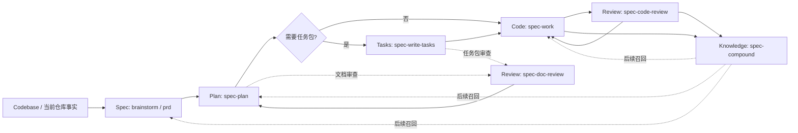
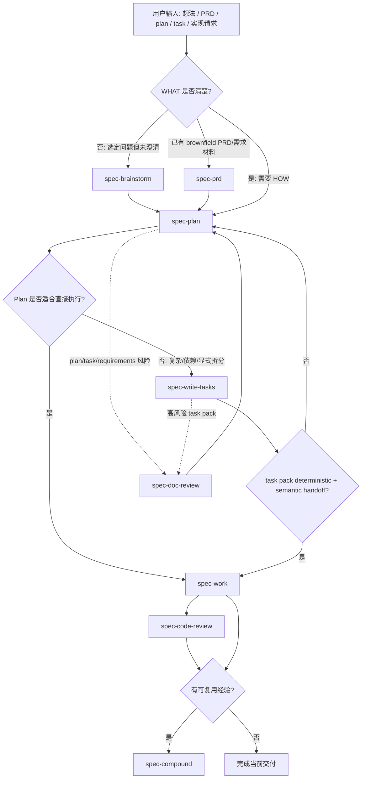

本页位于「Workflow 与 Skill 系统」中的核心链路节点，解释 `spec-first` 如何把一次研发工作从需求澄清推进到计划、任务拆分、实现、审查与知识沉淀；它只覆盖 `spec-brainstorm`、`spec-prd`、`spec-plan`、`spec-write-tasks`、`spec-work`、`spec-code-review` / `spec-doc-review`、`spec-compound` 之间的职责边界、产物流转与交接规则，不展开宿主初始化、CLI 生成 runtime、Agent 编排细节或质量门禁体系。Sources: [workflow-skill-agent-map.md](docs/workflow-skill-agent-map.md#L4-L20), [README.zh-CN.md](README.zh-CN.md#L143-L158)

## 研发链路的第一性原理：把会话变成可检查轨迹

`spec-first` 的核心研发链路可以概括为 `Codebase → Spec → Plan → Tasks → Code → Review → Knowledge`：需求阶段把“要做什么”固定为仓库内文档，计划阶段把“怎么做”固定为可评审方案，任务阶段在必要时派生可执行任务包，实现阶段产生源码变更与验证证据，审查阶段给出结构化 findings，最后由 compound 把刚解决的问题沉淀为可复用知识。Sources: [workflow-skill-agent-map.md](docs/workflow-skill-agent-map.md#L4-L20), [README.zh-CN.md](README.zh-CN.md#L127-L141)

这条链路的关键不是强制所有项目走满每一步，而是让每一步都有清晰的**输入、输出、边界和下游消费者**：`spec-brainstorm` 与 `spec-prd` 负责 WHAT，`spec-plan` 负责 HOW，`spec-write-tasks` 是可选派生层，`spec-work` 负责受控执行，`spec-code-review` / `spec-doc-review` 负责结构化审查，`spec-compound` 负责把已验证的经验写入 `docs/solutions/`。Sources: [skills/spec-brainstorm/SKILL.md](skills/spec-brainstorm/SKILL.md#L9-L38), [skills/spec-plan/SKILL.md](skills/spec-plan/SKILL.md#L8-L60), [skills/spec-write-tasks/SKILL.md](skills/spec-write-tasks/SKILL.md#L6-L48), [skills/spec-work/SKILL.md](skills/spec-work/SKILL.md#L11-L47), [skills/spec-compound/SKILL.md](skills/spec-compound/SKILL.md#L16-L48)

下图展示核心研发链路的概念关系；注意 `Tasks` 是 Plan 与 Work 之间的**可选派生层**，Review 既可以审代码 diff，也可以审 requirements、plan 或 task pack，而 Knowledge 只接收已经解决且可复用的问题经验。Sources: [workflow-skill-agent-map.md](docs/workflow-skill-agent-map.md#L107-L113), [skills/spec-write-tasks/SKILL.md](skills/spec-write-tasks/SKILL.md#L56-L65), [skills/spec-doc-review/SKILL.md](skills/spec-doc-review/SKILL.md#L11-L43)



## 入口与产物总览

核心研发链路的公开入口统一使用 `spec-*` 形式；这些入口不是 shell 命令式的源码脚本，而是在受支持宿主会话中触发的 workflow。它们产出的 durable artifacts 主要位于 `docs/brainstorms/`、`docs/plans/`、`docs/tasks/`、`docs/solutions/`，而 `spec-work` 的权威证据主要来自 repo diff、验证输出、提交或 PR 交接以及必要的 downstream artifacts。Sources: [README.zh-CN.md](README.zh-CN.md#L90-L111), [README.zh-CN.md](README.zh-CN.md#L143-L158), [skills/spec-work/SKILL.md](skills/spec-work/SKILL.md#L29-L36)

| 阶段 | 入口 | 主要职责 | 典型产物 | 下游 |
|---|---|---|---|---|
| Spec / 探索 | `spec-brainstorm` | 澄清选定问题或功能的 WHAT | `docs/brainstorms/*-requirements.md` | `spec-plan`、review、work |
| Spec / PRD | `spec-prd` | 将已有系统增量、粗糙 PRD 或需求材料转成 planning-ready PRD | `docs/brainstorms/*-requirements.md`，`artifact_kind: prd-requirements` | `spec-plan`、`spec-doc-review` |
| Plan | `spec-plan` | 把清晰目标或需求文档转成 HOW plan | `docs/plans/*-plan.md` | `spec-write-tasks`、`spec-work`、`spec-doc-review` |
| Tasks | `spec-write-tasks` | 可选地把 settled plan 编译为派生任务包 | `docs/tasks/*-tasks.md` | `spec-work`、`spec-doc-review` |
| Code | `spec-work` | 在验证过的范围内执行实现 | 源码 diff、验证结果、closeout summary | `spec-code-review`、commit/PR、`spec-compound` |
| Review | `spec-code-review` / `spec-doc-review` | 审代码 diff 或审 requirements/plan/task pack | findings、safe_auto fixes、handoff | `spec-work`、人工 review、`spec-compound` |
| Knowledge | `spec-compound` | 将刚解决的问题沉淀为复用知识 | `docs/solutions/**/*` | 后续 brainstorm/plan/work/review |

Sources: [docs/05-用户手册/04-workflows-artifacts-map.md](docs/05-用户手册/04-workflows-artifacts-map.md#L25-L35), [workflow-skill-agent-map.md](docs/workflow-skill-agent-map.md#L26-L40), [README.zh-CN.md](README.zh-CN.md#L147-L157)

项目结构上，这条链路的长期协作层主要落在 `docs/` 下；`.spec-first/workflows/spec-work/...` 可保存 compact work evidence，但它不是 plan/task 的 source authority，review 的完整 per-run JSON bundle 默认也不是 repo-local durable artifact。Sources: [docs/05-用户手册/04-workflows-artifacts-map.md](docs/05-用户手册/04-workflows-artifacts-map.md#L15-L18), [docs/05-用户手册/04-workflows-artifacts-map.md](docs/05-用户手册/04-workflows-artifacts-map.md#L106-L121)

```text
docs/
  brainstorms/   # spec-brainstorm 与 spec-prd 的 requirements / PRD-grade artifacts
  plans/         # spec-plan 的 implementation plans
  tasks/         # spec-write-tasks 的 derived task packs
  solutions/     # spec-compound 的 reusable learnings

.spec-first/
  workflows/
    spec-work/   # 可选 closeout evidence；不是 plan/task 的权威来源
```

Sources: [README.zh-CN.md](README.zh-CN.md#L127-L141), [docs/05-用户手册/04-workflows-artifacts-map.md](docs/05-用户手册/04-workflows-artifacts-map.md#L36-L51)

## Spec 阶段：brainstorm 与 prd 的分工

`spec-brainstorm` 用在用户已经有一个选定问题、功能或改进方向，但行为、范围、用户、成功标准或规划交接上下文仍未澄清时；它的目标是先把 WHAT 问清楚，避免后续 planning 被迫发明产品行为。它不用于开放式 idea generation、已有 PRD 的 brownfield 编写/细化、实现规划、执行、调试或 review。Sources: [skills/spec-brainstorm/SKILL.md](skills/spec-brainstorm/SKILL.md#L9-L20), [skills/spec-brainstorm/SKILL.md](skills/spec-brainstorm/SKILL.md#L39-L53)

`spec-prd` 用在 brownfield 场景：已有系统增量、粗糙产品笔记、低质量 PRD 或代码感知 PRD 验证需要进入研发前被澄清成稳定的 PRD-grade requirements。它强调 current-state evidence、Change Delta、owner decision trace、acceptance、scope boundaries 与 assumptions，并默认写入 `docs/brainstorms/*-requirements.md`，使用 `artifact_kind: prd-requirements`，而不是新建第二套 `docs/prds/` 拓扑。Sources: [skills/spec-prd/SKILL.md](skills/spec-prd/SKILL.md#L8-L20), [skills/spec-prd/SKILL.md](skills/spec-prd/SKILL.md#L79-L88)

两者的差异可以用“从哪里开始”理解：`spec-brainstorm` 从一个仍需探索的问题框架开始，产出需求 brief；`spec-prd` 从已有系统表面、现有 PRD 或需求材料开始，通过 source-first grilling 与 readiness lens 让 PRD 达到 planning-ready。Sources: [skills/spec-brainstorm/SKILL.md](skills/spec-brainstorm/SKILL.md#L21-L38), [skills/spec-prd/SKILL.md](skills/spec-prd/SKILL.md#L22-L54)

| 对比项 | `spec-brainstorm` | `spec-prd` |
|---|---|---|
| 主要问题 | 这个功能/问题到底要解决什么？ | 这个 brownfield 增量是否已足够进入规划？ |
| 输入形态 | 选定 feature/problem、上下文、可选 brainstorm doc | 现有 PRD、粗糙笔记、当前系统证据、owner decisions |
| 输出形态 | requirements doc 或 brief alignment summary | PRD-grade requirements artifact、质量诊断或 route-out |
| 关键边界 | 不做 HOW planning | 不写 implementation plan，不实现代码 |
| 下游 | `spec-plan`、owners、reviewers、work/review flows | `spec-plan`、`spec-doc-review`、product owners、future work/review flows |

Sources: [skills/spec-brainstorm/SKILL.md](skills/spec-brainstorm/SKILL.md#L21-L38), [skills/spec-prd/SKILL.md](skills/spec-prd/SKILL.md#L32-L54)

## Plan 阶段：把 WHAT 转成 HOW，但不越界执行

`spec-plan` 把清晰目标、需求文档、bug、项目或已有 plan 转为 evidence-grounded HOW plan；它明确区分 `spec-brainstorm` 定义 WHAT、`spec-plan` 定义 HOW、`spec-work` 执行 plan。直接调用 `spec-plan` 时，workflow 会停留在 planning 中：如果输入不清楚，就提问或 bootstrap，而不是退出或开始实现。Sources: [skills/spec-plan/SKILL.md](skills/spec-plan/SKILL.md#L8-L18), [skills/spec-plan/SKILL.md](skills/spec-plan/SKILL.md#L85-L93)

Plan 阶段的安全合同是**planning only until handoff**：在 post-plan handoff choice 之前，只能研究、决策并写入或更新 plan artifact，不能修改代码/config/runtime source、运行实现 workflow 或声称实现已经开始；plan 写完并 review 后，需要阻塞式等待用户明确选择下一步，不能自动进入 `spec-work`、task compilation、issue creation 或代码编辑。Sources: [skills/spec-plan/SKILL.md](skills/spec-plan/SKILL.md#L20-L27)

一个合格 plan 应包含问题框架、范围边界、需求追踪、repo-relative 文件路径、测试路径、决策与理由、已有模式、依赖顺序、风险与验证范围；当计划提出新 source surface 时，还要记录 `reuse / extend / new` 决策。Sources: [skills/spec-plan/SKILL.md](skills/spec-plan/SKILL.md#L95-L120)

Plan 的下游消费者包括 `spec-write-tasks`、`spec-work`、`spec-doc-review`、issue creation、Proof/HITL review paths 和人工实现 reviewers；因此它既是工程执行的上下文，也是 review 判断“实现是否越界”的重要依据。Sources: [skills/spec-plan/SKILL.md](skills/spec-plan/SKILL.md#L42-L60), [skills/spec-code-review/SKILL.md](skills/spec-code-review/SKILL.md#L107-L126)

## Tasks 阶段：可选派生层，不是第二份计划

`spec-write-tasks` 是 `spec-plan` 与 `spec-work` 之间的可选派生层：它不执行代码，只在 settled local source plan 太大、依赖复杂、用户明确要求拆分，或现有 task pack 需要执行前验证时，把 plan 编译为 task pack 或验证 task pack。Sources: [skills/spec-write-tasks/SKILL.md](skills/spec-write-tasks/SKILL.md#L6-L24)

这个阶段最重要的边界是：`spec-plan` 永远是 single source of truth，task pack 只能重新组织执行 slices，不能改变 scope、acceptance criteria、non-goals、repo ownership 或 product decisions；task pack 也不是进度状态、审批状态、生命周期数据库或第二份 plan。Sources: [skills/spec-write-tasks/SKILL.md](skills/spec-write-tasks/SKILL.md#L56-L65), [workflow-skill-agent-map.md](docs/workflow-skill-agent-map.md#L107-L110)

当编译成功时，task pack 位于 `docs/tasks/`，并必须带有 `spec_id`、`source_plan`、`source_plan_hash`、`generated_by: spec-write-tasks`、`mode: derived` 与有效的 `Task Pack Contract` JSON block；最终交接必须运行 `spec-first tasks validate <task-pack-path> --json` 后，才能报告 deterministic handoff 或允许 `next_action: spec-work-task-pack`。Sources: [skills/spec-write-tasks/SKILL.md](skills/spec-write-tasks/SKILL.md#L34-L45), [skills/spec-write-tasks/SKILL.md](skills/spec-write-tasks/SKILL.md#L85-L116)

`spec-write-tasks` 也可以决定跳过任务包：当 direct `spec-work` 更便宜、更安全时返回 `skip`；当 scope、acceptance、architecture、verification 或 repo ownership 未解决时返回 `return-to-plan`；当只能辅助讨论但不可执行时返回 `draft-only`。Sources: [skills/spec-write-tasks/SKILL.md](skills/spec-write-tasks/SKILL.md#L75-L83)

## Work 阶段：在已验证范围内实现

`spec-work` 接收 validated task pack、settled plan、spec path 或 concrete implementation request，并在当前 repo scope 内系统执行；它会保持 source plan/task boundary、遵循已有模式、运行聚焦验证，并在 WHAT/HOW 未解决、repo scope 模糊、task pack stale/unverifiable 或范围会扩张时停止并交接回上游。Sources: [skills/spec-work/SKILL.md](skills/spec-work/SKILL.md#L11-L23), [skills/spec-work/SKILL.md](skills/spec-work/SKILL.md#L37-L47)

Work 阶段的输入取向是从当前请求、plan/task pack、已加载项目指令、package manifests、附近源码/测试、git diff 或 changed files 开始；它使用 direct source reads、`rg`、ast-grep、git diff、focused tests、logs、package metadata 与用户提供 artifacts 作为证据基础，不要求外部图谱或可选工具先 ready。Sources: [skills/spec-work/SKILL.md](skills/spec-work/SKILL.md#L63-L70), [skills/spec-work/SKILL.md](skills/spec-work/SKILL.md#L128-L135)

`spec-work` 在实现前会建立最小反馈回路，例如 failing/characterization test、CLI invocation、HTTP/browser script、trace replay、throwaway harness、property/fuzz loop、docs contract check 或 schema validation；实现过程中优先用 vertical tracer bullets，完成一个行为的实现、验证和必要交接证据后再扩大到下一个行为。Sources: [skills/spec-work/SKILL.md](skills/spec-work/SKILL.md#L77-L82)

如果执行过程中发现输入是裸 prompt 且产品 WHAT 不清楚，`spec-work` 会推荐回到 brainstorm；如果目标清楚但没有 settled plan，会回到 plan；如果 plan 大到需要执行者临时拆依赖、waves 或跨模块 ownership，会建议使用 `spec-write-tasks`，并保持 task compilation 是可选派生层而非强制状态。Sources: [skills/spec-work/SKILL.md](skills/spec-work/SKILL.md#L174-L183)

## Review 阶段：代码审查与文档审查是两条不同边界

`spec-code-review` 用于审当前 branch diff、PR、分支实现变更或显式 base scope；它会解析 mode token，做 runtime/readiness preflight，选择 scale-aware reviewers，在可用且安全时 dispatch 多 persona，否则降级为单 agent report-only，并通过 confidence-gated findings、merge/dedup synthesis 与 optional safe fixes 给出结构化结果。Sources: [skills/spec-code-review/SKILL.md](skills/spec-code-review/SKILL.md#L7-L43), [skills/spec-code-review/SKILL.md](skills/spec-code-review/SKILL.md#L147-L180)

`spec-code-review` 的核心审查轴不只是“代码有没有 bug”，还包括 diff 是否留在授权范围内：它会携带 `scope_boundary`、`authorized_scope_source` 与 `scope_boundary_evidence`，并把 unauthorized file change、scope creep、unverifiable claim、missing verification 等作为可 surfaced finding 的类型。Sources: [skills/spec-code-review/SKILL.md](skills/spec-code-review/SKILL.md#L107-L126)

`spec-doc-review` 则用于审 requirements、plans、task packs 或 Markdown planning artifacts，关注 coherence、feasibility、scope、risk 与 downstream readiness；它不会审代码 diff、不会执行实现，也不会把 task pack 当成独立 source plan。Sources: [skills/spec-doc-review/SKILL.md](skills/spec-doc-review/SKILL.md#L7-L43)

文档审查会按内容形态先分类：requirements 关注 WHAT/WHY，plan 关注 HOW，task-pack 关注派生执行输入是否忠于 source plan 且适合 `spec-work`；对 task pack，它会检查是否指向一个 repo-relative `source_plan`、是否使用 `Task Pack Contract`、是否没有添加 source plan 之外的 scope、acceptance、non-goals、公有契约或实现决策。Sources: [skills/spec-doc-review/SKILL.md](skills/spec-doc-review/SKILL.md#L105-L143)

| Review 类型 | 适用对象 | 主要问题 | 不做什么 |
|---|---|---|---|
| `spec-code-review` | diff、PR、branch implementation changes | 实现是否正确、测试是否足够、是否越界、是否有 residual risk | 不审 requirements/plan-only 文档，不创建 commit/push/PR |
| `spec-doc-review` | requirements、plans、task packs、Markdown planning artifacts | 文档是否一致、可行、范围正确、下游是否 ready | 不审代码 diff，不执行实现，不把 task pack 当 source plan |

Sources: [skills/spec-code-review/SKILL.md](skills/spec-code-review/SKILL.md#L13-L43), [skills/spec-doc-review/SKILL.md](skills/spec-doc-review/SKILL.md#L13-L43)

## Compound 阶段：把刚解决的问题沉淀为可复用知识

`spec-compound` 只在真实问题刚被解决、且经验值得未来 agent 或团队复用时使用；它不用于 active debugging、未解决实现、一句话总结、原始 transcript 归档，也不是每次 work 完成后的强制 gate。Sources: [skills/spec-compound/SKILL.md](skills/spec-compound/SKILL.md#L16-L25)

它的主要产物是一份 `docs/solutions/` learning document，带 YAML frontmatter 以支持后续检索；输出还可以包含 duplicate/related-doc notes、可选 discoverability maintenance 与 evidence-backed summary，但 durable output 仍然应聚焦“一个可复用经验 + 证据路径”，而不是复制完整上游报告或 raw tool output。Sources: [skills/spec-compound/SKILL.md](skills/spec-compound/SKILL.md#L10-L15), [skills/spec-compound/SKILL.md](skills/spec-compound/SKILL.md#L26-L48), [skills/spec-compound/SKILL.md](skills/spec-compound/SKILL.md#L88-L104)

Compound 消费上游 work/review/debug summaries 时采用 summary-first handoff；即使上游带有外部工具或 broad impact evidence，compound 也只能在 claim 被 changed source、tests、logs、contracts 或 review findings source-confirmed 后，记录为可复用 learning。Sources: [skills/spec-compound/SKILL.md](skills/spec-compound/SKILL.md#L88-L99)

沉淀后的 `docs/solutions/` 会成为后续 brainstorm、plan、work、debug、review 的 advisory recall source：它能提示历史经验和边界，但后续 workflow 仍需要回到 source refs 或直接证据确认，而不能把 recall 当成当前事实。Sources: [workflow-skill-agent-map.md](docs/workflow-skill-agent-map.md#L20-L20), [skills/spec-work/SKILL.md](skills/spec-work/SKILL.md#L124-L127), [skills/spec-compound/SKILL.md](skills/spec-compound/SKILL.md#L46-L48)

## 典型路径与分支决策

最完整的研发路径是：先用 `spec-brainstorm` 或 `spec-prd` 形成 requirements，再用 `spec-plan` 制定 implementation plan；如果 plan 足够小，直接进入 `spec-work`，如果 plan 较大或依赖复杂，则通过 `spec-write-tasks` 生成 task pack；实现后通过 `spec-code-review` 审 diff，必要时用 `spec-doc-review` 审 requirements/plan/task pack，最后将可复用经验用 `spec-compound` 写入 `docs/solutions/`。Sources: [README.zh-CN.md](README.zh-CN.md#L113-L123), [workflow-skill-agent-map.md](docs/workflow-skill-agent-map.md#L12-L20), [docs/05-用户手册/04-workflows-artifacts-map.md](docs/05-用户手册/04-workflows-artifacts-map.md#L36-L51)



Sources: [skills/spec-write-tasks/SKILL.md](skills/spec-write-tasks/SKILL.md#L102-L117), [skills/spec-work/SKILL.md](skills/spec-work/SKILL.md#L174-L197), [skills/spec-compound/SKILL.md](skills/spec-compound/SKILL.md#L18-L45)

对于中级开发者，最实用的判断规则是：**需求不稳先 Spec，方案不稳先 Plan，执行过大先 Tasks，代码已改先 Code Review，文档要交接先 Doc Review，问题刚解决且可复用才 Compound**。这不是额外流程负担，而是避免让后续阶段替上游阶段发明上下文。Sources: [skills/spec-brainstorm/SKILL.md](skills/spec-brainstorm/SKILL.md#L15-L38), [skills/spec-plan/SKILL.md](skills/spec-plan/SKILL.md#L95-L120), [skills/spec-write-tasks/SKILL.md](skills/spec-write-tasks/SKILL.md#L75-L83), [skills/spec-code-review/SKILL.md](skills/spec-code-review/SKILL.md#L13-L43), [skills/spec-compound/SKILL.md](skills/spec-compound/SKILL.md#L18-L45)

## 边界速查：什么时候不该继续当前 workflow

如果你在 `spec-brainstorm` 中发现用户其实要开放式 idea generation，应转向 ideation；如果发现已有 PRD 需要 brownfield authoring/refinement/validation，应转向 `spec-prd`；如果请求已经是清晰 HOW planning，应转向 `spec-plan`；如果已经是 execution-ready，应转向 `spec-work`。Sources: [skills/spec-brainstorm/SKILL.md](skills/spec-brainstorm/SKILL.md#L39-L53)

如果你在 `spec-prd` 中发现请求是 0-1 product exploration、implementation planning、task execution、debugging、PRD/design/source audit 或 lightweight direct fix，就不应继续 PRD authoring；PRD 的职责是让 WHAT/WHY、current-state evidence、acceptance 与 scope boundaries 达到 planning-ready，而不是替代 plan 或 work。Sources: [skills/spec-prd/SKILL.md](skills/spec-prd/SKILL.md#L24-L54), [skills/spec-prd/SKILL.md](skills/spec-prd/SKILL.md#L79-L88)

如果你在 `spec-plan` 中发现用户要求实现代码、调查失败测试根因、审完成文档或生成 task-pack，应分别转向 `spec-work` / `spec-debug` / `spec-doc-review` / `spec-write-tasks`；Plan 阶段只到 handoff，不跨入执行。Sources: [skills/spec-plan/SKILL.md](skills/spec-plan/SKILL.md#L20-L37)

如果你在 `spec-write-tasks` 中发现 plan 太小、scope 未定、repo scope 缺失、hash stale、contract invalid 或 task pack 改写了 source plan 范围，应分别 skip、return-to-plan 或 validation failure，而不是强行生成可执行任务。Sources: [skills/spec-write-tasks/SKILL.md](skills/spec-write-tasks/SKILL.md#L38-L45), [skills/spec-write-tasks/SKILL.md](skills/spec-write-tasks/SKILL.md#L75-L83), [skills/spec-write-tasks/SKILL.md](skills/spec-write-tasks/SKILL.md#L124-L132)

如果你在 `spec-work` 中发现 WHAT/HOW 未解决、target repo scope 模糊、task pack stale/unverifiable、scope 会扩张或需要把 generated runtime mirrors 当 source fix 手改，应停止并返回用户可执行的 handoff，而不是“边做边补计划”。Sources: [skills/spec-work/SKILL.md](skills/spec-work/SKILL.md#L21-L39), [skills/spec-work/SKILL.md](skills/spec-work/SKILL.md#L185-L197)

## 建议阅读路径

如果你是第一次使用这条研发链路，建议先读 [第一次工作流走查：从需求到仓库产物](5-di-ci-gong-zuo-liu-zou-cha-cong-xu-qiu-dao-cang-ku-chan-wu)，再读本页理解每个阶段的边界；需要查入口选择时，回到 [工作流入口速查与任务路由](6-gong-zuo-liu-ru-kou-su-cha-yu-ren-wu-lu-you)；需要看产物落在哪里时，读 [产物目录与可检查工程轨迹](7-chan-wu-mu-lu-yu-ke-jian-cha-gong-cheng-gui-ji)。Sources: [README.zh-CN.md](README.zh-CN.md#L94-L123), [docs/05-用户手册/04-workflows-artifacts-map.md](docs/05-用户手册/04-workflows-artifacts-map.md#L7-L35)

理解本页之后，下一步可以沿目录继续读 [Agent 编排策略：Always-on、条件触发、Opt-in 与降级模式](21-agent-bian-pai-ce-lue-always-on-tiao-jian-hong-fa-opt-in-yu-jiang-ji-mo-shi)，它解释 review 与 plan 等 workflow 中 persona / subagent 的激活方式；如果你更关心 prompt 结构和引用加载，则继续读 [Prompt 精简、Triggered Reference 与 Front Controller 模式](22-prompt-jing-jian-triggered-reference-yu-front-controller-mo-shi)。Sources: [workflow-skill-agent-map.md](docs/workflow-skill-agent-map.md#L24-L48), [skills/spec-plan/SKILL.md](skills/spec-plan/SKILL.md#L67-L76), [skills/spec-prd/SKILL.md](skills/spec-prd/SKILL.md#L115-L128)

当你开始把 `spec-work` 与 review 纳入团队日常时，建议补读 [任务包、运行证据与 Honest Closeout](24-ren-wu-bao-yun-xing-zheng-ju-yu-honest-closeout) 和 [docs/solutions 知识库与 Compound 机制](27-docs-solutions-zhi-shi-ku-yu-compound-ji-zhi)，前者帮助判断执行证据是否足够，后者帮助判断哪些经验值得进入 `docs/solutions/`。Sources: [docs/05-用户手册/04-workflows-artifacts-map.md](docs/05-用户手册/04-workflows-artifacts-map.md#L106-L121), [skills/spec-compound/SKILL.md](skills/spec-compound/SKILL.md#L88-L104)