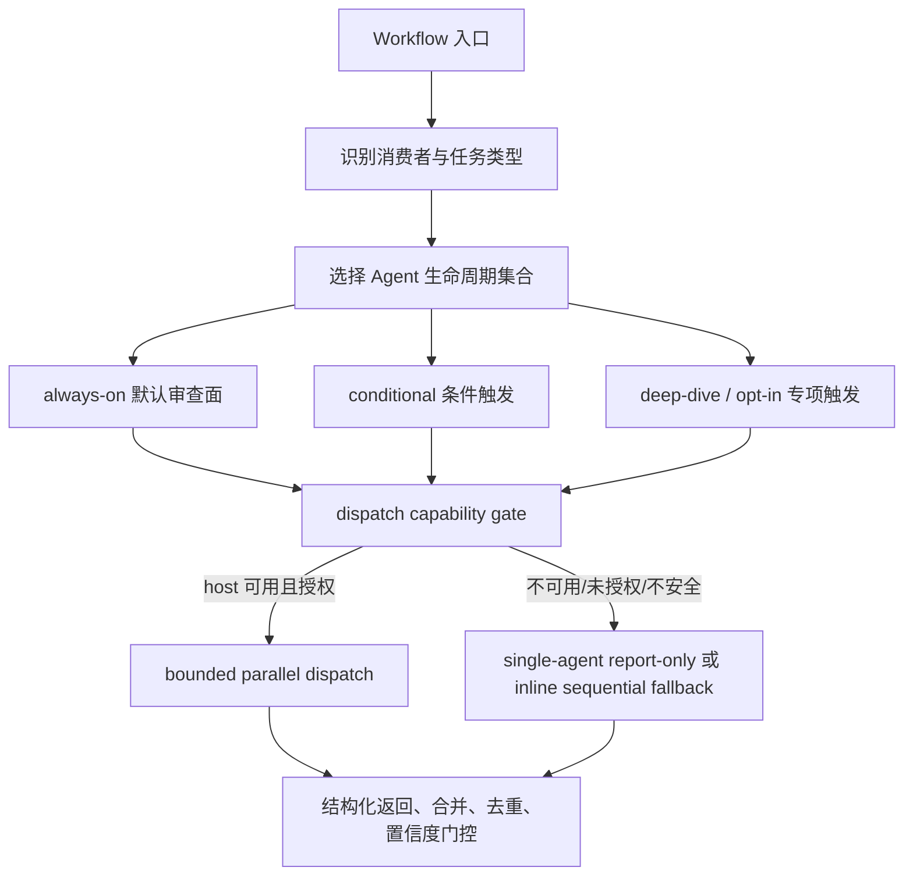
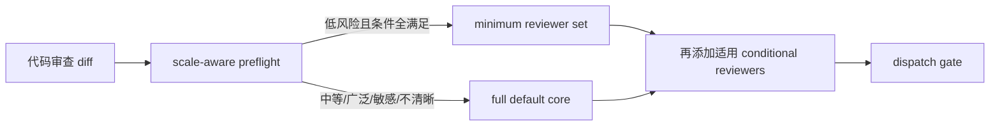
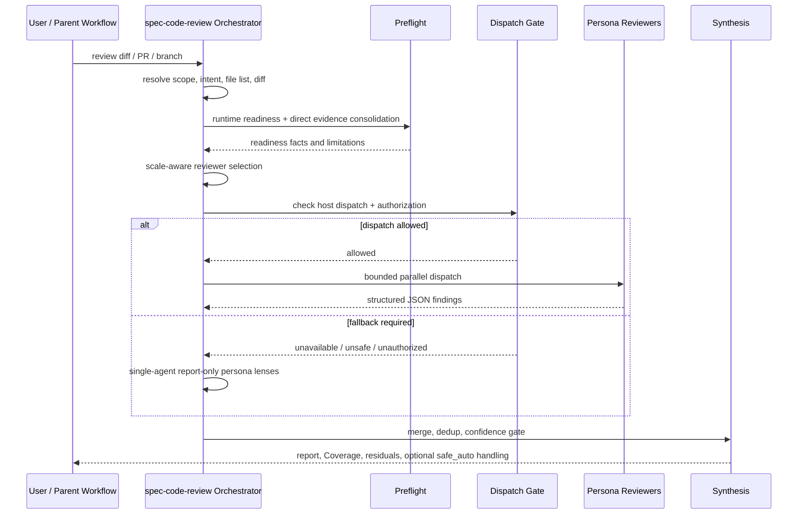

本页解释 spec-first 中 **Agent 编排策略** 的核心边界：哪些 Agent 属于 always-on 默认审查面，哪些按 diff、文档、技术栈、风险或用户请求条件触发，哪些只在明确 opt-in 或 deep-dive 场景下使用，以及当宿主 dispatch 能力不可用、不安全或未授权时如何降级。当前页位于「Workflow 与 Skill 系统」章节，向前衔接 [核心研发链路：brainstorm、prd、plan、write-tasks、work、review、compound](20-he-xin-yan-fa-lian-lu-brainstorm-prd-plan-write-tasks-work-review-compound)，向后衔接 [Prompt 精简、Triggered Reference 与 Front Controller 模式](22-prompt-jing-jian-triggered-reference-yu-front-controller-mo-shi)。Sources: [workflow-skill-agent-map.md](docs/workflow-skill-agent-map.md#L24-L48), [agent-lifecycle-catalog.md](docs/contracts/agents/agent-lifecycle-catalog.md#L21-L30)

## 架构假设与源码验证结论

从第一性原理看，spec-first 的 Agent 编排不是“尽可能多地启动专家”，而是一个受 **workflow scope、host dispatch boundary、evidence boundary、成本/延迟、输出契约** 共同约束的选择系统。源码验证显示：Agent 生命周期目录明确声明自己不是运行时调度器、不授权新增自动 dispatch，真正的执行权仍在 workflow skill 与 agent frontmatter；因此本文讨论的是已实现的编排模式，而不是隐含的全局调度引擎。Sources: [agent-lifecycle-catalog.md](docs/contracts/agents/agent-lifecycle-catalog.md#L1-L19)

核心假设可以归纳为四层：第一，workflow 先决定当前任务属于代码审查、文档审查、ideation、plan、work、compound 等哪类消费者；第二，消费者内部按 always-on、conditional、deep-dive/opt-in 分类选择 Agent；第三，dispatch gate 检查宿主是否允许并行子代理；第四，失败时必须进入显式降级路径，而不是绕过宿主边界伪造“多 Agent”执行。Sources: [workflow-skill-agent-map.md](docs/workflow-skill-agent-map.md#L107-L113), [skills/spec-code-review/SKILL.md](skills/spec-code-review/SKILL.md#L689-L710), [skills/spec-doc-review/SKILL.md](skills/spec-doc-review/SKILL.md#L228-L250)

上图表达的是编排控制面，而不是单个 workflow 的完整业务流程：代码审查会继续进入 finding merge、autofix、Coverage；文档审查会进入 synthesis、presentation、routing；ideation 会进入 grounding、候选生成与 critique。共同点是，Agent 并行只是一种 **执行加速与上下文隔离机制**，不是 correctness 的唯一来源。Sources: [skills/spec-code-review/SKILL.md](skills/spec-code-review/SKILL.md#L37-L43), [skills/spec-doc-review/SKILL.md](skills/spec-doc-review/SKILL.md#L37-L43), [skills/spec-ideate/SKILL.md](skills/spec-ideate/SKILL.md#L83-L88)

## 生命周期分类：不是全局标签，而是 per-consumer 分类

Agent Lifecycle Catalog 明确指出，Lifecycle 是 **per-consumer classification**，不是 Agent 的全局唯一属性；同一个 Agent 在一个 workflow 中可能是默认核心，在另一个 workflow 中可能是 conditional 或 deep-dive。这个设计避免了“某个专家一旦存在就到处默认触发”的膨胀，也让不同 workflow 能根据自身输出契约与风险面局部优化编排。Sources: [agent-lifecycle-catalog.md](docs/contracts/agents/agent-lifecycle-catalog.md#L21-L30)

| 生命周期 | 含义 | 编排边界 |
|---|---|---|
| `always-on` | 至少一个列出的 consumer 默认会考虑或默认 dispatch | 必须说明默认发生在哪个 consumer；scale-aware minimum set 或用户 opt-out 可以按 workflow 合同跳过 |
| `conditional` | 满足明确 diff、文档、技术栈、风险或用户请求信号时使用 | 无触发信号时不派发 |
| `deep-dive` | 专项研究、专项审计、复杂背景调查或显式 opt-in 时使用 | 不作为普通 review 默认 reviewer |
| `deprecated candidate` | 消费者不清、能力重叠或偏旧场景 | 保留 source，等待回源确认后合并、降级或退役 |

Sources: [agent-lifecycle-catalog.md](docs/contracts/agents/agent-lifecycle-catalog.md#L25-L30)

这组分类的工程意义在于：always-on 提供基础审查覆盖，conditional 把专业风险面绑定到可观察触发信号，deep-dive/opt-in 控制高成本或外部上下文访问，deprecated candidate 则把不确定能力保留在 source 层而非运行时默认面。文档还要求新增、删除或重命名 `agents/*.agent.md` 时同步维护目录，并在 workflow 实际 dispatch 规则冲突时回源到 workflow skill 和 agent frontmatter 修正 catalog。Sources: [agent-lifecycle-catalog.md](docs/contracts/agents/agent-lifecycle-catalog.md#L14-L19), [agent-lifecycle-catalog.md](docs/contracts/agents/agent-lifecycle-catalog.md#L121-L132)

## Always-on：默认覆盖，但仍受规模与宿主边界约束

代码审查的 full/default core reviewers 包含 `spec-correctness-reviewer`、`spec-testing-reviewer`、`spec-maintainability-reviewer`、`spec-project-standards-reviewer`、`spec-agent-native-reviewer` 和 `spec-learnings-researcher`，分别覆盖逻辑正确性、测试缺口、可维护性、项目标准、agent-native 可达性和历史经验检索。源码同时声明，scale-aware reviewer preflight 可以在低风险 diff 中用更小 minimum set 替代 full default core。Sources: [skills/spec-code-review/SKILL.md](skills/spec-code-review/SKILL.md#L257-L269), [skills/spec-code-review/SKILL.md](skills/spec-code-review/SKILL.md#L523-L579)

文档审查的 always-on 基线更窄：`spec-coherence-reviewer` 与 `spec-feasibility-reviewer` 总是纳入；随后再按产品、设计、安全、范围、对抗等信号添加条件 persona。源码中的示例会向用户说明哪些 persona 参与审查以及 conditional persona 的触发理由，这保证多 Agent 编排具备可见性，而不是在后台静默扩散。Sources: [skills/spec-doc-review/SKILL.md](skills/spec-doc-review/SKILL.md#L201-L227)

Always-on 并不等于“每次都无条件并发启动”。代码审查 Stage 3 会先记录 changed file count、untracked excluded count、非测试非生成非 lock 行数、docs-only、simple-config-only、sensitive-diff、prior-comments、plan-explicit 等事实；只有当 minimum-set 条件不满足时才使用 full default core，事实缺失、模糊或与 diff 矛盾时才保守回到 full default core。Sources: [skills/spec-code-review/SKILL.md](skills/spec-code-review/SKILL.md#L529-L579)

这意味着 always-on 是“默认审查面”的概念，而不是绕过成本控制、宿主权限和风险分级的绝对命令。对高级开发者而言，关键判断不是“某个 Agent 是否 always-on”，而是“该 workflow 的当前 posture 是 minimum 还是 full，以及触发 full 的事实是否被 Coverage 记录”。Sources: [skills/spec-code-review/SKILL.md](skills/spec-code-review/SKILL.md#L558-L579), [skills/spec-code-review/SKILL.md](skills/spec-code-review/SKILL.md#L594-L612)

## 条件触发：从 diff、文档内容、技术栈和外部上下文信号进入

代码审查的 conditional reviewers 分为 cross-cutting、stack-specific 和 Spec-First migration-specific 三组。cross-cutting 包括安全、性能、API 合约、数据迁移、可靠性、对抗审查、CLI readiness 与 previous comments；stack-specific 包括 Rails、Python、TypeScript、前端竞态、Swift/iOS 等；migration-specific 则在 migration artifacts 出现时触发 schema drift 和部署验证。Sources: [skills/spec-code-review/SKILL.md](skills/spec-code-review/SKILL.md#L270-L300)

| 条件类型 | 典型 Agent | 触发信号 |
|---|---|---|
| 横切风险 | `spec-security-reviewer`, `spec-performance-reviewer`, `spec-api-contract-reviewer`, `spec-reliability-reviewer` | auth、公开端点、DB 查询、缓存、路由、序列化、错误处理、重试、后台任务 |
| 技术栈 | `spec-kieran-typescript-reviewer`, `spec-kieran-python-reviewer`, `spec-swift-ios-reviewer`, `spec-julik-frontend-races-reviewer` | TS/JS、Python、Swift/iOS、异步 UI、DOM 生命周期 |
| 数据迁移 | `spec-data-migrations-reviewer`, `spec-schema-drift-detector`, `spec-deployment-verification-agent` | migration 文件、schema dump、backfill 脚本、数据转换 |
| PR 上下文 | `spec-previous-comments-reviewer` | PR metadata 存在且 `hasPriorComments=true` |

Sources: [skills/spec-code-review/SKILL.md](skills/spec-code-review/SKILL.md#L270-L300), [skills/spec-code-review/SKILL.md](skills/spec-code-review/SKILL.md#L583-L592)

文档审查的 conditional personas 直接从文档内容中提取信号：product-lens 在文档提出可挑战的 WHAT/WHY 或战略影响时触发，design-lens 在 UI/UX、用户流、交互、响应式或 accessibility 出现时触发，security-lens 在 auth、API、PII、支付、token、第三方集成等信任边界出现时触发，scope-guardian 在优先级层级、需求数量、stretch goal 或目标-需求错配时触发，adversarial-document-reviewer 在需求/实现单元较多、架构决策或高风险领域出现时触发。Sources: [skills/spec-doc-review/SKILL.md](skills/spec-doc-review/SKILL.md#L144-L192)

conditional selection 不是单纯关键词匹配。代码审查明确要求先读取 diff 与 file list，进行 deterministic scale-aware preflight，再由 Agent judgment 判断哪些 conditional reviewers 适配当前 diff；同时 previous-comments 必须满足“PR-only AND comment-gated”，stack-specific persona 是 additive，migration-only agents 不能因 model/query-only 变更误触发。Sources: [skills/spec-code-review/SKILL.md](skills/spec-code-review/SKILL.md#L523-L527), [skills/spec-code-review/SKILL.md](skills/spec-code-review/SKILL.md#L581-L592)

## Opt-in 与 Deep-dive：高成本、外部组织上下文和专项调查不默认广播

`spec-slack-researcher` 是最典型的 opt-in：workflow map 将它标注为 opt-in，ideation 源码进一步规定 Slack context 在两种模式下都 **never auto-dispatch**，只有用户要求 Slack context 且工具可用时才并行派发；如果工具存在但用户未要求，只在 grounding summary 中提示可用，让用户选择是否 opt in。Sources: [workflow-skill-agent-map.md](docs/workflow-skill-agent-map.md#L28-L31), [workflow-skill-agent-map.md](docs/workflow-skill-agent-map.md#L111-L112), [skills/spec-ideate/SKILL.md](skills/spec-ideate/SKILL.md#L336-L336)

deep-dive Agent 服务专项研究、专项审计或复杂背景调查，不应成为普通审查默认 reviewer。例如 `spec-best-practices-researcher`、`spec-repo-research-analyst`、`spec-git-history-analyzer`、`spec-performance-oracle`、`spec-data-migration-expert` 等在生命周期目录中被归入 deep-dive 或专项消费者路径；这类能力强调研究深度、历史语境或生产风险，而不是每次 diff 的基础覆盖。Sources: [agent-lifecycle-catalog.md](docs/contracts/agents/agent-lifecycle-catalog.md#L74-L84), [agent-lifecycle-catalog.md](docs/contracts/agents/agent-lifecycle-catalog.md#L90-L102), [agent-lifecycle-catalog.md](docs/contracts/agents/agent-lifecycle-catalog.md#L108-L116)

Opt-in 的边界还与外部证据治理相关。AI Coding Harness 合同规定 external-tool evidence 在 source、test、log、schema、contract 或用户确认前都是 advisory，外部工具和 provider 不拥有 scope authority、finding authority、root-cause authority、mutation authority 或 workflow state；因此需要用户授权的组织上下文、Web、Issue、Slack、Graph 等输入都不能直接升级为确认性结论。Sources: [ai-coding-harness.md](docs/contracts/ai-coding-harness.md#L26-L33), [ai-coding-harness.md](docs/contracts/ai-coding-harness.md#L35-L46)

## 降级模式：dispatch 是可选执行形态，不是审查存在性的前提

代码审查在入口摘要中声明：当宿主暴露 reviewer dispatch primitive 时默认并行 spawn 子代理并返回结构化 JSON；当 dispatch 不可用、显式禁用或不安全时，退化为 single-agent report-only review，而不是绕过宿主边界。Failure Modes 也明确把 unavailable/unsafe dispatch 与 degraded optional external-tool evidence 纳入失败/降级面。Sources: [skills/spec-code-review/SKILL.md](skills/spec-code-review/SKILL.md#L7-L10), [skills/spec-code-review/SKILL.md](skills/spec-code-review/SKILL.md#L33-L40)

文档审查同样定义了 dispatch capability gate：必须确认当前宿主暴露 dispatch primitive，当前用户请求或父 workflow 明确授权 subagents / parallel reviewer work / delegated review，并且所选 reviewers 属于当前文档审查阶段；如果授权缺失、runtime 不支持、用户要求 report-only/no-agents，必须进入 single-agent report-only fallback。Sources: [skills/spec-doc-review/SKILL.md](skills/spec-doc-review/SKILL.md#L228-L250)

| 场景 | 行为 | 不允许做什么 |
|---|---|---|
| dispatch 可用且授权 | bounded parallel dispatch，按所选 persona 并行或排队执行 | 不覆盖用户权限设置，不传入伪造 permission mode |
| dispatch 不可用/未授权/不安全 | 设置 `single_agent_report_only_fallback`，当前 orchestrator 串行应用 persona lenses | 不调用 `Agent`、`Task`、`spawn_agent` 或隐藏 helper 伪造多 Agent |
| headless/autofix 且缺 dispatch 能力 | 停止并说明 mutating review 需要 reviewer/fixer dispatch capability | 不写 artifact，不应用 fix，不宣称完整审查 |
| optional external-tool 不可用 | 继续 direct evidence lane，并在 Coverage 记录 limitation | 不声称未确认的 blast radius、affected tests 或 graph impact |

Sources: [skills/spec-code-review/SKILL.md](skills/spec-code-review/SKILL.md#L681-L710), [skills/spec-code-review/SKILL.md](skills/spec-code-review/SKILL.md#L740-L748), [skills/spec-code-review/SKILL.md](skills/spec-code-review/SKILL.md#L101-L105)

降级不是“降低结论标准”，而是改变执行形态。代码审查 fallback 仍使用同一 diff、plan、standards 和 direct evidence，只是由 orchestrator 自己串行应用 selected persona lenses，跳过 validator dispatch 和 fixer paths，并在 Coverage 中说明 fallback 原因；文档审查 fallback 也要求保留同一 persona checklist 与分类边界，只是不编辑文档、不追加 Open Questions、不进入交互式 walk-through。Sources: [skills/spec-code-review/SKILL.md](skills/spec-code-review/SKILL.md#L702-L710), [skills/spec-doc-review/SKILL.md](skills/spec-doc-review/SKILL.md#L244-L250)

## Direct Evidence：Agent 编排必须站在事实地板上

无论是否并行 dispatch，code review 都不要求 external-tool readiness 才能开始 reviewer dispatch；它使用 direct diff reads、source reads、`rg`、ast-grep、package/test facts、logs 和用户提供 artifacts 构建审查上下文并确认 findings。任何无法从 bounded direct evidence 确认的 impact surface，只能记录为 residual risk 或 test candidate，而不能进入 confirmed finding。Sources: [skills/spec-code-review/SKILL.md](skills/spec-code-review/SKILL.md#L101-L105)

文档审查也不要求 external-tool readiness；当文档声明 codebase 或 current-state 事实时，workflow 使用 bounded direct reads、`rg`、ast-grep、package/test facts、logs 和用户证据核查。Phase 1b 的 `{codebase_facts}` 是 advisory evidence，只改善 reviewer navigation 和减少重复读取，不是 hard gate、不选择 persona、不替代 reviewer judgment，也不阻止 dispatch。Sources: [skills/spec-doc-review/SKILL.md](skills/spec-doc-review/SKILL.md#L70-L73), [skills/spec-doc-review/SKILL.md](skills/spec-doc-review/SKILL.md#L193-L199)

这与 Harness 合同中的分层一致：Scripts 负责 deterministic invariants 和 deterministic facts，LLM workflows 在事实地板之上判断 semantic adequacy；Context Harness、Evidence Harness、Governance Harness 共同限制 raw dump、generated runtime、external provider 和 workflow state 的边界。Sources: [ai-coding-harness.md](docs/contracts/ai-coding-harness.md#L15-L24), [ai-coding-harness.md](docs/contracts/ai-coding-harness.md#L26-L33)

## 编排模式对比

| 模式 | 典型消费者 | 触发来源 | 优点 | 风险控制 |
|---|---|---|---|---|
| Always-on | `spec-code-review`, `spec-doc-review` | workflow 默认核心审查面 | 保证基础质量覆盖，不依赖用户记得点名专家 | scale-aware minimum set、Coverage、host dispatch gate |
| Conditional | code/doc review、plan research | diff、文档内容、技术栈、PR metadata、migration artifacts | 将专业审查成本绑定到实际风险信号 | 条件必须可解释，不能只靠关键词，不能无信号派发 |
| Opt-in | Slack、专项外部组织上下文 | 用户明确请求或父 workflow 明确授权 | 避免隐私、授权和无关上下文污染 | advisory evidence、工具可用性检查、用户选择权 |
| Deep-dive | 历史考古、性能 oracle、数据迁移 expert、repo research | 专项审计、复杂背景调查、显式 deep-dive 需求 | 提供高深度分析而不拖慢普通路径 | 不作为普通 review 默认 reviewer |
| Fallback | code/doc review、ideation 等 | dispatch 不可用、未授权、不安全或失败 | 保持 workflow 可完成，避免宿主耦合 | report-only、inline/sequential、明确 Coverage limitation |

Sources: [agent-lifecycle-catalog.md](docs/contracts/agents/agent-lifecycle-catalog.md#L25-L30), [skills/spec-code-review/SKILL.md](skills/spec-code-review/SKILL.md#L303-L305), [skills/spec-doc-review/SKILL.md](skills/spec-doc-review/SKILL.md#L236-L250), [skills/spec-ideate/SKILL.md](skills/spec-ideate/SKILL.md#L83-L88)

## 代码审查中的交互序列

下面的交互图展示了 `spec-code-review` 中 Agent 编排的核心路径：orchestrator 先解析 scope、建立 evidence、选择 reviewers，再通过 dispatch gate 决定并行或 fallback；所有 reviewer 返回最终都汇入 orchestrator 的 merge/dedup/confidence gate，而不是让 leaf reviewer 直接拥有最终 finding authority。Sources: [skills/spec-code-review/SKILL.md](skills/spec-code-review/SKILL.md#L651-L710), [skills/spec-code-review/SKILL.md](skills/spec-code-review/SKILL.md#L758-L810)

Leaf reviewer 的权限被刻意限制：persona sub-agents 对项目与文件系统是 non-mutating，只进行审查并返回结构化 JSON；它们可以使用非变更型检查命令收集证据，但不能编辑项目文件、写临时 artifact 或提出无关 speculative refactor。Sources: [skills/spec-code-review/SKILL.md](skills/spec-code-review/SKILL.md#L758-L775)

## Ideation 中的宽度控制与 Opt-in 示例

`spec-ideate` 展示了另一类编排：它不是 reviewer persona，而是 grounding + ideation 的并行生成系统。源码规定直接调用 ideation workflow 会授权已文档化的 grounding 和 ideation sub-agent 阶段；如果 dispatch 不可用、显式禁用或非容量原因失败，则顺序或 inline 执行，仍必须产出 ideation artifact，因为 dispatch 只改善 breadth、latency 和 context separation，不决定 correctness。Sources: [skills/spec-ideate/SKILL.md](skills/spec-ideate/SKILL.md#L83-L88)

ideation 在 dispatch 前会向用户暴露预计 Agent 数量：repo mode 通常包括 codebase scan、learnings、web research 和 6 个 ideation sub-agents；issue-tracker intent 会加入 issue intelligence 并收窄 ideation sub-agent 数；Slack research 只有用户 opt-in 时才加 1；web research 可被用户用 skip phrase 跳过。Sources: [skills/spec-ideate/SKILL.md](skills/spec-ideate/SKILL.md#L246-L254), [skills/spec-ideate/SKILL.md](skills/spec-ideate/SKILL.md#L318-L336)

这说明 Agent 编排的用户体验目标不是隐藏复杂性，而是用简短可见的 operational note 暴露成本与能力边界：将“会启动多少 Agent、哪些可跳过、哪些需 opt-in”提前说清楚，避免高级用户在长延迟后才发现系统做了过宽或未授权的上下文搜索。Sources: [skills/spec-ideate/SKILL.md](skills/spec-ideate/SKILL.md#L246-L254), [skills/spec-code-review/SKILL.md](skills/spec-code-review/SKILL.md#L143-L145)

## 实践判断准则

当你修改或新增 workflow 时，首先判断该 Agent 是否真的属于当前 consumer 的基础审查面；如果只是某个风险信号下有价值，就写成 conditional；如果需要外部组织上下文、历史考古、专项审计或高成本研究，就写成 deep-dive 或 opt-in；如果消费者不清或能力重叠，先标记为 deprecated candidate 或 advisory catalog 条目，而不是加入默认 dispatch。Sources: [agent-lifecycle-catalog.md](docs/contracts/agents/agent-lifecycle-catalog.md#L21-L30), [agent-lifecycle-catalog.md](docs/contracts/agents/agent-lifecycle-catalog.md#L121-L132)

当你调试“为什么某个 Agent 没有启动”时，应按顺序检查：workflow 是否是该 Agent 的消费者、生命周期是否允许默认触发、触发信号是否存在、scale-aware minimum set 是否缩小了核心集合、host dispatch 是否可用且授权、用户是否要求 report-only/no-agents，以及 runtime readiness 是否把流程降级为 single-agent report-only。Sources: [skills/spec-code-review/SKILL.md](skills/spec-code-review/SKILL.md#L523-L579), [skills/spec-code-review/SKILL.md](skills/spec-code-review/SKILL.md#L681-L710), [skills/spec-doc-review/SKILL.md](skills/spec-doc-review/SKILL.md#L228-L250)

当你调试“为什么审查仍然继续了”时，应记住 dispatch 不是 workflow 的存在条件。代码审查、文档审查与 ideation 都定义了 dispatch 不可用时继续运行的降级路径，只是输出模式、mutation 权限、artifact 写入、交互问题和 Coverage 会发生变化。Sources: [skills/spec-code-review/SKILL.md](skills/spec-code-review/SKILL.md#L702-L710), [skills/spec-doc-review/SKILL.md](skills/spec-doc-review/SKILL.md#L244-L250), [skills/spec-ideate/SKILL.md](skills/spec-ideate/SKILL.md#L83-L88)

## 下一步阅读

若要理解这些 Agent 编排如何嵌入完整研发链路，继续阅读 [核心研发链路：brainstorm、prd、plan、write-tasks、work、review、compound](20-he-xin-yan-fa-lian-lu-brainstorm-prd-plan-write-tasks-work-review-compound)；若要理解 workflow 入口、skill 治理和公开命令边界，阅读 [公开工作流命令与 Skill 治理模型](19-gong-kai-gong-zuo-liu-ming-ling-yu-skill-zhi-li-mo-xing)；若要深入 prompt 侧如何避免主提示膨胀并按需加载参考材料，阅读 [Prompt 精简、Triggered Reference 与 Front Controller 模式](22-prompt-jing-jian-triggered-reference-yu-front-controller-mo-shi)。Sources: [workflow-skill-agent-map.md](docs/workflow-skill-agent-map.md#L4-L20), [workflow-skill-agent-map.md](docs/workflow-skill-agent-map.md#L24-L48)