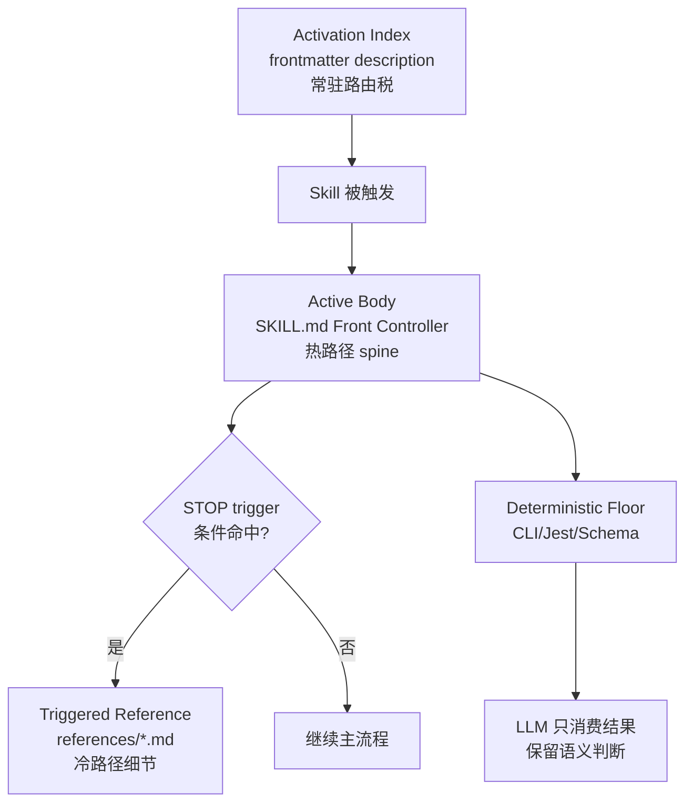
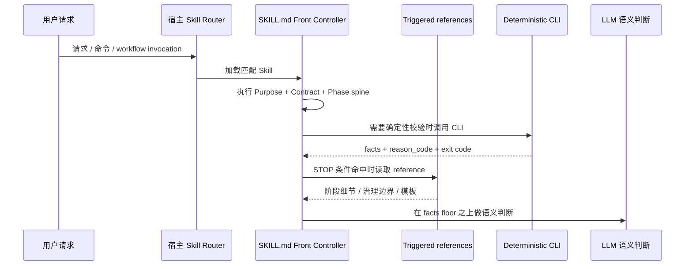

本文的架构假设是：spec-first 的 Prompt 精简不是“删短文字”，而是把 Skill 执行入口改造成 **Front Controller**——主 `SKILL.md` 只保留路由、硬边界、阶段 spine、STOP 触发器与 CLI handoff；阶段细节、治理长文、模板和冷路径进入 `references/`；确定性校验交给 CLI/Jest，LLM 只保留语义判断。这个假设可由 2026-07-06 的 prompt-slimming 计划、`spec-plan` 已落地的 STOP reference 模式、runtime projection 测试，以及 task-pack CLI validation 共同验证。Sources: [2026-07-06-001-refactor-skill-prompt-slimming-plan.md](docs/plans/2026-07-06-001-refactor-skill-prompt-slimming-plan.md#L34-L40), [SKILL.md](skills/spec-plan/SKILL.md#L71-L76), [spec-plan-contracts.test.js](tests/unit/spec-plan-contracts.test.js#L850-L872), [tasks.js](src/cli/commands/tasks.js#L181-L192)

## 为什么需要 Prompt 精简

当前问题被定义为 **Active body 过重**：计划 001 明确指出，主 `SKILL.md` 不应继续承载完整流程细节，而应调整为“轻 spine + 明确 STOP 触发 + 按需 references + deterministic CLI floor”；其关键决策要求 Body-L1 留在主文件，Body-L2 下沉到 `references/`，Body-L3 背景叙事删除，确定性校验由 CLI 输出承载。Sources: [2026-07-06-001-refactor-skill-prompt-slimming-plan.md](docs/plans/2026-07-06-001-refactor-skill-prompt-slimming-plan.md#L28-L39), [2026-07-06-001-refactor-skill-prompt-slimming-plan.md](docs/plans/2026-07-06-001-refactor-skill-prompt-slimming-plan.md#L151-L157)

`spec-code-review` 与 `spec-work` 展示了未精简前的典型形态：它们在主文件中内联了 Context Orientation、Domain Language、Feedback Loop、Runtime Context Exclusion、Cache-Friendly Layout、Summary-First Handoff、Direct Evidence Boundary、Capability-Class Evidence Boundary 等治理段落；这些内容属于执行纪律和治理边界，但并非每次热路径都需要完整展开。Sources: [SKILL.md](skills/spec-work/SKILL.md#L63-L134), [SKILL.md](skills/spec-code-review/SKILL.md#L59-L130)

`spec-plan` 则提供了已经落地的对照模式：主文件在进入上下文收集、领域解释、上游 artifact intake 或 optional capability consumption 前，以 `STOP. Before ... read skills/spec-plan/references/governance-boundaries.md` 触发 reference；类似地，在提出新 surface 前触发 `reuse-analysis.md`，在命中 enterprise high-risk trigger 时触发 `enterprise-plan-review.md`。这说明精简不是移除治理，而是把治理改成 **条件加载**。Sources: [SKILL.md](skills/spec-plan/SKILL.md#L62-L76)

## 三层上下文税：Activation Index、Active Body 与 Deterministic Floor

Prompt 成本可以分成三层：**Activation Index** 是 frontmatter `description` 带来的常驻路由税；**Active Body** 是 skill 被触发后主 `SKILL.md` 注入的正文税；**Deterministic Floor** 是本不该由自然语言复述的身份、hash、结构、runtime mirror 等可判定不变量。计划 001 只处理 Active Body，计划 002 单独处理 Activation-L1 description 索引税，并明确两者正交、blast radius 不同。Sources: [2026-07-06-skill-prompt-精简优化方案.md](docs/项目审查/2026-07-06-skill-prompt-精简优化方案.md#L25-L31), [2026-07-06-002-refactor-skill-activation-index-governance-plan.md](docs/plans/2026-07-06-002-refactor-skill-activation-index-governance-plan.md#L22-L35)

上图中的关键边界是：Activation Index 决定是否加载 skill，Active Body 决定加载后默认付出的上下文，Triggered Reference 决定条件细节何时展开，Deterministic Floor 决定哪些不变量不再由 prompt prose 重写。计划 002 明确 spec-first 只拥有 description 文本与 runtime 投射，不自建宿主级 L0 语义路由；计划 001 明确脚本只输出 deterministic facts、reason_code、artifact path、exit code，不裁决任务质量、scope adequacy 或 review finding 是否成立。Sources: [2026-07-06-002-refactor-skill-activation-index-governance-plan.md](docs/plans/2026-07-06-002-refactor-skill-activation-index-governance-plan.md#L55-L63), [2026-07-06-001-refactor-skill-prompt-slimming-plan.md](docs/plans/2026-07-06-001-refactor-skill-prompt-slimming-plan.md#L110-L119)

| 层级 | 运行时位置 | 优化动作 | 不允许做的事 |
|---|---|---|---|
| Activation Index | `SKILL.md` frontmatter `description` | 统计 token、保留 trigger/exclude/定位 | 不自建宿主 L0 路由或语义向量 registry |
| Active Body | 主 `SKILL.md` 正文 | 保留 L1 spine，L2 下沉 reference，L3 删除 | 不把 hard boundary 藏进 reference |
| Triggered Reference | `skills/*/references/*.md` | 用 STOP 条件按需加载 | 不做无触发器的“死 reference” |
| Deterministic Floor | CLI、Jest、Schema | 输出 facts、reason_code、exit code | 不裁决自然语言语义充分性 |

Sources: [2026-07-06-001-refactor-skill-prompt-slimming-plan.md](docs/plans/2026-07-06-001-refactor-skill-prompt-slimming-plan.md#L95-L104), [2026-07-06-001-refactor-skill-prompt-slimming-plan.md](docs/plans/2026-07-06-001-refactor-skill-prompt-slimming-plan.md#L151-L162), [2026-07-06-002-refactor-skill-activation-index-governance-plan.md](docs/plans/2026-07-06-002-refactor-skill-activation-index-governance-plan.md#L47-L63)

## Front Controller 模式：主 SKILL.md 的新职责

在这个模式里，主 `SKILL.md` 不再是“完整操作手册”，而是 **Front Controller**：它暴露 Purpose、Workflow Contract Summary、When To Use/Not To Use、Inputs/Outputs、Failure Modes、阶段入口、硬边界、reference trigger map 与 handoff 规则。`spec-plan` 主文件已经体现了这种形态：前部定义 Purpose、Plan-Only Safety Contract、Workflow Contract Summary、Scenario Capability、Examples As Context，然后用 STOP 语句连接治理和阶段 reference。Sources: [SKILL.md](skills/spec-plan/SKILL.md#L8-L60), [SKILL.md](skills/spec-plan/SKILL.md#L62-L76)

Front Controller 的设计收益在于 **稳定前缀与动态后缀分离**。未精简的 `spec-code-review` 已经要求把 workflow contract、hard boundaries、reviewer routing 和 reference index 保持为 stable instruction prefix，把当前 user request、diff summary、tool summary、temporary evidence、artifact-summary 等 volatile data 放入 dynamic suffix；Prompt 精简把这一原则进一步结构化为主 spine 与 references 的分工。Sources: [SKILL.md](skills/spec-code-review/SKILL.md#L89-L99)

该交互不是抽象建议，而是与现有投射机制匹配：`syncSkills` 会把 source skill 复制到宿主 runtime 目录，对文本内容执行 adapter transform；`copyDirectoryWithTransform` 会递归复制 skill 目录并转换文本文件；`transformSkillTextFile` 跳过 eval support，其他文本交给 adapter 转换。因此 Front Controller 中的 source 路径和 reference 路径必须能被 runtime projection 正确改写。Sources: [plugin.js](src/cli/plugin.js#L761-L794), [plugin.js](src/cli/plugin.js#L1025-L1084)

## Triggered Reference：STOP 触发器的契约

Triggered Reference 的最小契约包含四个要素：**触发条件**、**必须读取的 reference 路径**、**继续执行前置性**、**未读取时的 fallback 或阻断语义**。计划 001 明确要求每个移入 `references/` 的 Body-L2 细节都必须在主 spine 有确定性 STOP 触发；每次 extraction 必须配套 `trigger_condition`、`must_read`、`fallback_if_unread` 和 eval/test 锚点。Sources: [2026-07-06-001-refactor-skill-prompt-slimming-plan.md](docs/plans/2026-07-06-001-refactor-skill-prompt-slimming-plan.md#L70-L74), [2026-07-06-001-refactor-skill-prompt-slimming-plan.md](docs/plans/2026-07-06-001-refactor-skill-prompt-slimming-plan.md#L95-L103)

`spec-plan` 的 STOP 触发器是当前可复用样板：它不是写“可参考 governance-boundaries”，而是写“STOP. Before broad context gathering ... read ...”；在 Phase 0 前，也写明“STOP. Before Phase 0 source/scope handling or Phase 1 research, read planning-flow.md”，并说明该 reference 拥有 resume/deepen detection、software vs universal planning routing、upstream requirements intake 等细节。Sources: [SKILL.md](skills/spec-plan/SKILL.md#L71-L76), [SKILL.md](skills/spec-plan/SKILL.md#L122-L130)

| 触发器写法 | 行为含义 | 可验收性 |
|---|---|---|
| “STOP. Before X, read `references/Y.md`.” | Y 是 X 的前置条件 | 可由静态测试断言存在 |
| “When high-risk trigger fires, read `references/Z.md`.” | Z 是条件 readiness lens | 可测试触发语句与 reference 投射 |
| “See reference if needed.” | 无阻断语义 | 不满足计划 001 的验收要求 |
| “Reference exists in directory.” | 仅证明文件存在 | 不证明模型会读取 |

Sources: [2026-07-06-001-refactor-skill-prompt-slimming-plan.md](docs/plans/2026-07-06-001-refactor-skill-prompt-slimming-plan.md#L151-L162), [spec-plan-contracts.test.js](tests/unit/spec-plan-contracts.test.js#L850-L872)

## Deterministic Floor Downshift：把脚本的活还给脚本

`spec-work` 的 task-pack intake 是确定性下沉的典型案例。优化方案指出，主文件曾用自然语言复写 task-pack frontmatter、`spec_id`、`source_plan_hash`、hash 比对与 reject reason；但 `src/cli/task-pack.js` 的 `validateTaskPack()` 已经实现这些检查，并由 `spec-first tasks validate <task-pack-path> --json` 输出 `deterministic_handoff` 和 `reason_code`。Sources: [2026-07-06-skill-prompt-精简优化方案.md](docs/项目审查/2026-07-06-skill-prompt-精简优化方案.md#L128-L153), [task-pack.js](src/cli/task-pack.js#L405-L575)

CLI 行为边界同样明确：`spec-first tasks validate` 在 JSON 模式输出完整 validation result，非 JSON 模式在 valid 时输出 `task pack valid`，invalid 时输出错误列表，并以 `deterministic_handoff` 决定退出码；帮助文本明确 validate 只检查 identity、freshness、structure，不判断 task splitting quality 或 business scope。Sources: [tasks.js](src/cli/commands/tasks.js#L88-L133), [tasks.js](src/cli/commands/tasks.js#L181-L192)

| 事项 | 归属 | 证据形态 |
|---|---|---|
| `spec_id` 是否缺失或 mismatch | CLI deterministic floor | validation fields / errors |
| `source_plan_hash` 是否为 `sha256:<64-hex>` 且匹配 | CLI deterministic floor | `source_plan_hash` validation |
| task-pack contract 是否可解析、字段是否合法 | CLI deterministic floor | `task_pack_contract` validation |
| task 拆分是否合理 | LLM / reviewer | 语义判断，不由 CLI 裁决 |
| scope 是否足够、review finding 是否成立 | LLM / reviewer | 直接证据与 confidence 判断 |

Sources: [task-pack.js](src/cli/task-pack.js#L454-L575), [task-pack.js](src/cli/task-pack.js#L578-L590), [tasks.js](src/cli/commands/tasks.js#L181-L192)

## Source/Runtime 投射：reference 必须能随宿主重写

Triggered Reference 能成立的前提是 source skill 与 runtime skill 的路径投射一致。`rewriteSourceSkillRuntimePaths()` 会把 operational source skill path 从 `skills/<skill>/...` 改写成宿主 runtime skill root，同时保留带有 source-of-truth、not source、source fixes 等语义的 source path 行；这解释了为什么 STOP trigger 要写 source 路径，但 runtime 中必须被改写为 `.claude/...` 或 `.agents/skills/...`。Sources: [skill-path-rewrite-markers.js](src/cli/skill-path-rewrite-markers.js#L3-L33), [skill-path-rewrite-markers.js](src/cli/skill-path-rewrite-markers.js#L36-L74)

`spec-plan` 的 contract test 对这一点有直接守护：source skill 必须包含 `read skills/spec-plan/references/governance-boundaries.md`，Claude runtime skill 必须包含 `read .claude/spec-first/workflows/spec-plan/references/governance-boundaries.md`，Codex runtime skill 必须包含 `read .agents/skills/spec-plan/references/governance-boundaries.md`；runtime reference 内容也必须包含治理锚点，如 `Capability-Class Evidence Boundary` 和 `provider_untrusted`。Sources: [spec-plan-contracts.test.js](tests/unit/spec-plan-contracts.test.js#L850-L872)

该测试还覆盖 drift 检测：同步后的 Claude/Codex runtime inspection 不应出现 `spec-plan` drift；删除 runtime governance reference 时应报告 `missing_file:references/governance-boundaries.md`，篡改内容时应报告 `content_mismatch:references/governance-boundaries.md`。这使 reference extraction 不只是文件移动，而是 source/runtime 一致性受测的架构操作。Sources: [spec-plan-contracts.test.js](tests/unit/spec-plan-contracts.test.js#L874-L887), [spec-plan-contracts.test.js](tests/unit/spec-plan-contracts.test.js#L889-L912)

## 精简模式对比

| 模式 | 主文件内容 | 细节位置 | 风险 | 适用场景 |
|---|---|---|---|---|
| 单体 Prompt | 全流程、治理、模板、例子全部内联 | `SKILL.md` | 热路径 token 高、重复治理多 | 小型 skill 或尚未稳定的草稿 |
| Triggered Reference | 主 spine + STOP trigger | `references/*.md` | 触发不清会漏读 | 阶段性流程、治理边界、模板 |
| CLI Handoff | 主文件只说明运行命令与处理结果 | CLI / scripts | 误把 CLI 结果解释成语义充分 | hash、结构、路径、drift 等不变量 |
| Activation Index Governance | description 保留 trigger/exclude/定位 | frontmatter + lint/eval | 压缩过度造成误触发/漏触发 | 路由层 token 与相邻 workflow 边界 |

Sources: [2026-07-06-skill-prompt-精简优化方案.md](docs/项目审查/2026-07-06-skill-prompt-精简优化方案.md#L110-L153), [2026-07-06-002-refactor-skill-activation-index-governance-plan.md](docs/plans/2026-07-06-002-refactor-skill-activation-index-governance-plan.md#L47-L63)

精简的优先级不是“行数最少”，而是 **承重文本位置正确**：Body-L1 hard boundary、mutation/verification/handoff/source-runtime 纪律必须留在主 spine；Body-L2 可移动到 reference，但必须有 STOP trigger；Body-L3 重复解释、冗余例子或过期实现细节可以删除。计划 001 明确把行数预算定义为 advisory budget，completion gate 是边界保留、语义路由、执行纪律和可验证证据。Sources: [2026-07-06-001-refactor-skill-prompt-slimming-plan.md](docs/plans/2026-07-06-001-refactor-skill-prompt-slimming-plan.md#L141-L157)

## 验收与防退化

Prompt 精简的验收首先要求建立 baseline：每个待改 skill 在修改前记录 `SKILL.md` 行数、主 prompt 中 references 清单、每个 reference 的 STOP trigger；如果 baseline 无法完整建立，closeout 必须记录 degraded reason。该要求避免把“改短了”误当成“改好了”。Sources: [2026-07-06-001-refactor-skill-prompt-slimming-plan.md](docs/plans/2026-07-06-001-refactor-skill-prompt-slimming-plan.md#L145-L150)

测试层必须覆盖两类形状：source prompt shape 与 runtime projection/path rewrite；Jest 或脚本只证明结构和覆盖，fresh-source/read-only eval 负责覆盖 source/runtime boundary、mutation gate、verification handoff、handoff limitations 与 trigger precision。runtime projection 验证只能通过 source 生成结果观察，不得手改 `.claude/**`、`.codex/**` 或 `.agents/skills/**` 制造通过。Sources: [2026-07-06-001-refactor-skill-prompt-slimming-plan.md](docs/plans/2026-07-06-001-refactor-skill-prompt-slimming-plan.md#L158-L163)

阻断条件也被明确定义：缺 baseline 且无 degraded reason、reference 没有主 spine STOP trigger、Body-L1 hard boundary 被删除或只藏入 reference、Jest/脚本试图裁决自然语言语义、手改 generated runtime mirror、fresh-source eval 未执行且 closeout 未记录 reason_code，都会使精简不可验收。Sources: [2026-07-06-001-refactor-skill-prompt-slimming-plan.md](docs/plans/2026-07-06-001-refactor-skill-prompt-slimming-plan.md#L170-L179)

## 实践读法：如何审查一个精简后的 Skill

审查精简后的 Skill 时，先看主 `SKILL.md` 是否仍能独立回答五个问题：什么时候用、什么时候不用、输入输出是什么、失败时如何停止、每个阶段何时必须读取哪个 reference。`spec-work` 与 `spec-code-review` 的 Workflow Contract Summary 展示了这些字段在重型 workflow 中的承重作用。Sources: [SKILL.md](skills/spec-work/SKILL.md#L15-L47), [SKILL.md](skills/spec-code-review/SKILL.md#L11-L43)

然后看 reference trigger 是否覆盖迁移内容：如果治理边界被移入 `governance-boundaries.md`，主 spine 必须在进入相关上下文前 STOP；如果阶段流程被移入 `planning-flow.md` 或类似文件，主 spine 必须在 Phase 入口前 STOP；如果 enterprise/high-risk lens 被移入 reference，主 spine 必须列出触发条件。Sources: [SKILL.md](skills/spec-plan/SKILL.md#L71-L76), [SKILL.md](skills/spec-plan/SKILL.md#L122-L130)

最后看 deterministic floor 是否真正下沉：主 prompt 不应再复写 CLI 已经能判定的 hash、结构、runtime mirror、路径合法性等细节；它应说明调用哪个命令、继续条件是什么、失败时如何向用户 handoff，以及哪些语义判断仍由 LLM/reviewer 完成。Sources: [tasks.js](src/cli/commands/tasks.js#L88-L133), [tasks.js](src/cli/commands/tasks.js#L181-L192), [task-pack.js](src/cli/task-pack.js#L405-L575)

## 与相邻页面的阅读路径

如果你想理解 Prompt 精简在整体架构中的位置，建议先读 [公开工作流命令与 Skill 治理模型](19-gong-kai-gong-zuo-liu-ming-ling-yu-skill-zhi-li-mo-xing)，再读 [核心研发链路：brainstorm、prd、plan、write-tasks、work、review、compound](20-he-xin-yan-fa-lian-lu-brainstorm-prd-plan-write-tasks-work-review-compound)，随后读本页，最后进入 [契约文档与 Schema 校验体系](23-qi-yue-wen-dang-yu-schema-xiao-yan-ti-xi) 和 [任务包、运行证据与 Honest Closeout](24-ren-wu-bao-yun-xing-zheng-ju-yu-honest-closeout) 理解 deterministic floor 与验收证据。Sources: [2026-07-06-001-refactor-skill-prompt-slimming-plan.md](docs/plans/2026-07-06-001-refactor-skill-prompt-slimming-plan.md#L182-L200), [tasks.js](src/cli/commands/tasks.js#L181-L192)

如果你的关注点是运行时生成与宿主投射，请继续阅读 [宿主适配器设计：统一源资产到不同 Runtime Surface 的投影](17-su-zhu-gua-pei-qi-she-ji-tong-yuan-zi-chan-dao-bu-tong-runtime-surface-de-tou-ying) 与 [运行时健康检查与 Drift 检测](18-yun-xing-shi-jian-kang-jian-cha-yu-drift-jian-ce)；如果你的关注点是新增或修改 Skill，应继续阅读 [新增或修改 Skill 的开发、审计与发布流程](30-xin-zeng-huo-xiu-gai-skill-de-kai-fa-shen-ji-yu-fa-bu-liu-cheng)。Sources: [plugin.js](src/cli/plugin.js#L761-L794), [spec-plan-contracts.test.js](tests/unit/spec-plan-contracts.test.js#L874-L912)