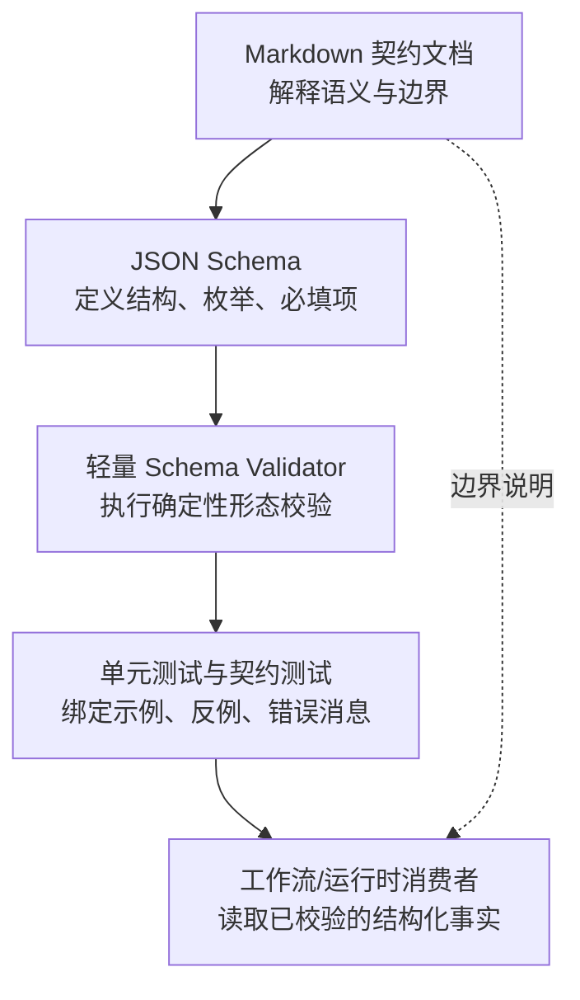
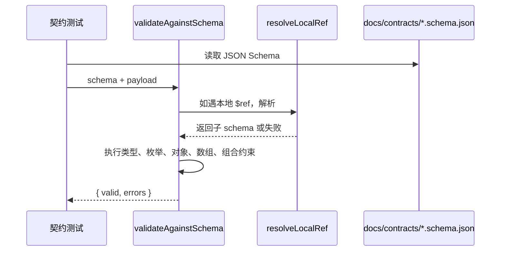

本页位于“深入解析 / 契约、质量门禁与验证”分组中的 **[契约文档与 Schema 校验体系](23-qi-yue-wen-dang-yu-schema-xiao-yan-ti-xi)**，聚焦 spec-first 如何把 Markdown 契约、JSON Schema、轻量校验器与单元测试组合成一套可执行的结构约束体系；它不展开任务运行证据、质量门禁执行或测试矩阵细节，这些内容分别属于后续页面。Sources: [schema-validator.md](docs/contracts/schema-validator.md#L1-L3), [schema-validator-contracts.test.js](tests/unit/schema-validator-contracts.test.js#L1-L8)

## 架构假设：契约不是说明书，而是测试可执行的形态边界

可以先形成一个工作假设：spec-first 的契约体系分为三层——**文档契约**解释语义边界，**Schema 契约**定义机器可校验的数据形状，**测试用例**把 Schema 与真实样例绑定起来，避免契约沦为装饰性死文档。这个假设能从 `provider-readiness.md` 对“advisory setup fact”的边界说明、`provider-readiness.schema.json` 对必填字段与枚举的定义，以及多个测试直接调用 `validateAgainstSchema` 校验契约数据中得到验证。Sources: [provider-readiness.md](docs/contracts/provider-readiness.md#L1-L13), [provider-readiness.schema.json](docs/contracts/provider-readiness.schema.json#L1-L28), [verification-profile.test.js](tests/unit/verification-profile.test.js#L82-L92)

这张图的关键点是：Markdown 负责解释“这个事实能不能被信任、由谁生产、由谁消费”，Schema 负责回答“字段是否存在、类型是否正确、枚举是否越界”，轻量校验器负责在测试和内部检查中给出确定性错误，测试则证明这些契约确实被执行。Sources: [schema-validator.md](docs/contracts/schema-validator.md#L1-L3), [schema-validator.js](src/contracts/schema-validator.js#L48-L64), [schema-validator-contracts.test.js](tests/unit/schema-validator-contracts.test.js#L9-L38)

## 契约资产的基本形态

`docs/contracts` 下的契约资产同时包含 `.md` 与 `.schema.json` 两类文件：Markdown 文件描述语义、生产者/消费者规则和使用边界，Schema 文件描述结构字段、必填项、枚举、对象闭包与条件约束。例如 `provider-readiness.md` 明确说明 `provider-readiness.v2` 是 setup fact、不是 workflow truth，也禁止把 `advisory`、`evidence_candidate`、`confirmed_context` 等语义信任字段写入该契约。Sources: [provider-readiness.md](docs/contracts/provider-readiness.md#L1-L13)

| 契约类型 | 主要职责 | 示例 | 校验方式 |
|---|---|---|---|
| Markdown 契约 | 说明边界、信任语义、生产者/消费者规则 | `provider-readiness.md` | 人读 + 文档契约测试 |
| JSON Schema | 约束字段、类型、枚举、数组、对象闭包 | `provider-readiness.schema.json`、`honest-closeout.schema.json` | `validateAgainstSchema` |
| 契约测试 | 证明 Schema 能接受合法样例并拒绝非法样例 | `verification-profile.test.js`、`schema-validator-contracts.test.js` | Jest 单元测试 |

上表中的分工可以从多个契约中看到：`provider-readiness.schema.json` 定义 `schema_version`、`provider`、`kind`、`profile`、`readiness_status` 等必填字段；`honest-closeout.schema.json` 定义 closeout 输出必须包含 `schema_version`、`generated_at`、`overall`、`overall_reason_code` 与 `claims`；`verification-profile.schema.json` 则要求验证配置包含 `default_profile`、`profiles`、`services` 与 `stacks`。Sources: [provider-readiness.schema.json](docs/contracts/provider-readiness.schema.json#L3-L28), [honest-closeout.schema.json](docs/contracts/workflows/honest-closeout.schema.json#L5-L13), [verification-profile.schema.json](docs/contracts/verification/verification-profile.schema.json#L5-L15)

## 轻量 Schema Validator 的定位

`src/contracts/schema-validator.js` 是一个小型确定性校验器，用于 spec-first 的契约测试和 doctor evidence checks；官方契约文档明确说明它不是完整 JSON Schema 实现，也不能替代 Ajv 或其他标准完整的校验器。Sources: [schema-validator.md](docs/contracts/schema-validator.md#L1-L3)

它支持的关键字是一个显式白名单，包括 `$ref`、`type`、`enum`、`const`、`required`、`properties`、`items`、`contains`、`additionalProperties`、`anyOf`、`oneOf`、`allOf`、`if/then/else`、数组长度、字符串长度、正则模式以及数值边界。Sources: [schema-validator.js](src/contracts/schema-validator.js#L3-L28), [schema-validator.md](docs/contracts/schema-validator.md#L5-L24)

它不强制执行白名单之外的 advisory 关键字；契约文档明确指出 `format`、`$schema`、`$id`、`title`、`description`、`default`、`examples` 在这里不被执行，测试也验证了 `format: date-time` 不会拒绝 `not-a-date`。Sources: [schema-validator.md](docs/contracts/schema-validator.md#L25-L29), [schema-validator-contracts.test.js](tests/unit/schema-validator-contracts.test.js#L99-L111)

| 能力区域 | 已支持 | 明确不承担 |
|---|---|---|
| 类型校验 | `string`、`number`、`integer`、`array`、`object`、`null` 与联合类型 | 完整 JSON Schema 规范覆盖 |
| 对象约束 | `required`、`properties`、`additionalProperties` | 复杂语义信任判断 |
| 组合逻辑 | `anyOf`、`oneOf`、`allOf`、`if/then/else` | 外部远程 `$ref` |
| 字符串/数组/数字边界 | `minLength`、`maxLength`、`pattern`、`minItems`、`maxItems`、`minimum`、`maximum`、`exclusiveMinimum`、`exclusiveMaximum` | `format` 等 advisory 元数据 |

这张表的实践含义是：如果某个契约只需要结构形态、枚举、闭包和基础边界，当前轻量校验器足够；如果契约需要完整 JSON Schema 行为，就必须为该消费方引入显式依赖与测试，而不能假设轻量校验器已经覆盖。Sources: [schema-validator.md](docs/contracts/schema-validator.md#L25-L29), [schema-validator-contracts.test.js](tests/unit/schema-validator-contracts.test.js#L161-L182)

## 校验器的执行模型

校验入口 `validateAgainstSchema(schema, value, pointer, errors, rootSchema, refStack)` 会先处理缺失 schema 与本地 `$ref`，再依次执行组合关键字、条件分支、类型检查、枚举和常量检查、对象约束、数组约束、字符串约束与数值约束，最终返回 `{ valid, errors }`。Sources: [schema-validator.js](src/contracts/schema-validator.js#L48-L64), [schema-validator.js](src/contracts/schema-validator.js#L66-L98), [schema-validator.js](src/contracts/schema-validator.js#L100-L123), [schema-validator.js](src/contracts/schema-validator.js#L207-L231)

这个交互模型体现了一个重要边界：校验器只做确定性结构判断，不执行命令、不读取业务上下文、不推导自然语言含义；例如 `verification-profile.schema.json` 的描述明确说它声明服务栈与检查命令身份，但不执行检查，也不决定验证状态。Sources: [verification-profile.schema.json](docs/contracts/verification/verification-profile.schema.json#L1-L6), [verification-profile.test.js](tests/unit/verification-profile.test.js#L94-L110)

## 对象闭包与“省略 type: object”的处理

对象级约束是这个校验器的核心防漂移机制之一：当 schema 含有 `required`、`properties` 或 `additionalProperties` 时，只要待校验值是普通对象，就会执行对象约束，不要求 schema 显式声明 `type: object`。代码注释说明这样做是为了避免省略 `type` 的合法子 schema 静默放行缺失的 required 字段。Sources: [schema-validator.js](src/contracts/schema-validator.js#L125-L155)

测试覆盖了两个常见漂移场景：当 `additionalProperties: false` 时，额外字段会被拒绝并产生 `root.extra: unexpected additional key`；当 `additionalProperties` 是子 schema 时，额外字段也会继续按子 schema 校验。Sources: [schema-validator-contracts.test.js](tests/unit/schema-validator-contracts.test.js#L9-L38)

省略 `type: object` 的对象约束同样会被执行，测试中 `{ required: ['a'], properties: { a: { type: 'string' } } }` 能拒绝缺失字段与错误类型，这说明契约作者不能依赖“忘写 type”来绕过 required/properties 约束。Sources: [schema-validator-contracts.test.js](tests/unit/schema-validator-contracts.test.js#L146-L159)

## 本地 `$ref` 与失败关闭策略

校验器支持本地 JSON Pointer 风格 `$ref`，即以 `#/` 开头的引用；`resolveLocalRef` 会按路径片段在根 schema 中查找，并支持 `~1` 与 `~0` 的转义还原。Sources: [schema-validator.js](src/contracts/schema-validator.js#L210-L226)

如果 `$ref` 不是本地引用，或者本地路径无法解析，校验器会失败关闭并记录 `unsupported schema ref ...`；测试明确验证了远程 `https://example.invalid/schema.json` 不会被忽略，而是返回失败。Sources: [schema-validator.js](src/contracts/schema-validator.js#L53-L64), [schema-validator-contracts.test.js](tests/unit/schema-validator-contracts.test.js#L173-L182)

本地 `$defs` 的约束不会被跳过：测试中 `result` 字段引用 `#/$defs/result`，当 payload 中 `status` 不在枚举内且包含额外字段时，错误会精确落到 `root.result.status` 与 `root.result.extra`。Sources: [schema-validator-contracts.test.js](tests/unit/schema-validator-contracts.test.js#L113-L144)

## 条件约束：把状态机写进 Schema

部分契约把状态机约束直接写进 Schema，例如 `spec-work-run-artifact.schema.json` 中 `producer.workflow_integrated` 为 `true` 时，`reason_code` 只能是触发类原因；当 `workflow_integrated` 为 `false` 时，`reason_code` 只能是 `no-trigger-matched`、`producer-error` 或 `producer-write-side-only`。Sources: [spec-work-run-artifact.schema.json](docs/contracts/workflows/spec-work-run-artifact.schema.json#L55-L120)

这类约束依赖校验器对 `allOf` 与 `if/then` 的支持：源码会对 `allOf` 的每个子 schema 递归校验，也会先校验 `if` 条件，再根据结果执行 `then` 或 `else`。Sources: [schema-validator.js](src/contracts/schema-validator.js#L66-L70), [schema-validator.js](src/contracts/schema-validator.js#L90-L98)

## 契约样例：Provider Readiness

`provider-readiness.v2` 是一个典型的设置侧事实契约，它要求包含 `schema_version`、`provider`、`kind`、`profile`、`readiness_status`、`lifecycle`、`repo_aligned`、`capabilities`、`limitations`、`source_read_required`、`fallback`、`next_actions`、`native_interfaces`、`first_generation`、`steady_state` 与 `usage_note`。Sources: [provider-readiness.schema.json](docs/contracts/provider-readiness.schema.json#L3-L21)

它还通过嵌套对象约束限定生命周期字段，例如 `lifecycle` 必须包含 `installed`、`configured`、`initialized`、`indexed`、`server_reachable`、`artifact_exists`、`query_verified`、`fallback_used`，且不允许额外属性。Sources: [provider-readiness.schema.json](docs/contracts/provider-readiness.schema.json#L28-L51)

这个契约的语义边界尤其重要：文档说明 `readiness_status` 是进入 setup decision health 的唯一 provider readiness 字段，生命周期字段只是展示与解释 setup 停止位置的 passthrough bits，而不是 workflow health 的独立决策依据。Sources: [provider-readiness.md](docs/contracts/provider-readiness.md#L14-L21)

## 契约样例：Verification Profile

`verification-profile.v1` 是验证配置的源侧契约，Schema 要求顶层包含 `schema_version`、`default_profile`、`profiles`、`services`、`stacks`，并对 profile、service、stack 的内部字段建立闭包。Sources: [verification-profile.schema.json](docs/contracts/verification/verification-profile.schema.json#L5-L15), [verification-profile.schema.json](docs/contracts/verification/verification-profile.schema.json#L17-L82)

它的测试同时使用 `validateAgainstSchema` 和 `validateProfileObject`：合法 profile 应当没有错误，而顶层额外字段 `productSmoke` 会被拒绝为 `root.productSmoke: unexpected additional key`。Sources: [verification-profile.test.js](tests/unit/verification-profile.test.js#L82-L92)

这个契约说明了 Schema 校验与运行行为的边界：Schema 只确认配置形态，后续 loader 可以解析命令身份与 required tools，但测试明确验证的是“解析检查命令而不执行它们”。Sources: [verification-profile.test.js](tests/unit/verification-profile.test.js#L94-L110)

## 契约样例：Honest Closeout

`honest-closeout.schema.json` 定义的是结构化 closeout claim verdicts，描述中明确说校验器会把 claims 与显式 evidence references 对照，但不会解析自然语言，也不会创建第二份持久 closeout artifact。Sources: [honest-closeout.schema.json](docs/contracts/workflows/honest-closeout.schema.json#L1-L5)

该 Schema 要求输出包含 `schema_version`、`generated_at`、`overall`、`overall_reason_code` 与 `claims`，其中 `overall` 只能是 `verified`、`degraded`、`unsupported`，每条 claim 必须包含 `claim_type`、`asserted_status`、`evidence_refs`、`verdict` 与 `reason_code`。Sources: [honest-closeout.schema.json](docs/contracts/workflows/honest-closeout.schema.json#L5-L40)

测试展示了合法 closeout 输出如何同时通过 Schema 校验和 `validateHonestCloseoutOutput`，并进一步验证当 validation claim 有匹配的 passed run-summary check 时，输出会得到 `overall: verified` 与 `validation-evidence-consistent`。Sources: [honest-closeout.test.js](tests/unit/honest-closeout.test.js#L97-L118), [honest-closeout.test.js](tests/unit/honest-closeout.test.js#L120-L146)

## 契约作者的实践准则

编写新契约时，优先把“结构稳定性”放进 Schema：必填字段用 `required`，封闭对象用 `additionalProperties: false`，状态枚举用 `enum` 或 `const`，路径、ID、reason code 等字符串边界用 `pattern`、`minLength`、`maxLength`。这些约束都在当前轻量校验器支持范围内。Sources: [schema-validator.js](src/contracts/schema-validator.js#L3-L28), [schema-validator-contracts.test.js](tests/unit/schema-validator-contracts.test.js#L65-L97)

不要把语义信任误写成结构字段：`provider-readiness.md` 明确禁止把 `advisory`、`evidence_candidate`、`confirmed_context` 写入 provider readiness 契约，说明“能否作为 confirmed context”必须由下游基于直接 source/test/log/contract/user evidence 推进，而不是由 setup 事实自封。Sources: [provider-readiness.md](docs/contracts/provider-readiness.md#L12-L13), [provider-readiness.md](docs/contracts/provider-readiness.md#L18-L21)

如果需要完整 JSON Schema 行为，必须显式引入适配依赖和测试，而不是扩展性地假设 `format`、`default`、`examples` 或远程 `$ref` 已经被执行；当前契约文档和测试都把这些能力排除在轻量校验器边界之外。Sources: [schema-validator.md](docs/contracts/schema-validator.md#L25-L29), [schema-validator-contracts.test.js](tests/unit/schema-validator-contracts.test.js#L99-L111), [schema-validator-contracts.test.js](tests/unit/schema-validator-contracts.test.js#L173-L182)

## 阅读路径建议

如果你想继续理解这些契约如何进入运行证据，请下一步阅读 [任务包、运行证据与 Honest Closeout](24-ren-wu-bao-yun-xing-zheng-ju-yu-honest-closeout)；如果你关心质量门禁产物的结构化结果，请阅读 [AI Dev Quality Gate 与 Eval Fixtures](25-ai-dev-quality-gate-yu-eval-fixtures)；如果你要确认这些契约如何被测试体系守住，请阅读 [测试体系：单元测试、集成测试、Smoke Test 与发布检查](26-ce-shi-ti-xi-dan-yuan-ce-shi-ji-cheng-ce-shi-smoke-test-yu-fa-bu-jian-cha)。Sources: [honest-closeout.schema.json](docs/contracts/workflows/honest-closeout.schema.json#L1-L13), [ai-dev-quality-gate-result.schema.json](docs/contracts/quality-gates/ai-dev-quality-gate-result.schema.json#L1-L18), [schema-validator-contracts.test.js](tests/unit/schema-validator-contracts.test.js#L1-L8)