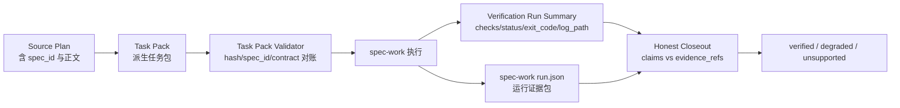

本页位于“契约、质量门禁与验证”分组中的 **[任务包、运行证据与 Honest Closeout](24-ren-wu-bao-yun-xing-zheng-ju-yu-honest-closeout)**，关注 spec-first 如何把“计划可执行性”“实际运行结果”和“收尾声明可信度”拆成三层可验证对象：Task Pack 负责从 Plan 派生确定性任务包，Verification Run Summary 负责记录已发生的检查，spec-work Run Artifact 负责沉淀一次工作运行的证据包，Honest Closeout 负责把声明与证据逐项对账。Sources: [task-pack.js](src/cli/task-pack.js#L8-L22), [verification-run-summary.schema.json](docs/contracts/verification/verification-run-summary.schema.json#L1-L8), [spec-work-run-artifact.schema.json](docs/contracts/workflows/spec-work-run-artifact.schema.json#L1-L10), [honest-closeout.schema.json](docs/contracts/workflows/honest-closeout.schema.json#L1-L12)

## 架构假设：闭环不是“相信总结”，而是“分层对账”

我的架构假设是：spec-first 的工作闭环有意避免让 LLM 的自然语言总结直接成为验证结论，而是把闭环拆为 **任务包完整性校验 → 运行结果记录 → 运行证据归档 → 收尾声明裁决**。这个假设可以被代码验证：Task Pack 校验会检查 `spec_id`、`source_plan`、`source_plan_hash` 与 JSON 合约；Verification Run Summary 的契约说明它只捕获执行后记录的结果，不运行命令、不推断 exit code；Honest Closeout 的契约说明 validator 会比较声明与显式证据引用，不解析自然语言，也不创建第二个持久 closeout artifact。Sources: [task-pack.js](src/cli/task-pack.js#L430-L575), [verification-run-summary.schema.json](docs/contracts/verification/verification-run-summary.schema.json#L1-L8), [honest-closeout.schema.json](docs/contracts/workflows/honest-closeout.schema.json#L1-L12)

上图中的箭头不是抽象流程，而是源代码中的持久引用关系：Task Pack 从 Source Plan 计算 `sha256` 正文哈希并校验派生链路，Run Summary 固定写入 `.spec-first/workflows/<workflow>/<workspace>/<run-id>/verification-run-summary.json`，spec-work Run Artifact 固定写入 `.spec-first/workflows/spec-work/<workspace-slug>/<run-id>/run.json`，Honest Closeout 则读取 `run_summary_ref` 并按 `evidence_refs` 逐条裁决。Sources: [task-pack.js](src/cli/task-pack.js#L168-L195), [verification-run-summary.js](src/cli/helpers/verification-run-summary.js#L160-L218), [spec-work-run-artifact.js](src/cli/helpers/spec-work-run-artifact.js#L217-L273), [honest-closeout.js](src/cli/helpers/honest-closeout.js#L103-L132)

## Task Pack：把 Plan 变成可接手的确定性工作单元

Task Pack 的第一层防线是来源绑定：校验器要求 frontmatter 中 `type=task-pack`、`generated_by=spec-write-tasks`、`status=derived`、`mode=derived`，并要求存在 `spec_id`、`source_plan` 与 `source_plan_hash`；当 `source_plan` 可解析时，它会读取 Source Plan，比较 Plan 与 Task Pack 的 `spec_id`，并重新计算 Source Plan 正文 hash 来判断任务包是否 stale。Sources: [task-pack.js](src/cli/task-pack.js#L454-L541)

Task Pack 的第二层防线是结构契约：`Task Pack Contract` 必须作为一个 `## Task Pack Contract` 小节出现，并且该小节必须包含且只包含一个 fenced `json` 代码块；JSON 解析成功后，校验器要求 `schema_version` 等于 `task-pack/v1`，`tasks` 与 `execution_waves` 必须是非空数组。Sources: [task-pack.js](src/cli/task-pack.js#L198-L240), [task-pack.js](src/cli/task-pack.js#L578-L599)

Task Pack 的任务字段是受控白名单，必填字段包括 `task_id`、`dependencies`、`files`、`goal`、`test_focus`、`done_signal`、`wave`、`stop_if`；允许的扩展字段包括 `source_unit`、`requirement_refs`、`context_refs`、`entry_hint`、`parallelizable`、`expected_side_effects`、`risk_note`、`review_gate`、`review_focus`、`handoff_owner`、`target_repo` 以及语义姿态证据字段。Sources: [task-pack.js](src/cli/task-pack.js#L13-L41)

Task Pack 的文件边界校验专门防止“任务包看似具体、实际不可执行”：文件路径必须是 repo-relative 的具体 POSIX 路径，不能是绝对路径、反斜杠路径、通配集合、目录、重复文件、仓库外路径、generated runtime mirror 路径或 secret-denied 路径；`expected_side_effects` 也只能使用 repo-relative 精确路径或有限 glob，不能使用 `**`。Sources: [task-pack.js](src/cli/task-pack.js#L247-L306), [task-pack.js](src/cli/task-pack.js#L760-L809)

Task Pack 还对执行拓扑做确定性检查：任务依赖必须指向已知任务，依赖任务所在 wave 必须早于当前任务所在 wave，同一任务不能出现在多个 execution wave，任务声明的 wave 必须与 wave 列表一致，同一 wave 内不同任务不能声明同一文件所有权。Sources: [task-pack.js](src/cli/task-pack.js#L819-L932)

| 维度 | 校验对象 | 失败后的语义 |
|---|---|---|
| 来源链路 | `spec_id`、`source_plan`、`source_plan_hash` | wrong-chain、stale、unverifiable 或 invalid |
| 合约结构 | `Task Pack Contract` JSON 小节、`schema_version`、`tasks`、`execution_waves` | invalid |
| 文件边界 | `files`、`expected_side_effects` | invalid |
| 执行拓扑 | `dependencies`、`wave`、同 wave 文件重叠 | invalid |
| 交接结论 | `deterministic_handoff` | 只有 `valid` 才为 true |

Sources: [task-pack.js](src/cli/task-pack.js#L378-L397), [task-pack.js](src/cli/task-pack.js#L572-L575), [task-pack-command.test.js](tests/unit/task-pack-command.test.js#L60-L80)

## Verification Run Summary：记录“实际发生过的验证”

Verification Run Summary 的定位非常窄：它是 workflow-local 的验证检查摘要，只捕获执行后被记录的结果，不负责运行命令，也不推断 exit code；契约要求顶层包含 `schema_version`、`generated_at`、`profile` 与 `checks`。Sources: [verification-run-summary.schema.json](docs/contracts/verification/verification-run-summary.schema.json#L1-L8)

每个 check 必须包含 `id`、`service`、`command`、`status`、`exit_code`、`ran`、`required_tools`、`missing_tools`、`log_path`、`reason_code`、`redaction_status`；`status` 只能是 `passed`、`failed`、`not-run` 或 `degraded`，`redaction_status` 只能是 `redacted` 或 `none-required`。Sources: [verification-run-summary.schema.json](docs/contracts/verification/verification-run-summary.schema.json#L26-L78)

Run Summary 写入时会解析 `--input`、`--run-id`、`--target-repo` 与可选 `--workflow`，其中 workflow 被限制为 `spec-work`、`spec-debug`、`spec-code-review`；写入路径由目标仓库名 slug、workflow 与 run id 共同决定，最终输出 `run_summary_ref`。Sources: [verification-run-summary.js](src/cli/helpers/verification-run-summary.js#L75-L111), [verification-run-summary.js](src/cli/helpers/verification-run-summary.js#L140-L218)

Run Summary 的状态一致性是硬约束：`passed` 必须 `ran=true` 且 `exit_code=0`；`failed` 必须 `ran=true` 且 `exit_code` 为非零整数；`not-run` 必须 `ran=false` 且 `exit_code=null`；当 `reason_code=schedulable` 时也必须保持 not-run 形态；当记录缺失依赖时，`status` 必须是 `not-run`，`reason_code` 必须是 `missing_dependency`，且 `missing_tools` 必须非空。Sources: [verification-run-summary.js](src/cli/helpers/verification-run-summary.js#L391-L435)

Run Summary 对日志路径采取 fail-closed 策略：当 check 运行过时，`log_path` 必须位于当前 workflow、workspace slug、run id 下的 `logs/` 目录，必须是普通文件，并且无论自报 `redaction_status` 如何，都会扫描前 64 KiB 日志内容以拒绝 credential-bearing URL、token query parameter 或 secret-like value。Sources: [verification-run-summary.js](src/cli/helpers/verification-run-summary.js#L437-L481), [verification-run-summary.js](src/cli/helpers/verification-run-summary.js#L488-L507)

## spec-work Run Artifact：一次工作运行的证据封装

spec-work Run Artifact 是 source-owned 的写入侧契约：内部 producer 为新的 workspace/run-id 写入 v2 `run.json`，同一 workspace/run-id 的 artifact 是不可覆盖的；契约路径固定为 `.spec-first/workflows/spec-work/<workspace-slug>/<run-id>/run.json`。Sources: [spec-work-run-artifact.schema.json](docs/contracts/workflows/spec-work-run-artifact.schema.json#L1-L10), [spec-work-run-artifact.js](src/cli/helpers/spec-work-run-artifact.js#L217-L273)

Run Artifact 的顶层字段把“脚本确认”和“LLM 声明”分开保存：必填字段包括 `producer`、`plan_path`、`task_pack_path`、`source_refs`、`script_confirmed`、`llm_asserted`、`provider_untrusted`、`retention`、`artifact_path` 与 `warnings`；其中 `workflow` 固定为 `spec-work`，`run_id` 必须是安全稳定标识。Sources: [spec-work-run-artifact.schema.json](docs/contracts/workflows/spec-work-run-artifact.schema.json#L13-L53)

`script_confirmed` 是机器侧证据入口，必须包含 `validation`、`changed_files`、`artifact_refs`、`raw_log_ref` 与 `resume_evidence`；`raw_log_ref` 明确记录日志引用类型、是否已剥离秘密、脱敏状态、保留状态、访问边界与 reason code。Sources: [spec-work-run-artifact.schema.json](docs/contracts/workflows/spec-work-run-artifact.schema.json#L150-L203)

`llm_asserted` 是模型侧叙述入口，必须包含 `summary`、`read_artifacts`、`key_decisions`、`deferred_follow_up` 与 `next_action`；契约将这些字段限制为有长度上限的文本或数组，并允许 `read_artifacts` 指向 repo-relative artifact，但不把它等同于脚本验证结论。Sources: [spec-work-run-artifact.schema.json](docs/contracts/workflows/spec-work-run-artifact.schema.json#L205-L229)

Run Artifact 支持 `direct_evidence_used` 作为紧凑的直接源码、测试或日志证据摘要，要求包含 `source_refs`、`checks_or_logs`、`repo_scope`、`limitations` 与 `redaction_status`；契约说明它是 advisory Harness evidence，不是 scope authority。Sources: [spec-work-run-artifact.schema.json](docs/contracts/workflows/spec-work-run-artifact.schema.json#L321-L354)

Run Artifact 的 retention 当前是生命周期延后治理：`retention_status` 固定为 `lifecycle-deferred`，artifact category 固定为 `spec-work-run-evidence`，并记录 raw log retention impact、redaction status、owner 与 expires_at；prune 逻辑会读取 artifact、校验 schema、计算有效过期时间，并删除过期 run 目录或在 dry-run 下仅报告。Sources: [spec-work-run-artifact.schema.json](docs/contracts/workflows/spec-work-run-artifact.schema.json#L355-L367), [spec-work-run-artifact.js](src/cli/helpers/spec-work-run-artifact.js#L500-L648)

## Honest Closeout：把收尾声明降级为可裁决 claims

Honest Closeout 的输入只允许 `run_summary_ref` 与 `claims`，每个 claim 只允许 `claim_type`、`asserted_status` 与 `evidence_refs`；支持的 claim type 为 `validation`、`impact_surface`、`review`、`knowledge_promotion`。Sources: [honest-closeout.js](src/cli/helpers/honest-closeout.js#L14-L18), [honest-closeout.js](src/cli/helpers/honest-closeout.js#L135-L175)

Honest Closeout 的输出契约要求 `schema_version=honest-closeout.v1`、`generated_at`、`overall`、`overall_reason_code` 与 `claims`；`overall` 只能是 `verified`、`degraded` 或 `unsupported`，每个 claim 的 `verdict` 只能是 `consistent`、`unsupported` 或 `degraded`。Sources: [honest-closeout.schema.json](docs/contracts/workflows/honest-closeout.schema.json#L7-L40)

Validation claim 的裁决逻辑最严格：它必须引用 `verification-run-summary:<check-id>` 形式的证据，所有引用都必须能在 Run Summary 中找到；如果 claim 声称 `passed`，不仅被引用 check 要 `status=passed`、`ran=true`、`exit_code=0`，整个 Run Summary 的聚合状态也必须是 passed，以防只挑选通过的子集隐藏 failed、not-run 或 degraded check。Sources: [honest-closeout.js](src/cli/helpers/honest-closeout.js#L188-L227)

非 validation claim 使用 repo-relative 文件证据裁决：`impact_surface` 与 `review` 允许引用 `.spec-first/workflows` 下的证据文件，`knowledge_promotion` 不允许 workflow artifact 作为知识证据，并且要求 evidence ref 以 `docs/solutions/` 开头；所有 repo path 证据都必须存在、必须是普通文件、不能是 symlink，并且 realpath 必须仍在目标仓库内。Sources: [honest-closeout.js](src/cli/helpers/honest-closeout.js#L229-L247), [honest-closeout.js](src/cli/helpers/honest-closeout.js#L249-L294)

整体结论由 claim verdict 聚合得出：任一 claim 为 `unsupported` 时整体为 `unsupported`，任一 claim 为 `degraded` 时整体为 `degraded`，只有所有 claim 都 consistent 时整体才是 `verified`，对应 reason code 分别为 `unsupported-claim`、`degraded-claim` 与 `all-claims-consistent`。Sources: [honest-closeout.js](src/cli/helpers/honest-closeout.js#L316-L326)

| claim 类型 | 合法证据形态 | consistent 条件 | 常见降级/拒绝语义 |
|---|---|---|---|
| `validation` | `verification-run-summary:<check-id>` | check 与声明状态一致；若声明 passed，Run Summary 聚合也必须 passed | missing-run-summary-check-ref、run-summary-check-not-found、evidence-status-mismatch、run-summary-checks-uncovered、validation-not-verified |
| `impact_surface` | repo-relative 文件，可含 workflow artifact | 证据 ref 合法且文件存在 | evidence-ref-invalid、evidence-ref-not-found |
| `review` | repo-relative 文件，可含 workflow artifact | 证据 ref 合法且文件存在 | evidence-ref-invalid、evidence-ref-not-found |
| `knowledge_promotion` | `docs/solutions/` 下的 repo-relative 文件 | 证据 ref 合法、文件存在且位于 docs/solutions | knowledge-evidence-not-solution-doc、evidence-ref-not-found |

Sources: [honest-closeout.js](src/cli/helpers/honest-closeout.js#L177-L185), [honest-closeout.js](src/cli/helpers/honest-closeout.js#L188-L247), [honest-closeout.js](src/cli/helpers/honest-closeout.js#L267-L294)

## 路径、安全与不可覆盖：证据系统的工程防线

所有 workflow artifact 目录都通过 `resolveWorkflowArtifactDir(repoRoot, workflow, slug)` 解析到 `<repoRoot>/.spec-first/workflows/<workflow>/<slug>/`，并对 workflow 与 slug 做非空、安全路径段、Windows 兼容性与 containment 校验；这保证证据路径不会通过 `..`、绝对路径、Windows 保留名或 symlink 祖先逃逸出 artifact anchor root。Sources: [artifact-paths.js](src/verification/artifact-paths.js#L34-L52), [artifact-paths.js](src/verification/artifact-paths.js#L54-L93)

Run Summary 与 Run Artifact 都使用 atomic-if-absent 写入：Run Summary 遇到既有文件返回 `run-summary-already-exists`，Run Artifact 遇到既有文件返回 `artifact-already-exists`；这让同一 run id 的证据成为不可变记录，而不是可被后续总结覆盖的状态文件。Sources: [verification-run-summary.js](src/cli/helpers/verification-run-summary.js#L191-L218), [spec-work-run-artifact.js](src/cli/helpers/spec-work-run-artifact.js#L240-L273)

证据系统也显式区分“写失败”和“未写入”：Run Summary 的 `notWritten` 返回 exit code 0 但 status 为 `not-written`，Run Artifact 的 duplicate 或 write failure 也返回 `not-written` 并附带 reason code；这使调用方可以把“没有产生新证据”作为业务事实处理，而不是误判为验证成功。Sources: [verification-run-summary.js](src/cli/helpers/verification-run-summary.js#L561-L572), [spec-work-run-artifact.js](src/cli/helpers/spec-work-run-artifact.js#L248-L273)

## 典型失败模式与开发者读法

当 Task Pack 失败时，应先看 `reason_code`：`wrong_chain` 表示 Task Pack 与 Source Plan 的 `spec_id` 不一致，`stale_hash` 表示 Source Plan 正文 hash 已变化，`unverifiable_hash` 表示 hash 无法可靠验证，其他 invalid 通常来自 contract、路径或拓扑错误。Sources: [task-pack.js](src/cli/task-pack.js#L378-L397), [task-pack.js](src/cli/task-pack.js#L494-L541)

当 Run Summary 中出现 `not-run`，不要把它当成失败测试的同义词；代码要求 `not-run` 必须 `ran=false` 且 `exit_code=null`，如果原因是可调度但未运行则 reason code 为 `schedulable`，如果原因是依赖缺失则 reason code 必须是 `missing_dependency` 且 `missing_tools` 非空。Sources: [verification-run-summary.js](src/cli/helpers/verification-run-summary.js#L402-L435)

当 Honest Closeout 输出 `degraded`，通常表示声明是诚实的但未被验证为通过，例如 validation claim 声称 `not-run` 会得到 `validation-not-verified`；当输出 `unsupported`，通常表示证据引用缺失、引用格式不对、文件不存在、状态不匹配或 Run Summary 不可读取。Sources: [honest-closeout.js](src/cli/helpers/honest-closeout.js#L123-L132), [honest-closeout.js](src/cli/helpers/honest-closeout.js#L177-L227)

## 与相邻页面的阅读顺序

如果你需要理解这些证据对象为什么属于“脚本事实地板”而不是 LLM 判断，应先读 [事实地板与语义判断：脚本、契约、证据和 LLM 的边界](13-shi-shi-di-ban-yu-yu-yi-pan-duan-jiao-ben-qi-yue-zheng-ju-he-llm-de-bian-jie)；如果你要理解 schema 与契约校验如何统一治理，应读上一页 [契约文档与 Schema 校验体系](23-qi-yue-wen-dang-yu-schema-xiao-yan-ti-xi)；如果你要继续看这些证据如何进入质量门禁与 fixtures，应读下一页 [AI Dev Quality Gate 与 Eval Fixtures](25-ai-dev-quality-gate-yu-eval-fixtures)。Sources: [honest-closeout.schema.json](docs/contracts/workflows/honest-closeout.schema.json#L1-L12), [verification-run-summary.schema.json](docs/contracts/verification/verification-run-summary.schema.json#L1-L8), [spec-work-run-artifact.schema.json](docs/contracts/workflows/spec-work-run-artifact.schema.json#L1-L10)