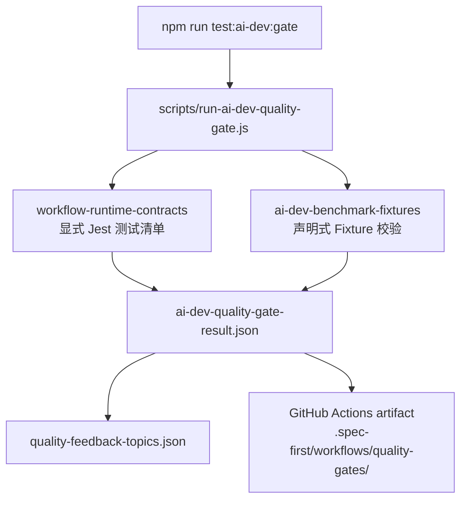

本页位于「契约、质量门禁与验证」分组中的 **[AI Dev Quality Gate 与 Eval Fixtures](25-ai-dev-quality-gate-yu-eval-fixtures)**，只解释 `AI Dev Quality Gate` 如何把一组显式的运行时契约测试与一组声明式 benchmark fixtures 汇总为仓库内可追溯的质量门禁结果；相邻主题如契约体系整体、任务包与运行证据、完整测试体系分别应继续阅读 [契约文档与 Schema 校验体系](23-qi-yue-wen-dang-yu-schema-xiao-yan-ti-xi)、[任务包、运行证据与 Honest Closeout](24-ren-wu-bao-yun-xing-zheng-ju-yu-honest-closeout)、[测试体系：单元测试、集成测试、Smoke Test 与发布检查](26-ce-shi-ti-xi-dan-yuan-ce-shi-ji-cheng-ce-shi-smoke-test-yu-fa-bu-jian-cha)。Sources: [ai-dev-quality-gate.yml](.github/workflows/ai-dev-quality-gate.yml#L60-L68), [package.json](package.json#L23-L30)

## 架构假设：质量门禁不是「跑所有测试」，而是「固定边界的工程闭环哨兵」

经源码验证，AI Dev Quality Gate 的核心架构判断有三条：第一，阻塞性判断来自一组显式列出的 workflow runtime contract 单元测试，而不是从工作流状态机或目录结构动态推断；第二，Eval Fixtures 以 advisory 形式进入总结果，用于暴露 fixture 漂移但不阻塞 aggregate gate；第三，所有输出都落在 `.spec-first/workflows/quality-gates/<slug>/` 之下，形成可上传、可回放、可被后续质量反馈消费的仓库证据。Sources: [run-ai-dev-quality-gate.js](scripts/run-ai-dev-quality-gate.js#L16-L30), [run-ai-dev-quality-gate.js](scripts/run-ai-dev-quality-gate.js#L88-L103), [artifact-paths.js](src/verification/artifact-paths.js#L34-L52)



上图中的入口由 `package.json` 的 `test:ai-dev:gate` 脚本绑定到 `scripts/run-ai-dev-quality-gate.js`，CI 工作流执行同一 npm 脚本，并在结束后上传 `.spec-first/workflows/quality-gates/` 目录；runner 内部再调用 runtime contracts suite 与 benchmark fixtures runner，最终写出 gate result 与 feedback topics 两类产物。Sources: [package.json](package.json#L23-L30), [ai-dev-quality-gate.yml](.github/workflows/ai-dev-quality-gate.yml#L57-L68), [run-ai-dev-quality-gate.js](scripts/run-ai-dev-quality-gate.js#L138-L164)

## 运行入口与 CI 触发边界

本地入口有两个：`npm run test:ai-dev:gate` 执行总门禁，`npm run test:ai-dev:benchmarks` 只执行 benchmark fixture suite；这两个 npm scripts 分别指向 `scripts/run-ai-dev-quality-gate.js` 与 `scripts/run-ai-dev-benchmark-fixtures.js`。Sources: [package.json](package.json#L23-L30)

GitHub Actions 工作流名为 `AI Dev Quality Gate`，在 pull request 触及质量门禁相关路径时触发，也支持 `workflow_dispatch`；路径过滤覆盖 contracts、verification、quality-gates contract、相关 scripts、核心 workflow skills、对应 unit tests、fixture 目录、integration gate test 以及 package lock 文件。Sources: [ai-dev-quality-gate.yml](.github/workflows/ai-dev-quality-gate.yml#L1-L41)

CI job 固定运行在 `ubuntu-latest`，使用 Node 20，先 `npm ci`，再执行 `npm run test:ai-dev:gate`，最后无论成功失败都上传 `.spec-first/workflows/quality-gates/` 目录作为 artifact。Sources: [ai-dev-quality-gate.yml](.github/workflows/ai-dev-quality-gate.yml#L43-L68)

## Gate Runner 的执行模型

`runAiDevQualityGate` 在当前时间生成 `generated_at`，通过 `resolveWorkflowArtifactDir(repoRoot, 'quality-gates', 'ai-dev-quality-gate')` 得到门禁产物目录，然后依次运行 `runWorkflowRuntimeContractsSuite` 与 `runAiDevBenchmarkFixtures`；前者产生阻塞性 check，后者产生 advisory benchmark check。Sources: [run-ai-dev-quality-gate.js](scripts/run-ai-dev-quality-gate.js#L138-L149), [artifact-paths.js](src/verification/artifact-paths.js#L45-L52)

`runWorkflowRuntimeContractsSuite` 通过 `require.resolve('jest/bin/jest')` 定位 Jest，使用 `spawnSync(process.execPath, [...])` 执行显式测试清单，并添加 `--runInBand`、`--json`、`--outputFile=<artifact>`；它根据进程退出码与 Jest JSON 输出中的 `success === true` 判定 `passed`。Sources: [run-ai-dev-quality-gate.js](scripts/run-ai-dev-quality-gate.js#L105-L135)

显式测试清单当前包含 branch protection、init source path coverage、package install、PowerShell MCP setup、AI dev gate 自测、benchmark fixtures、spec-plan、task-pack、spec-write-tasks、spec-work、spec-doc-review、spec-code-review 与 plan status taxonomy 相关测试；对应 unit test 明确断言 runner 使用有界清单而不是从 workflow state 推断。Sources: [run-ai-dev-quality-gate.js](scripts/run-ai-dev-quality-gate.js#L16-L30), [ai-dev-quality-gate.test.js](tests/unit/ai-dev-quality-gate.test.js#L186-L203)

## Gate Result Contract

总门禁结果使用 `schema_version`、`generated_at`、`gate_id`、`passed`、`checks`、`failures`、`advisory_failures` 作为必需字段；其中每个 check 必须包含 `check_id`、`kind`、`passed`、`summary`、`artifact_path`，`kind` 只能是 `unit-suite` 或 `benchmark`。Sources: [ai-dev-quality-gate-result.schema.json](docs/contracts/quality-gates/ai-dev-quality-gate-result.schema.json#L1-L47)

| 字段 | 语义 | 关键约束 |
|---|---|---|
| `gate_id` | 当前 gate 标识 | runner 常量为 `ai-dev-quality-gate` |
| `passed` | 总门禁是否通过 | 只由非 advisory checks 决定 |
| `checks` | 所有子检查结果 | 支持 `unit-suite` 与 `benchmark` |
| `failures` | 阻塞失败 check id 列表 | 只收集非 advisory failed checks |
| `advisory_failures` | 非阻塞失败摘要 | 包含 `check_id`、`reason_code`、`artifact_paths` |

Sources: [run-ai-dev-quality-gate.js](scripts/run-ai-dev-quality-gate.js#L88-L103), [ai-dev-quality-gate-result.schema.json](docs/contracts/quality-gates/ai-dev-quality-gate-result.schema.json#L48-L70)

`buildGateResult` 的聚合规则很窄：它先把 `workflowRuntimeContracts` 放入 `checks`，如存在 benchmark result 再追加 benchmark check；随后只筛选 `advisory !== true` 的 checks 计算总 `passed` 与 `failures`，因此 benchmark fixture 失败会出现在 `advisory_failures`，但不会使 aggregate gate 失败。Sources: [run-ai-dev-quality-gate.js](scripts/run-ai-dev-quality-gate.js#L88-L103), [ai-dev-quality-gate.test.js](tests/unit/ai-dev-quality-gate.test.js#L61-L126)

## Eval Fixtures 的定位：声明式输入质量，而非命令执行器

Benchmark fixtures runner 的 suite id 是 `ai-dev-benchmark-fixtures`，默认读取 `tests/fixtures/ai-dev-benchmarks`，并使用两个 schema：fixture manifest schema 与 benchmark result schema；有效 `scenario_type` 当前限定为 `api-contract`、`docs-only`、`cli-bugfix`、`multi-module-refactor`。Sources: [run-ai-dev-benchmark-fixtures.js](scripts/run-ai-dev-benchmark-fixtures.js#L10-L34)

Fixture manifest 必须声明 `schema_version`、`fixture_id`、`scenario_type`、`prompt_path`、`repo_path`、`expected_workflows`、`expected_changed_paths`、`expected_artifacts`、`validation_commands`、`quality_signals`；可选的 `semantic_review` 记录语义审查证据，可选的 `degraded_mode_expectations` 记录降级模式预期。Sources: [ai-dev-benchmark-fixture.schema.json](docs/contracts/quality-gates/ai-dev-benchmark-fixture.schema.json#L1-L17), [ai-dev-benchmark-fixture.schema.json](docs/contracts/quality-gates/ai-dev-benchmark-fixture.schema.json#L109-L161)

| Manifest 字段 | 用途 | 校验要点 |
|---|---|---|
| `fixture_id` | fixture 唯一标识 | runner 要求与目录名一致 |
| `scenario_type` | 场景分类 | 必须属于四种有效场景 |
| `prompt_path` / `repo_path` | 输入 prompt 与 fixture repo | 必须是安全 POSIX 仓库相对路径，且文件/目录存在 |
| `expected_changed_paths` | 预期变更路径 | 每个路径都必须通过安全路径校验 |
| `expected_artifacts` | 预期产物 | 至少一个产物，且 path 通过安全路径校验 |
| `validation_commands` | 预期验证命令 | 必须声明，但 runner 标记为 `declared_only` |
| `semantic_review` | 语义审查证据 | 如声明则 artifact 文件必须存在 |

Sources: [run-ai-dev-benchmark-fixtures.js](scripts/run-ai-dev-benchmark-fixtures.js#L163-L219), [run-ai-dev-benchmark-fixtures.js](scripts/run-ai-dev-benchmark-fixtures.js#L221-L289)

关键边界是：fixture runner **不会执行** `validation_commands`，而是将每个 fixture 的 `validation_commands_status` 固定为 `declared_only`；unit tests 也明确断言 full-closure 场景、未知场景、semantic review 证据都不会把声明命令转为实际执行。Sources: [run-ai-dev-benchmark-fixtures.js](scripts/run-ai-dev-benchmark-fixtures.js#L278-L289), [ai-dev-benchmark-fixtures.test.js](tests/unit/ai-dev-benchmark-fixtures.test.js#L151-L198)

## Fixture Suite 的安全与失败语义

路径安全由 `isSafeRepoRelativePath` 统一执行：值必须是字符串，不能包含反斜杠，不能是 POSIX 或 Windows 绝对路径，`path.posix.normalize(value)` 必须等于原值，且路径段不能是空、`.` 或 `..`。Sources: [run-ai-dev-benchmark-fixtures.js](scripts/run-ai-dev-benchmark-fixtures.js#L53-L61)

runner 会为缺失 manifest、无效 JSON、schema 不通过、fixture id 与目录不一致、未知场景、unsafe path、缺失 prompt、缺失 repo、缺失 semantic review artifact、缺失 artifact expectation、缺失 validation command 等情况创建 failure，并把相关 manifest、prompt、repo 或 semantic review 路径写入 `artifact_paths`。Sources: [run-ai-dev-benchmark-fixtures.js](scripts/run-ai-dev-benchmark-fixtures.js#L109-L194), [run-ai-dev-benchmark-fixtures.js](scripts/run-ai-dev-benchmark-fixtures.js#L210-L276)

Benchmark result contract 要求 `advisory` 恒为 `true`，每个 fixture result 也要求 `advisory: true` 与 `validation_commands_status: "declared_only"`；失败项必须包含 `fixture_id`、`reason_code`、`message`、`artifact_paths`。Sources: [ai-dev-benchmark-fixtures-result.schema.json](docs/contracts/quality-gates/ai-dev-benchmark-fixtures-result.schema.json#L6-L33), [ai-dev-benchmark-fixtures-result.schema.json](docs/contracts/quality-gates/ai-dev-benchmark-fixtures-result.schema.json#L34-L148)

## 当前内置 Fixtures 覆盖面

当前 checked-in fixture suite 包含四个目录：`api-contract`、`cli-bugfix`、`docs-only`、`multi-module-refactor`；unit test 固定断言这四个 fixture id，并逐个验证 manifest schema 与 `fixture_id`。Sources: [ai-dev-benchmark-fixtures.test.js](tests/unit/ai-dev-benchmark-fixtures.test.js#L82-L99)

```text
tests/fixtures/ai-dev-benchmarks/
├── api-contract/
│   ├── manifest.json
│   ├── prompt.md
│   ├── repo/
│   └── expected/semantic-review.md
├── cli-bugfix/
│   ├── manifest.json
│   ├── prompt.md
│   └── repo/
├── docs-only/
│   ├── manifest.json
│   ├── prompt.md
│   └── repo/
└── multi-module-refactor/
    ├── manifest.json
    ├── prompt.md
    └── repo/
```

上述结构中的 `api-contract` fixture 预期经过 `spec-plan`、`spec-work`、`spec-code-review`，覆盖 API 实现、client、unit test、contract doc 与 changelog，并记录 `expected/semantic-review.md` 作为 `llm-review-pass` 语义审查证据。Sources: [api-contract manifest](tests/fixtures/ai-dev-benchmarks/api-contract/manifest.json#L1-L47)

`docs-only` fixture 预期同样经过 `spec-plan`、`spec-work`、`spec-code-review`，但 expected changed paths 仅包含 workflow contract doc 与 changelog，quality signals 明确限定为 docs 与 changelog 路径。Sources: [docs-only manifest](tests/fixtures/ai-dev-benchmarks/docs-only/manifest.json#L1-L36)

`cli-bugfix` fixture 预期经过 `spec-debug`、`spec-work`、`spec-code-review`，expected artifacts 包括目标 unit test 与 CLI 源文件，并声明 Jest、`node --check`、`git diff --check` 三类验证命令。Sources: [cli-bugfix manifest](tests/fixtures/ai-dev-benchmarks/cli-bugfix/manifest.json#L1-L38)

`multi-module-refactor` fixture 预期经过 `spec-plan`、`spec-work`、`spec-code-review`，变更限定在 `packages/cli` 与 changelog，quality signals 明确要求不修改 sibling modules，除非 prompt 或 source plan 明确证明需要改 shared helpers。Sources: [multi-module-refactor manifest](tests/fixtures/ai-dev-benchmarks/multi-module-refactor/manifest.json#L1-L39)

## 产物写入与 Feedback Topics

质量门禁总结果写入 `.spec-first/workflows/quality-gates/ai-dev-quality-gate/ai-dev-quality-gate-result.json`，workflow runtime contracts 的 Jest JSON 写入同一目录下的 `workflow-runtime-contracts.junit.json`，benchmark fixtures result 写入 `.spec-first/workflows/quality-gates/ai-dev-benchmark-fixtures/benchmark-fixtures-result.json`。Sources: [run-ai-dev-quality-gate.js](scripts/run-ai-dev-quality-gate.js#L105-L135), [run-ai-dev-quality-gate.js](scripts/run-ai-dev-quality-gate.js#L149-L164), [run-ai-dev-benchmark-fixtures.js](scripts/run-ai-dev-benchmark-fixtures.js#L363-L372)

`resolveWorkflowArtifactDir` 固定产物布局为 `<repoRoot>/.spec-first/workflows/<workflow>/<slug>/`，并校验 workflow 与 slug 必须是安全路径段，同时确保 artifact path 留在 anchor root 内；这保证 quality gate 与 benchmark suite 的产物路径不会逃逸到仓库锚点之外。Sources: [artifact-paths.js](src/verification/artifact-paths.js#L34-L52), [artifact-paths.js](src/verification/artifact-paths.js#L54-L93)

`quality-feedback-topics.json` 由 `buildQualityFeedbackTopics` 生成，来源标记为 `passive-quality-feedback`；它会把每个 `passed === false` 的 check 转成 `gate-check:<check_id>` topic，并记录 check artifact path、tags 与 latest gate 摘要。Sources: [run-ai-dev-quality-gate.js](scripts/run-ai-dev-quality-gate.js#L152-L164), [quality-feedback.js](src/verification/quality-feedback.js#L7-L50)

## 阻塞与 Advisory 的判读方式

高级开发者阅读 gate result 时，应先看顶层 `passed` 与 `failures`：如果失败来自 `workflow-runtime-contracts`，这是阻塞失败，因为该 check 没有 `advisory: true`；如果失败来自 `ai-dev-benchmark-fixtures`，它会保留在 `checks` 与 `advisory_failures` 中，但不会使总 gate 失败。Sources: [run-ai-dev-quality-gate.js](scripts/run-ai-dev-quality-gate.js#L88-L103), [ai-dev-quality-gate.test.js](tests/unit/ai-dev-quality-gate.test.js#L61-L126)

| 失败位置 | 是否阻塞总 gate | 主要排查入口 |
|---|---:|---|
| `failures` 包含 `workflow-runtime-contracts` | 是 | 查看 `workflow-runtime-contracts.junit.json` 与对应显式测试文件 |
| `advisory_failures` 包含 `ai-dev-benchmark-fixtures` | 否 | 查看 `benchmark-fixtures-result.json` 与失败 fixture 的 manifest/prompt/repo |
| `checks[].summary.fixtures_failed > 0` | 否 | 用于暴露 fixture 漂移数量 |
| `checks[].summary.tests_failed > 0` | 是，如果 check 非 advisory | 用于定位 runtime contract 测试失败数量 |

Sources: [run-ai-dev-quality-gate.js](scripts/run-ai-dev-quality-gate.js#L49-L86), [run-ai-dev-quality-gate.js](scripts/run-ai-dev-quality-gate.js#L124-L135)

## 维护 Eval Fixtures 的最小规则

新增 fixture 时，目录名必须等于 `manifest.fixture_id`，manifest 必须符合 v1 schema，`scenario_type` 必须属于当前四类之一，`prompt_path`、`repo_path`、`expected_changed_paths`、`expected_artifacts[].path` 以及 `semantic_review.artifact_path` 都必须是安全 POSIX 仓库相对路径。Sources: [run-ai-dev-benchmark-fixtures.js](scripts/run-ai-dev-benchmark-fixtures.js#L163-L219), [ai-dev-benchmark-fixture.schema.json](docs/contracts/quality-gates/ai-dev-benchmark-fixture.schema.json#L23-L35)

新增 fixture 还必须提供至少一个 `expected_artifacts` 与至少一个 `validation_commands`；这些命令只作为预期验证证据声明，不会被 fixture runner 执行，因此不要把 fixture runner 理解成 sandbox、E2E executor 或自动修复器。Sources: [run-ai-dev-benchmark-fixtures.js](scripts/run-ai-dev-benchmark-fixtures.js#L260-L289), [ai-dev-benchmark-fixtures-result.schema.json](docs/contracts/quality-gates/ai-dev-benchmark-fixtures-result.schema.json#L71-L85)

维护 CI 覆盖时，应确保 workflow path filters 持续覆盖 gate scripts、quality gate contracts、fixture 目录、对应 unit tests 以及 workflow 自身；现有 unit test 会检查这些路径，并明确拒绝旧的 `src/bootstrap-compiler/**`、`src/context-routing/**`、`src/cli/commands/stage0-context.js` 路径重新进入该 gate。Sources: [ai-dev-quality-gate.test.js](tests/unit/ai-dev-quality-gate.test.js#L205-L234)

## 阅读路径

如果你需要理解这些 schema 为什么被放在 contracts 体系中，下一步阅读 [契约文档与 Schema 校验体系](23-qi-yue-wen-dang-yu-schema-xiao-yan-ti-xi)；如果你关心 gate 结果如何和任务包、运行证据、收尾报告衔接，阅读 [任务包、运行证据与 Honest Closeout](24-ren-wu-bao-yun-xing-zheng-ju-yu-honest-closeout)；如果你要比较 AI Dev Quality Gate 与普通 unit、integration、smoke、release checks 的分工，阅读 [测试体系：单元测试、集成测试、Smoke Test 与发布检查](26-ce-shi-ti-xi-dan-yuan-ce-shi-ji-cheng-ce-shi-smoke-test-yu-fa-bu-jian-cha)。Sources: [ai-dev-quality-gate.yml](.github/workflows/ai-dev-quality-gate.yml#L60-L68), [package.json](package.json#L23-L35)