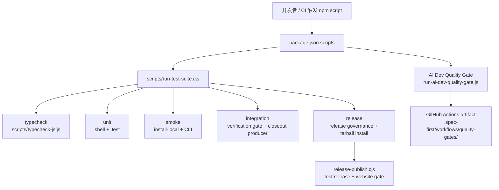
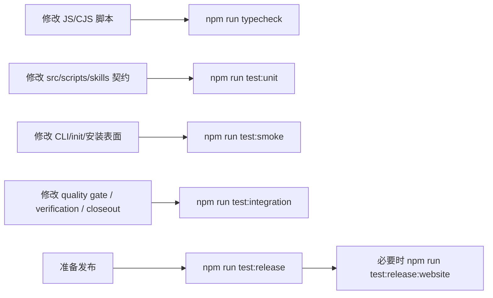

本页解释 spec-first 仓库的测试体系如何把 **语法检查、单元测试、集成验证、Smoke Test、发布前检查与 CI 矩阵** 串成一条可执行的质量链路。当前页位于“契约、质量门禁与验证”分组，前序可先阅读 [AI Dev Quality Gate 与 Eval Fixtures](25-ai-dev-quality-gate-yu-eval-fixtures)，后续可继续阅读 [docs/solutions 知识库与 Compound 机制](27-docs-solutions-zhi-shi-ku-yu-compound-ji-zhi)。Sources: [package.json](package.json#L15-L36), [spec-first.verification.json](spec-first.verification.json#L1-L40)

## 架构假设：测试体系是“分层入口 + 统一编排 + 发布加固”

从源码结构看，测试体系并不是单一 `jest` 命令，而是以 `package.json` 暴露 npm scripts，以 `scripts/run-test-suite.cjs` 统一编排 unit、smoke、integration、release 等套件，再由 `spec-first.verification.json` 把 typecheck、unit、smoke、integration 定义为默认验证 profile；这说明项目把“本地可跑”和“发布可守”分成了两层：日常开发默认跑基础闭环，发布流程再叠加发布连续性、安装 tarball、网站同步等检查。Sources: [package.json](package.json#L15-L36), [scripts/run-test-suite.cjs](scripts/run-test-suite.cjs#L126-L156), [spec-first.verification.json](spec-first.verification.json#L1-L40)

这张图的关键是：`run-test-suite.cjs` 是本地测试的 Front Controller，`spec-first.verification.json` 是验证 profile 的声明层，GitHub Actions 与发布脚本则把关键检查提升为 CI 或发布门禁。Sources: [scripts/run-test-suite.cjs](scripts/run-test-suite.cjs#L69-L124), [spec-first.verification.json](spec-first.verification.json#L17-L38), [.github/workflows/ai-dev-quality-gate.yml](.github/workflows/ai-dev-quality-gate.yml#L43-L69), [scripts/release-publish.cjs](scripts/release-publish.cjs#L109-L132)

## npm scripts：开发者面对的测试入口

`package.json` 定义了测试入口：`test:unit`、`test:smoke`、`test:integration` 分别委托给 `run-test-suite.cjs` 的对应套件，`test` 执行 all，`test:release`、`test:release:governance`、`test:release:install` 则用于发布前检查；此外还存在 `test:ai-dev:gate` 与 `test:ai-dev:benchmarks`，服务于 AI Dev Quality Gate 与 benchmark fixtures。Sources: [package.json](package.json#L23-L35)

| 入口 | 实际命令 | 用途边界 |
|---|---|---|
| `npm run typecheck` | `node scripts/typecheck-js.js` | 对仓库内 JS/CJS 文件做 Node 语法级检查。 |
| `npm run test:unit` | `node scripts/run-test-suite.cjs unit` | 执行 shell 单测、MCP setup 单测与 `tests/unit` Jest 单测。 |
| `npm run test:smoke` | `node scripts/run-test-suite.cjs smoke` | 验证本地安装脚本与 CLI 初始化/命令表面。 |
| `npm run test:integration` | `node scripts/run-test-suite.cjs integration` | 执行指定集成测试文件。 |
| `npm test` | `node scripts/run-test-suite.cjs all` | 顺序执行 unit、smoke、integration。 |
| `npm run test:release` | `node scripts/run-test-suite.cjs release` | 发布前执行 governance 与 tarball install 检查。 |
| `npm run test:release:website` | `node scripts/check-website-sync.cjs --required` | 发布流程中的网站同步门禁。 |
| `npm run test:ai-dev:gate` | `node scripts/run-ai-dev-quality-gate.js` | CI 中的 AI Dev Quality Gate 主入口。 |

Sources: [package.json](package.json#L15-L36), [scripts/run-test-suite.cjs](scripts/run-test-suite.cjs#L69-L137), [scripts/release-publish.cjs](scripts/release-publish.cjs#L109-L132)

## Jest 配置：隔离 generated runtime 与 fixtures 噪声

Jest 配置只保留必要设置：加载 `tests/jest-setup.js`，并忽略 `.worktrees`、`.agents`、`.claude`、`.codex`、`.spec-first` 等生成或运行时目录；测试路径还额外忽略 `tests/fixtures/ai-dev-benchmarks/`，避免 benchmark fixtures 被普通 Jest 发现机制误当成测试输入。Sources: [jest.config.js](jest.config.js#L1-L21)

这种配置反映了仓库测试体系的一个边界：生成运行时目录、宿主投影目录和 benchmark fixture 数据不应污染普通单元测试发现范围；它们要么由专门脚本验证，要么由 AI Dev Quality Gate/benchmark runner 消费。Sources: [jest.config.js](jest.config.js#L4-L20), [package.json](package.json#L28-L31)

## Typecheck：轻量语法地板

`typecheck-js.js` 使用 Node 自带 `--check` 对 `bin`、`src`、`scripts`、`skills` 下的 `.js` 与 `.cjs` 文件逐个做语法检查；它不执行代码逻辑，而是作为快速失败的语法地板，在测试链路中补足 CommonJS 脚本仓库常见的解析错误防线。Sources: [scripts/typecheck-js.js](scripts/typecheck-js.js#L8-L11), [scripts/typecheck-js.js](scripts/typecheck-js.js#L32-L51)

| 检查对象 | 文件类型 | 检查方式 | 失败行为 |
|---|---|---|---|
| `bin`、`src`、`scripts`、`skills` | `.js`、`.cjs` | `node --check <file>` | 输出 stderr/stdout 并返回 1 |
| 不存在的根目录 | 不适用 | `fs.existsSync` 过滤 | 跳过 |
| 全部通过 | 已排序文件列表 | 输出通过数量 | 返回 0 |

Sources: [scripts/typecheck-js.js](scripts/typecheck-js.js#L8-L11), [scripts/typecheck-js.js](scripts/typecheck-js.js#L32-L51), [scripts/typecheck-js.js](scripts/typecheck-js.js#L58-L62)

## 单元测试：shell 合约与 Jest 合约并行存在

`runUnit()` 的执行顺序是：先跑 `tests/unit/developer.sh`、`tests/unit/lang-policy.sh`，再进入 `runMcpSetup()`，随后跑 `tests/unit/version-reminder.sh`，最后用 Jest 执行整个 `tests/unit` 目录并设置 `--runInBand`；这说明项目把 shell 行为契约和 JS Jest 契约共同视为单元层的一部分。Sources: [scripts/run-test-suite.cjs](scripts/run-test-suite.cjs#L69-L83)

Windows 下的 MCP setup 单测有专门降级路径：如果是原生 Windows 且没有设置 `SPEC_FIRST_FORCE_POSIX_TESTS=1`，`runMcpSetup()` 只跑 `tests/unit/mcp-setup-powershell-contracts.test.js`；POSIX shell 测试则在原生 Windows 上默认跳过，避免 shell 环境差异导致误报。Sources: [scripts/run-test-suite.cjs](scripts/run-test-suite.cjs#L9-L10), [scripts/run-test-suite.cjs](scripts/run-test-suite.cjs#L61-L67), [scripts/run-test-suite.cjs](scripts/run-test-suite.cjs#L77-L83)

`run-test-suite` 自身也有单测覆盖：测试确认默认超时可由 `SPEC_FIRST_TEST_COMMAND_TIMEOUT_MS` 覆盖，超时会映射为退出码 124，release governance 的执行顺序先于 release smoke，并确认 integration suite 已不再引用旧 shell e2e 链路。Sources: [tests/unit/run-test-suite.test.js](tests/unit/run-test-suite.test.js#L14-L33), [tests/unit/run-test-suite.test.js](tests/unit/run-test-suite.test.js#L35-L55)

## 集成测试：聚焦质量门禁与运行证据生产

`runIntegration()` 当前只运行两个 Jest 文件：`tests/integration/verification-gate.integration.test.js` 与 `tests/integration/spec-work-closeout-producer.test.js`，并使用 `--runInBand` 串行执行；对应单测明确断言旧的 shell e2e 链路、`task-manager.sh`、`stage-gate.sh`、`review-judge.sh` 不应再出现在集成编排中。Sources: [scripts/run-test-suite.cjs](scripts/run-test-suite.cjs#L94-L100), [tests/unit/run-test-suite.test.js](tests/unit/run-test-suite.test.js#L45-L55)

`verification-gate.integration.test.js` 重点验证 AI Dev Quality Gate 的集成表面：`package.json` 必须暴露 `test:ai-dev:gate` 与 `test:ai-dev:benchmarks`，`run-test-suite.cjs` 必须包含 integration 函数并引用该集成测试文件，GitHub Actions workflow 必须触发在契约、verifier、quality gate、核心 skill、相关测试与 fixtures 变化上，并执行 `npm run test:ai-dev:gate` 后上传 `.spec-first/workflows/quality-gates/`。Sources: [tests/integration/verification-gate.integration.test.js](tests/integration/verification-gate.integration.test.js#L16-L27), [tests/integration/verification-gate.integration.test.js](tests/integration/verification-gate.integration.test.js#L28-L57)

## Smoke Test：验证安装体验与 CLI 表面，而不是业务内部细节

`runSmoke()` 在 POSIX 环境下执行 `tests/smoke/install-local.sh` 与 `tests/smoke/cli.sh`；在原生 Windows 且未强制 POSIX 测试时，改为运行 `scripts/npm-install-matrix-smoke.js`，这使 smoke 层更关注真实安装与 CLI 可用性，而不是复用 Jest 的内部契约测试。Sources: [scripts/run-test-suite.cjs](scripts/run-test-suite.cjs#L85-L92)

`install-local.sh` smoke 测试会运行仓库根目录的 `install-local.sh`，然后断言输出指向 `npm install -g spec-first`、`spec-first init`、宿主选择引导和 `spec-compound` 描述，同时确认输出不再包含旧的 Claude 插件缓存路径。Sources: [tests/smoke/install-local.sh](tests/smoke/install-local.sh#L15-L36)

`cli.sh` smoke 测试在隔离 HOME 中运行，首先计算不同宿主的期望命令和 skill 数量，然后验证 CLI help/version 输出包含 doctor、init、clean、tasks 等入口，并确保 help 中不再暴露 `stage0-context`；后续脚本继续通过 programmatic init 验证多宿主初始化表面。Sources: [tests/smoke/cli.sh](tests/smoke/cli.sh#L5-L18), [tests/smoke/cli.sh](tests/smoke/cli.sh#L95-L143), [tests/smoke/cli.sh](tests/smoke/cli.sh#L146-L160)

## 发布检查：从连续性守卫到真实 tarball 安装

发布入口分为 governance 与 install 两部分：`runReleaseGovernance()` 先运行 `scripts/check-release-continuity.cjs`，再跑 `tests/smoke/release-dual-host-governance.sh`；`runReleaseInstall()` 在 POSIX 环境下运行 `tests/smoke/install-tarball.sh`，在原生 Windows 下运行 `scripts/npm-install-matrix-smoke.js`。Sources: [scripts/run-test-suite.cjs](scripts/run-test-suite.cjs#L102-L118)

`check-release-continuity.cjs` 的守卫包括 runtime capability catalog 新鲜度、公开 workflow contract summary 覆盖、package delivery surface、website sync 发布门禁、README 边界链接；其中 blocking failure 会使整体状态变为 failed，输出既可渲染文本，也可通过 `--json` 输出结构化结果。Sources: [scripts/check-release-continuity.cjs](scripts/check-release-continuity.cjs#L253-L319), [scripts/check-release-continuity.cjs](scripts/check-release-continuity.cjs#L321-L337)

`install-tarball.sh` 是真实 tarball 安装回归：它执行 `npm pack`，检查包内不含 native parser 依赖、`.claude-plugin` 生成产物、Python bytecode、已删除的 `spec-standards` 资产，并确认当前 workflow assets、宿主 adapter 与关键 skill 被打进包内；随后隔离安装到临时 prefix，并验证安装日志不包含 allow-scripts 警告和 native parser 依赖。Sources: [tests/smoke/install-tarball.sh](tests/smoke/install-tarball.sh#L1-L6), [tests/smoke/install-tarball.sh](tests/smoke/install-tarball.sh#L28-L80), [tests/smoke/install-tarball.sh](tests/smoke/install-tarball.sh#L82-L115)

## 发布脚本如何调用测试门禁

`release-publish.cjs` 在写入目标版本后会先运行 `npm run test:release`，再运行 `npm run test:release:website`；dry-run 模式下还会执行 `npm pack --dry-run` 预览 tarball，正式发布模式下则执行 `npm pack` 和 `npm publish --registry=https://registry.npmjs.org --no-git-checks`。Sources: [scripts/release-publish.cjs](scripts/release-publish.cjs#L96-L132)

这个流程意味着发布不是只依赖 `npm test`：发布前必须通过 release continuity、tarball 安装体验、dual-host governance 与 website sync gate；如果发布脚本临时写入了版本号且 dry-run 或发布失败，finally 块会恢复原始 `package.json` version。Sources: [scripts/release-publish.cjs](scripts/release-publish.cjs#L96-L112), [scripts/release-publish.cjs](scripts/release-publish.cjs#L135-L145)

## CI：AI Dev Quality Gate 与 npm 安装矩阵

AI Dev Quality Gate workflow 在 pull request 中只对契约、verification、quality gates、核心 workflow skills、相关单测、benchmark fixtures、package 文件等路径变化触发，也支持手动触发；它在 Ubuntu + Node 20 上执行 `npm ci` 与 `npm run test:ai-dev:gate`，并总是尝试上传 `.spec-first/workflows/quality-gates/` 作为 artifact。Sources: [.github/workflows/ai-dev-quality-gate.yml](.github/workflows/ai-dev-quality-gate.yml#L1-L41), [.github/workflows/ai-dev-quality-gate.yml](.github/workflows/ai-dev-quality-gate.yml#L43-L69)

npm Install Matrix workflow 在 push 与 pull request 中对发布表面相关路径触发，在 Ubuntu、macOS、Windows 上分别以 Node 20、22、24 运行；非 Windows 直接执行 `node scripts/npm-install-matrix-smoke.js`，Windows 同时覆盖 pwsh 与 cmd 两种 shell，并上传安装 smoke artifacts。Sources: [.github/workflows/npm-install-matrix.yml](.github/workflows/npm-install-matrix.yml#L1-L44), [.github/workflows/npm-install-matrix.yml](.github/workflows/npm-install-matrix.yml#L46-L94)

| CI 工作流 | 运行平台 | 核心命令 | 验证意图 |
|---|---|---|---|
| AI Dev Quality Gate | Ubuntu + Node 20 | `npm run test:ai-dev:gate` | 契约、质量门禁、核心 skill 与 fixture 变化后的 AI 开发质量验证。 |
| npm Install Matrix | Ubuntu/macOS/Windows + Node 20/22/24 | `node scripts/npm-install-matrix-smoke.js` | 跨 OS、跨 Node 版本、跨 Windows shell 的安装体验回归。 |

Sources: [.github/workflows/ai-dev-quality-gate.yml](.github/workflows/ai-dev-quality-gate.yml#L43-L69), [.github/workflows/npm-install-matrix.yml](.github/workflows/npm-install-matrix.yml#L46-L94)

## 默认验证 Profile：把测试命令变成可声明能力

`spec-first.verification.json` 声明默认 profile 为 `default`，服务为 `spec-first`，默认 checks 包含 `typecheck`、`unit`、`smoke`、`integration`；Node stack 的命令分别映射到 `npm run typecheck`、`npm run test:unit`、`npm run test:smoke`、`npm run test:integration`，并声明每类检查都需要 `node` 与 `npm`。Sources: [spec-first.verification.json](spec-first.verification.json#L1-L40)

这层声明的价值是把“应该跑哪些测试”从口头约定变成机器可读的 profile：工具可以根据 stack detect `package.json`，再用 runner_kind 与 required_tools 判断如何执行、如何解释检查类型。Sources: [spec-first.verification.json](spec-first.verification.json#L17-L38)

## 本地执行建议

日常开发最小闭环可以先运行 `npm run typecheck` 与 `npm run test:unit`；涉及 CLI 初始化、宿主投影、安装体验时补跑 `npm run test:smoke`；涉及质量门禁、运行证据或 workflow gate 相关改动时补跑 `npm run test:integration`；准备发布前使用 `npm run test:release`，网站同步相关变更还必须关注 `npm run test:release:website`。Sources: [package.json](package.json#L20-L35), [scripts/run-test-suite.cjs](scripts/run-test-suite.cjs#L69-L124)

这条执行路径对应仓库现有入口：`typecheck` 负责语法地板，unit 负责 shell 与 Jest 合约，smoke 负责安装和 CLI 体验，integration 负责质量门禁集成，release 负责发布前连续性与真实包安装。Sources: [scripts/typecheck-js.js](scripts/typecheck-js.js#L32-L51), [scripts/run-test-suite.cjs](scripts/run-test-suite.cjs#L69-L124), [scripts/release-publish.cjs](scripts/release-publish.cjs#L109-L132)

## 故障定位速查

当 `run-test-suite.cjs` 报错时，先看失败 suite：unit 失败通常落在 shell 合约、MCP setup 分支或 Jest 单测；smoke 失败通常落在 `install-local.sh`、`cli.sh` 或 Windows 下的 install matrix；integration 失败通常是 AI Dev Quality Gate workflow、branch protection policy 或 closeout producer 的契约不一致；release 失败则优先看 release continuity guard、tarball 内容和 website sync gate。Sources: [scripts/run-test-suite.cjs](scripts/run-test-suite.cjs#L69-L150), [tests/integration/verification-gate.integration.test.js](tests/integration/verification-gate.integration.test.js#L16-L71), [scripts/check-release-continuity.cjs](scripts/check-release-continuity.cjs#L253-L337)

| 现象 | 优先检查 | 依据 |
|---|---|---|
| `Jest is not installed` | 是否已执行 `npm ci` | runner 会检查 `node_modules/jest/bin/jest.js` 是否存在。 |
| POSIX shell 测试在 Windows 被跳过 | 是否需要设置 `SPEC_FIRST_FORCE_POSIX_TESTS=1` | 原生 Windows 默认跳过 bash 测试。 |
| 命令超时退出 124 | 是否需要调整 `SPEC_FIRST_TEST_COMMAND_TIMEOUT_MS` | 默认超时为 15 分钟，支持环境变量覆盖。 |
| release continuity failed | 查看 guard 列表中的 blocking failure | blocking failure 决定整体 failed。 |
| tarball smoke failed | 查看 pack list 与 install log | tarball 测试会检查包内容与安装日志。 |

Sources: [scripts/run-test-suite.cjs](scripts/run-test-suite.cjs#L11-L17), [scripts/run-test-suite.cjs](scripts/run-test-suite.cjs#L19-L47), [scripts/run-test-suite.cjs](scripts/run-test-suite.cjs#L53-L67), [scripts/check-release-continuity.cjs](scripts/check-release-continuity.cjs#L304-L318), [tests/smoke/install-tarball.sh](tests/smoke/install-tarball.sh#L28-L115)

## 与相邻页面的阅读关系

如果你想理解“为什么这些测试被设计成质量门禁”，继续读 [AI Dev Quality Gate 与 Eval Fixtures](25-ai-dev-quality-gate-yu-eval-fixtures)；如果你想理解测试产出的运行证据如何进入工作流闭环，回看 [任务包、运行证据与 Honest Closeout](24-ren-wu-bao-yun-xing-zheng-ju-yu-honest-closeout)；如果你要新增或修改 Skill 并确保测试覆盖发布面，继续读 [新增或修改 Skill 的开发、审计与发布流程](30-xin-zeng-huo-xiu-gai-skill-de-kai-fa-shen-ji-yu-fa-bu-liu-cheng)。Sources: [package.json](package.json#L23-L35), [scripts/run-test-suite.cjs](scripts/run-test-suite.cjs#L69-L124), [.github/workflows/ai-dev-quality-gate.yml](.github/workflows/ai-dev-quality-gate.yml#L1-L69)