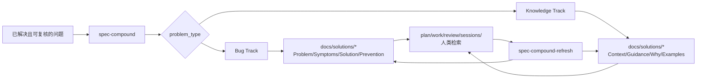
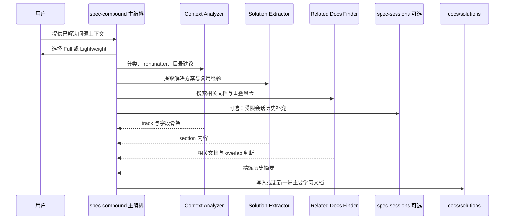

**架构假设：** `docs/solutions/` 不是普通文档归档目录，而是由 `spec-compound` 写入、由 `spec-compound-refresh` 维护、由契约测试约束格式的“可复用团队知识库”；它只承载已经解决且可被源码、测试、日志、契约或审查发现确认的问题经验，不承载活跃调试、未证实假设、会话全文或强制完成门禁。这个假设由 `spec-compound` 的触发描述、输出物定义、下游消费者说明，以及 `docs/solutions` frontmatter/section 合约测试共同验证。Sources: [SKILL.md](skills/spec-compound/SKILL.md#L1-L14), [SKILL.md](skills/spec-compound/SKILL.md#L16-L48), [docs-solutions-frontmatter.test.js](tests/unit/docs-solutions-frontmatter.test.js#L86-L126)

## 当前位置与阅读边界

本页位于“知识沉淀与团队治理”分组，专注解释 `docs/solutions/` 知识库如何被生成、校验、复用与刷新；团队规范、语言偏好、多会话协作、新增 Skill 发布流程分别属于后续页面，不在本页展开。建议读完本页后继续阅读[团队规范、项目标准与语言偏好同步](28-tuan-dui-gui-fan-xiang-mu-biao-zhun-yu-yu-yan-pian-hao-tong-bu)，如果你关注会话协作安全，再进入[多会话与多 Actor 协作安全](29-duo-hui-hua-yu-duo-actor-xie-zuo-an-quan)；如果你要修改 Compound 或相关 Skill，则进入[新增或修改 Skill 的开发、审计与发布流程](30-xin-zeng-huo-xiu-gai-skill-de-kai-fa-shen-ji-yu-fa-bu-liu-cheng)。Sources: [SKILL.md](skills/spec-compound/SKILL.md#L20-L48), [SKILL.md](skills/spec-compound-refresh/SKILL.md#L12-L42)

## 知识库的核心模型

`docs/solutions/` 的最小单元是一篇带 YAML frontmatter 的 Markdown 学习文档；`problem_type` 决定它走 Bug Track 还是 Knowledge Track，二者共享 `module`、`date`、`problem_type`、`component`、`severity` 等核心字段，但 Bug Track 额外要求 `symptoms`、`root_cause`、`resolution_type`，Knowledge Track 则以 `applies_when` 等字段表达适用条件。Sources: [schema.yaml](skills/spec-compound/references/schema.yaml#L1-L36), [schema.yaml](skills/spec-compound/references/schema.yaml#L37-L68), [schema.yaml](skills/spec-compound/references/schema.yaml#L101-L190)

上图展示的是仓库中可验证的闭环：`spec-compound` 在问题解决后写入一篇主要学习文档，文档按 track 使用不同 section 模板；后续 `spec-plan`、`spec-work`、`spec-code-review`、`spec-sessions` 与人工检索都可以消费这些学习；当学习过期、重叠或不准确时，`spec-compound-refresh` 再对现有 `docs/solutions/` 文档执行维护动作。Sources: [SKILL.md](skills/spec-compound/SKILL.md#L30-L48), [resolution-template.md](skills/spec-compound/assets/resolution-template.md#L7-L60), [resolution-template.md](skills/spec-compound/assets/resolution-template.md#L64-L112), [SKILL.md](skills/spec-compound-refresh/SKILL.md#L24-L42)

## 目录分类与检索语义

`problem_type` 不只是标签，它还映射到 `docs/solutions/` 下的分类目录，例如 `workflow_issue` 写入 `docs/solutions/workflow-issues/`，`architecture_pattern` 写入 `docs/solutions/architecture-patterns/`，`tooling_decision` 写入 `docs/solutions/tooling-decisions/`，`convention` 写入 `docs/solutions/conventions/`；契约测试还限制 `docs/solutions/` 只允许出现在一组有效分类目录下，避免知识库变成任意文件堆。Sources: [yaml-schema.md](skills/spec-compound/references/yaml-schema.md#L77-L95), [docs-solutions-frontmatter.test.js](tests/unit/docs-solutions-frontmatter.test.js#L8-L26), [docs-solutions-frontmatter.test.js](tests/unit/docs-solutions-frontmatter.test.js#L86-L93)

当前仓库中可见的知识库目录包括 `architecture-patterns`、`conventions`、`developer-experience`、`tooling-decisions`、`workflow-issues`，它们分别承载架构模式、约定、开发体验、工具决策与工作流问题类学习；样例文档 `front-controller-triggered-references-gates-eval-regression-2026-07-01.md` 就位于 `architecture-patterns`，其 frontmatter 明确声明 `category: docs/solutions/architecture-patterns` 与 `problem_type: architecture_pattern`。Sources: [front-controller-triggered-references-gates-eval-regression-2026-07-01.md](docs/solutions/architecture-patterns/front-controller-triggered-references-gates-eval-regression-2026-07-01.md#L1-L15), [yaml-schema.md](skills/spec-compound/references/yaml-schema.md#L88-L95)

## 写入机制：spec-compound

`spec-compound` 的使用边界很窄：只在真实问题已经解决、且可复用经验值得沉淀给未来 agent 或团队成员时使用；它不用于活跃调试、未完成实现、一次性美化、原始 transcript 归档，也不是每次工作流结束都必须执行的完成门禁。Sources: [SKILL.md](skills/spec-compound/SKILL.md#L18-L25), [spec-compound-contracts.test.js](tests/unit/spec-compound-contracts.test.js#L135-L149)

`spec-compound` 的完整模式先让用户选择 Full 或 Lightweight；Full 模式会并行启动 Context Analyzer、Solution Extractor、Related Docs Finder，并可在用户同意后调用 `spec-sessions` 做受限的会话历史补充；这些子任务返回文本数据，只有主编排者负责最终写文件，避免多个 agent 同时写入知识库。Sources: [SKILL.md](skills/spec-compound/SKILL.md#L106-L132), [SKILL.md](skills/spec-compound/SKILL.md#L135-L171), [SKILL.md](skills/spec-compound/SKILL.md#L173-L240)

写入前，`spec-compound` 会根据 Related Docs Finder 的 overlap 判断决定是创建新文档还是更新已有文档：高重叠意味着已有文档已经覆盖同一问题、根因与方案，应更新原文而不是制造重复；中低重叠则创建新文档，并在需要时把中等重叠作为后续 refresh 的候选。Sources: [SKILL.md](skills/spec-compound/SKILL.md#L266-L285), [SKILL.md](skills/spec-compound/SKILL.md#L317-L350)

## 文档结构：Bug Track 与 Knowledge Track

`docs/solutions/` 的文档结构由模板约束，而不是自由写作。Bug Track 关注故障复盘：`Problem`、`Symptoms`、`What Didn't Work`、`Solution`、`Why This Works`、`Prevention`；Knowledge Track 关注可复用指导：`Context`、`Guidance`、`Why This Matters`、`When to Apply`、`Examples`。Sources: [resolution-template.md](skills/spec-compound/assets/resolution-template.md#L7-L60), [resolution-template.md](skills/spec-compound/assets/resolution-template.md#L64-L112), [docs-solutions-frontmatter.test.js](tests/unit/docs-solutions-frontmatter.test.js#L95-L126)

| 维度 | Bug Track | Knowledge Track |
|---|---|---|
| 适用对象 | 已诊断并修复的缺陷、失败、错误 | 实践、模式、约定、决策、工作流改进 |
| 必备额外字段 | `symptoms`、`root_cause`、`resolution_type` | 无额外必填字段；`applies_when` 等为可选 |
| 主要 section | Problem / Symptoms / Solution / Prevention | Context / Guidance / Why This Matters / Examples |
| 典型目录 | build-errors、test-failures、runtime-errors 等 | workflow-issues、architecture-patterns、tooling-decisions 等 |

这张表来自 schema 与模板的实际约束：Bug Track 的额外字段是必填，Knowledge Track 没有额外必填字段，但新 promotion 路径要求补充 `invalidation_condition` 与 `source_refs`，以便未来召回时能重新对照源码、测试或文档证据。Sources: [schema.yaml](skills/spec-compound/references/schema.yaml#L101-L190), [yaml-schema.md](skills/spec-compound/references/yaml-schema.md#L45-L63), [resolution-template.md](skills/spec-compound/assets/resolution-template.md#L13-L60), [resolution-template.md](skills/spec-compound/assets/resolution-template.md#L70-L112)

## 结构化召回字段

新沉淀的 `docs/solutions/` 文档需要包含 `invalidation_condition` 与 `source_refs`：前者说明什么条件会让这条经验变得过期或不安全，后者列出需要重新确认的仓库相对路径；`domain`、`pattern`、`rejected_alternatives`、`applicable_versions` 等字段则提高未来检索和摘要优先召回的质量。Sources: [SKILL.md](skills/spec-compound/SKILL.md#L94-L104), [yaml-schema.md](skills/spec-compound/references/yaml-schema.md#L45-L63), [resolution-template.md](skills/spec-compound/assets/resolution-template.md#L26-L35)

已有旧文档如果缺少结构化召回字段，不会因此失效；它们被视为 `legacy_unstructured_advisory`，可以作为建议性候选被读取，但不能当作无需复核的结构化真理，刷新或回填时才逐步进入结构化路径。Sources: [SKILL.md](skills/spec-compound/SKILL.md#L94-L99), [yaml-schema.md](skills/spec-compound/references/yaml-schema.md#L69-L76)

## 质量门禁与 YAML 安全

知识库的基础质量由两层约束保障：一层是单元测试扫描 `docs/solutions/` 下所有 Markdown，检查目录分类、frontmatter 与 section 合约；另一层是 Compound 写入流程要求用 `references/schema.yaml` 校验字段，并运行 `python3 scripts/validate-frontmatter.py <output-path>` 捕捉分隔符、未引用 `#`、未引用 `: ` 等解析安全问题。Sources: [docs-solutions-frontmatter.test.js](tests/unit/docs-solutions-frontmatter.test.js#L47-L84), [docs-solutions-frontmatter.test.js](tests/unit/docs-solutions-frontmatter.test.js#L86-L126), [SKILL.md](skills/spec-compound/SKILL.md#L292-L298)

YAML 安全规则特别要求：所有 array-of-strings 字段中，如果数组项以反引号、`[`、`*`、`&`、`!`、`|`、`>`、`%`、`@`、`?` 开头，或包含 `": "`，必须用双引号包裹；这让严格 YAML 解析器不会把学习文档误判为非法 frontmatter。Sources: [yaml-schema.md](skills/spec-compound/references/yaml-schema.md#L111-L138)

## 维护机制：spec-compound-refresh

`spec-compound-refresh` 负责维护已有学习或模式文档：当 `docs/solutions/` 下的文档陈旧、重叠、不准确、漂移，或用户显式要求 refresh/consolidation 时使用；它不用于普通代码重构、活跃调试、普通代码审查、非 `docs/solutions/` 文档清扫或 transcript 归档。Sources: [SKILL.md](skills/spec-compound-refresh/SKILL.md#L1-L18), [spec-compound-contracts.test.js](tests/unit/spec-compound-contracts.test.js#L151-L167)

`spec-compound-refresh` 的维护动作分为 Keep、Update、Consolidate、Replace、Delete：Keep 表示仍准确且默认不写文件；Update 表示核心方案仍正确但引用或元数据漂移；Consolidate 表示多个正确文档高度重叠，应合并到 canonical doc；Replace 表示旧方案已误导但存在更好继任学习；Delete 表示文档不再有用、适用或独特。Sources: [SKILL.md](skills/spec-compound-refresh/SKILL.md#L115-L142), [per-action-flows.md](skills/spec-compound-refresh/references/per-action-flows.md#L5-L84)

| 维护动作 | 何时使用 | 默认处理 |
|---|---|---|
| Keep | 文档仍准确、仍有复用价值 | 不编辑，只在报告中说明可信 |
| Update | 路径、类名、链接、metadata 漂移，但核心建议仍正确 | 原地修复证据支持的漂移 |
| Consolidate | 多篇文档重复同一问题、方案或预防规则 | 合并独特内容，删除被并入文档 |
| Replace | 旧建议与当前代码或新证据冲突 | 写继任学习，通过校验后删除旧文档 |
| Delete | 领域消失、文档冗余且无独特内容 | 最终 inbound-link 检查后删除 |

这套动作背后的关键边界是“更新事实引用”与“改写解决方案”不能混淆：如果只是文件移动、类名改名、链接断裂，属于 Update；如果当前架构或推荐方案已经变化，导致你需要重写 solution section，那就是 Replace，而不是 Update。Sources: [SKILL.md](skills/spec-compound-refresh/SKILL.md#L236-L258), [per-action-flows.md](skills/spec-compound-refresh/references/per-action-flows.md#L9-L30)

## 重叠、继任与 canonical doc

Refresh 不只校验单篇文档，还会做文档集分析：对相同 module、component、tags 或 problem domain 的文档比较问题陈述、方案形态、引用文件、预防规则与根因；如果 3 个以上维度高度重叠，就是强 Consolidate 信号，需要判断未来维护者是否真的需要读两篇文档，还是一篇 canonical doc 更能降低漂移风险。Sources: [SKILL.md](skills/spec-compound-refresh/SKILL.md#L268-L317)

继任关系也是 refresh 的核心：较新的文档如果覆盖相同文件、相同 workflow 且范围更广，或把旧 incident 泛化成模式，旧文档就可能被合并或删除；canonical doc 通常是同一主题簇中最新、更广、更准确、最应该被搜索命中的文档。Sources: [SKILL.md](skills/spec-compound-refresh/SKILL.md#L284-L305)

## 与会话历史和外部证据的边界

Compound 与 Refresh 都偏好 distilled replay refs，而不是完整历史；会话、外部工具或 broad impact 证据只能帮助聚焦调查，最终写入的 durable learning 必须由当前源码、测试、日志、契约或审查发现确认，不能把原始工具输出、完整 transcript 或 raw diff hunks 当作知识库正文。Sources: [SKILL.md](skills/spec-compound/SKILL.md#L88-L104), [SKILL.md](skills/spec-compound-refresh/SKILL.md#L144-L150), [spec-compound-contracts.test.js](tests/unit/spec-compound-contracts.test.js#L186-L206)

这条边界让 `docs/solutions/` 保持“可复核经验库”的定位：它保存可复用 lesson delta 与 evidence paths，而不是保存工作流状态、临时推理过程或历史会话索引。Sources: [SKILL.md](skills/spec-compound/SKILL.md#L88-L104), [SKILL.md](skills/spec-compound-refresh/SKILL.md#L144-L148)

## 与领域词汇的关系

`spec-compound` 写入学习后会进行受限的 Domain Model And Vocabulary Capture：如果新学习暴露项目特定术语、易混别名、边界场景、代码/文档矛盾或硬决策候选，它会优先把 source-confirmed 的边界、矛盾、理由与 rejected alternatives 折叠回 solution doc；如果仓库根目录已有 `CONCEPTS.md`，才按规则做 update-only 维护，不会从 Compound 创建或引导 `CONCEPTS.md`。Sources: [SKILL.md](skills/spec-compound/SKILL.md#L302-L315), [spec-compound-contracts.test.js](tests/unit/spec-compound-contracts.test.js#L208-L240)

Domain capture 是附属维护，不会把 `CONCEPTS.md` 变成 PRD、ADR、workflow contract、source-of-truth override、setup requirement 或下游项目强制文件；普通 Compound 运行也不会创建、引导或编辑 `CONTEXT.md`、`CONTEXT-MAP.md`、`docs/adr/**`，ADR 只作为满足“难逆转、无上下文会意外、存在真实权衡”三条件时的 preview-only candidate。Sources: [SKILL.md](skills/spec-compound/SKILL.md#L312-L315), [spec-compound-contracts.test.js](tests/unit/spec-compound-contracts.test.js#L242-L307)

## 使用判断速查

当你刚刚解决了一个真实问题，并且希望未来规划、实现、审查或人工排查能复用这条经验时，使用当前宿主的 compound 入口；当你发现已有 `docs/solutions/` 文档过期、冲突、重叠或需要 consolidation 时，使用 `spec-compound-refresh`，并尽量传入具体文件、模块、分类或模式主题作为 narrow scope hint。Sources: [SKILL.md](skills/spec-compound/SKILL.md#L59-L64), [SKILL.md](skills/spec-compound-refresh/SKILL.md#L152-L177), [SKILL.md](skills/spec-compound/SKILL.md#L339-L359)

| 场景 | 应使用 | 不应使用 |
|---|---|---|
| 刚修完一个可复用问题 | `spec-compound` | 不要用 refresh 新建学习 |
| 正在调试且根因未确认 | 暂不进入知识库 | 不要用 Compound 固化假设 |
| 发现旧学习路径漂移但方案仍正确 | `spec-compound-refresh` Update | 不要新建重复学习 |
| 旧文档与当前代码推荐冲突 | `spec-compound-refresh` Replace | 不要只改几个引用掩盖方案漂移 |
| 多篇文档讲同一问题 | `spec-compound-refresh` Consolidate | 不要保留并行真理源 |
| 只是想保存会话全文 | 不属于 `docs/solutions/` | 不要把 transcript 归档进知识库 |

这张速查表对应两个 workflow 的明确边界：Compound 捕获“刚解决、可复用、可证实”的新经验；Refresh 维护“已经存在于 `docs/solutions/` 的学习或模式文档”，并按证据决定保留、更新、合并、替换或删除。Sources: [SKILL.md](skills/spec-compound/SKILL.md#L18-L48), [SKILL.md](skills/spec-compound-refresh/SKILL.md#L12-L42), [SKILL.md](skills/spec-compound-refresh/SKILL.md#L115-L142)

## 下游价值

`docs/solutions/` 的价值不在于“写了文档”，而在于把一次昂贵的问题解决转化为可被未来工作流召回的低成本知识：`spec-plan`、`spec-work`、`spec-code-review`、`spec-sessions`、后续 `spec-compound-refresh` 和人工检索都被声明为下游消费者。Sources: [SKILL.md](skills/spec-compound/SKILL.md#L46-L48), [SKILL.md](skills/spec-compound-refresh/SKILL.md#L40-L42)

在实际文档中，结构化字段会把经验压缩成可检索模式：例如 `front-controller-triggered-references-gates-eval-regression-2026-07-01.md` 用 `domain`、`pattern`、`rejected_alternatives`、`applicable_versions`、`invalidation_condition`、`source_refs` 明确说明该模式适用在哪里、拒绝过什么方案、何时失效以及应该复核哪些文件。Sources: [front-controller-triggered-references-gates-eval-regression-2026-07-01.md](docs/solutions/architecture-patterns/front-controller-triggered-references-gates-eval-regression-2026-07-01.md#L14-L33)

## 下一步阅读

如果你要把 `docs/solutions/` 与团队规则、项目标准、语言偏好放在同一治理视角下理解，下一步阅读[团队规范、项目标准与语言偏好同步](28-tuan-dui-gui-fan-xiang-mu-biao-zhun-yu-yu-yan-pian-hao-tong-bu)；如果你关心不同会话或 actor 如何安全共享知识与避免互相踩踏，再读[多会话与多 Actor 协作安全](29-duo-hui-hua-yu-duo-actor-xie-zuo-an-quan)；如果你准备改造 Compound、Refresh 或新增相关 Skill，进入[新增或修改 Skill 的开发、审计与发布流程](30-xin-zeng-huo-xiu-gai-skill-de-kai-fa-shen-ji-yu-fa-bu-liu-cheng)。Sources: [SKILL.md](skills/spec-compound/SKILL.md#L46-L48), [SKILL.md](skills/spec-compound-refresh/SKILL.md#L40-L42)