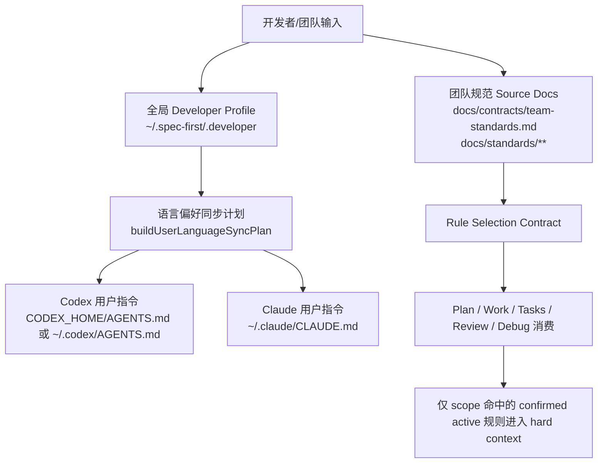
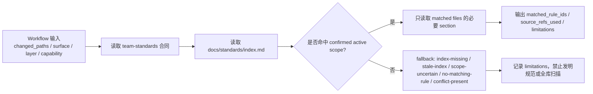
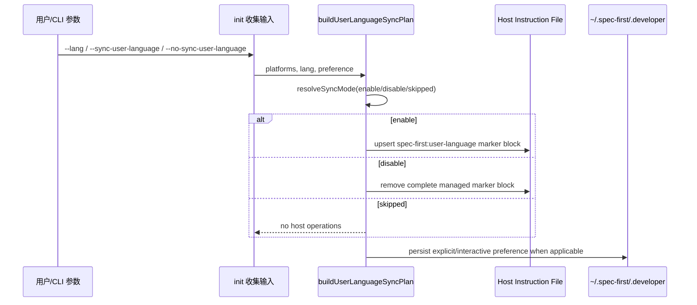

本页解释 spec-first 如何把**团队规范**、**项目标准**与**语言偏好**从“口头约定”提升为可审查、可同步、可降级的工程输入；范围限定在 `docs/contracts/team-standards.md`、`docs/standards/**`、`~/.spec-first/.developer`、宿主级用户语言指令以及初始化时的同步计划，不展开 runtime 生成、宿主适配器或多会话协作细节。Sources: [team-standards.md](docs/contracts/team-standards.md#L1-L18), [user-language-sync.js](src/cli/user-language-sync.js#L26-L58), [developer.js](src/cli/developer.js#L6-L13)

## 架构假设与验证结论

架构假设是：spec-first 将“团队规则”和“个人语言偏好”分成两条不同但互补的治理链路——团队规则以仓库内 source 文档为权威入口，只有 `trust=confirmed,lifecycle_state=active` 且 scope 命中的规则才能进入硬上下文；语言偏好则通过初始化阶段读取或写入全局 developer profile，并可选择同步到 Claude 与 Codex 的用户级 instruction 文件。代码与合同验证了这一分层：team standards 的 source surface 是 `docs/standards/**`，语言同步计划的 schema、mode、operations 与 profileOperation 在 `buildUserLanguageSyncPlan` 中集中生成。Sources: [team-standards.md](docs/contracts/team-standards.md#L5-L11), [team-standards.md](docs/contracts/team-standards.md#L19-L38), [user-language-sync.js](src/cli/user-language-sync.js#L26-L58)



这张图中的关键边界是：team standards 不直接等同于系统/开发者指令，而是作为 data payload 被下游 workflow 按 rule ID、source refs 与 scope 隔离消费；语言同步写入的是用户级宿主 instruction 的受管 marker block，用来约束面向用户的新生成自然语言内容。Sources: [team-standards.md](docs/contracts/team-standards.md#L181-L203), [lang-policy.js](src/cli/lang-policy.js#L109-L163), [user-language-sync.js](src/cli/user-language-sync.js#L152-L173)

## Source Authority：团队规范的权威层级

团队规范的权威链路从高到低包括：结构化项目角色契约、根级 `AGENTS.md` / `CLAUDE.md`、`docs/contracts/team-standards.md`、`docs/standards/**`、目录级 instruction、能力 spec、solutions/历史文档以及 candidates；其中 `docs/standards/**` 承载经确认的长期团队规范，而 `docs/standards/candidates/**` 永远只是 proposal/evidence 区，不能作为 hard context。Sources: [team-standards.md](docs/contracts/team-standards.md#L19-L38)

| 层级 | 入口 | 在本页中的角色 | 消费纪律 |
| --- | --- | --- | --- |
| 合同 | `docs/contracts/team-standards.md` | 定义 trust、lifecycle、promotion、selection 与 consumer boundary | 解释规则，不承载大量具体规则 |
| 索引 | `docs/standards/index.md` | 提供 registry、summary-first 加载地图与 rule index | 先读索引，再精确读取命中的 rule file |
| 正式规则 | `docs/standards/*.md` | 存放 confirmed active rule card | 只有 scope 命中才可成为 hard project context |
| 候选规则 | `docs/standards/candidates/**` | 存放候选、证据、冲突与 promotion proposal | proposal-only，不可直接 enforce |

Sources: [team-standards.md](docs/contracts/team-standards.md#L21-L30), [standards index](docs/standards/index.md#L1-L4), [standards index](docs/standards/index.md#L59-L68)

## Rule Card：项目标准的最小可审查单元

每条正式团队标准以小粒度 rule card 表达，包含 `id`、`trust`、`lifecycle_state`、`promotion_state`、`priority`、`category`、`applies_to`、`layer`、`capability`、`owner`、`source_refs`、`enforcement`、`effective_from`、`migration_impact` 与 `last_reviewed` 等字段；合同明确这些字段的枚举来源与格式边界，并要求 `source_refs` 使用仓库相对路径，禁止本机绝对路径。Sources: [team-standards.md](docs/contracts/team-standards.md#L51-L75), [team-standards.md](docs/contracts/team-standards.md#L106-L115)

`docs/standards/shared.md` 展示了两个已确认规则：`SHARED-SOURCE-001` 要求 source truth 先于 runtime mirrors，禁止把 `.claude/`、`.codex/`、`.agents/skills/` 当作 source 修复点；`SHARED-CHANGELOG-001` 要求任何项目 source 变更都留下紧凑的 `CHANGELOG.md` breadcrumb，并记录用户可见影响与验证或未运行状态。Sources: [shared.md](docs/standards/shared.md#L5-L35), [shared.md](docs/standards/shared.md#L37-L68)

`docs/standards/architecture.md` 进一步确认 runtime assets 是 delivery outputs：架构变更必须落在 `skills/`、`agents/`、`templates/`、`src/cli/`、`docs/contracts/**`、`AGENTS.md`、`CLAUDE.md` 或其他 checked-in source 路径，而不是直接修 runtime/control-plane 输出。Sources: [architecture.md](docs/standards/architecture.md#L1-L35)

## Summary-first 选择模型

标准消费采用 summary-first 模型：先读合同确认 authority semantics，再读 `docs/standards/index.md` 形成 query tags，只打开命中 rule ID 对应的 `File`，并且只把 `trust=confirmed,lifecycle_state=active` 且 scope 命中的规则当作 hard project context；如果索引缺失、过期或 scope 不确定，消费者必须使用 fallback，而不能扫描整个 `docs/standards/**` 作为替代索引。Sources: [team-standards.md](docs/contracts/team-standards.md#L151-L200), [standards index](docs/standards/index.md#L59-L68)



下游 workflow 的边界也被合同固定：`spec-plan` 只把 standards 用作实现约束、risk 与 decision note；`spec-write-tasks` 只能在 source plan 一致且 scope 命中时把 standards 放入 task constraints；`spec-work` 约束 changed files；`spec-code-review` 必须同时引用具体 rule 与 diff/source violation；`spec-doc-review` 只消费适用的 architecture/design 类 standards；`spec-debug` 可用 standards 解释 expected invariants，但 root cause 必须来自 reproduction/source/test/log。Sources: [team-standards.md](docs/contracts/team-standards.md#L204-L212)

## Standards Governance Skill：不是新的 public workflow

`spec-team-standards-governance` 是一个 standalone skill，用于查询、初始化、审计、提议、promotion/deprecation 准备与 replay/eval 团队标准；它不是 public `spec-*` workflow，也不是已退役的 `spec-standards` workflow，并且明确禁止恢复 legacy command spelling、`skills/spec-standards/` 或 `.spec-first/standards/`。Sources: [SKILL.md](skills/spec-team-standards-governance/SKILL.md#L1-L15), [SKILL.md](skills/spec-team-standards-governance/SKILL.md#L86-L91)

| Mode | 用途 | 输出 | Source mutation 边界 |
| --- | --- | --- | --- |
| `query` | 查询当前 workflow slice 相关标准 | filtered rule IDs、matched files、excluded reasons、fallback、limitations | read-only |
| `init` | 从显式来源初始化 brownfield candidate notes | acquisition notes、candidate patch preview、conflicts | proposal-only |
| `propose` | 从重复问题、事故或 source refs 起草候选 | suggested/observed candidate cards、decision trace | proposal-only |
| `promote` | 准备 confirmed-draft 或 confirmed patch proposal | authority tier、gates、owner status、index patch preview | 实际写入必须经 source-edit workflow |
| `audit` | 检查 standards 健康度 | drift/conflict/stale-owner/no-load-all report | advisory，不阻断 |

Sources: [SKILL.md](skills/spec-team-standards-governance/SKILL.md#L26-L37), [SKILL.md](skills/spec-team-standards-governance/SKILL.md#L53-L61)

该 skill 的硬边界是：脚本或结构化步骤只能收集 deterministic/advisory facts，LLM 负责语义适用性与 promotion posture；只有 `trust=confirmed,lifecycle_state=active` 且 scope 命中的 standards 可进入 hard context；confidence score、replay 结果、`confirmed-draft` 或高置信候选都不能自动变成可 enforce 的项目标准。Sources: [SKILL.md](skills/spec-team-standards-governance/SKILL.md#L17-L25), [team-standards.md](docs/contracts/team-standards.md#L135-L150)

## Candidate 与 Promotion：把“观察”留在建议层

候选区 `docs/standards/candidates/**` 的 V1 candidate card 至少需要 `candidate_id`、`candidate_type`、`authority_tier`、`source_refs`、`privacy_review`、`redaction_status`、`promotion_state`、`owner`、`why_not_confirmed` 与 `prewrite_gate`；写入 candidates、derived artifacts、eval output 或 validation report 前必须完成 secret、PII、本机绝对路径与 prompt-injection 的 deterministic pre-write gate。Sources: [team-standards.md](docs/contracts/team-standards.md#L213-L227)

Promotion 的语义边界是：代码结构、graph/code observation、重复 review 或 provider 输出可以生成 `observed` / `suggested` candidate 或 promotion proposal，但不能自动合入 confirmed；真正写入 `trust=confirmed,lifecycle_state=active` 必须发生在 active `spec-work` 或等价 source-edit workflow 中，并经过普通 diff review。Sources: [team-standards.md](docs/contracts/team-standards.md#L135-L150)

## 语言偏好：从初始化输入到用户级宿主指令

语言偏好由初始化命令解析与 developer profile 共同决定：`spec-first init` 支持 `--lang <zh|en>`，并支持 `--sync-user-language` 与 `--no-sync-user-language`；解析阶段禁止同时传入同步与不同步两个选项，并限制 `--lang` 只能是 `zh` 或 `en`。Sources: [init.js](src/cli/commands/init.js#L276-L389)

初始化收集输入时，如果存在全局 profile 且没有显式覆盖，交互路径会默认复用全局姓名与语言；如果显式选择不复用，才重新询问语言与姓名。同步用户语言的偏好解析遵循优先级：显式 flag 优先，其次复用已存 `syncUserLanguage`，非交互 `-y` 且未设置时保持 unset，交互模式下才询问 consent。Sources: [init.js](src/cli/commands/init.js#L405-L492), [init.js](src/cli/commands/init.js#L526-L557)

全局 developer profile 位于 `~/.spec-first/.developer`，格式化输出包含 `name`、`lang`、`initialized_at`、`version`，可选包含 `hosts` 与 `sync_user_language=true|false`；读取 identity 时，姓名来自显式参数、全局 profile 或 git user.name，语言来自显式参数、全局 profile 或默认 `zh`。Sources: [developer.js](src/cli/developer.js#L10-L21), [developer.js](src/cli/developer.js#L51-L86), [developer.js](src/cli/developer.js#L134-L158)

## 用户语言同步计划

`buildUserLanguageSyncPlan` 根据 preference 解析出 `enable`、`disable` 或 `skipped`：启用时只对选中的 supported hosts 生成操作，禁用时会对 `codex` 与 `claude` 两个支持宿主生成清理操作，未设置时不生成 host operations；如果 preference 来源是 explicit 或 interactive，还会生成 profileOperation 用来持久化 `sync_user_language`。Sources: [user-language-sync.js](src/cli/user-language-sync.js#L29-L59), [user-language-sync.js](src/cli/user-language-sync.js#L429-L458)



同步目标当前只覆盖 Codex 与 Claude：Codex 写入 `$CODEX_HOME/AGENTS.md` 或 `~/.codex/AGENTS.md`，Claude 写入 `~/.claude/CLAUDE.md`；Codex 若存在非空 `AGENTS.override.md`，启用同步会返回 `codex-global-override-active` 并要求人工处理。Sources: [user-language-sync.js](src/cli/user-language-sync.js#L26-L28), [user-language-sync.js](src/cli/user-language-sync.js#L131-L143), [user-language-sync.js](src/cli/user-language-sync.js#L392-L419)

语言 block 的内容来自 `lang-policy.js`：中文策略要求所有面向用户的新生成自然语言内容使用简体中文，覆盖回答、状态更新、澄清问题、总结、评审、生成文档、需求、计划、任务、变更说明、commit message 与 PR 文案；代码标识符、命令、路径、配置键、环境变量、API 名称、协议名、日志、工具输出和引用材料可以保留原文，但新增解释仍必须使用目标语言。Sources: [lang-policy.js](src/cli/lang-policy.js#L140-L163), [lang-policy.js](src/cli/lang-policy.js#L166-L178)

## 幂等写入与失败保护

语言同步采用 marker block 写入：启用时使用 `upsertMarkerBlock` 插入或替换完整 `<!-- spec-first:user-language:start -->` 到 `<!-- spec-first:user-language:end -->` 区块；禁用时只移除完整受管区块，文件不存在时返回 `missing/no-op`，不会创建新的 host 目录或用户 instruction 文件。Sources: [lang-policy.js](src/cli/lang-policy.js#L51-L75), [user-language-sync.js](src/cli/user-language-sync.js#L152-L204), [user-language-sync.js](src/cli/user-language-sync.js#L321-L343)

实现包含多项安全保护：如果项目 instruction 路径与用户级 target 是同一物理路径，会返回 `same-physical-path-collision`，避免双写同一文件；如果目标存在但不是普通文件，会返回 `user-language-target-unreadable`；如果启用同步的 host 操作失败，除 opt-out 情况外 profile 写入会被跳过，避免把未成功落地的启用偏好持久化。Sources: [user-language-sync.js](src/cli/user-language-sync.js#L104-L143), [user-language-sync.js](src/cli/user-language-sync.js#L207-L245), [user-language-sync.js](src/cli/user-language-sync.js#L61-L101)

测试覆盖了这些失败模式：Codex override 会阻止写入并不持久化 preference；Claude 与 Codex 的 same-physical-path collision 会失败且不创建 instruction 文件；非普通文件 target 会结构化失败；显式 disable 即使清理残留失败也会持久化 `sync_user_language=false`，以便后续 init 继续重试清理。Sources: [user-language-sync.test.js](tests/unit/user-language-sync.test.js#L77-L102), [user-language-sync.test.js](tests/unit/user-language-sync.test.js#L189-L240), [user-language-sync.test.js](tests/unit/user-language-sync.test.js#L242-L292)

## 初始化应用顺序中的位置

初始化执行时，spec-first 先构建各宿主 init plans，再单独构建 user-language sync plan；非 dry-run 会先应用 runtime/source 初始化计划，再调用 `applyUserLanguageSyncPlan`，随后把同步结果写入 workspace summary 并纳入最终 exit code。Sources: [init.js](src/cli/commands/init.js#L200-L266)

project init plan 本身会解析 developer identity、生成 runtime asset sync plan、处理 legacy/runtime drift、构建写入计划与 global developer write action；实际 apply 时先应用 operation plans，再写入全局 developer profile。语言同步在外层执行，因此它不会混入某个单独宿主的 runtime asset 写入计划。Sources: [init.js](src/cli/commands/init.js#L1020-L1256), [init.js](src/cli/commands/init.js#L1259-L1304)

## 本页相关项目结构

下面的结构图只列出与团队规范、项目标准和语言偏好同步直接相关的 source surface：合同与 standards 是团队规则的 source truth，skill 是治理操作入口，CLI 模块负责 developer profile、语言策略和同步计划，tests 固化边界行为。Sources: [team-standards.md](docs/contracts/team-standards.md#L1-L18), [standards index](docs/standards/index.md#L69-L82), [user-language-sync.test.js](tests/unit/user-language-sync.test.js#L1-L16)

```text
spec-first
├── docs
│   ├── contracts
│   │   └── team-standards.md
│   └── standards
│       ├── index.md
│       ├── shared.md
│       ├── architecture.md
│       ├── review.md
│       ├── security.md
│       └── candidates/
├── skills
│   └── spec-team-standards-governance/
│       ├── SKILL.md
│       ├── references/
│       └── evals/
├── src
│   └── cli
│       ├── commands/init.js
│       ├── developer.js
│       ├── lang-policy.js
│       ├── user-language-sync.js
│       └── coding-guidelines.js
└── tests
    └── unit
        ├── team-standards-governance-contracts.test.js
        └── user-language-sync.test.js
```

## 常见操作与边界速查

| 目标 | 正确入口 | 可做 | 不可做 |
| --- | --- | --- | --- |
| 查询当前任务相关团队标准 | `spec-team-standards-governance` 的 `query` 模式 | 返回 matched rule IDs、matched files、fallback、limitations | 全量扫描 standards 树或引用 generic best practice |
| 新增候选标准 | `propose` / `init` 模式 | 生成 candidate card、source refs、decision trace | 把 observed/suggested 候选当 hard context |
| 推进正式标准 | `promote` 模式 + source-edit workflow | 准备 confirmed patch proposal，经 owner/diff review 后写入 | 用 confidence score 或 replay 自动合入 |
| 同步用户语言偏好 | `spec-first init --sync-user-language` | 写入用户级 Claude/Codex marker block，并持久化 preference | 在 Codex override 存在时静默覆盖 |
| 停止同步用户语言偏好 | `spec-first init --no-sync-user-language` | 移除受管 marker block，并持久化 false | 删除非受管用户内容 |

Sources: [SKILL.md](skills/spec-team-standards-governance/SKILL.md#L26-L37), [team-standards.md](docs/contracts/team-standards.md#L191-L200), [user-language-sync.js](src/cli/user-language-sync.js#L61-L101), [user-language-sync.js](src/cli/user-language-sync.js#L131-L149)

## 与相邻页面的阅读关系

如果你想理解这些规则如何被 runtime 注入或生成，应继续阅读 [Generated Runtime 与 Source of Truth 的治理模型](14-generated-runtime-yu-source-of-truth-de-zhi-li-mo-xing)；如果你关心 standards 如何进入具体研发链路，可阅读 [核心研发链路：brainstorm、prd、plan、write-tasks、work、review、compound](20-he-xin-yan-fa-lian-lu-brainstorm-prd-plan-write-tasks-work-review-compound)；如果你需要了解多会话下这些偏好与规范如何避免互相覆盖，请阅读下一页 [多会话与多 Actor 协作安全](29-duo-hui-hua-yu-duo-actor-xie-zuo-an-quan)。Sources: [team-standards.md](docs/contracts/team-standards.md#L204-L212), [init.js](src/cli/commands/init.js#L200-L266)