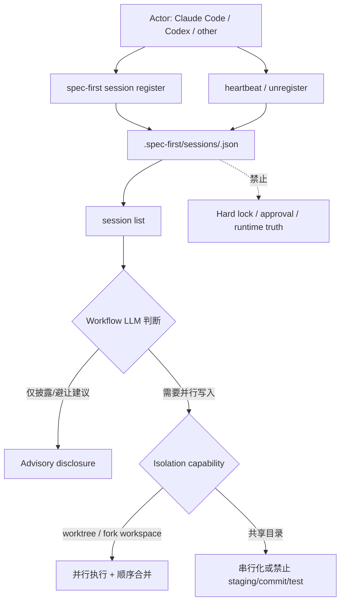
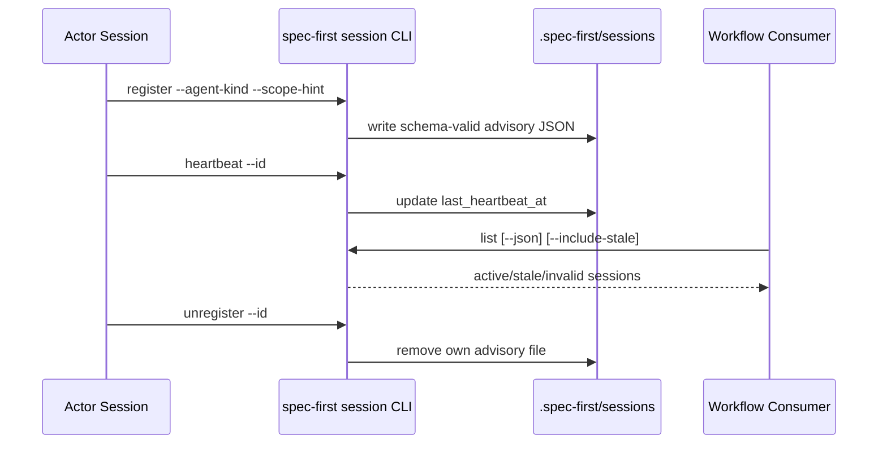

当多个 AI 会话、子 Agent、宿主工具或人工开发者同时触碰同一个仓库时，真正的风险不是“谁先启动”，而是**共享工作目录、Git index、测试环境与本地 runtime 状态是否被误当成单一线性执行上下文**；spec-first 对这个问题采用两层治理：第一层用 `spec-first-session.v1` 暴露“谁在场”的 advisory 事实，第二层用 worktree / fork workspace / 串行化策略隔离实际写入面。Sources: [spec-first-session.md](docs/contracts/sessions/spec-first-session.md#L5-L11), [SKILL.md](skills/spec-work/SKILL.md#L334-L360)

本页只解释“多会话与多 Actor 协作安全”：session advisory 文件、stale 判定、共享目录并发约束、worktree 隔离、历史会话检索边界，以及这些机制如何避免把临时状态升级为硬锁或契约真相；CLI 体系、初始化流水线、Skill 发布流程和质量门禁分别属于 [CLI 命令体系：doctor、init、update、clean、tasks 与 session](15-cli-ming-ling-ti-xi-doctor-init-update-clean-tasks-yu-session)、[初始化流水线：资产发现、操作计划、原子写入与状态记录](16-chu-shi-hua-liu-shui-xian-zi-chan-fa-xian-cao-zuo-ji-hua-yuan-zi-xie-ru-yu-zhuang-tai-ji-lu)、[新增或修改 Skill 的开发、审计与发布流程](30-xin-zeng-huo-xiu-gai-skill-de-kai-fa-shen-ji-yu-fa-bu-liu-cheng) 与 [契约文档与 Schema 校验体系](23-qi-yue-wen-dang-yu-schema-xiao-yan-ti-xi)。Sources: [spec-first-session.md](docs/contracts/sessions/spec-first-session.md#L56-L72), [scenario-capability-matrix.md](docs/contracts/workflows/scenario-capability-matrix.md#L5-L10)

## 架构假设与验证结论

架构假设是：spec-first 没有把多会话协作做成中心调度器，而是把“当前有其他 session 存在”建模为**可观测、可列举、可丢弃的本地 advisory 状态**；源码验证支持这一点，因为合同明确说 session schema 用于让多个 agent session 在共享 worktree 时互相感知，但“不强制 lock、不阻塞、不做中心化协调”，并且 `.spec-first/sessions/` 不存在或为空时现有 skill 行为完全不变。Sources: [spec-first-session.md](docs/contracts/sessions/spec-first-session.md#L5-L11)

第二个假设是：真正防止并发破坏的机制不依赖 session 文件本身，而依赖执行策略选择；源码验证显示，`spec-work` 在选择并行子 Agent 前必须建立 file-to-unit mapping、检查候选单元文件交集，并在缺少可靠隔离时把重叠单元降级为串行执行，同时明确指出共享 orchestrator 工作目录会产生 Git index contention 与测试干扰。Sources: [SKILL.md](skills/spec-work/SKILL.md#L324-L360)

第三个假设是：session 记录只描述“在场状态”，不承载 durable knowledge、审批状态或 source of truth；合同和实现都验证了这一点：consumer 协议禁止把 session 文件作为硬锁、禁止把 `session_id` 注入 setup/runtime artifact 字段、禁止在 generated runtime 中把它当 contract truth，而 `list` 也只输出 active/stale/invalid 计数和记录列表。Sources: [spec-first-session.md](docs/contracts/sessions/spec-first-session.md#L56-L72), [session.js](src/cli/commands/session.js#L244-L285)

## 核心关系图：事实、判断与隔离

下面的图描述多会话安全的分层关系：CLI helper 负责写入和读取可验证 JSON，workflow 负责解释这些事实，执行层通过 worktree、fork workspace 或串行策略控制写入冲突；这不是锁服务，也不是中心化调度器。Sources: [session-store.js](src/cli/helpers/session-store.js#L116-L167), [spec-first-session.md](docs/contracts/sessions/spec-first-session.md#L82-L90)

该图中的虚线“禁止”来自合同边界：session 文件不能作为硬锁阻止其他 session，不能把 `session_id` 注入 setup/runtime artifact，也不能在 generated runtime 中读取为 contract truth；这保证协作提示不会演化成隐式审批系统。Sources: [spec-first-session.md](docs/contracts/sessions/spec-first-session.md#L66-L72)

## Session advisory 合同

`spec-first-session.v1` 的最小记录写在 `<repo>/.spec-first/sessions/<session-id>.json`，每个 active session 一个独立文件；该目录属于 generated runtime state，并由 `.gitignore` 排除，因此不会进入 Git 历史，也不会成为团队共享契约。Sources: [spec-first-session.md](docs/contracts/sessions/spec-first-session.md#L13-L23), [gitignore-policy.js](src/cli/gitignore-policy.js#L40-L51)

| 字段 | 作用 | 安全含义 |
|---|---|---|
| `schema_version` | 固定为 `spec-first-session.v1` | 让消费者识别记录版本 |
| `session_id` | 仅允许 `[A-Za-z0-9._-]`，最长 128 | 避免路径注入和不可控文件名 |
| `agent_kind` | `claude-code` / `codex` / `other` | 只表达 Actor 类别，不表达权限 |
| `started_at` / `last_heartbeat_at` | ISO8601 UTC 时间 | 支撑 active/stale 判断 |
| `host_marker_path` | 可选 repo-relative readiness ledger 路径 | 不能是绝对路径或逃逸路径 |
| `scope_hint` | 可选工作主题，最长 512 | 拒绝绝对路径、父级逃逸、反斜杠和控制字符 |
| `pid` | 可选正整数 | 仅辅助 stale 判断 |

字段边界同时存在于文档合同、JSON Schema 和 helper 校验中：Schema 禁止额外字段，要求核心字段存在，限制 `session_id` pattern、`agent_kind` enum、时间格式、`host_marker_path` 与 `scope_hint` pattern，以及 `pid` 的整数范围；helper 还用 `SCOPE_HINT_FORBIDDEN_PATTERN` 拒绝绝对路径、Windows drive、parent traversal、反斜杠和控制字符。Sources: [spec-first-session.schema.json](src/cli/contracts/session/spec-first-session.schema.json#L1-L56), [session-store.js](src/cli/helpers/session-store.js#L10-L17), [session-store.js](src/cli/helpers/session-store.js#L61-L81)

## CLI 生命周期：register、heartbeat、list、unregister

session 子命令由 `spec-first session` 提供，入口包括 `register`、`heartbeat`、`unregister` 和 `list`；CLI help 明确说明所有 session record 位于 `.spec-first/sessions/<id>.json`，记录是 advisory 而不是 hard lock，超过 24 小时未 heartbeat 的记录视为 stale。Sources: [spec-first-session.md](docs/contracts/sessions/spec-first-session.md#L37-L49), [session.js](src/cli/commands/session.js#L288-L306)

`register` 会解析 `--id`、`--agent-kind`、`--scope-hint`、`--host-marker`、`--pid` 和 `--json`，先验证 session id 与 agent kind，再把当前 Git repo root 作为存储根，并调用 helper 写入记录；成功输出包含 `session_id`、repo-relative `path` 和完整 `record`。Sources: [session.js](src/cli/commands/session.js#L121-L177)

`heartbeat` 要求显式 `--id`，找不到 id 时返回 `session-id-required` 或 helper 层的失败结果；成功时只更新对应记录的 `last_heartbeat_at`，保留已有记录的其他字段。Sources: [session.js](src/cli/commands/session.js#L180-L209), [session-store.js](src/cli/helpers/session-store.js#L214-L240)

`unregister` 同样要求显式 `--id`，成功后删除该 session 文件；如果文件不存在，helper 返回 `session-not-found`，测试覆盖了首次删除成功、第二次删除返回 not-found 的行为。Sources: [session.js](src/cli/commands/session.js#L212-L241), [session-store.js](src/cli/helpers/session-store.js#L243-L257), [spec-first-session-contracts.test.js](tests/unit/spec-first-session-contracts.test.js#L231-L239)

`list` 默认隐藏 stale 记录，`--include-stale` 才展示 stale；JSON 输出使用 `spec-first-session-list.v1`，包含 `repo_root`、`session_dir`、`include_stale`、`active_count`、`stale_count`、`invalid_count` 与 `sessions`。Sources: [session.js](src/cli/commands/session.js#L244-L285)

## Stale 与 invalid：清理由语义层决定

stale 判定是纯时间事实：`last_heartbeat_at` 距系统当前时间超过 24 小时视为 stale，CLI 不自动删除 stale 文件；合同说明清理由 LLM advisory 提示用户进行，避免脚本越过语义边界。Sources: [spec-first-session.md](docs/contracts/sessions/spec-first-session.md#L51-L55)

实现层把 `STALE_MS` 固定为 `24 * 60 * 60 * 1000`，`isStale` 在时间不可解析时也返回 stale；测试验证了“刚好 24 小时不 stale、超过 24 小时 stale”的边界。Sources: [session-store.js](src/cli/helpers/session-store.js#L10-L17), [session-store.js](src/cli/helpers/session-store.js#L109-L114), [spec-first-session-contracts.test.js](tests/unit/spec-first-session-contracts.test.js#L287-L295)

invalid 记录不会导致 `list` 崩溃；helper 在 JSON 解析失败或 schema 校验失败时把该文件作为 invalid session 返回，并标注 reason 或 errors，测试覆盖了破损 JSON 和 shape-broken JSON 都会被列出为 invalid。Sources: [session-store.js](src/cli/helpers/session-store.js#L132-L159), [spec-first-session-contracts.test.js](tests/unit/spec-first-session-contracts.test.js#L297-L311)

## 路径与写入安全

session store 对路径逃逸有两层约束：首先目标路径必须位于 repo root 内，其次会检查真实路径与符号链接祖先，若 `.spec-first` 或相关祖先是 symlink 并可能逃逸 repo root，就返回 `session-path-escape`，而不是写入外部目录。Sources: [session-store.js](src/cli/helpers/session-store.js#L259-L289)

测试验证了 symlink escape 场景：当 `.spec-first` 被符号链接到 repo 外部时，`register` 返回 `session-path-escape`，外部目录不会创建 `sessions`，而 `list`、`heartbeat`、`unregister` 也都会暴露同类路径逃逸失败。Sources: [spec-first-session-contracts.test.js](tests/unit/spec-first-session-contracts.test.js#L182-L208)

写入采用共享 `writeFileAtomic` helper：先在目标目录下创建带进程号、时间戳和随机后缀的临时文件，再写入临时文件并 rename 到目标路径；失败时删除临时文件，Windows 上对 `EPERM`、`EACCES`、`EBUSY` 的 rename contention 做有限重试。Sources: [atomic-write.js](src/cli/atomic-write.js#L13-L18), [atomic-write.js](src/cli/atomic-write.js#L27-L57)

## 多 Actor 执行策略：隔离优先，串行兜底

多 Actor 安全的执行面由 `spec-work` 控制：在创建 task list 后，workflow 会根据计划大小和依赖结构选择 Inline、Serial subagents 或 Parallel subagents；并行只适用于通过 Parallel Safety Check 的独立单元。Sources: [SKILL.md](skills/spec-work/SKILL.md#L324-L333)

Parallel Safety Check 的第一步是根据每个候选单元的 `Files:` 建立 file-to-unit mapping，第二步检查文件路径交集，第三步根据宿主能力矩阵决定是否允许 overlap；如果可靠隔离不可用，重叠单元必须降级为 serial subagents，并记录原因。Sources: [SKILL.md](skills/spec-work/SKILL.md#L334-L339)

共享目录并发的根本问题被明确写入 skill：即使没有文件 overlap，并行子 Agent 共享 orchestrator 工作目录也会遇到 Git index contention 和 test interference；可靠隔离消除这两类问题，共享目录兜底则限制子 Agent 不得 staging、commit 或运行项目级测试。Sources: [SKILL.md](skills/spec-work/SKILL.md#L340-L360)

| Host path | 隔离模型 | overlap 规则 | commit/test 所有权 |
|---|---|---|---|
| Claude Code Agent with worktree isolation | 每个 subagent 在 `.claude/worktrees/agent-<id>` 独立 worktree 和分支 | 只允许作为预测 merge conflict 处理，并在 dispatch 前记录 overlap | subagent 可在自身 worktree 分支中 stage、commit、运行单元测试 |
| Claude Code Agent without worktree isolation / shared-directory subagent | 写入 orchestrator 工作目录 | overlap 不安全，必须串行 | subagent 不得 stage、commit 或运行项目测试 |
| Codex `spawn_agent` / forked workspace | 使用 Codex fork workspace 语义 | 偏好 disjoint write sets；overlap 缺少可检查 merge handoff 时串行 | orchestrator 负责最终集成、staging、commit 和项目级验证 |
| No subagent support | 无并行执行面 | 不适用 | 当前 agent 负责全部工作 |

上述矩阵来自 `spec-work` 的 Host capability matrix；它不是抽象建议，而是 workflow 执行前必须用于决定并行、串行、隔离或降级的操作规则。Sources: [SKILL.md](skills/spec-work/SKILL.md#L342-L349)

## Worktree isolation helper 的边界

`git-worktree` 是内部 helper，不是用户直接调用的公共工作流；它用于需要隔离 git worktree 的 public workflows，例如 `spec-work`、`spec-code-review` 或其他委派方。Sources: [SKILL.md](skills/git-worktree/SKILL.md#L1-L6)

该 helper 先执行 `detect --json`，输出 `git-worktree-detect.v1`，包括 checkout 状态、reason_code、worktree root、main worktree root、git dir、common dir 和当前 branch；`state=linked-worktree` 表示当前 checkout 已经是隔离 worktree，不应再嵌套创建。Sources: [SKILL.md](skills/git-worktree/SKILL.md#L17-L44)

创建 worktree 时，helper 默认从 origin default branch 或本地 ref 建新分支，创建在 `.worktrees/<branch>`；它默认不复制 `.env*` 文件，只有显式 `--copy-env` 才复制，并且复制后 downstream staging 仍默认拒绝 env 文件，除非 task/implementation unit 明确声明 exact env path 属于预期副作用。Sources: [SKILL.md](skills/git-worktree/SKILL.md#L46-L75)

worktree helper 自身也有防误用边界：`create` 会先消费同一 detection function，遇到 `linked-worktree`、`unknown`、`not-git-repo`、`git-query-failed` 或 `output-contract-failed` 会拒绝创建，从而避免嵌套或不可见 worktree。Sources: [SKILL.md](skills/git-worktree/SKILL.md#L66-L69)

## 并行结果集成：先看 diff，再顺序合并

在 worktree-isolated mode 下，所有并行 subagent 完成后，orchestrator 必须按依赖顺序检查每个 worktree 相对 orchestrator 分支的 diff；如果 subagent 没有自己提交，orchestrator 要在该 worktree 内 stage 和 commit，再把各 subagent 分支按依赖顺序逐一 merge。Sources: [SKILL.md](skills/spec-work/SKILL.md#L371-L375)

如果 merge conflict 出现，规则不是“现场手工挑一边”，而是 `git merge --abort` 后把冲突单元 against now-merged tree 串行重派；每次 merge 后都要跑相关测试，失败则诊断修复后再 merge 下一支。Sources: [SKILL.md](skills/spec-work/SKILL.md#L371-L381)

共享目录或 fork-workspace handoff 的集成流程也必须先等待当前 batch 全部结束，再比较实际修改文件以发现 subagent 未预期的新碰撞；随后按依赖顺序 review diff、运行相关测试、只 stage 当前 unit 文件，并以 unit Goal 派生 conventional commit。Sources: [SKILL.md](skills/spec-work/SKILL.md#L383-L389)

## Scenario fingerprint 与 session advisory 的关系

workspace scenario fingerprint 是另一类 deterministic advisory facts，它描述 workspace shape、dirty 状态、多 repo 形态、freshness 和 limitations；合同明确说脚本准备事实，LLM workflow 决定 routing、fallback 与 risk posture，fingerprints 不是 gate、approval 或 external-tool internals。Sources: [developer-scenario-fingerprint.md](docs/contracts/developer-scenario-fingerprint.md#L5-L10), [developer-scenario-fingerprint.md](docs/contracts/developer-scenario-fingerprint.md#L11-L32)

Scenario Capability Matrix 把 fingerprint 事实翻译成 capability posture，但同样声明它只是 advisory，不是 hard gate、approval state、central workflow engine，也不能替代 source reads、tests、logs、reviewer judgment 或用户决策。Sources: [scenario-capability-matrix.md](docs/contracts/workflows/scenario-capability-matrix.md#L5-L10)

多 repo 或 dirty workspace 下，矩阵要求显式 target repo 或 per-child scope，dirty single repo 下要披露相关 dirty paths；这与 session advisory 的原则一致：脚本给出 bounded facts，workflow 不得因为某个事实命名了相邻 repo 或 build module 就扩展计划、review、debug 或 work 目标。Sources: [scenario-capability-matrix.md](docs/contracts/workflows/scenario-capability-matrix.md#L40-L49), [scenario-capability-matrix.md](docs/contracts/workflows/scenario-capability-matrix.md#L80-L87)

## 当前 session 与历史 session：不要混淆

`spec-sessions` 处理的是历史 Claude Code 和 Codex session 的检索与摘要，不用于当前 session、active implementation、广泛 transcript 归档、个人内容挖掘，或可以直接从当前 repo source 回答的问题。Sources: [SKILL.md](skills/spec-sessions/SKILL.md#L10-L19)

历史 session 搜索的输出是 distilled replay references、相关 prior decisions/attempts、evidence paths 和 explicit limitations；它不会创建 durable replay index、完整 transcript export 或 repo-local workflow state。Sources: [SKILL.md](skills/spec-sessions/SKILL.md#L20-L31)

为了避免把历史 transcript 变成污染源，`spec-sessions` 明确禁止完整读取 session 文件、禁止逐字复制 tool call 输入输出、禁止包含 thinking/reasoning block、禁止分析当前 session，并要求输出技术内容而不是个人内容。Sources: [SKILL.md](skills/spec-sessions/SKILL.md#L70-L80)

因此，`spec-first session` 与 `spec-sessions` 的职责不同：前者是当前 worktree 中 active actors 的轻量 presence advisory，后者是对历史会话的受限检索与技术摘要；二者都不能替代当前 source/test/log 证据。Sources: [spec-first-session.md](docs/contracts/sessions/spec-first-session.md#L56-L72), [SKILL.md](skills/spec-sessions/SKILL.md#L82-L92)

## 安全模式对比

| 模式 | 适用场景 | 主要保护 | 明确禁止 |
|---|---|---|---|
| Session advisory | 共享 worktree 中需要感知其他 active session | register/list/heartbeat/unregister 暴露 presence facts | 当 hard lock、approval、runtime truth |
| Worktree isolation | 多 feature、并行 development、并行 subagent | 独立工作目录、独立分支、顺序 merge | 默认复制 `.env*`、嵌套不可见 worktree |
| Shared-directory fallback | 无可靠隔离但仍需分解任务 | 串行化、禁止 subagent stage/commit/test | 并发 staging、并发 commit、并发项目级测试 |
| Scenario fingerprint | setup-time workspace 风险解释 | dirty/multi-repo/freshness facts | 单一风险分、中心 gate、自动扩 scope |
| Session history search | 查询过去尝试、决策、错误 | bounded snippets 与 distilled replay refs | 当前 session 分析、全文 transcript、原始 tool dump |

这张表的关键结论是：spec-first 把每类协作风险都压在最小事实面上，并把语义判断留给 workflow 或用户；任何把 advisory fact 升级为锁、审批、完成状态或 source of truth 的做法，都会越过已验证合同边界。Sources: [spec-first-session.md](docs/contracts/sessions/spec-first-session.md#L82-L90), [scenario-capability-matrix.md](docs/contracts/workflows/scenario-capability-matrix.md#L80-L87)

## 实操阅读路径

如果你要从用户视角理解如何在多个宿主里安全工作，下一步读 [多宿主使用指南：Claude Code、Codex、Cursor、Kiro 与 Qoder](8-duo-su-zhu-shi-yong-zhi-nan-claude-code-codex-cursor-kiro-yu-qoder)；如果你要理解 `session` 子命令如何归入 CLI 表面，读 [CLI 命令体系：doctor、init、update、clean、tasks 与 session](15-cli-ming-ling-ti-xi-doctor-init-update-clean-tasks-yu-session)。Sources: [session.js](src/cli/commands/session.js#L288-L306), [index.js](src/cli/index.js#L68-L172)

如果你要继续深入执行层，读 [核心研发链路：brainstorm、prd、plan、write-tasks、work、review、compound](20-he-xin-yan-fa-lian-lu-brainstorm-prd-plan-write-tasks-work-review-compound)，因为并行 subagent、worktree isolation、共享目录 fallback 和顺序 merge 都属于 `spec-work` 执行策略。Sources: [SKILL.md](skills/spec-work/SKILL.md#L324-L389)

如果你要理解这些 advisory facts 为什么不是 gates，继续读 [事实地板与语义判断：脚本、契约、证据和 LLM 的边界](13-shi-shi-di-ban-yu-yu-yi-pan-duan-jiao-ben-qi-yue-zheng-ju-he-llm-de-bian-jie) 与 [契约文档与 Schema 校验体系](23-qi-yue-wen-dang-yu-schema-xiao-yan-ti-xi)，它们解释脚本事实、Schema、LLM 判断和 source evidence 的边界分工。Sources: [scenario-capability-matrix.md](docs/contracts/workflows/scenario-capability-matrix.md#L5-L10), [developer-scenario-fingerprint.md](docs/contracts/developer-scenario-fingerprint.md#L5-L10)