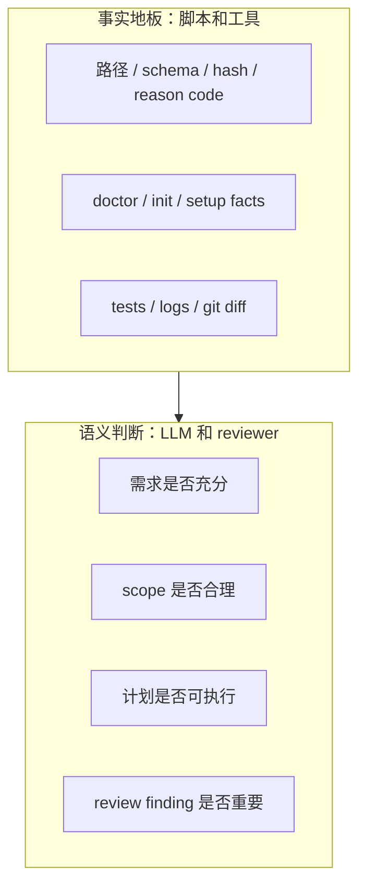
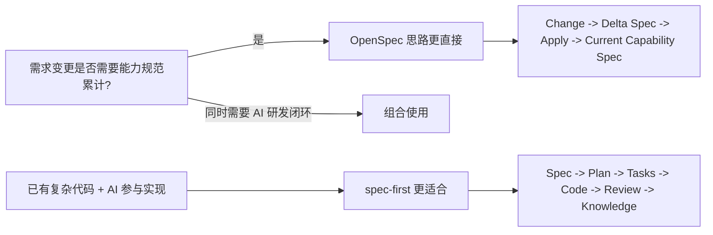

本文回答一个入门者最先会问的问题：**什么时候应该使用 spec-first，它到底给团队带来什么价值？**从第一性原理看，spec-first 不是另一个“更聪明的聊天 prompt”，而是面向 Claude Code、Codex、Kiro、Qoder 与 Cursor 的 AI Coding Harness：它把一次性的 AI coding 对话，转成仓库承载的 requirements、plans、scoped work、review 和 reusable learning 闭环。Sources: [README.zh-CN.md](README.zh-CN.md#L16-L18)

我的架构假设是：如果 AI 研发最容易丢失的是“为什么这样做”的判断，那么核心价值就不在 agent 数量，而在**可检查、可交接、可复用的工程轨迹**。仓库中的说明也验证了这一点：首次评估 spec-first 时，重点应看 workflow 是否留下可复用的东西；最小成功信号是安装和 init 后运行一个 workflow，并检查它写入仓库的 Markdown artifact，通常位于 `docs/brainstorms/` 或 `docs/plans/`。Sources: [README.zh-CN.md](README.zh-CN.md#L26-L34)

## 一句话定位

**spec-first 适合已经在真实项目中使用 AI 写代码、但希望把需求、计划、实现、审查和经验沉淀进仓库的团队或个人。**它把不稳定的 agent reasoning 放进一个有边界的工程循环：context、spec、plan、tasks、code、review 和 knowledge；Workflow Harness 则为 agent 提供上下文、证据边界、产物形状和交接契约。Sources: [CONCEPTS.md](CONCEPTS.md#L9-L19)


这张图表达的不是“必须按顺序执行每个命令”，而是 spec-first 的价值链路：让一次 AI 协作最终沉淀为仓库内可检查的文档、证据和经验。用户手册也说明，主链路可以从 `Ideate -> Brainstorm -> Plan -> Work -> Review -> Compound` 理解，但实际使用时应从当前状态最匹配的节点进入。Sources: [docs/05-用户手册/README.md](docs/05-用户手册/README.md#L57-L76)

## 适合使用的场景

如果你已经使用 Claude Code、Codex、Kiro、Qoder 或 Cursor，并且希望用项目内 workflow 替代一次性 prompt，spec-first 是合适的选择。它的目标不是替代这些宿主，而是在宿主之上增加一层项目内 harness，让 AI coding work 留下 durable requirements、plans、显式路由的 review summaries 和 learnings。Sources: [README.zh-CN.md](README.zh-CN.md#L217-L226)

| 你的情况 | 是否适合 spec-first | 原因 |
|---|---:|---|
| 已经在真实仓库中用 AI 辅助开发 | 适合 | spec-first 把 AI 工作写成仓库内 artifact，而不是只留在聊天窗口 |
| 需求经常从一句话开始，需要逐步澄清 | 适合 | `spec-brainstorm` / `spec-prd` 可产出 requirements brief |
| 实现前需要计划、拆任务、审查和验证 | 适合 | workflow 可沉淀 plans、tasks、review findings 和 work evidence |
| 团队希望复用解决过的问题 | 适合 | `spec-compound` 将已解决问题沉淀到 `docs/solutions/` |
| 只想要一次性 prompt 片段 | 不太适合 | README 明确说明这种情况可能不是最合适形态 |
| 不希望 workflow artifacts 写入 repo | 不太适合 | spec-first 的核心收益来自仓库内可检查轨迹 |

这些判断来自当前仓库机制：requirements 会变成持久 brief，plans 和 task packs 会把模糊意图变成可评审、可执行的上下文，work/review/debug/optimize/compound workflows 会沉淀证据与经验；同时，README 也明确说明，如果只需要单次 prompt 片段、通用 agent marketplace、独立应用，或团队不希望 artifacts 写入 repo，spec-first 可能不是最合适的形态。Sources: [README.zh-CN.md](README.zh-CN.md#L180-L191), [README.zh-CN.md](README.zh-CN.md#L217-L226)

## 核心价值一：让 AI 工作留下可检查产物

spec-first 的第一层价值是把“聊天里的结果”变成“仓库里的产物”。典型工作流会在 `docs/ideation/`、`docs/brainstorms/`、`docs/plans/`、`docs/tasks/`、`docs/solutions/` 等目录中留下长期协作文档；不是每个 workflow 都写入所有 artifact，第一次运行通常只需要确认 `docs/brainstorms/` 下出现一个文件即可。Sources: [README.zh-CN.md](README.zh-CN.md#L125-L141)

```text
docs/
  ideation/      候选方向、探索记录
  brainstorms/   需求成型 brief、研发侧 clarified requirements
  plans/         可评审、可执行的 implementation plans
  tasks/         从 plan 派生的 executable handoff
  solutions/     已解决问题沉淀出的可复用经验

.spec-first/
  config/        setup-owned machine facts
  workspace/     parent workspace advisory summaries
  workflows/     work closeout / verification / quality gate evidence
```

这个目录视图区分了两类东西：`docs/**` 更偏长期协作与知识沉淀，`.spec-first/**` 更偏 runtime/control-plane evidence。产物目录文档说明，`docs/brainstorms/*-requirements.md` 通常作为 plan 的上游输入，`docs/plans/*-plan.md` 通常作为 work 或 write-tasks 的上游输入，`docs/solutions/**/*` 通常用于保存已解决问题的可复用工程经验。Sources: [docs/05-用户手册/04-workflows-artifacts-map.md](docs/05-用户手册/04-workflows-artifacts-map.md#L25-L35)

## 核心价值二：把“快”变成“可治理”

AI 写代码很快，但真正昂贵的是保存代码背后的判断：为什么选这个 scope、检查过哪些证据、哪些 review finding 重要、下一位 agent 或同事应该继承什么上下文。如果没有仓库承载的轨迹，这些上下文会随聊天窗口一起消失；spec-first 的目标就是把 requirements、PRD、plans、task packs、review 和 learnings 留在仓库里。Sources: [README.zh-CN.md](README.zh-CN.md#L162-L167)

| 没有 spec-first 时常见问题 | spec-first 提供的治理方式 |
|---|---|
| 需求只存在于聊天上下文 | requirements brief 写入 `docs/brainstorms/` |
| 计划理由不可追溯 | plan 写入 `docs/plans/`，包含 scope、风险、验证范围和限制 |
| 实现交接依赖口头说明 | task pack 或 work evidence 形成结构化交接 |
| review 只看最终 diff | requirements、plans、task packs、diff、review findings 都可被审查 |
| 经验无法复用 | 已解决问题沉淀到 `docs/solutions/` |

README 中的对比也强调：Prompt pack 或 agent 编排通常产出更好的聊天答案或 agent transcript，而 spec-first 的第一次跑完应能得到仓库内 artifact；人要 review 的也不只是最终 diff，还包括 requirements、plans、task packs、diff、review findings、bugs 和 learnings。Sources: [README.zh-CN.md](README.zh-CN.md#L168-L179)

## 核心价值三：脚本守机械边界，LLM 做语义判断

spec-first 的信任模型不是“完全相信 LLM”，也不是“让脚本替代架构判断”。核心规则是：scripts enforce deterministic invariants; scripts prepare facts; LLM decides semantic adequacy above that floor。也就是说，脚本负责安装、验证、生成、报告机器事实，并在出口和副作用处守住可机械判定的不变量；LLM 负责需求框定、范围边界、取舍、实现判断和审查证据。Sources: [README.zh-CN.md](README.zh-CN.md#L207-L215)



这条边界对新手很重要：脚本可以准备事实、校验 schema、检查 readiness，但不应该决定产品优先级、架构取舍或语义审查结论；CONCEPTS 也明确说明，Deterministic Gate 是基于 schema fields、receipts、paths、hashes 或 reason codes 等可机械检查事实的边界，不能替代事实地板之上的 LLM 语义判断。Sources: [CONCEPTS.md](CONCEPTS.md#L35-L38), [CONCEPTS.md](CONCEPTS.md#L67-L70)

## 核心价值四：同一套源资产投射到多个宿主

spec-first 支持的不是单一编辑器或单一 agent，而是把 source assets 通过 `spec-first init` 重新生成为不同宿主的 runtime assets。README 说明，`skills/`、`agents/`、`templates/`、`src/cli/` 等 source assets 经 init 生成到 `.claude/`、`.codex/`、`.agents/skills/`、`.cursor/skills/`、`.kiro/`、`.qoder/` 等宿主运行时位置。Sources: [README.zh-CN.md](README.zh-CN.md#L193-L205)

| 层次 | 初学者可以这样理解 | 典型路径 |
|---|---|---|
| Source assets | spec-first 自己维护的源规则、skills、agents、模板和 CLI | `skills/`、`agents/`、`templates/`、`src/cli/` |
| Generated runtime | init 生成给不同宿主读取的副本 | `.claude/`、`.codex/`、`.cursor/`、`.kiro/`、`.qoder/` |
| Workflow artifacts | 你在项目中运行 workflow 后沉淀的产物 | `docs/brainstorms/`、`docs/plans/`、`docs/tasks/`、`docs/solutions/` |
| Control-plane evidence | setup、verification、quality gate 等可重建证据 | `.spec-first/config/`、`.spec-first/workflows/` |

这也解释了为什么不建议手改 generated runtime：CONCEPTS 明确把 Source Of Truth 定义为 checked-in source files，而 generated runtime mirrors 不是 source-of-truth；如果宿主运行时资产漂移、失败或缺失，应通过 source changes 加 `spec-first init` 修复。Sources: [CONCEPTS.md](CONCEPTS.md#L73-L80), [CONCEPTS.md](CONCEPTS.md#L105-L107)

## 三类典型研发模式

spec-first 的适用性也取决于你的仓库形态。用户手册将当前开发模式分成三类：单个 Git 工程单项目、单个 Git 工程多 module、父目录下多个独立 Git 工程；核心边界是 `.spec-first` 的权威事实属于 selected Git repo root。Sources: [docs/05-用户手册/README.md](docs/05-用户手册/README.md#L78-L87)

| 模式 | 适合程度 | 新手判断方式 | spec-first 边界 |
|---|---:|---|---|
| 单仓单项目 | 最自然 | 一个 repo 就是一个应用、SDK、CLI、前端或后端 | `.spec-first/*`、plan/work/review 都以当前 repo 为边界 |
| 单仓多 module | 适合 | 一个 Git root 下有多个 package、service 或 Android module | `.spec-first/` 仍只放 repo root，不给每个 module 单独放一套 |
| 多仓 workspace | 可用但要更明确 | 父目录下多个 child repo，每个都有自己的 `.git` | 每个 child repo 独立 setup / plan / work，父 workspace 只保存 advisory summaries |

三种模式的文档明确说明：单仓单项目是当前实现最自然、最稳定的模式；单仓多 module 仍然是一个 Git root，`.spec-first` 应该只放在 repo root；多仓 workspace 中父目录不是统一 Git repo，每个子目录都是独立 Git 工程。Sources: [docs/05-用户手册/08-三种开发模式.md](docs/05-用户手册/08-三种开发模式.md#L1-L10), [docs/05-用户手册/08-三种开发模式.md](docs/05-用户手册/08-三种开发模式.md#L13-L45), [docs/05-用户手册/08-三种开发模式.md](docs/05-用户手册/08-三种开发模式.md#L48-L97), [docs/05-用户手册/08-三种开发模式.md](docs/05-用户手册/08-三种开发模式.md#L100-L177)

## 不太适合的情况

如果你的目标只是收集 prompt 片段、安装一个通用 agent marketplace、使用一个不依赖宿主的独立应用，或者你的团队明确不希望 workflow artifacts 写入 repo，那么 spec-first 可能不是最合适的形态。这个边界很重要，因为 spec-first 的价值并不来自“聊天更花哨”，而来自仓库内可检查产物、运行证据和知识沉淀。Sources: [README.zh-CN.md](README.zh-CN.md#L217-L226)

另一个常见误解是把 advisory facts 当成 confirmed truth。研发场景文档明确说明，`.spec-first/workspace/*` 是 parent/workspace advisory facts，不能替代 child repo 内的 `.spec-first/config/*` 或当前源码；scenario fingerprint 也不是 gate、approval、状态机或风险评分。Sources: [docs/05-用户手册/20-研发场景与降级路径.md](docs/05-用户手册/20-研发场景与降级路径.md#L1-L11)

## 和 OpenSpec 的阶段取舍

如果你正在比较 OpenSpec 与 spec-first，可以用一个简单判断：OpenSpec 更适合从需求变更规范化切入，spec-first 更适合在存量工程中治理 AI 研发闭环。对已有复杂代码、AI 要参与研发、需要降低误改、漏审和上下文丢失的团队，文档明确建议 spec-first 更强。Sources: [docs/05-用户手册/21-OpenSpec与spec-first阶段适用性对比.md](docs/05-用户手册/21-OpenSpec与spec-first阶段适用性对比.md#L1-L17), [docs/05-用户手册/21-OpenSpec与spec-first阶段适用性对比.md](docs/05-用户手册/21-OpenSpec与spec-first阶段适用性对比.md#L36-L42)



两者不是必须二选一。文档中的推荐组合方式是：需求开始时维护 change-scoped spec，完成后把稳定结论沉淀到 capability current spec，再由 spec-first 治理 plan、task、work、review、debug、knowledge 和团队规范。Sources: [docs/05-用户手册/21-OpenSpec与spec-first阶段适用性对比.md](docs/05-用户手册/21-OpenSpec与spec-first阶段适用性对比.md#L18-L35), [docs/05-用户手册/21-OpenSpec与spec-first阶段适用性对比.md](docs/05-用户手册/21-OpenSpec与spec-first阶段适用性对比.md#L43-L53)

## 你可以用这个清单判断是否该开始

如果你能对下面三个问题回答“是”，就很适合继续试用 spec-first：第一，你是否希望 AI 研发结果留在仓库而不是聊天窗口；第二，你是否需要从需求到计划、实现、审查、知识沉淀的闭环；第三，你是否接受脚本守住机械边界、LLM 在事实地板之上做语义判断的工作方式。Sources: [README.zh-CN.md](README.zh-CN.md#L162-L179), [README.zh-CN.md](README.zh-CN.md#L207-L226)

| 判断问题 | 如果回答“是” | 下一步 |
|---|---|---|
| 我想先跑通最小闭环 | 从安装、init 和第一个 workflow 开始 | 阅读 [快速开始](2-kuai-su-kai-shi) |
| 我想知道安装会写什么、检查什么 | 先理解环境检查和宿主初始化 | 阅读 [安装、环境检查与宿主初始化](4-an-zhuang-huan-jing-jian-cha-yu-su-zhu-chu-shi-hua) |
| 我想看一次从需求到产物的完整过程 | 跟随首次 workflow 走查 | 阅读 [第一次工作流走查：从需求到仓库产物](5-di-ci-gong-zuo-liu-zou-cha-cong-xu-qiu-dao-cang-ku-chan-wu) |
| 我已经有任务，不知道走哪个入口 | 查 workflow 路由 | 阅读 [工作流入口速查与任务路由](6-gong-zuo-liu-ru-kou-su-cha-yu-ren-wu-lu-you) |
| 我想确认哪些文件该提交、哪些不该提交 | 看产物目录和边界 | 阅读 [产物目录与可检查工程轨迹](7-chan-wu-mu-lu-yu-ke-jian-cha-gong-cheng-gui-ji) |

这个阅读顺序与用户手册的建议一致：第一次使用时先看快速开始，再看首次工作流走查；如果要理解运行模型、工程闭环和 evidence 边界，再读核心概念；如果要判断单仓、多模块或多仓 workspace 怎么使用，再读三种开发模式。Sources: [docs/05-用户手册/README.md](docs/05-用户手册/README.md#L110-L145)