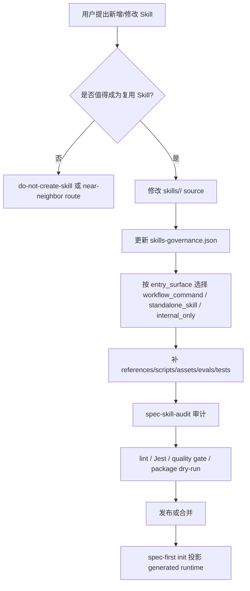

本页位于「知识沉淀与团队治理」章节的最后一页，聚焦 **新增或修改 Skill 时从意图判定、源码落点、治理登记、审计验证到发布检查** 的闭环；它不展开一般工作流使用方法，也不替代 [公开工作流命令与 Skill 治理模型](19-gong-kai-gong-zuo-liu-ming-ling-yu-skill-zhi-li-mo-xing)、[Prompt 精简、Triggered Reference 与 Front Controller 模式](22-prompt-jing-jian-triggered-reference-yu-front-controller-mo-shi) 或 [测试体系：单元测试、集成测试、Smoke Test 与发布检查](26-ce-shi-ti-xi-dan-yuan-ce-shi-ji-cheng-ce-shi-smoke-test-yu-fa-bu-jian-cha) 的专门说明。Sources: [skills/spec-write-skill/SKILL.md](skills/spec-write-skill/SKILL.md#L16-L38), [skills/spec-skill-audit/SKILL.md](skills/spec-skill-audit/SKILL.md#L19-L50)

## 架构假设：Skill 变更是 source-first 的受治理资产变更

新增或修改 Skill 的第一性原则是：**Skill 不是运行时目录里的 prompt 文件，而是由仓库 source、治理 JSON、测试和生成目录共同约束的可发布资产**。`skills/<name>/`、`src/cli/contracts/dual-host-governance/skills-governance.json` 和相关 docs/tests 是 source of truth；`.claude/`、`.codex/`、`.agents/skills/` 等 generated mirrors 只能由初始化或同步逻辑投影生成，不能作为修复入口。Sources: [skills/spec-write-skill/SKILL.md](skills/spec-write-skill/SKILL.md#L45-L51), [skills/spec-skill-audit/SKILL.md](skills/spec-skill-audit/SKILL.md#L138-L157)

这一假设由 CLI 的装载链路验证：`plugin.js` 从 `skills-governance.json` 构建 manifest，按 `entry_surface` 识别 workflow command，再读取 command template 或对应 `SKILL.md` 的 frontmatter；治理校验会拒绝未知 skill、重复 skill、非法 entry surface、非法 host delivery，以及 workflow skill 缺少匹配 command 的情况。Sources: [src/cli/plugin.js](src/cli/plugin.js#L113-L150), [src/cli/plugin.js](src/cli/plugin.js#L281-L387)



上图中的关键边界来自现有实现：filtered asset set 根据 `workflow_command`、`standalone_skill`、`internal_only` 和各宿主 `host_delivery` 决定哪些 command、workflow skill、standalone skill 或 internal skill 被投影；`syncSkills` 会删除并重建目标 runtime skill 目录，因此手改 generated mirror 会在下一次同步时被覆盖。Sources: [src/cli/plugin.js](src/cli/plugin.js#L586-L656), [src/cli/plugin.js](src/cli/plugin.js#L761-L797)

## 入口判定：先决定不写、再决定怎么写

`spec-write-skill` 要求先做资格判断：只有当任务会重复使用、近邻请求容易误触发、确定性脚本/eval/reference 能减少重复劳动，或双宿主、治理、可移植、source/runtime 边界很重要时，才继续进入 source authoring；一次性回答、解释总结、文档导出、普通代码 review/debug/plan/work 执行、第三方 skill 安装，都默认不应创建新 skill。Sources: [skills/spec-write-skill/references/authoring-method.md](skills/spec-write-skill/references/authoring-method.md#L16-L38)

当意图模糊时，只问会改变 package 设计的 2-3 个问题，目标是收敛一句 recurring job、真实输入、必要输出、排除边界、至少一个 should-trigger 示例、至少一个 near-neighbor 或 should-not-trigger 示例、建议 mode、quality tier 和 first eval target；如果重复任务、目标输出或排除边界仍不清晰，不应靠增加 references/scripts 弥补。Sources: [skills/spec-write-skill/references/authoring-method.md](skills/spec-write-skill/references/authoring-method.md#L39-L64)

| 判定结果 | 何时使用 | 输出姿态 |
|---|---|---|
| `do-not-create-skill` | 一次性、解释型、导出型、未来构思型请求 | 说明为什么不写 skill，并给出更小 durable surface 或直接回答 |
| `near-neighbor` | 已有 `spec-skill-audit`、`spec-doc-review`、`spec-work` 等入口更合适 | 指向现有入口，不新增 package |
| `authoring-brief` | 重复任务、输出和排除边界足够清晰 | 进入 source patch、治理和验证设计 |

这些结果不是文案偏好，而是 authoring method 明确要求的输出姿态；它把“不创建 Skill”视为正式闭环之一，避免把一次性 prompt 或普通文档整理误升级成长期维护资产。Sources: [skills/spec-write-skill/references/authoring-method.md](skills/spec-write-skill/references/authoring-method.md#L25-L38), [skills/spec-write-skill/references/authoring-method.md](skills/spec-write-skill/references/authoring-method.md#L132-L146)

## Source 目录与资源层级

真正的 Skill source 位于 `skills/<name>/`，普通改写应落到 `SKILL.md`、必要的 `references/`、`scripts/`、`assets/`、`evals/`，并按实际 recurring job 选择最小资源集合；不应创建 README、安装指南、历史说明、空资源目录或装饰性 reports 来“显得完整”。Sources: [skills/spec-write-skill/references/authoring-method.md](skills/spec-write-skill/references/authoring-method.md#L69-L79), [skills/spec-write-skill/references/delivery-gates.md](skills/spec-write-skill/references/delivery-gates.md#L16-L29)

`SKILL.md` 应承担触发面、核心执行骨架、输出合同、branch selection 和安全默认值；长规则、模式、示例、schema、tier/gate 细节应进入 `references/`；确定性、重复、容易手写错的逻辑进入 `scripts/`；会复制或改造到输出中的模板素材进入 `assets/`；路由、边界或输出质量需要回归证据时才进入 `evals/`。Sources: [skills/spec-write-skill/references/delivery-gates.md](skills/spec-write-skill/references/delivery-gates.md#L16-L29)

```text
skills/<skill-name>/
├── SKILL.md              # 触发、边界、核心流程、输出合同
├── references/           # 条件读取的长规则、rubric、schema、示例
├── scripts/              # 确定性事实收集或可重复验证逻辑
├── assets/               # 模板、素材、可复制结构
└── evals/                # trigger/boundary/output 结构化回归样例
```

新增非空目录必须被 `SKILL.md` 指向，或被测试/packaging contract 覆盖；这条规则防止资源漂移成第二套不可发现事实源，也防止入口 prompt 回涨为长篇手册。Sources: [skills/spec-write-skill/references/delivery-gates.md](skills/spec-write-skill/references/delivery-gates.md#L16-L29), [skills/spec-skill-audit/references/skill-authoring-quality.md](skills/spec-skill-audit/references/skill-authoring-quality.md#L16-L26)

## Entry surface：workflow、standalone 与 internal 的治理差异

每个 source skill 必须在 `skills-governance.json` 中声明 `entry_surface`、`command_name`、`host_scope`、`owner_host` 和各宿主 `host_delivery`；现有 schema vocabulary 限定 entry surface 只有 `workflow_command`、`standalone_skill`、`internal_only`，host delivery 只有 `command`、`skill`、`internal`、`none`。Sources: [src/cli/plugin.js](src/cli/plugin.js#L30-L35), [src/cli/plugin.js](src/cli/plugin.js#L281-L387)

| Entry surface | 语义 | 关键治理约束 | 示例 |
|---|---|---|---|
| `workflow_command` | 用户可见 workflow，经统一 `spec-*` 入口启动 | 必须有匹配 command，`command_name` 必须等于 manifest command | `spec-write-skill` → `write-skill` |
| `standalone_skill` | 宿主可发现 skill，但不是 command-backed workflow | `command_name=null`，不能以 `command` delivery 暴露 | `spec-team-standards-governance` |
| `internal_only` | source 治理记录或 agent-facing 内部能力 | 不能以 `command` 或 `skill` 用户可见 delivery 暴露 | `git-worktree` 等内部能力 |

这些差异由治理校验强制：workflow command 没有 manifest command 会报错；非 workflow skill 如果存在 command 也会报错；standalone skill 不能被 delivery 为 command；internal_only 不能对用户暴露为 command 或 skill。Sources: [src/cli/plugin.js](src/cli/plugin.js#L337-L375), [src/cli/contracts/dual-host-governance/skills-governance.json](src/cli/contracts/dual-host-governance/skills-governance.json#L412-L437)

## 命名、frontmatter 与触发描述

对于 spec-first source authoring，skill 名称应使用 kebab-case，并让目录名、frontmatter `name`、治理记录和 runtime catalog 保持一致；`SKILL.md` frontmatter 只放 `name` 和 `description`，触发条件必须写在 `description`，不能只把 “when to use” 藏在正文中。Sources: [skills/spec-write-skill/references/authoring-method.md](skills/spec-write-skill/references/authoring-method.md#L69-L79)

触发描述不是摘要，而是 trigger contract：修改 description 或 route 边界时，需要 trigger/boundary eval、near-neighbor case 和 `npm run lint:skill-entrypoints` 作为最小证据；这能防止 standalone skill 被写成 slash command，也能防止用户可见入口在不同宿主之间漂移。Sources: [skills/spec-write-skill/SKILL.md](skills/spec-write-skill/SKILL.md#L57-L69), [skills/spec-write-skill/references/delivery-gates.md](skills/spec-write-skill/references/delivery-gates.md#L30-L47)

## 修改流程：从 brief 到 source patch

推荐流程是：先输出 authoring brief，再确定 mode、quality tier、目标 repo、目标 skill 名称和 entry surface；随后读取相邻 skill、治理记录和项目契约，先列真实 branch，再写触发描述，并把共用步骤留在 `SKILL.md`、条件细节下沉到 `references/`。Sources: [skills/spec-write-skill/SKILL.md](skills/spec-write-skill/SKILL.md#L57-L69), [skills/spec-write-skill/references/authoring-method.md](skills/spec-write-skill/references/authoring-method.md#L106-L118)


对 prose 的改写必须做 sentence-level no-op pruning：逐句判断它是否改变触发、读取、写入、判断、验证或 handoff；没有改变行为的句子优先删除，而不是润色保留。Sources: [skills/spec-write-skill/SKILL.md](skills/spec-write-skill/SKILL.md#L63-L69), [skills/spec-write-skill/references/authoring-method.md](skills/spec-write-skill/references/authoring-method.md#L120-L130)

## 审计流程：spec-skill-audit 只读优先、证据优先

`spec-skill-audit` 的职责是把 Skill debt 作为工程债显性化：它审查 source `SKILL.md`、目录结构、触发清晰度、边界、I/O contract、workflow steps、completion criteria、资源组织、failure modes、eval readiness、安全、维护性和 runtime governance。Sources: [skills/spec-skill-audit/SKILL.md](skills/spec-skill-audit/SKILL.md#L57-L82)

审计默认先运行确定性事实收集脚本，再由 LLM 判断语义影响；常规命令是 `node skills/spec-skill-audit/scripts/write-audit-artifacts.js --repo .`，可按需要加 `--runtime`、`--patch-preview` 或 `--target skills/<skill-name>`。Sources: [skills/spec-skill-audit/SKILL.md](skills/spec-skill-audit/SKILL.md#L97-L130)

审计发现必须采用 `signal -> evidence -> counter-evidence -> decision` 的形状，引用具体 `SKILL.md` section、reference pointer、治理记录、runtime catalog fact 或 eval fixture，并说明影响的是 trigger precision、boundary ownership、completion criteria、information hierarchy、packaging 还是 source/runtime governance。Sources: [skills/spec-skill-audit/references/skill-authoring-quality.md](skills/spec-skill-audit/references/skill-authoring-quality.md#L34-L41)

审计是 review，不是自动改写器：它默认不得修改 `skills/`、`agents/`、`templates/`、`src/cli/contracts/` 或 generated runtime 目录；即使发现 runtime drift，也应指向重新运行 `spec-first init` 等 source-owned 修复路径，而不是手改生成副本。Sources: [skills/spec-skill-audit/SKILL.md](skills/spec-skill-audit/SKILL.md#L138-L157), [skills/spec-skill-audit/references/skill-authoring-quality.md](skills/spec-skill-audit/references/skill-authoring-quality.md#L1-L4)

## 质量层级与最小验证

`spec-write-skill` 使用 risk-based delivery gates：默认从 `scaffold` 起步，只有当复用、误触发、治理或分发风险真实存在时才升级到 `production`、`library` 或 `governed`；更高 rigor 应增加必要 references/evals/tests，而不是扩大 `SKILL.md` 初始加载。Sources: [skills/spec-write-skill/references/delivery-gates.md](skills/spec-write-skill/references/delivery-gates.md#L1-L15)

| Tier | 使用场景 | 默认交付物 | 最小验证 |
|---|---|---|---|
| `scaffold` | 探索性、个人、短期、低误触发风险 | `SKILL.md`，必要时 1 个 small reference | `npm run lint:skill-entrypoints`、`git diff --check`，目标 package 有 `quick_validate.py` 时加跑 |
| `production` | 团队复用、route confusion 真实存在、输出质量重要 | lean `SKILL.md`、必要 references、trigger/boundary eval | scaffold 验证 + 聚焦 Jest contract + `spec-skill-audit` target run |
| `library` | 共享基础能力或影响其他 skill 写作/治理 | trigger positive/negative/near-neighbor eval、packaging readiness、维护说明 | production 验证 + package smoke 或 runtime sync test |
| `governed` | 安全、合规、发布、事故、组织规范、高权限脚本 | owner、review cadence、rollback boundary、trust/security notes | library 验证 + owner/review evidence 或 proposal-only 限制 |

Gate selection 还要按改动类型收窄：description/route 改动需要 trigger/boundary evidence；branch/context pointer/information hierarchy 改动需要读取条件与 reviewer note；source/runtime 边界改动需要 contract test 或 runtime sync test；新增 standalone skill 需要治理 JSON、runtime catalog 和 public workflow summary test。Sources: [skills/spec-write-skill/references/delivery-gates.md](skills/spec-write-skill/references/delivery-gates.md#L30-L47)

## 自动化门禁：lint、contract tests 与 CI

`npm run lint:skill-entrypoints` 直接调用 `node scripts/lint-skill-entrypoints.js`；该脚本会扫描 `skills`、`CLAUDE.md` 和 `AGENTS.md`，并加载治理记录来构造 standalone skill 的 slash-command 禁用规则，防止 standalone skill 被描述成 command entrypoint。Sources: [package.json](package.json#L15-L35), [scripts/lint-skill-entrypoints.config.json](scripts/lint-skill-entrypoints.config.json#L1-L32), [scripts/lint-skill-entrypoints.js](scripts/lint-skill-entrypoints.js#L26-L71)

lint 规则会阻止以 `/` 开头的 heading、旧宿主入口写法、legacy free command，并对 standalone skill 的 `/spec:*` 或 `$spec-*` 正向入口描述报错；测试覆盖了 guardrail prose 可以出现 forbidden command，但正向 route 用户到 forbidden standalone command 会失败。Sources: [scripts/lint-skill-entrypoints.config.json](scripts/lint-skill-entrypoints.config.json#L14-L31), [tests/unit/lint-skill-entrypoints.test.js](tests/unit/lint-skill-entrypoints.test.js#L40-L104)

CI 中的 `Skill Entrypoint Gate` 会在 PR 修改 `skills/**`、相关 workflow contracts、source-runtime boundary、dual-host governance、lint 脚本、eval/skill contract tests 或 package 文件时运行 `npm run lint:skill-entrypoints` 和 `npm run test:eval-fixtures`。Sources: [.github/workflows/skill-entrypoint-gate.yml](.github/workflows/skill-entrypoint-gate.yml#L1-L50)

核心研发 workflow 的 Skill 变更还可能触发 `AI Dev Quality Gate`，该 gate 覆盖 `skills/spec-plan/**`、`skills/spec-write-tasks/**`、`skills/spec-work/**`、`skills/spec-code-review/**`、`skills/spec-doc-review/**`、`skills/spec-mcp-setup/**` 等路径，并运行 `npm run test:ai-dev:gate`。Sources: [.github/workflows/ai-dev-quality-gate.yml](.github/workflows/ai-dev-quality-gate.yml#L1-L69)

## Runtime catalog 与发布包边界

`docs/catalog/runtime-capabilities.md` 是由 `scripts/generate-runtime-capability-catalog.js` 从 `plugin.js`、`skills-governance.json`、workflow schemas 和当前 `skills/` / `agents/` source 派生出的只读 catalog；修改 runtime 能力时应先改 source/governance，再重新生成 catalog，而不是直接编辑 catalog 当 source。Sources: [docs/catalog/runtime-capabilities.md](docs/catalog/runtime-capabilities.md#L1-L16)

catalog 会公开展示 public workflows、standalone skills、internal skill governance 和不同宿主的 runtime paths；例如 `spec-write-skill` 与 `spec-skill-audit` 都是 public workflows，统一入口分别是 `spec-write-skill` 和 `spec-skill-audit`，而 generated runtime paths 覆盖 Claude、Codex、Cursor、Kiro、Qoder 的不同目录。Sources: [docs/catalog/runtime-capabilities.md](docs/catalog/runtime-capabilities.md#L46-L72), [docs/catalog/runtime-capabilities.md](docs/catalog/runtime-capabilities.md#L92-L119)

发布包通过 `package.json` 的 `files` 字段包含 `bin/`、`src/`、`agents/`、必要 docs/contracts、脚本、测试 fixtures、`skills/`、`templates/` 和 README；因此新增 Skill 若要随包分发，必须落在这些 source-owned 路径下，并通过 package dry-run 或 release tests 证明不会丢失必要资源。Sources: [package.json](package.json#L37-L83), [skills/spec-write-skill/references/delivery-gates.md](skills/spec-write-skill/references/delivery-gates.md#L48-L56)

## Closeout：合并前必须交代的事实

Skill authoring closeout 应说明 `mode`、`quality_tier`、`changed_surfaces`、实际运行的 deterministic checks、`eval_adequacy`、`boundary_result`、`not_checked_with_reason`、`residual_risks` 和必要下一步；不能把未运行的 validator、fresh-source eval、package smoke 或 runtime sync 写成已执行证据。Sources: [skills/spec-write-skill/references/delivery-gates.md](skills/spec-write-skill/references/delivery-gates.md#L91-L102)

对于新增或用户可见 Skill，closeout 还应明确 generated runtime mirror 状态：source patch 合并后，runtime mirror 通过 `spec-first init` 或同步流程重新投影；如果本次没有运行 runtime sync，应记录未验证原因，而不是把当前工作区旧 mirror 当作交付事实。Sources: [skills/spec-write-skill/SKILL.md](skills/spec-write-skill/SKILL.md#L67-L69), [src/cli/plugin.js](src/cli/plugin.js#L761-L858)

## 推荐阅读路径

如果你要理解 Skill 在公开命令体系中的位置，下一步阅读 [公开工作流命令与 Skill 治理模型](19-gong-kai-gong-zuo-liu-ming-ling-yu-skill-zhi-li-mo-xing)；如果你要优化 `SKILL.md` 的触发与 reference 下沉方式，阅读 [Prompt 精简、Triggered Reference 与 Front Controller 模式](22-prompt-jing-jian-triggered-reference-yu-front-controller-mo-shi)；如果你要设计验证矩阵与 CI 发布证据，阅读 [AI Dev Quality Gate 与 Eval Fixtures](25-ai-dev-quality-gate-yu-eval-fixtures) 和 [测试体系：单元测试、集成测试、Smoke Test 与发布检查](26-ce-shi-ti-xi-dan-yuan-ce-shi-ji-cheng-ce-shi-smoke-test-yu-fa-bu-jian-cha)。Sources: [docs/catalog/runtime-capabilities.md](docs/catalog/runtime-capabilities.md#L46-L72), [.github/workflows/skill-entrypoint-gate.yml](.github/workflows/skill-entrypoint-gate.yml#L1-L50), [.github/workflows/ai-dev-quality-gate.yml](.github/workflows/ai-dev-quality-gate.yml#L1-L69)