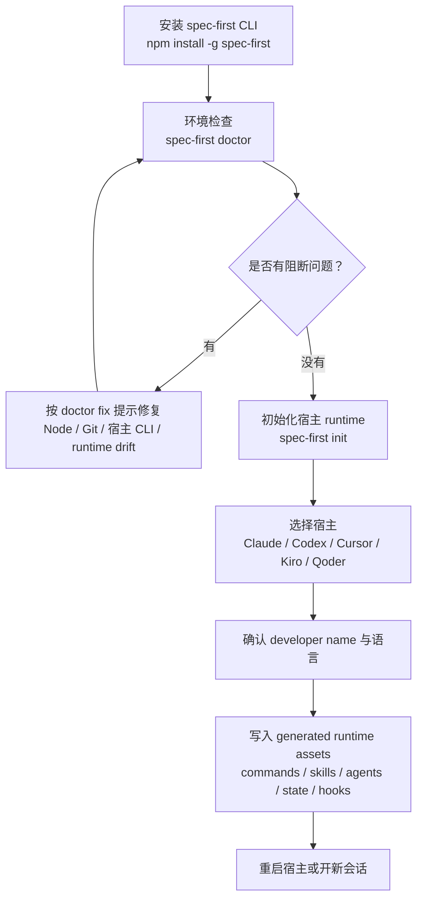

本页位于入门指南的第四站：在读完[项目概览](1-xiang-mu-gai-lan)、[快速开始](2-kuai-su-kai-shi)和[适用场景与核心价值](3-gua-yong-chang-jing-yu-he-xin-jie-zhi)之后，你需要完成三件事：安装 `spec-first` CLI、用 `doctor` 检查本机和项目状态、用 `init` 把同一套 source assets 生成到 Claude Code、Codex、Cursor、Kiro 或 Qoder 的宿主 runtime surface 中。Sources: [README.zh-CN.md](README.zh-CN.md#L36-L88), [src/cli/index.js](src/cli/index.js#L158-L178)

我的架构假设是：`spec-first` 的安装与初始化不是“下载一堆 prompt”，而是一个**从 npm 包入口到项目内 generated runtime 的投影过程**；`package.json` 暴露 `spec-first` 命令并要求 Node.js `>=20.0.0`，CLI 再把 `doctor`、`init` 等命令路由到对应实现，`init` 通过宿主 adapter 写入不同目录。Sources: [package.json](package.json#L2-L14), [package.json](package.json#L112-L114), [src/cli/index.js](src/cli/index.js#L19-L50), [src/cli/adapters/index.js](src/cli/adapters/index.js#L1-L13)

## 一张图看懂安装与初始化

下面这张图只表达本页范围内的事情：安装 CLI、检查环境、选择宿主、写入 generated runtime、重启宿主；后续如何运行 `spec-*` 工作流属于[第一次工作流走查：从需求到仓库产物](5-di-ci-gong-zuo-liu-zou-cha-cong-xu-qiu-dao-cang-ku-chan-wu)。Sources: [README.zh-CN.md](README.zh-CN.md#L47-L93), [src/cli/index.js](src/cli/index.js#L192-L214)



## 前置条件

开始前，请确认你在要启用 `spec-first` 的项目仓库根目录中，机器上有 Node.js、npm、Git，并且至少安装了一个受支持宿主：Claude Code、Codex、Kiro、Qoder 或 Cursor；Cursor 需要显式 opt-in，当前文档只把它作为 generated-runtime preview 来看待。Sources: [README.zh-CN.md](README.zh-CN.md#L40-L45), [README.zh-CN.md](README.zh-CN.md#L84-L88)

| 项目 | 最低要求 | 为什么需要 |
|---|---:|---|
| Node.js | `>=20.0.0` | `spec-first` npm 包声明的运行时要求，`doctor` 也会检查 Node 主版本是否至少为 20。 |
| npm | 随 Node 安装 | 用于全局安装 `spec-first` 包。 |
| Git | 在 `PATH` 中可用 | `doctor` 会执行 `git --version`，初始化也会依据 Git root 识别项目边界。 |
| 宿主 CLI | 至少一个受支持宿主 | `doctor` 会按宿主检查 `claude`、`codex`、`agent`、`kiro` 或 `qodercli` 是否可用。 |

Sources: [package.json](package.json#L112-L114), [src/cli/commands/doctor.js](src/cli/commands/doctor.js#L106-L146), [src/cli/commands/doctor.js](src/cli/commands/doctor.js#L148-L200)

## 第 1 步：安装 CLI

在 macOS、Linux 或 Windows 上，官方快速开始都使用 npm 全局安装同一个包；安装后先运行 `spec-first doctor`，不要直接跳到初始化，因为 `doctor` 会把 Node、Git、宿主 CLI、runtime assets 和状态文件问题提前暴露出来。Sources: [README.zh-CN.md](README.zh-CN.md#L47-L72), [src/cli/commands/doctor.js](src/cli/commands/doctor.js#L28-L65)

```bash
npm install -g spec-first
spec-first doctor
```

如果你只是想确认当前安装版本，可以运行 `spec-first --version`；CLI 的版本输出会提示推荐顺序：先健康检查，再初始化项目，然后重启宿主，让宿主加载同名 `spec-*` workflow 入口。Sources: [src/cli/index.js](src/cli/index.js#L192-L218)

```bash
spec-first --version
```

## 第 2 步：理解 `doctor` 检查什么

`doctor` 的职责不是“运行一次工作流”，而是检查当前项目是否已经有可用的 generated runtime：无参数时它会自动检测当前项目中已经初始化过的平台；如果没有检测到任何平台，它会提示运行 `spec-first init` 并选择宿主。Sources: [src/cli/commands/doctor.js](src/cli/commands/doctor.js#L42-L65)

| 检查层级 | 典型检查项 | 结果含义 |
|---|---|---|
| 安装健康 | Node.js、Git、全局 developer profile | `PASS` 表示基础环境可用，`ERROR` 表示需要先修复。 |
| 宿主可用性 | Claude Code、Codex、Cursor CLI、Kiro、Qoder CLI | 找不到宿主 CLI 通常是 `WARNING`，需要确认宿主安装与 `PATH`。 |
| runtime assets | commands、skills、agents、state file | 缺失或 drift 会提示重新运行 `spec-first init`。 |
| workflow runnability | runtime ready、host readiness、state、workflow surface、verification evidence | 用于说明“能否证明工作流可运行”，没有执行证据时可能只是 simulated。 |

Sources: [src/cli/commands/doctor.js](src/cli/commands/doctor.js#L75-L103), [src/cli/commands/doctor.js](src/cli/commands/doctor.js#L489-L527), [src/cli/commands/doctor.js](src/cli/commands/doctor.js#L555-L645)

如果你想让输出适合脚本读取，可以使用 `--json`；源码中 `doctor` 会输出 schema version、platforms、install health、runtime asset health、host readiness、decision input health、workflow runnability、checks、warnings 等字段。Sources: [src/cli/commands/doctor.js](src/cli/commands/doctor.js#L37-L39), [src/cli/commands/doctor.js](src/cli/commands/doctor.js#L537-L552)

```bash
spec-first doctor --json
```

## 第 3 步：运行 `init`

初始化的最简单入口是 `spec-first init`；在交互模式下，它会要求一个 TTY，然后收集宿主选择、developer name、语言和目标目录，再构建 init plan、展示预览、确认后写入。Sources: [README.zh-CN.md](README.zh-CN.md#L74-L83), [src/cli/commands/init.js](src/cli/commands/init.js#L126-L145), [src/cli/commands/init.js](src/cli/commands/init.js#L178-L231)

```bash
spec-first init
```

`init` 支持显式宿主参数、非交互确认、dry run、workspace 多仓库目标、developer name、语言和用户语言同步开关；新手建议第一次用交互模式，等理解写入路径后再使用 `-y` 或 `--dry-run`。Sources: [src/cli/commands/init.js](src/cli/commands/init.js#L276-L360), [src/cli/index.js](src/cli/index.js#L165-L169)

| 参数 | 用途 | 新手建议 |
|---|---|---|
| `--claude` | 只初始化 Claude Code runtime | 已确定只用 Claude Code 时使用。 |
| `--codex` | 只初始化 Codex runtime | 已确定只用 Codex 时使用。 |
| `--cursor` | 初始化 Cursor preview runtime | Cursor 需要显式 opt-in。 |
| `--kiro` | 初始化 Kiro runtime | 使用 Kiro 时选择。 |
| `--qoder` | 初始化 Qoder runtime | 使用 Qoder 时选择。 |
| `-y` / `--yes` | 非交互确认 | 需要默认或显式宿主，并且无法推断姓名时要传 `-u <name>`。 |
| `--dry-run` | 只预览不写入 | 第一次在真实项目中操作前推荐使用。 |
| `--all-repos` | 父 workspace 下所有 child Git repos | 只在不位于 Git repo 内的父 workspace 使用。 |
| `--repo <path>` | 指定 workspace 内某个 Git repo | 多仓库 workspace 中只初始化一个 repo 时使用。 |
| `-u <name>` | 指定 developer name | 非交互模式下常用。 |
| `--lang zh\|en` | 指定偏好语言 | 中文团队通常使用 `--lang zh`。 |

Sources: [src/cli/commands/init.js](src/cli/commands/init.js#L276-L360), [src/cli/commands/init.js](src/cli/commands/init.js#L778-L805), [src/cli/commands/init.js](src/cli/commands/init.js#L644-L680)

## 第 4 步：选择宿主

`init` 的受支持宿主列表来自同一个选择表：Claude Code、Codex、Cursor、Kiro、Qoder；其中 `-y` 默认会选择 Claude Code 与 Codex，Cursor、Kiro、Qoder 需要显式选择或交互勾选。Sources: [src/cli/commands/init.js](src/cli/commands/init.js#L77-L113), [src/cli/commands/init.js](src/cli/commands/init.js#L580-L587)

| 宿主 | runtime 根目录 | workflow/skill 目录 | agent 目录 | state 文件 |
|---|---|---|---|---|
| Claude Code | `.claude` | `.claude/spec-first/workflows` 与 `.claude/skills` | `.claude/agents` | `.claude/spec-first/state.json` |
| Codex | `.codex` | `.agents/skills` | `.codex/agents` | `.codex/spec-first/state.json` |
| Cursor | `.cursor` | `.cursor/skills` | 不投影 spec-first agents | `.cursor/spec-first/state.json` |
| Kiro | `.kiro` | `.kiro/skills` | `.kiro/agents` | `.kiro/spec-first/state.json` |
| Qoder | `.qoder` | `.qoder/skills` | `.qoder/agents` | `.qoder/spec-first/state.json` |

Sources: [src/cli/adapters/claude.js](src/cli/adapters/claude.js#L44-L82), [src/cli/adapters/codex.js](src/cli/adapters/codex.js#L37-L75), [src/cli/adapters/cursor.js](src/cli/adapters/cursor.js#L58-L101), [src/cli/adapters/kiro.js](src/cli/adapters/kiro.js#L32-L71), [src/cli/adapters/qoder.js](src/cli/adapters/qoder.js#L34-L73)

不同宿主的 runtime surface 不完全一样：Claude 和 Qoder 会生成命令入口，Codex、Cursor、Kiro 主要依赖 skill discovery；Cursor 当前还会在 `doctor` 中给出 generated-runtime preview 警告，提示本机没有验证 Cursor loader。Sources: [src/cli/adapters/base.js](src/cli/adapters/base.js#L34-L48), [src/cli/adapters/codex.js](src/cli/adapters/codex.js#L49-L63), [src/cli/adapters/cursor.js](src/cli/adapters/cursor.js#L71-L89), [src/cli/adapters/kiro.js](src/cli/adapters/kiro.js#L45-L59), [src/cli/adapters/cursor.js](src/cli/adapters/cursor.js#L139-L144)

## 第 5 步：确认写入内容

`init` 会构建操作计划，包含 managed asset 同步、obsolete asset 移除、命名空间清理、retired runtime asset 清理、developer profile 处理、runtime-specific hook 或文件写入；如果检测到 legacy state 或当前 runtime drift，会先规划 managed hard reset 再重建。Sources: [src/cli/commands/init.js](src/cli/commands/init.js#L1175-L1225)

```text
项目根目录/
├── .claude/                 # Claude Code generated runtime（如果选择 Claude）
│   ├── commands/
│   ├── skills/
│   ├── agents/
│   ├── hooks/
│   └── spec-first/state.json
├── .codex/                  # Codex generated runtime（如果选择 Codex）
│   ├── agents/
│   ├── hooks/
│   ├── hooks.json
│   └── spec-first/state.json
├── .agents/skills/          # Codex 可发现的 workflow/skill surface
├── .cursor/skills/          # Cursor preview skill runtime（如果选择 Cursor）
├── .kiro/skills/            # Kiro skill runtime（如果选择 Kiro）
├── .qoder/commands/         # Qoder command runtime（如果选择 Qoder）
├── .qoder/skills/
├── AGENTS.md 或 CLAUDE.md    # 宿主指令 bootstrap
└── .gitignore               # spec-first managed ignore block
```

初始化成功后，CLI 会打印生成了多少 commands、skills、agents、agent support files，并显示全局 developer profile 的路径、姓名、语言、初始化时间和版本；这些输出帮助你确认“写了什么”和“写给哪个宿主”。Sources: [src/cli/commands/init.js](src/cli/commands/init.js#L1306-L1359), [src/cli/commands/init.js](src/cli/commands/init.js#L1362-L1383)

## `.gitignore` 会发生什么

`init` 会维护一个 `# spec-first:start` 到 `# spec-first:end` 的 `.gitignore` block，默认忽略 generated runtime assets、local setup/runtime artifacts 和可选 provider 本地产物；这符合“source assets 在包内，runtime copies 可重建”的模型。Sources: [src/cli/gitignore-policy.js](src/cli/gitignore-policy.js#L3-L61), [src/cli/gitignore-policy.js](src/cli/gitignore-policy.js#L73-L120)

| 类别 | 会被忽略的典型路径 |
|---|---|
| generated runtime assets | `.claude/commands/spec-*.md`、`.claude/skills/`、`.codex/`、`.agents/skills/`、`.cursor/skills/`、`.kiro/skills/`、`.qoder/skills/` |
| 本地 setup 与 workflow runtime artifacts | `.spec-first/config.local.yaml`、`.spec-first/workflows/`、`.spec-first/sessions/` |
| 可选 provider 本地产物 | `.codegraph/`、`.graphify/`、`graphify-out/` |

Sources: [src/cli/gitignore-policy.js](src/cli/gitignore-policy.js#L6-L61)

## 多仓库 workspace 怎么选

如果当前目录本身是 Git root，`init` 默认把它当作单仓库目标；如果当前目录不是 Git repo，但包含 child Git repos，交互模式会让你选择只初始化父 workspace runtime、初始化所有 child repos，或选择某一个 child repo。Sources: [src/cli/commands/init.js](src/cli/commands/init.js#L622-L641), [src/cli/commands/init.js](src/cli/commands/init.js#L685-L730)

`--all-repos` 只能从父 workspace 运行，不能在 Git repo 内运行；`--repo <path>` 必须指向当前 workspace 内的 Git repo，否则会返回错误。Sources: [src/cli/commands/init.js](src/cli/commands/init.js#L644-L680)

多仓库初始化会写父级 advisory summary，其中包含 workflow mode、selection source、workspace root、parent runtime 状态、child repo 结果、ready/action-required 计数和 next action；它用于告诉你哪些 repo 已 ready，哪些 repo 还需要处理。Sources: [src/cli/commands/init.js](src/cli/commands/init.js#L1540-L1602), [src/cli/commands/init.js](src/cli/commands/init.js#L1605-L1674)

## 常见问题速查

下面只列安装、环境检查与初始化阶段的问题；工作流运行中的需求、计划、任务、审查问题，请继续阅读后续页面。Sources: [src/cli/commands/doctor.js](src/cli/commands/doctor.js#L75-L103), [src/cli/commands/init.js](src/cli/commands/init.js#L126-L145)

| 现象 | 原因 | 处理方式 |
|---|---|---|
| `doctor` 报 Node.js `ERROR` | Node 主版本小于 20 | 安装 Node.js 20 或更新版本。 |
| `doctor` 报 Git not found | `git --version` 执行失败 | 安装 Git，并确认在 `PATH` 中。 |
| `doctor` 说没有检测到平台 | 当前项目还没有初始化宿主 runtime | 运行 `spec-first init` 并选择宿主。 |
| `init` 提示需要交互式终端 | 未使用 `-y`，但当前不是 TTY | 换到交互终端运行，或用 `-y` 并显式传宿主参数。 |
| `init -y` 无法确定 developer name | 非交互模式无法询问姓名，且没有全局或 Git 用户名 | 传入 `-u <name>`，例如 `spec-first init --claude -y -u Alice --lang zh`。 |
| Claude 初始化失败并提示 settings JSON | `.claude/settings.json` 不是合法 JSON | 修复 JSON 后重新运行 `spec-first init` 并选择 Claude Code。 |
| Codex 提示 global hook pollution | Codex global hook location 里已有 spec-first SessionStart hook | 运行 `spec-first doctor --codex` 查看详情，或按提示清理对应 global hook。 |
| Cursor 出现 preview warning | Cursor generated-runtime loader 未在本机验证 | 打开 Cursor runtime UI 或跑当前 Cursor CLI/user journey 记录 loader evidence 后再提升信任级别。 |

Sources: [src/cli/commands/doctor.js](src/cli/commands/doctor.js#L106-L146), [src/cli/commands/doctor.js](src/cli/commands/doctor.js#L148-L200), [src/cli/commands/init.js](src/cli/commands/init.js#L138-L144), [src/cli/commands/init.js](src/cli/commands/init.js#L778-L805), [src/cli/commands/init.js](src/cli/commands/init.js#L1151-L1172), [src/cli/commands/init.js](src/cli/commands/init.js#L1127-L1144), [src/cli/adapters/cursor.js](src/cli/adapters/cursor.js#L139-L144)

## 完成后的最小验收

初始化结束后，你可以用三步验收：第一，重新运行 `spec-first doctor`；第二，确认对应宿主目录下出现 state file、skills、必要的 commands 或 agents；第三，重启宿主或开新会话，因为 workflow 入口由宿主加载，不是 shell 子命令。Sources: [README.zh-CN.md](README.zh-CN.md#L80-L93), [src/cli/commands/doctor.js](src/cli/commands/doctor.js#L871-L907), [src/cli/index.js](src/cli/index.js#L208-L214)

```bash
spec-first doctor
```

`doctor` 的 `workflow_runnability` 只有在 runtime assets、host readiness、managed state、workflow surface 和足够新的 verification evidence 都满足时才会是 verified；如果没有执行证据，但 runtime surface 已 ready，它可能是 simulated，这对刚初始化完成的新项目是可以理解的。Sources: [src/cli/commands/doctor.js](src/cli/commands/doctor.js#L555-L645), [src/cli/commands/doctor.js](src/cli/commands/doctor.js#L665-L679)

## 下一步阅读

完成本页后，建议继续读[第一次工作流走查：从需求到仓库产物](5-di-ci-gong-zuo-liu-zou-cha-cong-xu-qiu-dao-cang-ku-chan-wu)，因为那里会从宿主会话里运行第一个 `spec-*` workflow；如果你想先查入口清单，读[工作流入口速查与任务路由](6-gong-zuo-liu-ru-kou-su-cha-yu-ren-wu-lu-you)；如果你想理解初始化写入的目录和产物边界，读[产物目录与可检查工程轨迹](7-chan-wu-mu-lu-yu-ke-jian-cha-gong-cheng-gui-ji)；如果你同时使用多个宿主，读[多宿主使用指南：Claude Code、Codex、Cursor、Kiro 与 Qoder](8-duo-su-zhu-shi-yong-zhi-nan-claude-code-codex-cursor-kiro-yu-qoder)。Sources: [README.zh-CN.md](README.zh-CN.md#L90-L123), [src/cli/index.js](src/cli/index.js#L208-L214)