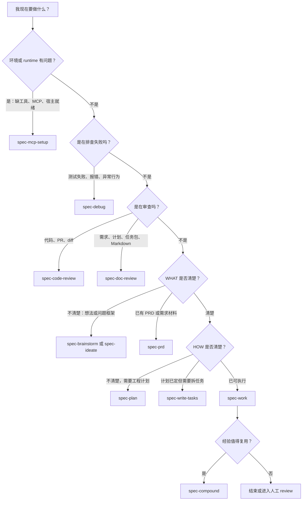
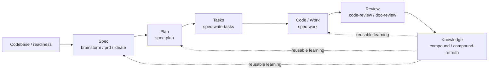
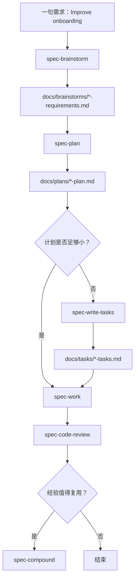

本页是入门指南中的第 6 页，位置在 [第一次工作流走查：从需求到仓库产物](5-di-ci-gong-zuo-liu-zou-cha-cong-xu-qiu-dao-cang-ku-chan-wu) 之后、[产物目录与可检查工程轨迹](7-chan-wu-mu-lu-yu-ke-jian-cha-gong-cheng-gui-ji) 之前；它只回答一个问题：**当你手上有一个任务时，应该从哪个 `spec-*` 工作流入口开始**。注意：这些 `spec-*` 入口在 Claude Code、Codex、Cursor、Kiro 或 Qoder 等宿主会话里运行，不是终端里的 shell 命令；终端里的 CLI 主要用于 `doctor`、`init`、`update` 等安装和运行时治理操作。Sources: [README.zh-CN.md](README.zh-CN.md#L90-L101), [docs/05-用户手册/09-首次工作流走查.md](docs/05-用户手册/09-首次工作流走查.md#L36-L54)

## 架构假设与验证结论

本页采用的架构假设是：`spec-first` 的工作流入口不是一个“强制从 brainstorm 开始”的状态机，而是一个**按用户当前意图路由到最合适入口**的轻量治理层；源代码验证显示，`using-spec-first` 明确要求使用决策树而不是 blanket “brainstorm first” 规则，并按显式路由、修复、诊断、评审、定义、优化、执行、知识沉淀的优先级选择入口。Sources: [skills/using-spec-first/SKILL.md](skills/using-spec-first/SKILL.md#L108-L131)

第二个验证结论是：公开工作流入口来自受治理的 skill/command 映射，而不是临时约定；`skills-governance.json` 将 `spec-brainstorm`、`spec-prd`、`spec-plan`、`spec-write-tasks`、`spec-work`、`spec-code-review`、`spec-doc-review`、`spec-compound` 等声明为 `workflow_command`，并为不同宿主定义交付形态。Sources: [src/cli/contracts/dual-host-governance/skills-governance.json](src/cli/contracts/dual-host-governance/skills-governance.json#L202-L470)

第三个验证结论是：入口选择会落到可检查的仓库产物上；需求探索写入 `docs/brainstorms/`，计划写入 `docs/plans/`，任务包写入 `docs/tasks/`，知识沉淀写入 `docs/solutions/`，而 `spec-work` 的运行证据在适用时写入 `.spec-first/workflows/spec-work/...`。Sources: [docs/05-用户手册/04-workflows-artifacts-map.md](docs/05-用户手册/04-workflows-artifacts-map.md#L25-L34), [docs/05-用户手册/04-workflows-artifacts-map.md](docs/05-用户手册/04-workflows-artifacts-map.md#L106-L110)

## 一句话速查：你现在该用哪个入口？

如果你只有一个粗略想法，用 `spec-brainstorm`；如果你已有 PRD 或需求材料，用 `spec-prd`；如果需求清楚但不知道怎么落地，用 `spec-plan`；如果已有计划或任务包并准备执行，用 `spec-work`；如果遇到失败测试、堆栈或异常行为，用 `spec-debug`；如果要审查 diff 或文档，用 `spec-code-review` 或 `spec-doc-review`；如果问题已经解决并值得复用，用 `spec-compound`。Sources: [README.zh-CN.md](README.zh-CN.md#L113-L123), [docs/05-用户手册/09-首次工作流走查.md](docs/05-用户手册/09-首次工作流走查.md#L169-L179)

| 你手上的任务 | 推荐入口 | 初学者判断标准 | 常见产物或结果 |
|---|---|---|---|
| 只有想法、方向、模糊问题 | `spec-brainstorm` | 还说不清用户、边界、成功标准 | `docs/brainstorms/*-requirements.md` |
| 已有 PRD、需求笔记、brownfield change request | `spec-prd` | 已有业务背景，需要整理成研发可用需求 | `docs/brainstorms/*-requirements.md` |
| 需求清楚，但工程路径不清楚 | `spec-plan` | 需要决定改哪里、怎么验证、有哪些风险 | `docs/plans/*-plan.md` |
| 计划较大，需要拆成可交接任务 | `spec-write-tasks` | 多模块、多阶段、多人或多 agent 交接 | `docs/tasks/*-tasks.md` |
| 已有 plan/task pack，准备改代码或文档 | `spec-work` | 要做最小可验证改动 | 源码或文档 diff，加验证记录 |
| 失败测试、报错、异常行为 | `spec-debug` | 当前问题是“为什么坏了”而不是“做新功能” | 根因分析、可选修复、验证记录 |
| 审查代码、PR、diff | `spec-code-review` | 想找 bug、风险、测试缺口、合并阻断项 | 结构化 findings |
| 审查需求、计划、任务包、Markdown 文档 | `spec-doc-review` | 想检查一致性、可行性、范围或表达问题 | 结构化 findings |
| 刚解决的问题值得复用 | `spec-compound` | 想把经验沉淀给后续任务 | `docs/solutions/**/*` |

Sources: [docs/workflow-skill-agent-map.md](docs/workflow-skill-agent-map.md#L24-L48), [docs/05-用户手册/04-workflows-artifacts-map.md](docs/05-用户手册/04-workflows-artifacts-map.md#L29-L34)

## 入口路由总览图

下面的图不是强制流程，而是初学者的**入口选择地图**：先看当前任务的性质，再进入一个最合适的工作流；不要一次自动串起多个工作流，除非当前工作流自己的契约明确交接到下一步。Sources: [skills/using-spec-first/SKILL.md](skills/using-spec-first/SKILL.md#L120-L131)



Sources: [skills/using-spec-first/SKILL.md](skills/using-spec-first/SKILL.md#L146-L174), [README.zh-CN.md](README.zh-CN.md#L143-L159)

## 主链路：从需求到知识沉淀

`spec-first` 的主链路可以记成 `Codebase → Spec → Plan → Tasks → Code → Review → Knowledge`；其中 `Context` 不是单独节点，而是横切的证据层，普通工作流通过 bounded source reads、`rg`、ast-grep、git diff、tests/logs、`docs/solutions` 和 runtime readiness facts 获取上下文。Sources: [docs/workflow-skill-agent-map.md](docs/workflow-skill-agent-map.md#L4-L20)



Sources: [docs/workflow-skill-agent-map.md](docs/workflow-skill-agent-map.md#L12-L20), [README.zh-CN.md](README.zh-CN.md#L145-L159)

这条链路中，`spec-write-tasks` 是 `spec-plan` 到 `spec-work` 之间的可选派生层：小计划可以直接进入 `spec-work`，大计划、多模块计划或需要多人交接的计划才更适合先生成 task pack；task pack 不是新的需求真相源，不能反向扩大 plan 范围。Sources: [docs/05-用户手册/09-首次工作流走查.md](docs/05-用户手册/09-首次工作流走查.md#L116-L125), [docs/workflow-skill-agent-map.md](docs/workflow-skill-agent-map.md#L107-L110)

## 公开入口与产物目录

工作流入口的价值不只是“让 AI 回答更好”，而是把需求、计划、任务、执行证据、审查发现和经验沉淀到仓库中；第一次运行通常先看到 `docs/brainstorms/` 下的 requirements artifact，后续链路才会逐步积累 plans、tasks、review findings 和 learnings。Sources: [README.zh-CN.md](README.zh-CN.md#L125-L141)

```text
docs/
  ideation/      spec-ideate 产生的候选想法与排序
  brainstorms/   spec-brainstorm 或 spec-prd 产生的需求文档
  plans/         spec-plan 产生的实施计划
  tasks/         spec-write-tasks 产生的任务包
  solutions/     spec-compound 产生的可复用经验

.spec-first/
  config/        spec-mcp-setup 写入的 setup facts
  workflows/     spec-work 等流程的运行证据目录
```

Sources: [README.zh-CN.md](README.zh-CN.md#L127-L139), [docs/05-用户手册/04-workflows-artifacts-map.md](docs/05-用户手册/04-workflows-artifacts-map.md#L7-L18)

| 入口 | 主要用途 | 典型读取方或下一步 |
|---|---|---|
| `spec-ideate` | 在 brainstorm 前发散和筛选想法 | 选择一个方向进入 `spec-brainstorm` |
| `spec-brainstorm` | 把粗略想法变成需求 brief | `spec-plan`、文档审查、维护者复核 |
| `spec-prd` | 把已有 PRD 或 brownfield 需求整理成研发可用需求 | `spec-plan`、文档审查 |
| `spec-plan` | 把需求转成工程计划 | `spec-work` 或 `spec-write-tasks` |
| `spec-write-tasks` | 从计划派生可执行任务包 | `spec-work`、代码/文档审查 |
| `spec-work` | 执行有范围的改动 | `spec-code-review`、shipping handoff |
| `spec-code-review` | 审查代码、PR、diff | 修复、残余风险记录、合并前判断 |
| `spec-doc-review` | 审查需求、计划、任务包、文档 | 修正文档或重新规划 |
| `spec-compound` | 把已解决问题沉淀为可复用经验 | 后续 brainstorm、plan、work、debug、review 复用 |

Sources: [docs/05-用户手册/04-workflows-artifacts-map.md](docs/05-用户手册/04-workflows-artifacts-map.md#L36-L51), [docs/workflow-skill-agent-map.md](docs/workflow-skill-agent-map.md#L26-L48)

## 初学者最容易混淆的边界

第一个边界：`spec-*` 工作流入口通常在宿主会话中使用，而 `spec-first doctor`、`spec-first init`、`spec-first update` 这类 CLI 命令在终端中使用；初始化后需要重启宿主或打开新会话，让宿主加载生成的 runtime assets。Sources: [README.zh-CN.md](README.zh-CN.md#L74-L92), [docs/05-用户手册/09-首次工作流走查.md](docs/05-用户手册/09-首次工作流走查.md#L36-L45)

第二个边界：`using-spec-first` 是入口治理 skill，不是公开 `spec-*` 工作流，也不会创建计划、任务包、审查报告、setup 报告或知识沉淀；当用户只问“下一步该用哪个入口”时，它应进入只读的 User Next-Step Guide Mode，只推荐一个最佳入口、一个理由和一个下一步动作。Sources: [skills/using-spec-first/SKILL.md](skills/using-spec-first/SKILL.md#L8-L26), [skills/using-spec-first/SKILL.md](skills/using-spec-first/SKILL.md#L88-L103)

第三个边界：不要按关键词机械路由；用户的即时意图优先于主题领域。例如同样提到 “PRD”，如果是独立批判文档质量，应走 `spec-doc-review`；如果是 brownfield PRD 编写、细化或代码感知的 PRD validation，应走 `spec-prd`。Sources: [skills/using-spec-first/SKILL.md](skills/using-spec-first/SKILL.md#L76-L87), [skills/using-spec-first/SKILL.md](skills/using-spec-first/SKILL.md#L131-L134)

第四个边界：外部 issue 或 PR 只是输入表面，不是单独入口；失败报告、复现步骤、堆栈和失败检查走 `spec-debug`，产品增强或 WHAT discovery 走 `spec-prd` 或 `spec-brainstorm`，PR diff 质量或合并风险走 `spec-code-review`，已定范围的执行说明走 `spec-work`。Sources: [skills/using-spec-first/SKILL.md](skills/using-spec-first/SKILL.md#L135-L145)

## 路由优先级：从高风险到普通执行

当多个入口看起来都能用时，优先处理更高风险或更前置的事情：显式用户路由优先，其次是 setup/update/runtime 修复，再到 debug、review、需求定义、优化、plan/work 执行，最后才是 knowledge capture；这能避免把失败测试当普通开发任务做，也能避免在 runtime 未就绪时误入业务工作流。Sources: [skills/using-spec-first/SKILL.md](skills/using-spec-first/SKILL.md#L120-L131)

| 优先级 | 判断问题 | 推荐入口 |
|---|---|---|
| 1 | 用户明确点名了当前公开工作流吗？ | 尊重该 `spec-*` 入口，除非明显不安全或不可能 |
| 2 | 宿主、MCP、helper、runtime assets 缺失或陈旧吗？ | `spec-mcp-setup` 或终端 `spec-first update` |
| 3 | 当前任务核心是失败、报错、异常、根因不明吗？ | `spec-debug` |
| 4 | 用户是在要求审查而不是实现吗？ | `spec-code-review` 或 `spec-doc-review` |
| 5 | WHAT 还不清楚吗？ | `spec-ideate`、`spec-brainstorm` 或 `spec-prd` |
| 6 | 用户要优化可度量结果吗？ | `spec-optimize` |
| 7 | 目标清楚但路径不清楚吗？ | `spec-plan` |
| 8 | 计划或任务包已经可执行吗？ | `spec-work` |
| 9 | 工作完成后要沉淀经验吗？ | `spec-compound` 或 `spec-compound-refresh` |

Sources: [skills/using-spec-first/SKILL.md](skills/using-spec-first/SKILL.md#L120-L174)

## 示例：从一句需求到可执行工作

假设你在宿主会话里输入 “Improve onboarding for first-time CLI users”。第一次通常从 `spec-brainstorm` 开始，因为需求还需要回答用户是谁、卡在哪里、成功标准是什么、哪些内容不在本轮范围内；生成的 requirements brief 通常落在 `docs/brainstorms/YYYY-MM-DD-NNN-...-requirements.md`。Sources: [docs/05-用户手册/09-首次工作流走查.md](docs/05-用户手册/09-首次工作流走查.md#L68-L90)

当 requirements brief 足够稳定后，进入 `spec-plan`，把需求转换成可评审、可执行的工程决策上下文；一个好的 plan 至少说明实施目标与非目标、大致文件区域、依赖和风险、验证方式，以及哪些问题留到 implementation-time 决策。Sources: [docs/05-用户手册/09-首次工作流走查.md](docs/05-用户手册/09-首次工作流走查.md#L92-L115)

如果 plan 很小，可以直接 `spec-work`；如果 plan 涉及多个模块、多个阶段或多人/多 agent 交接，可以先 `spec-write-tasks` 生成 task pack；执行完成后，合并前可用 `spec-code-review` 查 bug、回归、测试缺口和残余风险，问题稳定解决且值得复用时再 `spec-compound` 写入 `docs/solutions/`。Sources: [docs/05-用户手册/09-首次工作流走查.md](docs/05-用户手册/09-首次工作流走查.md#L116-L167)



Sources: [docs/05-用户手册/09-首次工作流走查.md](docs/05-用户手册/09-首次工作流走查.md#L68-L167)

## 不需要进入工作流的情况

并不是所有问题都要进入 `spec-first` 工作流；轻量事实回答、当前上下文解释、窄范围查找、用户提供的单文档摘要、清晰低风险的小改动，或者已经处在一个活跃 public workflow / bounded subagent task 中时，可以直接回答或继续当前工作，不要强行重新路由。Sources: [skills/using-spec-first/SKILL.md](skills/using-spec-first/SKILL.md#L15-L26), [skills/using-spec-first/SKILL.md](skills/using-spec-first/SKILL.md#L60-L65)

如果你只是问“我下一步该跑什么”，推荐输出应保持简单：一个入口、一个具体理由、一个下一步动作；不要打印完整菜单，也不要在 guide mode 下直接开始工作流，除非用户明确要求继续执行该工作流。Sources: [skills/using-spec-first/SKILL.md](skills/using-spec-first/SKILL.md#L88-L103)

## 下一步阅读建议

如果你还没跑过完整示例，先回到 [第一次工作流走查：从需求到仓库产物](5-di-ci-gong-zuo-liu-zou-cha-cong-xu-qiu-dao-cang-ku-chan-wu)，用一个小需求实际走一遍；如果你已经知道入口但想理解每个目录的意义，继续读 [产物目录与可检查工程轨迹](7-chan-wu-mu-lu-yu-ke-jian-cha-gong-cheng-gui-ji)；如果你使用多个宿主，接着读 [多宿主使用指南：Claude Code、Codex、Cursor、Kiro 与 Qoder](8-duo-su-zhu-shi-yong-zhi-nan-claude-code-codex-cursor-kiro-yu-qoder)。Sources: [docs/05-用户手册/09-首次工作流走查.md](docs/05-用户手册/09-首次工作流走查.md#L1-L10), [docs/05-用户手册/04-workflows-artifacts-map.md](docs/05-用户手册/04-workflows-artifacts-map.md#L1-L6), [README.zh-CN.md](README.zh-CN.md#L16-L20)