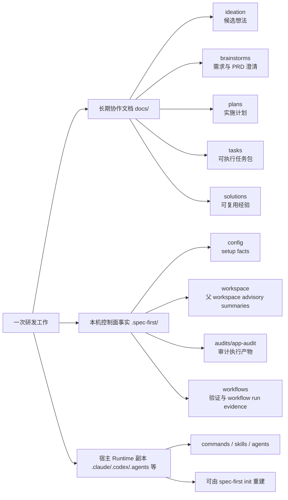
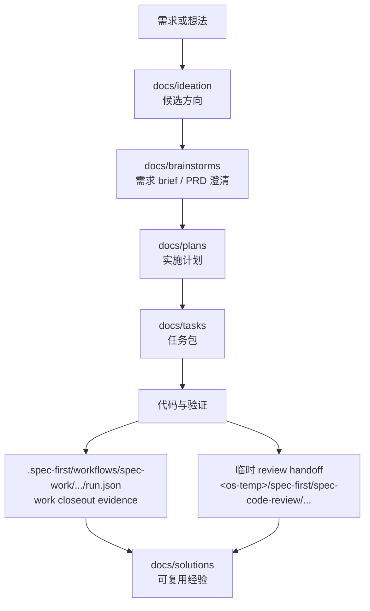

你当前位于入门指南的第 7 页：[产物目录与可检查工程轨迹](7-chan-wu-mu-lu-yu-ke-jian-cha-gong-cheng-gui-ji)。这一页只回答一个问题：**spec-first 运行后，哪些文件是长期协作文档，哪些是本机运行产物，哪些是可重建 runtime，以及你应该检查哪里来理解一次工程工作的轨迹**。Sources: [10-产物目录.md](docs/05-用户手册/10-产物目录.md#L1-L12), [04-workflows-artifacts-map.md](docs/05-用户手册/04-workflows-artifacts-map.md#L1-L6)

## 架构假设与验证结论

本页的架构假设是：spec-first 并不把一次 AI 对话当成最终结果，而是把研发过程拆成三类可检查轨迹：`docs/` 里的长期协作文档、`.spec-first/` 里的本机 control-plane facts、以及 `.claude/`、`.codex/`、`.agents/skills/` 等可由初始化重建的 generated runtime assets。源码中的 `.gitignore` 策略也验证了这一边界：generated runtime assets、本地 setup/workflow runtime artifacts、provider 本地产物默认被忽略，而 `docs/`、`skills/`、`agents/`、`templates/`、`src/cli/` 才是需要维护的 source truth 区域。Sources: [10-产物目录.md](docs/05-用户手册/10-产物目录.md#L5-L12), [gitignore-policy.js](src/cli/gitignore-policy.js#L6-L61), [.gitignore](.gitignore#L54-L99)

## 一眼看懂：三层产物模型

初学者可以先记住这个模型：**长期知识进 `docs/`，机器事实进 `.spec-first/`，宿主运行副本进宿主目录**。`docs/ideation`、`docs/brainstorms`、`docs/plans`、`docs/tasks`、`docs/solutions` 记录从想法、需求、计划、任务到经验沉淀的工程轨迹；`.spec-first/config`、`.spec-first/workspace`、`.spec-first/audits`、`.spec-first/app-audit`、`.spec-first/workflows` 记录本机 setup、审计、验证和 workflow 运行事实；`.claude`、`.codex`、`.agents/skills` 等目录是 `spec-first init` 投影出来的 runtime copy。Sources: [10-产物目录.md](docs/05-用户手册/10-产物目录.md#L13-L24), [10-产物目录.md](docs/05-用户手册/10-产物目录.md#L38-L49), [10-产物目录.md](docs/05-用户手册/10-产物目录.md#L62-L77)



这张图的核心判断标准是：如果内容要给团队长期理解和复盘，优先看 `docs/`；如果内容是当前机器、当前 run、当前宿主能力的事实，优先看 `.spec-first/`；如果目录是宿主可执行入口或 skill/agent runtime copy，坏了不要手改，应该回到 source truth 后重新 init。Sources: [10-产物目录.md](docs/05-用户手册/10-产物目录.md#L51-L61), [10-产物目录.md](docs/05-用户手册/10-产物目录.md#L78-L89), [04-workflows-artifacts-map.md](docs/05-用户手册/04-workflows-artifacts-map.md#L215-L220)

## 视觉目录：从仓库根目录看产物位置

下面是初学者最常检查的目录视图。它不是完整仓库树，而是围绕“产物是否可检查、是否应提交、是否可重建”筛出的工作视图。Sources: [10-产物目录.md](docs/05-用户手册/10-产物目录.md#L13-L24), [10-产物目录.md](docs/05-用户手册/10-产物目录.md#L38-L61), [04-workflows-artifacts-map.md](docs/05-用户手册/04-workflows-artifacts-map.md#L7-L18)

```text
.
├── docs/
│   ├── ideation/        # 候选想法、批判、排序
│   ├── brainstorms/     # 需求 brief、PRD 澄清、planning-readiness
│   ├── plans/           # 执行前计划与取舍
│   ├── tasks/           # 从 plan 派生的任务包
│   └── solutions/       # 解决后沉淀的可复用经验
├── .spec-first/
│   ├── config/          # setup-owned machine facts
│   ├── workspace/       # 父 workspace advisory summaries
│   ├── audits/          # skill audit 执行产物
│   ├── app-audit/       # App consistency audit 执行产物
│   └── workflows/       # verification、quality gate、spec-work run evidence
├── .claude/             # Claude runtime copy，可重建
├── .codex/              # Codex runtime copy，可重建
├── .agents/skills/      # Codex skill runtime mirror，可重建
├── src/cli/             # CLI source truth
├── skills/              # Skill source truth
├── agents/              # Agent source truth
├── templates/           # Runtime 生成模板
└── tests/               # 回归与 contract 保障
```

这棵树要配合 Git 边界理解：`.spec-first/config/*.json`、`.spec-first/audits/`、`.spec-first/app-audit/`、`.spec-first/workflows/`、`.spec-first/workspace/`、`.claude/skills/`、`.codex/`、`.agents/skills/` 等在 `.gitignore` 的 spec-first 管理区块中默认忽略。Sources: [.gitignore](.gitignore#L54-L99), [gitignore-policy.js](src/cli/gitignore-policy.js#L6-L61)

## Workflow 文档产物：长期工程轨迹

`docs/` 下的 workflow 文档是最适合给团队复盘的轨迹。它们记录“为什么做、准备怎么做、拆成哪些任务、最后沉淀了什么经验”，通常比临时运行日志更适合提交和审查。Sources: [10-产物目录.md](docs/05-用户手册/10-产物目录.md#L13-L24), [04-workflows-artifacts-map.md](docs/05-用户手册/04-workflows-artifacts-map.md#L25-L35)

| 路径 | 常见生成者 | 你应该检查什么 | Git 边界 |
| --- | --- | --- | --- |
| `docs/ideation/*-ideation.md` | `spec-ideate` | 候选想法、批判、排序、拒绝理由 | 通常提交 |
| `docs/brainstorms/*-requirements.md` | `spec-brainstorm` / `spec-prd` | 问题、范围、非目标、验收、PRD 澄清与 planning-readiness | 通常提交 |
| `docs/plans/*-plan.md` | `spec-plan` | 实施单元、取舍、验证范围、风险、证据限制 | 通常提交 |
| `docs/tasks/*-tasks.md` | `spec-write-tasks` | 可执行 handoff、依赖、任务身份、freshness contract | 视团队协作需要提交 |
| `docs/solutions/**/*` | `spec-compound` | 已解决问题的可复用经验 | 通常提交 |
| `CHANGELOG.md` | 执行变更的 agent / 维护者 | 源码或文档变更记录 | 提交 |

表中的关键点是：`docs/brainstorms` 可以同时承载传统需求 brief 和 `spec-prd` 产生的研发侧 clarified requirements；`docs/plans` 是执行前主要决策上下文；`docs/tasks` 是从 plan 派生的可执行交接物；`docs/solutions` 是问题解决后的可复用知识，而不是当前需求或计划的替代品。Sources: [10-产物目录.md](docs/05-用户手册/10-产物目录.md#L17-L24), [04-workflows-artifacts-map.md](docs/05-用户手册/04-workflows-artifacts-map.md#L29-L35)

## `.spec-first/`：本机事实，不是长期知识库

`.spec-first/` 是 runtime/control-plane facts 的默认位置，用来回答“当前机器、当前宿主、当前 run 的事实是什么”。它包括 setup 能力、workspace advisory summary、审计执行结果、验证证据、quality gate 结果和 `spec-work` run evidence；这些目录默认不进入 Git。Sources: [10-产物目录.md](docs/05-用户手册/10-产物目录.md#L62-L77), [04-workflows-artifacts-map.md](docs/05-用户手册/04-workflows-artifacts-map.md#L7-L18), [04-workflows-artifacts-map.md](docs/05-用户手册/04-workflows-artifacts-map.md#L215-L220)

| 目录 | 写入阶段 | 主要产物 | 初学者怎么理解 |
| --- | --- | --- | --- |
| `.spec-first/config/` | `spec-mcp-setup` setup facts | `runtime-capabilities.json` | 当前宿主与工具 readiness 的机器事实 |
| `.spec-first/workspace/` | 父 workspace advisory 阶段 | setup/verify summary、scenario fingerprint、quarantine JSON | 多仓父目录下的候选与批量维护摘要 |
| `.spec-first/audits/skill-audit/` | `spec-skill-audit` | inventory、scorecard、risk report、summary、improvement plan | skill 审计执行产物 |
| `.spec-first/app-audit/runs/<run-id>/` | App consistency audit | metadata、manifest、preflight、issues、report | App 一致性审查执行产物 |
| `.spec-first/workflows/verification/<slug>/` | verification evidence | `verification-evidence.json` | 供 `doctor` 读取的验证证据 |
| `.spec-first/workflows/spec-work/<workspace-slug>/<run-id>/` | `spec-work` closeout evidence | `run.json` | 一次 work 的 compact run evidence |
| `.spec-first/workflows/quality-gates/ai-dev-quality-gate/` | AI Dev Quality Gate | gate result、feedback topics、JUnit 输出 | 质量门结果和失败主题 |

`.spec-first/workspace/` 只提供父 workspace 视角的 advisory summaries，不能替代 child repo 内的 `.spec-first/config/`、当前源码、git diff、tests/logs、ast-grep 或 bounded direct source reads；如果本机事实 stale、blocked 或 degraded，下游 workflow 应说明限制并回退到可验证输入。Sources: [04-workflows-artifacts-map.md](docs/05-用户手册/04-workflows-artifacts-map.md#L83-L105), [10-产物目录.md](docs/05-用户手册/10-产物目录.md#L74-L77)

## Generated runtime assets：坏了重建，不要手改

`.claude/commands/spec-*.md`、`.claude/skills/`、`.claude/spec-first/workflows/`、`.claude/agents/`、`.codex/agents/`、`.agents/skills/` 等目录属于 generated runtime assets。它们的 source truth 不在这些 runtime copy 里，而在 `src/cli/`、`skills/`、`agents/` 和 `templates/`。Sources: [10-产物目录.md](docs/05-用户手册/10-产物目录.md#L38-L61), [gitignore-policy.js](src/cli/gitignore-policy.js#L6-L37)

| Runtime 目录 | 生成方式 | 是否 source truth | 是否手改 | 正确修复方式 |
| --- | --- | --- | --- | --- |
| `.claude/commands/spec-*.md` | `spec-first init` | 否 | 否 | 回到 source truth 后重新 init |
| `.claude/skills/` | `spec-first init` | 否 | 否 | 回到 source truth 后重新 init |
| `.claude/spec-first/workflows/` | `spec-first init` | 否 | 否 | 回到 source truth 后重新 init |
| `.claude/agents/` | `spec-first init` | 否 | 否 | 回到 source truth 后重新 init |
| `.codex/agents/` | `spec-first init` | 否 | 否 | 回到 source truth 后重新 init |
| `.agents/skills/` | `spec-first init` | 否 | 否 | 回到 source truth 后重新 init |

如果 runtime copy 和源码不一致，正确动作不是打开 `.claude/` 或 `.codex/` 直接改，而是先判断 `src/cli/`、`skills/`、`agents/`、`templates/` 是否正确，再通过对应宿主初始化流程重建 runtime。Sources: [10-产物目录.md](docs/05-用户手册/10-产物目录.md#L49-L61), [10-产物目录.md](docs/05-用户手册/10-产物目录.md#L86-L87)

## 一次工作如何留下可检查轨迹

从工程轨迹看，spec-first 的核心链路是 `Codebase -> Spec -> Plan -> Tasks -> Code -> Review -> Knowledge`。对应到产物目录，就是需求和 PRD 澄清先落到 `docs/brainstorms`，计划落到 `docs/plans`，任务包落到 `docs/tasks`，执行证据可能落到 `.spec-first/workflows/spec-work/.../run.json`，评审或审计可能产生临时或本机产物，解决后的可复用经验再进入 `docs/solutions`。Sources: [ai-coding-harness.md](docs/contracts/ai-coding-harness.md#L7-L24), [04-workflows-artifacts-map.md](docs/05-用户手册/04-workflows-artifacts-map.md#L25-L35), [04-workflows-artifacts-map.md](docs/05-用户手册/04-workflows-artifacts-map.md#L106-L121)



注意：`spec-code-review` 的 full-detail run artifact 写在当前 OS temp root 下的 `<os-temp>/spec-first/spec-code-review/<run-id>/`，不是 `.spec-first/`，也不是 repo-local durable truth；`mode:report-only` 不写 temp artifact，interactive、autofix、headless mode 才写临时 handoff。Sources: [04-workflows-artifacts-map.md](docs/05-用户手册/04-workflows-artifacts-map.md#L112-L121), [10-产物目录.md](docs/05-用户手册/10-产物目录.md#L25-L36)

## `spec-work` run evidence 的路径规则

`spec-work` 的 durable run artifact 路径是 `.spec-first/workflows/spec-work/<workspace-slug>/<run-id>/run.json`。契约声明它是 source-owned write-side contract，producer 可用，并且同一 `workspace/run-id` 的产物不可覆盖；schema 还要求记录 `schema_version`、`generated_at`、`workflow`、`run_id`、`mode`、`workspace_slug`、`producer`、`plan_path`、`task_pack_path`、`source_refs`、`script_confirmed`、`llm_asserted`、`provider_untrusted`、`retention`、`artifact_path` 和 `warnings`。Sources: [spec-work-run-artifact.schema.json](docs/contracts/workflows/spec-work-run-artifact.schema.json#L1-L31), [spec-work-run-artifact.schema.json](docs/contracts/workflows/spec-work-run-artifact.schema.json#L55-L120)

路径本身也受源码保护：`resolveWorkflowArtifactDir(repoRoot, workflow, slug)` 总是解析到 `<repoRoot>/.spec-first/workflows/<workflow>/<slug>/`，并拒绝空 segment、路径穿越、绝对路径、Windows 不兼容文件名，以及通过 symlink 逃出 artifact anchor root 的情况。Sources: [artifact-paths.js](src/verification/artifact-paths.js#L34-L52), [artifact-paths.js](src/verification/artifact-paths.js#L54-L93), [workflow-artifact-paths.test.js](tests/unit/workflow-artifact-paths.test.js#L10-L49)

## Summary-first：先看摘要，再展开完整产物

跨 workflow 交接时，spec-first 使用 `artifact-summary.v1` 这种 summary-first handoff 思路：下游先消费简短摘要、source paths、evidence paths 和 full-read triggers，只有触发条件成立时才读取完整 artifact。这可以避免把长计划、review report、audit JSON、raw log 或 session transcript 直接塞给每个后续 agent。Sources: [artifact-summary.md](docs/contracts/artifact-summary.md#L1-L14), [artifact-summary.md](docs/contracts/artifact-summary.md#L21-L53)

对初学者来说，这意味着你检查轨迹时不必一开始就读所有 JSON 或所有长报告。先找 summary、manifest、status、source path、evidence path；如果摘要缺少必要 requirement、task、finding 或 evidence detail，再根据 full artifact read trigger 展开完整产物。Sources: [artifact-summary.md](docs/contracts/artifact-summary.md#L55-L73), [04-workflows-artifacts-map.md](docs/05-用户手册/04-workflows-artifacts-map.md#L53-L64)

## 快速判断：这个产物要不要提交？

判断是否提交时，可以用“是否长期协作知识”做第一原则。`docs/ideation`、`docs/brainstorms`、`docs/plans`、`docs/tasks`、`docs/solutions` 通常属于长期协作文档层；`.spec-first/config`、`.spec-first/workspace`、`.spec-first/audits`、`.spec-first/app-audit`、`.spec-first/workflows` 默认不进入 Git；generated runtime assets 默认可重建，也不应作为 source truth 提交。Sources: [04-workflows-artifacts-map.md](docs/05-用户手册/04-workflows-artifacts-map.md#L215-L220), [10-产物目录.md](docs/05-用户手册/10-产物目录.md#L78-L89), [.gitignore](.gitignore#L54-L99)

| 你看到的东西 | 通常是否提交 | 原因 |
| --- | --- | --- |
| `docs/brainstorms/*-requirements.md` | 是 | 需求和 PRD 澄清是长期协作上下文 |
| `docs/plans/*-plan.md` | 是 | 执行前决策和验证范围需要复盘 |
| `docs/tasks/*-tasks.md` | 视团队需要 | 大计划交接或并行执行时有价值 |
| `docs/solutions/**/*` | 是 | 已验证经验用于未来复用 |
| `.spec-first/config/*.json` | 否 | 本机 setup facts |
| `.spec-first/workflows/**` | 否 | 本机 workflow run evidence |
| `.claude/skills/` / `.codex/` / `.agents/skills/` | 否 | generated runtime copy |
| `src/cli/` / `skills/` / `agents/` / `templates/` | 是 | source truth |

如果你不确定某个文件是否应该提交，优先提交 durable docs 和源码资产，不提交可重建 runtime/control-plane facts；如果父 workspace 下不确定该写哪个 repo，应回到 plan/task scope，让文档明确 `target_repo` 或 per-unit/per-task `target_repo`。Sources: [10-产物目录.md](docs/05-用户手册/10-产物目录.md#L78-L89)

## 常见检查路径

当你想复盘“这个需求为什么这么做”，先看 `docs/brainstorms` 和 `docs/plans`；当你想确认“任务是否从计划派生”，看 `docs/tasks` 和其中的 source plan / freshness 信息；当你想确认“本机这次 workflow 产生了什么运行事实”，看 `.spec-first/workflows`；当你想确认“runtime 为什么坏了”，不要先改 `.claude` 或 `.codex`，而是先检查 source truth 再重建 runtime。Sources: [10-产物目录.md](docs/05-用户手册/10-产物目录.md#L78-L89), [04-workflows-artifacts-map.md](docs/05-用户手册/04-workflows-artifacts-map.md#L36-L52)

| 你的问题 | 优先检查 |
| --- | --- |
| 这个需求从哪里来？ | `docs/brainstorms/*-requirements.md` |
| 执行前有哪些取舍？ | `docs/plans/*-plan.md` |
| 是否拆成可交接任务？ | `docs/tasks/*-tasks.md` |
| 这次 work 有没有 closeout evidence？ | `.spec-first/workflows/spec-work/<workspace-slug>/<run-id>/run.json` |
| 质量门失败主题在哪里？ | `.spec-first/workflows/quality-gates/ai-dev-quality-gate/quality-feedback-topics.json` |
| App 一致性审查报告在哪里？ | `.spec-first/app-audit/runs/<run-id>/app-consistency-audit.md` |
| skill 审计摘要在哪里？ | `.spec-first/audits/skill-audit/latest/skill-audit-summary.md` |
| runtime copy 漂移怎么办？ | 检查 source truth，然后重新 `spec-first init` |

这些检查路径只覆盖“产物目录与轨迹”本身；如果你要学习如何启动第一次完整流程，下一步应回到上一页 [第一次工作流走查：从需求到仓库产物](5-di-ci-gong-zuo-liu-zou-cha-cong-xu-qiu-dao-cang-ku-chan-wu)，如果你要理解命令入口，则继续看 [工作流入口速查与任务路由](6-gong-zuo-liu-ru-kou-su-cha-yu-ren-wu-lu-you) 或后续深入页 [CLI 命令体系：doctor、init、update、clean、tasks 与 session](15-cli-ming-ling-ti-xi-doctor-init-update-clean-tasks-yu-session)。Sources: [10-产物目录.md](docs/05-用户手册/10-产物目录.md#L78-L89), [04-workflows-artifacts-map.md](docs/05-用户手册/04-workflows-artifacts-map.md#L53-L64)

## 下一步阅读建议

如果你是第一次使用，建议按入门顺序继续：先复习 [第一次工作流走查：从需求到仓库产物](5-di-ci-gong-zuo-liu-zou-cha-cong-xu-qiu-dao-cang-ku-chan-wu)，再用本页判断每个产物的位置和 Git 边界，然后阅读 [多宿主使用指南：Claude Code、Codex、Cursor、Kiro 与 Qoder](8-duo-su-zhu-shi-yong-zhi-nan-claude-code-codex-cursor-kiro-yu-qoder) 理解不同宿主 runtime copy 的投影关系。Sources: [10-产物目录.md](docs/05-用户手册/10-产物目录.md#L38-L61), [gitignore-policy.js](src/cli/gitignore-policy.js#L6-L37)

如果你已经能读懂目录，但想理解背后的设计原则，继续阅读 [AI Coding Harness 架构总览](11-ai-coding-harness-jia-gou-zong-lan)、[从一次性对话到仓库闭环：Spec、Plan、Tasks、Code、Review、Knowledge](12-cong-ci-xing-dui-hua-dao-cang-ku-bi-huan-spec-plan-tasks-code-review-knowledge) 和 [Generated Runtime 与 Source of Truth 的治理模型](14-generated-runtime-yu-source-of-truth-de-zhi-li-mo-xing)。这些页面会解释为什么 spec-first 把长期文档、本机事实和 runtime copy 分开治理。Sources: [ai-coding-harness.md](docs/contracts/ai-coding-harness.md#L15-L34), [10-产物目录.md](docs/05-用户手册/10-产物目录.md#L5-L12)