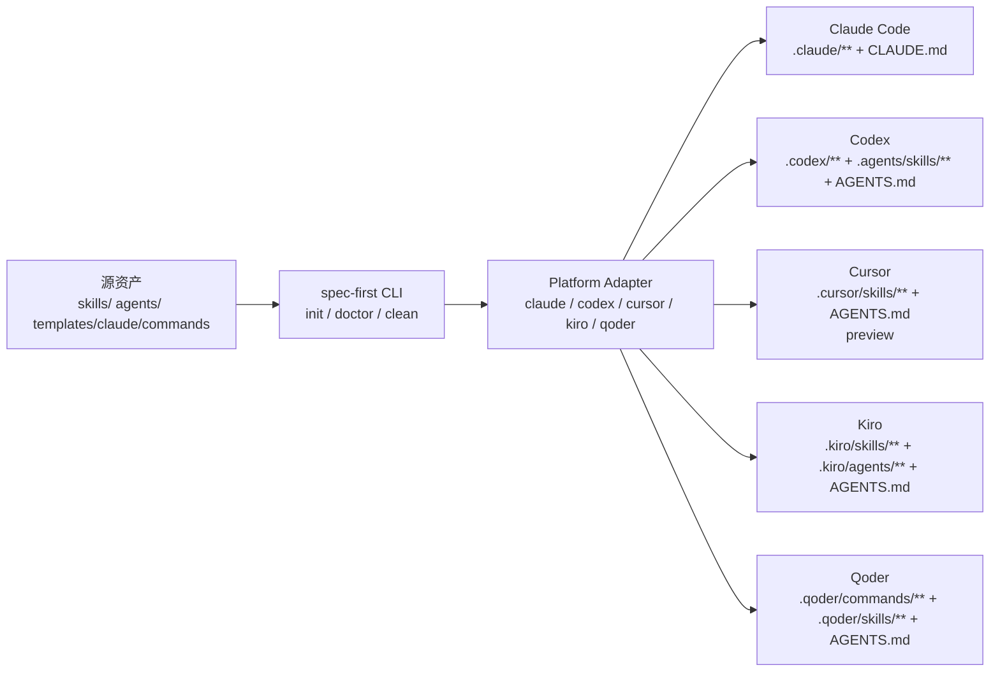
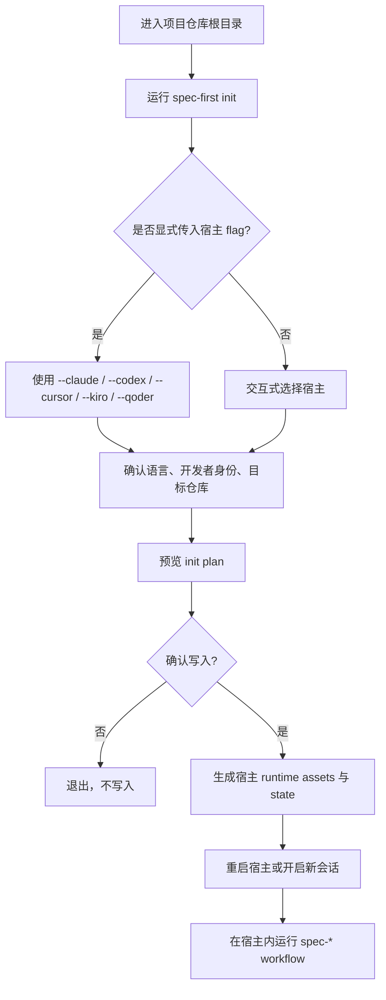

本页位于入门指南的第 8 篇，当前导航位置是 **[多宿主使用指南：Claude Code、Codex、Cursor、Kiro 与 Qoder](8-duo-su-zhu-shi-yong-zhi-nan-claude-code-codex-cursor-kiro-yu-qoder)**；它只回答一个问题：同一套 spec-first workflow 如何投影到 Claude Code、Codex、Cursor、Kiro 与 Qoder 五种宿主 runtime，以及开发者在安装、初始化、检查、运行与清理时应该如何选择宿主。Sources: [index.js](src/cli/index.js#L158-L174), [adapters/index.js](src/cli/adapters/index.js#L1-L40)

## 架构假设与验证结论

架构假设是：spec-first 的源资产不是直接绑定某个 AI IDE，而是通过 **Platform Adapter** 投影到不同宿主的 runtime surface；CLI 只暴露统一命令，例如 `doctor`、`init`、`clean`、`update`，而宿主内的 `spec-*` workflow 入口由初始化后的宿主加载。代码验证支持这个假设：CLI help 明确声明支持 Claude Code、Codex、Kiro、Qoder 和 Cursor generated-runtime preview，并把 `init`、`doctor`、`clean` 的宿主 flag 作为统一入口；adapter 注册表同时注册 `claude`、`codex`、`cursor`、`kiro`、`qoder` 五个实现。Sources: [index.js](src/cli/index.js#L158-L174), [adapters/index.js](src/cli/adapters/index.js#L1-L40)



上图中的关键边界是：源资产由 package 内部清单与 governance 约束管理，adapter 决定每个宿主的目录、命令文件名、技能路径、agent 支持与内容转换规则；因此你不需要手工复制 prompt，而应通过 `spec-first init` 让 CLI 生成可重建的 runtime copies。Sources: [plugin.js](src/cli/plugin.js#L25-L36), [base.js](src/cli/adapters/base.js#L1-L40), [commands/init.js](src/cli/commands/init.js#L200-L264)

## 什么时候选哪个宿主

如果你只是想快速完成第一次验证，非交互 `spec-first init -y` 的默认宿主是 Claude Code 与 Codex；Cursor、Kiro、Qoder 需要在交互选择中勾选，或使用显式 flag，例如 `--cursor`、`--kiro`、`--qoder`。这个默认选择来自 `INIT_PLATFORM_CHOICES`：Claude Code 与 Codex 的 `defaultForYes` 为 `true`，Cursor、Kiro、Qoder 的 `defaultForYes` 为 `false`；`defaultInitPlatforms()` 只返回 `defaultForYes` 的宿主。Sources: [commands/init.js](src/cli/commands/init.js#L77-L113), [commands/init.js](src/cli/commands/init.js#L580-L584)

| 宿主 | 推荐使用场景 | 初始化方式 | 主要 runtime surface | 当前约束 |
|---|---|---|---|---|
| Claude Code | 首次试用、需要命令入口与 Claude hooks 的项目 | `spec-first init --claude` 或交互选择 | `.claude/commands`、`.claude/skills`、`.claude/agents`、`CLAUDE.md` | 会写入并检查 managed hooks |
| Codex | 希望通过 `.agents/skills` 发现 workflow 的项目 | `spec-first init --codex` 或交互选择 | `.agents/skills`、`.codex/agents`、`.codex/spec-first`、`AGENTS.md` | 不生成 command entrypoints；项目层 hook 有 CODEX_HOME 避让逻辑 |
| Cursor | 想试用 Cursor generated-runtime preview 的项目 | `spec-first init --cursor` 或交互选择 | `.cursor/skills`、`.cursor/spec-first`、`AGENTS.md` | preview；不投影 agents；doctor 会提示加载证据未验证 |
| Kiro | 需要 Kiro skill 与 agent surface 的项目 | `spec-first init --kiro` 或交互选择 | `.kiro/skills`、`.kiro/agents`、`.kiro/spec-first`、`AGENTS.md` | 不生成 command entrypoints；使用 skill runtime |
| Qoder | 需要 Qoder command 与 agent surface 的项目 | `spec-first init --qoder` 或交互选择 | `.qoder/commands`、`.qoder/skills`、`.qoder/agents`、`AGENTS.md` | 会清理 retired `.qoder/commands/spec` namespace |

Sources: [claude.js](src/cli/adapters/claude.js#L43-L82), [codex.js](src/cli/adapters/codex.js#L27-L75), [cursor.js](src/cli/adapters/cursor.js#L58-L101), [kiro.js](src/cli/adapters/kiro.js#L32-L71), [qoder.js](src/cli/adapters/qoder.js#L34-L73)

## 初始化流程

初始化的用户路径是：先运行 `spec-first init`，选择一个或多个宿主，确认开发者姓名与语言，再确认写入；README 的快速开始也明确要求初始化后重启宿主或打开新会话，因为 workflow 入口是在宿主会话中运行，而不是 shell 命令。Sources: [README.zh-CN.md](README.zh-CN.md#L74-L93), [commands/init.js](src/cli/commands/init.js#L126-L145)



`init` 支持 `--claude`、`--codex`、`--cursor`、`--kiro`、`--qoder`、`-y/--yes`、`--dry-run`、`--repo`、`--all-repos`、`--lang zh|en` 等参数；解析阶段会禁止未知参数、禁止同时使用 `--repo` 与 `--all-repos`，并要求 `--lang` 只能是 `zh` 或 `en`。Sources: [commands/init.js](src/cli/commands/init.js#L276-L388)

常用初始化命令如下；如果你还在评估阶段，建议先使用 `--dry-run` 看写入计划，再移除 `--dry-run` 执行真实写入。Sources: [commands/init.js](src/cli/commands/init.js#L218-L231), [commands/init.js](src/cli/commands/init.js#L233-L264)

| 目标 | 命令 |
|---|---|
| 交互式选择宿主 | `spec-first init` |
| 默认非交互初始化 Claude Code + Codex | `spec-first init -y` |
| 只初始化 Claude Code | `spec-first init --claude` |
| 只初始化 Codex | `spec-first init --codex` |
| 只初始化 Cursor preview | `spec-first init --cursor` |
| 只初始化 Kiro | `spec-first init --kiro` |
| 只初始化 Qoder | `spec-first init --qoder` |
| 预览写入计划 | `spec-first init --claude --dry-run` |

Sources: [commands/init.js](src/cli/commands/init.js#L77-L113), [commands/init.js](src/cli/commands/init.js#L301-L374)

## 生成后的项目结构

初始化后，你会看到宿主自己的 runtime 目录，以及 spec-first 管理状态文件；这些目录是生成物，可以通过再次运行 `spec-first init` 重建，不建议手工维护。Claude 使用 `.claude/spec-first/state.json`，Codex 使用 `.codex/spec-first/state.json`，Cursor 使用 `.cursor/spec-first/state.json`，Kiro 使用 `.kiro/spec-first/state.json`，Qoder 使用 `.qoder/spec-first/state.json`。Sources: [claude.js](src/cli/adapters/claude.js#L48-L82), [codex.js](src/cli/adapters/codex.js#L41-L75), [cursor.js](src/cli/adapters/cursor.js#L63-L101), [kiro.js](src/cli/adapters/kiro.js#L37-L71), [qoder.js](src/cli/adapters/qoder.js#L39-L73)

```text
project-root/
├── CLAUDE.md                         # Claude Code 指令文件
├── AGENTS.md                         # Codex / Cursor / Kiro / Qoder 指令文件
├── .claude/
│   ├── commands/
│   ├── skills/
│   ├── agents/
│   ├── hooks/
│   └── spec-first/state.json
├── .codex/
│   ├── agents/
│   ├── hooks/
│   ├── hooks.json
│   └── spec-first/state.json
├── .agents/
│   └── skills/                       # Codex workflow skill surface
├── .cursor/
│   ├── skills/
│   └── spec-first/state.json
├── .kiro/
│   ├── skills/
│   ├── agents/
│   └── spec-first/state.json
└── .qoder/
    ├── commands/
    ├── skills/
    ├── agents/
    └── spec-first/state.json
```

不同宿主的结构差异来自 adapter 的属性定义，而不是用户偏好：Claude 与 Qoder 有 command surface，Codex、Cursor、Kiro 的 `hasCommands` 为 `false`；Cursor 的 `supportsAgents` 为 `false`，所以它不会投影 spec-first agents。Sources: [base.js](src/cli/adapters/base.js#L34-L48), [codex.js](src/cli/adapters/codex.js#L49-L63), [cursor.js](src/cli/adapters/cursor.js#L71-L93), [kiro.js](src/cli/adapters/kiro.js#L45-L63), [qoder.js](src/cli/adapters/qoder.js#L47-L65)

## 五个宿主的运行入口差异

Claude Code 会把 workflow command 渲染为 `.claude/commands/spec-<name>.md`，并把 workflow skill backing files 放在 `.claude/spec-first/workflows/<skill>`；同时它会写入 managed hooks，包括 SessionStart、spec-plan guard、PRD prewrite guard、PRD readiness guard。Sources: [claude.js](src/cli/adapters/claude.js#L17-L38), [claude.js](src/cli/adapters/claude.js#L56-L82), [claude.js](src/cli/adapters/claude.js#L184-L199)

Codex 的支持是 project-scoped：用户可见 workflow entrypoints 从 `.agents/skills/` 发现，`.codex/commands/spec/` 只是 legacy compatibility cleanup target，reusable reviewer/research agent profiles 位于 `.codex/agents/`，state 位于 `.codex/spec-first/`。Sources: [codex.js](src/cli/adapters/codex.js#L27-L35), [codex.js](src/cli/adapters/codex.js#L49-L75)

Cursor 当前是 generated-runtime preview：它生成 `.cursor/skills/**` 下的 spec-* workflow runtime，不生成 command files，也不投影 agents；doctor 会产生 warning，提示 Cursor skill discovery/invocation 在本机未验证，必须通过 Cursor runtime UI 或当前 Cursor CLI/user journey 留下 loader evidence 后，才能提升到更高置信度。Sources: [cursor.js](src/cli/adapters/cursor.js#L71-L101), [cursor.js](src/cli/adapters/cursor.js#L133-L144), [README.zh-CN.md](README.zh-CN.md#L84-L87)

Kiro 使用 `.kiro/skills` 作为 workflow skill surface，`.kiro/agents` 作为 agent surface，不生成 command entrypoints；adapter 会把跨宿主路径重写到 `.kiro/skills/**`、`.kiro/agents/**` 与 `.kiro/spec-first/**`。Sources: [kiro.js](src/cli/adapters/kiro.js#L45-L86), [kiro.js](src/cli/adapters/kiro.js#L157-L193)

Qoder 同时有 `.qoder/commands`、`.qoder/skills` 与 `.qoder/agents`：workflow command 文件名渲染为 `spec-<name>.md`，command 内容会根据 skill body 与 frontmatter 重新生成 Qoder command 文档；同时 Qoder clean/removal 计划会清理 retired `.qoder/commands/spec` namespace。Sources: [qoder.js](src/cli/adapters/qoder.js#L47-L73), [qoder.js](src/cli/adapters/qoder.js#L75-L112), [qoder.js](src/cli/adapters/qoder.js#L175-L186)

## 健康检查与可运行性判断

运行 `spec-first doctor` 可以检查公共环境、宿主 CLI、runtime asset manifest、managed runtime assets 与宿主特定 drift；如果没有显式传入宿主 flag，doctor 会自动检测当前项目中已初始化的平台。Sources: [commands/doctor.js](src/cli/commands/doctor.js#L28-L68), [commands/doctor.js](src/cli/commands/doctor.js#L75-L103)

| 检查目标 | 命令 | 说明 |
|---|---|---|
| 自动检测当前项目所有已初始化宿主 | `spec-first doctor` | 无 flag 时自动检测 |
| 只检查 Claude Code | `spec-first doctor --claude` | 包括 `.claude/**`、hooks、settings |
| 只检查 Codex | `spec-first doctor --codex` | 包括 `.agents/skills`、`.codex/**`、Codex hooks |
| 只检查 Cursor | `spec-first doctor --cursor` | 会显示 generated-runtime preview warning |
| 只检查 Kiro | `spec-first doctor --kiro` | 包括 `.kiro/skills` 与 `.kiro/agents` shape |
| 只检查 Qoder | `spec-first doctor --qoder` | 包括 `.qoder/commands`、skills、agents |
| 输出机器可读报告 | `spec-first doctor --json` | JSON 包含 install、runtime、readiness 与 runnability |

Sources: [commands/doctor.js](src/cli/commands/doctor.js#L37-L55), [commands/doctor.js](src/cli/commands/doctor.js#L537-L552)

doctor 对宿主 CLI 的检测命令是固定映射：Codex 检查 `codex --version`，Cursor 检查 `agent --version`，Kiro 检查 `kiro --version`，Qoder 检查 `qodercli --version`，Claude Code 检查 `claude --version`；找不到宿主 CLI 时是 WARNING，而不是直接阻断所有检查。Sources: [commands/doctor.js](src/cli/commands/doctor.js#L148-L200)

doctor 的 workflow runnability 不是简单看文件是否存在：它会综合 runtime assets、host readiness、managed state、workflow surface 与 verification evidence；当 runtime 与 surface 就绪但缺少新鲜且 schema-valid 的 execution evidence 时，状态会落到 `simulated`，而不是 `verified`。Sources: [commands/doctor.js](src/cli/commands/doctor.js#L555-L645), [commands/doctor.js](src/cli/commands/doctor.js#L665-L699)

## 在宿主内运行 workflow

完成初始化并重启宿主后，workflow 入口应在 Claude Code、Codex、Kiro、Qoder 或 Cursor 会话中运行，而不是在终端 shell 中运行；README 的第一个示例是 `spec-brainstorm "描述你的第一个任务"`，完成后可检查 `docs/brainstorms/YYYY-MM-DD-NNN-<topic>-requirements.md`。Sources: [README.zh-CN.md](README.zh-CN.md#L90-L111)

```text
# 在任意已初始化的受支持宿主会话中输入
spec-brainstorm "描述你的第一个任务"
```

如果宿主提示缺少 helper 或 MCP readiness facts，应先在当前宿主运行统一入口 `spec-mcp-setup`；这个准备步骤属于宿主内 workflow 入口，不是本页展开的 MCP 配置细节。Sources: [README.zh-CN.md](README.zh-CN.md#L80-L84), [README.zh-CN.md](README.zh-CN.md#L33-L35)

## 清理某个宿主的生成物

如果你要移除某个宿主的 spec-first managed assets，使用 `spec-first clean --<host>`；clean 一次只允许指定一个宿主 flag，且只删除 state 中记录的 managed assets，自定义资产会保留。Sources: [commands/clean.js](src/cli/commands/clean.js#L43-L56), [commands/clean.js](src/cli/commands/clean.js#L102-L114)

| 目标 | 命令 |
|---|---|
| 清理 Claude Code runtime | `spec-first clean --claude` |
| 清理 Codex runtime | `spec-first clean --codex` |
| 清理 Cursor runtime | `spec-first clean --cursor` |
| 清理 Kiro runtime | `spec-first clean --kiro` |
| 清理 Qoder runtime | `spec-first clean --qoder` |
| 预览清理计划 | `spec-first clean --claude --dry-run` |

Sources: [commands/clean.js](src/cli/commands/clean.js#L125-L164), [commands/clean.js](src/cli/commands/clean.js#L102-L110)

如果 clean 读不到 state，CLI 会提示先重新运行对应宿主的 `spec-first init` 以再生 state；如果是 Claude，clean 前还会验证 `.claude/settings.json` 是否为合法 JSON。Sources: [commands/clean.js](src/cli/commands/clean.js#L58-L81), [commands/clean.js](src/cli/commands/clean.js#L88-L100)

## 多宿主共存时的注意事项

同一个仓库可以初始化多个宿主，交互式 `init` 会让你多选宿主，并会记录上次选择；后续交互运行时会预勾选已记录且当前仍受支持的 host id。Sources: [commands/init.js](src/cli/commands/init.js#L433-L448), [commands/init.js](src/cli/commands/init.js#L586-L599)

多宿主共存的核心规则是：不要把一个宿主的 runtime 文件手工复制到另一个宿主目录中。每个 adapter 都有自己的路径重写与 frontmatter 规范，例如 Cursor、Kiro、Qoder 都会把其他宿主路径重写成自己的 `.cursor/skills/**`、`.kiro/skills/**` 或 `.qoder/commands/**`/`.qoder/skills/**` 形式。Sources: [cursor.js](src/cli/adapters/cursor.js#L181-L200), [kiro.js](src/cli/adapters/kiro.js#L157-L193), [qoder.js](src/cli/adapters/qoder.js#L193-L200)

用户语言同步目前只覆盖 Claude 与 Codex 两个 host；`USER_LANGUAGE_HOSTS` 明确是 `['codex', 'claude']`，启用时会根据平台列表构建对应宿主的全局语言偏好写入计划。Sources: [user-language-sync.js](src/cli/user-language-sync.js#L26-L47), [user-language-sync.js](src/cli/user-language-sync.js#L104-L120)

## 故障排查速查

最常见的问题不是 workflow 本身失败，而是宿主 runtime 未加载、资产 drift、宿主 CLI 不在 PATH、Cursor preview 未有加载证据、或 clean 前 state 缺失；优先顺序是先运行 `spec-first doctor --<host>`，再按 fix 提示重新 `init`，最后重启宿主会话。Sources: [commands/doctor.js](src/cli/commands/doctor.js#L75-L103), [commands/doctor.js](src/cli/commands/doctor.js#L203-L303), [commands/clean.js](src/cli/commands/clean.js#L58-L81)

| 现象 | 可能原因 | 建议动作 |
|---|---|---|
| 宿主内看不到 `spec-*` workflow | runtime assets 未生成或宿主未重启 | 运行 `spec-first doctor --<host>`，再运行 `spec-first init --<host>` 并重启宿主 |
| doctor 提示 command 或 skill missing/drifted | 生成物缺失或被手工修改 | 重新运行对应宿主 `spec-first init --<host>` |
| doctor 提示宿主 CLI not found on PATH | 宿主 CLI 未安装或 shell 未刷新 | 安装对应 CLI，重启 shell，再运行 `doctor` |
| Cursor 有 preview warning | Cursor skill discovery/invocation 未在本机验证 | 通过 Cursor runtime UI 或当前 CLI/user journey 记录 loader evidence |
| clean 报 state 读取失败 | state 文件缺失或不可读 | 先重新 `spec-first init --<host>` 再 `clean` |
| Codex 全局 hook 相关异常 | 在 CODEX_HOME 目录中运行项目级 hook 写入会造成污染风险 | 使用 Codex adapter 的 CODEX_HOME 避让逻辑，并按 doctor 提示修复 |

Sources: [commands/doctor.js](src/cli/commands/doctor.js#L148-L200), [commands/doctor.js](src/cli/commands/doctor.js#L203-L303), [cursor.js](src/cli/adapters/cursor.js#L139-L144), [codex.js](src/cli/adapters/codex.js#L139-L155), [commands/clean.js](src/cli/commands/clean.js#L58-L81)

## 阅读路径

如果你还没有安装，请先回到 [安装、环境检查与宿主初始化](4-an-zhuang-huan-jing-jian-cha-yu-su-zhu-chu-shi-hua)；如果你已经完成初始化，下一步建议阅读 [第一次工作流走查：从需求到仓库产物](5-di-ci-gong-zuo-liu-zou-cha-cong-xu-qiu-dao-cang-ku-chan-wu) 与 [工作流入口速查与任务路由](6-gong-zuo-liu-ru-kou-su-cha-yu-ren-wu-lu-you)；如果你想理解 adapter 背后的实现，再继续阅读 [宿主适配器设计：统一源资产到不同 Runtime Surface 的投影](17-su-zhu-gua-pei-qi-she-ji-tong-yuan-zi-chan-dao-bu-tong-runtime-surface-de-tou-ying) 与 [运行时健康检查与 Drift 检测](18-yun-xing-shi-jian-kang-jian-cha-yu-drift-jian-ce)。Sources: [README.zh-CN.md](README.zh-CN.md#L36-L88), [README.zh-CN.md](README.zh-CN.md#L90-L123), [adapters/index.js](src/cli/adapters/index.js#L1-L40), [commands/doctor.js](src/cli/commands/doctor.js#L28-L68)