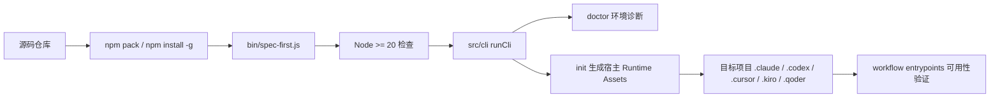
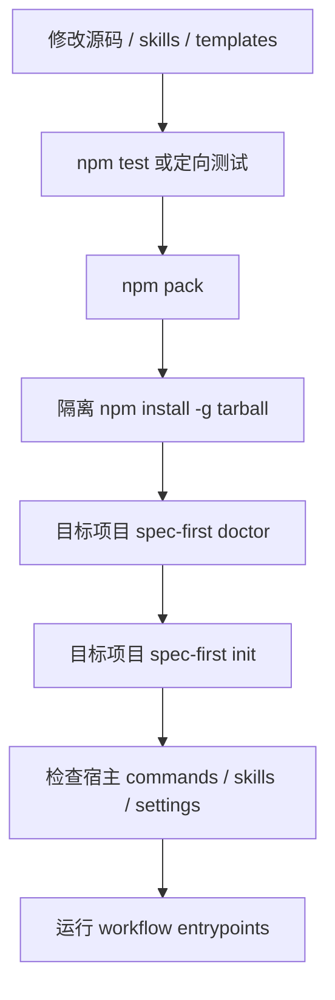

本页说明 **spec-first 仓库本地源码安装、开发验证与调试闭环**：核心结论是，本仓库已经切换为 **npm CLI 模型**，源码开发时不再把当前仓库注册成 Claude plugin，而是通过 `npm pack`、全局安装 tarball、`spec-first doctor` 与 `spec-first init` 来验证真实安装体验。Sources: [install-local.sh](install-local.sh#L1-L35), [dev-reload.sh](dev-reload.sh#L1-L13)

## 架构假设与验证结论

本地开发的第一性原理不是“把源码目录直接塞进宿主运行时”，而是验证 **发布包会如何被用户安装、CLI 会如何生成 runtime assets、宿主目录中会出现哪些可检查产物**。`package.json` 将 `spec-first` 暴露为全局命令，入口文件是 `bin/spec-first.js`；入口文件先检查 Node 版本，再把参数交给 `src/cli` 的 `runCli` 分发。Sources: [package.json](package.json#L1-L14), [bin/spec-first.js](bin/spec-first.js#L1-L24)



这张图的验证依据是：CLI 入口在 `bin/spec-first.js` 中调用 `ensureSupportedNodeVersion()` 与 `runCli(argv)`；CLI 分发层支持 `doctor`、`init`、`clean`、`update`、`tasks`、`session` 等包级命令；`init` 支持 Claude、Codex、Cursor、Kiro 与 Qoder 宿主选择。Sources: [bin/spec-first.js](bin/spec-first.js#L5-L16), [src/cli/index.js](src/cli/index.js#L19-L80), [src/cli/index.js](src/cli/index.js#L158-L182)

## 本地源码安装的推荐路径

如果你的目标只是使用 spec-first，应优先执行 `npm install -g spec-first`，然后在目标项目运行 `spec-first doctor` 与 `spec-first init`；如果你的目标是验证当前源码仓库的发布物，则执行 `npm pack`，再安装生成的 `spec-first-<version>.tgz`，最后在目标项目执行 `doctor`、`init` 并检查生成的宿主 assets。Sources: [install-local.sh](install-local.sh#L6-L32), [tests/smoke/install-tarball.sh](tests/smoke/install-tarball.sh#L28-L48)

```bash
# 在 spec-first 源码仓库中
npm install
npm pack

# 安装本地发布物，文件名以 npm pack 输出为准
npm install -g ./spec-first-<version>.tgz

# 到你的目标项目中验证
spec-first doctor
spec-first init
```

本地源码安装的关键不是 `install-local.sh` 直接执行安装，而是它明确提示当前仓库采用 npm CLI 模型，并给出 tarball 验证流程；对应的 smoke test 会断言脚本输出包含 `npm install -g spec-first`、`spec-first init`、宿主选择提示，并确认不再输出旧的 Claude plugin 缓存路径。Sources: [install-local.sh](install-local.sh#L6-L35), [tests/smoke/install-local.sh](tests/smoke/install-local.sh#L15-L36)

## 最小环境要求

运行 CLI 前必须满足 Node.js 版本要求：`package.json` 声明 `node >=20.0.0`，入口层也会通过 `ensureSupportedNodeVersion()` 检查当前版本；如果版本不满足，会输出 `spec-first requires Node.js >=20.0.0`、当前 Node 版本，以及安装 Node 20 或更新版本的修复建议。Sources: [package.json](package.json#L112-L117), [src/cli/node-version.js](src/cli/node-version.js#L1-L42)

| 项目 | 要求或行为 | 验证依据 |
|---|---|---|
| Node.js | 需要 `>=20.0.0` | [package.json](package.json#L112-L117), [src/cli/node-version.js](src/cli/node-version.js#L3-L20) |
| CLI 入口 | 全局命令名为 `spec-first`，入口为 `bin/spec-first.js` | [package.json](package.json#L6-L14) |
| 包类型 | CommonJS；入口脚本通过 `require()` 加载 CLI | [package.json](package.json#L5-L14), [bin/spec-first.js](bin/spec-first.js#L3-L16) |
| 测试依赖 | Jest 是开发依赖 | [package.json](package.json#L115-L117) |

## 本地开发目录视图

本地调试时最常接触的是 CLI 入口、源码命令分发、宿主模板、skills、测试脚本与发布包校验脚本；`package.json` 的 `files` 字段决定 npm 发布包会包含 `bin/`、`src/`、`agents/`、`skills/`、`templates/`、部分 docs/contracts 与 scripts，而不是整个工作区的所有开发材料。Sources: [package.json](package.json#L37-L83)

```text
spec-first/
├── bin/
│   └── spec-first.js              # npm bin 入口
├── src/
│   └── cli/                       # CLI 命令、初始化、宿主适配、状态管理
├── skills/                        # 打包进入 npm 包的 Skill 资产
├── templates/                     # init 投影到宿主 runtime 的模板
├── agents/                        # 打包进入 npm 包的 Agent 支持文件
├── scripts/                       # 测试、发布、同步、质量门禁脚本
├── tests/
│   ├── unit/
│   ├── integration/
│   └── smoke/
├── install-local.sh               # 本地安装说明脚本
└── dev-reload.sh                  # 开发验证提示脚本
```

发布物校验脚本会检查 tarball 内容：必须包含当前 workflow assets 与关键宿主适配器，例如 `skills/spec-skill-audit/SKILL.md`、`templates/claude/commands/spec/skill-audit.md`、`skills/spec-mcp-setup/SKILL.md`、`templates/claude/commands/spec/mcp-setup.md`、`src/cli/adapters/cursor.js`、`src/cli/adapters/kiro.js` 与 `src/cli/adapters/qoder.js`。Sources: [tests/smoke/install-tarball.sh](tests/smoke/install-tarball.sh#L72-L80), [tests/smoke/install-tarball.sh](tests/smoke/install-tarball.sh#L172-L205)

## 开发验证流程

开发模式下，`dev-reload.sh` 不做热重载注入，而是提醒按 npm CLI 模型重新验证：安装 CLI、在目标项目运行 `doctor`、运行 `init` 并选择宿主、检查 `.claude/commands/spec/` 与 `.claude/skills/`；如果要验证本地发布物，应先执行 `npm pack`。Sources: [dev-reload.sh](dev-reload.sh#L1-L13)



这条流程与仓库内 release-install smoke test 对齐：脚本会先 `npm pack`，再把 tarball 安装到临时 npm prefix，随后验证全局 shim、`spec-first -v`、空目录中的 `spec-first doctor` 输出，以及全局包内容。Sources: [tests/smoke/install-tarball.sh](tests/smoke/install-tarball.sh#L28-L48), [tests/smoke/install-tarball.sh](tests/smoke/install-tarball.sh#L82-L148), [tests/smoke/install-tarball.sh](tests/smoke/install-tarball.sh#L151-L213)

## 常用 npm 脚本

本仓库的 npm scripts 将开发验证拆成 lint、指令同步、runtime capability catalog 生成、类型检查、打包 dry-run、单元测试、smoke test、集成测试、AI Dev quality gate 与发布检查；本地开发时通常先跑定向测试，再在改动触及安装体验时跑 release install 类验证。Sources: [package.json](package.json#L15-L36), [scripts/run-test-suite.cjs](scripts/run-test-suite.cjs#L126-L156)

| 命令 | 用途 | 何时使用 | 来源 |
|---|---|---|---|
| `npm run lint` | 执行 skill entrypoint lint | 修改 workflow/skill 入口后 | [package.json](package.json#L15-L18) |
| `npm run typecheck` | 执行 JS 类型检查脚本 | 修改 `src/` 或脚本后 | [package.json](package.json#L18-L21) |
| `npm run build` | `npm pack --dry-run` | 预览发布包内容 | [package.json](package.json#L20-L22) |
| `npm run test:unit` | 运行 unit suite | 日常开发主验证 | [package.json](package.json#L23-L31), [scripts/run-test-suite.cjs](scripts/run-test-suite.cjs#L69-L75) |
| `npm run test:smoke` | 运行 smoke suite | 验证 CLI 基本行为与本地安装说明 | [package.json](package.json#L25-L31), [scripts/run-test-suite.cjs](scripts/run-test-suite.cjs#L85-L92) |
| `npm run test:integration` | 运行集成测试 | 修改验证门禁或 closeout producer 后 | [package.json](package.json#L26-L31), [scripts/run-test-suite.cjs](scripts/run-test-suite.cjs#L94-L100) |
| `npm run test:release:install` | 运行 tarball 安装验证 | 发布前或安装链路改动后 | [package.json](package.json#L32-L35), [scripts/run-test-suite.cjs](scripts/run-test-suite.cjs#L107-L113) |

## CLI 调试入口

调试 CLI 分发时，从 `node bin/spec-first.js --help`、`node bin/spec-first.js --version`、`node bin/spec-first.js doctor` 开始；smoke test 就是用源码入口直接检查 help/version 输出、未知命令路径、空目录 `doctor` 输出以及 `init` 在非 TTY 下的拒绝行为。Sources: [tests/smoke/cli.sh](tests/smoke/cli.sh#L146-L181), [tests/smoke/cli.sh](tests/smoke/cli.sh#L183-L200)

```bash
# 不安装全局包，直接用源码入口调试
node bin/spec-first.js --help
node bin/spec-first.js --version
node bin/spec-first.js doctor
node bin/spec-first.js init --help
```

`runCli()` 的分发逻辑清晰区分帮助、版本、startup reminder、doctor、init、clean、update、tasks、repair-worktree、session 与 internal；未知命令会输出 `Unknown command`，并提示运行 `spec-first --help` 查看可用包级命令。Sources: [src/cli/index.js](src/cli/index.js#L19-L80), [src/cli/index.js](src/cli/index.js#L158-L190)

## init 调试：交互、非交互与 dry-run

`spec-first init` 默认要求交互式终端；如果没有 TTY，除非使用 `-y/--yes` 并指定默认或显式宿主，否则会返回错误。它支持 `--claude`、`--codex`、`--cursor`、`--kiro`、`--qoder`、`--dry-run`、`--all-repos`、`--repo`、`--user`、`--lang`、`--sync-user-language` 与 `--no-sync-user-language` 等参数。Sources: [src/cli/commands/init.js](src/cli/commands/init.js#L115-L150), [src/cli/commands/init.js](src/cli/commands/init.js#L276-L389)

```bash
# 预览 Claude runtime assets 写入计划
node bin/spec-first.js init --claude --dry-run

# 非交互初始化 Claude runtime
node bin/spec-first.js init --claude -y --user "Your Name" --lang zh

# 指定子仓库初始化
node bin/spec-first.js init --repo ./packages/app --claude --dry-run
```

`init` 的内部执行顺序是收集输入、构建 init plans、构建用户语言同步计划、打印诊断、收集错误、在 `--dry-run` 下打印预览，非 dry-run 时应用 `applyInitPlan()`，最后根据各平台输出下一步提示。Sources: [src/cli/commands/init.js](src/cli/commands/init.js#L178-L267)

## programmatic init 调试

如果你要在测试或脚本中绕过交互层，可以使用 `spec-first/src/cli/init-plan` 暴露的 `buildInitPlan` 与 `applyInitPlan`；该导出由 `src/cli/init-plan.js` 转发，并且 tarball 安装验证会通过 package exports 断言这两个 API 可被 `require()` 到。Sources: [src/cli/init-plan.js](src/cli/init-plan.js#L1-L10), [tests/smoke/install-tarball.sh](tests/smoke/install-tarball.sh#L207-L213)

```js
const { buildInitPlan, applyInitPlan } = require('spec-first/src/cli/init-plan');

const plan = buildInitPlan({
  projectRoot: process.cwd(),
  workspaceRoot: process.cwd(),
  platform: 'claude',
  name: 'Local Developer',
  lang: 'zh',
  target: { mode: 'single-repo', projectRoot: process.cwd() },
  dryRun: true,
  gitRootTopology: 'single-repo',
});
```

仓库的 CLI smoke test 使用同一 programmatic 入口构造 plan：传入 `projectRoot`、`workspaceRoot`、`platform`、`name`、`lang`、`target`、`dryRun` 与 `gitRootTopology`，当 plan 有 errors 时直接失败，否则 dry-run 打印预览，apply 模式调用 `applyInitPlan(projectRoot, plan)`。Sources: [tests/smoke/cli.sh](tests/smoke/cli.sh#L95-L143)

## doctor 调试与环境诊断

`spec-first doctor` 会在当前目录检测已初始化的平台；如果没有检测到 spec-first 平台，它会提示运行 `spec-first init` 并选择 Claude Code、Codex、Cursor、Kiro 或 Qoder。传入宿主参数时，它会构建对应平台的检查报告；传入 `--json` 时输出 JSON 报告。Sources: [src/cli/commands/doctor.js](src/cli/commands/doctor.js#L28-L73), [tests/smoke/cli.sh](tests/smoke/cli.sh#L170-L181)

```bash
node bin/spec-first.js doctor
node bin/spec-first.js doctor --json
node bin/spec-first.js doctor --claude
node bin/spec-first.js doctor --codex
```

doctor 的公共检查包括 Node.js 与 Git：Node.js 需要 20 或以上；Git 检查通过 `git --version`，失败时会提示安装 Git 或检查 PATH；宿主 CLI 检查会根据平台调用 `claude`、`codex`、`agent`、`kiro` 或 `qodercli --version`。Sources: [src/cli/commands/doctor.js](src/cli/commands/doctor.js#L106-L146), [src/cli/commands/doctor.js](src/cli/commands/doctor.js#L148-L200)

## 发布物安装验证

`tests/smoke/install-tarball.sh` 是最接近真实用户安装体验的脚本：它在临时目录中打包 tarball、隔离 npm prefix 与 cache、全局安装 tarball、验证安装日志、检查全局 shim、运行 `spec-first -v` 与空目录 `doctor`，最后检查全局包内容与 package exports。Sources: [tests/smoke/install-tarball.sh](tests/smoke/install-tarball.sh#L1-L27), [tests/smoke/install-tarball.sh](tests/smoke/install-tarball.sh#L82-L148), [tests/smoke/install-tarball.sh](tests/smoke/install-tarball.sh#L151-L213)

```bash
# 发布前或安装链路改动后执行
npm run test:release:install

# 等价底层脚本
bash tests/smoke/install-tarball.sh
```

该脚本还会防止发布包带入不应存在的内容：例如 native parser 依赖、`.claude-plugin` 生成物、Python bytecode 缓存、已删除的 standards skill 或旧 command template；这能避免“源码仓库可用但发布包污染”的问题。Sources: [tests/smoke/install-tarball.sh](tests/smoke/install-tarball.sh#L47-L80)

## 调试前后对照

本仓库当前的本地安装策略已经从旧式 plugin/shim 思路转向 npm CLI 与 tarball 真实安装验证；因此当你发现旧文档或本地 shell 缓存仍指向历史路径时，应重开终端或执行 `hash -r`，再按 `npm pack` 与 `npm install -g ./spec-first-<version>.tgz` 重新验证。Sources: [install-local.sh](install-local.sh#L22-L34)

| 场景 | 不推荐做法 | 推荐做法 | 来源 |
|---|---|---|---|
| 验证源码安装 | 假设 `install-local.sh` 会把仓库注册为插件 | 用 `npm pack` 生成 tarball 后全局安装 | [install-local.sh](install-local.sh#L26-L34), [tests/smoke/install-tarball.sh](tests/smoke/install-tarball.sh#L28-L48) |
| 调试 CLI | 直接修改全局已安装包 | 使用 `node bin/spec-first.js ...` 调源码入口 | [bin/spec-first.js](bin/spec-first.js#L1-L24), [tests/smoke/cli.sh](tests/smoke/cli.sh#L146-L168) |
| 验证 init | 只看文件是否复制 | 使用 `--dry-run`、programmatic plan 与 smoke test 检查 plan/apply 行为 | [src/cli/commands/init.js](src/cli/commands/init.js#L218-L267), [tests/smoke/cli.sh](tests/smoke/cli.sh#L95-L143) |
| 发布前检查 | 只跑单元测试 | 加跑 tarball install smoke | [scripts/run-test-suite.cjs](scripts/run-test-suite.cjs#L107-L118), [tests/smoke/install-tarball.sh](tests/smoke/install-tarball.sh#L82-L148) |

## 常见问题与排查

如果 `spec-first` 命令仍指向旧路径，先重开终端或执行 `hash -r`，因为 shell 可能缓存了旧的全局 shim；随后重新运行 `spec-first doctor` 与 `spec-first init` 验证当前 npm CLI 路径。Sources: [install-local.sh](install-local.sh#L22-L24)

如果 `init` 在脚本环境失败，检查是否缺少 TTY；非交互模式需要使用 `-y/--yes`，并确保有默认宿主 runtime 或显式指定 `--claude`、`--codex`、`--cursor`、`--kiro`、`--qoder`。Sources: [src/cli/commands/init.js](src/cli/commands/init.js#L138-L150), [tests/smoke/cli.sh](tests/smoke/cli.sh#L183-L200)

如果发布包验证失败，优先查看 `tests/smoke/install-tarball.sh` 的 pack list、install log、shim 检查与全局包内容检查；这些步骤分别覆盖打包内容、安装日志、CLI 可执行性与 runtime assets 是否进入包。Sources: [tests/smoke/install-tarball.sh](tests/smoke/install-tarball.sh#L47-L80), [tests/smoke/install-tarball.sh](tests/smoke/install-tarball.sh#L100-L148), [tests/smoke/install-tarball.sh](tests/smoke/install-tarball.sh#L151-L205)

## 下一步阅读

完成本页后，如果你要把本地安装后的 CLI 用到真实项目，请继续阅读 [安装、环境检查与宿主初始化](4-an-zhuang-huan-jing-jian-cha-yu-su-zhu-chu-shi-hua)；如果你要理解 `doctor`、`init`、`update`、`clean`、`tasks` 与 `session` 的命令边界，请阅读 [CLI 命令体系：doctor、init、update、clean、tasks 与 session](15-cli-ming-ling-ti-xi-doctor-init-update-clean-tasks-yu-session)；如果你要扩展或修改 Skill，请阅读 [新增或修改 Skill 的开发、审计与发布流程](30-xin-zeng-huo-xiu-gai-skill-de-kai-fa-shen-ji-yu-fa-bu-liu-cheng)。Sources: [src/cli/index.js](src/cli/index.js#L158-L182), [package.json](package.json#L15-L36)