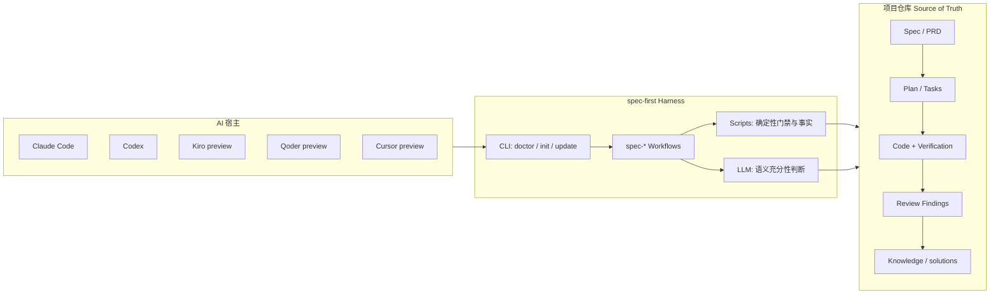

本页是快速开始路径的入口页，面向第一次接触 `spec-first` 的开发者。它只回答三件事：**它是什么、它解决什么问题、为什么值得在真实项目里试用**。安装步骤、宿主差异、首次走查与入口路由分别在后续页面展开；读完本页后，你应能判断自己是否需要这层 harness，以及下一步该读哪一页。

## 一句话定位

`spec-first` 是面向 Claude Code、Codex、Kiro、Qoder 与 Cursor 的 **AI Coding Harness**：它不替代这些宿主，而是在项目仓库内叠加一层可治理的工作流。一次性 AI 对话会被组织成仓库承载的 requirements、plans、scoped work、review 与 reusable learning 闭环；脚本强制确定性不变量并准备事实，LLM 在这层地板之上做语义判断，证据留在你的仓库里。

Sources: [README.zh-CN.md](README.zh-CN.md#L16-L18)、[package.json](package.json#L2-L4)、[ai-coding-harness.md](docs/contracts/ai-coding-harness.md#L1-L5)

当前 npm 包版本为 `1.13.2`。包描述把同一主张写得更短：**把一次性 AI coding 聊天变成以仓库为载体、可验证的 spec-driven 工程环**——Scripts prepare facts；LLMs decide；evidence stays in your repo。Kiro 与 Qoder 当前为 opt-in preview；Cursor 更保守，是 opt-in `generated_runtime_preview`，本机尚未验证 skill discovery/invocation，不能把 Cursor 当作完整默认宿主。

Sources: [package.json](package.json#L2-L4)、[README.zh-CN.md](README.zh-CN.md#L16-L18)

## 它解决的真实问题

AI 写代码已经很快；真正昂贵的是保存代码背后的判断：为什么选这个 scope、检查过哪些证据、哪些 review finding 重要、下一位 agent 或同事应继承什么上下文。若没有仓库承载的轨迹，这些上下文会随聊天窗口消失——下一次会话缺上下文，reviewer 看不到计划为何变化，团队也很难复用一次成功经验。

Sources: [README.zh-CN.md](README.zh-CN.md#L175-L179)

`spec-first` 把这些工作写成持久 artifact：requirements、PRD、plans、task packs、work evidence、debug notes、reviews 与 learnings。评估时重点不应是 agent 数量或 prompt 库体积，而应是一次 workflow 是否留下可复用、可检查的东西。

Sources: [README.zh-CN.md](README.zh-CN.md#L26-L34)、[README.zh-CN.md](README.zh-CN.md#L175-L179)

## 第一性原理与使命

角色契约给出五个第一性原理，其中对初学者最关键的是：**代码不再稀缺，可信变更仍然稀缺**。真正受限的是正确意图、有效上下文、可靠反馈、验证能力和人的注意力；自主性是放大器而不是权威来源；事实、判断与授权不可混同；信任只能覆盖证据直接支持的 claim；长期价值属于项目，而非某个宿主。

Sources: [结构化项目角色契约.md](docs/10-prompt/结构化项目角色契约.md#L11-L25)

由此得到可记忆的价值公式：

```text
可信变更 = 清晰意图 × 有效上下文 × 有界执行 × 可核验证据 × 可失效学习
```

任一项接近零，更多 prompt、agent 或自动化只会更快放大问题。`spec-first` 的使命是治理一次变更的工程与证据循环，缩短 **time-to-trusted-change**，提升 **quality-adjusted throughput**，并让价值可识别、可试用、可评估。

Sources: [结构化项目角色契约.md](docs/10-prompt/结构化项目角色契约.md#L20-L31)、[AI-Coding-Harness演化方法论.md](docs/10-prompt/AI-Coding-Harness演化方法论.md#L16-L26)

权威分工也很清晰：**Host** 提供 agent、工具与执行 primitive；**spec-first** 连接 intent、context、scope、claim、evidence、handoff 与 knowledge；**Project / Project owner** 定义价值、授权任务并拥有长期 artifacts。因此它应是跨宿主可投射的工程协议，而不应成为 prompt 集合、agent 市场、强状态机或中心化流程引擎。

Sources: [结构化项目角色契约.md](docs/10-prompt/结构化项目角色契约.md#L31-L37)、[AGENTS.md](AGENTS.md#L53-L55)

## 从 Prompt 到 Harness：三层工程概念

用户手册把 AI 工程拆成三层，便于理解 `spec-first` 落在哪一层：

| 层次 | 关注点 | 典型产物 |
| --- | --- | --- |
| **Prompt Engineering** | 如何发出更清晰的指令 | 单次 prompt、对话技巧 |
| **Context Engineering** | 模型能看到什么、如何组织 | 有界上下文包、摘要、引用 |
| **Harness Engineering** | 系统如何运行：约束、反馈回路、工作流控制与持续改进 | 契约、门禁、artifact 闭环、可重建 runtime |

Sources: [02-核心概念.md](docs/05-用户手册/02-核心概念.md#L55-L63)

`spec-first` 的主战场是 **Harness Engineering**：给 agent 正确的上下文边界、证据边界、artifact 形状与 handoff 合同，让工程工作流可重复，而不是只追求“更会说话的 prompt”。

Sources: [CONCEPTS.md](CONCEPTS.md#L13-L15)、[02-核心概念.md](docs/05-用户手册/02-核心概念.md#L55-L63)

## 核心工程链路

所有能力设计都服务同一条研发主链路：

```text
Codebase → Spec → Plan → Tasks → Code → Review → Knowledge
```

Sources: [ai-coding-harness.md](docs/contracts/ai-coding-harness.md#L7-L13)、[README.zh-CN.md](README.zh-CN.md#L152-L154)、[AGENTS.md](AGENTS.md#L43-L47)

公开 workflow 入口在受支持宿主中统一写作 `spec-*`。下表只做定位级鸟瞰（完整路由见后续页面）：

| 任务意图 | 统一入口 | 典型仓库产物 |
| --- | --- | --- |
| 粗略想法 → 需求 | `spec-brainstorm` | `docs/plans/`（requirements-only） |
| 已有 PRD / brownfield 变更 | `spec-prd` | `docs/brainstorms/` |
| 实现规划 | `spec-plan` | `docs/plans/` |
| 计划拆任务 | `spec-write-tasks` | `docs/tasks/` |
| 有范围执行 | `spec-work` | 源码变更 + 证据 |
| 代码 / 文档审查 | `spec-code-review` / `spec-doc-review` | 结构化 findings |
| 沉淀经验 | `spec-compound` | `docs/solutions/` |

Sources: [README.zh-CN.md](README.zh-CN.md#L152-L166)

健康的第一圈会给现有宿主会话加上一条可治理路径：定义问题 → 规划方案 → 必要时拆 task → 执行 → 评审 → 沉淀。最小成功信号非常具体：安装并 `init` 后，在宿主里跑一个 workflow，然后打开它写入仓库的 Markdown artifact（常见于 `docs/brainstorms/` 或 `docs/plans/`）。

Sources: [README.zh-CN.md](README.zh-CN.md#L26-L34)

### 链路总览图

下面的图描述“宿主 + harness + 仓库证据”如何协作；细节实现以 contracts 与 skills 为准。



Sources: [README.zh-CN.md](README.zh-CN.md#L16-L18)、[ai-coding-harness.md](docs/contracts/ai-coding-harness.md#L7-L13)、[AGENTS.md](AGENTS.md#L39-L47)

## Harness 分层：可治理，而不是中心化引擎

合同把 harness 拆成六层，帮助你理解“价值从哪里来”，而不是要求你一次读完全部 contract：

| 分层 | 职责（初学者可读版） |
| --- | --- |
| **Context Harness** | 给 LLM 有界、相关、可追溯的上下文，而不是整仓广播 |
| **Execution Harness** | 在 plan / task / work / review 间传递 scope 与 handoff 证据，不变成状态机 |
| **Evidence Harness** | 保留 provenance、freshness、source reads 与 limitations，让结论可质疑 |
| **Evaluation Harness** | 用聚焦检查与 quality gate 记录系统是否真的变好 |
| **Governance Harness** | 明确 source / runtime / provider 边界与 mutation 责任 |
| **Knowledge Harness** | 只沉淀已验证、可复用的经验，且不强制每个 workflow 预读知识库 |

Sources: [ai-coding-harness.md](docs/contracts/ai-coding-harness.md#L15-L24)

关键边界规则可以浓缩为两句话：**脚本强制确定性不变量并准备确定性事实**；**LLM workflow 判断这层地板之上的语义充分性**（scope、架构取舍、finding 是否成立、root cause 等）。外部工具输出在回源确认前一律是 advisory；provider 不拥有 scope、finding、mutation 或 workflow state 的权威。

Sources: [ai-coding-harness.md](docs/contracts/ai-coding-harness.md#L26-L35)、[README.zh-CN.md](README.zh-CN.md#L219-L225)、[AGENTS.md](AGENTS.md#L39-L41)

## 与“Prompt 包 / Agent 编排”的价值对比

采纳时真正关心的问题，往往不是“谁更会写 prompt”，而是第一次跑完留下什么、决策与证据在哪里、人要 review 什么、谁守住机械边界、多宿主如何对齐：

| 采纳问题 | Prompt pack / agent 编排 | **spec-first** |
| --- | --- | --- |
| 第一次跑完能得到什么？ | 更好的聊天答案或 transcript | 仓库内 artifact（如 requirements brief / plan） |
| 决策和证据在哪里？ | Session state、消息总线、runtime memory | 项目内文档、generated runtime、可验证 CLI facts |
| 人要 review 什么？ | 通常是最终 diff 或 agent 输出 | Requirements、plans、task packs、diff、findings、learnings |
| 谁守住机械边界？ | 模型自觉或自定义 glue | 脚本强制不变量；LLM 做语义判断 |
| 多宿主如何对齐？ | 分开维护 prompt | 一套 source assets 再生成各宿主 runtime surface |

Sources: [README.zh-CN.md](README.zh-CN.md#L181-L193)

你今天就能检查的机制包括：requirements 变成持久 brief；plans / task packs 把模糊意图变成可评审上下文；work closeout 可指向结构化 verification evidence；work / review / debug / compound 会沉淀证据与经验；knowledge 默认 summary-first，回源确认前保持 advisory。这些是 **当前仓库机制**，不是已被外部采纳数据证明的效果宣称——先相信 artifacts、tests 与 source/runtime 边界，再相信任何营销句子。

Sources: [README.zh-CN.md](README.zh-CN.md#L195-L203)

## 你能在仓库里看到什么

典型链路会在仓库内留下可检查产物（并非每个 workflow 写全量目录）：

```text
docs/
  ideation/      ranked ideas 与探索记录
  brainstorms/   legacy PRD 级需求（如 spec-prd）
  plans/         Product Contract 与 implementation plan
  tasks/         结构化 task packs
  reviews/       文档与代码审查 findings
  solutions/     可复用经验
.spec-first/
  workflows/     structured work closeout evidence（默认 gitignore）
```

Sources: [README.zh-CN.md](README.zh-CN.md#L134-L150)

工作方式上有两类 durable surface：**仓库内 workflow artifacts**（长期证据）与 **generated host runtime assets**（可丢弃镜像）。Source 在 `skills/`、`templates/`、`src/cli/` 等处；`spec-first init` 把它们投射到 `.claude/`、`.agents/skills/`、`.cursor/`、`.kiro/`、`.qoder/` 等宿主目录。修行为应改 source 再重建 runtime，而不是直接补丁 generated 副本。

Sources: [README.zh-CN.md](README.zh-CN.md#L205-L211)、[CONCEPTS.md](CONCEPTS.md#L77-L83)

## 适合 / 不适合什么场景

**适合使用** 当你已经使用 Claude Code、Codex、Kiro、Qoder 或 Cursor，希望用项目内 workflow 替代一次性 prompt；希望 AI 工作留下 durable requirements、plans、review summaries 与 learnings；希望脚本处理确定性 setup 与可机器检查边界，同时保留 LLM 的语义判断；希望 workflow 层足够轻，并能从 source 重建。

Sources: [README.zh-CN.md](README.zh-CN.md#L229-L235)

**可能不适合** 当你只需要单次 prompt 片段、通用 agent marketplace、不依赖宿主的独立应用，或团队流程不希望 workflow artifacts 写入仓库——此时 `spec-first` 可能不是最合适的形态。

Sources: [README.zh-CN.md](README.zh-CN.md#L237-L237)

## 价值一句话收束

若只用一句话记住本页：

> **`spec-first` 用最小可维护的 harness，把 AI coding 从“更快产出代码”推进到“更快产出可信任、可交接、可沉淀的变更”。**

Sources: [结构化项目角色契约.md](docs/10-prompt/结构化项目角色契约.md#L1-L3)、[AI-Coding-Harness演化方法论.md](docs/10-prompt/AI-Coding-Harness演化方法论.md#L1-L5)、[README.zh-CN.md](README.zh-CN.md#L16-L18)

## 建议阅读顺序

按目录从浅入深推进即可；本页只建立心智模型，动手与深读分别在后续页：

1. **动手安装** → [五分钟上手：安装、doctor 与 init](2-wu-fen-zhong-shang-shou-an-zhuang-doctor-yu-init)
2. **选宿主** → [多宿主选择：Claude Code、Codex、Kiro、Qoder 与 Cursor](3-duo-su-zhu-xuan-ze-claude-code-codex-kiro-qoder-yu-cursor)
3. **跑通第一圈** → [首次工作流走查：从 brainstorm 到可检查产物](4-shou-ci-gong-zuo-liu-zou-cha-cong-brainstorm-dao-ke-jian-cha-chan-wu)
4. **按任务选入口** → [入口路由速查：按任务选择 spec-* 工作流](5-ru-kou-lu-you-su-cha-an-ren-wu-xuan-ze-spec-gong-zuo-liu)
5. **找产物与成功信号** → [产物目录与成功信号：仓库内 artifact 去哪找](6-chan-wu-mu-lu-yu-cheng-gong-xin-hao-cang-ku-nei-artifact-qu-na-zhao)
6. **方法论深读（可选）** → [Spec-First 方法论：从对话到可治理工程闭环](9-spec-first-fang-fa-lun-cong-dui-hua-dao-ke-zhi-li-gong-cheng-bi-huan) 与 [核心词汇：Skill、Workflow、Artifact 与证据边界](10-he-xin-ci-hui-skill-workflow-artifact-yu-zheng-ju-bian-jie)

Sources: 本页目录导航（快速开始 → 深入解析）

准备好后，直接进入 [五分钟上手：安装、doctor 与 init](2-wu-fen-zhong-shang-shou-an-zhuang-doctor-yu-init)，用一次真实 workflow 验证本页所说的“仓库内可检查 artifact”。