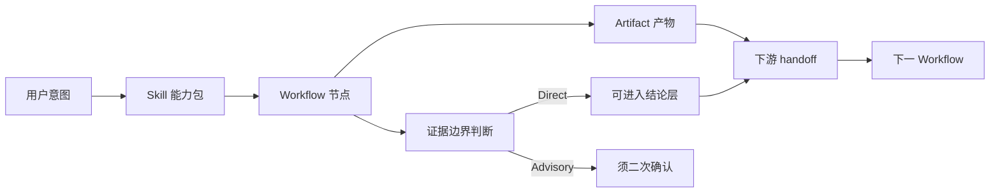
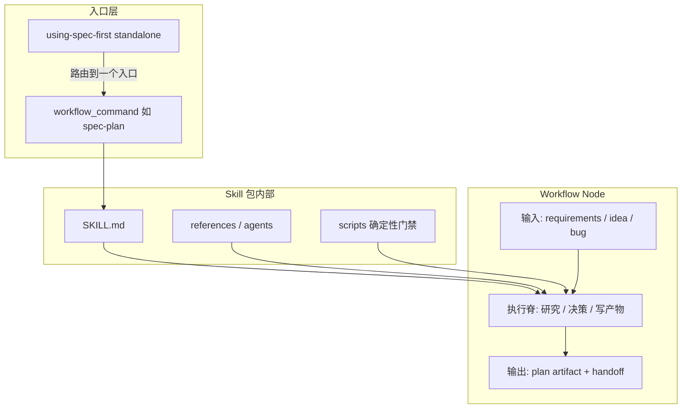
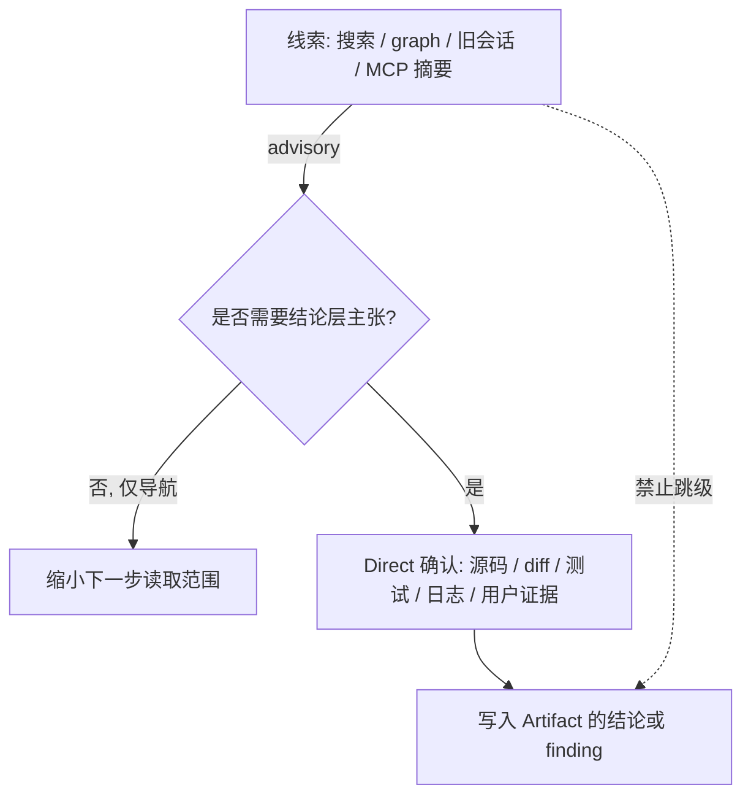

读 `spec-first` 时最容易卡在同一类问题上：名字看起来像“命令清单”，实际却是**能力包、阶段节点、持久产物、证据可信度**四套不同边界。本页只解决这一件事——把 **Skill、Workflow、Artifact、证据边界** 讲清楚，并说明它们如何串成可治理的工程闭环，而不把系统误读成刚性状态机。

若你还没建立整体定位，可先回看 [Spec-First 方法论：从对话到可治理工程闭环](9-spec-first-fang-fa-lun-cong-dui-hua-dao-ke-zhi-li-gong-cheng-bi-huan)；若已能区分这些词，下一步适合读 [确定性门禁与语义判断：脚本地板之上的 LLM 职责](11-que-ding-xing-men-jin-yu-yu-yi-pan-duan-jiao-ben-di-ban-zhi-shang-de-llm-zhi-ze) 与 [Source of Truth 与 Generated Runtime 分离原则](12-source-of-truth-yu-generated-runtime-fen-chi-yuan-ze)。

## 先建立心智模型：四词各管一层

把四词压成一句话：

- **Skill** 是“能被宿主发现并执行的能力包”
- **Workflow** 是“有输入、输出、交接边界的工程阶段”
- **Artifact** 是“可跨会话引用的持久（或受控临时）产物”
- **证据边界** 是“什么能直接当结论，什么只能当线索”

它们不是四个同义词。一个 `spec-plan` 既是 **Skill 包**，也是主链路上的 **Workflow 节点**；它写出的 `docs/plans/*-plan.md` 才是 **Artifact**；计划里引用的图谱候选、旧会话摘要，默认只是 **advisory 证据**，不能直接升格为“已确认事实”。



Sources: [CONCEPTS.md](CONCEPTS.md#L13-L105), [docs/contracts/ai-coding-harness.md](docs/contracts/ai-coding-harness.md#L7-L45)

## Skill：能力包，不是“随便一个 md 文件”

### 定义

**Skill** 是可复用的方法/工作流包：入口契约、执行步骤、references、产物形状、失败处理都装在 `skills/<name>/` 里（通常以 `SKILL.md` 为入口）。公开的 `spec-*` workflow skill 是用户入口；内部 helper skill 只在文档化的 workflow 阶段被委托，不应当作主入口。

Sources: [CONCEPTS.md](CONCEPTS.md#L49-L51), [docs/05-用户手册/02-核心概念.md](docs/05-用户手册/02-核心概念.md#L145-L155)

### 三种入口表面（entry_surface）

机器可读权威在 `skills-governance.json`。当前仓库大致分为三类（计数会随版本变化，以治理文件为准）：

| entry_surface | 用户怎么用 | 例子 | 常见误区 |
| --- | --- | --- | --- |
| `workflow_command` | 宿主内直接调用 `spec-*` | `spec-plan`、`spec-work`、`spec-prd` | 把所有 `skills/` 都当公开命令 |
| `standalone_skill` | 按意图直接调用；部分仅用户显式触发 | `using-spec-first`、`spec-explain`、`spec-pov` | 期待它写出主链路 plan/work 产物 |
| `internal_only` | **不是用户主入口**；由公开 workflow 委托 | `spec-worktree`、`spec-commit`、`spec-test-browser` | 在手册/对话里鼓励用户直接跑 |

Sources: [src/cli/contracts/dual-host-governance/skills-governance.json](src/cli/contracts/dual-host-governance/skills-governance.json#L6-L77), [docs/05-用户手册/24-公开入口与Skill目录.md](docs/05-用户手册/24-公开入口与Skill目录.md#L1-L120)

### Skill 与相邻角色

初学者常把 Skill / Agent / Script / Tool 混成一团。可按“谁做判断、谁产事实”拆开：

| 名词 | 角色 | 权威边界 |
| --- | --- | --- |
| **Skill** | 工作流/方法入口 | 拥有阶段、产物与 handoff 规则 |
| **Workflow Command** | 对外统一的 `spec-*` 入口 | 与 standalone skill 不同；即便实现都是 `SKILL.md` |
| **Agent** | workflow 委派的有界判断角色 | 返回 findings/研究；默认不是 SoT，也不随便改仓 |
| **Tool** | 读文件、`rg`、测试、MCP、git 等 | 输出是证据，不是最终裁决 |
| **Script** | 确定性 helper | 校验 schema、路径、hash、readiness；不做架构/产品语义裁决 |

Sources: [CONCEPTS.md](CONCEPTS.md#L49-L73), [docs/workflow-skill-agent-map.md](docs/workflow-skill-agent-map.md#L1-L40)

### 一个容易记的例子

`using-spec-first` 是 **standalone skill**：它只负责选一个下一步入口并移交控制权，**不创建 workflow artifact**。真正写 requirements / plan / code 的是被它路由到的 `spec-brainstorm`、`spec-plan`、`spec-work` 等 workflow。

Sources: [skills/using-spec-first/SKILL.md](skills/using-spec-first/SKILL.md#L6-L14)

## Workflow：阶段节点与协调层，不是状态机

### 定义

- **Workflow Harness**：给 agent 正确上下文、证据边界、产物形状与 handoff 契约，使工程步骤可重复。
- **Workflow Node**：链路中的命名阶段（brainstorm、PRD、plan、work、debug、review、compound 等）；每个节点拥有自己的输入、输出、产物、失败模式与下游交接。

Sources: [CONCEPTS.md](CONCEPTS.md#L13-L19)

### 主链路心智图

最小心智模型常写作五阶段：

`Brainstorm -> Plan -> Work -> Review -> Compound`

当前更完整的工程闭环是：

```text
Codebase -> Spec -> Plan -> Tasks -> Code -> Review -> Knowledge
```

对应公开入口大致是：

```text
mcp-setup
  -> ideate / brainstorm / prd / doc-review
  -> plan / write-tasks
  -> work / debug / optimize / polish
  -> code-review / app-consistency-audit
  -> compound / compound-refresh / write-skill
```

**关键纪律**：这是语义地图，不是强制状态机。只进入当前最合适的一步；handoff 由**活跃 workflow** 拥有，而不是由全局调度器自动连跑 `plan -> work -> review`。

Sources: [docs/05-用户手册/02-核心概念.md](docs/05-用户手册/02-核心概念.md#L66-L120), [skills/using-spec-first/SKILL.md](skills/using-spec-first/SKILL.md#L12-L35), [docs/workflow-skill-agent-map.md](docs/workflow-skill-agent-map.md#L1-L25)

### Workflow 与 Skill 的关系

多数公开 workflow 由同名 skill 实现：用户说 `spec-plan`，宿主加载 `skills/spec-plan/SKILL.md`。但概念上仍要分开：

1. **Skill 包**回答“能力从哪里来、脚本/references 放哪”
2. **Workflow 节点**回答“这一阶段的 WHAT/HOW 边界、完成契约、下游该看什么”

例如 `spec-plan` 明确：它充实 **HOW**，不实现代码、不把执行期发现伪装成规划结论；正常交互分支在写出 plan 后仍要完成 handoff 提问，才算完成契约。

Sources: [skills/spec-plan/SKILL.md](skills/spec-plan/SKILL.md#L10-L28), [docs/contracts/ai-coding-harness.md](docs/contracts/ai-coding-harness.md#L15-L33)



Sources: [docs/workflow-skill-agent-map.md](docs/workflow-skill-agent-map.md#L27-L55), [skills/using-spec-first/SKILL.md](skills/using-spec-first/SKILL.md#L10-L20)

## Artifact：持久产物，但不是万能“真相”

### 定义

**Artifact** 是 durable 的 workflow 输出：需求文档、计划、task pack、审查报告、validation ledger、setup facts、run artifact、solution 文档等。好的 artifact 应声明**权威级别与新鲜度**，而不是默默变成全局 workflow 状态。

Sources: [CONCEPTS.md](CONCEPTS.md#L101-L103)

### 三类产物要分清

| 类型 | 典型路径 | 是否常提交 | 权威角色 |
| --- | --- | --- | --- |
| **协作文档层 durable artifacts** | `docs/ideation/`、`docs/brainstorms/`、`docs/plans/`、`docs/tasks/`、`docs/solutions/` | 通常提交（tasks 视团队） | 人类与下游 workflow 的协作真相；**不覆盖** `skills/` 等行为源码契约 |
| **control-plane / 执行事实** | `.spec-first/config/`、`.spec-first/workspace/`、`.spec-first/workflows/`、`.spec-first/app-audit/` | 通常不提交 | 机器事实与 advisory 摘要；可重建、可过期 |
| **generated runtime mirrors** | `.claude/`、`.agents/skills/`、`.codex/`、`.cursor/`、`.kiro/`、`.qoder/` 下的投影 | 不应当 SoT 手改 | 宿主投递副本；修法是改 source 后 `spec-first init` |
| **会话临时 handoff** | OS temp 下 `spec-code-review/<run-id>/` 等 | 不提交 | 仅服务当前 run；长期保留要写成 concise residual summary |

Sources: [docs/05-用户手册/10-产物目录.md](docs/05-用户手册/10-产物目录.md#L5-L76), [docs/contracts/source-runtime-customization-boundary.md](docs/contracts/source-runtime-customization-boundary.md#L7-L85)

### 主链路 durable 产物速查

| 场景 | 公开入口 | 典型 durable 产物 |
| --- | --- | --- |
| 0–1 方向 | `spec-ideate` | `docs/ideation/*-ideation.md` |
| 问题框架 / 成功标准 | `spec-brainstorm` | `docs/brainstorms/*-requirements.md` |
| 棕地 PRD 研发澄清 | `spec-prd` | 仍写 `docs/brainstorms/*-requirements.md`（planning-readiness） |
| HOW 未定 | `spec-plan` | `docs/plans/*-plan.md` |
| 大计划可执行拆解（可选） | `spec-write-tasks` | `docs/tasks/*-tasks.md` |
| 实现 | `spec-work` | 代码变更 + 可选 `.spec-first/workflows/spec-work/...` |
| 质量判断 | `spec-code-review` | 会话/PR 结论；临时 handoff 在 OS temp |
| 知识沉淀 | `spec-compound` | `docs/solutions/**` |

Sources: [docs/05-用户手册/24-公开入口与Skill目录.md](docs/05-用户手册/24-公开入口与Skill目录.md#L20-L40), [docs/05-用户手册/10-产物目录.md](docs/05-用户手册/10-产物目录.md#L13-L23)

### summary-first：Artifact 的交接形态

跨 workflow 传递时，优先传 **summary + 精确路径**，而不是整份长报告。`artifact-summary.v1` 约定：先读摘要；仅当 `full_artifact_read_triggers` 命中时才展开全文；direct/session evidence summary 仍是 advisory，消费者必须回到 `evidence_paths` 或 `source_reads_required` 做确认。

Sources: [docs/contracts/artifact-summary.md](docs/contracts/artifact-summary.md#L1-L72)

### 执行产物路径约定

workflow 作用域的机器产物布局由验证层统一解析，形如：

```text
<repoRoot>/.spec-first/workflows/<workflow>/<slug>/
```

它回答“这次 run 的事实落在哪”，不是把业务知识库搬进 `.spec-first/`。

Sources: [src/verification/artifact-paths.js](src/verification/artifact-paths.js#L34-L51)

## 证据边界：Direct 与 Advisory 的硬分界

### 为什么证据边界是核心词汇

没有证据边界，Skill 会变成“会说话的脚本”，Artifact 会变成“看起来正式的猜测”。`spec-first` 的 harness 合同把职责拆成：

1. **脚本**强制确定性不变量，并准备确定性事实（路径、schema、hash、readiness、reason code）
2. **LLM**在事实地板之上做语义充分性判断（范围、架构取舍、finding 是否成立）
3. **外部工具证据**在 source / test / log / schema / contract / 用户确认前，一律 **advisory**

Sources: [docs/contracts/ai-coding-harness.md](docs/contracts/ai-coding-harness.md#L26-L45), [CONCEPTS.md](CONCEPTS.md#L35-L37)

### Direct Evidence vs Advisory Evidence

| 类型 | 是什么 | 可否直接支撑结论层主张 |
| --- | --- | --- |
| **Direct Evidence** | 当前源码读取、diff、测试、日志、schema 校验、用户提供且可核对的材料 | 可以（在 scope 内） |
| **Advisory Evidence** | 外部 provider 摘要、旧会话、宽泛搜索、project/code graph 候选、词汇表文件本身 | **否**；须再确认后才能进入 finding / requirement / 实现主张 |

Sources: [CONCEPTS.md](CONCEPTS.md#L93-L99)

### 默认证据车道（Direct Evidence Lanes）

| Lane | 典型来源 | 边界 |
| --- | --- | --- |
| source-read | 聚焦读文件、`rg`、ast-grep、本地 package/test 元数据 | 语义相关性由 workflow 判断；确认路径仍是 source |
| verification | 测试、语法检查、CLI 输出、日志、确定性校验器 | 脚本记录 exit code/事实；LLM 解释是否满足任务 |
| handoff-summary | artifact 摘要、changed files、review/work 摘要 | 传紧凑证据与限制，不广播 raw dump |
| external-tool | 浏览器 / MCP / shell 等显式有用时 | 未验证前 untrusted； substantively 使用前需对照 source/test/log |
| capability-candidate | project-graph / code-graph 定向候选 | **仅候选**；探索可指路，结论必须二次确认 |

Sources: [docs/contracts/ai-coding-harness.md](docs/contracts/ai-coding-harness.md#L35-L45), [docs/05-用户手册/02-核心概念.md](docs/05-用户手册/02-核心概念.md#L223-L230)

### 信任升级只能“逐级抬升”，不能跳级

对 project-graph / code-graph 一类能力，消费合同规定：

- **Exploration-tier**：可直接用候选决定“下一步先看哪里”
- **Conclusion-tier**：进入 plan 主张、review finding、根因、实现依据或发布主张前，必须用 source / tests / logs / docs / contracts / 用户确认

信任上升方向是：

```text
project-graph 候选
  -> code-graph / rg / ast-grep 定位
    -> source / tests / logs / docs 确认
```

允许直接从更底层开始（先读源码永远合法）；禁止把 graph 候选跳级写成结论。

Sources: [docs/contracts/project-graph-consumption.md](docs/contracts/project-graph-consumption.md#L33-L75)



Sources: [docs/contracts/project-graph-consumption.md](docs/contracts/project-graph-consumption.md#L64-L75), [docs/contracts/ai-coding-harness.md](docs/contracts/ai-coding-harness.md#L26-L33)

### 多仓场景的额外边界

父 workspace 的 `.spec-first/workspace/*` 只是 **advisory summaries**（含 parent artifact quarantine），**不是** child repo 的 canonical setup/readiness 真相。child 的权威 setup facts 应在 child 仓内；父根上的 repo-local setup 污染会被隔离标记，供清理与 degraded 判断，而不是“删了就算验证过”。

Sources: [docs/contracts/parent-artifact-quarantine.md](docs/contracts/parent-artifact-quarantine.md#L1-L55), [docs/05-用户手册/10-产物目录.md](docs/05-用户手册/10-产物目录.md#L62-L76)

## 四词如何一起工作：一条最小闭环

用“修一个边界清晰的小功能”走一遍（概念级，不展开各 skill 细节）：

1. **入口 Skill**：不确定跑什么时，用 `using-spec-first` 选一个入口（它自己不产 artifact）
2. **Workflow Node**：WHAT 未定用 `spec-brainstorm` / `spec-prd`；HOW 未定用 `spec-plan`；可执行时用 `spec-work`
3. **Artifact**：requirements / plan 落在 `docs/**`；必要时 task pack 派生在 `docs/tasks/`
4. **证据边界**：计划与实现中的代码主张，优先 bounded source reads 与测试；graph/MCP 只指路
5. **Review / Knowledge**：`spec-code-review` 基于 diff+验证事实给 findings；已验证解法才进 `spec-compound` 的 `docs/solutions/`

Sources: [skills/using-spec-first/SKILL.md](skills/using-spec-first/SKILL.md#L14-L35), [docs/05-用户手册/24-公开入口与Skill目录.md](docs/05-用户手册/24-公开入口与Skill目录.md#L20-L40), [docs/contracts/ai-coding-harness.md](docs/contracts/ai-coding-harness.md#L7-L33)

| 你看到的现象 | 更可能属于 | 正确反应 |
| --- | --- | --- |
| 宿主里出现 `spec-plan` | Workflow Command / Skill 入口 | 进入 plan 阶段，不要直接写大段实现 |
| 生成了 `docs/plans/...-plan.md` | Artifact | 作为执行前决策上下文；不是 runtime mirror |
| `.agents/skills/spec-plan/` 内容不对 | Generated Runtime | 改 `skills/` source 后 `spec-first init`，不手改 mirror |
| `.spec-first/config/runtime-capabilities.json` | setup-owned facts | 判断 helper/MCP 就绪；不当业务需求真相 |
| 图谱说“A 调用 B” | Advisory / candidate | 用源码或测试确认后再写进 finding/plan |
| `using-spec-first` 跑完没有新文档 | 正常 | 它只路由，不产 workflow artifact |

Sources: [CONCEPTS.md](CONCEPTS.md#L77-L103), [docs/05-用户手册/10-产物目录.md](docs/05-用户手册/10-产物目录.md#L5-L45), [docs/contracts/source-runtime-customization-boundary.md](docs/contracts/source-runtime-customization-boundary.md#L25-L85)

## 初学者高频误区

**误区 1：把所有 Skill 都当用户命令。**  
`internal_only` 是委托用 helper；手册不应鼓励用户直接当主入口。

**误区 2：把 Workflow 当自动流水线。**  
主链路是语义地图；只进当前最佳一步，handoff 由活跃 workflow 拥有。

**误区 3：把 Artifact 当 Source of Truth 覆盖一切。**  
`docs/**` 与 `.spec-first/**` 是证据与协作层；行为真源仍在 `skills/`、`src/cli/`、`templates/`、contracts 等 checked-in source。

**误区 4：把 advisory 证据写进结论句。**  
“看起来相关”可以改变阅读顺序；“系统就是这样”必须有 direct confirmation。

**误区 5：手改 generated runtime “先修好再说”。**  
runtime drift 的修复路径是 source 变更 + `spec-first init`，doctor 报告不是手改 mirror 的许可证。

Sources: [docs/05-用户手册/24-公开入口与Skill目录.md](docs/05-用户手册/24-公开入口与Skill目录.md#L90-L120), [docs/contracts/source-runtime-customization-boundary.md](docs/contracts/source-runtime-customization-boundary.md#L7-L70), [docs/contracts/project-graph-consumption.md](docs/contracts/project-graph-consumption.md#L64-L70)

## 词汇对照表（可贴在工位旁）

| 词汇 | 一句话 | 权威落点 |
| --- | --- | --- |
| Skill | 可复用能力包（`SKILL.md` + 可选 scripts/references） | `skills/` + `skills-governance.json` |
| Workflow Command | 用户可见的 `spec-*` 工作流入口 | `entry_surface: workflow_command` |
| Standalone Skill | 非主链路命令包装的直接方法能力 | 如 `using-spec-first` |
| Workflow / Node | 有输入输出与 handoff 的工程阶段 | 各 `skills/*/SKILL.md` 完成契约 |
| Artifact | 可交接的持久或受控临时产物 | `docs/**`、`.spec-first/**`、OS temp handoff |
| Direct Evidence | 可直接支撑结论的当前事实 | 源码、diff、测试、日志、schema、用户可核材料 |
| Advisory Evidence | 只能导航、须确认的线索 | graph、MCP 摘要、旧会话、宽泛搜索 |
| Source of Truth | 决定行为的 checked-in 源 | `skills/`、`src/cli/`、`templates/`、contracts… |
| Generated Runtime | 宿主投影副本 | `.claude/`、`.agents/skills/` 等 |

Sources: [CONCEPTS.md](CONCEPTS.md#L1-L120), [docs/contracts/ai-coding-harness.md](docs/contracts/ai-coding-harness.md#L15-L45)

## 读完本页后建议怎么走

1. 想继续理解“脚本拦什么、模型判什么”：阅读 [确定性门禁与语义判断：脚本地板之上的 LLM 职责](11-que-ding-xing-men-jin-yu-yu-yi-pan-duan-jiao-ben-di-ban-zhi-shang-de-llm-zhi-ze)
2. 想分清改哪里才算改系统：阅读 [Source of Truth 与 Generated Runtime 分离原则](12-source-of-truth-yu-generated-runtime-fen-chi-yuan-ze)
3. 想把词汇落到真实主链路：从 [需求澄清：ideate、brainstorm 与 Product Contract](13-xu-qiu-cheng-qing-ideate-brainstorm-yu-product-contract) 开始，或回到 [首次工作流走查：从 brainstorm 到可检查产物](4-shou-ci-gong-zuo-liu-zou-cha-cong-brainstorm-dao-ke-jian-cha-chan-wu) 做一次实操
4. 只想查“该敲哪个 `spec-*` / 产物在哪”：用 [入口路由速查：按任务选择 spec-* 工作流](5-ru-kou-lu-you-su-cha-an-ren-wu-xuan-ze-spec-gong-zuo-liu) 与 [产物目录与成功信号：仓库内 artifact 去哪找](6-chan-wu-mu-lu-yu-cheng-gong-xin-hao-cang-ku-nei-artifact-qu-na-zhao)

**记住最小口诀**：Skill 装能力，Workflow 管阶段，Artifact 留痕迹，证据边界守诚实。