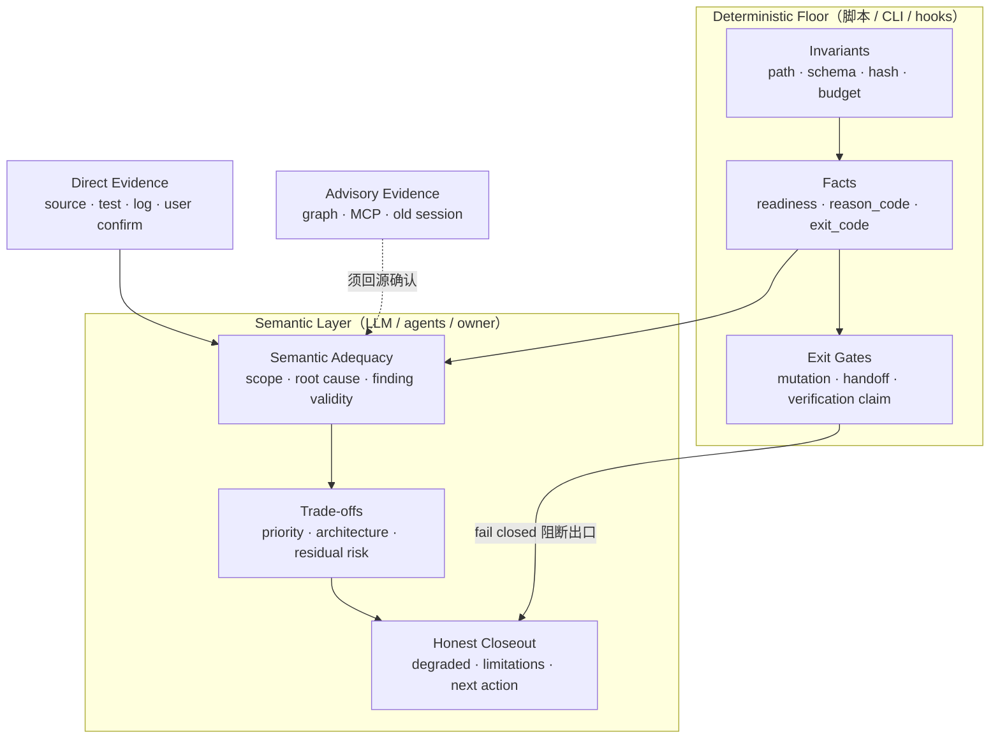
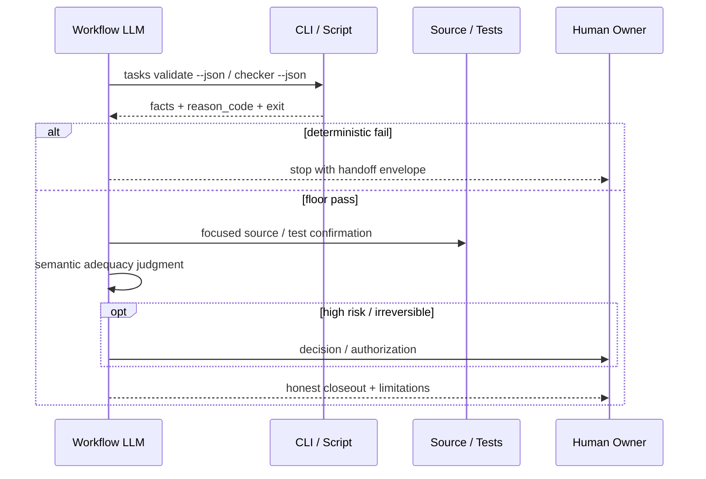

本页解释 **spec-first** 最稳定、也最容易被误用的分工：**脚本与工具守住可机械判定的不变量（deterministic floor）**，**LLM 在事实地板之上判断语义充分性（semantic adequacy）**。它不是某个 skill 的操作手册，而是贯穿 harness、workflow、CLI 与 eval 的职责边界；读懂它，才能正确理解为何 task-pack 校验通过不等于任务拆得好、checker finding 不等于 PRD 可以 ready、hook 可以拦截写盘却不能替你做架构取舍。

Sources: [ai-coding-harness.md](docs/contracts/ai-coding-harness.md#L27-L35) · [结构化项目角色契约.md](docs/10-prompt/结构化项目角色契约.md#L55-L62) · [CONCEPTS.md](CONCEPTS.md#L35-L37)

## 为什么需要“脚本地板”

AI coding 的核心矛盾不是“能不能生成代码”，而是**事实、判断与授权容易混在一起**。脚本若开始“觉得”方案更合理，就变成不可复现的伪决策；LLM 若假装跑过 hash/schema 校验，就变成不可审计的伪证据。spec-first 用脚本地板把二者切开：可机械复算的结果由脚本 fail-closed 守住；意图、范围、根因、取舍与充分性由 LLM（及人）在证据之上裁决。

Sources: [结构化项目角色契约.md](docs/10-prompt/结构化项目角色契约.md#L12-L20) · [ai-coding-harness.md](docs/contracts/ai-coding-harness.md#L28-L30)

词汇层有两个锚点。**Deterministic Gate** 是脚本、hook 或 verifier 边界：用 schema 字段、receipt、路径、hash、reason code 等**可机械检查事实**阻断出口；它**不得**替代地板之上的语义判断。**Script** 是确定性助手：准备事实、校验 schema、检查 readiness、写入受治理 artifact；它**不应**决定架构、产品优先级或 review 结论是否成立。

Sources: [CONCEPTS.md](CONCEPTS.md#L35-L37) · [CONCEPTS.md](CONCEPTS.md#L71-L73)

## 概念关系：地板、门禁与语义层

图中的关键箭头有两层含义。第一，**脚本向上游只交付事实与 reason code**，不交付“可以发布 / 可以 ready / finding 成立”的结论。第二，**硬门禁只守出口**（mutation、verification claim、source/runtime、handoff、knowledge promotion），不把推理过程状态机化——这是角色契约的 “Gate the exits, not the thinking”。

Sources: [ai-coding-harness.md](docs/contracts/ai-coding-harness.md#L28-L35) · [结构化项目角色契约.md](docs/10-prompt/结构化项目角色契约.md#L59-L62) · [gate-lens-taxonomy.md](docs/contracts/governance/gate-lens-taxonomy.md#L17-L19)

## 双层职责对照

| 维度 | 脚本 / Tool 拥有 | LLM / Workflow 拥有 | 典型反例（禁止） |
| --- | --- | --- | --- |
| 不变量 | 路径、schema、hash、budget、枚举、artifact 形状 | 判断这些不变量对当前任务是否“够用” | 用 prose 复述 hash 规则并自称校验通过 |
| 事实 | exit code、readiness 字段、reason_code、raw-log refs | 解释 degraded 证据是否仍可推进 | 脚本输出 “ready-for-planning” 语义裁决 |
| 证据 | 采集 source/test/log 的确定性结果 | 判定 claim 是否被证据支持 | 把 graph/MCP 摘要直接当 confirmed |
| 出口 | fail-closed 阻断非法 mutation / 无效 handoff | 在合法出口内做架构与产品取舍 | hook 拦截“计划质量差”这类语义 |
| 质量 | 结构存在、字段齐全、trace 可定位 | 任务拆分好坏、finding 是否成立 | validator 给 semantic quality 打分并 gate |

Sources: [ai-coding-harness.md](docs/contracts/ai-coding-harness.md#L37-L44) · [CONCEPTS.md](CONCEPTS.md#L67-L73) · [execution-handoff-contract.md](skills/spec-write-tasks/references/execution-handoff-contract.md#L50-L64)

**Direct evidence lanes** 进一步钉死确认路径：source-read 与 verification 是默认确认面；external-tool 与 project/code graph 在回源前一律 **advisory**。工具输出是证据，不是最终判断——这与 CONCEPTS 中 Tool / Advisory Evidence 的定义一致。

Sources: [ai-coding-harness.md](docs/contracts/ai-coding-harness.md#L37-L44) · [CONCEPTS.md](CONCEPTS.md#L67-L69) · [CONCEPTS.md](CONCEPTS.md#L91-L93)

## 确定性门禁长什么样

门禁的“牙齿”来自**可复算、可同输入复现**的检查，而不是来自更长的 prompt。常见门禁族包括：

**Identity / freshness / structure。** 例如 task-pack 的 `spec_id`、`source_plan_hash`、Task Pack Contract JSON 形状、wave 依赖与同 wave 文件重叠。CLI 校验通过只证明 **identity-freshness-structure**，`validity_scope` 明确限制在这一层；`deterministic_handoff: true` **不**证明任务语义质量。

Sources: [execution-handoff-contract.md](skills/spec-write-tasks/references/execution-handoff-contract.md#L50-L64) · [task-pack.js](src/cli/task-pack.js#L396-L397) · [task-pack.js](src/cli/task-pack.js#L547-L547)

**Producer-local structure / trace。** 例如 PRD artifact checker 报告 frontmatter、core section 可定位性、requirement/acceptance trace gap、placeholder、design-source inventory 等 **deterministic facts**；readiness lens 消费这些 facts，但**是否 ready-for-planning 仍是 LLM 语义裁决**——脚本不得自行计算“确认充分性”或下游 confirmation reduction。

Sources: [prd-readiness-lens.md](skills/spec-prd/references/prd-readiness-lens.md#L37-L37) · [evaluation-governance.md](skills/spec-prd/evals/evaluation-governance.md#L19-L19)

**Governance labels，不是执行器。** `gate-lens-taxonomy` 只定义 preflight / planning / verification / review 等 **lens family 命名**；脚本可把这些名字当确定性标签发出，workflow LLM 决定如何解释；lens family **不是** gate 执行器、成熟度阶段或权限边界。

Sources: [gate-lens-taxonomy.md](docs/contracts/governance/gate-lens-taxonomy.md#L1-L19)

**Host hooks 的硬边界。** 宿主 hook 可以基于路径、命令形态等确定性事实阻断 mutation 或 source/runtime 越界；**不得**让 hook 决定 plan 质量、review 正确性或语义充分性。没有可验证 blocking primitive 时，只能声明为 **loud convention**，并写明未强制范围——禁止静默放行。

Sources: [结构化项目角色契约.md](docs/10-prompt/结构化项目角色契约.md#L59-L62) · [ai-coding-harness.md](docs/contracts/ai-coding-harness.md#L28-L28)

## 地板之上的 LLM 职责

LLM 在脚本地板之上负责**无法被机械替换**的判断。Harness 合同把这一层写成：scope、架构取舍、finding 是否成立、root cause、task ordering，以及 **degraded evidence 是否足够**。角色契约补充：human / Project owner 保留价值、高风险与不可逆取舍的最终裁决。

Sources: [ai-coding-harness.md](docs/contracts/ai-coding-harness.md#L28-L30) · [结构化项目角色契约.md](docs/10-prompt/结构化项目角色契约.md#L55-L57)

一条贯穿全链路的操作纪律是：**消费脚本 JSON，不要用 prose 复述脚本**。prompt 应运行 `spec-first … --json`，仅在 `deterministic_handoff: true`（或等价通过信号）后进入语义判断；失败按 `reason_code` 停止并交还 handoff envelope。红线双向：不让脚本裁决语义；不让 prompt 伪造确定性。

Sources: [skill-prompt-设计与优化方法论-v2.md](docs/10-prompt/skill-prompt-设计与优化方法论-v2.md#L116-L123) · [execution-handoff-contract.md](skills/spec-write-tasks/references/execution-handoff-contract.md#L52-L62)

Sources: [skill-prompt-设计与优化方法论-v2.md](docs/10-prompt/skill-prompt-设计与优化方法论-v2.md#L116-L121) · [ai-coding-harness.md](docs/contracts/ai-coding-harness.md#L28-L35)

## 在主链路中如何落地（边界视角）

| 工作流节点 | 脚本地板示例 | 语义层示例 | 常见误解 |
| --- | --- | --- | --- |
| write-tasks → work | `tasks validate --json`；hash / structure | 拆分是否可执行、是否该 review-gate | handoff true = 任务“好” |
| prd | checker / finalize 的 structure & trace facts | grill 是否问透、能否 ready | finding 数组空 = 需求充分 |
| plan | governance signals 的 candidate_level 事实 | plan depth 确认或 override 理由 | 信号分数 = 最终 depth |
| work closeout | verification-run-summary 的 exit_code | 是否诚实 degraded | 自述“测过了”= verification claim |
| code-review | resource lens 标签、scope 结构 | finding 成立性与 residual risk | advisory graph = confirmed impact |
| compound / knowledge | field presence、path hygiene | learning 是否可复用、是否过期 | schema 通过 = 经验正确 |

Sources: [execution-handoff-contract.md](skills/spec-write-tasks/references/execution-handoff-contract.md#L64-L64) · [prd-readiness-lens.md](skills/spec-prd/references/prd-readiness-lens.md#L37-L37) · [ai-coding-harness.md](docs/contracts/ai-coding-harness.md#L19-L24)

**Completion gate 也分两层。** 可确定性强制的：STOP 语句存在、focused tests 通过、runtime projection / path rewrite、未手改 generated mirror——脚本/CI 可判，不通过即 fail。Reviewer/LLM 语义判定的：边界是否语义保留、行为无回归、trigger precision、honest closeout——属地板之上；缺 runtime 强制时降级为响亮约定，**不静默放行**。

Sources: [skill-prompt-设计与优化方法论-v2.md](docs/10-prompt/skill-prompt-设计与优化方法论-v2.md#L306-L307)

## 设计检查清单

修改 skill、脚本或 contract 时，用下列问题做边界自检：

1. 这是**确定性流程**还是**语义决策**？前者下沉脚本，后者留在 LLM/owner。
2. 脚本输出是否只有 facts / reason_code / paths / exit，而没有“应当晋升 / 应当 ready”？
3. LLM 步骤是否要求伪造确定性校验，或用自然语言复述已由 CLI 执行的规则？
4. 硬 gate 是否只守 mutation、verification claim、source/runtime、handoff、knowledge promotion？
5. external / graph / session 证据是否在回源前保持 advisory，并记录 limitations？
6. 缺少 blocking primitive 时，是否声明 loud convention 与未强制范围？

Sources: [ai-coding-harness.md](docs/contracts/ai-coding-harness.md#L49-L55) · [结构化项目角色契约.md](docs/10-prompt/结构化项目角色契约.md#L55-L62) · [fresh-source-eval-checklist.md](docs/contracts/workflows/fresh-source-eval-checklist.md#L56-L62)

## 与相邻概念的边界

本页只讲 **deterministic vs semantic 职责切分**。**Source of Truth 与 Generated Runtime 分离**回答“改哪里、修哪里”；**核心词汇**给出 Skill / Artifact / Evidence 词典；**工作流契约与质量门禁**展开 contracts、hooks 与 eval 的装配面。读完本页后，建议按目录继续：[Source of Truth 与 Generated Runtime 分离原则](12-source-of-truth-yu-generated-runtime-fen-chi-yuan-ze) → [需求澄清：ideate、brainstorm 与 Product Contract](13-xu-qiu-cheng-qing-ideate-brainstorm-yu-product-contract) → [工作流契约与质量门禁：contracts、hooks 与 eval](23-gong-zuo-liu-qi-yue-yu-zhi-liang-men-jin-contracts-hooks-yu-eval)。

Sources: [CONCEPTS.md](CONCEPTS.md#L79-L85) · [ai-coding-harness.md](docs/contracts/ai-coding-harness.md#L15-L24)

## 一句话收束

**脚本 fail-closed 守住可复算的地板；LLM 在地板之上做有界语义判断；硬门禁只守出口，不代替思考。** 任何把两边职责对调的设计——脚本判语义、prompt 假校验、hook 审架构——都会同时破坏可复现性与可信变更。