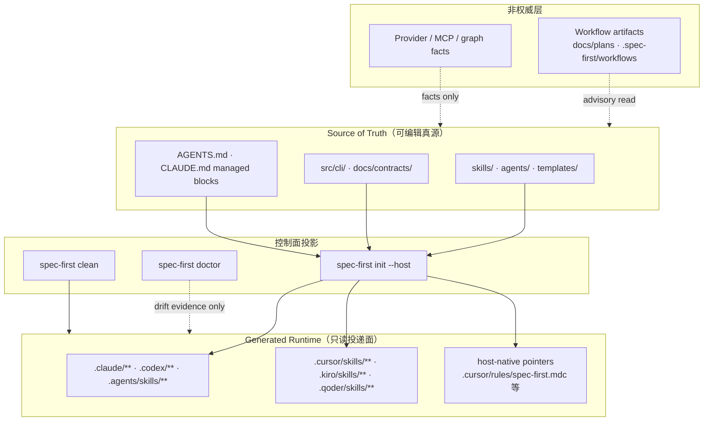
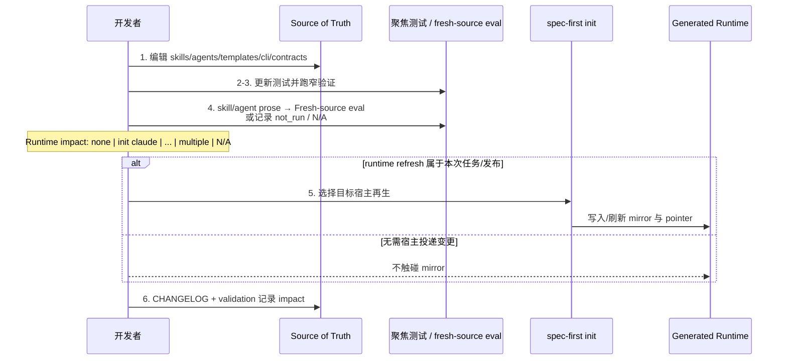

本页解释 spec-first 的 **Governance Harness** 核心边界：谁拥有行为语义、谁只负责宿主投递、谁只能提供证据。读完后，你应能判断一次改动该落在 `skills/` 还是 `.claude/`，何时必须 `spec-first init`，以及为何 doctor 报 drift 也不等于“可以手改 runtime”。

## 一句话原则

**Source 拥有行为；Generated Runtime 只投递行为；Provider 只供给证据，不拥有语义权威。** 改行为先改 source，再按需再生 runtime；禁止把 mirror、host-local 配置或外部工具输出当成第二套真源。

Sources: [source-runtime-customization-boundary.md](docs/contracts/source-runtime-customization-boundary.md#L1-L5)、[ai-coding-harness.md](docs/contracts/ai-coding-harness.md#L19-L23)、[CONCEPTS.md](CONCEPTS.md#L77-L83)

## 为什么必须分离

多宿主 AI Coding Harness 若允许“在 `.claude/skills` 里顺手修一刀”，会立刻出现三套不可调和的问题：同一 workflow 在 Claude / Codex / Kiro 上行为分叉；`init` 刷新会静默覆盖本地补丁；审查与 eval 无法判断“源文本”与“当前会话缓存”哪个才算数。分离原则把这些冲突压缩为可机械执行的路径规则与可审计的 regeneration 流程。

Sources: [source-runtime-customization-boundary.md](docs/contracts/source-runtime-customization-boundary.md#L25-L63)、[fresh-source-eval-checklist.md](docs/contracts/workflows/fresh-source-eval-checklist.md#L3-L9)、[dual-host-governance/README.md](docs/contracts/dual-host-governance/README.md#L14-L32)

## 概念关系图

先用一张关系图锚定三类权威。图中箭头表示“生成 / 约束 / 消费”，不表示运行时状态机。



Sources: [source-runtime-customization-boundary.md](docs/contracts/source-runtime-customization-boundary.md#L7-L93)、[platform-registry.js](src/cli/adapters/platform-registry.js#L3-L142)

## Source of Truth：可以改、必须改的地方

下列 checked-in 资产决定行为、契约、测试与 runtime 生成逻辑。任何“想让宿主里的 skill 换说法 / 换门禁”的意图，都应先落在这里：

| 类别 | 路径 | 角色 |
| --- | --- | --- |
| Workflow / Skill 源 | `skills/` | 用户可见 `spec-*` 行为正文 |
| Agent 源 | `agents/` | 有界判断角色，不是独立真源 |
| 宿主模板 | `templates/` | hooks / commands 生成原料 |
| CLI 控制面 | `src/cli/`、`src/cli/contracts/**` | init / doctor / projection 实现 |
| 契约与文档 | `docs/`、`README*.md`、`CHANGELOG.md` | 合同、手册、变更记录 |
| 宿主入口文档 | `AGENTS.md`、`CLAUDE.md` | checked-in 入口；其中 managed block 是 generator 管辖的 **source slice**，不是 runtime mirror |

`AGENTS.md` / `CLAUDE.md` 容易被误判为“生成物”。契约明确区分：它们是入库的 host entry documents；managed block 由 bootstrap generator 维护，但文件本身仍属 source 层，与 `.claude/skills/**` 这类 mirror 不同。

Sources: [source-runtime-customization-boundary.md](docs/contracts/source-runtime-customization-boundary.md#L7-L23)、[instruction-bootstrap.js](src/cli/instruction-bootstrap.js#L12-L18)、[CONCEPTS.md](CONCEPTS.md#L77-L79)

## Generated Runtime：只能再生、不能当补丁面

Generated Runtime 是宿主可发现、可调用的投影副本与 host-local 配置输出。契约用“**Do not hand-edit these paths as source fixes**”锁定修复路径：先改 source，再 `spec-first init`，并按提示选择目标宿主。

### 五宿主投影面（摘要）

| 宿主 | 典型 generated-runtime 表面 | 备注 |
| --- | --- | --- |
| Claude | `.claude/commands/spec*`、`.claude/skills/spec-*`、`.claude/spec-first/`、`.claude/agents/spec-*`、managed hooks | ownership 在 registry 标为 `generated-runtime` |
| Codex | `.agents/skills/spec-*`（正式 skill 面）、`.codex/spec-first/`、agents/hooks；旧 `.codex/commands/spec/*` 仅清理目标 | 产品面统一走 `.agents/skills/`，避免双重入口 |
| Cursor | `.cursor/skills/**`、`.cursor/spec-first/`、`.cursor/rules/spec-first.mdc`、`.cursor/mcp.json` | **generated-runtime preview**；loader 未验证前不得当完整宿主 |
| Kiro | `.kiro/skills/**`、`.kiro/agents/**`、`.kiro/spec-first/`、`.kiro/steering/spec-first.md`、managed settings | 不占用 Kiro native Specs 命名空间 |
| Qoder | `.qoder/commands/spec-*.md`、`.qoder/skills/**`、`.qoder/agents/**`、`.qoder/rules/spec-first.md`、managed hooks / settings.local | clean 只删 managed slice，保留用户 hooks |

Sources: [source-runtime-customization-boundary.md](docs/contracts/source-runtime-customization-boundary.md#L25-L63)、[platform-registry.js](src/cli/adapters/platform-registry.js#L3-L142)、[dual-host-governance/README.md](docs/contracts/dual-host-governance/README.md#L14-L38)

### 修复与诊断命令

```bash
# 1) 改 source 后，按宿主再生 mirror
spec-first init            # 交互选择宿主
spec-first init --codex    # 显式单宿主
spec-first init --cursor   # Cursor 仍是 preview，需显式选择

# 2) 观察 drift：证据，不是手改授权
spec-first doctor --claude
spec-first doctor --cursor

# 3) 移除 managed runtime（不删用户资产）
spec-first clean --qoder
```

doctor 的 drift 报告只说明 source 与 runtime 可能需要 reconciliation；它 **不是** “直接 patch mirror” 的许可证。Cursor 的 doctor 还额外报告 preview posture，不证明 skill 可被加载/调用。

Sources: [source-runtime-customization-boundary.md](docs/contracts/source-runtime-customization-boundary.md#L52-L63)、[README.zh-CN.md](README.zh-CN.md#L95-L95)

## 混合所有权：host root ≠ 全部都是 mirror

目标仓库里的 `.claude/`、`.cursor/`、`.qoder/` 等 root 是 **mixed-ownership surfaces**。spec-first 只管辖命名空间内的 managed 路径；团队自写的 skills / rules / portable 配置可以入库共享。`init` **不得** blanket-ignore 或自动 untrack 这些用户资产——它们也 **不会** 因此变成 package 行为真源。

同一逻辑适用于 host-native 表面：

| 表面 | 归属 | 消费规则 |
| --- | --- | --- |
| `.kiro/specs/**` | Kiro-owned | 仅显式命名时作 advisory |
| `.cursor/rules/**`、`.cursor/agents/**`、未知 `.cursor/**` | Cursor/user-owned | 仅显式命名时作 advisory |
| `.qoder/rules/**`、用户 hooks、非 managed settings | Qoder/user-owned | 仅显式命名；clean 不得误删 |
| Qoder managed hooks（`session-start`、两个 PRD guard） | spec-first managed slice | runtime 输出；默认 context 排除 |

Sources: [source-runtime-customization-boundary.md](docs/contracts/source-runtime-customization-boundary.md#L61-L69)、[context-governance.md](docs/contracts/context-governance.md#L30-L55)

## Host-native Pointer：指针不是第二真源

Cursor / Kiro / Qoder 会写入宿主原生规则文件，把注意力指回根 `AGENTS.md` 与已安装的 `using-spec-first` runtime skill。pointer 生成器在正文中硬编码边界声明，并在冲突时 **拒绝覆盖用户文件**：

```text
This file is a spec-first managed host-native pointer.
...
Do not treat this file as a second source of truth.
Regenerate it with `spec-first init --<host>`.
```

同步策略：

1. 路径不存在 → 写入 managed pointer  
2. 已有内容且带 managed marker → 按期望内容刷新  
3. 已有内容但 **无** managed marker → `host_native_pointer_user_owned_collision` warning，文件保持不变；init/clean 都不覆盖/删除  

doctor 对缺失、用户冲突、metadata/content drift 分别给出可执行 fix（重新 init 或迁移用户指引）。

Sources: [host-native-pointer.js](src/cli/adapters/host-native-pointer.js#L11-L74)、[README.zh-CN.md](README.zh-CN.md#L95-L95)、[source-runtime-customization-boundary.md](docs/contracts/source-runtime-customization-boundary.md#L35-L47)

## 投影与安全闸：gitignore、untrack、路径 denylist

分离原则不只靠文档，还靠控制面机械闸。

**`.gitignore` managed block** 把 generated runtime、本地 workflow artifacts、可选 provider 产物写入 `# spec-first:start` … `# spec-first:end` 段，避免 mirror 被误当项目源码提交。

**Runtime untrack** 在 init 时对已误 track 的 managed runtime 执行 `git rm --cached`（工作区文件保留），reason 为 `managed_runtime_untrack`。部分路径（pointer、team-policy MCP 配置、managed-slice hooks 等）标记 `runtimeUntrack: false`，避免把“应团队协商是否共享”的文件静默移出 index。

**路径 denylist** 把 generated runtime 前缀冻结为只读常量，供 task-pack、context-bundle、resource-governance-lens 等复用：artifact 字段不得指向 mirror；staged generated path 会触发 `staged-generated-runtime` advisory。

Sources: [gitignore-policy.js](src/cli/gitignore-policy.js#L6-L116)、[runtime-untrack.js](src/cli/runtime-untrack.js#L9-L32)、[target-repo.js](src/cli/helpers/target-repo.js#L9-L48)、[resource-governance-lens.js](src/cli/helpers/resource-governance-lens.js#L110-L126)

## 默认上下文：普通 workflow 不读 mirror

Context Harness 把 generated runtime 默认从 ordinary context 排除（`generated_runtime_mirror_excluded` 等 reason_code）。plan / work / review 应读 source 与 summary，而不是把 `.claude/**` 扫进 prompt。仅 runtime 任务（`spec-mcp-setup`、`update`、显式 audit、用户点名路径）可在有界范围内读取对应 artifacts——**例外不改变真源**：修 mirror 仍走 source + init。

Sources: [context-governance.md](docs/contracts/context-governance.md#L24-L55)、[context-governance.md](docs/contracts/context-governance.md#L109-L133)、[ai-coding-harness.md](docs/contracts/ai-coding-harness.md#L17-L23)

## 另外两层“不是真源”

分离原则还切割了两类常被误抬权的输入。

### Workflow Artifacts

`docs/brainstorms/`、`docs/plans/`、`docs/tasks/`、`docs/validation/`、`docs/solutions/`、`.spec-first/workflows/` 等是 **本地证据**，可被下游与人类阅读，但 **不得覆盖** `skills/`、`agents/`、`templates/`、`src/cli/`、`docs/contracts/**` 的行为合同。

### Provider / Tool Facts

ast-grep、browser、MCP、包管理器、shell 等只准备 `reason_code`、路径、exit code、schema 结果、readiness/freshness、有界摘录。LLM 仍负责产品范围、架构取舍、workflow 推荐、审查结论，以及 degraded evidence 是否够用。**Advisory facts 不是 confirmed truth。**

Sources: [source-runtime-customization-boundary.md](docs/contracts/source-runtime-customization-boundary.md#L71-L103)、[ai-coding-harness.md](docs/contracts/ai-coding-harness.md#L33-L38)、[CONCEPTS.md](CONCEPTS.md#L89-L99)

## 正确定制流程（Customization Flow）

契约给出六步轻量闭环。关键是把 **Runtime impact** 写成显式决策，而不是默认每次全量刷 mirror：



| 字段 | 合法值 | 用法 |
| --- | --- | --- |
| `Fresh-source eval` | `passed` / `concerns` / `not_run` / `N/A` | 触及 skill/agent/workflow prose、模板、host entry、generated-runtime 行为时必须严肃对待；纯实现改动常用 `N/A` |
| `Runtime impact` | `none` / `init claude` / `init codex` / `init cursor` / `init kiro` / `init qoder` / `multiple` / `N/A` | 与 eval 并列写在 PR/closeout，强制回答“要不要刷 mirror” |

fresh-source eval **只读磁盘上的 source**，检查项包括：是否把 runtime 资产写成真源、是否声明 regeneration 而非 hand-edit。`runtime_paths_checked` 通常为空。

Sources: [source-runtime-customization-boundary.md](docs/contracts/source-runtime-customization-boundary.md#L144-L155)、[fresh-source-eval-checklist.md](docs/contracts/workflows/fresh-source-eval-checklist.md#L50-L61)

## 反模式对照

| 反模式 | 正确做法 | 机制支撑 |
| --- | --- | --- |
| 直接改 `.claude/skills/spec-plan/SKILL.md` “先让本机好用” | 改 `skills/spec-plan/SKILL.md`，再 `init --claude` | source list + init regeneration |
| 把 doctor drift 当补丁授权 | 以 drift 为证据，回到 source 修复 | doctor 语义声明 |
| 把 `.cursor/rules/spec-first.mdc` 写成完整工作流文档 | 保持 pointer；路由写在 `using-spec-first` source | pointer 模板禁止 second SoT |
| 覆盖用户已有的 host rule 文件 | 报告 collision，请用户迁移或加 marker | `planHostNativePointerSync` 不覆盖 |
| task pack / review 引用 mirror 路径作 source_ref | 引用 `skills/` 等 source | `GENERATED_RUNTIME_*` denylist |
| 把 MCP raw dump 当需求/架构结论 | schema + 有界摘录 + source 确认 | Provider 非权威 + Evidence Harness |
| `git add .` 把 mirror 送进 index | 依赖 gitignore block；init untrack 清误 track | gitignore-policy + runtime-untrack |

Sources: [source-runtime-customization-boundary.md](docs/contracts/source-runtime-customization-boundary.md#L25-L63)、[host-native-pointer.js](src/cli/adapters/host-native-pointer.js#L52-L58)、[target-repo.js](src/cli/helpers/target-repo.js#L9-L48)、[gitignore-policy.js](src/cli/gitignore-policy.js#L6-L64)

## 与 Harness 分层的位置

在 [AI Coding Harness 合同](docs/contracts/ai-coding-harness.md) 中，本原则归属 **Governance Harness**，并被 Context / Evaluation 层复用：

- **Governance**：source/runtime/provider 边界、host delivery、mutation gate  
- **Context**：默认排除 mirror，避免 prompt 把投递面当源  
- **Evaluation**：fresh-source eval 与 contract 变更检查强制核对边界  

脚本负责路径、schema、hash、readiness 等可机械判定不变量；LLM 在该地板之上做语义充分性判断——边界本身保持 lightweight，不为分离原则再造中心化状态机。

Sources: [ai-coding-harness.md](docs/contracts/ai-coding-harness.md#L17-L38)、[ai-coding-harness.md](docs/contracts/ai-coding-harness.md#L48-L55)、[source-runtime-customization-boundary.md](docs/contracts/source-runtime-customization-boundary.md#L154-L155)

## 实践检查清单（提交前 30 秒）

1.  diff 是否只出现在 Source 表中的路径？若出现 `.claude/` / `.agents/skills/` 等，是否仅为有意的 init 产物且不作为 PR 主变更叙述？  
2. skill/agent prose 变更是否记录了 `Fresh-source eval` 与 `Runtime impact`？  
3. 若 impact 非 `none`/`N/A`，是否已对目标宿主执行 `spec-first init`（或明确延后到发布步骤）？  
4. 是否错误把 host-native pointer、MCP config 或 graph 产物写成行为依据？  
5. 普通 review/work 上下文是否误扫了 generated runtime denylist 路径？  

Sources: [source-runtime-customization-boundary.md](docs/contracts/source-runtime-customization-boundary.md#L144-L153)、[context-governance.md](docs/contracts/context-governance.md#L115-L133)

## 延伸阅读

- 上游概念： [核心词汇：Skill、Workflow、Artifact 与证据边界](10-he-xin-ci-hui-skill-workflow-artifact-yu-zheng-ju-bian-jie)、[确定性门禁与语义判断：脚本地板之上的 LLM 职责](11-que-ding-xing-men-jin-yu-yu-yi-pan-duan-jiao-ben-di-ban-zhi-shang-de-llm-zhi-ze)  
- 落地控制面： [CLI 控制面：init、doctor、update 与 clean](18-cli-kong-zhi-mian-init-doctor-update-yu-clean)、[多宿主 Runtime 投影与 pointer 文件治理](20-duo-su-zhu-runtime-tou-ying-yu-pointer-wen-jian-zhi-li)  
- 架构串联： [整体架构分层：控制面、执行面与契约串联](22-zheng-ti-jia-gou-fen-ceng-kong-zhi-mian-zhi-xing-mian-yu-qi-yue-chuan-lian)、[工作流契约与质量门禁：contracts、hooks 与 eval](23-gong-zuo-liu-qi-yue-yu-zhi-liang-men-jin-contracts-hooks-yu-eval)  
- 权威契约原文： [source-runtime-customization-boundary.md](docs/contracts/source-runtime-customization-boundary.md)、[context-governance.md](docs/contracts/context-governance.md)、[dual-host-governance/README.md](docs/contracts/dual-host-governance/README.md)