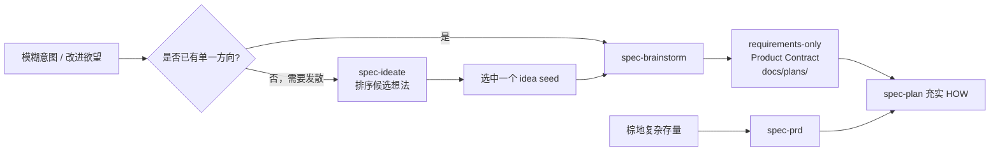
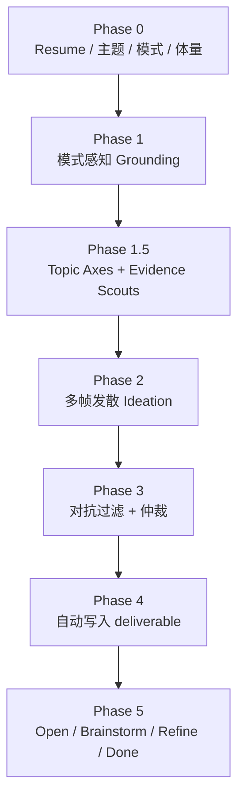
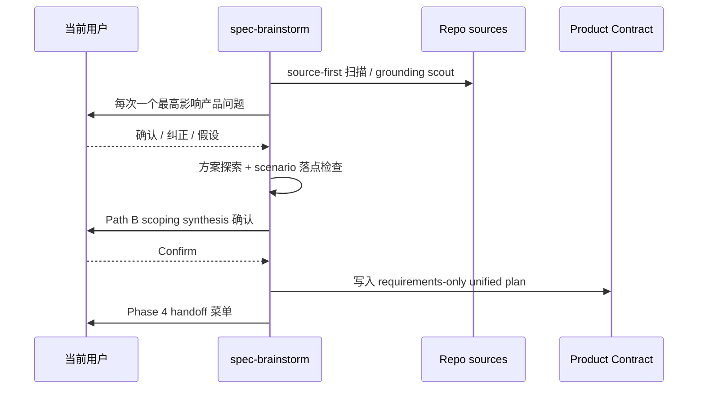

需求澄清回答的不是「怎么写代码」，而是更靠前的问题：**有哪些值得做的方向**，以及 **选定方向到底要交付什么用户价值、边界与验收**。在 spec-first 里，这条能力由 `spec-ideate`、`spec-brainstorm`（以及棕地路径上的 `spec-prd`）作为 **producer** 共同持有，最终落到可恢复的 **Product Contract** 或 legacy PRD 上；它不是单独的公开 workflow，也不发明第三种 handoff 文档。
Sources: [requirements-clarification.md](docs/contracts/workflows/requirements-clarification.md#L1-L16)

本文只讲澄清层：`spec-ideate` 如何产出排序后的想法、`spec-brainstorm` 如何把单一想法写成 **requirements-only** 统一计划，以及 Product Contract 如何成为后续规划的 source of truth。实现规划、任务拆解与棕地 PRD 闭环分别见后续页面。
Sources: [SKILL.md](skills/spec-ideate/SKILL.md#L12-L19) · [SKILL.md](skills/spec-brainstorm/SKILL.md#L12-L18)

## 为什么先澄清再规划

AI 编码最常见的失败模式，是把对话里半生不熟的「感觉」直接当成实现需求：规划时补行为、写代码时补验收、评审时才发现范围从未确认。需求澄清合同把职责钉死：**Product Contract / PRD 的 producer 负责 WHAT**；未解决的产品假设必须显式标记，不能漂白成「已经确认的事实」再交给 `spec-plan`。
Sources: [requirements-clarification.md](docs/contracts/workflows/requirements-clarification.md#L7-L16)

澄清层按成熟度走三条路径，路径选择本身就是产品判断，而不是命令开关：

| 成熟度 | 路径 | 典型场景 |
| --- | --- | --- |
| 0→1 | `spec-ideate` → `spec-brainstorm` → `spec-plan` | 还没有方向，需要先发散再收敛 |
| 1→10 | `spec-brainstorm` → `spec-plan` | 用户已有想法，需要把 WHAT 钉死 |
| 10→100 | `spec-prd` → `spec-plan` | 棕地/存量行为需要 PRD 级澄清（见下一页） |

没有上游 producer 产物时，`spec-plan` 仍可直接 bootstrap，但必须把未决产品假设标成 planning-time assumption。
Sources: [requirements-clarification.md](docs/contracts/workflows/requirements-clarification.md#L9-L16)



上图中的 Product Contract 是 **durable source**；`/tmp` 里的 dossier、对话 transcript、缓存与 helper 状态只是加速材料，会话中断后应以磁盘上的计划产物恢复，而不是依赖临时文件。
Sources: [requirements-clarification.md](docs/contracts/workflows/requirements-clarification.md#L42-L56)

## 谁说了算：所有权与确认人

澄清质量取决于三方边界是否被遵守。脚本只能证明路径、hash、schema 与投影事实；LLM 负责读 source、分类缺口、做场景相关性判断并综合 artifact；**当前执行对话中的用户是唯一人类产品确认人**。专家材料（隐私、安全、财务等）是证据，不是第二签字人。
Sources: [requirements-clarification.md](docs/contracts/workflows/requirements-clarification.md#L18-L27)

| 角色 | 负责 | 明确禁止 |
| --- | --- | --- |
| Scripts / tools | 文件发现、路径、hash、receipt / projection 事实 | 裁决产品含义、优先级或 readiness |
| LLM / agent producer | 读 source、分类 gap、建议、综合 artifact | 伪造 source 检查或代替用户确认 |
| 当前对话用户 | 需求、验收、范围、术语、优先级、风险接受 | 产品确认 ≠ 授权改项目级 glossary/ADR |
| Specialist 材料 | 风险与依据 | 创建第二确认人或替代用户决策 |

每轮只问一个 **最高影响的独立产品问题**。source 能回答的事实必须先读 source；纯偏好可记 `source_attempt: not-applicable`，不要做形式化空查。
Sources: [requirements-clarification.md](docs/contracts/workflows/requirements-clarification.md#L18-L40) · [SKILL.md](skills/spec-brainstorm/SKILL.md#L20-L28)

## `spec-ideate`：先找「最值得探索的方向」

### 定位与边界

`spec-ideate` 回答：**哪些想法足够强、值得继续探索？** 它写的是排序后的 ideation 产物（默认 HTML，可配置 markdown），路径优先 `docs/ideation/`；它 **不** 写 requirements、plan 或代码。从 ideation 直接跳到 `spec-plan` 是合同禁止的捷径——仓库模式下必须经 `spec-brainstorm` 钉 Product Contract。
Sources: [SKILL.md](skills/spec-ideate/SKILL.md#L12-L19) · [post-ideation-workflow.md](skills/spec-ideate/references/post-ideation-workflow.md#L148-L152)

与相邻 skill 的一句话分工：

| Skill | 核心问题 | 主产物 |
| --- | --- | --- |
| `spec-ideate` | What are the strongest ideas worth exploring? | `docs/ideation/*-ideation.{html,md}` |
| `spec-brainstorm` | What exactly should one chosen idea mean? | `docs/plans/*-plan.{md,html}`（requirements-only） |
| `spec-plan` | How should it be built? | 同一统一计划上的 HOW 充实 |

Sources: [SKILL.md](skills/spec-ideate/SKILL.md#L12-L16)

### 执行骨架：Ground → Generate many → Critique → Survivors

核心原则只有三条：**先 grounding 再发散**；**先大量生成再对抗过滤**（质量来自带理由的拒绝，不是乐观排名）；**行动路由进 brainstorm，而不是实现**。
Sources: [SKILL.md](skills/spec-ideate/SKILL.md#L42-L46)



Phase 0 会先解决输出格式（默认 `html`，pipeline 强制 `md`）、是否续写近 30 天相关 ideation、主题是否可识别，以及 **repo-grounded / elsewhere-software / elsewhere-non-software** 路由。模糊主题（如单独一个 “improvements”）必须先问清 subject，并始终保留 **Surprise me** 作为一等选项；不要把 brainstorm 才该问的方案约束提前塞进 ideation。
Sources: [SKILL.md](skills/spec-ideate/SKILL.md#L56-L120)

Phase 1 按模式并行收集 grounding：仓库模式做 codebase scan、learnings、web research（可 skip）、可选 issue intelligence；elsewhere 模式用用户上下文合成替代扫仓。失败策略是 **warn and proceed**，grounding 失败不阻塞整条链路。
Sources: [SKILL.md](skills/spec-ideate/SKILL.md#L200-L280)

Phase 1.5 把主题拆成 3–5 个正交 **axes**（想什么表面），与 Phase 2 的 frames（怎么想）正交。仓库模式下每个 axis 可派 extraction-tier evidence scout 写 dossier；atomic subject 或 surprise-me 可跳过分解。
Sources: [SKILL.md](skills/spec-ideate/SKILL.md#L300-L360)

Phase 3 的对抗过滤先由 fresh-context verifier 判定 basis 是否站得住，再由 orchestrator 仲裁。拒绝原因包括：过虚、不可行动、重复、无依据、未过 meeting-test、替换主题、越界扩张等；默认保留 **5–7** 个 survivors，并关注 axis 覆盖而不是扎堆在一个轴上。
Sources: [post-ideation-workflow.md](skills/spec-ideate/references/post-ideation-workflow.md#L5-L52)

### Ideation 产物长什么样

Ideation 文档是 **面向人的发现物**，不是需求书。典型结构：

- Metadata：`date` / `topic` / `focus` / `mode`（**无 status 字段**）
- Grounding Context
- Topic Axes（或跳过原因）
- Ranked Ideas（title、description、axis、basis、rationale、downsides、confidence、complexity）
- Rejection Summary

每条 survivor 的 **basis** 必须可标记为 `direct:` / `external:` / `reasoned:` 之一；没有依据的「野心」应在过滤阶段被拒绝。
Sources: [ideation-sections.md](skills/spec-ideate/references/ideation-sections.md#L14-L70)

### 从 ideation 交到 brainstorm：focused seed

用户选择「Brainstorm one idea」时，agent **不得**把整份 ideation 文件塞给 `spec-brainstorm`，也不得只丢一个文件指针。正确做法是构造 feature-description 形态的 **focused seed**，携带：标题与描述、basis、source snapshot（含 dirty/unknown）、价值理由、tradeoffs、evidence limitations、unverified assumptions，以及 **一个** 直接相邻的被拒替代（不是整张 rejection 表）。
Sources: [post-ideation-workflow.md](skills/spec-ideate/references/post-ideation-workflow.md#L130-L152) · [spec-ideate-clarification-handoff-contracts.test.js](tests/unit/spec-ideate-clarification-handoff-contracts.test.js#L8-L28)

## `spec-brainstorm`：把「一个方向」钉成 WHAT

### 定位与边界

`spec-brainstorm` 通过协作对话回答 **WHAT to build**，并写出 **requirements-only unified plan**——在其他语境里可能叫轻量 PRD 或 feature brief；在 spec-first 里工作流仍叫 brainstorm，但产物落在 `docs/plans/`，并带：

- `artifact_contract: spec-unified-plan/v1`
- `artifact_readiness: requirements-only`
- `product_contract_source: spec-brainstorm`

它 **不实现代码**；用户行为、范围边界与成功标准在这里解决，库表、endpoint、文件布局默认留给 `spec-plan`，除非 brainstorm 本身就是技术/架构决策。
Sources: [SKILL.md](skills/spec-brainstorm/SKILL.md#L12-L26) · [brainstorm-sections.md](skills/spec-brainstorm/references/brainstorm-sections.md#L24-L48)

### 何时需要 brainstorm，何时不必硬做

开场已有明确验收、既有模式与精确行为时，应 **简短确认** 并给出下一步，而不是硬撑长仪式；只有需要 durable handoff 时才写短的 requirements-only 计划。范围会按 **Lightweight / Standard / Deep** 分级，Deep 再分 feature vs product（是否要建立产品形态本身）。
Sources: [SKILL.md](skills/spec-brainstorm/SKILL.md#L140-L175)

还有两类路由值得记住：

1. **非软件探索** → `universal-brainstorming` 路径，**不**写 `spec-unified-plan/v1` 的 Product Contract。
2. **是否采纳某外部技术/库/平台** 的 verdict 形态 → 应路由到 `spec-pov`，因为那是「是否 commit 外部选项」，不是「要建什么」。
Sources: [SKILL.md](skills/spec-brainstorm/SKILL.md#L100-L138)

### 对话纪律：一次一个问题 + Product Pressure Test

交互规则对初学者尤其重要：**每轮只问一个问题**；优先单选；默认用宿主 blocking question tool（Claude 的 `AskUserQuestion` / Codex 的 `request_user_input`）；只有真正叙事性答案才用开放题，且开放题必须足够具体到能引出实质回答。
Sources: [SKILL.md](skills/spec-brainstorm/SKILL.md#L30-L40)

Phase 1.1 先做 source-first 扫描：把 load-bearing gap 分类为 **source fact / current-user decision / open exploration / planning-owned HOW**，并记录 write target——这是内存中的分类，**不是**持久 gap 表。Phase 1.2 的 Product Pressure Test 是 agent 内部分析，不是用户 checklist；按 tier 只探测真实存在的 rigor gaps（证据、具体受益人、反事实、attachment、Deep-product 的 durability 等）。
Sources: [SKILL.md](skills/spec-brainstorm/SKILL.md#L150-L190) · [product-pressure-test.md](skills/spec-brainstorm/references/product-pressure-test.md#L1-L48) · [spec-brainstorm-clarification-contracts.test.js](tests/unit/spec-brainstorm-clarification-contracts.test.js#L14-L24)

Standard/Deep 行为需求在合成前还要做 **相关性驱动的场景扫描**：happy path、role/permission、state transition、failure/degraded、negative acceptance、cross-context handoff。只有会改变 Acceptance Example / Outstanding Question / assumption / Non-Goal 的场景才保留；禁止笛卡尔积 checklist。
Sources: [product-pressure-test.md](skills/spec-brainstorm/references/product-pressure-test.md#L50-L58) · [requirements-clarification.md](docs/contracts/workflows/requirements-clarification.md#L58-L62)

### 方法探索与合成确认

Phase 2 在仍有多个合理方向时给出 2–3 个 **机制/产品形态级** 方案（不是架构清单），先展示全部再推荐；方案粒度停在「pause as rule property vs event filter」这类产品可判断差异，不写列名/表名/JSON shape。
Sources: [SKILL.md](skills/spec-brainstorm/SKILL.md#L220-L260)

Phase 2.5 的 **scoping synthesis** 是用户在落盘前最后一次纠正范围的机会。它 **不是** Product Contract 草稿：内部先做 Stated / Inferred / Out of scope 三桶思考，聊天里只呈现「我们在建什么 / 关键 trade-off / 不在范围 / call-outs」。Lightweight 且全程无 blocking 问题走 Path A（announce-only）；其余走 Path B（完整合成 + 强制确认）。
Sources: [synthesis-summary.md](skills/spec-brainstorm/references/synthesis-summary.md#L1-L70)



### Product Contract 硬地板与按需章节

当对话产生了值得 durable 保存的结构决策时，才写文档；小 bug 对齐可以直接流向 plan/commit，不必硬造 brainstorm 文件。
Sources: [brainstorm-sections.md](skills/spec-brainstorm/references/brainstorm-sections.md#L50-L78)

**必有（hard floor）**：

1. **Summary** — 1–3 行，面向未来：提案是什么。
2. **Requirements（R-IDs）** — 必须为真的陈述；稀疏时可无 ID，否则用稳定 R1/R2… 并按能力分组。

**按材料出现**：Problem Frame、Key Decisions、Actors、Key Flows、Visualizations、Acceptance Examples、Success Criteria、Scope Boundaries、Dependencies / Assumptions、Outstanding Questions（区分 **Resolve Before Planning** vs **Deferred to Planning**）、Sources / Research。
Sources: [brainstorm-sections.md](skills/spec-brainstorm/references/brainstorm-sections.md#L108-L200)

统一计划骨架保持轻量：只有 **Goal Capsule** + **Product Contract**；不写空的 Planning Contract / Implementation Units / Verification，避免 requirements-only 文档看起来「已经可执行」。`spec-plan` 会在 **同一文件** 上就地充实 HOW。
Sources: [brainstorm-sections.md](skills/spec-brainstorm/references/brainstorm-sections.md#L24-L48)

路径与元数据约定：

```text
docs/plans/YYYY-MM-DD-NNN-<type>-<topic>-plan.{md|html}
```

必填字段包括 `title`（`… - Plan`）、`type`、`date`、`topic`、`artifact_contract`、`artifact_readiness`、`product_contract_source`。**没有 status 生命周期字段**——readiness 描述文档完整度，是否已上线看 git，不看文档里的进度条。
Sources: [brainstorm-sections.md](skills/spec-brainstorm/references/brainstorm-sections.md#L230-L270)

### 暂停、恢复与 Handoff

暂停、headless 或上下文重置前，必须把 confirmed facts、source refs/snapshot、limitations、invalidation、assumptions、具名 blocker、**下一个最高影响问题及其 write target** 写回 artifact；禁止伪造用户 closure。
Sources: [requirements-clarification.md](docs/contracts/workflows/requirements-clarification.md#L42-L56) · [SKILL.md](skills/spec-brainstorm/SKILL.md#L280-L295)

Phase 4 菜单按状态裁剪：`Resolve Before Planning` 非空时 **隐藏**「Create the implementation plan」与「lfg」；HTML 产物暂不提供 markdown-only 的 `spec-doc-review`。选择 plan 时把统一计划路径（及仍存在的 grounding dossier 路径）交给 `spec-plan`。
Sources: [handoff.md](skills/spec-brainstorm/references/handoff.md#L8-L80)

## Product Contract 与项目知识的边界

当前 Product Contract 只闭合 **本 release slice** 所需含义。`CONCEPTS.md`、glossary、`CONTEXT.md`、ADR 等只是 advisory calibration；冲突时不得因文件名或「canonical」标签静默胜出。`spec-brainstorm` **不创建/修改** 项目级 glossary 或 ADR；跨 release 复用只能输出 **promotion candidate**（含 target、provenance、consumer、invalidation、以及 “not written by this workflow”），缺资格字段则保持本地闭合。
Sources: [requirements-clarification.md](docs/contracts/workflows/requirements-clarification.md#L64-L78) · [SKILL.md](skills/spec-brainstorm/SKILL.md#L300-L312)

历史 `docs/brainstorms/*-requirements.*` 仍可作为 `spec-plan` 的 legacy 输入，但 **新的** `spec-brainstorm` 不再写入该目录。
Sources: [SKILL.md](skills/spec-brainstorm/SKILL.md#L95-L98) · [brainstorm-sections.md](skills/spec-brainstorm/references/brainstorm-sections.md#L49-L51)

## 初学者实操清单

| 你现在的状态 | 调用 | 成功信号 |
| --- | --- | --- |
| 「我想改进 DX，但不知道改哪」 | `spec-ideate` | `docs/ideation/` 出现排序想法 + rejection 理由 |
| 「就做登录记住设备」 | `spec-brainstorm` | `docs/plans/*-plan.md` 带 `artifact_readiness: requirements-only` |
| 从 ideation 选中第 2 条 | Phase 5 → Brainstorm one idea | brainstorm 收到 focused seed，而非整文件 |
| 范围已确认，要写 HOW | handoff → `spec-plan` | 同一 plan 文件被充实，而非另起炉灶 |
| 棕地大需求/存量契约 | `spec-prd`（下一页） | legacy PRD + readiness，而非强行用 brainstorm 顶替 |

Sources: [requirements-clarification.md](docs/contracts/workflows/requirements-clarification.md#L9-L16) · [handoff.md](skills/spec-brainstorm/references/handoff.md#L60-L90)

**常见误用（避免）**

1. 把 ideation 当需求书，直接开写代码。  
2. 在 brainstorm 里讨论 schema/endpoint 细节，却从未确认用户行为与验收。  
3. 一次抛出多个产品问题，或把 specialist 意见当成第二确认人。  
4. 依赖 `/tmp` dossier 当唯一真相，会话一断无法恢复。  
5. 静默改写 `CONCEPTS.md` / ADR，而不是本地闭合 + promotion candidate。
Sources: [requirements-clarification.md](docs/contracts/workflows/requirements-clarification.md#L18-L78) · [SKILL.md](skills/spec-brainstorm/SKILL.md#L20-L28) · [post-ideation-workflow.md](skills/spec-ideate/references/post-ideation-workflow.md#L148-L152)

## 与整条主链路的位置

澄清层处在主链路最前端：先把方向与 Product Contract 钉住，再进入棕地 PRD（若适用）、实现规划、任务与执行、审查与知识沉淀。若你刚完成首次安装，可结合走查页对照一次真实 artifact 落盘；若已有 requirements-only 计划，下一步应阅读规划页，而不是回头再发明 WHAT。
Sources: [requirements-clarification.md](docs/contracts/workflows/requirements-clarification.md#L1-L16)

**建议阅读顺序**

1. 若尚未建立方法论语境：[Spec-First 方法论：从对话到可治理工程闭环](9-spec-first-fang-fa-lun-cong-dui-hua-dao-ke-zhi-li-gong-cheng-bi-huan) · [核心词汇：Skill、Workflow、Artifact 与证据边界](10-he-xin-ci-hui-skill-workflow-artifact-yu-zheng-ju-bian-jie)
2. 本文（当前页）：ideate / brainstorm / Product Contract
3. 棕地与大需求：[棕地 PRD：spec-prd 的 grill、write 与 readiness 闭环](14-zong-di-prd-spec-prd-de-grill-write-yu-readiness-bi-huan)
4. 把 WHAT 充实为 HOW：[实现规划：spec-plan 如何把 WHAT 充实为 HOW](15-shi-xian-gui-hua-spec-plan-ru-he-ba-what-chong-shi-wei-how)
5. 执行与证据：[任务拆解与执行：write-tasks、work 与 verification evidence](16-ren-wu-chai-jie-yu-zhi-xing-write-tasks-work-yu-verification-evidence)