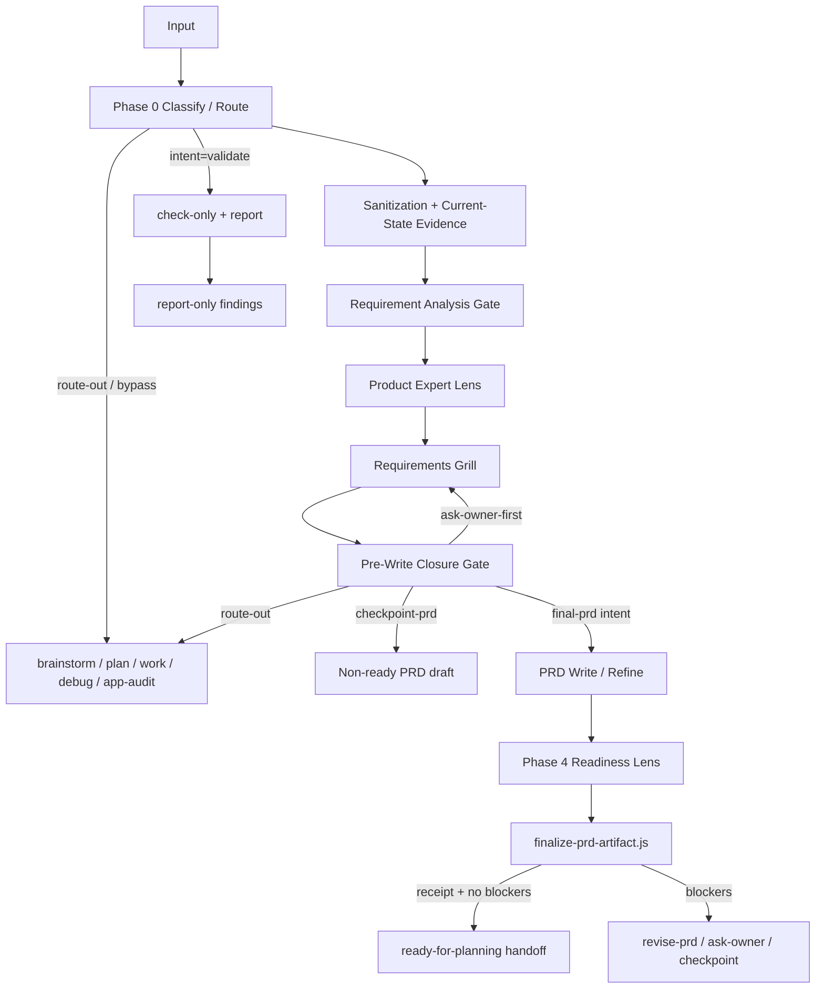
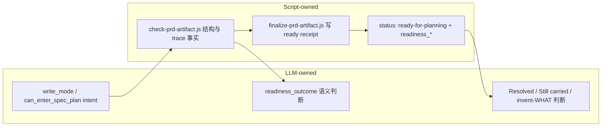

`spec-prd` 是面向**已有系统增量**的 PRD 级需求工作流：先用 source-first 的 relentless grill 把 WHAT/WHY 问清楚，再写入可机读的 requirements 产物，最后用 readiness lens + producer finalize 决定能否交给 `spec-plan`。它不写实现计划、不拆任务、不改生成 runtime 镜像，也不负责 0-1 产品探索。

Sources: [SKILL.md](skills/spec-prd/SKILL.md#L1-L40)

本页只解释这条 **grill → write → readiness** 闭环：阶段职责、合法停点、写前闸、机读收据与常见失败模式。若你需要上游的产品形态澄清，见 [需求澄清：ideate、brainstorm 与 Product Contract](13-xu-qiu-cheng-qing-ideate-brainstorm-yu-product-contract)；若已 ready 后要进入 HOW，见 [实现规划：spec-plan 如何把 WHAT 充实为 HOW](15-shi-xian-gui-hua-spec-plan-ru-he-ba-what-chong-shi-wei-how)。

## 1. 为什么棕地需要单独的 PRD 闭环

棕地需求的核心风险不是“写不出一段需求文案”，而是 **planning 被迫发明 WHAT**：演员、流程、验收、范围、源真相、界面可用性、降级展示等尚未闭合，却被当成可实现规格。`spec-prd` 用三层纪律对抗该风险：

1. **Brownfield first**：先建立可证据标注的现状快照，再写增量行为。
2. **WHAT not HOW**：产品行为、验收、边界、假设与 blocker 写在 PRD；表结构、精确 API 字段、任务拆解留给 plan。
3. **Clarify relentlessly before writing**：默认先 grill，分支只能在四个合法停点结束；“够写一节了”不是停点。

Sources: [SKILL.md](skills/spec-prd/SKILL.md#L83-L89), [evidence-and-topology.md](skills/spec-prd/references/evidence-and-topology.md#L1-L50)

架构边界也已明确：`spec-prd` 保持 **workflow 编排 + 选择性 agent dispatch**，不把每个 spine 节点做成常驻 agent 专家；稳定性来自**第一次 durable write 前的可观测检查点**与 **script 守的 finalize 出口**，而不是更多角色。

Sources: [0002-spec-prd-stays-workflow-not-agent-collection.md](docs/adr/0002-spec-prd-stays-workflow-not-agent-collection.md#L1-L40)

## 2. 主链路总览

主 spine 是一条分析优先的生产链；`validate` 在证据收集后分叉为只读报告，永不进入 write/finalize 写路径。



Sources: [SKILL.md](skills/spec-prd/SKILL.md#L14-L15), [SKILL.md](skills/spec-prd/SKILL.md#L220-L340)

| 关口 | 必须完成 | 合法下一步 |
| --- | --- | --- |
| Intake | 判定 route-out/bypass、`intent`、`input_posture`、是否拆分，并说明 PRD 是否仍能沉淀 durable WHAT | 进入 Phase 1，或路由到 brainstorm / app-audit / plan / work / debug |
| Phase 1+ durable action | 先展示可见任务列表（OQ/证据、PRD 写入目标、owner 问题、finalize 缺口） | 继续 source-first grill；轻量 route-out 可一句话收口 |
| 第一次 durable PRD Write | Requirement Analysis Gate + Product Expert Lens（或 Lite Brief）+ Decision Card + Pre-Write Closure | `ask-owner-first` / `checkpoint-prd` / `final-prd` / `route-out` |
| Phase 4 closeout | readiness lens + finalize/checker；报告 finding 数、blocking reason_codes、receipt status、`readiness_outcome` | 仅当收据与 LLM readiness 同时支持时交接 plan |

Sources: [SKILL.md](skills/spec-prd/SKILL.md#L93-L116)

## 3. Phase 0：意图分类与输入姿态

Phase 0 先决定**要不要做 PRD 仪式**，而不是先开写。

| 决策 | 关键取值 | 含义 |
| --- | --- | --- |
| 是否 route-out | 0-1 产品、一致性审计、实现计划/任务、debug、已可直接修 | 交给 brainstorm / app-audit / plan / work / debug |
| PRD 操作 | `create` / `refine` / `validate` | 新建增量、改写低质 PRD、只读规划就绪检查 |
| 分析档案 | `default`；仅当调用串含精确 token 时 `analysis_profile=contract-reset-lite` | Lite 只压缩并行分析仪式，不换产物拓扑、不弱化 closure |
| 输入姿态 | `resume-prd` / `reference-claims` / `wrong-stage` / `pure-text` / `no-input` | 原地续写、未信任参考材料、错阶段文档、一行增量、缺输入 |

`intent=validate` 会锁定 `mutation_posture=report-only`：不写 PRD、不跑 write-mode finalize、不刷新 runtime；只允许读产物与有界 source、跑 checker/`--check-only`/receipt 验证并给出语义 findings。用户说“校验并修好”时，先报告 + 预览改动，确认后再重分类为 `refine`。

Sources: [SKILL.md](skills/spec-prd/SKILL.md#L220-L245)

## 4. Grill：source-first 的 relentless 澄清

### 4.1 为什么 grill 是默认路径

对 rough PRD、draft、`reference-claims`、`resume-prd`、`pure-text` 等多源材料，`create`/`refine` 的默认姿态是 **grill-with-docs 纪律**：一次只问一个 owner 问题、先查代码/文档再问人、把闭合结果写回 PRD 本地章节。项目级 `CONTEXT.md` / glossary / ADR **只读作校准源**；跨 release 知识最多产出 **candidate-only**，本工作流不改这些文件。

Sources: [grill-with-docs-integration.md](skills/spec-prd/references/grill-with-docs-integration.md#L1-L40), [grill-with-docs-integration.md](skills/spec-prd/references/grill-with-docs-integration.md#L150-L178)

### 4.2 共享理解图与 Product Expert Lens

默认档案下，Phase 1 先跑 **Requirement Analysis Gate**（run-local map，不是持久 schema），最小字段包括：`input_inventory`、`source_authority_order`、`target_surface_anchor`、`current_state_summary`、`change_delta`、`module_map`、`open_decisions`、`design_coverage`、`api_coverage`、`risk_to_prd_write_target`，以及 `next_owner_question` 或 source-backed 无问题理由。兼容声明 `preflight_sweep_closure` 表示该 gate 已闭合。

Sources: [SKILL.md](skills/spec-prd/SKILL.md#L260-L266)

在此 map 上，**Product Expert Lens** 用统一 run-local 接口排序风险：

```text
downstream_confirmation_risk -> claim -> evidence/source -> gap
  -> owner_question_or_assumption -> PRD_write_target -> closure_state
```

Requirements Grill 只消费 `gap + owner_question_or_assumption + PRD_write_target`；风险排序决定**先问谁**，不决定**是否继续问**——继续问是默认。

Sources: [product-expert-lens.md](skills/spec-prd/references/product-expert-lens.md#L1-L70)

### 4.3 Canonical：四个合法停点

load-bearing 分支默认继续 grill，**只能**在下列停点结束：

| 停点 | 含义 | Light 字段映射 |
| --- | --- | --- |
| **leaf** | 已无会改变行为/验收/范围的子决策 | `owner_question_progress=closed` |
| **source-resolved** | 源码/文档/测试/glossary/既有 PRD 已闭合 | `source-resolved` |
| **owner-capped** | owner 明确“够了”（含 soft-cap 后选择 cap） | `owner-capped` |
| **how-pushdown** | 明确是 HOW，推给 plan，并给理由 | `route-out` 语义 |

**不是停点**（只影响提问顺序）：够写一节 PRD、已问过一个关键问题、问题变长、不影响当前 release slice、gap 尚未绑定 `PRD_write_target`。owner 无 cap/continue 信号时，唯一合法 fallback 是 `write_mode=checkpoint-prd` + `can_enter_spec-plan: no` + `next_owner_question`，并记 `pre_prd_clarification_status=checkpoint-blocked`，**禁止静默 ready**。

Sources: [SKILL.md](skills/spec-prd/SKILL.md#L195-L199)

### 4.4 交互与证据纪律

- 一次一个问题；优先宿主阻塞式工具（Claude `AskUserQuestion` / Codex `request_user_input`），否则 `question_delivery=chat-fallback` 并等待。
- 只有真正无法等待才用 `true-headless-unavailable`。
- 现状主张必须带证据 tag：`confirmed-source` / `user-stated` / `source-candidate` / `external-research` / `assumption`。
- code-graph / project-graph 等 capability-class 候选**只是 advisory**，不能决定 scope 权威。

Sources: [SKILL.md](skills/spec-prd/SKILL.md#L67-L80), [evidence-and-topology.md](skills/spec-prd/references/evidence-and-topology.md#L19-L40)

## 5. Write：Pre-Write Closure 与产物形态

### 5.1 Decision Card 与 Pre-Write Closure Gate

第一次 durable Write 前，必须先给出 run-local **Decision Card**：

- `write_mode`
- `highest_risk_gap`
- `next_action`（`ask-owner-first` / `checkpoint-prd` / `final-prd` / `route-out`）
- `why planning will not invent WHAT`

其中三项要落进 PRD `Readiness Self-Check` 机读声明：`decision_card_highest_risk_gap:`、`decision_card_next_action:`、`decision_card_why_no_invention:`。路径冲突会触发 `decision_card_path_mismatch`。

| write_mode | 语义 | 规划交接 |
| --- | --- | --- |
| `ask-owner-first` | 继续 grill 最高风险分支（不是“问完一题就停写”） | 不交接 |
| `checkpoint-prd` | owner 无信号 / 真 headless / 大输入恢复 | `can_enter_spec-plan: no`，非 ready |
| `final-prd` | 每个 load-bearing 分支已达合法停点 | 仅 intent；`status` 仍须 draft，直到 finalize |
| `route-out` | 错阶段或无 durable WHAT 价值 | 无 PRD 或显式转出 |

LLM 可在 `status: draft` 下持久化 `write_mode=final-prd` 与 `can_enter_spec_plan: yes`；**不得**自写 `status: ready-for-planning` 与 `readiness_*` 收据字段。

Sources: [SKILL.md](skills/spec-prd/SKILL.md#L266-L272), [SKILL.md](skills/spec-prd/SKILL.md#L20-L22)

### 5.2 产物拓扑与模板组合

| 项 | 合同 |
| --- | --- |
| 路径 | `docs/brainstorms/*-requirements.md` |
| `artifact_kind` | `prd-requirements` |
| 禁止 | `docs/prds/`、实现代码、实现计划、改 generated runtime mirrors |
| 核心章节 | Summary、Change Delta、Requirements、Acceptance Examples、Scope Boundaries、Evidence And Assumptions |
| 机读安全章节 | Outstanding Questions、Owner Decision Trace、Readiness Self-Check、Design Source Coverage（可按 section id 定位） |

模板按触发加载：始终读 `00-generic.md`，再读一个 primary surface 模板；真实 Mixed 才加 secondary；owner 确认大拆分才读 `70-large-requirement-index.md`；有证券/交易信号才读 overlay。Human-facing 模板不得预填 ready receipt。

Sources: [prd-output-template.md](skills/spec-prd/references/prd-output-template.md#L24-L90), [SKILL.md](skills/spec-prd/SKILL.md#L130-L150), [00-generic.md](skills/spec-prd/assets/templates/00-generic.md#L1-L40)

### 5.3 Closure-disposition 剃刀

Outstanding Questions 默认阻塞规划；要变成 non-blocking，必须声明合法 disposition + 证据，而不是模型自由判定：

| disposition | 证据要求 |
| --- | --- |
| `source-resolved` / `source-backed-non-what-assumption` | 可检查引用（路径、URL、`file:line`、锚点） |
| `owner-answered` / `owner-capped` / `owner-accepted-assumption` | 绑定到**该 OQ** 的 Owner Decision Trace 行 |
| `implementation-only-how-pushdown` | 声明 `planning_would_invent_what=no`，且不触及接口可用性/权限/范围/源真相/降级展示/分析验收 |

`blocks_planning=no` 只能由 disposition 推导，不能直接断言。checker 只校验 token 与证据格存在，不裁决“是否 load-bearing”或“owner 是否真说过”。

Sources: [SKILL.md](skills/spec-prd/SKILL.md#L276-L290), [check-prd-artifact.js](skills/spec-prd/scripts/check-prd-artifact.js#L88-L100)

## 6. Readiness：lens、checker 与 finalize 所有权

### 6.1 语义透镜 vs 脚本地板



- **Readiness lens**：按 pack 检查现状证据、澄清闭合、拓扑/设计/领域等；脚本 findings 是事实输入，**不单独等于**语义 ready。
- **check-prd-artifact.js**：报告 frontmatter、核心章节、R↔AE trace、声明缺失、grill/design/receipt 等 **script-owned facts**。
- **finalize-prd-artifact.js**：在无 blocking reason 时原子写入 `status: ready-for-planning` 与 `readiness_verified_*` 哈希收据。

Sources: [prd-readiness-lens.md](skills/spec-prd/references/prd-readiness-lens.md#L1-L45), [finalize-prd-artifact.js](skills/spec-prd/scripts/finalize-prd-artifact.js#L300-L320), [check-prd-artifact.js](skills/spec-prd/scripts/check-prd-artifact.js#L1-L20)

### 6.2 生产者出口命令

create/refine 在存在 PRD 路径时，从**当前加载的** `spec-prd` skill 根执行：

```bash
SKILL_DIR="<loaded spec-prd directory containing SKILL.md>"
node "$SKILL_DIR/scripts/finalize-prd-artifact.js" <prd-path> --inputs <input-path>
```

| 模式 | 用途 |
| --- | --- |
| 默认写模式 | 通过后写 ready receipt |
| `--check-only` | 预览是否可 closeout，不写文件 |
| `--verify-receipt` | 消费侧只读校验 origin |
| `--inputs-from-frontmatter` | 使用 frontmatter `source_inputs:` / legacy `prd_input:` |
| `--refresh-inputs-hash` | 仅当唯一阻断是 `ready_receipt_stale` 时刷新 inputs hash |

closeout 摘要至少包含：finding count、blocking `reason_codes`、receipt status、`readiness_outcome`。没有 finalize/checker receipt 的 handoff 视为未过 Phase 4。

Sources: [SKILL.md](skills/spec-prd/SKILL.md#L328-L340), [finalize-prd-artifact.js](skills/spec-prd/scripts/finalize-prd-artifact.js#L400-L430)

### 6.3 阻断码与 checkpoint closeout

`reason-codes.js` 是阻断分类的单一真相源。代表性 BLOCKING 码包括：`core_section_missing`、`write_mode_undeclared`、`clarification_evidence_undeclared`、`decision_card_undeclared`、`preflight_sweep_closure_blocked`、`open_oq_without_owner_closure`、`ready_receipt_absent` / `ready_receipt_stale`、`checkpoint_claims_ready` 等。

finalize 把 **ready finalization** 与 **closeout 许可**拆开：合法 checkpoint（`write_mode=checkpoint-prd` + `can_enter_spec_plan: no` + 不自称 ready）可 `can_closeout=true` 但 `can_finalize=false`；`ask-owner-first` / `route-out` 不是 closeout 出口。

Sources: [reason-codes.js](skills/spec-prd/scripts/lib/reason-codes.js#L1-L90), [finalize-prd-artifact.js](skills/spec-prd/scripts/finalize-prd-artifact.js#L200-L250)

### 6.4 readiness_outcome

| 结果 | 含义 |
| --- | --- |
| `ready-for-planning` | planning 无需发明 WHAT（且需 current machine receipt） |
| `revise-prd` | 先修具体 PRD 缺口 |
| `ask-owner` | 继续 source-backed grill 问题 |
| `doc-review` | 需要独立文档审查（浅 grill、未读设计、OQ 未逐条绑定等） |
| `route-out` | 更适合 brainstorm / audit / plan / work / debug |

Sources: [prd-readiness-lens.md](skills/spec-prd/references/prd-readiness-lens.md#L150-L170)

## 7. 宿主护栏：写前闸与 Stop 闸

在 managed Claude 上，有两道脚本护栏加固闭环：

1. **prd-prewrite-guard（PreToolUse）**：拦截对 `docs/brainstorms/*-requirements.md` 的 `Write|Edit|MultiEdit`；首次 durable write 要求合法 `write_mode`，并阻止直接改 machine-owned ready/receipt 字段。
2. **prd-readiness-guard（Stop）**：对变更中的 PRD 跑 `finalize --check-only`；final intent 无 current receipt 会阻断 closeout。

Claude 是确认的硬执行宿主；Qoder 投影存在但 activation 未核实；Codex/Cursor/Kiro 为 loud degraded，仍强制 producer finalize 纪律，**不得暗示同等硬保护**。

Sources: [prd-prewrite-guard](templates/claude/hooks/prd-prewrite-guard#L1-L80), [prd-readiness-guard](templates/claude/hooks/prd-readiness-guard#L1-L70), [SKILL.md](skills/spec-prd/SKILL.md#L20-L22)

## 8. 失败模式黑名单（观察驱动）

| 黑名单捷径 | 可观察触发 | 恢复动作 |
| --- | --- | --- |
| Direct write after read | 读完材料立刻写 PRD，无 Decision Card / 分析 map / grill trace | 回到 Phase 1，先分析再选 `write_mode` |
| Checkpoint as escape | 只问了泛化范围问题，就把未问的 load-bearing OQ 塞进 checkpoint，却标 `asked-owner` | 继续逐问最高风险缺口；仅真 headless/大输入可用 checkpoint |
| Fake headless | 聊天可等待却标 `true-headless-unavailable` | 用 blocking tool 或 chat-fallback 并等待 |
| Owner answer laundering | owner 要求读设计/源码，输出却改写成“owner 接受跳过” | 保留阻塞残留；无法满足则 non-ready checkpoint，等 owner 新答复 |
| Design evidence laundering | 设计未读/降级却标 confirmed | 记录 inventory、unread 原因与 readiness 后果 |
| Checker/finalize evasion | 无 current receipt 却称 ready，或把 draft 中 final intent 当 closeout | 跑 producer finalize/checker；不能跑则降级 |
| Runtime mirror patch | 改 `.claude/` 等生成镜像修 workflow | 改 `skills/spec-prd/**` 源，再 `spec-first init` 投影 |

Sources: [SKILL.md](skills/spec-prd/SKILL.md#L205-L218), [prd-readiness-lens.md](skills/spec-prd/references/prd-readiness-lens.md#L48-L70)

## 9. 开发者最小操作序列

1. **入口**：宿主的 `spec-prd` workflow；输入增量说明或现有 PRD 路径。
2. **Phase 0**：确认 create/refine/validate；必要时 route-out。
3. **Phase 1 grill**：消毒输入 → 现状证据 → Analysis Gate → Product Expert Lens → 一次一题 grill。
4. **写前**：展示任务列表 + Decision Card；只在合法停点后选 `final-prd` 或 `checkpoint-prd`。
5. **写产物**：`docs/brainstorms/YYYY-MM-DD-NNN-<slug>-requirements.md`，frontmatter 填 `source_inputs`。
6. **Phase 4**：跑 readiness lens，再 `finalize-prd-artifact.js`；报告脚本事实与 `readiness_outcome`。
7. **交接**：仅 `ready-for-planning` 时进入 [spec-plan](15-shi-xian-gui-hua-spec-plan-ru-he-ba-what-chong-shi-wei-how)；否则继续 grill / revise / doc-review。

Sources: [SKILL.md](skills/spec-prd/SKILL.md#L105-L116), [SKILL.md](skills/spec-prd/SKILL.md#L320-L340)

## 10. 与相邻页面的边界

| 需求场景 | 正确入口 |
| --- | --- |
| 0-1 产品形态未定 | [需求澄清：ideate、brainstorm 与 Product Contract](13-xu-qiu-cheng-qing-ideate-brainstorm-yu-product-contract) |
| 棕地 PRD grill/write/readiness | **本页 / `spec-prd`** |
| WHAT 已 ready，需要 HOW | [实现规划：spec-plan 如何把 WHAT 充实为 HOW](15-shi-xian-gui-hua-spec-plan-ru-he-ba-what-chong-shi-wei-how) |
| 任务拆解与执行证据 | [任务拆解与执行：write-tasks、work 与 verification evidence](16-ren-wu-chai-jie-yu-zhi-xing-write-tasks-work-yu-verification-evidence) |
| 文档独立审查 / 知识沉淀 | [审查与知识沉淀：code-review、doc-review 与 compound](17-shen-cha-yu-zhi-shi-chen-dian-code-review-doc-review-yu-compound) |

## 小结

`spec-prd` 的棕地价值，在于把 **relentless grill 的语义闭合**、**write_mode 写前闸** 与 **finalize 机读收据** 串成同一闭环：LLM 负责“是否还在发明 WHAT”，脚本负责“结构/trace/receipt 是否可验证”，宿主护栏降低直接写 ready 的捷径。掌握四个合法停点、Decision Card 与 Phase 4 出口命令，就能把“看起来像需求的 Markdown”收敛成可交接的 planning-ready PRD。