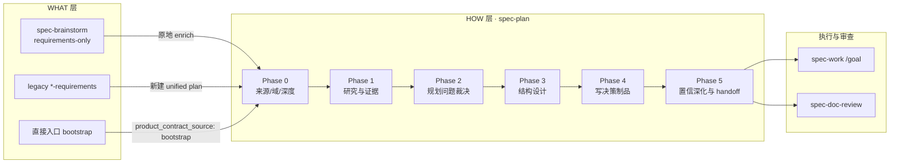
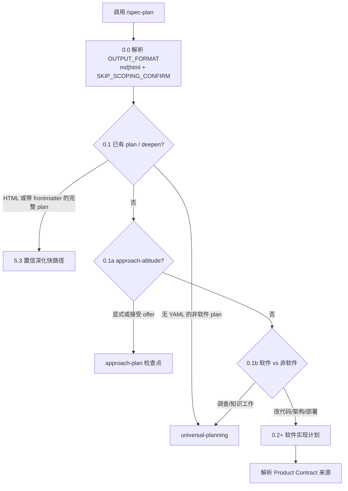
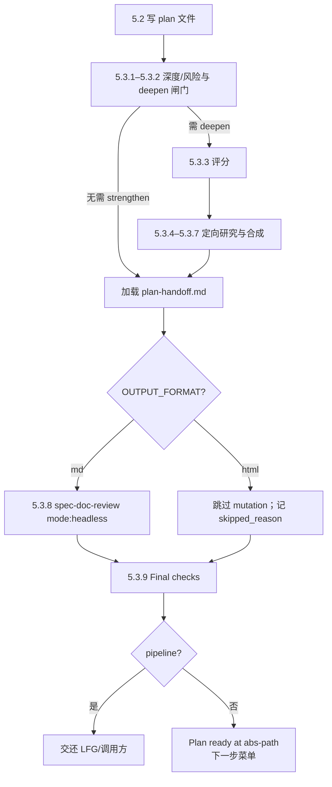

`spec-plan` 是主链路里把「要做什么」落实成「怎么做」的规划工作流。它不写业务代码、不跑测试、不从执行反馈里改设计；它产出一份可治理、可 trace、可交给 `spec-work` 或目标模式执行的 **implementation-ready 统一计划制品**。对中级开发者而言，理解它的关键不是背章节清单，而是抓住三条硬边界：**WHAT/HOW 分离**、**规划期与执行期分离**、**决策制品而非实现规格**。

Sources: [SKILL.md](skills/spec-plan/SKILL.md#L11-L25)

## 在主链路中的位置：从 Product Contract 到可执行计划

上游的 `spec-brainstorm`（以及仍可消费的 legacy `docs/brainstorms/*-requirements`）负责锁定 **Product Contract**：问题框、需求 R-ID、Actor/Flow/Acceptance Example、范围边界。`spec-plan` 默认 **就地充实** 同一份 `spec-unified-plan/v1` 制品：把 `artifact_readiness` 从 `requirements-only` 推到 `implementation-ready`，并补齐 Planning Contract、Implementation Units、Verification Contract 与 Definition of Done。下游的 [任务拆解与执行：write-tasks、work 与 verification evidence](16-ren-wu-chai-jie-yu-zhi-xing-write-tasks-work-yu-verification-evidence) 再消费这些 U-ID 工作包。

Sources: [SKILL.md](skills/spec-plan/SKILL.md#L11-L15) · [plan-sections.md](skills/spec-plan/references/plan-sections.md#L24-L60)

这份链路的不变量是：**一份文件、两种就绪态**，而不是「需求文档 + 另一份实现文档」。`requirements-only` 只保证 Product Contract 可读；`implementation-ready` 才允许 `spec-work` 或 `/goal` 开跑。若仍存在 **会阻塞启动** 的产品/架构问题，制品必须停留在 `requirements-only`，不能把阻塞问题伪装成「已可执行」。

Sources: [plan-sections.md](skills/spec-plan/references/plan-sections.md#L24-L55)

## 核心哲学：决策、边界与可移植性

`spec-plan` 的质量条不是「计划越长越好」，而是实现者能否在不让计划替自己写代码的前提下自信开工。契约层面要求：清晰问题框与范围、需求可回指、repo-relative 路径、feature-bearing 单元带测试文件与可枚举场景、决策带理由、依赖与排序明确。伪代码与图可以出现，但必须被框定为 **方向性指引**，禁止 imports、精确签名、框架语法与 shell 编舞。

Sources: [SKILL.md](skills/spec-plan/SKILL.md#L47-L76)

| 原则 | 含义 | 反模式 |
|------|------|--------|
| Product Contract 为真源 | 有上游时原地 enrich，不另起第二份 WHAT | 重写产品行为却不记录冲突 |
| Decisions, not code | 记 approach、边界、文件、风险、测试场景 | 把 RED/GREEN 步骤写进 plan |
| Research before structure | 先仓内/机构知识/条件性外研，再定结构 | 无证据空想架构 |
| Right-size depth | Lightweight / Standard / Deep 改细节量，不改规划边界 | 小改动硬套 Deep 模板 |
| Planning ≠ execution discovery | 规划期能答的答完；运行时未知显式 defer | 用假确定性填满 Open Questions |
| Portable living doc | 可当 review 制品或 issue body | 嵌入宿主专属 executor 指令 |
| Light execution direction | 仅在 TDD/表征/smoke 等非默认信号时用自然语言 note | 把执行方向编码成有限 enum |

Sources: [SKILL.md](skills/spec-plan/SKILL.md#L47-L63)

路径规则是可移植性的硬约束：计划正文、文件列表、origin 引用一律 **仓库相对路径**。跨仓规划时在文首声明一次 target repo，正文仍保持相对路径，避免 worktree/队友环境失效。

Sources: [SKILL.md](skills/spec-plan/SKILL.md#L43-L45)

## 统一计划制品契约：元数据、就绪态与章节注册表

下游消费者（`spec-work`、审查技能、人工扫读）依赖稳定元数据与稳定标题，而不是「整篇通读」。软件实现计划应声明 `artifact_contract: spec-unified-plan/v1`、`artifact_readiness`、`product_contract_source`，以及 `execution: code`（或 knowledge-work 路径下的非代码标记）。**不要**把 readiness 写成 `active`/`done` 这类进度词——进度由 git 与 `spec-work` 推导，plan 本体是决策制品。

Sources: [plan-sections.md](skills/spec-plan/references/plan-sections.md#L24-L60) · [tests/unit/spec-plan-contracts.test.js](tests/unit/spec-plan-contracts.test.js#L9-L24)

**逻辑章节注册表**（Markdown 标题 / HTML anchor 同源）：

| 逻辑节 | 作用 | 就绪态要求 |
|--------|------|------------|
| Goal Capsule | 目标、权威层级、停止条件、执行剖面 | implementation-ready 必备 |
| Product Contract | 需求、Actor/Flow/AE、产品范围 | requirements-only 起就存在 |
| Planning Contract | KTD、高层设计、假设、排序与研究结论 | plan 充实后必备 |
| Implementation Units | 带 U-ID 的可独立执行工作包 | implementation-ready 必备 |
| Verification Contract | 仓库具体命令与质量门 | implementation-ready 必备 |
| Definition of Done | 全局与 per-unit 完成标准（含清理废弃尝试代码） | implementation-ready 必备 |
| Appendix | 长研究/原始笔记 | 可选 |

Sources: [plan-sections.md](skills/spec-plan/references/plan-sections.md#L62-L100)

**Hard floor vs include-when-material** 是裁剪规则：硬地板章节服务三类读者（实现 agent、评审者、未来回看者）；可选章节（HTD、Scope Boundaries、Open Questions、System-Wide Impact、Risks、Sources…）只有真正承载信息时才出现——空段落比省略更糟。

Sources: [plan-sections.md](skills/spec-plan/references/plan-sections.md#L1-L22) · [plan-sections.md](skills/spec-plan/references/plan-sections.md#L200-L250)

## 入口分流：不是每次都走软件实现计划

`spec-plan` 被直接调用时 **始终留在规划工作流**，但 Phase 0 会先分流，避免把研究问答硬塞进 U-ID 模板。

Sources: [SKILL.md](skills/spec-plan/SKILL.md#L13-L17)

**输出模式**互斥：`.md` 或 `.html` 二选一。优先级为 in-prompt `output:` / 自然语言 → 会话记忆偏好 → 配置 `plan_output` → 默认 `md`；**pipeline / LFG / disable-model-invocation 强制 md**，因为自动化下游更可靠解析 Markdown。HTML 计划不写 YAML frontmatter，元数据走可见 header；因此 deepen 路由 **先看扩展名**，不能把「无 frontmatter」误判为非软件。

Sources: [SKILL.md](skills/spec-plan/SKILL.md#L80-L130)

**Approach altitude** 回答的是「先确认 *如何产出交付物* 的方法」，在方法不确定且做错成本高时持有检查点；它与 Phase 0.7/5.1.5 的 **scope 合成**、Phase 5.3 的 **deepen** 正交：前者决定是否承诺交付物，后两者在已承诺交付物上工作。

Sources: [approach-altitude.md](skills/spec-plan/references/approach-altitude.md#L1-L40)

**Universal planning** 覆盖非软件 plan-seeking 与 answer-seeking：前者产出可保存的非软件计划（不得贴 `spec-unified-plan/v1` 除非已含完整软件执行合同）；后者把 plan-of-attack 当工作脚手架，**默认不写 plan 文件**，并强调「只露问题域价值、隐藏 skill 机械过程」的 veil-of-value。

Sources: [universal-planning.md](skills/spec-plan/references/universal-planning.md#L1-L90)

## Phase 0：来源、阻塞与深度

### Product Contract 发现顺序

发现只认两类 durable origin：（1）`product_contract_source: spec-brainstorm` 的 requirements-only 统一计划；（2）legacy `docs/brainstorms/*-requirements.{md,html}`。**不**静默发明 `product_contract_source: spec-prd` 统一源；当前 PRD 制品若带 readiness/Handoff 字段，按 legacy 形态消费。直接入口可 bootstrap，`product_contract_source: spec-plan-bootstrap`。

Sources: [SKILL.md](skills/spec-plan/SKILL.md#L190-L220) · [tests/unit/spec-plan-contracts.test.js](tests/unit/spec-plan-contracts.test.js#L26-L34)

`requirements-only` 文件是 **enrichment input**，不是 resume 目标：不得弹出「更新还是新建」；pipeline 里尤其重要，因为无人回答 resume 提示。若同 basename 已有 `implementation-ready` 另一格式文件，requirements-only 副本视为被格式转换 supersede，不得再 enrich 陈旧副本。

Sources: [SKILL.md](skills/spec-plan/SKILL.md#L140-L155)

相关性按语义主题与同一用户问题判定；「近 30 天」只提高排序优先级，**年龄既非必要条件也非充分条件**。消费前必须检查 source refs、快照/版本、局限与失效条件，并 re-read 已变化的引用。

Sources: [SKILL.md](skills/spec-plan/SKILL.md#L210-L225) · [tests/unit/spec-plan-contracts.test.js](tests/unit/spec-plan-contracts.test.js#L36-L49)

### 阻塞问题与 bootstrap 诚实性

`Resolve Before Planning`、`checkpoint-prd`、`can_enter_spec_plan: no` 以及会改变行为/范围/成功标准的 Outstanding Question，一律视为用户控制信号。默认退回上游 producer（brainstorm 或 PRD）；用户可显式把阻塞转为 **assumption + consequence + accepted risk** 后继续，但不得把阻塞「洗白」成 producer 已确认的 WHAT。

Sources: [SKILL.md](skills/spec-plan/SKILL.md#L250-L280) · [tests/unit/spec-plan-contracts.test.js](tests/unit/spec-plan-contracts.test.js#L51-L59)

直接 bootstrap 时，任何 **未由当前用户陈述或当前源确认** 的负载 WHAT，必须记为 planning-time assumption，不得伪装为已确认产品事实。

Sources: [SKILL.md](skills/spec-plan/SKILL.md#L230-L245) · [tests/unit/spec-plan-contracts.test.js](tests/unit/spec-plan-contracts.test.js#L61-L68)

### 深度分级与 Scoping Synthesis

| Depth | 典型信号 | 单元规模（指引） |
|-------|----------|------------------|
| Lightweight | 边界清晰、低歧义 | 约 2–4 |
| Standard | 有技术决策的常规特性/有界重构 | 约 3–6 |
| Deep | 横切、战略、高风险、高度歧义 | 约 4–8，可分 phase |

Sources: [SKILL.md](skills/spec-plan/SKILL.md#L282-L290)

**Scoping synthesis** 是写盘前的廉价纠偏闸门，**不是** plan 正文预览。内部三桶（Stated / Inferred / Out of scope）只服务思考；用户只看到可 affirm/redirect 的 scope claim 与 call-outs。禁止在合成里泄漏 Implementation Units 列表、精确路径、PR/提交编舞。

| 变体 | 时机 | 目的 |
|------|------|------|
| Solo · Phase 0.7 | 无上游源、bootstrap 后、研究前 | 防在错误 scope 上烧 sub-agent |
| Brainstorm-sourced · Phase 5.1.5 | 有上游 Product Contract、写盘前 | 确认 HOW 侧分叉，不重审 WHAT |

阻塞规则：仅 **Lightweight 且 0 个存活 call-out** 可 auto-proceed；Standard/Deep 始终确认（除非 headless 或 `confirm:auto` / `plan_skip_scoping_confirm`）。跳过只作用于该确认门，**不**跳过路由、产品阻塞、架构问题与 5.4 菜单。

Sources: [synthesis-summary.md](skills/spec-plan/references/synthesis-summary.md#L1-L50) · [SKILL.md](skills/spec-plan/SKILL.md#L292-L320)

## Phase 1–2：证据如何塑造 HOW

本地研究 **总是运行**：先 `repo-profile-cache.py get` 复用 agnostic stack/topology/conventions，再并行 `repo-research-analyst`（patterns 切片）与 `learnings-researcher`（`docs/solutions/`）。条件性派出 `agent-native-planning-strategist`（agent/MCP/skill/工具面变更时）；Slack 研究 **opt-in**。`STRATEGY.md` / `CONCEPTS.md` 仅作校准：冲突时保留 plan-local/Product Contract 语义。

Sources: [SKILL.md](skills/spec-plan/SKILL.md#L322-L390)

外研不是默认动作。三阶段决策：**(1)** 显式外部请求优先（opt-out 除外）；**(2)** 分类 intent 为 implementation-guidance / landscape / mixed；**(3)** 隐式信号（高风险域、本地模式 &lt;3、相邻域而非精确域、层缺失、未结算外部选项集）。落地规则：**外研必须进入 KTD/Alternatives/Risks/Sources 的决策位置**，禁止无承载附录；并内部标记是否 load-bearing，供 5.3 置信门使用。

Sources: [SKILL.md](skills/spec-plan/SKILL.md#L400-L490)

若研究揭示触及 env/CI/公开 API/CLI/共享类型等 **外部契约面**，Lightweight 必须 reclassify 为 Standard，以便 flow 分析与置信检查覆盖。Standard/Deep 可条件运行 `spec-flow-analyzer` 补边角与交接缺口。

Sources: [SKILL.md](skills/spec-plan/SKILL.md#L500-L520)

Phase 2 把问题分成 **规划期可解** vs **执行期 defer**。对用户不熟悉的领域，问题必须以「选项 + 权衡 + 推荐默认」脚手架呈现；pipeline 模式静默采用默认并记为 assumption。本阶段 **禁止** 跑测试/构建/探测运行时——那是 `spec-work` 的领地。

Sources: [SKILL.md](skills/spec-plan/SKILL.md#L522-L540)

## Phase 3–4：把 HOW 结构化为 U-ID 与章节

### 实施单元

单元是「通常可落为一个原子提交」的有意义变更：聚焦单组件/行为/集成缝、小簇相关文件、按依赖排序。每个单元使用稳定 **U-ID**（`### U1. Name` 标题形式，**禁止** checkbox 列表项——CommonMark 会把字段从列表中拆碎）。U-ID **永不重编号**：重排保留 ID，分裂给新号，删除留空号，以便 `spec-work` 跨编辑引用。

Sources: [SKILL.md](skills/spec-plan/SKILL.md#L542-L580)

每单元字段契约：

| 字段 | 要求 |
|------|------|
| Goal | 该单元完成什么 |
| Requirements | 推进哪些 R/A/F/AE |
| Dependencies | 以 U-ID 引用 |
| Files | 创建/修改/测试的 repo-relative 路径；feature-bearing 须含测试路径 |
| Approach | 决策、数据流、边界、集成注记 |
| Execution note | 可选；自然语言非默认证明方向 |
| Technical design | 可选；方向性伪代码/图 |
| Patterns to follow | 既有代码/约定 |
| Test scenarios | 命名输入/动作/期望；覆盖 happy/edge/error/integration 中适用类；`Covers AE…` 稀疏链接；无行为变更用 `Test expectation: none -- reason` |
| Verification | 结果导向，非 shell 脚本 |

Sources: [SKILL.md](skills/spec-plan/SKILL.md#L580-L640)

### 高层技术设计与反扩张

当组件拓扑、协议步骤、状态机、分叉门、数据流阶段等 **散文装不下** 时，加入 High-Level Technical Design（Mermaid/SVG/矩阵/伪代码）。图是权威内容的并列表达，不必再加「仅供参考」的弱化 caption。Greenfield 且 ≥3 新文件层级时，可选 `## Output Structure` 目录树——它是 scope 声明，per-unit Files 仍权威。

Sources: [SKILL.md](skills/spec-plan/SKILL.md#L560-L575)

规划中发现的 **切线清理/范围蔓延** 进入 Scope Boundaries 的 `Deferred to Follow-Up Work`，不得塞进活跃 U-ID；用户明确要求的重构则属 in-scope。这与 3.6「规划期未知 defer」互补：一个管未知，一个管已知但越界。

Sources: [SKILL.md](skills/spec-plan/SKILL.md#L650-L665)

### 写盘规则与「接口/架构/模块/库」落点

**NEVER CODE**：只研究、决策、写 plan。内容契约来自 `plan-sections.md`，呈现来自 `markdown-rendering.md` 或 `html-rendering.md`。Standard/Deep 顶层节之间用 `---` 分隔以利扫描；Lightweight 可省略。

Sources: [SKILL.md](skills/spec-plan/SKILL.md#L667-L720)

传统技术设计维度在 plan 中的映射（语义意图，非形式化 RFC 全量）：

| 传统维度 | 承载位置 | 形态 |
|----------|----------|------|
| API/接口 | KTD + System-Wide Impact 的 API parity + 单元 Approach/Files | 决策与影响面，非 OpenAPI |
| 系统架构 | HTD + KTD + Output Structure | 方向性草图 |
| 模块切分 | Implementation Units + Output Structure | U-ID 工作包，非 UML |
| 数据/状态 | System-Wide Impact 生命周期风险 + HTD 数据流/schema 草图 | 影响与风险，无强制 DDL 节 |

Sources: [06-spec-plan-输出文档结构.md](docs/02-架构设计/06-spec-plan-输出文档结构.md#L100-L140)

文件命名约定：`docs/plans/YYYY-MM-DD-NNN-<type>-<kebab-name>-plan.<md|html>`，序号跨扩展名统一计数。enrich 上游 requirements-only 时默认 **原地更新**；legacy origin 则新建并写 `origin:`。禁止在 planning 中创建/改写 `CONCEPTS.md`/ADR——仅可记录 **project-level promotion candidate** 供后续知识维护工作流处理。

Sources: [SKILL.md](skills/spec-plan/SKILL.md#L545-L555) · [SKILL.md](skills/spec-plan/SKILL.md#L730-L780)

## Phase 5：置信深化、文档审查与 handoff

写盘后自动进入置信检查。**Auto deepen**（默认生成路径）直接合成 findings；**Interactive deepen**（用户明确 deepen 完整 plan）逐 agent 接受/拒绝。置信检查强化理由、排序、风险与系统面；`spec-doc-review` 强化清晰度、完整性与范围控制——二者互补，**置信通过也不能跳过 markdown 的 headless doc-review**。

Sources: [SKILL.md](skills/spec-plan/SKILL.md#L785-L820)

Deepen 闸门：Lightweight 通常不 deepen（高风险例外）；Standard/Deep 对薄节加分；**本地模式稀薄触发的外研** 与 **load-bearing 外研** 强制进入 scoring。评分按 checklist 问题数 + 风险 bonus + 关键节 bonus，只选 top 2–5 节，每节 1–3 个 skill-local prompt agent（`architecture-strategist`、`security-sentinel`、`spec-flow-analyzer` 等），总量通常 ≤8。

Sources: [deepening-workflow.md](skills/spec-plan/references/deepening-workflow.md#L1-L80)

**强制完成合同**：软件实现计划在交互模式下，写文件、置信检查、doc-review 都只是中间里程碑；必须呈现 *「Plan ready at &lt;绝对路径&gt;. What would you like to do next?」* 并执行用户选择的路由后才算完成。Pipeline 例外：写盘 + 置信 + headless review 后直接交还调用方。

Sources: [SKILL.md](skills/spec-plan/SKILL.md#L17-L31) · [plan-handoff.md](skills/spec-plan/references/plan-handoff.md#L1-L40)

菜单能力（按制品与宿主裁剪后 1–N 重编号）：

| 选项 | 条件 | 行为要点 |
|------|------|----------|
| Start `/spec-work` *(recommended)* | implementation-ready + `execution: code` | 技能原语直接 invoke；`spec-work` 拥有 engine 选择与收尾 |
| Run as `/goal` | 同上 + 宿主 goal 能力 | **薄** objective：只指向路径与章节读法，禁止复制命令/U 依赖/DoD 正文；与 option 1 互斥 |
| Decide on review open items | 有 actionable findings 且非 HTML skip | 非 headless 再跑 `spec-doc-review` |
| Create Issue | 任意 | 发现 tracker 后创建 issue body from plan |
| Publish to Proof / Open in browser | 分别限 md / html | 单向分享；本地文件仍 canonical |

Sources: [plan-handoff.md](skills/spec-plan/references/plan-handoff.md#L40-L120)

## 何时甚至不该写 implementation-ready plan

契约明确 **偏向写 plan**（薄文档的代价低于该写却没写），但在 **同时** 满足以下条件时可跳过：工作原子（单 commit、无有意义单元边界）、无约束实现的 KTD、无可写明的范围边界、无上游制品需要 trace。压力测试：「加缓存」「迁移包」「加限流」看似原子，却常隐藏 TTL/语义差/算法等 KTD——应写 plan。

Sources: [plan-sections.md](skills/spec-plan/references/plan-sections.md#L110-L160)

## 实操检查清单（中级开发者）

1. **先找 origin**：优先 enrich requirements-only 统一计划；不要并行维护第二份 WHAT。  
2. **分清阻塞归属**：产品阻塞回 producer；技术问题在 plan 解决或显式 defer。  
3. **研究服务决策**：仓内模式优先；外研进 KTD/风险，不进装饰附录。  
4. **用 U-ID 说话**：排序靠依赖图，不靠重编号；测试场景写到实现者不必发明覆盖。  
5. **守住执行边界**：plan 不跑业务验证；需要改代码看结果时切 [任务拆解与执行](16-ren-wu-chai-jie-yu-zhi-xing-write-tasks-work-yu-verification-evidence)。  
6. **完成 = handoff 执行**：交互运行务必走到 5.4 菜单路由，而不是「文件写完就结束」。

Sources: [SKILL.md](skills/spec-plan/SKILL.md#L700-L760) · [SKILL.md](skills/spec-plan/SKILL.md#L800-L820)

## 延伸阅读

- 上游 WHAT 如何形成：[需求澄清：ideate、brainstorm 与 Product Contract](13-xu-qiu-cheng-qing-ideate-brainstorm-yu-product-contract) · [棕地 PRD：spec-prd 的 grill、write 与 readiness 闭环](14-zong-di-prd-spec-prd-de-grill-write-yu-readiness-bi-huan)  
- 下游执行与证据：[任务拆解与执行：write-tasks、work 与 verification evidence](16-ren-wu-chai-jie-yu-zhi-xing-write-tasks-work-yu-verification-evidence)  
- 审查与沉淀：[审查与知识沉淀：code-review、doc-review 与 compound](17-shen-cha-yu-zhi-shi-chen-dian-code-review-doc-review-yu-compound)  
- 契约与门禁总览：[工作流契约与质量门禁：contracts、hooks 与 eval](23-gong-zuo-liu-qi-yue-yu-zhi-liang-men-jin-contracts-hooks-yu-eval)

`spec-plan` 的杠杆，在于把「对话里的实现直觉」压成 **可审查、可 trace、可在机器间迁移的 HOW 合同**，同时坚决把代码与运行时发现留给执行面——这正是 Spec-First harness 在规划层的核心分工。