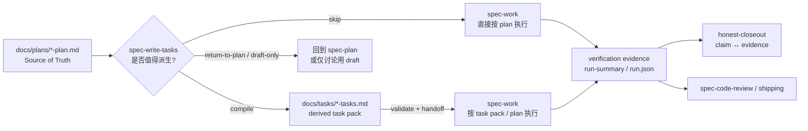
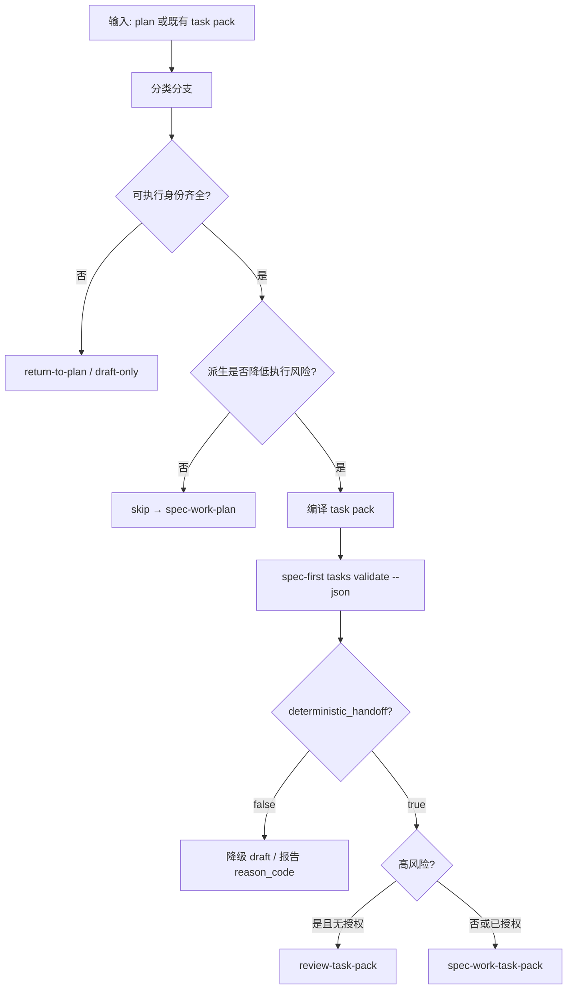
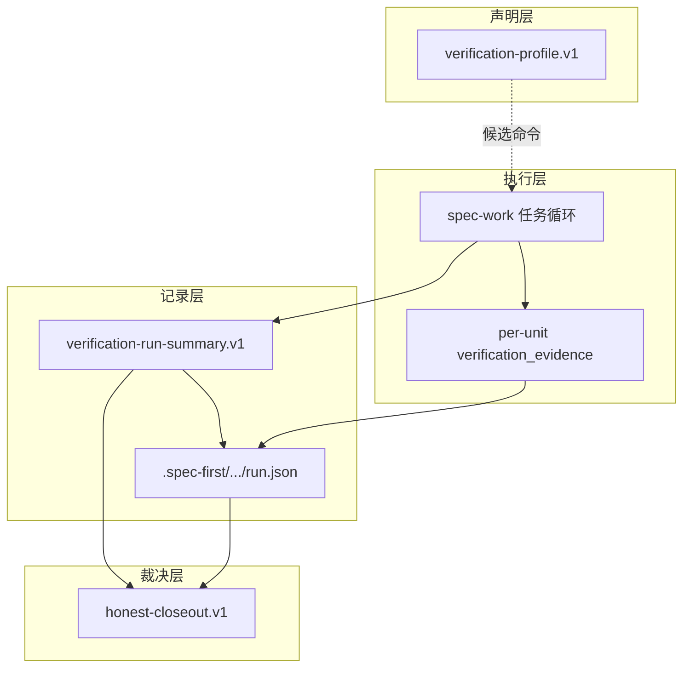

`spec-plan` 把需求压成可执行的 HOW 之后，主链路还差两件事：是否要把长计划压成可调度的任务索引，以及如何把实现过程里的「做过了」变成可核对的证据。本页只覆盖这一段——**可选的 `spec-write-tasks` 派生层、`spec-work` 执行闭环，以及 verification evidence / honest closeout 如何防止“口头通过”**。它承接 [实现规划：spec-plan 如何把 WHAT 充实为 HOW](15-shi-xian-gui-hua-spec-plan-ru-he-ba-what-chong-shi-wei-how)，并在收尾后交给 [审查与知识沉淀：code-review、doc-review 与 compound](17-shen-cha-yu-zhi-shi-chen-dian-code-review-doc-review-yu-compound)。

## 主链路定位：派生索引，不是第二份计划

在 Spec-First 主链里，`spec-write-tasks` **不写代码**。它夹在 settled 的本地 `spec-plan` 与 `spec-work` 之间，职责只有三类：判断是否值得派生 task pack、在值得时编译可执行任务包、或在执行前校验已有任务包。小改动默认 `skip`，直接 `spec-work` 读计划更便宜；大计划、强依赖、显式“拆任务”请求，才进入 `compile`。

**Source of Truth 始终是 plan**。Task pack 可以重排执行切片、压缩上下文、标注 wave 与 `stop_if`，但不得改 scope、验收、non-goals、repo 归属或产品决策。它也不是进度库、审批状态机或第二个 plan——进度落在 git commit 与宿主 task tracker，不回写 plan body。



Sources: [SKILL.md](skills/spec-write-tasks/SKILL.md#L1-L56), [task-pack-schema.md](skills/spec-write-tasks/references/task-pack-schema.md#L1-L45), [SKILL.md](skills/spec-work/SKILL.md#L1-L90)

## `spec-write-tasks`：何时拆、怎么拆、何时拒绝

### 使用边界

| 场景 | 决策 | 说明 |
| --- | --- | --- |
| 本地 settled plan 过大、依赖深、或用户明确要求拆任务 | 进入 write-tasks | 输入必须能解析到**一份**本地 source plan |
| 小改动、直接 work 更安全 | `skip` | `reason_code: small_plan`，`next_action: spec-work-plan` |
| 范围/验收/架构/验证/repo 归属未决 | `return-to-plan` | 禁止“用任务编造 scope” |
| 身份/hash 不可验证，仅讨论切片 | `draft-only` | 明确非可执行 handoff |
| 已有 `docs/tasks/*` 待执行前检查 | `validate-only` | 只证明 identity / freshness / structure |

拒绝近邻输入：远程仓/包名、marketplace skill、未 settled 的产品讨论、以及“随便给一份任务清单”这类不指向本地 plan 的请求。Parent workspace 若有多仓范围，plan 或 task 必须声明 `target_repo`；缺失则退回 plan。

Sources: [SKILL.md](skills/spec-write-tasks/SKILL.md#L20-L88), [task-quality-guide.md](skills/spec-write-tasks/references/task-quality-guide.md#L1-L45)

### Task pack 产物形态

可执行任务包路径约定为：

`docs/tasks/YYYY-MM-DD-NNN-<type>-<slug>-tasks.md`

Frontmatter 中确定性字段是 handoff 的“身份证”：`type: task-pack`、`status: derived`、`mode: derived`、`generated_by: spec-write-tasks`、`spec_id`（链身份）、`source_plan`（repo-relative 路径）、`source_plan_hash: sha256:<64-hex>`（body 新鲜度）。`spec_id` 与 hash 分工不同：前者防 wrong-chain，后者防 stale 派生。

正文按固定骨架组织：**Overview → Source Summary → Traceability Matrix → Task Graph → Execution Waves → Task Pack Contract → Task Cards → Orientation Evidence → Validation Notes → Regeneration Rules**。其中 `## Task Pack Contract` 下**恰好一个** fenced JSON 块是机器可读权威源；人类可读 Task Cards 是镜像，冲突时以 JSON 为准。

Contract 任务 MVP 字段：`task_id`、`dependencies`、非空具体 `files`、`goal`、`test_focus`、`done_signal`、`wave`、`stop_if`，以及 `source_unit` 或 `requirement_refs` 至少一个。质量字段（`context_refs`、`entry_hint`、`parallelizable`、`expected_side_effects`、`review_gate` 等）帮助压缩上下文与委托安全，但**确定性校验不证明其语义充分性**。

Sources: [task-pack-schema.md](skills/spec-write-tasks/references/task-pack-schema.md#L7-L200), [task-pack.js](src/cli/task-pack.js#L17-L46)

### 质量尺子：垂直切片，而不是“把 U 机械切成 T”

高质量任务让执行者在低上下文下能：知道为何存在、锚定到哪些 plan 源、允许改哪些文件、如何观测完成、何时必须停手。粒度经验是“一个相关文件组 + 一个主验证点 + 可独立反馈的切片”。大 `U-ID` 若包含多个可独立验证簇（模块基础 / 编排集成 / 输出报告 / docs），应 fan-out 为多个任务并**重复同一 `source_unit`**，而不是机械 1:1。

| 坏味道 | 风险 | 修法 |
| --- | --- | --- |
| `files` 用 glob/目录 | 边界不可证明 | 具体 repo-relative POSIX 路径 |
| `done_signal` 主观 | 无法关闭任务 | 测试/CLI/diff/文档结构等可观测信号 |
| `stop_if` 空泛 | 挡不住扩 scope | 点名“新公开入口 / 越界文件 / hash 不匹配” |
| 横向 all-tests-then-all-impl | 反馈过晚 | 垂直 tracer bullet |
| 默认 `review_gate: required` | 审查噪音 | 仅高风险/契约面使用 required |

`context_refs` 是有界阅读指针，不是 scope 权威；整份 plan 或整目录引用在缺少更窄锚点时属于低质量。Orientation Evidence 记录 bounded 读仓/LSP 局限，禁止把“当前实现状态”升级成新任务范围。

Sources: [task-quality-guide.md](skills/spec-write-tasks/references/task-quality-guide.md#L18-L120), [task-pack-schema.md](skills/spec-write-tasks/references/task-pack-schema.md#L260-L340)

## 确定性门禁：CLI 只证明“能交接”，不证明“拆得好”

### 命令面

```bash
spec-first tasks hash <plan-path> [--json]
spec-first tasks validate <task-pack-path> [--json] [--repo=<path>]
```

- `hash`：对 source plan 做 **body 规范哈希**（UTF-8、换行归一、完整 frontmatter 剥离后的 Markdown body；不做章节抽取或空白折叠）。
- `validate`：只检查 identity / freshness / structure；退出码 0 当且仅当 `deterministic_handoff: true`。

校验器硬要求 frontmatter 身份字段、`source_plan` 可解析存在、`source_plan_hash` 匹配当前 plan body、`spec_id` 与 plan 一致、Contract JSON 可解析、`task_id` 唯一、依赖可解析、文件路径具体且**不得**指向 `.claude/**`、`.codex/**`、`.agents/skills/**` 等 generated runtime 镜像、同 wave 文件不重叠。

Sources: [tasks.js](src/cli/commands/tasks.js#L1-L133), [task-pack.js](src/cli/task-pack.js#L141-L168), [task-pack.js](src/cli/task-pack.js#L378-L547), [execution-handoff-contract.md](skills/spec-write-tasks/references/execution-handoff-contract.md#L70-L100)

### Final Decision Envelope

每次 write-tasks 必须以紧凑 envelope 收尾（handoff 摘要，不是持久工作流状态）。关键字段：

| 字段 | 作用 |
| --- | --- |
| `decision` | `compile` / `skip` / `return-to-plan` / `draft-only` / `validate-only` |
| `deterministic_handoff` | **必须**从 `tasks validate --json` 转录，禁止目测自报 true |
| `validity_scope` | 固定语义：`identity-freshness-structure-only` |
| `semantic_posture` | `generated-this-run` / `reviewed-existing` / `unchecked-existing` / … |
| `dispatch_authorization` | 高风险 doc-review 续跑是否被显式授权 |
| `next_action` | 如 `spec-work-task-pack`、`review-task-pack`、`spec-work-plan`、`revise-plan`、`stop` |

**硬门禁**：`next_action: spec-work-task-pack` 仅当 `deterministic_handoff: true` 且 `semantic_posture` 为 `generated-this-run` 或带证据元数据的 `reviewed-existing`。`reviewed-existing` 若无当前 evidence 引用，必须降为 `unchecked-existing`。高风险 pack（`review_gate: required`、共享契约/公开 workflow 文案/安全发布面等）默认 `next_action: review-task-pack`；只有父工作流/用户对本 run 给出**单次有界续跑授权**时，才可在同一交互宿主 headless 调用 doc-review，且不得继续链式编排。



Sources: [execution-handoff-contract.md](skills/spec-write-tasks/references/execution-handoff-contract.md#L9-L120), [SKILL.md](skills/spec-write-tasks/SKILL.md#L90-L120)

### 脚本 vs LLM 的职责切分

脚本可以 lint 结构与哈希；**不能**裁决“切分是否语义正确”。维护侧的 `analyze-task-pack-quality.js` / output eval 属于 maintainer 证据，不是用户运行时硬门禁；runtime skill 包刻意不依赖 `evals/` 与仓库内 validation 报告。

Sources: [execution-handoff-contract.md](skills/spec-write-tasks/references/execution-handoff-contract.md#L120-L130), [quality-score-contract.md](docs/validation/spec-write-tasks/quality-score-contract.md#L1-L25), [SKILL.md](skills/spec-write-tasks/SKILL.md#L120-L137)

## `spec-work`：把 decision artifact 推到可交付变更

### Phase 0：输入分流

`spec-work` 接受 plan 路径、空白（自动发现最新 implementation-ready plan）、或 bare prompt。统一 plan 先读元数据：

- `artifact_readiness: requirements-only` → **停**，交给 `spec-plan` 充实，不可当实现脚本跑。
- `implementation-ready` + `execution: code` → 进入代码生命周期。
- `execution: knowledge-work` → 走 non-code carve-out（不建分支、不跑测试发现、不进 shipping PR 尾）。
- Progress-like 值（`active`/`done` 等）不是合法 readiness，要求修 plan。

Bare prompt 按复杂度路由：琐碎直改；中小建 task list；过大交叉架构面则建议回 brainstorm/plan。

Sources: [SKILL.md](skills/spec-work/SKILL.md#L21-L55), [non-code-execution.md](skills/spec-work/references/non-code-execution.md#L1-L30)

### Phase 1：读计划、环境、任务与引擎

**Plan 是决策工件，不是勾选清单。** 长 implementation-ready plan 禁止整篇通读：先 section map，再按活跃 U-ID 拉取 Goal Capsule、Verification Contract、Definition of Done、本 unit 与引用的 R/F/AE/KTD。不编辑 plan body；完成态由 git 与 tracker 推导。

任务列表从 Implementation Units / Files / Test Scenarios / Verification 派生，保留 U-ID 前缀以利追溯。执行引擎默认 **inline/subagent**；goal-mode / dynamic-workflow 仅当宿主暴露**可调用**原语时可选（Claude Code 通常只能 prompt-emission）。并行前做 Parallel Safety Check：`Files:` 重叠只是必要条件，还要串行化共享类型/API、迁移、生成物、lockfile、环境单例等；并发批大小约 3–5。

Worker 只拿 **bounded unit packet**，不得“去读整份 plan”。Worker **不拥有**权威测试与共享工作区 commit（除非 harness-native isolation 下的 worktree 分支策略）；orchestrator 集成、测、提交，并回收 worker。

Sources: [SKILL.md](skills/spec-work/SKILL.md#L59-L195), [execution-engines.md](skills/spec-work/references/execution-engines.md#L1-L86)

### Phase 2：Evidence-first 执行环

每个任务在改行为前先选 **Evidence Strategy**：

| 局面 | 动作 |
| --- | --- |
| 已有测试已对目标行为失败 | 直接用 red evidence，不重复造测试 |
| 旧断言过时 | 更新测试 → 先见预期失败 → 再改生产代码 |
| 过度 mock | 收紧到真实链后再证明失败原因 |
| 无覆盖 | 最小 failing / characterization 测试 |
| 不适合自动化测 | 记录 no-test exception + 替代验证 |

Guardrails：proof-first 时禁止同一步写测试与实现；禁止跳过“新测试先失败”的观察；行为变更默认 test-first/characterization-first。每任务记录 verification evidence：`behavior_changed`、已检查的既有测试、增改/沿用测试、red/characterization 观察、验证命令与结果、例外理由。Subagent 的 red-before-impl **只存在于 worker 回报**，orchestrator 不可从 diff 事后编造。

增量 commit 以“可写完整有价值说明”为启发；测试失败不提交。阶段性可调用 `spec-simplify-code` 收敛跨 unit 重复。

Sources: [SKILL.md](skills/spec-work/SKILL.md#L200-L280)

### Phase 3–4 与 Return-to-Caller

Standalone 收尾加载 shipping workflow：全量测试/lint → 条件 simplify → **`spec-code-review` 只读审查** → followup 按文件批修 → Residual Work Gate → Final Validation → 再 `spec-commit-push-pr`。Review 与 fix 严格两步；机械 diff 可跳过审查并注明原因。

`mode:return-to-caller`（如 `lfg`）只做实现 + 本地验证，返回结构化摘要（含 `verification_evidence`、`standalone_shipping_skipped: true`），把 simplify/review/PR/CI 留给调用方。`status: complete` 要求行为变更有证据或明确例外；若上次实现缺证据，下次应幂等补证而非重写。

Sources: [shipping-workflow.md](skills/spec-work/references/shipping-workflow.md#L1-L134), [SKILL.md](skills/spec-work/SKILL.md#L350-L395)

## Verification evidence：三层证据，一层诚实裁决

### 1) 单元级 `verification_evidence`（执行中）

这是 work 内的一级证据：按 unit/task 滚动汇总，服务 return-to-caller 与本地完成判定。它回答的是“这个切片是否被诚实证明过”，不是“整个 profile 的门禁是否绿”。

Sources: [SKILL.md](skills/spec-work/SKILL.md#L173-L187), [SKILL.md](skills/spec-work/SKILL.md#L370-L380)

### 2) Profile → Run Summary（声明 vs 记录）

**`verification-profile.v1`** 是 source-owned **声明**：团队源 `spec-first.verification.json`，本地覆盖 `.spec-first/verification-profile.local.json` 或 `config.local.yaml` 的 `verification_profile_path`。Loader 只解析/解析命令候选；缺 profile 时可从 `package.json` scripts（`typecheck`/`test`/`lint`…）**推断**，但标记 `profile_source: inferred`，强度弱于显式 profile。Profile **不执行命令、不判定通过**。

**`verification-run-summary.v1`** 才是单次 run 的 **记录面**：每个 check 带 `status`（`passed`/`failed`/`not-run`/`degraded`）、`ran`、`exit_code`、`log_path`、`reason_code`、`redaction_status`。红线：可调度未执行 → `not-run` + `schedulable`；缺工具 → `not-run` + `missing_dependency`；禁止把 dry-run 晋升为 passed。日志路径形态约束在 `.spec-first/workflows/(spec-work|spec-debug|spec-code-review)/.../logs/...`。

Sources: [verification-profile.md](docs/contracts/verification/verification-profile.md#L1-L29), [profile-loader.js](src/verification/profile-loader.js#L27-L52), [verification-run-summary.md](docs/contracts/verification/verification-run-summary.md#L1-L26), [verification-run-summary.schema.json](docs/contracts/verification/verification-run-summary.schema.json#L1-L80)

### 3) `spec-work` run artifact 与 honest closeout

Run 证据落在：

`.spec-first/workflows/spec-work/<workspace-slug>/<run-id>/run.json`

契约区分 **script_confirmed**（校验结果、变更文件、artifact/log 引用、resume_evidence）与 **llm_asserted**（摘要、决策、延期项、next_action），并显式保留 **provider_untrusted**。v2 的 validation 通过 `run_summary_ref` 指向同 run 下的 `verification-run-summary.json`。`workflow_integrated: true` 仅当 closeout 以 durable evidence trigger 写入（如 `trigger-task-pack`、`trigger-not-run-validation`、`trigger-deferred-follow-up`、`trigger-substantive-work`）；同 workspace/run-id 不可变，已存在则 `artifact-already-exists`。

**`honest-closeout.v1`** 不做第二份耐久产物，只做 **claim ↔ evidence** 裁决：`validation` 声明必须指向 `verification-run-summary:<check-id>`；空 evidence 为 `unsupported`；诚实报告 `not-run`/`failed`/`degraded` 会降低 overall，而不是假装 verified。自然语言“tests passed”最多 advisory 警告，不能把 closeout 抬成 verified。



| 证据层 | 回答的问题 | 不能假装的事情 |
| --- | --- | --- |
| per-unit verification_evidence | 这个 unit 是否 proof-first / 有例外 | 不能由 diff 伪造 red 观察 |
| verification-run-summary | 本 run 实际跑了哪些 check | 不能把 not-run 写成 passed |
| run.json | 脚本确认 vs LLM 断言的边界 | 不能把 provider 摘要当 scope |
| honest-closeout | 关闭声明是否有结构化证据 | 不能靠自然语言“过了” |

Sources: [spec-work-run-artifact.schema.json](docs/contracts/workflows/spec-work-run-artifact.schema.json#L1-L90), [spec-work-run-artifact.schema.json](docs/contracts/workflows/spec-work-run-artifact.schema.json#L150-L210), [honest-closeout.md](docs/contracts/workflows/honest-closeout.md#L1-L21), [artifact-paths.js](src/verification/artifact-paths.js#L35-L53)

## 端到端操作心智模型（中间开发者可照此执行）

1. **先有 settled plan**（implementation-ready）。缺身份或范围回 [spec-plan](15-shi-xian-gui-hua-spec-plan-ru-he-ba-what-chong-shi-wei-how)。
2. **评估是否需要 task pack**：上下文过载、多 wave 依赖、高风险契约面 → `spec-write-tasks`；否则 `skip`。
3. **编译后必跑** `spec-first tasks validate … --json`，把结果抄进 envelope；需要 hash 时用 `tasks hash`。
4. **高风险**先 `review-task-pack`（或有界 doc-review 续跑），再 `spec-work`。
5. **执行时**按 unit 收集 verification_evidence；改行为默认 red/characterization 先行。
6. **关闭时**用 profile 声明应跑什么，用 run-summary 记录真跑了什么，用 honest-closeout 裁决能不能说 verified。
7. **Standalone** 走 code-review → residual gate → PR；**orchestrated** 用 return-to-caller 把尾部交回上层。

仓库内真实 task pack 示例可见 `docs/tasks/2026-06-28-001-refactor-spec-skill-stability-gates-tasks.md`：frontmatter 链身份 + Contract JSON + 分 wave 并行约束，与 schema 一致。

Sources: [2026-06-28-001-refactor-spec-skill-stability-gates-tasks.md](docs/tasks/2026-06-28-001-refactor-spec-skill-stability-gates-tasks.md#L1-L70), [SKILL.md](skills/spec-write-tasks/SKILL.md#L90-L120), [SKILL.md](skills/spec-work/SKILL.md#L200-L250)

## 与相邻页面的边界

- **不在本页**：PRD grill/write（见 [棕地 PRD](14-zong-di-prd-spec-prd-de-grill-write-yu-readiness-bi-huan)）、plan 如何从 WHAT 长成 HOW（见 [实现规划](15-shi-xian-gui-hua-spec-plan-ru-he-ba-what-chong-shi-wei-how)）、审查 roster 与 compound 沉淀细节（见 [审查与知识沉淀](17-shen-cha-yu-zhi-shi-chen-dian-code-review-doc-review-yu-compound)）、MCP/图 provider readiness（见 [Runtime Setup](19-runtime-setup-spec-mcp-setup-yu-provider-readiness) 与 [工作区图](21-gong-zuo-qu-tu-yu-kua-cang-zheng-ju-codegraph-graphify-de-advisory-bian-jie)）。
- **本页只钉死一件事**：任务拆解是**可选派生**；执行是**证据驱动**；关闭是**claim 必须挂 evidence**。

## 阅读与实践建议

若你刚走完首次工作流，可对照 [首次工作流走查](4-shou-ci-gong-zuo-liu-zou-cha-cong-brainstorm-dao-ke-jian-cha-chan-wu) 把 `docs/plans` →（可选）`docs/tasks` → 提交与 `.spec-first/workflows/spec-work/**` 产物串起来。需要按任务选型时回看 [入口路由速查](5-ru-kou-lu-you-su-cha-an-ren-wu-xuan-ze-spec-gong-zuo-liu)；要理解“脚本地板 vs LLM 语义”的总原则，见 [确定性门禁与语义判断](11-que-ding-xing-men-jin-yu-yu-yi-pan-duan-jiao-ben-di-ban-zhi-shang-de-llm-zhi-ze)。下一步进入实现收尾与知识回流时，继续 [审查与知识沉淀](17-shen-cha-yu-zhi-shi-chen-dian-code-review-doc-review-yu-compound)。