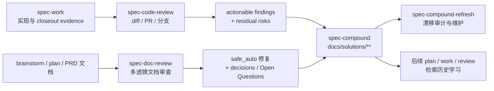
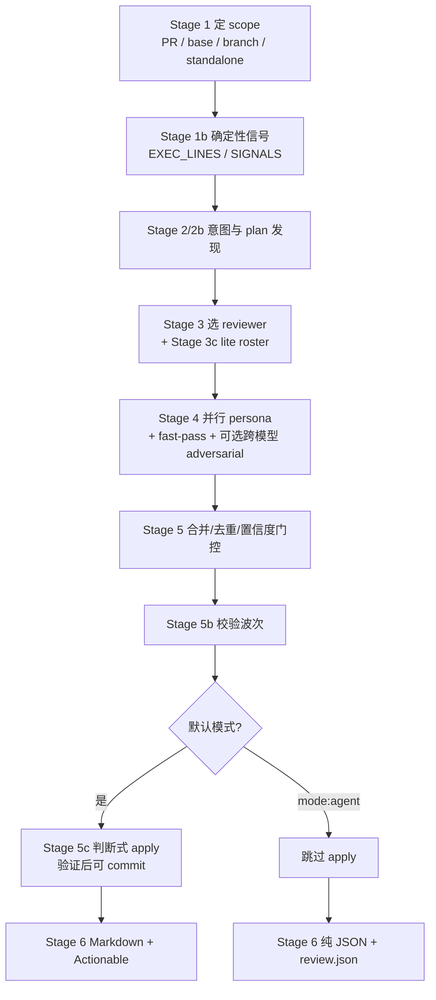
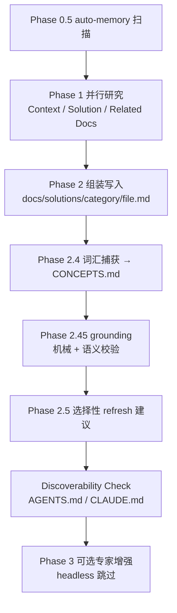
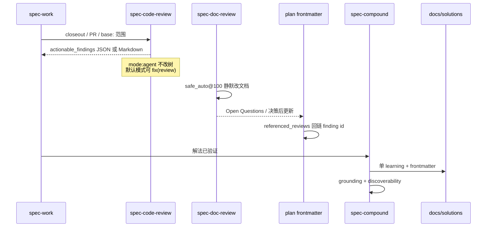

主链路走到 **Code → Review → Knowledge** 时，质量判断与经验复用会拆成两层职责：审查工作流把 diff / 文档变成可行动 finding；compound 工作流把**已验证**解法写入 durable knowledge。本页只讲 `spec-code-review`、`spec-doc-review`、`spec-compound`（及配套的 `spec-compound-refresh`）如何衔接、各自的门禁与产物边界，以及它们与上游 `spec-work`、下游知识消费的关系。

Sources: [workflow-skill-agent-map.md](docs/workflow-skill-agent-map.md#L5-L20)

Sources: [workflow-skill-agent-map.md](docs/workflow-skill-agent-map.md#L5-L20) · [研发场景-workflow执行链路.md](研发场景-workflow执行链路.md#L29-L32)

## 在主链路中的位置：审查不是“再聊一轮”，沉淀不是“随手记笔记”

Review 节点的目标是**结构化、可合并、可降级**的质量裁决；Knowledge 节点的目标是**可检索、可验证、可刷新**的工程记忆。入口路由约定非常直接：diff / 分支 / PR 需要质量判断 → `spec-code-review`；批评已有需求 / 计划 / 任务文档 → `spec-doc-review`；已验证解法值得保留 → `spec-compound`；审计过时 / 重叠 / 漂移 learnings → `spec-compound-refresh`。

Sources: [using-spec-first/SKILL.md](skills/using-spec-first/SKILL.md#L20-L25) · [24-公开入口与Skill目录.md](docs/05-用户手册/24-公开入口与Skill目录.md#L29-L56)

| 工作流 | 审查对象 | 默认交互 | 程序化入口 | 持久产物 |
|--------|----------|----------|------------|----------|
| `spec-code-review` | 代码 diff / PR / 分支 | Markdown 报告；默认可本地 apply 安全修复 | `mode:agent` → 纯 JSON，不改树 | OS temp 下 run artifacts；可选 residual summary |
| `spec-doc-review` | requirements / plan / unified artifact | 多轮 walk-through + 四选项路由 | `mode:headless` → 结构化 envelope | 文档内修复 / Open Questions（markdown） |
| `spec-compound` | 刚解决的单个问题 | Full / Lightweight 自动选择 | `mode:headless` Full（无 session history） | `docs/solutions/**`，旁路 `CONCEPTS.md` |
| `spec-compound-refresh` | 既有 learnings / patterns | 歧义处询问 | `mode:headless` 只做 unambiguous 动作 | 更新后的 `docs/solutions/**` |

Sources: [spec-code-review/SKILL.md](skills/spec-code-review/SKILL.md#L59-L66) · [spec-doc-review/SKILL.md](skills/spec-doc-review/SKILL.md#L16-L36) · [spec-compound/SKILL.md](skills/spec-compound/SKILL.md#L32-L39) · [spec-compound-refresh/SKILL.md](skills/spec-compound-refresh/SKILL.md#L11-L18)

**关键边界**：`review-finding.v1` 是跨工作流 handoff 的 compact envelope，**不是** code-review persona 的 JSON schema；persona 返回仍以 skill 本地 `findings-schema.json` 为准。审查→整改的机器可追踪字段是 plan frontmatter 的 `referenced_reviews`，它只强制“声明了 origin 就必须带 finding id”，不强制覆盖率。

Sources: [review-finding.md](docs/contracts/workflows/review-finding.md#L1-L18) · [review-closure-traceability.md](docs/contracts/workflows/review-closure-traceability.md#L1-L36)

## `spec-code-review`：多 persona 并行审查与可行动 handoff

### 何时用、如何传参

在 PR 前、迭代实现后、或任何需要反馈的代码变更上调用。核心 token 包括：`mode:agent`（报告专用 JSON）、`base:<ref>`（显式 diff base）、`plan:<path>`（需求完整性校验）、`depth:full|auto`、`grouping:auto|off|always`。`mode:headless` 是 `mode:agent` 的废弃别名；`mode:autofix` 不再是独立模式——默认交互路径在 Stage 5c 按判断 apply，`mode:agent` 永不改树。

Sources: [spec-code-review/SKILL.md](skills/spec-code-review/SKILL.md#L11-L47) · [spec-code-review-contracts.test.js](tests/unit/spec-code-review-contracts.test.js#L14-L18)

### 阶段流水线

Sources: [spec-code-review/SKILL.md](skills/spec-code-review/SKILL.md#L171-L173) · [spec-code-review/SKILL.md](skills/spec-code-review/SKILL.md#L554-L710)

**Scope 纪律**是第一原则：传 PR 号/URL/分支只选择审查范围，**不** checkout；`pr-remote` / `branch-remote` 下 reviewer 只能通过 `git show <ref>:<path>` 或 diff hunks 读被审树，不能读本地工作区同名文件。未跟踪文件默认排除，并在 Coverage 列出。

Sources: [spec-code-review/SKILL.md](skills/spec-code-review/SKILL.md#L49-L56) · [spec-code-review/SKILL.md](skills/spec-code-review/SKILL.md#L230-L255)

### Reviewer 分层与 lite 路径

| 层 | Persona / 资产 | 触发方式 |
|----|----------------|----------|
| Always-on（full） | correctness、testing、maintainability、project-standards、agent-native、learnings-researcher | 默认全开；Stage 3c 可缩减 |
| Lite roster | fast-pass + correctness + project-standards | `EXEC_LINES` 1–39、无 uncounted 文件、无 risk 信号、无 conditional；`depth:full` 强制关闭 |
| 横切条件 | security / performance / api-contract / data-migration / reliability / adversarial / previous-comments | 按 diff 内容与 PR 元数据判断 |
| 栈条件 | julik-frontend-races、swift-ios | 运行时行为命中，而非仅看扩展名 |
| 迁移条件 | deployment-verification-agent | 迁移门控 + 风险变更 |

Sources: [spec-code-review/SKILL.md](skills/spec-code-review/SKILL.md#L110-L132) · [spec-code-review/SKILL.md](skills/spec-code-review/SKILL.md#L423-L437) · [workflow-skill-agent-map.md](docs/workflow-skill-agent-map.md#L35-L35)

### Finding 合同：严重度、路由、置信度

严重度 **P0–P3** 回答紧急程度；`autofix_class`（`gated_auto` / `manual` / `advisory`）与 `owner` 只描述后续形态，**不是** apply 许可。合成阶段拒绝遗留的 `safe_auto` / `review-fixer`，并在冲突时取更保守路由。置信度使用离散锚点 `0|25|50|75|100`：低于 75 通常抑制，**例外**是 P0 在锚点 ≥50 时仍保留。锚点 75/100 必须带 `first_evidence`（quote-the-line），否则降到 50。

Sources: [spec-code-review/SKILL.md](skills/spec-code-review/SKILL.md#L82-L108) · [findings-schema.json](skills/spec-code-review/references/findings-schema.json#L1-L120)

Stage 5 的合成顺序固定为：校验 → 指纹去重 → 跨 reviewer 提升锚点（`fast-pass` 永不参与提升）→ 分离 pre-existing → 规范化路由 → 置信度门控 → 稳定 `#` → 可选 triage groups。Stage 5b 对存活 finding 做校验波次，P0/P1 永不因预算 cap 被丢弃；校验基础设施失败时 P0/P1 标记 degraded 保留。

Sources: [spec-code-review/SKILL.md](skills/spec-code-review/SKILL.md#L554-L623)

### 默认 apply vs `mode:agent`

默认模式在 Stage 5c **偏向行动**：对清晰可逆的改进直接改树、跑定向测试/lint，通过后在“审查前工作区干净”时打 `fix(review): …` 提交；审查前已脏则只改不提交。`pr-remote` / `branch-remote` 禁止 apply。`mode:agent` 跳过 5c，输出单一 raw JSON（含 `actionable_findings`、`triage_groups`、`coverage`、`artifact_path`），由 `spec-work` 等调用方消费。

Sources: [spec-code-review/SKILL.md](skills/spec-code-review/SKILL.md#L634-L710) · [spec-code-review/SKILL.md](skills/spec-code-review/SKILL.md#L769-L795)

### 产物与上游证据

完整细节写在 **OS temp**：`<os-temp>/spec-first/spec-code-review/<run-id>/`（per-reviewer JSON、`review.json`、`metadata.json`、默认模式的 `report.md`）。这不是 repo 内 durable truth。需要长期保留 residual 时，优先 PR 的 Known Residuals；无 PR 路径才写 concise summary。`docs/brainstorms/*`、`docs/plans/*`、`docs/solutions/*` 为受保护产物，任何“删除/gitignore 它们”的 finding 在合成时丢弃。

Sources: [04-workflows-artifacts-map.md](docs/05-用户手册/04-workflows-artifacts-map.md#L23-L34) · [spec-code-review/SKILL.md](skills/spec-code-review/SKILL.md#L134-L142) · [spec-code-review/SKILL.md](skills/spec-code-review/SKILL.md#L796-L820)

上游 `spec-work` 的 compact evidence 可带可选 `direct_evidence_used`；code-review 以 best-effort 读取，失败或 scope 不匹配只在 Coverage 记 unavailable/stale，并继续直接读源码。

Sources: [04-workflows-artifacts-map.md](docs/05-用户手册/04-workflows-artifacts-map.md#L113-L117)

## `spec-doc-review`：文档透镜、经济学相反的门控与交互闭环

### 文档分类与条件透镜

文档类型按**内容形态**判定，路径只是 tie-breaker：legacy requirements / plan，以及 unified `artifact_contract: spec-unified-plan/v1` 下的 `requirements-only` vs `implementation-ready`。HTML unified 产物只做 report-only，不走 markdown 突变路径。Always-on：`coherence-reviewer`、`feasibility-reviewer`；条件透镜：product / design / security / scope-guardian / adversarial，各有明确信号门（例如 adversarial 不对“有上游 Product Contract 且未扩 scope 的常规 plan”开火）。

Sources: [spec-doc-review/SKILL.md](skills/spec-doc-review/SKILL.md#L51-L131) · [workflow-skill-agent-map.md](docs/workflow-skill-agent-map.md#L36-L36)

### 与 code-review 不同的 finding 经济学

doc-review schema 使用 `section`、`finding_type`（error|omission）、`autofix_class`（**含** `safe_auto`），并带 `deferred_questions`。置信度门控更宽松：**锚点 ≥50 即可上表面**——因为文档没有 linter 兜底，审查本身就是兜底；premise 类问题天然难到 100，而 Skip / Append-to-Open-Questions 让“漏掉”的代价高于“多看一眼”。

Sources: [findings-schema.json](skills/spec-doc-review/references/findings-schema.json#L1-L86) · [synthesis-and-presentation.md](skills/spec-doc-review/references/synthesis-and-presentation.md#L20-L33)

| 维度 | code-review | doc-review |
|------|-------------|------------|
| 定位字段 | `file` + `line` | `section` |
| autofix 枚举 | `gated_auto` / `manual` / `advisory`（拒绝 safe_auto） | `safe_auto` / `gated_auto` / `manual` |
| 置信度上表面 | 通常 ≥75（P0@≥50 例外） | ≥50（50→FYI；75/100→可行动） |
| 默认静默修复 | Stage 5c 判断式 apply 代码 | 仅 **anchor 100 + safe_auto** 改文档 |
| 程序化模式名 | `mode:agent` | `mode:headless` |
| 交互 | 无阻塞提问 | 四选项路由 + walk-through |

Sources: [findings-schema.json](skills/spec-code-review/references/findings-schema.json#L40-L60) · [synthesis-and-presentation.md](skills/spec-doc-review/references/synthesis-and-presentation.md#L206-L247)

### 合成 → 应用 → 路由

合成流水线：校验 → 锚点门控 → 去重 → 同 persona 前提冗余折叠 → 跨 persona 提升 → 矛盾合并为 `manual` → 路由分桶。**静默 apply 仅限 anchor 100 的 `safe_auto`**；anchor 75 的 `safe_auto` 会降为 `gated_auto` 进入 walk-through。交互模式四选项：逐条 walk-through、best-judgment 批量、Append-to-Open-Questions、Report-only。同会话多轮通过 decision primer 抑制已 Skip/Defer/Acknowledge 的 finding，并验证已 Apply 是否落地；**跨会话不持久 primer**。

Sources: [synthesis-and-presentation.md](skills/spec-doc-review/references/synthesis-and-presentation.md#L1-L10) · [synthesis-and-presentation.md](skills/spec-doc-review/references/synthesis-and-presentation.md#L241-L262) · [spec-doc-review/SKILL.md](skills/spec-doc-review/SKILL.md#L189-L224)

Headless 输出结构化文本 envelope（fixes / proposed fixes / decisions / FYI），不发阻塞问题，以 “Review complete” 收尾；调用方自行处理非 safe_auto 项。

Sources: [synthesis-and-presentation.md](skills/spec-doc-review/references/synthesis-and-presentation.md#L264-L309)

## `spec-compound` 与 refresh：把验证过的解法变成复利

### 为何叫 compound

第一次解决要做研究；写进 `docs/solutions/` 后，下次同类问题几分钟可复用。**一次 run 只沉淀一个 learning**；多学习必须串行多次调用，避免草稿编号泄漏进 durable 文档。

Sources: [spec-compound/SKILL.md](skills/spec-compound/SKILL.md#L11-L26)

### Full / Lightweight / Headless

| 模式 | 何时 | 行为要点 |
|------|------|----------|
| Full（默认） | 几乎所有真实学习 | 并行研究、交叉引用、重叠检测、grounding；session history 自动 probe |
| Lightweight | 上下文压力或极琐碎修复 | 单通无 subagent；CONCEPTS 只 update-only；跳过语义 grounding |
| Headless | 自动化 / skill-to-skill | 强制 Full、无 session history、Discoverability 静默改指令文件、跳过 Phase 3 专家评审 |

Sources: [spec-compound/SKILL.md](skills/spec-compound/SKILL.md#L32-L79) · [spec-compound/SKILL.md](skills/spec-compound/SKILL.md#L499-L519)

### 写入路径与双轨 schema

Sources: [spec-compound/SKILL.md](skills/spec-compound/SKILL.md#L85-L120) · [spec-compound/SKILL.md](skills/spec-compound/SKILL.md#L351-L388)

Frontmatter 由 `problem_type` 分 **bug track** 与 **knowledge track**：共享 `module` / `date` / `problem_type` / `component` / `severity`；bug track 另需 `symptoms` / `root_cause` / `resolution_type`。目录映射例如 `workflow_issue` → `docs/solutions/workflow-issues/`、`architecture_pattern` → `architecture-patterns/`。数组字段若以 YAML 保留指示符开头必须双引号包裹。

Sources: [schema.yaml](skills/spec-compound/references/schema.yaml#L12-L70) · [yaml-schema.md](skills/spec-compound/references/yaml-schema.md#L13-L80) · [yaml-schema.md](skills/spec-compound/references/yaml-schema.md#L92-L118)

Grounding 要求：代码行为主张先 Read 当前树并引 `file:line`；合并状态优先 PR 号而非裸 SHA；`validate-frontmatter.py` / `validate-doc-claims.py` 提供确定性地板。`docs/solutions/` 枚举**永不缓存**——Related Docs Finder 每 run 重新 glob，避免漏掉刚写入未提交的文档。

Sources: [spec-compound/SKILL.md](skills/spec-compound/SKILL.md#L144-L144) · [spec-compound/SKILL.md](skills/spec-compound/SKILL.md#L373-L386)

### `spec-compound-refresh`：维护模型

refresh 先审 learnings，再审依赖它们的 pattern docs。动作枚举：

| 动作 | 含义 |
|------|------|
| Keep | 仍准确；可不改 |
| Update | 路径/链接/元数据漂移，核心方案仍对 |
| Consolidate | 多文档重叠但都正确 → 合并后**删除**被吞并者 |
| Replace | 旧文误导 → 写继任者再删旧文 |
| Delete | 代码已不存在且无继任者；无 `_archived/`，git history 即归档 |

Headless 只执行 unambiguous 动作，歧义标 `status: stale`。仓库级 `CONCEPTS.md` 引导由 refresh 负责；compound 只在记录真实 learning 时**按学习所触达的领域**侧写词汇，不把整仓概念图当主任务。

Sources: [spec-compound-refresh/SKILL.md](skills/spec-compound-refresh/SKILL.md#L9-L36) · [spec-compound-refresh/SKILL.md](skills/spec-compound-refresh/SKILL.md#L68-L95) · [spec-compound/SKILL.md](skills/spec-compound/SKILL.md#L28-L30)

本仓库现有分类示例包括 `architecture-patterns`、`conventions`、`developer-experience`、`tooling-decisions`、`workflow-issues`——正是 compound 写入面的 durable 形态。

Sources: [docs/solutions](docs/solutions)

## 闭环：从 finding 到整改再到可复用知识

Sources: [review-closure-traceability.md](docs/contracts/workflows/review-closure-traceability.md#L1-L28) · [spec-code-review/SKILL.md](skills/spec-code-review/SKILL.md#L769-L771) · [spec-compound/SKILL.md](skills/spec-compound/SKILL.md#L13-L16)

**实用顺序建议**：

1. 计划/需求仍在讨论 → 先 `spec-doc-review`，避免错误 WHAT 进入实现。  
2. 代码变更就绪 → `spec-code-review`（流水线内用 `mode:agent`）。  
3. 修复已验证且可复用 → `spec-compound`（一次一个 learning）。  
4. 知识库变脏 → 周期性 `spec-compound-refresh`。  

Sources: [using-spec-first/SKILL.md](skills/using-spec-first/SKILL.md#L20-L25) · [24-公开入口与Skill目录.md](docs/05-用户手册/24-公开入口与Skill目录.md#L33-L56)

## 降级、并行与“不要做的事”

- **Subagent 不可用**：code-review / doc-review 退化为单 agent report-only / sequential，不假装完成了多 persona 自动修复。  
- **Code-review 永不 push / 开 PR / 建 ticket**；apply 只限本地，push 归用户。  
- **不要**把未验证猜测写进 `docs/solutions/`；不要用 compound 批量打包多个无关 learning。  
- **不要**把 temp 下的 review run artifact 当 source of truth；durable 只有 solutions、可选 residual summary、以及 plan 上的 `referenced_reviews`。  
- Quick/light code review 在非 `mode:agent` 时可短路到宿主内置 review；`mode:agent` 始终走完整多 agent 管线。

Sources: [workflow-skill-agent-map.md](docs/workflow-skill-agent-map.md#L62-L62) · [spec-code-review/SKILL.md](skills/spec-code-review/SKILL.md#L68-L78) · [spec-code-review/SKILL.md](skills/spec-code-review/SKILL.md#L769-L771) · [spec-compound/SKILL.md](skills/spec-compound/SKILL.md#L26-L26) · [04-workflows-artifacts-map.md](docs/05-用户手册/04-workflows-artifacts-map.md#L117-L123)

## 与相邻页面的阅读顺序

- 上游执行与证据：[`任务拆解与执行：write-tasks、work 与 verification evidence`](16-ren-wu-chai-jie-yu-zhi-xing-write-tasks-work-yu-verification-evidence)  
- 计划如何承接审查 finding：[`实现规划：spec-plan 如何把 WHAT 充实为 HOW`](15-shi-xian-gui-hua-spec-plan-ru-he-ba-what-chong-shi-wei-how)  
- 契约与 eval 地板：[`工作流契约与质量门禁：contracts、hooks 与 eval`](23-gong-zuo-liu-qi-yue-yu-zhi-liang-men-jin-contracts-hooks-yu-eval)  
- 入口怎么选 skill：[`using-spec-first 入口治理与场景路由`](24-using-spec-first-ru-kou-zhi-li-yu-chang-jing-lu-you)  
- 产物路径速查：[`产物目录与成功信号：仓库内 artifact 去哪找`](6-chan-wu-mu-lu-yu-cheng-gong-xin-hao-cang-ku-nei-artifact-qu-na-zhao)

Sources: [workflow-skill-agent-map.md](docs/workflow-skill-agent-map.md#L5-L20)

**一句话收口**：code-review 把代码风险变成可路由 finding；doc-review 把文档风险变成可静默修复或可决策的透镜结果；compound 只在证据站得住时把解法写入 `docs/solutions/`，refresh 负责让这份复利不腐坏。三者合在一起，才是主链路末端“审查与知识沉淀”的完整闭环。