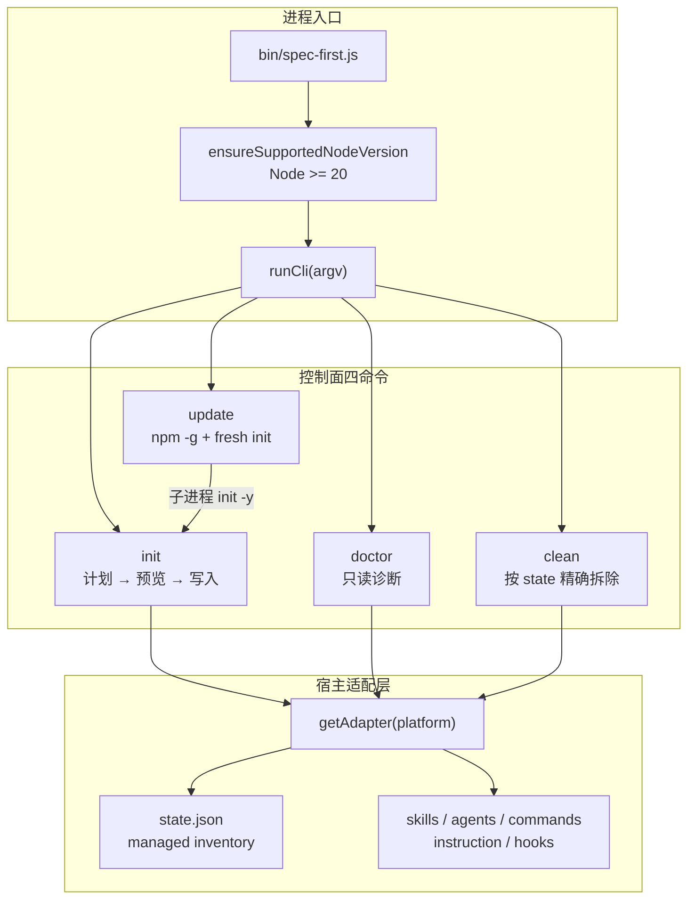
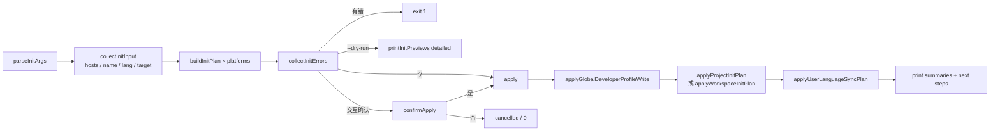
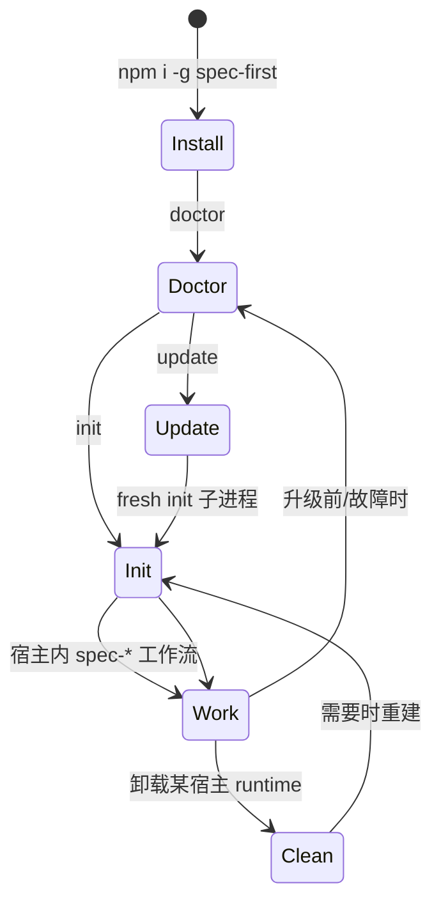

`spec-first` 的包级 CLI 不负责执行 brainstorm、plan 或 code-review 这类语义工作流；它只管理**可安装、可诊断、可升级、可回滚**的 generated runtime。`init`、`doctor`、`update`、`clean` 构成这条控制面：把源码包中的 skills / agents / command templates 投影到 Claude Code、Codex、Kiro、Qoder、Cursor 等宿主目录，用 managed state 记录“谁拥有哪些文件”，再用 doctor 把健康状态压缩成可脚本消费的状态码。

Sources: [index.js](src/cli/index.js#L19-L87)、[spec-first.js](bin/spec-first.js#L1-L23)、[01-快速开始.md](docs/05-用户手册/01-快速开始.md#L42-L60)

## 控制面在架构中的位置

入口链很短：`bin/spec-first.js` 先做 Node.js ≥ 20 门禁，再把 `argv` 交给 `runCli`。`runCli` 只路由包级命令；宿主内真正的 `spec-*` 工作流入口，是 `init` 写进 runtime 之后由宿主发现的，而不是 CLI 直接派发的。



对 `doctor` / `init` / `clean` / `update`（非 `--help`），CLI 还会在真正执行前尝试版本提醒；这是旁路提示，失败不改变命令语义。

Sources: [spec-first.js](bin/spec-first.js#L1-L23)、[index.js](src/cli/index.js#L19-L87)、[node-version.js](src/cli/node-version.js#L1-L40)、[adapters/index.js](src/cli/adapters/index.js#L1-L40)

## 命令职责对照

| 命令 | 主职责 | 写磁盘？ | 典型退出码 |
| --- | --- | --- | --- |
| `doctor` | 环境、manifest、managed runtime、host readiness、workflow evidence | 否 | `0` 正常；有 ERROR 时 `3`；用法错误 `2` |
| `init` | 交互或非交互安装 runtime、developer profile、gitignore / instruction | 是（可用 `--dry-run`） | `0` 成功/取消；计划错误 `1`；用法/TTY `2` |
| `update` | `npm install -g spec-first@latest`，再起 **新进程** `init` 刷新 runtime | 是 | `0` 升级成功；升级或刷新失败 `1`；多余参数 `2` |
| `clean` | 按 managed state 拆除单一宿主；或清理 workspace orphan quarantine | 是（可用 `--dry-run` / 默认只预览 orphan） | `0` 成功/无资产；状态不可读等 `1`；用法 `2` |

Sources: [index.js](src/cli/index.js#L162-L194)、[doctor.js](src/cli/commands/doctor.js#L28-L104)、[update.js](src/cli/commands/update.js#L18-L102)、[clean.js](src/cli/commands/clean.js#L25-L115)

## `init`：从选择到原子写入

`init` 是控制面的写入核心。实现被拆成 args / input / plan / apply / workspace / output 等模块，主流程固定为：**解析参数 → 收集输入 → 为每个宿主建 plan → 诊断错误 → 预览/确认 → 写全局 developer → 按 plan apply → 可选 user-language sync → next steps**。



### 参数与默认宿主

- 宿主 flag：`--claude` / `--codex` / `--cursor` / `--kiro` / `--qoder`；可多选。
- 非交互：`-y/--yes`。未显式指定宿主时，默认只装 **Claude + Codex**（`defaultForYes: true`）；Cursor / Kiro / Qoder 需显式 flag。
- 身份：`-u/--user`、`--lang zh|en`。
- 范围：`--all-repos`（父 workspace + 子 Git 仓）与 `--repo <path>` 互斥。
- 语言同步：`--sync-user-language` / `--no-sync-user-language`。
- 预览：`--dry-run` 不落盘，输出详细 preview。

无 `-y` 时必须在 TTY 中运行；否则要求显式 host + `-y` 一类非交互路径。全局 `~/.spec-first/.developer` 会记住上次勾选的 hosts，交互多选框会预勾选；`--yes` 与显式 flag 不受预勾选影响。

Sources: [init-args.js](src/cli/commands/init-args.js#L1-L165)、[init.js](src/cli/commands/init.js#L64-L95)、[init-input.js](src/cli/commands/init-input.js#L30-L80)、[01-快速开始.md](docs/05-用户手册/01-快速开始.md#L56-L60)

### Plan 内容：adapter 投影 + managed state

每个宿主通过 `getAdapter(platform)` 拿到路径与同步策略。例如 Claude 使用 `.claude/skills`、`.claude/commands`、`CLAUDE.md`、`.claude/spec-first/state.json`；Codex 使用 `.agents/skills`、`AGENTS.md`、`.codex/spec-first/state.json`，且 `hasCommands === false`（依赖 skill discovery）。

`buildProjectInitPlan` 会：

1. 读取既有 managed state；若是 **legacy state**，标记 managed hard reset，而不是让用户手工删目录。
2. 按 plugin manifest 过滤并 plan 同步 skills / workflow skills / agents / support files /（可选）commands。
3. 合并 gitignore 策略块、runtime untrack、metadata（含项目级 developer 记录）、adapter 专属 runtime 文件（如 hooks）。
4. 对 Cursor / Qoder 等 preview 宿主写入 diagnostics（不阻断，但会在预览中标 degraded）。

`applyProjectInitPlan` 先可选执行 destructive reset（带 rollback backup），再 `preSyncPlan` + `writePlan`；全局 developer 写盘在项目 mutation 之前完成，作为 prerequisite。

Sources: [init-plan.js](src/cli/commands/init-plan.js#L16-L48)、[init-project-plan.js](src/cli/commands/init-project-plan.js#L62-L200)、[init-project-plan.js](src/cli/commands/init-project-plan.js#L456-L478)、[init-apply.js](src/cli/commands/init-apply.js#L17-L58)、[claude.js](src/cli/adapters/claude.js#L48-L81)、[codex.js](src/cli/adapters/codex.js#L41-L77)

### 多仓 workspace

`discoverChildGitRepos` 在父目录深度受限扫描 child Git 根。`--all-repos` 生成 `mode: 'all-repos'` 的 workspace plan：父 root 一份 project plan + 每个 child 一份 project plan；apply 后可写 `.spec-first/workspace/*summary.json` 作为 advisory summary。单 child 用 `--repo`；默认在父 root 仍可做父级 bootstrap（instruction / gitignore / host runtime）。

Sources: [init-workspace.js](src/cli/commands/init-workspace.js#L35-L210)、[01-快速开始.md](docs/05-用户手册/01-快速开始.md#L107-L116)

### 常用调用

```bash
# 交互：品牌 banner → 选宿主 → 身份 → 摘要预览 → 确认
spec-first init

# 详细预览（不写盘）
spec-first init --claude --codex --dry-run

# CI / 脚本
spec-first init -y -u alice --lang zh --claude --codex

# 父 workspace 全量子仓
spec-first init --all-repos -y -u alice --lang zh --codex
```

Sources: [init.js](src/cli/commands/init.js#L64-L180)、[init-args.js](src/cli/commands/init-args.js#L44-L155)

## `doctor`：只读健康面

`doctor` 从不修改 runtime。它聚合四层健康，并在 `--json` 下输出稳定 schema，便于门禁脚本。

| 字段 | 含义 |
| --- | --- |
| `install_health` | Node、Git、plugin manifest、全局 developer |
| `runtime_asset_health` | managed state、instruction bootstrap、commands/skills/agents 库存与 drift |
| `host_readiness` | 宿主 CLI 是否在 PATH，以及 Claude hooks / Codex 全局 hook 污染 / Cursor·Qoder MCP 配置等 |
| `decision_input_health` | 若存在则读 `.spec-first/config/tool-facts.json`（setup facts），否则按 basis 降级 |
| `workflow_runnability` | `verified` / `simulated` / `not_verified`：runtime 面是否齐 + verification evidence 是否新鲜且 schema 合法 |

无宿主 flag 时，`detectPlatforms` 根据 runtime 根或 state 文件自动发现；一个都没有则提示去跑 `init`，JSON 模式下仍输出空 platforms 报告且退出 `0`。文本模式下任一 ERROR 使进程退出 `3`。

**边界（刻意不做）**：MCP / helper 安装与 graph bootstrap 属于 `spec-mcp-setup` 工作流，不属于 doctor 控制面。Doctor 最多对 Cursor/Qoder 的 MCP 配置文件做“有没有 / 是否 JSON”级检查，并在 fix 文案中指向 setup。

Sources: [doctor.js](src/cli/commands/doctor.js#L28-L104)、[doctor.js](src/cli/commands/doctor.js#L464-L560)、[doctor.js](src/cli/commands/doctor.js#L586-L676)、[doctor.js](src/cli/commands/doctor.js#L1105-L1134)

```bash
spec-first doctor
spec-first doctor --codex
spec-first doctor --json   # CI：关注 has_error 与 workflow_runnability
```

Sources: [doctor.js](src/cli/commands/doctor.js#L1165-L1198)

## `update`：包升级与 fresh runtime 刷新

`update` 刻意做成**无条件**全局升级：

1. 打印并执行 `npm install -g spec-first@latest`（Windows 用 `npm.cmd`）。
2. 成功后解析刷新范围：当前是单 Git 仓则 `init --<已装宿主...> -y`；父 workspace 则可能带 `--all-repos`；无法安全判定 scope 则跳过刷新并打印可复制 fallback。
3. **新进程**调用 `spec-first`，避免“旧 Node 进程直接跑新 generator 代码”的版本错位。
4. 清理 CLI version-reminder cooldown；清理失败不把成功升级变成失败。
5. 静态 caveat：若实际是 Claude plugin / pnpm / volta 等非 `npm -g` 安装，可能装出冲突副本，应改用对应包管理器升级。

不接受除 `-h/--help` 以外的参数；旧的 check-only flag 一律视为用法错误。

Sources: [update.js](src/cli/commands/update.js#L18-L175)、[update.js](src/cli/commands/update.js#L195-L275)、[01-快速开始.md](docs/05-用户手册/01-快速开始.md#L32-L38)

```bash
spec-first update
# 刷新失败时 stderr 会给出 Single repo / Parent workspace / Child repo 的 fallback init 命令
```

Sources: [update.js](src/cli/commands/update.js#L195-L207)

## `clean`：按 state 精确拆除

`clean` 一次只允许一个宿主 flag。它读取该宿主的 managed state，构造三块 operation plan：

1. **managedPlan**：按 state 中的 commands / skills / workflowSkills / agents / support files 删除 managed 路径。
2. **runtimeCleanup**：剥离 instruction 中 managed bootstrap / coding-guidelines / runtime-tools 块，删除 state 文件，Claude 还会拆除 managed hook matcher，并执行 adapter 的 runtime files removal。
3. **emptyRootPlan**：删除因此变空的 managed 根目录。

`--dry-run` 只打印 would remove / would update。state 缺失则“无 managed assets”；**legacy state** 不迁移——提示先 `init` 做 hard reset，而不是让 clean 猜测旧布局。自定义、非 managed 文件一律不动。

第二条路径：`spec-first clean --workspace-orphans [--confirm]`。它读取 `spec-mcp-setup` 生成的 `.spec-first/workspace/parent-artifact-quarantine.json`；默认只预览，`--confirm` 才删除白名单内 orphan 路径。不可与宿主 flag 混用。

Sources: [clean.js](src/cli/commands/clean.js#L25-L115)、[clean.js](src/cli/commands/clean.js#L166-L245)、[clean.js](src/cli/commands/clean.js#L368-L477)、[state.js](src/cli/state.js#L287-L360)

```bash
spec-first clean --claude --dry-run
spec-first clean --codex
spec-first clean --workspace-orphans
spec-first clean --workspace-orphans --confirm
```

Sources: [clean.js](src/cli/commands/clean.js#L125-L163)

## Managed state 与 adapter 契约

控制面能否安全 init/clean，取决于 **state 形状** 与 **adapter 路径契约**：

- State 必填数组：`commands`、`skills`、`workflowSkills`、`agents`、`agentSupportFiles`，外加 `manifestVersion`。
- Doctor 对比 `state.manifestVersion` 与当前 bundled manifest；不一致只警告并建议 `init` 重同步。
- Adapter 统一暴露 `runtimeRoot`、`managedRoot`、`skillsRoot`、`workflowsRoot`、`agentsRoot`、`stateFile`、`instructionFile` 以及 runtime 同步/拆除 plan 方法；`init` / `doctor` / `clean` / `update` 的刷新探测都只依赖这层，不散落硬编码路径。

Sources: [state.js](src/cli/state.js#L1-L90)、[doctor.js](src/cli/commands/doctor.js#L902-L957)、[base.js](src/cli/adapters/base.js#L1-L80)、[adapters/index.js](src/cli/adapters/index.js#L1-L40)

## 推荐操作环路



1. **装完先 doctor，再 init**——先看 Node/Git/manifest，再写 runtime。  
2. **日常升级用 update**——不要手改 `.claude/`、`.agents/skills/` 等 generated mirror；改 source 后同样靠 `init` 重投影。  
3. **legacy / drift 优先 init hard reset**，不要先 `rm -rf` 再猜路径。  
4. **MCP 与 graph 不进控制面四命令**——需要时走 [Runtime Setup：spec-mcp-setup 与 provider readiness](19-runtime-setup-spec-mcp-setup-yu-provider-readiness)。

Sources: [01-快速开始.md](docs/05-用户手册/01-快速开始.md#L42-L60)、[01-快速开始.md](docs/05-用户手册/01-快速开始.md#L125-L125)、[doctor.js](src/cli/commands/doctor.js#L1126-L1131)

## 故障速查

| 现象 | 控制面动作 |
| --- | --- |
| `init` 抱怨非 TTY | 加 `-y` 并给出 host / `-u` / `--lang` |
| doctor 报 legacy managed state | 对目标宿主重跑 `init`（managed hard reset） |
| clean 读不了 state / legacy | 先 `init` 重建 current runtime，再 `clean` |
| update 后 refresh degraded | 复制 stderr 中的 fallback `init ... -y` 命令手动刷新 |
| 宿主内看不到 `spec-*` | `init` 后**完全重启宿主**；再用 `doctor --json` 看 runtime_asset_health |
| Cursor skills 不加载 | 预期内 preview 警告；勿当生产宿主契约 |
| Codex 全局 SessionStart 双注入 | `doctor --codex` 看 advisory；在 CODEX_HOME 清理或 `clean --codex`，init **不会**自动删全局污染 |

Sources: [init.js](src/cli/commands/init.js#L86-L94)、[clean.js](src/cli/commands/clean.js#L61-L86)、[update.js](src/cli/commands/update.js#L72-L93)、[doctor.js](src/cli/commands/doctor.js#L1084-L1103)、[init-project-plan.js](src/cli/commands/init-project-plan.js#L98-L110)

## 与相邻页面的边界

本页只覆盖**包级控制面**四命令及其 state/adapter 契约。宿主 pointer 文件与多宿主投影细节见 [多宿主 Runtime 投影与 pointer 文件治理](20-duo-su-zhu-runtime-tou-ying-yu-pointer-wen-jian-zhi-li)；整体分层见 [整体架构分层：控制面、执行面与契约串联](22-zheng-ti-jia-gou-fen-ceng-kong-zhi-mian-zhi-xing-mian-yu-qi-yue-chuan-lian)。装好控制面后，下一步通常是 Runtime Setup 或直接进入主链路工作流入口页。