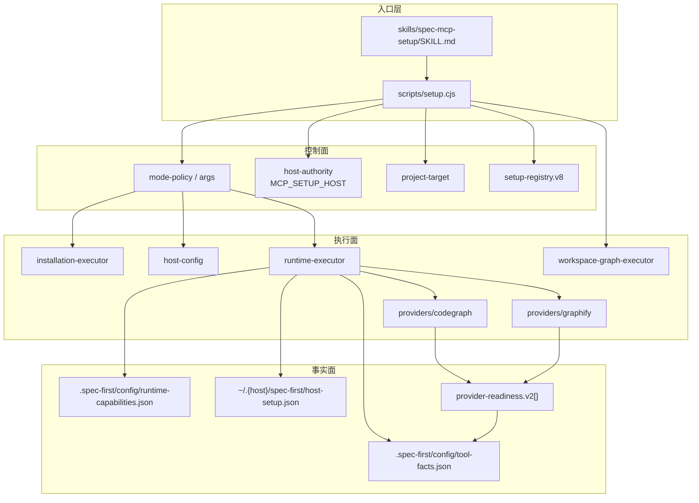
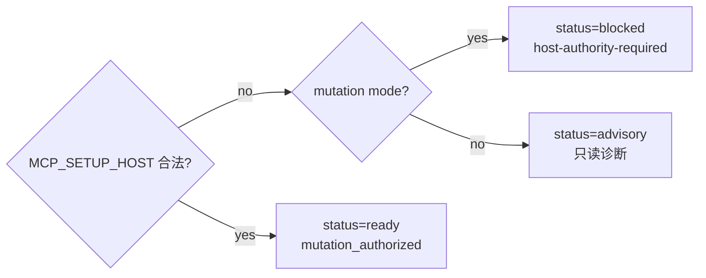
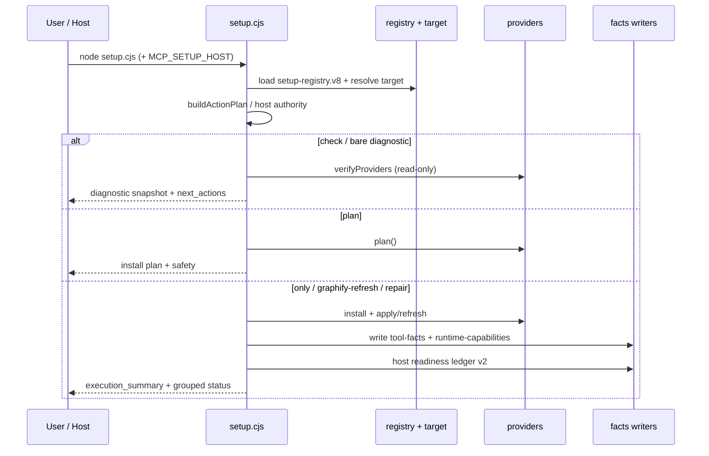

Runtime Setup 是 spec-first 工作流的**运行时就绪层**：它不回答“代码语义是否充分”，只负责把宿主 MCP、baseline helper、CodeGraph/Graphify 等机械依赖安装、配置、探测，并写成可消费的 readiness facts。当前可运行入口是 `spec-mcp-setup`（目标用户别名 `spec-runtime-setup` 仍在宿主 alias 契约落地中）；Node 脚本准备确定性事实，LLM 与下游 workflow 决定如何使用这些事实。

Sources: [SKILL.md](skills/spec-mcp-setup/SKILL.md#L8-L30)

## 为什么需要 Runtime Setup

普通 plan / work / review / debug 可以只靠有界源码阅读、`rg`、ast-grep、git diff、测试与日志继续推进。但一旦宿主缺 MCP、helper 不可见、图索引未初始化，或生成 runtime 镜像过期，协作体验会立刻变脆。Runtime Setup 把这些**可机械验证**的问题收敛到一个 skill：在授权 mode 下写 host config 与 setup-owned facts，并在失败时给出可执行 next action，而不是把“环境是否就绪”混进语义判断。

Sources: [SKILL.md](skills/spec-mcp-setup/SKILL.md#L16-L30)

与 [CLI 控制面：init、doctor、update 与 clean](18-cli-kong-zhi-mian-init-doctor-update-yu-clean) 的分工是：`init` 负责 source → generated runtime 投影；`spec-mcp-setup` 负责 MCP/provider/helper 的 install-verify 与 readiness ledger。与 [工作区图与跨仓证据：CodeGraph、Graphify 的 advisory 边界](21-gong-zuo-qu-tu-yu-kua-cang-zheng-ju-codegraph-graphify-de-advisory-bian-jie) 的衔接是：setup 可以 first-generation 并探测 query，但图输出始终是 advisory candidate，结论必须回源码确认。

Sources: [SKILL.md](skills/spec-mcp-setup/SKILL.md#L32-L40)

## 架构总览：控制面、执行面与事实面

下图从“谁授权、谁执行、谁写盘”三条轴概括 Runtime Setup。先读图再进入 mode 细节：mutation 一律经过 `MCP_SETUP_HOST` 与 mode capability gate，绝不由 prose 或 PATH 推断写入目标。



Sources: [setup.cjs](skills/spec-mcp-setup/scripts/setup.cjs#L115-L230) · [mode-policy.cjs](skills/spec-mcp-setup/scripts/lib/mode-policy.cjs#L1-L45) · [host-authority.cjs](skills/spec-mcp-setup/scripts/lib/host-authority.cjs#L1-L74)

## Source of Truth：setup-registry.v8

Canonical 真相源是 skill 共置的 `setup-registry.json`，由 `setup-registry.schema.json` 校验，schema 版本为 **`setup-registry.v8`**。Loader 按当前 host / platform 展开 effective registry；生成宿主上的 registry projection 是 generated runtime，不是第二套 source。registry 同时声明 MCP tools、helpers、providers、external dependency pin、host target、artifact contract 与 install mirror。

Sources: [SKILL.md](skills/spec-mcp-setup/SKILL.md#L34-L44) · [setup-registry.json](skills/spec-mcp-setup/setup-registry.json#L1-L80)

当前完整 setup 的必备轮廓可概括为：

| 类别 | 标识 | 角色 | 完成门禁要点 |
| --- | --- | --- | --- |
| MCP tool | `sequential-thinking`, `context7` | baseline MCP | 包探测 + host config ready |
| MCP / provider | `codegraph` | code-structure provider | pin 安装、init/index、query probe、host MCP |
| Provider | `graphify` | project-graph provider | PyPI pin、extract/query、host integration、hook 结构校验 |
| Helper | `ffmpeg`, `gh`, `ast-grep-skill` 等 | baseline / report-only | `baseline_blocking` 决定是否阻断 setup completion |
| External pin | `@colbymchenry/codegraph@1.4.1`, `graphifyy@0.9.12` | 可复现依赖 | 版本与 identity 必须对齐 pin |

Sources: [setup-registry.json](skills/spec-mcp-setup/setup-registry.json#L1-L80) · [SKILL.md](skills/spec-mcp-setup/SKILL.md#L34-L48)

`ffmpeg` 是 setup completion 的 baseline-blocking helper；`agent-browser` 保持 report-only / non-blocking。CodeGraph / Graphify 的 first generation 与真实 query probe 属于**标准完整 setup**，不是可长期跳过的 optional tail。`--only codegraph` / `--only graphify` 只用于高级子集修复，不能把子集成功表述为完整 ready。

Sources: [SKILL.md](skills/spec-mcp-setup/SKILL.md#L34-L48) · [baseline-policy.cjs](skills/spec-mcp-setup/scripts/lib/baseline-policy.cjs#L1-L10)

## 入口解析与 Host Authority

每次调用必须从**已加载 skill 目录**解析 `SKILL_DIR`，执行：

```bash
node "$SKILL_DIR/scripts/setup.cjs" <mode-and-target-arguments>
```

不得从项目 cwd 或 source checkout 路径解析该入口。支持 mutation 的 mode 进入前，必须通过 per-call environment overlay 固定 `MCP_SETUP_HOST=claude|codex|cursor|kiro|qoder`。缺少合法 pin 时 `setup.cjs` fail closed；只读诊断可以展示 advisory host candidate，但 candidate **不具备 write authority**。

Sources: [SKILL.md](skills/spec-mcp-setup/SKILL.md#L50-L62) · [host-authority.cjs](skills/spec-mcp-setup/scripts/lib/host-authority.cjs#L7-L60)



Sources: [host-authority.cjs](skills/spec-mcp-setup/scripts/lib/host-authority.cjs#L14-L58)

各宿主默认 MCP 配置目标（registry `hosts.*.defaults.tool.host_config`）：

| Host | 默认 scope | 默认写入路径 | 用户级 opt-in |
| --- | --- | --- | --- |
| Claude | managed | managed-mcp.json / fallback `~/.claude.json` | 由 precedence 与可写性决定 |
| Codex | user | `~/.codex/config.toml` | system TOML 更高 precedence |
| Cursor | project | `.cursor/mcp.json` | `--user-scope` → `~/.cursor/mcp.json` |
| Kiro | workspace | `.kiro/settings/mcp.json` | `--user-scope` → `~/.kiro/settings/mcp.json` |
| Qoder | local | `.qoder/settings.local.json` | `--user-scope` → `~/.qoder/settings.json` |

Sources: [setup-registry.json](skills/spec-mcp-setup/setup-registry.json#L68-L120) · [SKILL.md](skills/spec-mcp-setup/SKILL.md#L230-L245)

host config 与 setup facts **禁止**用 Write/Edit 类工具手改；只有 authority、target、containment、conflict 与 verification gate 全部通过后，`setup.cjs` 与确定性 host-config / facts module 才能写入。`--repair-host-config` 只授权替换 registry 管理且已确认冲突的 MCP 条目；高优先级 target、unsafe path、symlink escape、literal secret 永远 fail closed。

Sources: [SKILL.md](skills/spec-mcp-setup/SKILL.md#L118-L128)

## Mode 矩阵与三阶段用户流

### Mode 能力表

| Mode | 写 setup facts | 改 host config | 安装工具 / provider mutation | 典型用途 |
| --- | --- | --- | --- | --- |
| `--check` | 否 | 否 | 否 | 只读依赖与 runtime 状态 |
| `--verify-only` / `--refresh-facts` | 是 | 否 | 否 | 刷新 readiness ledger |
| `--plan` | 否 | 否 | 否 | 预览 install / config / safety |
| `--project-config` | 否（仅 local config） | 否 | 否 | example / local override / gitignore |
| bare `spec-mcp-setup` | 是（经 apply 路径） | 是（含 managed drift 自动 repair 授权） | 是（required providers） | 默认完整 setup |
| `--only <ids>` | 是 | 是 | 是（子集） | 高级子集修复 |
| `--only graphify --refresh` | 是 | 是 | Graphify journaled rebuild | 显式增量/重建 |
| `--repair-host-config` | 是 | 仅冲突修复 | 否（可与 `--only` 组合） | managed MCP drift |

Sources: [mode-policy.cjs](skills/spec-mcp-setup/scripts/lib/mode-policy.cjs#L5-L40) · [SKILL.md](skills/spec-mcp-setup/SKILL.md#L130-L150)

`buildActionPlan` 把 argv 映射为 capability 列表：`only` / `graphify-refresh` 才持有 `install-tools`、`write-host-config`、`provider-mutation`（或 `provider-refresh`）；`verify` 仅 `write-setup-facts`；冲突 flag 组合返回 `mode-conflict` / `refresh-without-only-graphify` 等 reason code。

Sources: [mode-policy.cjs](skills/spec-mcp-setup/scripts/lib/mode-policy.cjs#L46-L112)

### 三阶段用户心智模型

即使内部 module 很多，面向用户的流程固定为三段：

1. **Diagnose**：解析 project target（父 workspace 未选 child 时禁止 repo-local 写入）；检查 host authority、MCP/helper、generated runtime manifest freshness、project-local config、required provider readiness。
2. **Apply**：只执行所选 mode 授权的动作——local config bootstrap、host config、helper/provider install 与 first generation / bounded repair。
3. **Summarize**：分组渲染 dependency readiness、runtime freshness、project config、host configured deps、provider lifecycle、next actions；不得把 skipped / degraded / partial 折叠成一句 “setup complete”。

Sources: [SKILL.md](skills/spec-mcp-setup/SKILL.md#L78-L110)



Sources: [setup.cjs](skills/spec-mcp-setup/scripts/setup.cjs#L115-L280) · [runtime-executor.cjs](skills/spec-mcp-setup/scripts/lib/runtime-executor.cjs#L50-L150)

### 默认完整 bare 流程（skill 内编排）

1. 解析 target；父 workspace 先停写。
2. 只读 check；example 缺失/过期或 local-config ignore 缺失时跑 `--project-config --refresh-example --ensure-gitignore`；`config.local.yaml` 缺失保持 **`defaults-active`**，不创建空 override。
3. `--plan --repo <root>` 预览 required CodeGraph/Graphify 与 baseline。
4. 无 blocker 后 apply 等价于 `--only codegraph,graphify`（bare 已授权 selected-target managed `host-config-conflict` 的自动 repair）。
5. 必须完成 ffmpeg/baseline、CodeGraph init/index/query、Graphify graph/query/hook、host config、facts verification；任一 required item 未 ready 则完整 setup 为 action-required。

Sources: [SKILL.md](skills/spec-mcp-setup/SKILL.md#L188-L205)

## Project Target 与安全边界

`project-target` 支持当前 git repo、显式 `--repo`、非 git `--folder`、父 workspace 的 `--all-repos` 发现。symlink escape、workspace 外路径、`repo`/`folder`/`all-repos` 互斥组合均会 fail closed。mutation mode 在 `state_write_allowed=false` 时直接阻断。

Sources: [project-target.cjs](skills/spec-mcp-setup/scripts/lib/project-target.cjs#L30-L100) · [setup.cjs](skills/spec-mcp-setup/scripts/setup.cjs#L148-L165)

Provider 与 facts 写入路径一律走 `path-safety` 的 containment 校验；CodeGraph 校验 `.codegraph` 与 `codegraph.db` 不逃逸；Graphify 校验 `.graphify` mutation surface。失败时保留已有 artifact，报告 degraded 而非盲目删除索引。

Sources: [codegraph.cjs](skills/spec-mcp-setup/scripts/providers/codegraph.cjs#L350-L370) · [SKILL.md](skills/spec-mcp-setup/SKILL.md#L160-L185)

## Provider Readiness v2：机械就绪，不是语义真理

`provider-readiness.v2` 描述 provider 的**机械就绪与 setup-owned 生命周期元数据**，是 advisory setup fact，不是 workflow truth，也不是 confirmed context。规范字段由 `docs/contracts/provider-readiness.schema.json` 锁定。

Sources: [provider-readiness.md](docs/contracts/provider-readiness.md#L1-L20) · [provider-readiness.schema.json](docs/contracts/provider-readiness.schema.json#L1-L50)

### 核心字段

| 字段 | 含义 | 决策权重 |
| --- | --- | --- |
| `readiness_status` | `fresh` / `stale` / `degraded` / `not-run` / `unknown` | **唯一**进入 setup decision health 的 readiness 字段 |
| `lifecycle.*` | installed / configured / initialized / indexed / server_reachable / artifact_exists / query_verified / fallback_used | 展示与边界说明，不单独裁定 health |
| `first_generation` | owner、status、scope、artifact_root… | 标明 first gen 归 Runtime Setup 还是 provider-native |
| `steady_state` | refresh_owner、hook_* 等 | 标明 steady-state refresh / hook 所有权 |
| `fallback` | available / methods / reason_code | 提示 direct-evidence 降级路径 |
| `source_read_required` | 恒为 true 的消费提示 | 强制回源确认 |

Sources: [provider-readiness.schema.json](docs/contracts/provider-readiness.schema.json#L1-L128) · [common.cjs](skills/spec-mcp-setup/scripts/providers/common.cjs#L44-L110)

### 生产与消费规则（必须遵守）

- Provider 自报 `fresh` **不可信**：producer 必须映射为 `unknown`，除非有 post-mutation / read-only probe 等 confirmed source。
- Provider 自报 `stale` 可映射为 `stale`（保守路径）。
- `query_verified=true` 仅留给真实 probe 成功；安装成功不等于 query 可用。
- `lifecycle.configured` 必须描述**当前 host 的 durable runtime artifact**，不是进程内 helper 瞬时成功。
- `artifact_exists=true` 不等于 runtime usable：可能 graph 文件在而 configured=false 或 CLI 不可见。
- 禁止把 `advisory` / `confirmed_context` 等语义信任字段写进该契约；workflow 只能在 source/test/log/contract/user evidence 之后提升 provider 输出。

Sources: [provider-readiness.md](docs/contracts/provider-readiness.md#L12-L28) · [facts.cjs](skills/spec-mcp-setup/scripts/lib/facts.cjs#L200-L230)

`facts.normalizeProviderResult` 在未 confirmed 时把 `fresh` 降为 `unknown` 并追加 limitation，保证 ledger 与 human table 不会夸大就绪度。

Sources: [facts.cjs](skills/spec-mcp-setup/scripts/lib/facts.cjs#L200-L225)

## CodeGraph Provider：install → init → sync/index → query probe

CodeGraph 在 registry 中为 `setup_required=true` 的 code-structure provider；external pin 为 npm `@colbymchenry/codegraph@1.4.1`。Provider module 暴露 `plan` / `verify` / `apply` / `reconcileConfigured`。

Sources: [codegraph.cjs](skills/spec-mcp-setup/scripts/providers/codegraph.cjs#L17-L100) · [setup-registry.json](skills/spec-mcp-setup/setup-registry.json#L30-L45)

**Apply 修复链（bounded，非 steady-state 接管）**：

1. 必要时 `npm install -g package@version`
2. 缺 artifact 时 `codegraph init`
3. status 提示 pending → 一次 `codegraph sync`
4. 仍要求 full rebuild → 一次 `codegraph index -f`
5. 成功后 bounded `codegraph query __spec_first_readiness_probe__ --limit 1 --json`
6. query 失败 → `codegraph-query-probe-failed` degraded，**保留** `.codegraph/`

Sources: [codegraph.cjs](skills/spec-mcp-setup/scripts/providers/codegraph.cjs#L170-L260) · [SKILL.md](skills/spec-mcp-setup/SKILL.md#L175-L185)

Readiness 判定：`installed ∧ initialized ∧ indexed ∧ query_verified` 且 `configured===true` 才可为 `fresh`；配置未知时为 `unknown`，否则 `degraded`。`server_reachable` 由上下文显式传入，setup 不启动 `codegraph serve --mcp` 或 watcher。

Sources: [codegraph.cjs](skills/spec-mcp-setup/scripts/providers/codegraph.cjs#L270-L285)

## Graphify Provider：PyPI pin、code-only first gen、journaled refresh

Graphify 只接受 `ecosystem=pypi` 的 `graphifyy@0.9.12`（Python ≥3.10）。安装器偏好 uv，其次 pipx；禁止 managed Python 自动下载与 plain pip 回退。package readiness 校验 distribution identity、version、CLI version、absolute launcher 与 interpreter。

Sources: [SKILL.md](skills/spec-mcp-setup/SKILL.md#L152-L168) · [setup-registry.json](skills/spec-mcp-setup/setup-registry.json#L40-L65)

**行为边界摘要**：

| 场景 | 行为 |
| --- | --- |
| 标准 first generation | `graphify extract . --code-only`，不探 API key、不触发 semantic backend |
| 已有 `.graphify/` 且无 `--refresh` | 只 verify package / host / query / hook，不改 current graph |
| 显式 `--refresh` | journaled clean rebuild：staging → 机械校验 → backup → promote；失败回滚 |
| Legacy `graphify-out/` | 兼容证据，不是 current artifact contract |
| Host integration | Claude/Codex/Cursor/Kiro 各有 native surface；Qoder 为 spec-first adapter |
| Git hooks | post-commit / post-checkout 结构校验；`hook_status=verified` 要求 marker、interpreter、唯一 `GRAPHIFY_OUT=.graphify` 等 |
| npm incumbent cleanup | 仅在 Python package/artifact/query/host/hook 全 verified 后默认清理，且严格 ownership 校验 |

Sources: [SKILL.md](skills/spec-mcp-setup/SKILL.md#L152-L175) · [graphify.cjs](skills/spec-mcp-setup/scripts/providers/graphify.cjs#L24-L100) · [provider-readiness.md](docs/contracts/provider-readiness.md#L20-L28)

`completed` 的 first generation 只确认本地 AST code graph；docs/images/papers 语义图未生成必须写在 limitations 中，不能称为完整语义图。

Sources: [provider-readiness.md](docs/contracts/provider-readiness.md#L20-L24)

## 执行编排：runtime-executor 如何把安装变成 facts

`runVerificationOrMutation` 是 mutation / verify 的总编排：

1. `only` / `graphify-refresh`：安装 baseline tools + helpers
2. 安装 selected provider dependencies → `verifyProviders` 或 baseline 失败时 block
3. `configureOrInspectHost`（repair mode 可写）
4. dependency/host 全过则 `applySelectedProviders`
5. `probeRegistry` 做 post-mutation / read-only probe
6. `collectSetupFacts` → `scanConfiguredDependencies` → `writeSetupFacts`
7. 可选 `prepareHostReadinessLedger` / `writeHostReadinessLedger`
8. scenario fingerprint warn-and-continue（失败不掩盖主结果）

Sources: [runtime-executor.cjs](skills/spec-mcp-setup/scripts/lib/runtime-executor.cjs#L50-L200)

`reduceExecutionOutcome` 按 baseline-blocking tools/helpers、host config、selected provider readiness 与 `setup_summary.baseline_ready` / `host_runtime_ready` 聚合失败。`buildExecutionSummary` 在 subset mode 且未覆盖全部 required providers 时标记 `overall_status=partial` / `scope=subset`，防止子集成功被误读为 full setup。

Sources: [runtime-executor.cjs](skills/spec-mcp-setup/scripts/lib/runtime-executor.cjs#L230-L320)

## 产物与消费面

### 项目内 setup-owned facts

| 产物 | Schema | 路径 | 内容要点 |
| --- | --- | --- | --- |
| tool-facts | `tool-facts.v2` | `.spec-first/config/tool-facts.json` | tools / helper_tools / items / provider_readiness / configured_dependencies |
| runtime-capabilities | `runtime-capabilities.v1` | `.spec-first/config/runtime-capabilities.json` | direct_evidence 姿态 + setup_summary（baseline_ready、host_runtime_ready、generated_runtime_manifest） |
| scenario fingerprint | setup wrapper | `.spec-first/workspace/scenario-fingerprint-setup.json` | 失败 warn-and-continue |
| host readiness ledger | v2 | `~/.{host}/spec-first/host-setup.json` | per-host 汇总 + pointer reconciliation |

Sources: [SKILL.md](skills/spec-mcp-setup/SKILL.md#L210-L245) · [facts.cjs](skills/spec-mcp-setup/scripts/lib/facts.cjs#L24-L100) · [facts.cjs](skills/spec-mcp-setup/scripts/lib/facts.cjs#L250-L320)

`runtime-capabilities` 刻意记录 **direct evidence posture**（bounded source reads、rg、ast-grep、git diff、tests/logs），而不是把 provider 能力吹成“已具备语义理解”。`generated_runtime_manifest.status`（`current` / `stale` / `missing` / `unknown`）只比较 manifest 版本新鲜度；stale/missing 时 next action 指向 `spec-first init`（按 topology 选择 `-y` / `--repo` / `--all-repos`），且 **`baseline_ready=true` 不能掩盖 stale runtime**。

Sources: [SKILL.md](skills/spec-mcp-setup/SKILL.md#L64-L72) · [SKILL.md](skills/spec-mcp-setup/SKILL.md#L200-L210)

### Project-local config bootstrap

两套独立 surface：

1. Setup-owned facts（上表）
2. Local config：`.spec-first/config.local.example.yaml`、`.spec-first/config.local.yaml`、`.gitignore` 对 `.spec-first/*.local.yaml` 的覆盖

缺失 local override = `defaults-active`，不是未处理可选项。bootstrap 可 refresh example、显式 create local、ensure ignore；可报告 legacy markdown signal，但**不迁移旧 key、不静默拷贝 legacy 文件**。`.spec-first/config.local.yaml` 是 local-only override，不是团队共享 SoT。

Sources: [SKILL.md](skills/spec-mcp-setup/SKILL.md#L64-L76) · [project-config.cjs](skills/spec-mcp-setup/scripts/lib/project-config.cjs#L100-L160)

### 下游消费者

registry `artifact_contracts` 声明 tool-facts / runtime-capabilities 的消费者包括 `using-spec-first`、`spec-plan`、`spec-work`、`spec-debug`、`spec-code-review`。Setup 可在 CodeGraph/Graphify ready 后**建议**后续运行 `spec-rule-miner`，但不得自动调用 rule mining 或写入 `docs/ai/project-rules.md`。

Sources: [setup-registry.json](skills/spec-mcp-setup/setup-registry.json) · [SKILL.md](skills/spec-mcp-setup/SKILL.md#L16-L30)

## 多仓需求工作区：`--workspace-graph`

从**非 Git 的需求文件夹**（内含多个独立 clone 子仓）运行：

```bash
node "$SKILL_DIR/scripts/setup.cjs" --only codegraph,graphify --workspace-graph
```

会建立两层图：

1. **每子仓战术图**：`codegraph init` → `工程N/.codegraph/`；`.codegraph/` 写入子仓 `.git/info/exclude`（经 `git rev-parse --git-path` + realpath containment）
2. **workspace 跨仓宏观图**：每子仓 Graphify extract + merge，产物 out-of-tree 到 `需求文件夹/.graphify/`

仓集来源：`--repos a,b`、workspace manifest，或 discovery（仅候选，需确认后才建）。每个需求文件夹隔离，不写机器级 global graph；图输出仍是 advisory。从当前 Git repo 运行该 flag 会被 skip。

Sources: [SKILL.md](skills/spec-mcp-setup/SKILL.md#L210-L230) · [workspace-graph-executor.cjs](skills/spec-mcp-setup/scripts/lib/workspace-graph-executor.cjs#L1-L97)

## 边界清单：做什么 / 不做什么

**Setup 做**：验证 Node/npm/npx 与 required helper；按 registry 配置 package-backed MCP；写 managed host config；authorized repair managed 冲突条目；写 project setup facts；显式 first generation 与 documented bounded repair（CodeGraph sync/reindex、Graphify journaled rebuild、hook install）；分类 parent workspace 歧义为 advisory。

**Setup 不做**：启动 watcher/daemon；安装 optional Graphify MCP；在 `--check`/`--plan`/`--verify-only` 上跑 first generation；把 index/query 当语义证据；自动调用 rule-miner；把 local yaml 当团队策略；在 direct evidence 足够时阻断 ordinary plan/work/review/debug。

Sources: [SKILL.md](skills/spec-mcp-setup/SKILL.md#L247-L280)

## 本地验证入口

```bash
node "$SKILL_DIR/scripts/setup.cjs" --check
node "$SKILL_DIR/scripts/setup.cjs" --plan
npm run test:mcp-setup
node --check "$SKILL_DIR/scripts/setup.cjs"
```

跨宿主变更另跑 typecheck / unit / smoke，并在 source 校验后 `spec-first init` 再生 runtime。

Sources: [SKILL.md](skills/spec-mcp-setup/SKILL.md#L282-L295)

## 阅读路径建议

- 先完成 [五分钟上手：安装、doctor 与 init](2-wu-fen-zhong-shang-shou-an-zhuang-doctor-yu-init)，确认 CLI 与 init 可用。
- 对照 [CLI 控制面：init、doctor、update 与 clean](18-cli-kong-zhi-mian-init-doctor-update-yu-clean) 理解 init 与 setup 的职责切分。
- 本文之后阅读 [多宿主 Runtime 投影与 pointer 文件治理](20-duo-su-zhu-runtime-tou-ying-yu-pointer-wen-jian-zhi-li)，弄清 generated host surface 如何 pin `MCP_SETUP_HOST`。
- 需要消费图证据时进入 [工作区图与跨仓证据：CodeGraph、Graphify 的 advisory 边界](21-gong-zuo-qu-tu-yu-kua-cang-zheng-ju-codegraph-graphify-de-advisory-bian-jie)。
- 回到主链路时使用 [using-spec-first 入口治理与场景路由](24-using-spec-first-ru-kou-zhi-li-yu-chang-jing-lu-you) 选择下一步 workflow。

Runtime Setup 的价值可以压缩为一句话：**用确定性脚本把“环境能不能跑”写成可审计 facts，把“代码意味着什么”留给有界证据与下游 workflow**。`provider-readiness.v2` 是这条边界的机器语言；`setup-registry.v8` 是它的配置真相源。