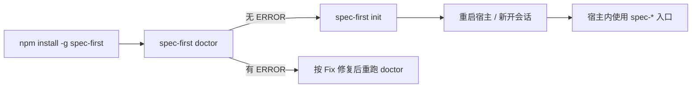
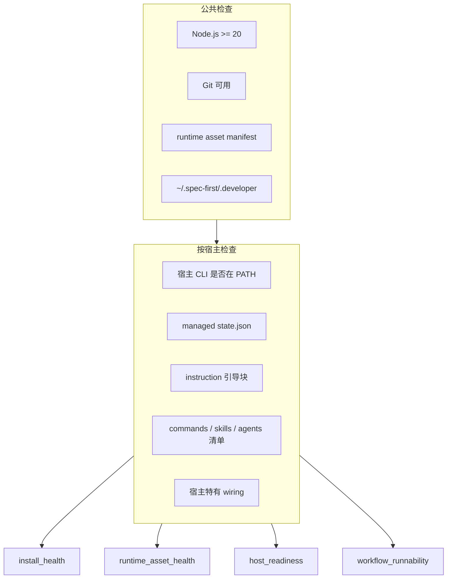
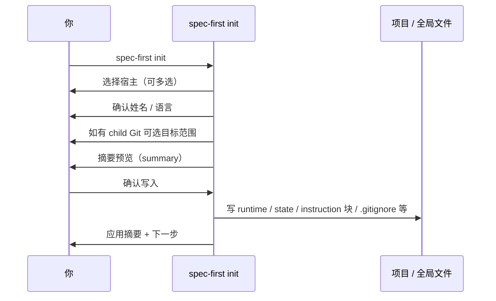

本页只覆盖 **安装 CLI → `doctor` 体检 → `init` 写入项目 runtime** 这一段最小闭环。目标是让你在约五分钟内把 `spec-first` 落到仓库根目录，确认环境与生成资产可用，然后安全进入宿主会话。工作流怎么跑、多宿主差异怎么选、产物目录怎么读，分别见后续页面。

Sources: [README.zh-CN.md](README.zh-CN.md#L46-L96)、[01-快速开始.md](docs/05-用户手册/01-快速开始.md#L1-L70)

## 你将完成什么

五分钟上手的成功标准不是“看懂全部概念”，而是同时满足下面三条：

1. 终端里能执行 `spec-first`，版本信息可打印。
2. `spec-first doctor` 没有 **ERROR** 级阻断（WARNING 可先记录，多数可继续）。
3. `spec-first init` 为所选宿主生成 runtime，并在确认后给出明确的下一步提示。

可以把这段控制面路径理解成：



安装与 `init` 发生在 **终端**；真正的 `spec-brainstorm`、`spec-plan` 等入口发生在 **宿主会话** 内，不是 shell 子命令。

Sources: [README.zh-CN.md](README.zh-CN.md#L46-L132)、[index.js](src/cli/index.js#L163-L183)、[init-output.js](src/cli/commands/init-output.js#L839-L857)

## 前置条件

开始前确认：

| 项 | 要求 | 说明 |
| --- | --- | --- |
| Node.js | `>=20.0.0` | CLI 入口会硬校验 major 版本 |
| npm | 可用全局安装 | 推荐 `npm install -g` |
| Git | 在 `PATH` 中 | `doctor`、setup 与多数 workflow 会读取仓库事实 |
| 宿主 | Claude Code / Codex / Kiro / Qoder / Cursor 之一 | Cursor 需显式 `--cursor`，当前为 generated-runtime preview |
| 工作目录 | 目标项目仓库根 | 首次可先在 throwaway repo 试跑 |

Sources: [package.json](package.json#L100-L102)、[node-version.js](src/cli/node-version.js#L3-L20)、[README.zh-CN.md](README.zh-CN.md#L48-L56)

## 第 1 步：安装 CLI

在任意终端执行：

```bash
npm install -g spec-first
spec-first -v
```

Windows 同样支持 PowerShell 7+、Windows PowerShell 5.1 与 `cmd.exe`；Win64 上更推荐 Windows Terminal + PowerShell 7+ 或原生 `cmd.exe`，UTF-8 行为更稳定。

如果 shell 缓存了旧路径：

- macOS / Linux：`hash -r`
- Windows：新开一个终端，或用 `Get-Command spec-first` / `where spec-first` 确认解析路径

当前包版本可在 `package.json` 查看（文档撰写时为 `1.13.2`）；`spec-first -v` 会打印欢迎页与版本，不依赖 install-script 欢迎提示。

Sources: [README.zh-CN.md](README.zh-CN.md#L58-L80)、[01-快速开始.md](docs/05-用户手册/01-快速开始.md#L8-L36)、[package.json](package.json#L1-L10)、[spec-first.js](bin/spec-first.js#L1-L24)

### 可选：本地 tarball 安装

若你要验证源码发布物而不是 npm registry：

```bash
git clone https://github.com/sunrain520/spec-first.git
cd spec-first
npm pack
npm install -g ./spec-first-<version>.tgz
```

源码安装与升级细节见 [本地源码安装与版本升级](8-ben-di-yuan-ma-an-zhuang-yu-ban-ben-sheng-ji)。日常上手优先用全局 npm 包即可。

Sources: [01-快速开始.md](docs/05-用户手册/01-快速开始.md#L14-L22)、[06-本地源码安装.md](docs/05-用户手册/06-本地源码安装.md#L36-L80)

## 第 2 步：`doctor` 体检

安装后的 **第一个推荐命令** 是：

```bash
# 在目标项目根目录
spec-first doctor
```

也可显式指定宿主：

```bash
spec-first doctor --claude
spec-first doctor --codex
spec-first doctor --cursor
spec-first doctor --kiro
spec-first doctor --qoder
```

机器可读输出：

```bash
spec-first doctor --json
```

### doctor 检查什么

无宿主 flag 时，`doctor` 会根据项目里已有 runtime 目录/状态文件自动检测平台；若尚未初始化，会提示先跑 `init`。



| 级别 | 含义 | 建议动作 |
| --- | --- | --- |
| `PASS` | 该项健康 | 无需处理 |
| `WARNING` | 可继续但有缺口/漂移 | 按 `Fix:` 重跑 `init` 或补宿主 CLI |
| `ERROR` | 阻断级 | 先修再继续；文本模式退出码 `3` |

常见公共项：

- **Node.js**：major `< 20` → ERROR，提示升级到 Node 20+。
- **Git**：找不到或超时 → ERROR。
- **runtime asset manifest**：包内资产清单损坏 → ERROR，需重装包。
- **`~/.spec-first/.developer`**：缺失多为 WARNING；存在但无效则为 ERROR。

平台项覆盖 managed state、instruction 合并块、生成的 commands/skills/agents，以及宿主特有检查（例如 Claude hooks、Codex 全局 SessionStart 污染、Cursor/Qoder 的 MCP 配置提示）。宿主 CLI 不在 PATH 通常是 **WARNING**，不是安装失败本身。

Sources: [doctor.js](src/cli/commands/doctor.js#L28-L104)、[doctor.js](src/cli/commands/doctor.js#L464-L557)、[doctor.js](src/cli/commands/doctor.js#L859-L957)、[doctor.js](src/cli/commands/doctor.js#L1105-L1133)、[01-快速开始.md](docs/05-用户手册/01-快速开始.md#L38-L70)

### 读懂 JSON 状态字段

`doctor --json` / 帮助文案中的聚合字段适合脚本消费：

| 字段 | 含义 |
| --- | --- |
| `install_health` | Node / Git / 包级能否跑 CLI |
| `runtime_asset_health` | `init` 生成的 managed runtime 是否完整 |
| `host_readiness` | 宿主 CLI 与宿主项目 wiring |
| `decision_input_health` | 若存在 setup facts，会读 `.spec-first/config/tool-facts.json` |
| `workflow_runnability` | `verified` / `simulated` / `not_verified` |

`workflow_runnability` 边界很重要：**runtime 齐备** 还不等于“已有验证级执行证据”。没有新鲜 verification evidence 时常见状态是 `simulated`；runtime 不完整才是 `not_verified`。`doctor` 不负责安装 MCP/helper，那是宿主内 `spec-mcp-setup` 的职责。

Sources: [doctor.js](src/cli/commands/doctor.js#L1105-L1133)、[doctor.js](src/cli/commands/doctor.js#L586-L673)

### 退出码速查

| 退出码 | 场景 |
| --- | --- |
| `0` | 帮助、无平台可检、或检查完成且无 ERROR |
| `2` | 未知参数 |
| `3` | 存在 ERROR（含 `--json`） |

Sources: [doctor.js](src/cli/commands/doctor.js#L28-L104)

## 第 3 步：`init` 初始化项目 runtime

环境无阻断后，在 **项目根** 运行：

```bash
spec-first init
```

### 交互流程（默认）



交互步骤与源码帮助一致：

1. 多选 Claude Code、Codex、Cursor、Kiro、Qoder  
2. 确认开发者姓名（可复用全局 profile）  
3. 选择响应语言 `zh` / `en`  
4. 发现 child Git 时选择 workspace 目标  
5. 预览写入/重置  
6. 确认或取消  

多选框会预勾选上次记录在 `~/.spec-first/.developer` 的宿主（跨项目共享）；首次安装不预勾选。默认确认视图是 **宿主级摘要**：生成规模、风险操作总量、项目外写入与 degraded warnings；**不会**默认展开具体 remove/prune/untrack 路径。

需要路径级明细时：

```bash
spec-first init --dry-run
```

Sources: [init.js](src/cli/commands/init.js#L64-L190)、[init-args.js](src/cli/commands/init-args.js#L1-L40)、[init-output.js](src/cli/commands/init-output.js#L66-L113)、[init-output.js](src/cli/commands/init-output.js#L883-L930)、[01-快速开始.md](docs/05-用户手册/01-快速开始.md#L50-L70)

### 常用命令形态

| 场景 | 命令 |
| --- | --- |
| 交互初始化 | `spec-first init` |
| 只初始化 Codex | `spec-first init --codex` |
| 默认宿主脚本化（Claude + Codex） | `spec-first init -y -u <name> --lang zh` |
| Cursor preview | `spec-first init --cursor -y -u <name> --lang zh` |
| Kiro / Qoder preview | `spec-first init --kiro ...` / `--qoder ...` |
| 仅预览 | `spec-first init --dry-run` |
| 父 workspace 默认 | 在父 root 跑 `init`（bootstrap 父级） |
| 只初始化某个 child | `spec-first init --repo <path> ...` |
| 父级 + 全部 child | `spec-first init --all-repos ...` |

要点：

- **无 TTY 且未加 `-y`**：直接失败退出码 `2`（CI 必须脚本化）。
- **`-y` 默认宿主**只有 Claude Code 与 Codex；Cursor / Kiro / Qoder **不在** `defaultForYes` 集合，必须显式 flag。
- 全新机器没有全局 profile 也没有 `git config user.name` 时，`-y` **必须**带 `-u <name>`。
- `--lang` 仅接受 `zh` 或 `en`。
- `--repo` 与 `--all-repos` 不能同时使用。

Sources: [init-args.js](src/cli/commands/init-args.js#L1-L170)、[init.js](src/cli/commands/init.js#L86-L112)、[init-input.js](src/cli/commands/init-input.js#L383-L410)、[init-output.js](src/cli/commands/init-output.js#L883-L930)

### init 会写入什么（你应看到的痕迹）

`init` 把 **源码包内的 skills / templates / agents** 投影为各宿主 managed runtime，并记录 state。不同宿主路径不同，例如：

| 宿主 | 典型 runtime 痕迹 | instruction / state |
| --- | --- | --- |
| Claude Code | `.claude/commands/spec-*.md`、`.claude/skills`、`.claude/spec-first/workflows`、`.claude/agents` | `CLAUDE.md` 合并块；`.claude/spec-first/state.json` |
| Codex | `.agents/skills/spec-*`、`.codex/agents` | `AGENTS.md`；`.codex/spec-first/state.json` |
| Cursor | `.cursor/skills/**`、`.cursor/spec-first/**`；默认 MCP 目标 `.cursor/mcp.json` | pointer `.cursor/rules/spec-first.mdc`；state 在 `.cursor/spec-first/` |
| Kiro / Qoder | 各自 skills / state 目录 | 对应 steering/rules pointer |

另外还有跨宿主的项目级动作：

- 按策略维护 `.gitignore` 中的 managed 块  
- **仅当**仓库缺少 `CHANGELOG.md` 时创建初始 Changelog；已有文件逐字节不动  
- 写入/更新全局 `~/.spec-first/.developer`（姓名、语言、版本等）  
- 可选 user-language sync（`--sync-user-language` / `--no-sync-user-language`）

生成的 runtime **不是**第二套 source of truth；需要重建时再次 `spec-first init` 即可。若 `doctor` 报 `legacy managed state`，不要先手工删目录，直接对目标宿主重跑 `init` 做 managed hard reset。

Sources: [claude.js](src/cli/adapters/claude.js#L48-L80)、[codex.js](src/cli/adapters/codex.js#L41-L73)、[cursor.js](src/cli/adapters/cursor.js#L43-L79)、[init-project-plan.js](src/cli/commands/init-project-plan.js#L303-L574)、[01-快速开始.md](docs/05-用户手册/01-快速开始.md#L60-L70)、[README.zh-CN.md](README.zh-CN.md#L92-L110)

### 父 workspace 与 child repo（init 视角）

在包含多个独立 child Git 的父目录中：

- **默认**：父 root bootstrap（instruction、`.gitignore`、缺失时的 `CHANGELOG.md`、所选宿主 runtime/state）  
- **`--repo <child>`**：只初始化指定 child  
- **`--all-repos`**：父级 + 全部发现的 child  

父级可写 init-owned bootstrap 与 advisory summary；**child 的 setup/readiness 真相仍在各 child 内**。模式对照见 [三种开发模式：单仓、多 module 与多 Git 工作区](7-san-chong-kai-fa-mo-shi-dan-cang-duo-module-yu-duo-git-gong-zuo-qu)。

Sources: [init-workspace.js](src/cli/commands/init-workspace.js#L23-L32)、[init-output.js](src/cli/commands/init-output.js#L910-L920)、[01-快速开始.md](docs/05-用户手册/01-快速开始.md#L100-L120)

## 第 4 步：确认成功并重启宿主

`init` 成功后，终端会打印中文下一步（语言为 `zh` 时），核心是：

1. **重启宿主或新开会话**，让它加载刚生成的 `spec-*` 入口。  
2. 轻量 docs / 小修复 / 首次试用 / plan / work / review / debug 可直接启动匹配入口。  
3. 需要更完整 readiness 时，在宿主内运行 `spec-mcp-setup`。  
4. 再按意图选择 brainstorm / plan / work / review 等链路。

然后建议再跑一次：

```bash
spec-first doctor
# 或
spec-first doctor --claude
```

关注：所选宿主的 managed state、skills（及 Claude 的 commands）、instruction 引导块是否为 PASS 或可接受的 WARNING。目录存在只证明磁盘上有资产；**宿主是否发现入口，必须以完整重启后的会话为准**。

Sources: [init-output.js](src/cli/commands/init-output.js#L839-L881)、[01-快速开始.md](docs/05-用户手册/01-快速开始.md#L180-L210)、[06-本地源码安装.md](docs/05-用户手册/06-本地源码安装.md#L120-L150)

## 五分钟检查清单

| 顺序 | 命令 / 动作 | 期望信号 |
| --- | --- | --- |
| 1 | `npm install -g spec-first` | 全局可解析 `spec-first` |
| 2 | `spec-first -v` | 版本与欢迎页 |
| 3 | `cd <项目根> && spec-first doctor` | 无 ERROR；未 init 时可提示去 init |
| 4 | `spec-first init`（或带 flag / `-y`） | 摘要确认后写入成功 |
| 5 | 重启宿主 | 会话内可见 `spec-*` 能力 |
| 6 | `spec-first doctor`（可选再检） | runtime 与 state 对齐 |

```text
# 最小脚本化示例（Claude + Codex，需已有姓名来源或显式 -u）
npm install -g spec-first
spec-first doctor
spec-first init -y -u alice --lang zh
# 然后重启宿主，再进入会话
```

Sources: [README.zh-CN.md](README.zh-CN.md#L46-L110)、[init-output.js](src/cli/commands/init-output.js#L883-L930)

## 常见卡点（仅限安装 / doctor / init）

| 现象 | 可能原因 | 处理 |
| --- | --- | --- |
| `spec-first` 找不到 | 全局 PATH / shell 缓存 | 新开终端；`hash -r` 或 `Get-Command` |
| Node 版本报错 | Node &lt; 20 | 升级 Node 后重试 |
| `init` 在 CI 失败退出 2 | 非 TTY 且未 `-y` | 使用 `-y` + 宿主 flag + `-u` + `--lang` |
| `-y` 提示缺姓名 | 无全局 profile / 无 git user.name | 传 `-u <name>` |
| Cursor 未随 `-y` 安装 | 默认 yes 宿主不含 Cursor | 显式 `--cursor` |
| doctor 报 legacy state | 旧 managed state schema | 对目标宿主重跑 `init`，勿先手删 |
| doctor 报 skills/commands drifted | 包升级后未重建 runtime | `spec-first init` 重同步 |
| 宿主仍看不到入口 | 只关窗口未重启进程 | 完全退出应用后重开 |

Sources: [init.js](src/cli/commands/init.js#L86-L112)、[init-input.js](src/cli/commands/init-input.js#L383-L410)、[doctor.js](src/cli/commands/doctor.js#L902-L957)、[01-快速开始.md](docs/05-用户手册/01-快速开始.md#L120-L130)

## 本页边界与下一步阅读

本页 **不** 展开：各宿主能力矩阵、首次 brainstorm→plan 走查、产物目录语义、MCP/provider 深度配置。那些分别属于：

- 宿主怎么选 → [多宿主选择：Claude Code、Codex、Kiro、Qoder 与 Cursor](3-duo-su-zhu-xuan-ze-claude-code-codex-kiro-qoder-yu-cursor)  
- 第一个 workflow 怎么跑 → [首次工作流走查：从 brainstorm 到可检查产物](4-shou-ci-gong-zuo-liu-zou-cha-cong-brainstorm-dao-ke-jian-cha-chan-wu)  
- 入口怎么路由 → [入口路由速查：按任务选择 spec-* 工作流](5-ru-kou-lu-you-su-cha-an-ren-wu-xuan-ze-spec-gong-zuo-liu)  
- artifact 去哪找 → [产物目录与成功信号：仓库内 artifact 去哪找](6-chan-wu-mu-lu-yu-cheng-gong-xin-hao-cang-ku-nei-artifact-qu-na-zhao)  
- CLI 全家桶（含 update/clean）→ [CLI 控制面：init、doctor、update 与 clean](18-cli-kong-zhi-mian-init-doctor-update-yu-clean)  
- 若还没建立“为什么要 harness”的心智模型 → [项目概览：AI Coding Harness 的定位与价值](1-xiang-mu-gai-lan-ai-coding-harness-de-ding-wei-yu-jie-zhi)

当你已经完成 `doctor` 无 ERROR 且 `init` 成功并重启宿主，就可以离开本页，去跑第一个可检查 artifact 了。