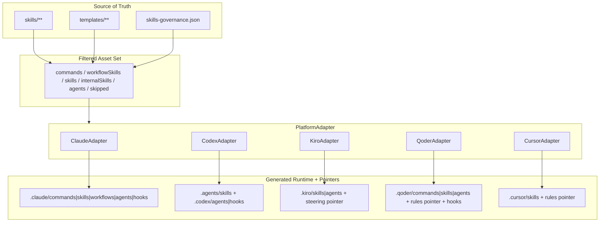
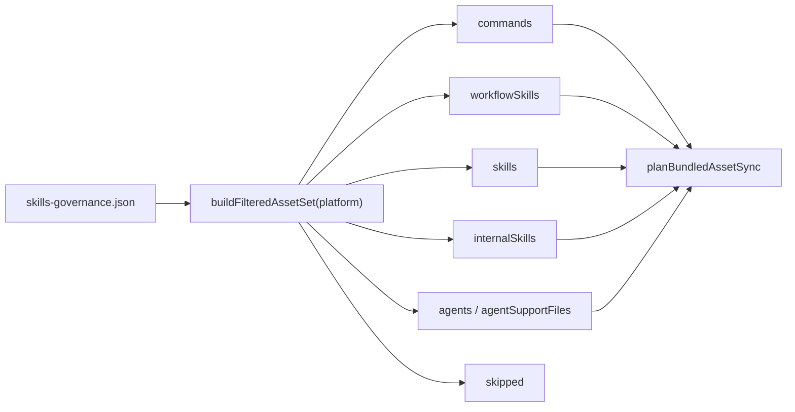
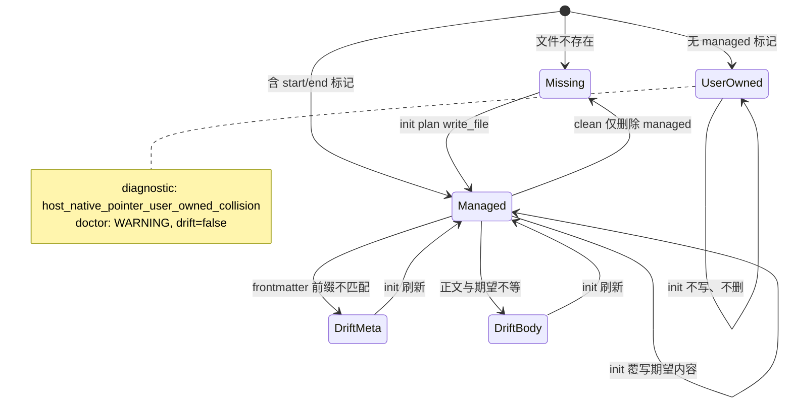

多宿主 Runtime 投影是 spec-first 把**单一源真相**（`skills/`、`templates/`、治理 JSON）映射到 Claude Code、Codex、Kiro、Qoder、Cursor 各自可发现目录的确定性过程。用户侧始终看到统一的 `spec-*` 工作流名；宿主差异只体现在生成路径、command/skill 承载形态，以及是否写入 host-native pointer。本文聚焦投影流水线、pointer 生命周期与混有权属表面的治理边界，不展开 CLI 入口细节或 MCP provider readiness。

## 架构总览：源真相 → 过滤 → 宿主适配 → 托管切片

投影不是“整包复制”。运行时先用 `skills-governance.json` 按宿主算出 **filtered asset set**，再经 `PlatformAdapter` 决定 command/skill/agent 落点，并在 Cursor / Kiro / Qoder 上额外写入 **host-native pointer**——一段带管理标记的轻量指引，把宿主原生规则面指回仓库根指令与 `using-spec-first`，而不是第二份真相源。

Sources: [plugin-governance.js](src/cli/plugin-governance.js#L18-L88)、[index.js](src/cli/adapters/index.js#L7-L40)、[README.md](docs/contracts/dual-host-governance/README.md#L10-L50)

## 五宿主投影矩阵：统一入口，差异化承载

治理合同明确：用户可见 workflow 标识统一为 `spec-*`；`host_delivery` 描述每个宿主最终如何交付。Claude 与 Qoder 对 command-backed workflow 生成 command 文件；Codex、Kiro、Cursor 以 skill 发现为主，不把 command 层当作正式产品面。Cursor 另有 **generated-runtime preview** 姿态：可确定性生成资产，但本地 loader 发现/调用证据仍为 degraded。

| 宿主 | 用户入口口径 | Command 层 | Workflow / Skill 根 | Agents | Host-native pointer | 根指令文件 |
|---|---|---|---|---|---|---|
| Claude | `spec-*` | `.claude/commands/spec-*.md` | skills: `.claude/skills/`；workflows: `.claude/spec-first/workflows/` | 支持 | 无（指令面用 `CLAUDE.md` managed block） | `CLAUDE.md` |
| Codex | `spec-*` | 不安装；`.codex/commands/spec/*` 仅清理遗留 | `.agents/skills/`（workflow 与 standalone 同根） | `.codex/agents/` | 无 | `AGENTS.md` |
| Kiro | `spec-*` | 不生成 command 层 | `.kiro/skills/` | `.kiro/agents/` | `.kiro/steering/spec-first.md` | `AGENTS.md` |
| Qoder | `spec-*` | `.qoder/commands/spec-*.md` | `.qoder/skills/` | `.qoder/agents/` | `.qoder/rules/spec-first.md`（`trigger: always_on`） | `AGENTS.md` |
| Cursor | `spec-*`（preview） | `hasCommands=false`；意外 command 目录会告警 | `.cursor/skills/` | `supportsAgents=false` | `.cursor/rules/spec-first.mdc`（`alwaysApply: true`） | `AGENTS.md` |

Sources: [README.md](docs/contracts/dual-host-governance/README.md#L14-L128)、[runtime-capabilities.md](docs/catalog/runtime-capabilities.md#L36-L125)、[base.js](src/cli/adapters/base.js#L34-L52)、[claude.js](src/cli/adapters/claude.js#L44-L82)、[codex.js](src/cli/adapters/codex.js#L36-L75)、[kiro.js](src/cli/adapters/kiro.js#L15-L62)、[qoder.js](src/cli/adapters/qoder.js#L38-L89)、[cursor.js](src/cli/adapters/cursor.js#L38-L97)

## Filtered Asset Set：投影前的治理闸门

`buildFilteredAssetSet` 读取 governance 记录，按 `entry_surface` 与 `host_delivery[platform]` 分流：`workflow_command + command` 进入 commands 并同步 workflow skill；`workflow_command + skill` 只进 workflowSkills；`standalone_skill + skill` 进 skills；`internal_only + internal` 仅当技能在 `DELIVERED_INTERNAL_SKILLS`（当前为 `spec-worktree`）时才投递。其余进入 `skipped` 供 doctor/审计。filtered set 是**运行时计算**，不另落盘为第二套 state。

Sources: [plugin-governance.js](src/cli/plugin-governance.js#L11-L88)、[README.md](docs/contracts/dual-host-governance/README.md#L160-L236)、[skills-governance.json](src/cli/contracts/dual-host-governance/skills-governance.json#L1-L120)

## 适配器与路径投影：同一 skill 的宿主本地坐标

`planBundledAssetSync` / `syncBundledAssets` 在适配器上展开：有 command 则渲染 command 文件；skills 按 standalone / workflow / internal 写到 `skillsRoot` 与 `workflowsRoot`；`supportsAgents === false`（Cursor）跳过 agents。各适配器的 `transformSkillContent` / `transformAgentContent` 负责：

1. **跨宿主路径改写**：把 prose 中的 `.claude/...`、`.agents/skills/` 等改写成当前宿主路径。
2. **source 路径运行时化**：`rewriteSourceSkillRuntimePaths` 把 `skills/<name>/` 操作路径改写为 runtime skill root，但保留带 “source of truth” 语义的说明行。
3. **command 资源路径**：`rewriteCommandSkillLocalResourcePaths` 把相对 `references/`、`scripts/` 等锚定到已安装 runtime 根。
4. **宿主 frontmatter / 命名规范**：如 Cursor 允许字段白名单、Kiro/Qoder agent tools 归一化、Claude agent 名兼容。

**比较配置路径保护**是关键例外：`spec-mcp-setup` 中跨宿主 MCP 配置路径（如 `.kiro/settings/mcp.json`、`.cursor/mcp.json`）在 rewrite 时被 mask/restore，避免“投影成当前宿主路径”破坏对照表；非对照类外宿主 runtime 路径仍必须改写，doctor 会把残留判为 WARNING。

Sources: [plugin-sync.js](src/cli/plugin-sync.js#L104-L136)、[skill-path-rewrite-markers.js](src/cli/skill-path-rewrite-markers.js#L16-L85)、[host-comparative-config-paths.js](src/cli/adapters/host-comparative-config-paths.js#L1-L77)、[host-runtime-projection-contracts.test.js](tests/unit/host-runtime-projection-contracts.test.js#L152-L200)

## Pointer 文件：不是第二真相源，而是托管入口切片

Cursor、Kiro、Qoder 继承 `PointerBasedAdapter`。pointer 内容由 `buildHostNativePointer` 生成：可选宿主 frontmatter + `<!-- spec-first:host-native-pointer:start/end -->` 管理标记 + 固定 prose。prose 明确三件事：项目级指引在根 `AGENTS.md`；工作流路由在已安装的 `using-spec-first/SKILL.md`；**不要把本文件当第二真相源**，需用 `spec-first init --<host>` 再生。

| 宿主 | Pointer 路径 | Frontmatter | 路由目标（示例） |
|---|---|---|---|
| Cursor | `.cursor/rules/spec-first.mdc` | `alwaysApply: true` | `.cursor/skills/using-spec-first/SKILL.md` |
| Kiro | `.kiro/steering/spec-first.md` | 无 | `.kiro/skills/using-spec-first/SKILL.md` |
| Qoder | `.qoder/rules/spec-first.md` | `trigger: always_on` | `.qoder/skills/using-spec-first/SKILL.md` |

Claude / Codex 不写同类 rules/steering pointer；它们依赖根指令 managed block 与 skill/command 发现面。Qoder 的 `planRuntimeFilesSync` 会把 pointer 计划与 managed hooks / settings cleanup 合并；Kiro/Cursor 默认通过基类把 pointer sync 作为 runtime files 主操作。

Sources: [pointer-based-adapter.js](src/cli/adapters/pointer-based-adapter.js#L13-L82)、[host-native-pointer.js](src/cli/adapters/host-native-pointer.js#L11-L40)、[cursor.js](src/cli/adapters/cursor.js#L15-L97)、[kiro.js](src/cli/adapters/kiro.js#L12-L62)、[qoder.js](src/cli/adapters/qoder.js#L19-L89)、[pointer-based-adapter.test.js](tests/unit/pointer-based-adapter.test.js#L48-L78)

## Pointer 生命周期：sync / inspect / remove 的三态治理

pointer 治理的核心不变量是 **managed marker 判定**（`isManagedHostNativePointer`）：仅当 start/end 标记成对且有序，文件才被视为 spec-first 可覆写/可删除的 managed 切片。

| 场景 | planSync 行为 | inspect 结果 | planRemoval 行为 |
|---|---|---|---|
| 缺失 | `write_file` / `managed_host_native_pointer` | WARNING：pointer missing | 无操作 |
| Managed 且一致 | 仍计划写期望内容（幂等刷新） | PASS | `remove_file` |
| Managed 但 metadata/content drift | 覆写为期望内容 | WARNING + `host_native_pointer_*_drift` | 可删除 |
| 用户自有同名文件 | **零写操作** + warn diagnostic | WARNING + `user_owned_collision`，**不标 drift** | **不删除** |

这条规则把“宿主原生 rules/steering 目录”上的混有权属拆开：spec-first 只管理自己的切片；用户团队规则可共存，但路径碰撞时需人工迁移或补上 managed 标记后再 init。

Sources: [host-native-pointer.js](src/cli/adapters/host-native-pointer.js#L42-L140)、[pointer-based-adapter.test.js](tests/unit/pointer-based-adapter.test.js#L80-L150)

## Init 流水线中的投影与 pointer 落盘

单仓 init 计划（`buildProjectInitPlan`）把投影与 pointer 编入统一 operation plan：

1. 构建 `filteredAssetSet` 与 `planBundledAssetSync`（commands/skills/agents）。
2. 调用 `adapter.planRuntimeFilesSync`（pointer、hooks、清理类 runtime 文件）；pointer 碰撞 diagnostic 并入 init diagnostics。
3. `preSyncPlan`：过时 managed 资产、command namespace prune、retired runtime prune。
4. `writePlan`：合并 asset plan、runtime plan、gitignore managed block、根指令 managed block、state、可选 untrack。
5. Cursor / Qoder 在计划阶段注入 preview 或 hook activation 未验证类警告，避免把“生成成功”误读为“宿主 loader 已证明”。

`doctor` 对每个选中宿主执行 `inspectRuntimeFiles`（含 pointer inspect）、managed state、指令 bootstrap，以及（在 `hasCommands` / `supportsAgents` 允许时）资产清单检查。`clean` 调用 `planRuntimeFilesRemoval`，因此 **只会移除 managed pointer**，不会清掉用户 rules。

Sources: [init-project-plan.js](src/cli/commands/init-project-plan.js#L134-L177)、[init-project-plan.js](src/cli/commands/init-project-plan.js#L260-L299)、[doctor.js](src/cli/commands/doctor.js#L476-L510)、[clean.js](src/cli/commands/clean.js#L436-L436)

## 所有权、gitignore 与 platform-registry 语义

`source-runtime-customization-boundary` 把路径分为：checked-in source、generated runtime mirrors、host-local config、host-user-owned managed slices、宿主原生 advisory 输入。pointer 属于 **generated host-native pointer / managed-slice**：可被 init 写入，但不得手改当 source fix。`.cursor/mcp.json`、`.qoder/settings.local.json` 等 host-local 配置不是 pointer，且 clean 策略与 mirror 不同。

`.gitignore` 的 spec-first managed block 包含全部 generated runtime 与三份 pointer 路径。元数据把 pointer 标为 `shareability: 'generated-pointer'` 且 `runtimeUntrack: false`——即默认 **ignore 生成物**，且不把 pointer 纳入“强制 untrack 已跟踪运行时”的默认 pathspec 集合（与大量 pure generated tree 的 untrack 策略区分）。`platform-registry` 进一步把各宿主 surface 标为 `generated-runtime` / `host-user-owned` / `host-local`，供路径残留扫描与 exclusion 推导。

| 所有权标签 | 典型路径 | 编辑策略 |
|---|---|---|
| generated-runtime | `.claude/commands/spec-*`、`.agents/skills/spec-*`、`.cursor/skills/**` | 改 source 后 `init` 再生 |
| generated-pointer / managed-slice | `.cursor/rules/spec-first.mdc`、`.kiro/steering/spec-first.md`、`.qoder/rules/spec-first.md` | 仅 managed 标记内由 init 维护 |
| host-local | `.cursor/mcp.json`、`.qoder/settings.local.json` | 宿主/setup 输出；非 source；clean 常保留用户 entry |
| host-native advisory | 其他 `.cursor/rules/**`、`.kiro/specs/**`、`.qoder/rules/**` | 宿主或用户拥有；spec-first 不投影、不覆盖 |

Sources: [source-runtime-customization-boundary.md](docs/contracts/source-runtime-customization-boundary.md#L9-L70)、[gitignore-policy.js](src/cli/gitignore-policy.js#L6-L116)、[platform-registry.js](src/cli/adapters/platform-registry.js#L3-L140)

## 设计约束与运维动作清单

**约束（可验证）**

1. 用户可见入口永远是统一 `spec-*`；不得把 Codex/Kiro 再描述为依赖 `.*/commands/spec/*` 正式入口。
2. 不得手改 generated mirror / pointer 作为行为修复；doctor 漂移是“需要 init 对齐”的证据，不是 mirror 可写授权。
3. pointer 冲突时保护用户文件：无 managed 标记则不写不删。
4. 改 skill 交付面必须同步 `skills-governance.json`；filtered set 与 catalog 均由治理真源派生。
5. Cursor 在 loader 证据完备前保持 preview 措辞；Qoder hooks 在 activation 未验证时保持诚实 degraded 诊断。

**推荐动作**

| 目标 | 命令 / 动作 |
|---|---|
| 刷新某宿主投影与 pointer | `spec-first init --claude\|--codex\|--kiro\|--qoder\|--cursor` |
| 检查 pointer 与 runtime 漂移 | `spec-first doctor --<host>` |
| 移除 managed runtime（含 managed pointer） | `spec-first clean --<host>` |
| 用户 pointer 碰撞 | 迁移自定义内容，或补上 managed markers 后重新 init |
| 扩展宿主交付 | 更新 governance + adapter + 契约测试，再 `docs:runtime-catalog` |

Sources: [README.md](docs/contracts/dual-host-governance/README.md#L238-L268)、[source-runtime-customization-boundary.md](docs/contracts/source-runtime-customization-boundary.md#L130-L155)、[runtime-capabilities.md](docs/catalog/runtime-capabilities.md#L36-L48)

## 与相邻页面的边界

- 宿主选型与产品能力对照见 [多宿主选择：Claude Code、Codex、Kiro、Qoder 与 Cursor](3-duo-su-zhu-xuan-ze-claude-code-codex-kiro-qoder-yu-cursor)。
- init/doctor/update/clean 控制面命令语义见 [CLI 控制面：init、doctor、update 与 clean](18-cli-kong-zhi-mian-init-doctor-update-yu-clean)。
- MCP/provider readiness 与 setup 产物见 [Runtime Setup：spec-mcp-setup 与 provider readiness](19-runtime-setup-spec-mcp-setup-yu-provider-readiness)。
- Source / Generated Runtime 原则总述见 [Source of Truth 与 Generated Runtime 分离原则](12-source-of-truth-yu-generated-runtime-fen-chi-yuan-ze)。
- 下一层跨仓图证据边界见 [工作区图与跨仓证据：CodeGraph、Graphify 的 advisory 边界](21-gong-zuo-qu-tu-yu-kua-cang-zheng-ju-codegraph-graphify-de-advisory-bian-jie)。

多宿主 Runtime 投影的工程结论可以收束为一句：**治理 JSON 决定投什么，适配器决定投到哪、如何改写，pointer 只把宿主原生入口钉回统一路由——三者都不得成为并行真相源。**