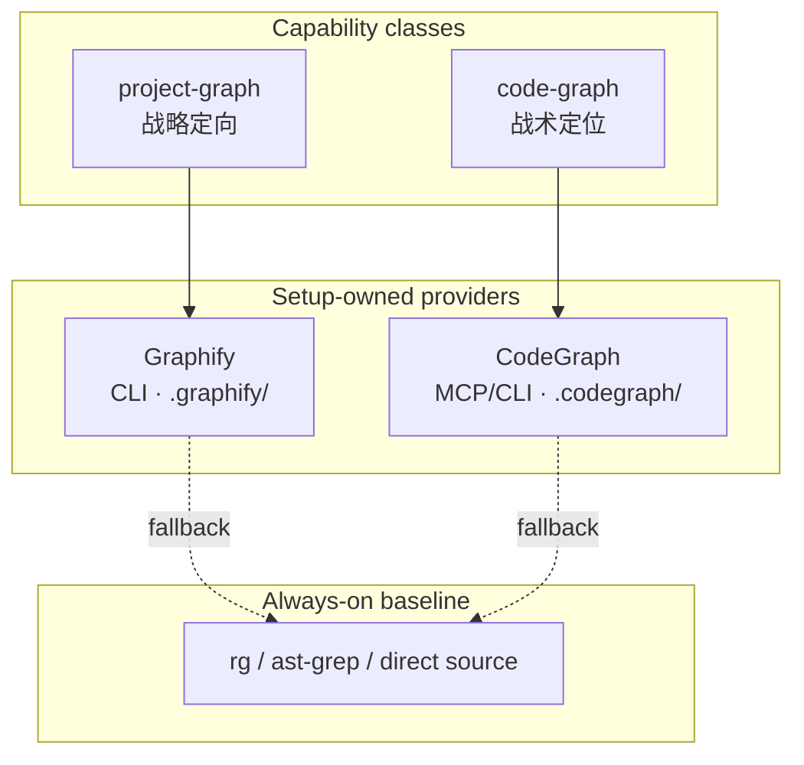
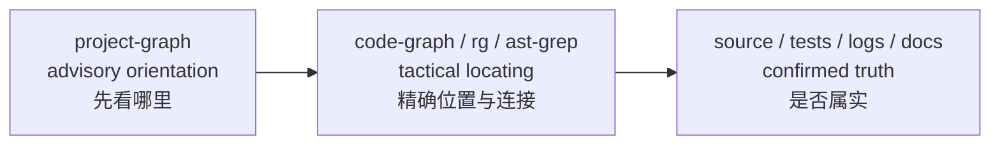
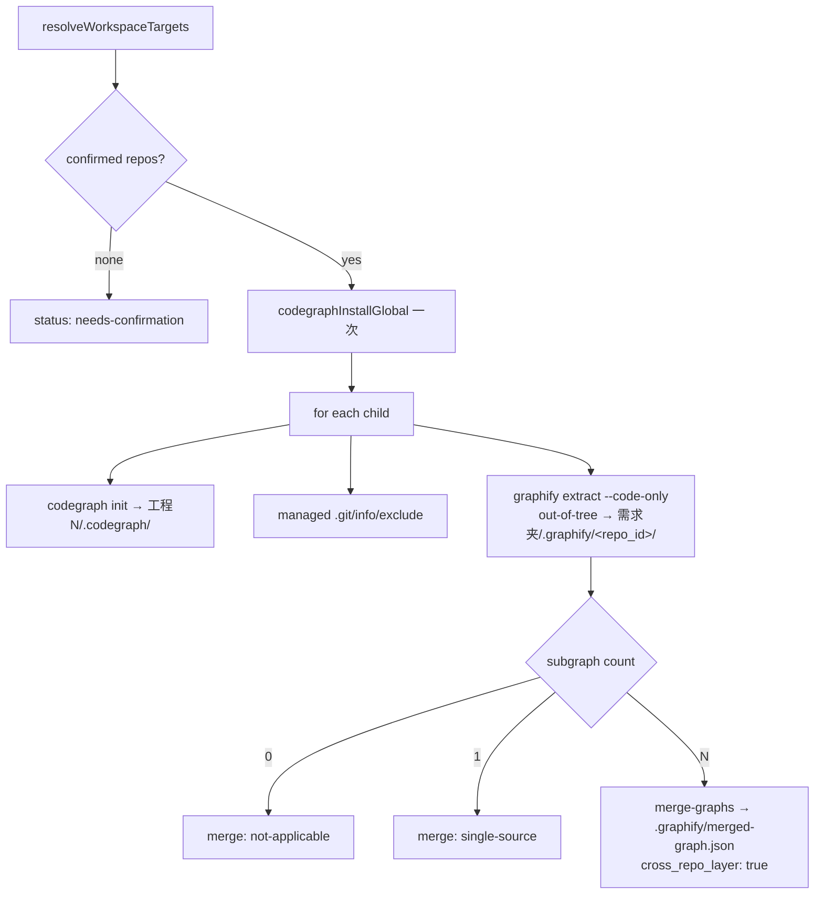

本页解释 spec-first 如何在**单仓**与**按需求隔离的多仓工作区**中装配代码图能力，以及为什么 CodeGraph / Graphify 的全部输出只能作为 **advisory candidate（候选定向证据）**，绝不能直接升格为计划断言、审查 finding、根因或发版结论。阅读对象是已经熟悉 Runtime Setup 与 provider readiness 的高级开发者；入口与安装细节见 [Runtime Setup：spec-mcp-setup 与 provider readiness](19-runtime-setup-spec-mcp-setup-yu-provider-readiness)，证据分层总图见 [整体架构分层：控制面、执行面与契约串联](22-zheng-ti-jia-gou-fen-ceng-kong-zhi-mian-zhi-xing-mian-yu-qi-yue-chuan-lian)。

## 第一性原理：图是定向透镜，不是真相源

spec-first 把外部工具证据统一放进 **Evidence Harness**。`project-graph` / `code-graph` 被定义为 **capability-candidate** 通道：它们可以缩小「下一步读哪里」，但不能证明 finding、scope、root cause、受影响测试或 merge readiness。任何跨 workflow 的「看起来很像」都必须回到 source / test / log / doc / contract / 用户确认。

Sources: [ai-coding-harness.md](docs/contracts/ai-coding-harness.md#L21-L45)

消费侧契约 `project-graph-consumption.v1` 明确这是 **advisory consumption contract**，不是 readiness 契约，也不是 workflow 状态机，更不是 confirmed evidence schema。它只关闭「setup 产出 readiness 事实 ↔ workflow 做语义判断」之间的消费缺口，而不引入第二套证据枚举。

Sources: [project-graph-consumption.md](docs/contracts/project-graph-consumption.md#L1-L14)

与此相对，`provider-readiness.v2` 只承载**机械就绪**与 setup 元数据：`readiness_status`、lifecycle 位、native interface、first_generation / steady_state。契约禁止把 `advisory` / `evidence_candidate` / `confirmed_context` 之类语义信任字段写进 readiness 本体——workflow 只能在直接证据之后自行提权。

Sources: [provider-readiness.md](docs/contracts/provider-readiness.md#L1-L14)

## 双能力类：project-graph 与 code-graph

工作流正文应使用 **provider-neutral capability class**，而不是把 `graphify` / `codegraph` 命令名写进 skill 主路径。

| 能力类 | 定位 | 典型用途 | Provider 实现 | 原生界面 |
| --- | --- | --- | --- | --- |
| `project-graph` | 战略向仓库地图候选 | 宽范围定向、关系路径、概念解释 | Graphify（`kind: project-graph`） | CLI（`query` / `path` / `explain`） |
| `code-graph` | 战术向代码结构候选 | call graph、impact、ownership / affected-test 线索 | CodeGraph（`kind: code-structure`） | MCP + CLI |

Sources: [project-graph-consumption.md](docs/contracts/project-graph-consumption.md#L22-L32), [graphify.cjs](skills/spec-mcp-setup/scripts/providers/graphify.cjs#L36-L62), [codegraph.cjs](skills/spec-mcp-setup/scripts/providers/codegraph.cjs#L18-L44)

**Baseline 工具边界**：`rg` 与 ast-grep 是无状态源码定位工具，不是 readiness 生命周期 provider。契约允许在 workflow 中直接命名它们；provider-neutral 约束只针对生命周期 provider。

Sources: [project-graph-consumption.md](docs/contracts/project-graph-consumption.md#L28-L30)

上图是能力绑定关系，不是调用优先级。是否先问图，由 LLM 根据 readiness 与任务形态判断；直接读源码永远合法。

## Provider 生命周期边界：谁生成、谁刷新、谁使用

两个 provider 都把 **first generation** 归 Runtime Setup，把 **steady-state refresh** 归 provider-native，把 **usage** 归下游 skill。

**CodeGraph**

- 能力：`code-graph`、`impact-candidates`、`affected-tests-candidates`
- Artifact：`.codegraph/codegraph.db`（必须 containment 校验）
- Setup 可做：pinned install、`codegraph init`、status 后的一次 bounded `sync` / `index -f`、bounded query probe
- Setup **不得**启动 `codegraph serve --mcp` 或任何 watcher；Auto-Sync freshness 由 provider-native serve 负责
- Fallback：`rg`、`ast-grep`、`direct-source-read`

Sources: [codegraph.cjs](skills/spec-mcp-setup/scripts/providers/codegraph.cjs#L18-L109), [codegraph.cjs](skills/spec-mcp-setup/scripts/providers/codegraph.cjs#L271-L276), [SKILL.md](skills/spec-mcp-setup/SKILL.md#L159-L159)

**Graphify**

- 能力：仅 `project-graph`
- Artifact：provider-native `.graphify/graph.json`（`graphify-out/` 只是 legacy evidence）
- 首次生成固定 `extract --code-only`：只确认本地 AST code graph；**docs/images/papers 语义图未生成**，必须以 limitation 明示
- 显式 `--refresh` 走 journaled clean rebuild；普通 workflow **不会在代码变更后自动刷新图**
- Steady-state：`skill-cli-hook-on-demand` + `graphify hook install`；不装 MCP、不启 watch、不改 shell profile
- Fallback：`docs`、`rg`、`direct-source-read`

Sources: [graphify.cjs](skills/spec-mcp-setup/scripts/providers/graphify.cjs#L36-L62), [provider-readiness.md](docs/contracts/provider-readiness.md#L15-L20), [SKILL.md](skills/spec-mcp-setup/SKILL.md#L147-L157)

Registry pin（setup-registry.v8）进一步把供应链锁死：CodeGraph 为 npm `@colbymchenry/codegraph@1.4.1`；Graphify 为 PyPI `graphifyy@0.9.12`（uv/pipx 隔离 wheel，禁止 plain pip 与 managed Python 下载）。

Sources: [setup-registry.json](skills/spec-mcp-setup/setup-registry.json#L28-L59)

## 消费梯度与触发形状

消费只允许**缩小下一步读取范围**的三级梯度：

1. **Broad orientation**：候选区域 / 文档 / 概念  
2. **Relationship path**：两个已命名区域之间的候选关系  
3. **Concept explanation**：有界概念图，然后回到源码  

输出始终 candidate-only：候选可以改变「先看哪里」，不能变成答案本身。

Sources: [project-graph-consumption.md](docs/contracts/project-graph-consumption.md#L34-L42)

**适合默认用图**：架构关系、跨文件关系、impact 分析、宽范围 codebase 导航、一块区域如何连到另一块。

**不适合默认用图**：简单事实 Q&A、当前会话摘要、用户给定单文档编辑/摘要、已经 scoped 的文件读取——这些应直接回答、bounded source read 或 baseline 搜索；仅当请求扩展为架构/impact 时再启用图。

Sources: [project-graph-consumption.md](docs/contracts/project-graph-consumption.md#L44-L48), [graphify.cjs](skills/spec-mcp-setup/scripts/providers/graphify.cjs#L1340-L1351)

**硬规则：never cat graph.json**。完整图 artifact 不得作为上下文灌入；只通过 native 查询面做有界导航。

Sources: [project-graph-consumption.md](docs/contracts/project-graph-consumption.md#L16-L20)

## Readiness 门禁：可用性锚定 setup-facts，而非 artifact 存在

消费前的机械门禁顺序固定：

1. 读取携带 `provider_readiness[]` 的 setup-facts  
2. 校验顶层 freshness（含 `generated_at`）；缺失/过期 → availability = unknown → fallback  
3. **只消费目标 capability class 对应的那一条 provider entry**；不得跨 provider 转让 readiness  
4. 按 `readiness_status` 解释可用边界  

| `readiness_status` | Exploration-tier | Conclusion-tier |
| --- | --- | --- |
| `fresh` | 可用 | 仍须 source/test/log/doc 确认 |
| `stale` | 可用，但须标注图落后 HEAD | 不得直接支撑结论；必须重新 grounding |
| `unknown` / `unverified` | 不可用 | 直接 fallback 到 `rg` / 源码 |
| `degraded` / `not-run` | 仅当仍有明确只读 native surface | 否则 fallback |

Fallback 触发集：provider 缺失、setup-facts freshness 不可信、readiness 缺失、自报 unknown/unverified、调用失败、显式禁用、unsafe context。**Fallback 对普通 workflow 永不阻塞**。

Sources: [project-graph-consumption.md](docs/contracts/project-graph-consumption.md#L50-L66)

Setup 侧额外诚实规则：

- Provider 自报 `fresh` **映射为 `unknown`**，除非 spec-first 有直接 probe 证据  
- Provider 自报 `stale` 可映射为 `stale`（保守）  
- `lifecycle.artifact_exists=true` **不等于** runtime usable（可能 CLI 不可见或 `configured=false`）  
- `query_verified=true` 只留给真实 probe，不得由 package install 冒充  

Sources: [provider-readiness.md](docs/contracts/provider-readiness.md#L15-L28), [SKILL.md](skills/spec-mcp-setup/SKILL.md#L54-L54)

CodeGraph readiness 的脚本真相：`installed ∧ initialized ∧ indexed ∧ queryVerified` 且 host `configured` 才可到 `fresh`；任一索引/query 失败即 `degraded`。

Sources: [codegraph.cjs](skills/spec-mcp-setup/scripts/providers/codegraph.cjs#L271-L276)

## 信任中继链：无跨层提权

信任上升方向（**不是调用顺序**）如下：

- Exploration-tier：可直接用图候选决定下一步检查点  
- Conclusion-tier：计划声明、review finding、根因、实现依据、发版声明 **必须**经 source/test/log/doc/用户确认  
- **唯一硬约束：no skip-layer elevation**——project-graph 候选不得跳过下层确认直接进入结论层  
- code-graph 导出的 call edge / impact / ownership / affected-test 进入结论层同样需要确认  
- 经 native code-graph 接口返回的**逐字源码片段**，在记录了文件与行号后，可计为 bounded direct read，无需仪式性重读  

Sources: [project-graph-consumption.md](docs/contracts/project-graph-consumption.md#L68-L80)

### 记录规则（不新增 schema）

| 证据性质 | 落点 |
| --- | --- |
| Advisory 图查询与候选取舍 | work-run 的 `provider_untrusted.summaries[]` |
| 已确认证据 | `direct_evidence_used.source_refs` / `checks_or_logs` / `limitations` |
| Review 输出 | `Direct evidence:` 行写确认覆盖；provider 候选只作 untrusted coverage 上下文 |
| 跨 workflow handoff | 复用 `evidence_summaries[]` |
| Setup fallback 与消费 fallback | **分离**：`lifecycle.fallback_used` ≠ 消费侧 fallback 笔记 |

Sources: [project-graph-consumption.md](docs/contracts/project-graph-consumption.md#L82-L90)

## Per-requirement 多仓工作区：两层图拓扑

当 cwd 是**非 Git 的需求文件夹**（父目录内含多个独立子 Git 仓）时，`spec-mcp-setup --only codegraph,graphify --workspace-graph` 组装 **两层**图。从当前 Git repo 根运行同一 flag 会被 **skip**——该能力只面向非 Git 多仓父目录。

Sources: [SKILL.md](skills/spec-mcp-setup/SKILL.md#L180-L191), [workspace-graph-executor.cjs](skills/spec-mcp-setup/scripts/lib/workspace-graph-executor.cjs#L47-L57)

### 目标解析（U1）

`resolveWorkspaceTargets` 在 `resolveProjectTarget` 之上叠加三层来源：

1. `.spec-first/workspace.yaml`（`workspace-manifest.v1`，用户确认）  
2. CLI `--repos`（用户确认）  
3. 有界 auto-discovery（**仅候选**，`needs_confirm: true`，未确认不建图）  

拓扑守卫：cwd 本身是 Git 仓 → `workspace-cwd-is-git-repo` 并退出；声明路径必须 workspace-contained、为目录且含 `.git` marker。

Sources: [workspace-target.cjs](skills/spec-mcp-setup/scripts/lib/workspace-target.cjs#L1-L50), [workspace-target.cjs](skills/spec-mcp-setup/scripts/lib/workspace-target.cjs#L63-L110), [workspace-manifest.schema.json](skills/spec-mcp-setup/scripts/contracts/workspace-manifest.schema.json#L1-L44)

### 构建编排（U2）

`buildWorkspaceGraphs` 的固定序列：

关键不变量：

- **每子仓失败隔离**：单仓 provider 失败不拖垮整批；总状态 `complete | partial | failed`  
- **CodeGraph 全局 install 一次**，跨仓查询靠 `projectPath`  
- **Graphify 子图与合并图全部 out-of-tree** 写在需求文件夹 `.graphify/`，子仓物理零侵入  
- 子仓 `.codegraph/` 通过 managed exclude 保持 `git status` 干净（worktree / `.git`-as-file 经 `git rev-parse --git-path` + containment）  

Sources: [workspace-graph-build.cjs](skills/spec-mcp-setup/scripts/lib/workspace-graph-build.cjs#L1-L118), [workspace-provider-runners.cjs](skills/spec-mcp-setup/scripts/lib/workspace-provider-runners.cjs#L20-L55), [SKILL.md](skills/spec-mcp-setup/SKILL.md#L182-L189)

### 路由指令（U5）：best-effort，非确定性解析器

注入到需求文件夹根的 `CLAUDE.md` / `AGENTS.md` 的 managed block 规定：

| 场景 | 路由 |
| --- | --- |
| 战术（单仓） | CodeGraph 查询时 `projectPath` = cwd 所在子仓 |
| 跨仓 | 使用 `.graphify/merged-graph.json` |
| 从子仓启动或漏传 `projectPath` | 默认包围子仓；**禁止**裸查询打到无 index 的 server root |
| 隔离 | 不得把 `projectPath` 指向另一需求文件夹 |
| Kiro / Qoder | CodeGraph honest-degraded：战术问题依赖 Graphify + 直接源码 |

整段措辞显式声明：**graphs are advisory candidates — confirm important conclusions against source**，且 routing 是 **best-effort**，不是 deterministic resolver。

Sources: [workspace-routing-instruction.cjs](skills/spec-mcp-setup/scripts/lib/workspace-routing-instruction.cjs#L1-L52), [workspace-routing-inject.cjs](skills/spec-mcp-setup/scripts/lib/workspace-routing-inject.cjs#L1-L40)

### Scope 与 freshness 事实（U4）

`resolveContainedProjectPath` 拒绝逃逸当前 workspace 的 `projectPath`，但 enforcement 恒为 **`advisory`**——spec-first 不拥有全局 MCP server 的硬闸，只能在 facts/doctor/routing 侧约束调用方。

`classifyGraphFreshness` 固定：

- `negative_authority: false`——empty / partial / stale / unknown **永不**证明「不存在」  
- `empty_meaning: no-results-not-absence`  
- `trust: provider_untrusted`  

Sources: [workspace-graph-scope.cjs](skills/spec-mcp-setup/scripts/lib/workspace-graph-scope.cjs#L1-L71)

### 刷新与清理（U3 / U6）

| 动作 | 行为 | 边界 |
| --- | --- | --- |
| Graphify child hooks | 每子仓 `graphify hook install`（hooks 路径必须 workspace-contained） | 失败则 fallback：`graphify-watch-or-explicit-refresh` |
| Merge reconverge | 子图变更后 `merge-graphs` 再收敛 | 与 build 的 zero/one/many 语义一致 |
| CodeGraph refresh posture | 只**报告** `serve --mcp` 默认 watcher | `spec_first_starts_watcher: false`，`trust: provider_untrusted` |
| Clean | 删子仓 `.codegraph/`、managed exclude、hook uninstall、需求夹 `.graphify/` | 不 force-kill daemon；删需求文件夹即无机器级残留 |

Sources: [workspace-graph-refresh.cjs](skills/spec-mcp-setup/scripts/lib/workspace-graph-refresh.cjs#L1-L80), [workspace-graph-clean.cjs](skills/spec-mcp-setup/scripts/lib/workspace-graph-clean.cjs#L1-L75)

### Per-需求隔离总表

| 维度 | 规则 |
| --- | --- |
| 图复用 | 不跨需求文件夹复用图 |
| 全局状态 | 不写机器级 global graph |
| `projectPath` | 限定当前 workspace 根内 |
| Discovery / Git metadata 写入 | symlink-contained |
| 输出信任 | 一律 advisory；结论回子仓源码确认 |
| 删除 | 删除需求文件夹清空其图，无机器级残留 |

Sources: [SKILL.md](skills/spec-mcp-setup/SKILL.md#L187-L189)

## 图输出的能力降级与诚实 limitation

即使 Graphify first generation `completed`，limitation 仍必须写明 **code-only**：

- 不含 docs/images semantic extraction  
- 输出仍是 **advisory candidate**  
- empty corpus → 空 code graph，不得伪装为「已证明无代码」  
- 供应链：仅 direct wheel 固定 hash；transitive inventory / pip-audit 缺失不得表述为 fully hash-locked  

Sources: [graphify.cjs](skills/spec-mcp-setup/scripts/providers/graphify.cjs#L848-L862), [provider-readiness.md](docs/contracts/provider-readiness.md#L18-L19)

CodeGraph 侧同理：impact / affected-tests 能力名本身带 **candidates** 后缀；usage_note 要求结论由 source/test/log/contract/user evidence 确认。

Sources: [codegraph.cjs](skills/spec-mcp-setup/scripts/providers/codegraph.cjs#L22-L44)

## 反模式清单（fail closed 心智）

| 反模式 | 正确姿势 |
| --- | --- |
| 把 `graph.json` 全文塞进上下文 | native `query` / `path` / `explain` 或 CodeGraph MCP 有界查询 |
| 用图证明「无调用方 / 无影响」 | empty result = 无结果，不是 absence（`negative_authority: false`） |
| 用 Graphify readiness 支撑 CodeGraph 结论（或反过来） | 按 capability class 单 entry 消费 |
| 因 artifact 在磁盘就宣称 runtime ready | 读 setup-facts 的 `readiness_status` + CLI/host 可见性 |
| 把跨仓 merge 图当确定性依赖图 / TIA | merge 图仍是 project-graph candidate；跨仓结论回各子仓源码 |
| Setup 启动 CodeGraph watcher 或 Graphify MCP/watch | 生命周期归 provider-native；setup 只 install/probe/报告 |
| 从子仓裸查 CodeGraph 打到 server root | 强制 `projectPath` 或默认包围子仓 |
| 在 plan / review / debug 结论里直接引用 provider 输出 | 先记 `provider_untrusted`，确认后写入 direct evidence 字段 |

Sources: [project-graph-consumption.md](docs/contracts/project-graph-consumption.md#L92-L94), [workspace-graph-scope.cjs](skills/spec-mcp-setup/scripts/lib/workspace-graph-scope.cjs#L44-L70), [workspace-routing-instruction.cjs](skills/spec-mcp-setup/scripts/lib/workspace-routing-instruction.cjs#L32-L41)

## 与上下游页面的衔接

- 安装、verify-only、`--only`、`--refresh`、host MCP 写入：见 [Runtime Setup：spec-mcp-setup 与 provider readiness](19-runtime-setup-spec-mcp-setup-yu-provider-readiness)  
- 单仓 / 多 module / 多 Git 工作区产品语义：见 [三种开发模式：单仓、多 module 与多 Git 工作区](7-san-chong-kai-fa-mo-shi-dan-cang-duo-module-yu-duo-git-gong-zuo-qu)  
- 审查链路如何把图候选降为 untrusted coverage：见 [审查与知识沉淀：code-review、doc-review 与 compound](17-shen-cha-yu-zhi-shi-chen-dian-code-review-doc-review-yu-compound)  
- 契约层如何把 Evidence Harness 与脚本门禁串起来：见 [工作流契约与质量门禁：contracts、hooks 与 eval](23-gong-zuo-liu-qi-yue-yu-zhi-liang-men-jin-contracts-hooks-yu-eval)

**一句话收束**：CodeGraph 与 Graphify 把多仓工作区变成**可查询的候选地图**；spec-first 用 readiness 机械门禁、capability-class 消费契约、per-需求隔离与 no-skip-layer 信任链，保证这张地图永远停在 advisory 边界之内——**缩小搜索，而不是代替真相**。