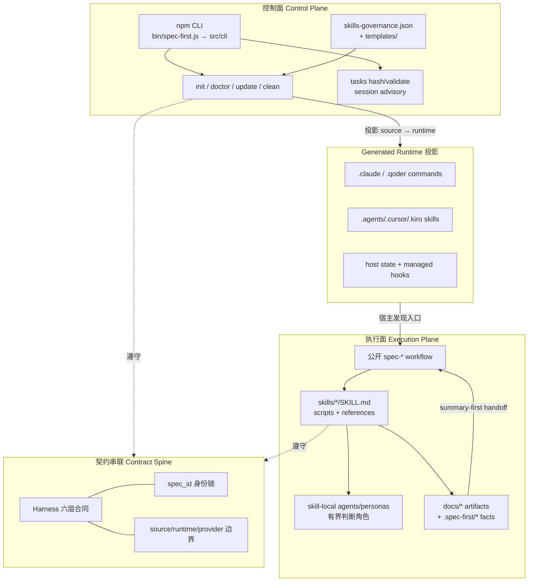
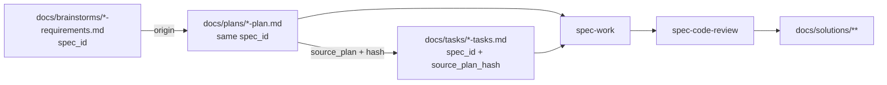
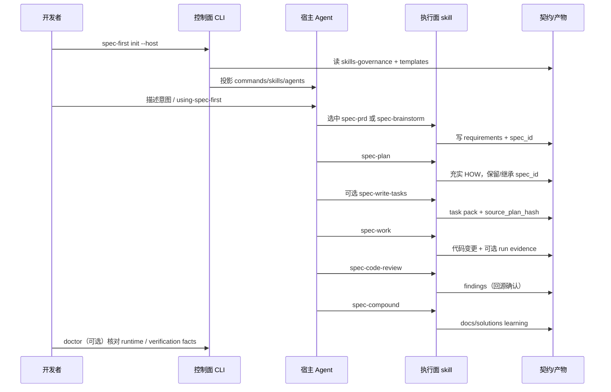

spec-first 不是「一堆 prompt 的集合」，也不是中心化状态机。它是一层 **AI Coding Harness**：用控制面固定可机械执行的边界，用执行面承载语义判断与变更交付，再用契约把各阶段的 identity、证据与 handoff 串成可治理闭环。本文只解释这三层如何分工、如何交接、以及为什么「轻契约 + 明确边界」比刚性流程更可维护。

Sources: [ai-coding-harness.md](docs/contracts/ai-coding-harness.md#L1-L14)、[结构化项目角色契约.md](docs/10-prompt/结构化项目角色契约.md#L1-L24)

## 为什么需要分层，而不是「一个大 workflow」

代码生成已经廉价，**可信变更**仍然稀缺。角色契约把目标写成一条乘法公式：清晰意图 × 有效上下文 × 有界执行 × 可核验证据 × 可失效学习——任一项接近零，更多 agent 只会更快放大错误。因此系统必须把「事实 / 判断 / 授权」拆开，而不是混在同一个 prompt 里。

Sources: [结构化项目角色契约.md](docs/10-prompt/结构化项目角色契约.md#L12-L24)

spec-first 的工程闭环固定为：

```text
Codebase -> Spec -> Plan -> Tasks -> Code -> Review -> Knowledge
```

这条链路是 **语义地图**，不是强制状态机。控制面负责安装、校验、投影与确定性门禁；执行面在宿主内按入口推进语义工作；契约负责跨节点传递 identity 与证据，而不引入全局状态库。

Sources: [ai-coding-harness.md](docs/contracts/ai-coding-harness.md#L7-L13)、[workflow-skill-agent-map.md](docs/workflow-skill-agent-map.md#L3-L21)、[using-spec-first/SKILL.md](skills/using-spec-first/SKILL.md#L9-L11)

## 总览：控制面、执行面、契约层如何咬合

先建立一张全景图。阅读时注意：**CLI 不跑 brainstorm/plan/work**；宿主内的 `spec-*` 才是执行面入口；契约既约束控制面投影，也约束执行面 handoff。



三层的职责可以压缩成一张对照表：

| 分层 | 回答的问题 | 主要资产 | 不负责什么 |
| --- | --- | --- | --- |
| **控制面** | 环境是否就绪？source 如何投到宿主？哪些路径可改？ | `src/cli/`、`templates/`、`src/cli/contracts/**`、`spec-first init/doctor/update/clean` | 不替你写需求、做架构取舍、宣布 review 结论 |
| **执行面** | 当前意图该进哪个 `spec-*`？语义是否充分？变更是否可信？ | `skills/`、skill-local agents、宿主内 workflow 调用 | 不手改 generated mirror；不伪造确定性校验结果 |
| **契约串联** | 跨阶段如何识别同一条链？什么算事实、什么算判断？ | `docs/contracts/**`、frontmatter 字段、schema / verifier | 不成为中心状态机或第二套 readiness 真相源 |

Sources: [ai-coding-harness.md](docs/contracts/ai-coding-harness.md#L15-L35)、[source-runtime-customization-boundary.md](docs/contracts/source-runtime-customization-boundary.md#L1-L22)、[index.js](src/cli/index.js#L163-L191)、[02-核心概念.md](docs/05-用户手册/02-核心概念.md#L19-L56)

## 控制面：确定性地板与 runtime 投影

**控制面**是项目可重建、可校验、跨宿主一致的「工程基础设施层」。它的入口是 npm 包 CLI：`bin/spec-first.js` 做 Node 版本门槛后，把命令路由到 `src/cli` 中的 `doctor / init / clean / update / tasks / session / repair-worktree`。

Sources: [spec-first.js](bin/spec-first.js#L1-L23)、[index.js](src/cli/index.js#L20-L80)

控制面命令的语义边界非常清晰：

| 命令 | 控制面职责 |
| --- | --- |
| `init` | 从 source 安装 / hard-reset 后重建宿主 runtime、skills、agents、developer profile |
| `doctor` | 检查环境、runtime asset manifest 与 managed runtime 漂移 |
| `update` | 升级 CLI 包并触发 fresh `init` 刷新本地 runtime |
| `clean` | 按宿主移除 spec-first 受管资产 |
| `tasks` | 对派生 task pack 做 hash / validate 等确定性校验 |
| `session` | opt-in 多 actor 会话 advisory（register / list / heartbeat / unregister） |

Sources: [index.js](src/cli/index.js#L163-L191)、[02-核心概念.md](docs/05-用户手册/02-核心概念.md#L5-L16)

控制面真正「拥有」的不是运行时镜像，而是 **source-of-truth**：`skills/`、`templates/`、`src/cli/`、`src/cli/contracts/**`、`docs/contracts/**` 与入口文档等。`.claude/`、`.agents/skills/`、`.cursor/`、`.kiro/`、`.qoder/` 下的 managed 路径是 **generated runtime mirrors**——只允许通过改 source 再跑 `spec-first init` 重建，禁止把手改 mirror 当 source fix。

Sources: [source-runtime-customization-boundary.md](docs/contracts/source-runtime-customization-boundary.md#L7-L58)、[AGENTS.md](AGENTS.md#L103-L147)

多宿主交付由 governance 真源驱动，而不是在每个宿主写一套分叉逻辑。`skills-governance.json` 为每个 skill 声明 `entry_surface`（`workflow_command | standalone_skill | internal_only`）、`host_scope` 与按宿主的 `host_delivery`（`command | skill | internal | none`）。`plugin.js` 再把 governance 与 templates 组合成 filtered asset set，供 `init/doctor` 同步。

Sources: [skills-governance.json](src/cli/contracts/dual-host-governance/skills-governance.json#L1-L90)、[dual-host-governance/README.md](docs/contracts/dual-host-governance/README.md#L40-L125)、[plugin.js](src/cli/plugin.js#L1-L45)

因此控制面的架构原则可以记成三句话：

1. **Scripts enforce deterministic invariants and prepare facts**——路径、schema、hash、readiness、reason code 可机械失败即 fail closed。  
2. **Source owns behavior；runtime only delivers**——漂移用 doctor 发现，用 init 修复。  
3. **Host delivery is projection detail**——用户看到的仍是统一 `spec-*` 名称，Claude/Qoder 可走 command 投影，Codex/Kiro/Cursor 可走 skill 投影。

Sources: [ai-coding-harness.md](docs/contracts/ai-coding-harness.md#L28-L35)、[dual-host-governance/README.md](docs/contracts/dual-host-governance/README.md#L12-L28)

## 执行面：Workflow Harness 上的语义闭环

**执行面**发生在宿主会话内：agent 调用公开 `spec-*` workflow（或 standalone skill），按 skill 合同读取上游 artifact、准备上下文、做语义判断、写入 durable 产物。用户手册把当前运行模型概括为 `npm CLI + project-local runtime assets`——CLI 装好投影，宿主负责发现与调用入口。

Sources: [02-核心概念.md](docs/05-用户手册/02-核心概念.md#L19-L56)

执行面内部再拆成三类入口（治理枚举，不是 UI 菜单层级）：

| `entry_surface` | 角色 | 例子 |
| --- | --- | --- |
| `workflow_command` | 公开工程入口，跨宿主统一 `spec-*` | `spec-plan`、`spec-work`、`spec-code-review` |
| `standalone_skill` | 直接方法能力，不包装成 command-backed workflow | `using-spec-first`、`spec-explain`、`spec-pov` |
| `internal_only` | 仅由 workflow 委托，不作为用户主菜单 | `spec-worktree`、`spec-commit` |

Sources: [dual-host-governance/README.md](docs/contracts/dual-host-governance/README.md#L43-L63)、[02-核心概念.md](docs/05-用户手册/02-核心概念.md#L146-L157)

主链路节点与 skill 的映射如下（Context 是横切 harness，不是顺序节点）：

| 链路节点 | 公开入口 | 执行面产出形态 |
| --- | --- | --- |
| Codebase 基线 | `spec-mcp-setup` + CLI `update/init` | setup-owned readiness facts |
| Spec | `spec-ideate` / `spec-brainstorm` / `spec-prd` | ideation / requirements artifact |
| Plan | `spec-plan` | implementation plan（WHAT→HOW） |
| Tasks | `spec-write-tasks`（可选派生层） | task pack + freshness hash |
| Code | `spec-work` | 代码变更 + 可选 run evidence |
| Review | `spec-code-review` / `spec-doc-review` | findings / report |
| Knowledge | `spec-compound` / `spec-compound-refresh` | `docs/solutions/**` |

Sources: [workflow-skill-agent-map.md](docs/workflow-skill-agent-map.md#L3-L21)、[04-workflows-artifacts-map.md](docs/05-用户手册/04-workflows-artifacts-map.md#L49-L68)

执行面还遵循两个「钢架」约定：

- **Front Controller**：`SKILL.md` 只拥有路由准入、执行主脊、边界提醒与 reference 触发决策，不把所有场景细则塞进热路径。  
- **Agent 是有界判断角色**：顶层 `agents/` 已退役；persona/agent prompt 放在 `skills/<skill>/references/agents|personas/`，由 workflow 按需 dispatch，返回 findings 而不是擅自扩张 source of truth。

Sources: [CONCEPTS.md](CONCEPTS.md#L21-L33)、[workflow-skill-agent-map.md](docs/workflow-skill-agent-map.md#L23-L26)、[CONCEPTS.md](CONCEPTS.md#L55-L57)

以 plan→work 交接为例，可以看到执行面如何用 **artifact 合同**而不是全局状态推进：

1. `spec-plan` 声明自己只产 durable plan，不实现代码、不跑执行期试验。  
2. `spec-work` 读取 plan frontmatter：若 `artifact_contract: spec-unified-plan/v1` 且 `artifact_readiness: requirements-only`，必须停下来要求先回 `spec-plan` 充实 HOW；只有 `implementation-ready` 且 `execution: code` 才进入实现。  
3. progress 类字段（`active/completed` 等）被明确禁止当作 readiness——防止把「进度状态」伪装成「可执行合同」。

Sources: [spec-plan/SKILL.md](skills/spec-plan/SKILL.md#L16-L18)、[spec-work/SKILL.md](skills/spec-work/SKILL.md#L31-L42)

这就是执行面的核心：每个 workflow node **自己守门、自己产出**；下一节点只消费上游已确认的 artifact 形状与证据，而不是查询中心状态机。

## 契约串联：把 handoff 变成可验证的轻量协议

如果只有控制面和执行面，跨会话、跨人、跨宿主仍会失忆。**契约层**解决的是「如何用最小 durable mechanism 串起链路」。Harness 合同把 durable surface 分成六层，而不是一个万能 schema：

| Harness 层 | 串联什么 | 代表合同 |
| --- | --- | --- |
| Context | 有界上下文、默认排除 generated/runtime | `context-governance.md`、`context-bundle.md`、`artifact-summary.md` |
| Execution | scope、task identity、handoff evidence | `workflows/spec-id-traceability.md`、`spec-work-run-artifact.schema.json` |
| Evidence | provenance、freshness、limitations、redaction | `project-graph-consumption.md`、`review-finding.md`、verification schemas |
| Evaluation | 聚焦检查与决策关联指标 | `quality-gates/*`、self-reflection 合同 |
| Governance | source/runtime/provider、host delivery、mutation | `source-runtime-customization-boundary.md`、dual-host governance、session |
| Knowledge | 已验证可复用经验的沉淀与发现 | `knowledge/knowledge-harness.md` 等 |

Sources: [ai-coding-harness.md](docs/contracts/ai-coding-harness.md#L15-L26)

### 身份链：`spec_id` 串联 Spec → Plan → Tasks

Execution Harness 用 `spec_id` 做轻量 artifact 身份，而不是审批状态或进度库。requirements 生成 `YYYY-MM-DD-NNN-<slug>`；plan 继承或在无 origin 时自建；task pack 复制 `spec_id` 并配对 `source_plan_hash` 证明新鲜度。脚本可查格式与碰撞，但「是否同一语义链」仍由 LLM 判断并记录理由。

Sources: [spec-id-traceability.md](docs/contracts/workflows/spec-id-traceability.md#L1-L35)



### 上下文链：默认排除 runtime，summary-first 传递

Context Harness 规定：普通 plan/work/debug/review 不得把 `.claude/**`、`.agents/skills/**`、`.spec-first/audits/**` 等 generated/runtime/audit 树当普通上下文；应优先 summary、manifest、validated facts 与精确路径展开。稳定指令放 prefix，动态 diff/tool summary 放 suffix——这是为 cache-friendly 与决策充分性服务，不是为了「塞更多上下文」。

Sources: [context-governance.md](docs/contracts/context-governance.md#L1-L20)、[context-governance.md](docs/contracts/context-governance.md#L23-L55)、[context-governance.md](docs/contracts/context-governance.md#L99-L112)

### 证据链：确定性地板之上才有语义结论

契约把默认 evidence lane 固定为 **bounded direct evidence**：source-read、verification、handoff-summary、（有条件的）external-tool、capability-candidate。脚本记录 exit code / schema / readiness；LLM 解释是否满足任务；外部 provider 在回源确认前永远是 advisory，不拥有 scope / finding / mutation / workflow state 权威。

Sources: [ai-coding-harness.md](docs/contracts/ai-coding-harness.md#L28-L54)、[source-runtime-customization-boundary.md](docs/contracts/source-runtime-customization-boundary.md#L88-L109)、[provider-readiness.md](docs/contracts/provider-readiness.md#L1-L16)

### 产物落点：控制面 facts 与执行面 artifacts 分家

契约串联在磁盘上的可见结果，是 **两条产物带**：

| 带 | 典型路径 | 权威级别 |
| --- | --- | --- |
| 协作文档层（通常可提交） | `docs/ideation/`、`docs/brainstorms/`、`docs/plans/`、`docs/tasks/`、`docs/solutions/` | 上游 handoff 输入；不覆盖 `skills/` 与 `docs/contracts/**` |
| 本机 control-plane / run facts（多为可重建） | `.spec-first/config/`、`workflows/spec-work/`、`verification/`、`app-audit/runs/` | setup-owned 或 run-scoped evidence；不是行为 source |

Sources: [04-workflows-artifacts-map.md](docs/05-用户手册/04-workflows-artifacts-map.md#L9-L68)、[source-runtime-customization-boundary.md](docs/contracts/source-runtime-customization-boundary.md#L76-L86)

## 横切原则：确定性地板、闸门出口、轻契约

三层之所以能协作而不互相吞并，靠的是几条跨层不变量：

**1. Deterministic floor, semantic judgment**  
Scripts / tools 强制可机械判定的不变量并准备事实；LLM / agents 判断意图、方案、风险与语义充分性；Project owner 裁决价值与不可逆取舍。任何一方都不得伪造另一方的权威。

Sources: [结构化项目角色契约.md](docs/10-prompt/结构化项目角色契约.md#L55-L57)、[AGENTS.md](AGENTS.md#L49-L77)

**2. Gate the exits, not the thinking**  
硬 gate 只守 mutation、verification claim、source/runtime、handoff/context reset、knowledge promotion；其余推理保持开放。没有可验证 blocking primitive 时，只能声明 loud convention，不能假装已强制。

Sources: [结构化项目角色契约.md](docs/10-prompt/结构化项目角色契约.md#L59-L61)、[AGENTS.md](AGENTS.md#L79-L81)

**3. Light contract**  
顶层契约只保留会改变决策的 durable invariants；条件流程按需披露。新 contract 必须服务核心链路的明确节点，并关闭真实的 handoff / evidence / governance gap，而不是叠加第二套 readiness 真相源。

Sources: [结构化项目角色契约.md](docs/10-prompt/结构化项目角色契约.md#L51-L53)、[ai-coding-harness.md](docs/contracts/ai-coding-harness.md#L11-L13)、[ai-coding-harness.md](docs/contracts/ai-coding-harness.md#L33-L35)

**4. 项目拥有长期价值，宿主只提供 primitive**  
Host 提供 agent/工具/权限；spec-first 连接 intent、context、scope、claim、evidence、handoff 与 knowledge；Project owner 定义价值与授权。跨宿主追求语义保真，不承诺 feature parity。

Sources: [结构化项目角色契约.md](docs/10-prompt/结构化项目角色契约.md#L27-L45)

## 一次完整穿越：从 init 到 knowledge 的分层协作

下面用一次典型棕地功能交付，说明三层如何在时间轴上协作（不是强制流水线）：



注意序列中的权威方向：

- **控制面 → 宿主**：只交付入口与 managed assets，不决定产品 scope。  
- **执行面 → 契约产物**：写入可交接证据；下游 skill 再读这些产物。  
- **契约 → 双方**：同时约束「CLI 能写什么 facts」与「workflow 能声称什么完成」。

Sources: [workflow-skill-agent-map.md](docs/workflow-skill-agent-map.md#L3-L21)、[spec-id-traceability.md](docs/contracts/workflows/spec-id-traceability.md#L12-L35)、[using-spec-first/SKILL.md](skills/using-spec-first/SKILL.md#L13-L28)

## 反模式速查：分层被破坏时会怎样

| 反模式 | 破坏的层 | 正确做法 |
| --- | --- | --- |
| 手改 `.claude/commands`「修好」行为 | 控制面 / Governance | 改 `skills/` 或 `templates/`，再 `spec-first init` |
| 把 `provider-readiness` 当语义已确认 | Evidence | 只作 setup fact；结论必须回源 source/test/log |
| 用全局状态机强制 plan→work→review | 执行面 | 用 artifact readiness + handoff 问题推进 |
| 把 generated mirror 当普通 review 上下文 | Context | 遵守 exclusion policy，读 source 与 summary |
| 让脚本输出「架构结论」或让 LLM 伪造校验 | 横切原则 | 脚本只出 facts；LLM 做语义；校验必须真跑 |
| 新合同复制第二套 readiness enum | 契约串联 | 先对齐现有 harness 层与 schema，再加最小机制 |

Sources: [source-runtime-customization-boundary.md](docs/contracts/source-runtime-customization-boundary.md#L24-L58)、[provider-readiness.md](docs/contracts/provider-readiness.md#L1-L16)、[ai-coding-harness.md](docs/contracts/ai-coding-harness.md#L28-L35)、[context-governance.md](docs/contracts/context-governance.md#L23-L55)

## 和相邻文档的边界

本文只建立 **分层坐标系**。继续深入时请按目录精确跳转：

- 控制面命令细节 → [CLI 控制面：init、doctor、update 与 clean](18-cli-kong-zhi-mian-init-doctor-update-yu-clean)  
- Runtime provider 与 readiness → [Runtime Setup：spec-mcp-setup 与 provider readiness](19-runtime-setup-spec-mcp-setup-yu-provider-readiness)  
- 多宿主投影细节 → [多宿主 Runtime 投影与 pointer 文件治理](20-duo-su-zhu-runtime-tou-ying-yu-pointer-wen-jian-zhi-li)  
- 合同、hooks 与 eval 细节 → [工作流契约与质量门禁：contracts、hooks 与 eval](23-gong-zuo-liu-qi-yue-yu-zhi-liang-men-jin-contracts-hooks-yu-eval)  
- 入口路由 → [using-spec-first 入口治理与场景路由](24-using-spec-first-ru-kou-zhi-li-yu-chang-jing-lu-you)  
- 如何扩 skill → [新增 Skill 与 Agent：接入规范、钢架结构与回归保护](25-xin-zeng-skill-yu-agent-jie-ru-gui-fan-gang-jia-jie-gou-yu-hui-gui-bao-hu)

若你刚从主链路工作流读到这里，建议下一步先读契约与门禁页，再回控制面/多宿主页——这样能把「为什么能串起来」和「如何装到宿主上」分开掌握。

Sources: [docs/README.md](docs/README.md#L15-L30)、[ai-coding-harness.md](docs/contracts/ai-coding-harness.md#L1-L14)

## 小结

spec-first 的整体架构可以收束为：

1. **控制面**用 CLI + governance + templates 维护 source→runtime 的确定性投影与机械校验。  
2. **执行面**用公开 `spec-*` skill 在宿主内完成语义闭环，节点自治、产物交接。  
3. **契约串联**用 Harness 六层、`spec_id`、context exclusion、evidence lanes 与 source/runtime 边界，把 handoff 变成可验证、可降级、可失效的轻协议。  

它追求的不是「自动化更多步骤」，而是用最小可维护机制，把正确意图更快变成 **claim-scoped、可回源、可撤销** 的可信变更。