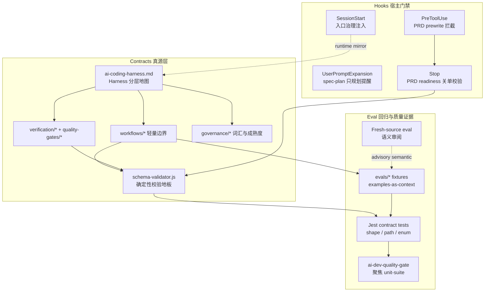
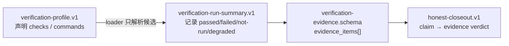
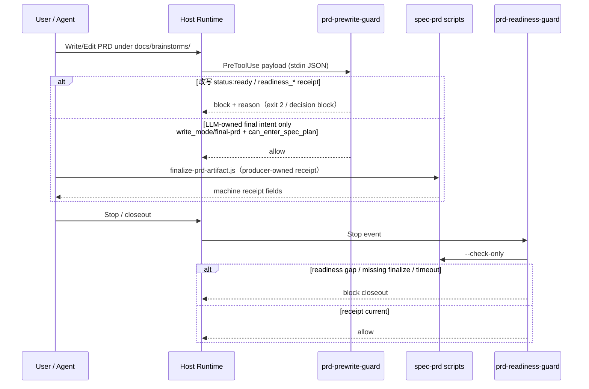
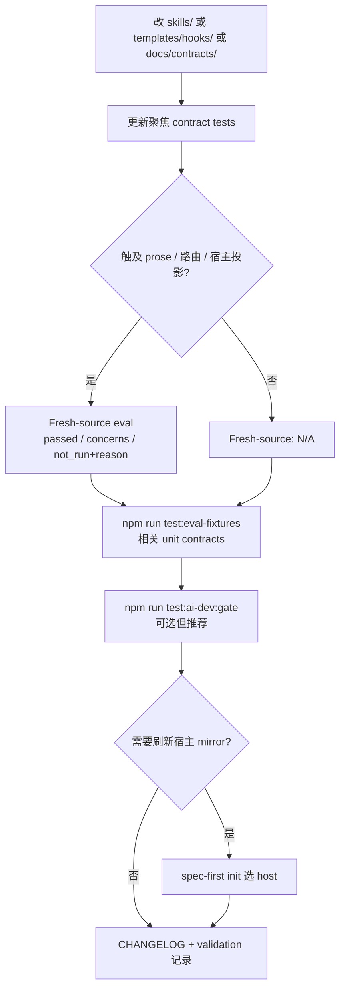

本页解释 spec-first 如何用 **contracts（契约真源）**、**hooks（宿主运行时门禁）** 与 **eval（评估回归）** 三层结构，把 AI 工作流约束成可审计、可降级、可复现的工程闭环。读者应已熟悉 [整体架构分层：控制面、执行面与契约串联](22-zheng-ti-jia-gou-fen-ceng-kong-zhi-mian-zhi-xing-mian-yu-qi-yue-chuan-lian) 中的控制面/执行面分工；本页只展开 **质量门禁的 durable surface**：谁定义不变量、谁在宿主上拦截、谁证明 prompt/workflow 改动没有丢掉保护边界。

核心原则可压缩为一句：

> **Scripts enforce deterministic invariants and prepare deterministic facts；LLM workflows decide semantic adequacy above that floor。**

Sources: [ai-coding-harness.md](docs/contracts/ai-coding-harness.md#L31-L36) · [CONCEPTS.md](CONCEPTS.md#L36-L45)

## 三层门禁总览

质量体系不是单一 CI job，也不是“万能 JSON Schema 平台”。它是沿着核心链路 `Codebase → Spec → Plan → Tasks → Code → Review → Knowledge` 分布的三类机制：

| 层 | 职责 | 主要载体 | 可阻断？ | 不负责 |
|---|---|---|---|---|
| **Contracts** | 命名 durable 字段、边界、reason code 与 schema | `docs/contracts/**` + `src/contracts/schema-validator.js` | 结构非法时 fail closed | 语义是否“够好” |
| **Hooks** | 在宿主事件点注入上下文或拦截危险写路径 | `templates/*/hooks/*` → 投影到 `.claude/.codex/.qoder` | 部分硬拦截（PRD receipt） | 替代 skill 主流程 |
| **Eval** | 证明 prompt/workflow 改动未破坏保护边界 | `skills/*/evals/**` + Jest contract tests + fresh-source eval | 结构/coverage 可硬失败；语义多为 advisory | 自动给模型打分当发布真理 |

Sources: [ai-coding-harness.md](docs/contracts/ai-coding-harness.md#L12-L35) · [skill-agent-quality-governance.md](docs/contracts/workflows/skill-agent-quality-governance.md#L10-L17)

上图应读作：**契约定义不变量 → 脚本/hooks 执行机械判定 → eval 证明改动后边界仍在**。LLM 仍拥有 scope、架构取舍、finding 是否成立与 degraded evidence 是否足够的判断权。

Sources: [ai-coding-harness.md](docs/contracts/ai-coding-harness.md#L16-L35) · [source-runtime-customization-boundary.md](docs/contracts/source-runtime-customization-boundary.md#L140-L156)

## Contracts：durable 真源，而不是状态机

### Harness 分层地图

`docs/contracts/ai-coding-harness.md` 是 contract 目录的轻量地图。它把 durable surface 归入六层 harness，避免每个 skill 各自发明第二套 readiness / evidence enum：

| Harness | 职责摘要 | 代表合同 |
|---|---|---|
| Context | 有界、可追溯上下文 | `context-governance.md`, `context-bundle.md` |
| Execution | scope / task id / handoff，不膨胀成状态机 | `workflows/spec-id-traceability.md` |
| Evidence | provenance、freshness、limitations、redaction | `verifiers/verification-evidence.schema.json` |
| Evaluation | 聚焦检查、advisory gate、决策相关度量 | `quality-gates/*`, `self-reflection-capability-upgrade.md` |
| Governance | source/runtime/provider 边界与 host delivery | `source-runtime-customization-boundary.md`, `dual-host-governance/` |
| Knowledge | 已验证经验可发现，不强制预读 | `knowledge/knowledge-harness.md` |

Sources: [ai-coding-harness.md](docs/contracts/ai-coding-harness.md#L16-L26)

### Skill / Agent 质量边界语言

`skill-agent-quality-governance.md` 明确：**不是 runtime 状态机、不是 hard gate 平台、不是 eval 平台、不替代 LLM 语义审阅**。公开 workflow skill 的最小合同字段是 trigger / non-trigger / inputs / outputs / workflow skeleton / failure mode / done signal；高风险写路径必须先定义 writes、shell/network、secrets、git staging、external service、rollback/stop 边界。

这与 [确定性门禁与语义判断：脚本地板之上的 LLM 职责](11-que-ding-xing-men-jin-yu-yu-yi-pan-duan-jiao-ben-di-ban-zhi-shang-de-llm-zhi-ze) 同一刀法：脚本管可机械判定事实，LLM 管 adequacy。

Sources: [skill-agent-quality-governance.md](docs/contracts/workflows/skill-agent-quality-governance.md#L10-L48)

### 轻量 Schema Validator

`src/contracts/schema-validator.js` 是 **确定性地板校验器**，服务 contract tests 与 doctor evidence，不是完整 JSON Schema 实现。它强制 `type/enum/const/required/properties/items/contains/additionalProperties/anyOf/oneOf/allOf/if-then-else/min*/max*/pattern/minimum/maximum` 等关键字；`format/$schema/title/description` 等为 advisory。

契约文档明确：需要 standards-complete 行为时，应给该 consumer 加显式依赖与测试，而不是假装轻量 validator 已经等于 Ajv。

Sources: [schema-validator.md](docs/contracts/schema-validator.md#L1-L29) · [schema-validator.js](src/contracts/schema-validator.js#L1-L29)

### Verification 与 Honest Closeout

验证链路拆成 **声明** 与 **结果** 两个 contract，再由 honest closeout 把 claim 绑到 evidence：

- **Profile**：`spec-first.verification.json`（团队真源）或 `.spec-first/verification-profile.local.json`（本地覆盖）。loader 只解析/解析命令候选，不执行命令、不裁决是否通过。本仓库默认 profile 声明 `typecheck/unit/smoke/integration` 四类 npm-script check。
- **Run summary**：单次 run 的 per-check 结果；`passed` 要求 `ran=true`、`exit_code=0` 与 redacted log ref；dry-run 必须是 `not-run` + `reason_code: schedulable`；缺工具是 `not-run` + `missing_dependency`。
- **Honest closeout**：validator 输出而非第二份 durable 关单文档；`validation` claim 必须引用 `verification-run-summary:<check-id>`；空证据 = `unsupported`；诚实报告 not-run/failed 只会 degrade overall，而不是伪装 verified。

Sources: [verification-profile.md](docs/contracts/verification/verification-profile.md#L1-L28) · [spec-first.verification.json](spec-first.verification.json#L1-L40) · [verification-run-summary.md](docs/contracts/verification/verification-run-summary.md#L1-L25) · [honest-closeout.md](docs/contracts/workflows/honest-closeout.md#L1-L20) · [profile-loader.js](src/verification/profile-loader.js#L1-L50)

### Governance 词汇：lens 与 rule maturity

`gate-lens-taxonomy.v1` 只提供 `preflight | exploration | planning | execution | verification | review | summary` 词汇；**它不执行 gate、不调度 check、不暗示 blocking**。脚本可把这些名字作为确定性标签发出，LLM 决定如何解释。

`rule-maturity.v1` 记录规则成熟度观察：当前 writer 只写 `stage: "shadow"` 到 gitignored 的 `.spec-first/governance/rule-maturity.json`；`advisory/required-evidence/blocking` 留给未来人类裁决。这防止“观测到一次就自动升级成硬门禁”。

Sources: [gate-lens-taxonomy.md](docs/contracts/governance/gate-lens-taxonomy.md#L1-L19) · [rule-maturity.md](docs/contracts/governance/rule-maturity.md#L1-L24)

### Source / Runtime 边界（契约变更的第一红线）

契约与 hook 模板属于 **source-of-truth**；`.claude/hooks/*`、`.qoder/hooks/*`、`.codex` 投影等是 **generated runtime mirrors**。改行为应：编辑 `templates/` / `skills/` / `docs/contracts/` → 补聚焦测试 → 必要时 `spec-first init` 刷新宿主投影。直接 patch mirror 不是合法修复路径。

Sources: [source-runtime-customization-boundary.md](docs/contracts/source-runtime-customization-boundary.md#L9-L56)

## Hooks：宿主事件上的确定性护栏

### 概念定位

`CONCEPTS.md` 将 **Managed Hook** 定义为由 `spec-first init/doctor/setup` 安装或检查的宿主运行时 hook；漂移时以 **source templates + helper scripts** 为 durable contract。Deterministic Gate 则是脚本/hook/verifier 基于 schema、receipt、path、hash、reason code 的机械拦截，**不得替代 LLM 语义判断**。

Sources: [CONCEPTS.md](CONCEPTS.md#L36-L37) · [CONCEPTS.md](CONCEPTS.md#L123-L123)

### Claude 宿主：四事件矩阵

Claude 投影由 `.claude/settings.json` 声明，模板真源在 `templates/claude/hooks/`：

| 事件 | 模板 | 行为 | 强度 |
|---|---|---|---|
| `SessionStart` | `session-start` | 检查 `CLAUDE.md` 托管 lang/workflow-entry 块；注入短 pointer + 可选 startup version reminder | 软：只增上下文 |
| `UserPromptExpansion`（matcher `spec-plan`） | `spec-plan-guard` | 声明 planning-only：允许研究/写 plan，禁止实现代码；`permission_mode=plan` 时提示原生 Plan Mode 写保护 | 软：注意力护栏 |
| `PreToolUse`（`Write\|Edit\|MultiEdit`） | `prd-prewrite-guard` | 仅针对 `docs/brainstorms/*-requirements.md`；拦截 LLM 直接写 machine-owned ready receipt 字段 | **硬拦截** |
| `Stop` | `prd-readiness-guard` | 对变更 PRD 跑 `finalize-prd-artifact.js --check-only`；缺 finalize script / readiness gap / timeout 则 block closeout | **硬拦截** |

Sources: [settings.json](.claude/settings.json#L1-L61) · [session-start](templates/claude/hooks/session-start#L1-L70) · [spec-plan-guard](templates/claude/hooks/spec-plan-guard#L1-L39) · [prd-prewrite-guard](templates/claude/hooks/prd-prewrite-guard#L1-L78) · [prd-readiness-guard](templates/claude/hooks/prd-readiness-guard#L1-L78)

关键边界（源码与合同测试共同冻结）：

1. **`status: ready-for-planning` 与 `readiness_*` 是 producer-owned**，不得经 Claude/Qoder 文件 mutation 工具直接写入。
2. **`write_mode: final-prd` + `can_enter_spec_plan: yes` 是 LLM-owned final intent**，prewrite 允许；真正 ready 状态仍由 finalize 写入 receipt。
3. reconstruction degraded 时，只要 mutation 片段触及 machine-ready 字段，同样 block。
4. readiness guard 使用 5s 预算；超时给出 `finalize_check_timeout`，与真实 readiness gap 区分。

Sources: [prd-prewrite-guard](templates/claude/hooks/prd-prewrite-guard#L56-L68) · [spec-prd-hook-contracts.test.js](tests/unit/spec-prd-hook-contracts.test.js#L134-L198) · [prd-readiness-guard](templates/claude/hooks/prd-readiness-guard#L67-L75)

### 多宿主差异：同一边界，不同协议

| 宿主 | SessionStart | PRD prewrite / readiness | 备注 |
|---|---|---|---|
| **Claude** | 有；读 `CLAUDE.md` | 有；stdout JSON decision | 最完整四事件矩阵 |
| **Qoder** | 有；`QODER_PROJECT_DIR` | 有；parity 测试覆盖 Claude/Qoder | finalize 路径映射到 `.qoder/skills/spec-prd/...` |
| **Codex** | 有；读 `AGENTS.md`；`hooks.json` 仅 SessionStart | **无** PRD write/stop guard 模板 | 依赖 skill 内脚本 + 合同测试，而非宿主 PreToolUse |

Codex 的 `templates/codex/hooks/hooks.json` 只声明 SessionStart，命令占位符由 init 填入；这是宿主能力与产品面取舍，不是“Codex 不需要 PRD 质量”——确定性检查仍在 `skills/spec-prd/scripts/*` 与 Jest 合同中。

Sources: [hooks.json](templates/codex/hooks/hooks.json#L1-L15) · [session-start](templates/codex/hooks/session-start#L1-L50) · [spec-prd-hook-contracts.test.js](tests/unit/spec-prd-hook-contracts.test.js#L9-L22) · [source-runtime-customization-boundary.md](docs/contracts/source-runtime-customization-boundary.md#L48-L52)

### Session 治理（opt-in，非 lock）

`spec-first-session.v1` 是 multi-actor worktree 的 **advisory** 感知文件（`.spec-first/sessions/<id>.json`）。CLI 只做 register/heartbeat/list；不强制 lock、不中心化协调。未启用时全部 skill 行为不变——这与“反对中心化 gate 平台”一致。

Sources: [spec-first-session.md](docs/contracts/sessions/spec-first-session.md#L1-L55)

## Eval：结构回归 + 语义审阅，而不是“自动裁判”

### Eval Fixture Contract

`eval-fixture-contract.md` 规定 source-owned fixture 的轻量结构（`spec-first.workflow-eval-fixtures.v1`）：每个 case 需要 `id`、`input`、`coverage_tags[]`、`source_refs[]`、`source_ref_authority`。`coverage_tags` 只声明 **结构覆盖**（trigger/boundary/failure/expected/routing…），**不证明语义质量**。

`source_ref_authority: source` 不得指向 generated runtime（`.claude/**`、`.codex/**`、`.agents/skills/**`）或历史 `docs/plans/**`、`docs/validation/**` 作为 release-readiness 唯一锚点。

Sources: [eval-fixture-contract.md](docs/contracts/workflows/eval-fixture-contract.md#L1-L65)

### 仓库内真实 Eval 面

| Skill / 路径 | 内容 | Runner 语义 |
|---|---|---|
| `skills/spec-prd/evals/` | `examples.json`、contract-reset 协议、`run-evals.js` | **只**校验 fixture 结构、coverage bucket、reason-code 与 frozen run-dir 合同；**不**调用 LLM、不评判 PRD 语义 |
| `skills/spec-write-tasks/evals/` | trigger/boundary/failure/expected/output-quality cases | 确定性断言可跑；objective/semantic 需人类或 fresh-source |
| `skills/spec-write-skill/evals/` | trigger cases + promotion evidence 校验 | 晋升证据结构，非模型分数板 |
| `skills/spec-app-consistency-audit/evals/` | examples + recorded fixtures | 维护者上下文 |
| `npm run test:eval-fixtures` | 聚合 Jest 合同 | shape / enum / path / hash 一致性 |
| `npm run test:ai-dev:gate` | `scripts/run-ai-dev-quality-gate.js` | 聚焦 workflow-runtime contract unit-suite |

`run-evals.js` 的 usage 原文即边界声明：*Checks fixture structure… It does not run PRD generation, call an LLM, or judge semantic output quality.* 对 contract-reset，`status: passed` 只表示 run directory 确定性合同可解析；`gate_a_status` 可仍为 `inconclusive` / `awaiting-semantic-review`——**结构通过永不升级为语义 pass**。

Sources: [run-evals.js](skills/spec-prd/evals/run-evals.js#L74-L82) · [evaluation-governance.md](skills/spec-prd/evals/evaluation-governance.md#L15-L48) · [README.md](skills/spec-write-tasks/evals/README.md#L1-L20) · [package.json](package.json#L24-L28)

### Fresh-source Eval（语义层）

当改动触及 `skills/**/SKILL.md`、`agents/**`、host entry、templates 或 generated-runtime 行为时，应执行或诚实记录 **fresh-source eval**：

| status | 含义 |
|---|---|
| `passed` | 对 **当前磁盘源文件** 做了 fresh read-only review，无实质 concerns |
| `concerns` | 已跑审阅并有 finding |
| `not_run` | 不可派发/未授权/显式推迟；必须写 reason |
| `N/A` | 未触及 skill/agent/workflow prose 或 runtime 投影 |

反模式：用当前 session 的缓存 skill 定义“验自己”；patch `.claude/` 让 eval 变绿；只跑 unit test 却宣称 fresh-source passed；把 model judge 做成 CI 硬门禁。

Sources: [fresh-source-eval-checklist.md](docs/contracts/workflows/fresh-source-eval-checklist.md#L1-L97)

### AI Dev Quality Gate 与被动反馈

`scripts/run-ai-dev-quality-gate.js` 运行固定清单的 workflow-runtime Jest 合同，写出：

- `.spec-first/workflows/quality-gates/ai-dev-quality-gate/ai-dev-quality-gate-result.json`（`passed` / `checks` / `failures` / `advisory_failures`）
- 同目录 `quality-feedback-topics.json`（由 `buildQualityFeedbackTopics` 从 failed checks 派生 candidate topics）

这是 **Evaluation Harness 的聚焦机械门**，不是全量测试替代，也不是语义 scorecard。artifact 路径经 `resolveWorkflowArtifactDir` 约束在 `.spec-first/workflows/<workflow>/<slug>/`，并做 Windows 文件名与 path containment 校验。

Sources: [run-ai-dev-quality-gate.js](scripts/run-ai-dev-quality-gate.js#L1-L131) · [ai-dev-quality-gate-result.schema.json](docs/contracts/quality-gates/ai-dev-quality-gate-result.schema.json#L1-L72) · [quality-feedback.js](src/verification/quality-feedback.js#L1-L55) · [artifact-paths.js](src/verification/artifact-paths.js#L35-L52)

### Self-reflection 与能力升级（评估闭环的“慢环”）

`self-reflection-capability-upgrade.md` 把“系统是否真的变好”固化为报告结构与 handoff 边界：自我审视 → 能力缺口 → CUD 决策 → plan → review → compound。脚本可准备文件列表、hash、schema 事实；**缺口是否真实、CUD 是否 Accepted 由 LLM/人类裁决**。默认不引入 auto-rewrite 或 `spec-evolve` 状态机。

Sources: [self-reflection-capability-upgrade.md](docs/contracts/workflows/self-reflection-capability-upgrade.md#L1-L45)

## 三层如何串联：一次工作流改动的合法路径

对照 `source-runtime-customization-boundary` 的定制流：先源后测，再语义，再 init；PR/closeout 应并列写出 `Fresh-source eval: …` 与 `Runtime impact: none | init <host> | multiple | N/A`。

Sources: [source-runtime-customization-boundary.md](docs/contracts/source-runtime-customization-boundary.md#L140-L156)

### 模式对照：什么该硬，什么必须软

| 机制 | 硬失败条件（示例） | 必须保持 soft/advisory 的原因 |
|---|---|---|
| Schema validator | 缺 required key、enum 越界 | 不实现 format 语义、不判业务正确性 |
| PRD prewrite hook | 直接写 ready receipt | 不判 PRD 需求是否“产品上正确” |
| PRD readiness hook | finalize check 失败 / 超时 | 不替代 grill/write 中的产品决策 |
| Eval fixture runner | case 缺 id/coverage/source_ref | 不声称 output quality 自动达标 |
| Fresh-source eval | （通常不进 CI hard gate） | 语义审阅依赖 reviewer 与场景 |
| rule-maturity shadow | 字段非法可拒写 | 永不自动 promote 到 blocking |
| session list | schema 损坏跳过 | 不是跨 session 硬锁 |

Sources: [skill-agent-quality-governance.md](docs/contracts/workflows/skill-agent-quality-governance.md#L70-L76) · [rule-maturity.md](docs/contracts/governance/rule-maturity.md#L14-L24) · [evaluation-governance.md](skills/spec-prd/evals/evaluation-governance.md#L36-L48)

## 维护者操作面速查

| 目标 | 命令 / 路径 |
|---|---|
| 校验 verification profile 结构 | `spec-first.verification.json` + `src/verification/profile-loader.js` |
| 跑 eval fixture 合同聚合 | `npm run test:eval-fixtures` |
| 跑 AI Dev quality gate | `npm run test:ai-dev:gate` |
| 校验 spec-prd eval 结构 / contract-reset run-dir | `node skills/spec-prd/evals/run-evals.js [--fixture \| --run-dir]` |
| 检查 Claude hook 投影 | `.claude/settings.json` + `spec-first doctor --claude` |
| 修改 hook 行为 | 改 `templates/{claude,qoder,codex}/hooks/*`，再 `spec-first init` |
| 记录规则 shadow 观察 | `spec-first internal rule-maturity record`（仅 shadow） |
| 并行 session 感知 | `spec-first session list`（opt-in） |

Sources: [package.json](package.json#L24-L28) · [run-evals.js](skills/spec-prd/evals/run-evals.js#L74-L82) · [rule-maturity.md](docs/contracts/governance/rule-maturity.md#L26-L32)

## 与相邻页面的边界

- **不在本页展开**：CLI 子命令生命周期与 doctor 细节 → [CLI 控制面：init、doctor、update 与 clean](18-cli-kong-zhi-mian-init-doctor-update-yu-clean)；provider readiness 与 MCP 安装 → [Runtime Setup：spec-mcp-setup 与 provider readiness](19-runtime-setup-spec-mcp-setup-yu-provider-readiness)；入口路由文案 → [using-spec-first 入口治理与场景路由](24-using-spec-first-ru-kou-zhi-li-yu-chang-jing-lu-you)。
- **本页只回答**：契约如何分层、hook 在宿主上保护什么、eval 如何区分结构证据与语义证据，以及三者如何共同构成 **脚本地板 + LLM 语义天花板** 的质量门禁体系。

若你要新增 skill 或 agent，下一步请读 [新增 Skill 与 Agent：接入规范、钢架结构与回归保护](25-xin-zeng-skill-yu-agent-jie-ru-gui-fan-gang-jia-jie-gou-yu-hui-gui-bao-hu)：那里把本页的 fixture/contract/fresh-source 要求落到具体接入清单。