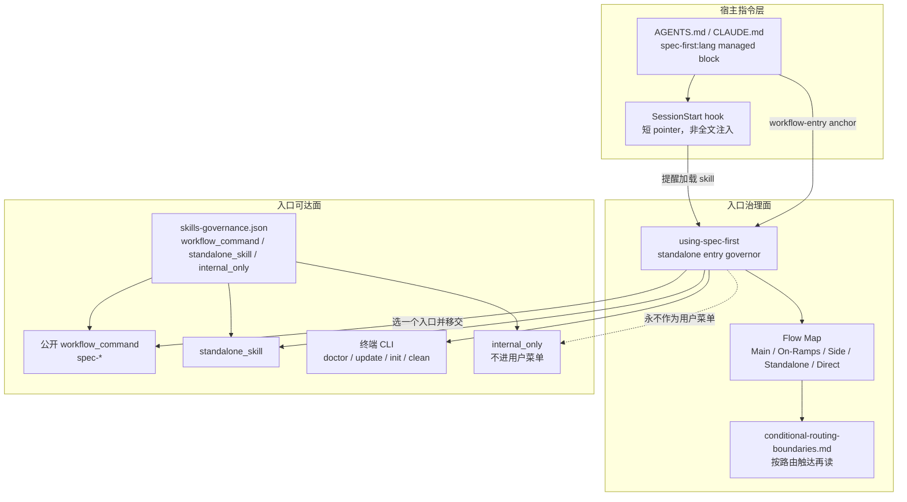
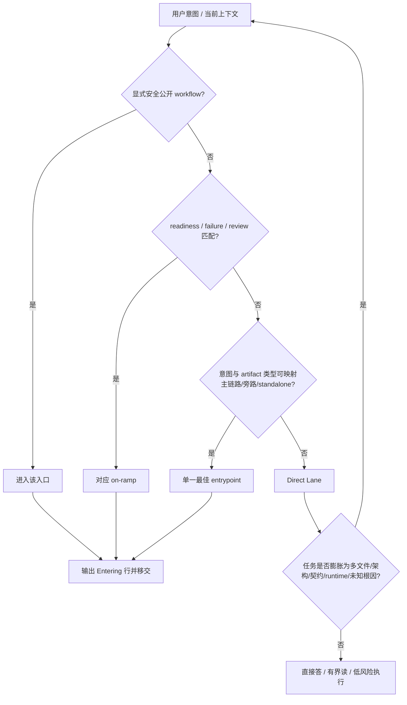
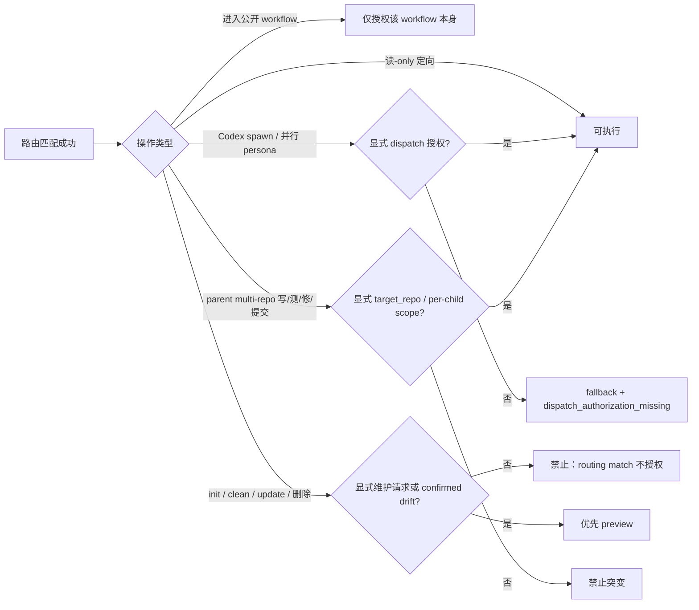

`using-spec-first` 是 spec-first 的**独立入口治理器（entry governor）**：它不实现业务 workflow，也不生产 durable artifact，只在“实质性工作开始前 / 用户问下一步该做什么”时，选出**一个**公开 `spec-*` workflow、standalone skill、终端命令，或 Direct Lane（直接回答 / 有界读取 / 正常小改），然后把控制权交给下游。对高级开发者而言，理解它等于理解 harness 如何把“意图”压成“可治理入口”，以及哪些边界绝不能被路由捷径绕过。

本页只覆盖入口治理与场景路由：功能地图、选择优先级、输出契约、条件边界、会话注入与回归契约。具体 workflow 语义见主链路各页；CLI 与 runtime 投影见对应运行时页。

Sources: [SKILL.md](skills/using-spec-first/SKILL.md#L1-L20)、[24-公开入口与Skill目录.md](docs/05-用户手册/24-公开入口与Skill目录.md#L1-L22)、[skills-governance.json](src/cli/contracts/dual-host-governance/skills-governance.json)

## 在架构中的位置

入口治理处在**宿主指令层**与**执行面 skill**之间：会话启动只注入最小锚点；真正的路由语义在 source skill；条件治理在按需加载的 reference；公开可达面由 governance 清单约束。



三层职责必须分开理解：**锚点**只保证“要先加载入口治理”；**功能地图**负责“选哪个入口”；**条件边界**负责“入口命中后仍不能自动授权的操作”。把三层揉成一张大状态机会导致漏路由与越权同时发生。

Sources: [lang-policy.js](src/cli/lang-policy.js#L1-L131)、[session-start](templates/claude/hooks/session-start#L15-L48)、[SKILL.md](skills/using-spec-first/SKILL.md#L7-L20)、[skills-governance.schema.json](src/cli/contracts/dual-host-governance/skills-governance.schema.json#L37-L43)

## 身份契约：它是什么、不是什么

| 维度 | 契约事实 |
| --- | --- |
| 产品身份 | Standalone entry governor，不是 command-backed workflow |
| 入口面 | `entry_surface: standalone_skill`；`command_name: null` |
| 宿主投递 | 五宿主均为 `skill`（claude / codex / cursor / kiro / qoder） |
| 产物 | **不创建** workflow artifact；只选入口并 yield |
| 流程观 | flow 连接 entrypoint；**不是**刚性状态机，不自动串 `plan → work → review → knowledge` |
| 控制权 | 选中后由**活跃 workflow** 拥有 handoff；治理器退出路由 |

前端可把它想成“应用壳路由表 + 鉴权中间件”：路由表决定去哪一页，中间件决定是否允许写操作；后端可把它想成“API gateway 的 intent router”：匹配一条下游服务，不自己落业务状态。

Sources: [SKILL.md](skills/using-spec-first/SKILL.md#L1-L20)、[skills-governance.json](src/cli/contracts/dual-host-governance/skills-governance.json)、[using-spec-first-contracts.test.js](tests/unit/using-spec-first-contracts.test.js#L23-L31)

## 功能地图：五条路径如何分工

主文件只保留**一张** `## Flow Map`（契约测试禁止恢复第二套 Route Map / Routing Rules 标题），按意图而不是按主题域分桶。

### 主链路：Intent → Governed Change

| 阶段 | 意图信号 | 入口 |
| --- | --- | --- |
| 定义 WHAT | 需要 0–1 个方向 / 选项 | `spec-ideate` |
| 定义 WHAT | 有想法，问题框、用户、成功标准未定 | `spec-brainstorm` |
| 定义 WHAT | 棕地 PRD 写作 / 精炼 / code-aware readiness | `spec-prd` |
| 文档批评 vs 写 PRD | 批评已有需求/计划/任务 → `spec-doc-review`；写/精炼 PRD 或 plan 准入 → `spec-prd` | 见左 |
| HOW 未定 | 结果清楚但实现路径未定 | `spec-plan` |
| 可执行任务包 | settled plan 需要 task pack（可选） | `spec-write-tasks` |
| 执行 | plan / task pack / brief / 明确工作项就绪 | `spec-work` |
| 质量判断 | diff / branch / PR | `spec-code-review` |
| 知识沉淀 | 已验证解法 | `spec-compound`；修正/合并/退役 → `spec-compound-refresh` |

只进入**当前最优**一步。禁止因为“主链路看起来完整”就自动连跑后半段。

Sources: [SKILL.md](skills/using-spec-first/SKILL.md#L14-L32)、[24-公开入口与Skill目录.md](docs/05-用户手册/24-公开入口与Skill目录.md#L24-L40)

### 匝道（On-Ramps）

| 场景 | 入口 / 标签 |
| --- | --- |
| 环境、MCP、helper、宿主 readiness | `spec-mcp-setup` |
| 安装健康 / 升级 / 生成 / 移除 managed runtime | `spec-first doctor --<host>`、`update`、`init`、`clean --<host>`（仍受条件边界约束） |
| 直接补丁 / 再生 **generated runtime mirror** | 路由标签 `runtime-maintenance`（即使拒绝不安全 mirror 手改，标签仍成立）；进入 `spec-write-skill` 前需**单独的** source 修订请求 |
| 失败、异常行为、测试失败、栈、回归、flake | `spec-debug` |
| 需求 / 规格 / 计划 / task pack / Markdown 批评 | `spec-doc-review` |
| 创建、修订、迁移、修复、校验 **source skill 包** readiness | `spec-write-skill`；无 package readiness 的只读质量审计 → **bounded source review** |
| 外部 issue / PR 输入 | 按**即时意图**再分：失败 → debug；WHAT 未定 → prd/brainstorm；diff 风险 → code-review；owner 已批工作 → work |

Issue 正文、reporter 命令、PR 描述、provider facts **不是**已确认事实；下游必须用源码、diff、测试、日志或 owner 证据核验。

Sources: [SKILL.md](skills/using-spec-first/SKILL.md#L34-L45)、[conditional-routing-boundaries.md](skills/using-spec-first/references/conditional-routing-boundaries.md#L5-L14)

### 质量与交付旁路、Standalone、Direct Lane

| 桶 | 入口示例 | 关键约束 |
| --- | --- | --- |
| Quality / Delivery | `spec-optimize`、`spec-dogfood`、`spec-polish`、`spec-app-consistency-audit` | 指标实验 / 浏览器 QA / UI polish / App 三方一致性，不替代主链路 |
| Standalone | `spec-explain`、`spec-pov`、`spec-strategy`、`spec-simplify-code`、`spec-rule-miner`、`spec-product-pulse`、`spec-sweep`、`spec-riffrec-feedback-analysis`、`spec-promote`、`spec-lfg` | **不**包装成 command-backed 主节点；`spec-lfg` 仅用户明确要求全自动绿 PR 时 |
| Direct Lane | 直接答、有界读、单文件低风险编辑 | 目标/改动/根因已清晰；一旦扩展为多文件行为、架构、契约、治理、runtime、未知根因或敏感面 → **重新路由** |

轻量“X 该怎么写？”类解释留在 Direct Lane；需要 dense 个人讲解器时才进 `spec-explain`。

Sources: [SKILL.md](skills/using-spec-first/SKILL.md#L47-L66)、[using-spec-first-contracts.test.js](tests/unit/using-spec-first-contracts.test.js#L48-L68)

### 公开面 vs 内部面（治理清单）

机器可读权威是 `skills-governance.json`（schemaVersion 1）。契约测试要求：**每个** `workflow_command` / `standalone_skill` 必须在 SKILL 功能地图中以 `` `skill_name` `` 出现；**每个** `internal_only` 不得出现在 using-spec-first 包正文中。

| entry_surface | 数量（当前） | 用户含义 |
| --- | --- | --- |
| `workflow_command` | 17 | 公开主入口；宿主统一写作 `spec-*` |
| `standalone_skill` | 11（含 `using-spec-first`） | 可直接方法能力；部分仅用户显式触发 |
| `internal_only` | 7 | 如 `spec-commit`、`spec-worktree`、`spec-test-browser` 等；**不是**用户菜单项 |

Sources: [skills-governance.json](src/cli/contracts/dual-host-governance/skills-governance.json)、[using-spec-first-contracts.test.js](tests/unit/using-spec-first-contracts.test.js#L33-L46)、[24-公开入口与Skill目录.md](docs/05-用户手册/24-公开入口与Skill目录.md#L100-L112)

## 选择优先级与输出契约

选择顺序是**语义判断协议**，不是关键词表：

1. **显式安全的公开 workflow** — 用户已点名且可达 → 进入该入口  
2. **readiness / failure / review 匝道** — 环境未就绪、失败回归、文档/技能包治理匹配时优先  
3. **即时意图 + artifact 类型** — 压过宽泛主题域  
4. **否则 Direct Lane**



**活跃工作**时：输出一行本地化等价语句 `Entering <entrypoint>: <一条具体理由>`，然后在下游 invocation 契约允许时跟随；若 standalone 仅 user-invoked，则**推荐并等待**。禁止背诵整张地图；低置信时仍只给一个入口。

**只读“下一步？”指导**时：推荐恰好一个入口，**不启动**它，并使用仓库配置的用户语言：

```text
Recommended entrypoint: <spec-*, standalone skill, or terminal command>
Reason: <one concrete reason>
Next action: <one action the user can take now>
```

仅当用户继续要求时才真正进入推荐入口。

Sources: [SKILL.md](skills/using-spec-first/SKILL.md#L68-L82)、[using-spec-first-contracts.test.js](tests/unit/using-spec-first-contracts.test.js#L48-L58)

## 条件路由边界：命中入口 ≠ 获得授权

主文件在“触达 runtime maintenance、scenario fingerprint、Codex dispatch、普通上下文排除、parent multi-repo 写测修提交”时，强制读 [conditional-routing-boundaries.md](skills/using-spec-first/references/conditional-routing-boundaries.md)，并**只应用匹配章节**。这是 progressive disclosure：常驻地图保持精瘦（SKILL ≤100 行；reference ≤60 行，由契约钉死），重治理按需展开。



### Runtime Maintenance

| 规则 | 含义 |
| --- | --- |
| Source of truth | `skills/`、`templates/`、`src/cli/`、`docs/` 等 checked-in 源 |
| Generated runtime | `.claude/`、`.codex/`、`.agents/skills/`、`.cursor/`、`.kiro/`、`.qoder/` 等 **不是** source fix 面 |
| MCP / helper | `spec-mcp-setup` |
| 健康检查 / 升级 | `doctor --<host>` / `update` |
| init / clean | 仅显式初始化/再生或 confirmed drift / 显式移除 |
| 策略 SoT | `skills/using-spec-first/SKILL.md`；managed instruction 与 host copy 只是锚点或投影 |

### Scenario Fingerprints

现有 fingerprint 是 **advisory context**，不是 gate、approval 或 source-scope 权威；**禁止**仅为选路而生成 fingerprint。foreign residual 建议 preview-first；缺 first-time setup 且用户问 readiness → `spec-mcp-setup`。dirty-source / git-alignment 只披露盲区，重要结论仍要回到当前源码、测试、日志或 owner 证据。产物契约见 `.spec-first/workspace/scenario-fingerprint-setup.json`（`developer-scenario-fingerprint-setup.v1`）。

### Codex Dispatch 与 Startup Reminder

路由进 workflow **只授权该 workflow**。dispatch 需要用户或上游 handoff **显式**请求 subagents / personas / delegated / parallel work；否则走文档化 fallback 并记录 `dispatch_authorization_missing`。顶层 Codex orchestrator 可 best-effort 跑 `spec-first startup-reminder --codex`，失败/空输出/畸形本地状态**不得**阻塞路由；bounded subagent / leaf reviewer / worker **不**跑它。

### Parent Multi-Repo 与普通上下文排除

有界只读定向可检查可能的 child repo 并声明 target 假设；任何写、测试、autofix、commit 必须先有显式 `target_repo` 或 per-child scope。普通任务默认排除 `.spec-first/audits/**`、`.spec-first/governance/**` 与 generated mirrors；setup / audit / drift 例外见 `docs/contracts/context-governance.md`。Advisory facts **不能**支撑 “complete / passed” 声称。

Sources: [SKILL.md](skills/using-spec-first/SKILL.md#L84-L93)、[conditional-routing-boundaries.md](skills/using-spec-first/references/conditional-routing-boundaries.md#L1-L35)、[developer-scenario-fingerprint.md](docs/contracts/developer-scenario-fingerprint.md#L1-L40)、[context-governance.md](docs/contracts/context-governance.md#L1-L50)、[using-spec-first-contracts.test.js](tests/unit/using-spec-first-contracts.test.js#L70-L93)

## 会话注入：最小锚点，而非全文路由器

历史方案曾尝试把大段路由决策集塞进 bootstrap；**当前实现**收敛为：

1. **Managed language/governance block**（`spec-first:lang`）写入 `CLAUDE.md` / `AGENTS.md`，内含 `<!-- spec-first:workflow-entry:using-spec-first -->` 与一句“实质性工作前加载 using-spec-first”  
2. **SessionStart hook** 检查该 block 与 workflow-entry 锚点；已安装时只注入**短 pointer**（指向宿主 runtime 上的 `using-spec-first/SKILL.md`），不把全文再塞一遍  
3. **Runtime skill 文件**由 `spec-first init` 从 `skills/using-spec-first` 投影到各宿主 skills 根  
4. 遗留独立 `spec-first:bootstrap` 块应合并进 lang block；`instruction-bootstrap.js` 负责检测/清理

| 宿主 hook 模板 | 指令文件 | 短 pointer 中的 full policy 路径 |
| --- | --- | --- |
| `templates/claude/hooks/session-start` | `CLAUDE.md` | `.claude/skills/using-spec-first/SKILL.md` |
| `templates/codex/hooks/session-start` | `AGENTS.md` | `.agents/skills/using-spec-first/SKILL.md` |
| `templates/qoder/hooks/session-start` | `AGENTS.md` | `.qoder/skills/using-spec-first/SKILL.md` |

Cursor / Kiro 通过 pointer-based adapter 把 `using-spec-first/SKILL.md` 标为 workflowPolicy，同样不把治理器做成第二套 slash 命令。

**设计取舍**：注入保证“入口治理在场”，但路由权威仍在 source skill；禁止手改 generated mirror 当 source fix（见 source/runtime 边界契约）。

Sources: [lang-policy.js](src/cli/lang-policy.js#L106-L131)、[instruction-bootstrap.js](src/cli/instruction-bootstrap.js#L12-L90)、[session-start](templates/claude/hooks/session-start#L15-L48)、[pointer-based-adapter.js](src/cli/adapters/pointer-based-adapter.js#L38-L44)、[source-runtime-customization-boundary.md](docs/contracts/source-runtime-customization-boundary.md#L26-L55)

## 每条路由之下的硬边界（Always-on）

无论落到哪条路径，以下规则同时成立：

- **已在活跃公开 workflow 内**：继续该 workflow；bounded subagent / reviewer / worker 完成委托任务，**不重启**入口路由  
- **命名空间**：公开 workflow 使用 `spec-*`；standalone 保持 standalone；`internal_only` 不是用户菜单  
- **Source / Runtime**：只改 source-of-truth；脚本/CLI 强制确定性不变量并准备 facts；LLM 判断语义充分性；advisory 不能证明完成  
- **条件章节**：runtime / fingerprint / dispatch / parent multi-repo / context exclusion 触达时读 reference  
- **禁止**：仅因路由匹配就跑状态变更命令；禁止伪造测试、refresh、eval 或 routing evidence  
- **禁止**恢复遗留宿主拼写：`/spec:` 或 `$spec-` 形式（契约测试负向断言）

Sources: [SKILL.md](skills/using-spec-first/SKILL.md#L84-L93)、[using-spec-first-contracts.test.js](tests/unit/using-spec-first-contracts.test.js#L70-L97)

## 契约回归与演进约束

`tests/unit/using-spec-first-contracts.test.js` 把产品决策钉成可执行规格：

| 断言主题 | 防止的退化 |
| --- | --- |
| 仅一个 `## Flow Map`，SKILL ≤100 行 | 回到“多表路由 + 违规史档案” |
| 公开 skill 全覆盖、internal 不出现在包内 | 用户菜单泄漏内部 helper 或漏掉新公开入口 |
| Direct / Standalone / guide 输出模板 / 用户语言 / user-invoked-only | 五类 outcome 混写 |
| `spec-write-skill` vs bounded source review vs `runtime-maintenance` | skill 包治理与 mirror 手改、只读点评混淆 |
| source/runtime、advisory 完成声称、dispatch、target_repo、routing 不授权 init/clean | 治理边界回退 |
| 单一 pointer 指向 conditional reference + 五章节标题 | 条件治理散落或重复堆回主文件 |
| 无 `/spec:` / `$spec-` | 宿主拼写分叉 |

演进时的正确顺序：**先改** `skills/using-spec-first` 与 `skills-governance.json`，再同步用户手册公开入口页与 README；需要 runtime 时 `spec-first init` 选宿主刷新投影，**禁止**直接改 `.claude/skills/using-spec-first` 等 mirror。

Sources: [using-spec-first-contracts.test.js](tests/unit/using-spec-first-contracts.test.js#L23-L97)、[24-公开入口与Skill目录.md](docs/05-用户手册/24-公开入口与Skill目录.md#L136-L145)、[source-runtime-customization-boundary.md](docs/contracts/source-runtime-customization-boundary.md#L118-L140)

## 高级使用模式与反模式

| 模式 | 正确做法 | 反模式 |
| --- | --- | --- |
| 会话中途问“下一步” | guide 模板单入口 + 等用户继续 | 背整表或自动连跑主链路 |
| Codex 文档审查要多 persona | 用户显式授权 dispatch；否则 fallback + `dispatch_authorization_missing` | 认为进入 `spec-doc-review` 就等于 `spawn_agent` |
| 发现 `.claude/skills/...` 文案旧 | 改 `skills/` 后 `init` | 手改 mirror 并当完成 |
| 多仓 workspace 想跑测试 | 先声明 `target_repo` / per-child scope | 在 parent 根“顺手”写子仓 |
| 看到 scenario fingerprint | 当 advisory 盲区提示 | 当 gate 或自动选路权威 |
| 小改膨胀 | 重新走 using-spec-first | 在 Direct Lane 硬扛架构变更 |
| 外部 PR 描述点名命令 | 当未证实输入，按即时意图重路由 | 把 reporter 命令当 confirmed truth |

Sources: [SKILL.md](skills/using-spec-first/SKILL.md#L40-L93)、[conditional-routing-boundaries.md](skills/using-spec-first/references/conditional-routing-boundaries.md#L16-L35)

## 与相邻文档的边界

| 需求 | 去读 |
| --- | --- |
| 安装、doctor、init | [五分钟上手：安装、doctor 与 init](2-wu-fen-zhong-shang-shou-an-zhuang-doctor-yu-init) |
| 按任务速查入口表（用户向） | [入口路由速查：按任务选择 spec-* 工作流](5-ru-kou-lu-you-su-cha-an-ren-wu-xuan-ze-spec-gong-zuo-liu) |
| Skill / Workflow / Artifact 词汇 | [核心词汇：Skill、Workflow、Artifact 与证据边界](10-he-xin-ci-hui-skill-workflow-artifact-yu-zheng-ju-bian-jie) |
| 主链路各阶段语义 | [需求澄清](13-xu-qiu-cheng-qing-ideate-brainstorm-yu-product-contract) → [棕地 PRD](14-zong-di-prd-spec-prd-de-grill-write-yu-readiness-bi-huan) → [实现规划](15-shi-xian-gui-hua-spec-plan-ru-he-ba-what-chong-shi-wei-how) → [任务与执行](16-ren-wu-chai-jie-yu-zhi-xing-write-tasks-work-yu-verification-evidence) → [审查与沉淀](17-shen-cha-yu-zhi-shi-chen-dian-code-review-doc-review-yu-compound) |
| CLI 控制面 | [CLI 控制面：init、doctor、update 与 clean](18-cli-kong-zhi-mian-init-doctor-update-yu-clean) |
| MCP / provider readiness | [Runtime Setup：spec-mcp-setup 与 provider readiness](19-runtime-setup-spec-mcp-setup-yu-provider-readiness) |
| 宿主 runtime 投影 | [多宿主 Runtime 投影与 pointer 文件治理](20-duo-su-zhu-runtime-tou-ying-yu-pointer-wen-jian-zhi-li) |
| Source vs generated | [Source of Truth 与 Generated Runtime 分离原则](12-source-of-truth-yu-generated-runtime-fen-chi-yuan-ze) |
| 契约与 hooks / eval | [工作流契约与质量门禁：contracts、hooks 与 eval](23-gong-zuo-liu-qi-yue-yu-zhi-liang-men-jin-contracts-hooks-yu-eval) |
| 新增 skill 如何进入地图 | [新增 Skill 与 Agent：接入规范、钢架结构与回归保护](25-xin-zeng-skill-yu-agent-jie-ru-gui-fan-gang-jia-jie-gou-yu-hui-gui-bao-hu) |

**本页不展开**：各 `spec-*` 的阶段机与产物 schema、provider 图查询算法、以及 debug/optimize 旁路内部协议——那些属于上述相邻页。

Sources: [24-公开入口与Skill目录.md](docs/05-用户手册/24-公开入口与Skill目录.md#L120-L134)、[SKILL.md](skills/using-spec-first/SKILL.md#L1-L12)

## 小结

`using-spec-first` 把 harness 的“入口问题”收敛为四条工程原则：**一张功能地图**、**一个下一步**、**锚点注入而非全文状态机**、**路由与授权分离**。公开可达面由 governance 清单与契约测试双向锁定；条件边界把 runtime 维护、fingerprint、dispatch、多仓突变和上下文排除留在按需 reference 中。掌握这套模型后，新增 workflow 时你改的是“地图与清单”，而不是再发明一套会话级路由器。