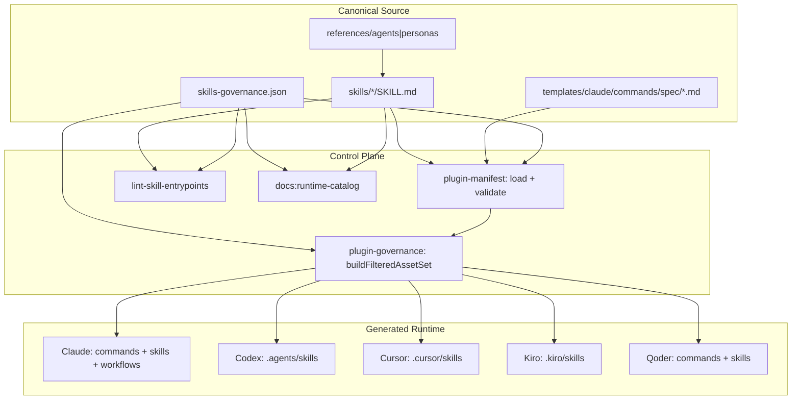
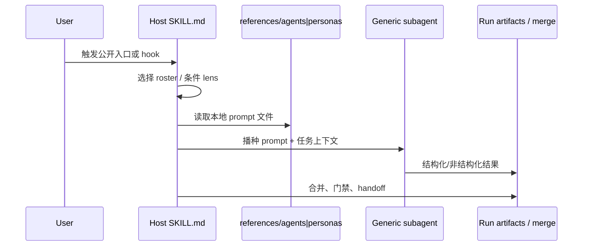
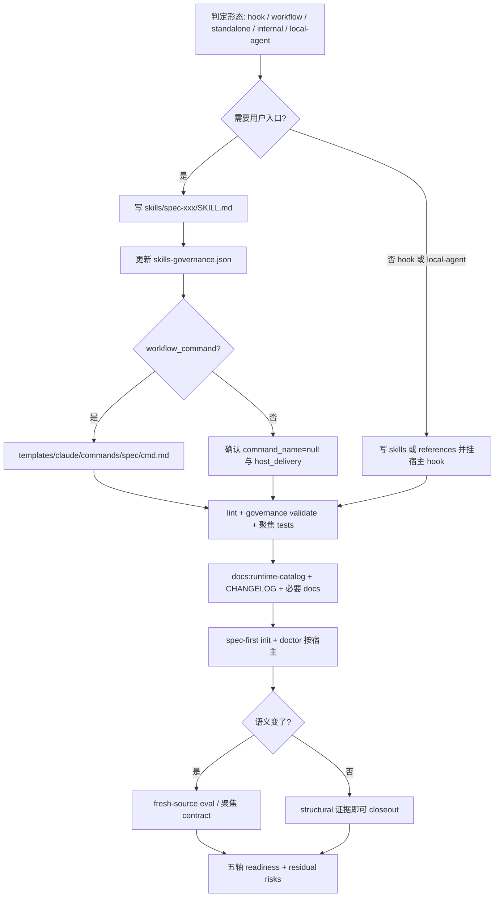

在 `spec-first` 中扩展能力，不是“再写一份提示词并复制进某个宿主目录”。公开入口、宿主投递、skill-local 角色提示与回归门禁构成同一条钢架：先判定能力形态与入口面，再落 `skills/` 源码与治理契约，最后用 lint、契约测试、`init` 投影与 catalog 再生闭合证据环。本页面向需要新增 workflow、standalone skill、internal helper 或 skill-local agent/persona 的高级维护者，说明当前仓库的真实接入规范、目录钢架与回归保护；用户侧入口清单见 [公开入口与 Skill 目录](5-ru-kou-lu-you-su-cha-an-ren-wu-xuan-ze-spec-gong-zuo-liu) 的平行投影，入口路由语义见 [using-spec-first 入口治理与场景路由](24-using-spec-first-ru-kou-zhi-li-yu-chang-jing-lu-you)。

## 核心原则：能力先模块化，入口后公开，runtime 只投影

新增能力时的推荐顺序始终是：**先判定角色 → 在 `skills/` 落 canonical source → 按需挂接宿主 workflow 或治理入口 → 仅在需要用户可见时公开**。用户可见入口统一写作 `spec-*`；宿主差异只改变生成路径与 discovery 形态，不改变公开命名。

| 层 | 位置 | 可否手改 | 职责 |
| --- | --- | --- | --- |
| Source of truth | `skills/**`、`templates/**`、`src/cli/contracts/**` | 是（源码） | 行为、入口元数据、治理记录 |
| Skill-local prompt | `skills/**/references/agents/**`、`skills/**/references/personas/**` | 是（源码） | 可委派角色提示；由调用 skill 控制 model/tier/dispatch |
| Governance | `src/cli/contracts/dual-host-governance/skills-governance.json` | 是（源码） | `entry_surface` / `host_delivery` / `command_name` |
| Generated catalog | `docs/catalog/runtime-capabilities.md` | 否 | 由 `npm run docs:runtime-catalog` 派生 |
| Generated runtime | `.claude/`、`.codex/`、`.agents/skills/`、`.cursor/`、`.kiro/`、`.qoder/` 等 | 否 | 由 `spec-first init` 投影 |

一句话：**source-first；不要围着 runtime mirror 做设计。** 顶层 `agents/` 已不再是 runtime source；catalog 当前记录 *Bundled source agents = 0*，角色能力收敛在 skill 目录内。

Sources: [AGENTS.md](AGENTS.md#L105-L147)、[runtime-capabilities.md](docs/catalog/runtime-capabilities.md#L1-L35)、[24-公开入口与Skill目录.md](docs/05-用户手册/24-公开入口与Skill目录.md#L1-L12)、[delivery-gates.md](skills/spec-write-skill/references/delivery-gates.md#L70-L80)

## 入口面钢架：三种 `entry_surface` 与五宿主投递

机器可读权威是 `skills-governance.json`。每条记录强制包含 `skill_name`、`entry_surface`、`command_name`、`host_scope`、`owner_host`、`host_delivery`（claude / codex / cursor / kiro / qoder）。`entry_surface` 只有三档：

| `entry_surface` | 含义 | `command_name` | 典型投递 |
| --- | --- | --- | --- |
| `workflow_command` | 公开主链路/旁路 workflow | 非空，且与 manifest command 一致 | Claude/Qoder: `command`；Codex/Cursor/Kiro: `skill` |
| `standalone_skill` | 可发现 skill，非 command-backed 主节点 | 必须 `null` | 各宿主 `skill`；禁止 `command` |
| `internal_only` | 源码治理 + 可选 agent-facing 内部 skill | 必须 `null` | 各宿主 `internal`/`none`；禁止用户可见 `command`/`skill` |

当前治理计数（catalog 同步）：**workflow_command 17、standalone_skill 11、internal_only 7**。其中大多数 `internal_only` 仅作治理记录；真正装入 runtime 的 agent-facing internal 目前只有 `spec-worktree`（由 `DELIVERED_INTERNAL_SKILLS` 白名单控制）。

`buildFilteredAssetSet(platform)` 按治理过滤后产出：`commands`、`workflowSkills`、`skills`、`internalSkills`、`agents`（顶层 agents 目录为空时为空列表）。`workflow_command` 且某宿主 `delivery=command` 时，必须存在对应 bundled command 定义；缺失会硬失败。



Sources: [skills-governance.schema.json](src/cli/contracts/dual-host-governance/skills-governance.schema.json#L36-L131)、[skills-governance.json](src/cli/contracts/dual-host-governance/skills-governance.json#L1-L100)、[plugin-manifest.js](src/cli/plugin-manifest.js#L34-L70)、[plugin-manifest.js](src/cli/plugin-manifest.js#L178-L320)、[plugin-governance.js](src/cli/plugin-governance.js#L13-L87)、[runtime-capabilities.md](docs/catalog/runtime-capabilities.md#L20-L100)

## 能力形态判定：先问“它是谁的能力”

在写文件之前完成判定，避免把 hook 型能力错误升格为新的 `spec-*`，或把可复用模块硬编码进单一宿主 workflow。

| 形态 | 适用信号 | 源码落点 | 是否改 governance | 是否要 command template |
| --- | --- | --- | --- | --- |
| **宿主 workflow 内部 hook** | 依附某阶段、条件触发、用户不单独调用 | 新 skill 或仅 references；宿主 `SKILL.md` 加触发段 | 通常否（若仅 references 则否） | 否 |
| **独立 workflow（`workflow_command`）** | 用户会主动调用、形成阶段边界 | `skills/spec-*/SKILL.md` + template | **必须** | Claude/Qoder 侧需要 `templates/claude/commands/spec/<command_name>.md`（或等价 SKILL frontmatter 回退） |
| **Standalone skill** | 意图驱动、非主链路节点 | `skills/spec-*/SKILL.md` | **必须**（`standalone_skill`） | 否 |
| **Internal helper** | 仅被 workflow 委托 | `skills/spec-*/SKILL.md` | **必须**（`internal_only`） | 否 |
| **Skill-local agent/persona** | 子角色、并行 lens、研究/审查 prompt | `skills/<host>/references/agents/*.md` 或 `.../personas/*.md` | 否（不单独注册入口） | 否 |

`spec-write-skill` 把“写 skill 包本身”也收成公开 workflow：create/revise、apply/validate-only、migrate/audit-remediation；并硬禁止手改 generated runtime mirror。项目内 authoring 的默认关闭条件包括：一次性问答、普通 code review/debug/plan/work、纯第三方安装、跨仓批量修改。

Sources: [SKILL.md](skills/spec-write-skill/SKILL.md#L1-L53)、[authoring-method.md](skills/spec-write-skill/references/authoring-method.md#L1-L50)、[2026-07-08-agent-to-skill-local-migration方案.md](docs/03-实施方案/2026-07-08-agent-to-skill-local-migration方案.md#L12-L80)、[24-公开入口与Skill目录.md](docs/05-用户手册/24-公开入口与Skill目录.md#L40-L90)

## Skill 源码钢架：`SKILL.md` + 条件 references + 确定性 scripts

### 目录与命名

- 目录名 kebab-case；面向用户的 workflow/standalone 优先 `spec-*`。
- Frontmatter `name:` 与目录名对齐是当前源码惯例（例如 `name: spec-plan`、`name: spec-write-skill`）。
- 可选子树：`references/`（条件加载的长规则与 prompt）、`scripts/`（确定性校验/工具）、`assets/`、`evals/`（维护者证据，非 runtime 必读）、少数 skill 下的 `agents/openai.yaml`（Codex target metadata，不是 portable 行为真相）。

### 信息架构（branch-first）

`spec-write-skill` 的 Authoring Method 要求：

1. **description 即触发合同**：recurring job + 真实用户动作 + 负向/近邻边界。
2. **先分支再放资源**：`SKILL.md` 只放各分支共用骨架与 hard boundary；长规则进 `references/` 并写清读取条件；可脚本化的进 `scripts/`。
3. **完成判据**：写/执行/委派步骤要有 done 信号、failure behavior 与降级。
4. **禁止 runtime-mirror-patch / project-profile-leak / fixture-as-behavior-proof** 等 anti-pattern 家族。

### 宿主 workflow 的 hook 段写法

若能力是内部 hook，在宿主 `SKILL.md` 中固定写清五件事：**何时触发、传什么上下文、输出影响哪一步、如何消费、失败如何降级**。守门型可阻断；分析型优先降级；外部调用型必须显式失败路径。

Sources: [authoring-method.md](skills/spec-write-skill/references/authoring-method.md#L60-L127)、[SKILL.md](skills/spec-plan/SKILL.md#L1-L20)、[SKILL.md](skills/spec-write-skill/SKILL.md#L14-L45)

## Agent 钢架：skill-local prompt，而不是全局 agent 入口

### 当前真实模型

- **不再**把顶层 `agents/` 当作用户可见 slash 清单或 runtime source；`listBundledAgents()` 在目录缺失时返回 `[]`。
- Prompt 资产放在**消费它的 skill 树内**：
  - 研究/策略/helper：`skills/<skill>/references/agents/*.md`
  - code-review 等 persona：`skills/<skill>/references/personas/*.md`
- Prompt 文件**不带 YAML frontmatter**；model tier、并发、输出 schema 由**调用方 skill** 拥有。
- Dispatch 协议是：**读取本地 prompt 文件 → 用宿主 generic subagent primitive 播种**（Claude 的 Agent/Task、Codex 的 `spawn_agent` 等）；**禁止**按独立 agent type/name 去 dispatch “全局注册角色”。

`spec-plan` 与 `spec-code-review` 都把这一点写进工作流正文：本地 research/reviewer 资产在 `references/agents` 或 `references/personas` 下；跨 skill 复用时**复制 prompt**，不跨 skill 相对路径引用。

### 新增 skill-local agent/persona 的接入步骤

1. 选定唯一宿主 skill（谁调度、谁定义输出合同、谁拥有降级）。
2. 在 `references/agents/` 或 `references/personas/` 新增 kebab-case `.md`（去掉多余 `spec-` 前缀）。
3. 只描述角色职责、失败模式、输出标准与边界；不写平台绝对路径。
4. 在宿主 `SKILL.md` 增加条件触发与 dispatch 说明（含 model tier、并行边界、schema/artifact 路径）。
5. 需要跨 skill 复用时复制文件，并在两处各自维护读取时机。
6. 用 fresh-source eval 或 contract test 验证：不要依赖“当前会话已缓存的 skill 定义”。



Sources: [2026-07-08-agent-to-skill-local-migration方案.md](docs/03-实施方案/2026-07-08-agent-to-skill-local-migration方案.md#L55-L80)、[SKILL.md](skills/spec-plan/SKILL.md#L293-L320)、[SKILL.md](skills/spec-code-review/SKILL.md#L112-L132)、[SKILL.md](skills/spec-code-review/SKILL.md#L498-L515)、[plugin-manifest.js](src/cli/plugin-manifest.js#L396-L413)、[AGENTS.md](AGENTS.md#L184-L210)、[24-公开入口与Skill目录.md](docs/05-用户手册/24-公开入口与Skill目录.md#L120-L134)

## 公开 workflow 接入清单（`workflow_command`）

新增用户可见主入口（例如假想的 `spec-triage`）时，至少同步下列 source 面——**缺一不可**，且顺序建议如下。

1. **创建** `skills/spec-triage/SKILL.md`  
   - frontmatter：`name`、`description`（触发合同）、可选 `argument-hint`  
   - 正文：边界、阶段、产物、失败模式、与近邻 workflow 的 handoff
2. **注册治理** `skills-governance.json`  
   - `entry_surface: "workflow_command"`  
   - `command_name: "triage"`（与 template 文件名 stem 一致）  
   - `host_scope: "dual_host"`，`owner_host: null`  
   - `host_delivery` 对齐现有公开 workflow 模式：`claude/qoder=command`，`codex/cursor/kiro=skill`
3. **Command 元数据模板** `templates/claude/commands/spec/triage.md`  
   - 仅 frontmatter + 指向 skill 的说明；`init` 时把 template frontmatter 与 `skills/spec-triage/SKILL.md` body 合成 Claude runtime command  
   - 模板缺失时，manifest 允许回退读取 skill frontmatter 的 description/`argument-hint`，但**不能**用回退逃避“workflow 必须有 command 元数据”的治理一致性
4. **入口 lint 与路由面**  
   - 用户可见文案统一 `spec-*`，禁止旧 slash 别名与 “Codex entry point: `/spec:`” 类遗留写法  
   - standalone 不得被描述成 command entrypoint（lint 会从 governance 动态拼规则）
5. **Catalog / 文档 / CHANGELOG**  
   - `npm run docs:runtime-catalog`  
   - 用户可见定位变化同步 README / 用户手册入口页  
   - 任意 source 变更更新 `CHANGELOG.md`
6. **回归**（见下节）后 `spec-first init` 再验证真实宿主 discovery

`plugin-manifest` 在加载时会校验：governance 引用的 skill 必须存在于 `skills/`；`workflow_command` 必须在 manifest commands 中有对应项且 `command_name` 一致；非 workflow 不得带 manifest command；`standalone_skill` 不得 `host_delivery.*.command`；`internal_only` 不得用户可见 delivery。

Sources: [plugin-manifest.js](src/cli/plugin-manifest.js#L34-L99)、[plugin-manifest.js](src/cli/plugin-manifest.js#L238-L320)、[plan.md](templates/claude/commands/spec/plan.md#L1-L12)、[skills-governance.json](src/cli/contracts/dual-host-governance/skills-governance.json#L70-L100)、[lint-skill-entrypoints.js](scripts/lint-skill-entrypoints.js#L26-L70)、[delivery-gates.md](skills/spec-write-skill/references/delivery-gates.md#L70-L80)

## Standalone 与 Internal 的差异化接入

| 检查项 | standalone_skill | internal_only |
| --- | --- | --- |
| 用户是否应主动调用 | 是（意图驱动） | 否；由 workflow 委托 |
| governance `command_name` | `null` | `null` |
| Claude delivery | `skill` | `internal`（默认不装入用户 skill 集） |
| 文案约束 | 描述为 skill，禁止写成 `/spec-foo` command | 用户手册不鼓励直接调用 |
| 额外白名单 | 无 | 若需装入 runtime，加入 `DELIVERED_INTERNAL_SKILLS` 并有消费方证据 |
| lint | standalone slash/`$` 入口被拦截 | 不作为公开入口扫描目标的“命令化”叙述 |

Sources: [plugin-governance.js](src/cli/plugin-governance.js#L13-L75)、[runtime-capabilities.md](docs/catalog/runtime-capabilities.md#L80-L100)、[24-公开入口与Skill目录.md](docs/05-用户手册/24-公开入口与Skill目录.md#L100-L120)、[lint-skill-entrypoints.config.json](scripts/lint-skill-entrypoints.config.json#L1-L32)

## 回归保护：确定性门禁 + 语义证据分层

### 1. 入口与治理机械门禁

| 命令 / 机制 | 保护什么 |
| --- | --- |
| `npm run lint:skill-entrypoints` | 扫描 `skills/**`、`CLAUDE.md`、`AGENTS.md`：禁止 heading 以 `/` 作入口、遗留 host-specific 入口文案、legacy slash 别名；并对 governance 中的 standalone 动态禁止 command 化描述 |
| `loadSkillsGovernance` + `validateSkillsGovernance` | schemaVersion、skill 存在性、entry_surface 与 host_delivery 一致性、command 对齐 |
| `npm run docs:runtime-catalog` | 从 governance + skills 再生只读 catalog，避免人工第二真相源 |
| `npm run typecheck` / `npm test` 分层 | CLI 语法与 unit/smoke/integration；新增公开入口通常要动数量断言与路径存在性断言 |

### 2. Package 结构门禁（authoring 路径）

对 skill package 本身，优先使用 bundled：

```bash
node "$SKILL_DIR/scripts/validate-skill.cjs" <skill-dir> --json
```

结果语义：`pass` 仅表示机械结构未发现阻断项；`fail` 机械无效；`incomplete` 输入不可读/超预算。**pass ≠ 语义正确**。不得因目标目录存在同名 validate 脚本就执行未知代码。

### 3. 语义与行为证据（不可用 fixture 冒充）

| 证据类型 | 含义 | 何时需要 |
| --- | --- | --- |
| `structural-only` | fixture/schema/contract | 治理、路径、frontmatter 消费 |
| `fresh-semantic` | 把磁盘上最新 skill/prompt 注入全新 generic subagent | description/route 或 persona 行为变化 |
| `comparative` | 与固定 baseline 对照 | 回归行为漂移 |
| `field-outcome` | 真实任务结果 | 可分发前的充分性 |
| `not_run` + 原因 | 宿主无 dispatch / 用户禁用 helper | **必须诚实记录，不得声称通过** |

AGENTS.md 强调：skill/agent prose 变更不能依赖当前会话缓存的 skill 调用；fresh-source eval checklist 在 `docs/contracts/workflows/fresh-source-eval-checklist.md`。

### 4. Runtime 投影与宿主验证

```bash
# 源码侧
npm run lint:skill-entrypoints
npm run test:unit   # 或更窄的 jest path
npm run docs:runtime-catalog

# 投影（按目标宿主）
spec-first clean --claude   # 或 --codex / 其他
spec-first init --claude
spec-first doctor --claude
```

验证点：

- workflow 是否出现在目标宿主约定路径（Claude：` .claude/commands/spec-*.md` + workflow mirrors；Codex：`.agents/skills/<skill>/`）
- standalone 是否作为 skill 可发现，而非错误 command
- 未手改 `.claude/`、`.agents/skills/` 等 mirror
- 发布前 `npm run build`（`npm pack --dry-run`）确认新 skill 进入包内容

### 5. Closeout 五轴（spec-write-skill 项目路径）

对 authoring/迁移类变更，分别报告而非合成总分：`portable` / `target` / `project` / `semantic` / `mutation`，每轴 `ready|degraded|not-ready|not-applicable` 并附直接证据。

Sources: [lint-skill-entrypoints.js](scripts/lint-skill-entrypoints.js#L1-L70)、[lint-skill-entrypoints.js](scripts/lint-skill-entrypoints.js#L180-L210)、[package.json](package.json#L16-L32)、[delivery-gates.md](skills/spec-write-skill/references/delivery-gates.md#L1-L89)、[AGENTS.md](AGENTS.md#L148-L210)、[runtime-capabilities.md](docs/catalog/runtime-capabilities.md#L100-L170)

## 端到端接入流程（可执行）



### 提交前自查清单

- [ ] 只改了 `skills/`、`templates/`、`src/cli/contracts/`、tests、docs 等 source；没有手改 runtime mirror  
- [ ] 形态判定正确：不是每个能力都升格为 `spec-*`  
- [ ] 新 skill 的 `name`/目录/kebab-case 一致；description 含正负触发边界  
- [ ] skill-local agent/persona 在消费 skill 树内；dispatch 为 generic subagent + 本地文件  
- [ ] 公开入口已更新 governance，且 `entry_surface`/`host_delivery`/`command_name` 通过校验  
- [ ] workflow 具备 command template 元数据（或明确依赖 skill frontmatter 回退并已验证）  
- [ ] `npm run lint:skill-entrypoints` 通过  
- [ ] 聚焦 unit/smoke/integration 与（如适用）`docs:runtime-catalog` 已跑  
- [ ] 目标宿主 `init`/`doctor` 与真实入口 discovery 已验证  
- [ ] `CHANGELOG.md` 与用户可见 docs 已同步  

Sources: [AGENTS.md](AGENTS.md#L160-L230)、[delivery-gates.md](skills/spec-write-skill/references/delivery-gates.md#L70-L89)、[plugin-manifest.js](src/cli/plugin-manifest.js#L238-L280)

## 常见失败模式（源码可验证）

| 失败 | 机制后果 | 正确修复 |
| --- | --- | --- |
| 只加 `skills/` 不加 governance | 治理与 filtered asset 不一致；公开入口不可控 | 同步 `skills-governance.json` |
| `workflow_command` 无 command 元数据 | `buildFilteredAssetSet('claude')` 在 delivery=command 时抛错 | 补 template 或对齐 `command_name` |
| standalone 写成 `/spec-foo` 命令 | `lint-skill-entrypoints` error | 改作文案为 skill 触发，非 slash command |
| 手改 `.agents/skills` 或 `.claude` | 下次 `init` 覆盖；漂移不可审计 | 改 source 后 `init` |
| 全局 agent 名 dispatch | 与 skill-local 模型冲突；跨宿主路径不同 | 读 `references/...` + generic subagent |
| 结构 fixture 通过即宣称行为改善 | 证据类型撒谎 | 补 fresh-semantic 或标记 `not_run` |
| 把内部 helper 当用户主入口 | 入口面污染 | `internal_only` + 由宿主 workflow 委托 |

Sources: [plugin-governance.js](src/cli/plugin-governance.js#L31-L40)、[lint-skill-entrypoints.js](scripts/lint-skill-entrypoints.js#L43-L50)、[authoring-method.md](skills/spec-write-skill/references/authoring-method.md#L110-L127)、[AGENTS.md](AGENTS.md#L124-L147)

## 与相邻文档的边界

- 本页只覆盖 **如何把 Skill/Agent 能力接入钢架并回归**；不展开各主链路 workflow 的业务阶段细节（见 [需求澄清](13-xu-qiu-cheng-qing-ideate-brainstorm-yu-product-contract)、[spec-prd](14-zong-di-prd-spec-prd-de-grill-write-yu-readiness-bi-huan)、[spec-plan](15-shi-xian-gui-hua-spec-plan-ru-he-ba-what-chong-shi-wei-how) 等）。  
- Source/runtime 分离的一般原则见 [Source of Truth 与 Generated Runtime 分离原则](12-source-of-truth-yu-generated-runtime-fen-chi-yuan-ze)；多宿主投影细节见 [多宿主 Runtime 投影与 pointer 文件治理](20-duo-su-zhu-runtime-tou-ying-yu-pointer-wen-jian-zhi-li)。  
- 契约、hooks 与 eval 总览见 [工作流契约与质量门禁](23-gong-zuo-liu-qi-yue-yu-zhi-liang-men-jin-contracts-hooks-yu-eval)。  
- 旁路工作流（debug/optimize/app audit）本身是已接入的 skill，扩展方式仍遵循本页钢架，行为细节见 [调试、优化与旁路工作流](26-diao-shi-you-hua-yu-pang-lu-gong-zuo-liu-debug-optimize-yu-app-audit)。

**维护者操作入口**：项目内创建/修改/校验 skill 包，优先走公开 workflow `spec-write-skill`（`entry_surface: workflow_command`，command `write-skill`），它强制 source owner、preview、bundled validator 与五轴 closeout，而不是临时改 mirror。