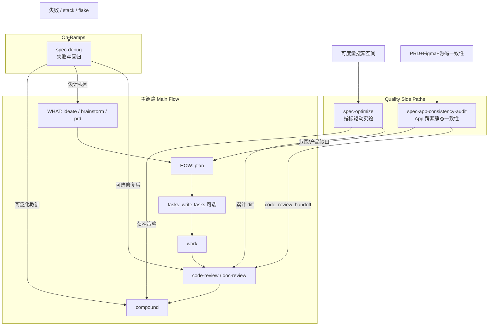
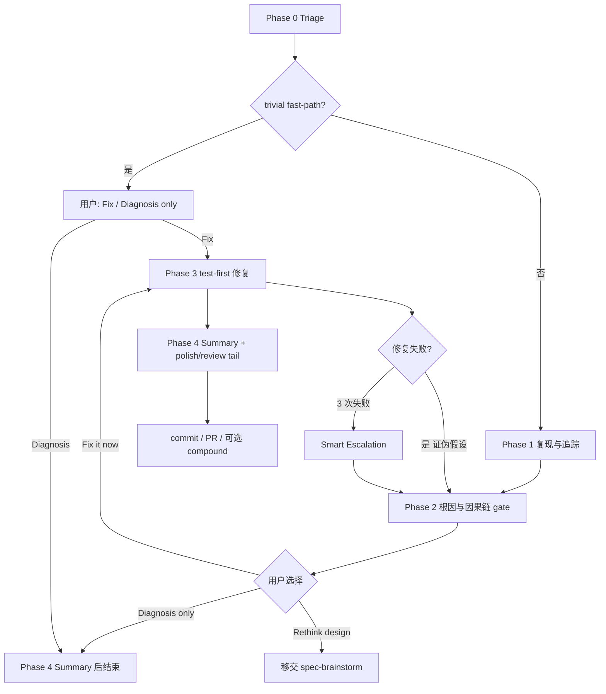
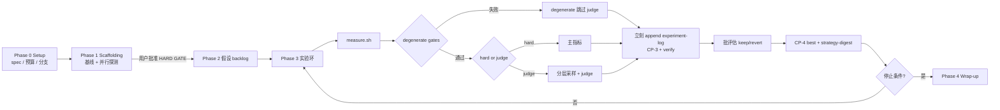
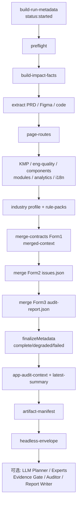
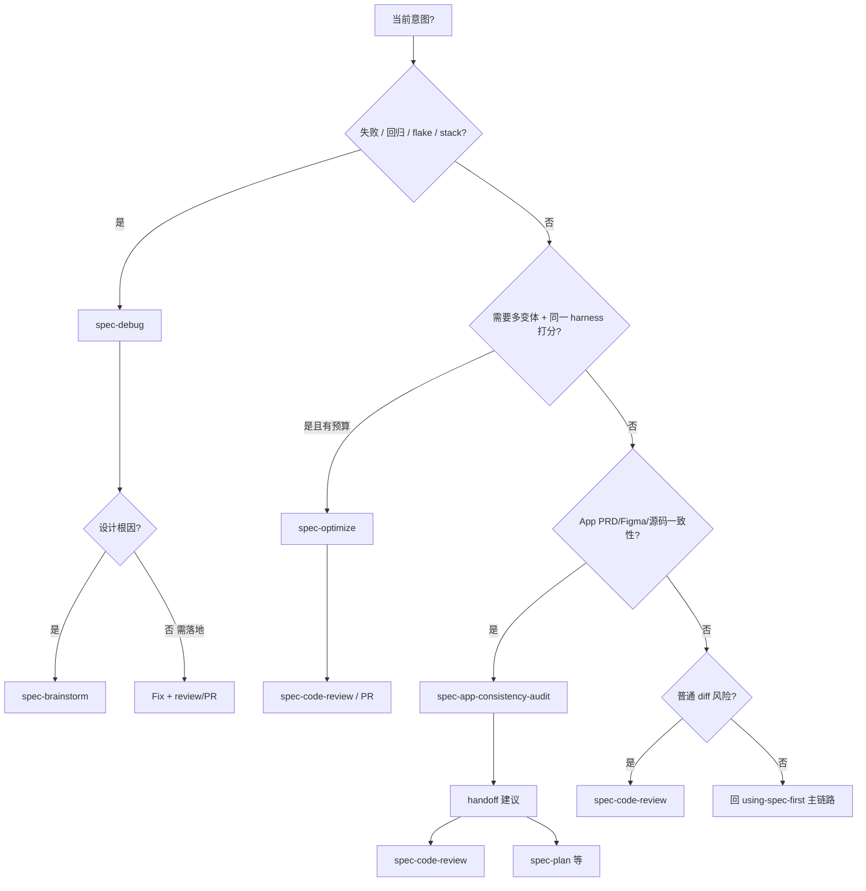

主链路（`ideate/brainstorm/prd → plan → write-tasks → work → code-review → compound`）解决的是「从意图到可治理变更」；真正打断节奏的往往是三类旁路问题：**行为失败**、**可度量质量搜索**、**App 跨源一致性**。本页只说明这三条公开旁路入口——`spec-debug`、`spec-optimize`、`spec-app-consistency-audit`——它们各自的触发边界、阶段门禁、产物契约，以及如何与主链路安全交接，而不替代审查、PRD 或实现工作流。

Sources: [SKILL.md](skills/using-spec-first/SKILL.md#L12-L55)、[workflow-skill-agent-map.md](docs/workflow-skill-agent-map.md#L1-L45)

## 旁路在 Flow Map 中的位置

`using-spec-first` 把入口分成 **Main Flow**、**On-Ramps**、**Quality And Delivery Side Paths** 与 **Standalone Skills**。旁路不是“可选捷径替代主链路”，而是**在异常或专项意图上切入、做完即让出控制权**的入口：

| 类别 | 入口 | 语义 |
|------|------|------|
| On-Ramp | `spec-debug` | 失败、异常行为、测试失败、stack trace、回归、flake |
| Quality Side Path | `spec-optimize` | 可重复测量的实验式优化 |
| Quality Side Path | `spec-app-consistency-audit` | 移动 App 的 PRD / Figma / 源码一致性（静态优先） |

外部 issue/PR 文本**不是已确认事实**：若即时意图是失败，路由到 `spec-debug`；若是 diff 风险，路由到 `spec-code-review`；App 跨源一致性则走 app audit，而不是用 review 或 PRD 冒充。

Sources: [SKILL.md](skills/using-spec-first/SKILL.md#L28-L51)、[workflow-skill-agent-map.md](docs/workflow-skill-agent-map.md#L36-L45)



上图强调三点：**旁路可切入主链路任意阶段**；**不自动串联 plan→work→review**；**交接字段/产物必须可追溯**，而不是会话里的口头结论。

Sources: [SKILL.md](skills/using-spec-first/SKILL.md#L12-L27)、[SKILL.md](skills/spec-debug/SKILL.md#L230-L309)、[SKILL.md](skills/spec-optimize/SKILL.md#L684-L732)、[SKILL.md](skills/spec-app-consistency-audit/SKILL.md#L260-L268)

## 三者对照：问题形状决定入口

在动手前，先用「问题形状」做一次硬路由，避免把 debug 当 shotgun 改代码、把 optimize 当普通实现、把 app audit 当 runtime QA。

| 维度 | `spec-debug` | `spec-optimize` | `spec-app-consistency-audit` |
|------|--------------|-----------------|------------------------------|
| 核心问题 | 为什么坏了？根因是什么？ | 在预算内哪条变体更好？ | 产品/设计/源码是否一致？ |
| 输入 | issue、stack、失败测试、行为描述 | optimize spec YAML 或可度量目标 | mode tokens + base/source/prd/figma… |
| 是否默认改产品代码 | 仅用户选择 “Fix it now” 后 | 是（在 `scope.mutable` 内实验） | **否**（只读；writeback 仅 preview） |
| 关键门禁 | **Causal chain gate** | **Admission & baseline 用户批准** | **No evidence, no issue** + Evidence Gate |
| 状态落盘 | Debug Summary（对话/移交）；可选 residual 文件 | `.spec-first/workflows/spec-optimize/<spec-name>/` | `.spec-first/app-audit/runs/<run-id>/` |
| 下游 | simplify / code-review / commit-push-pr / compound / brainstorm | code-review / compound / PR / 继续实验 | code-review、移动 QA、实现 owner、report-writer |
| 明确不做 | 计划内 feature、setup drift、无 bug 的增强 | 无度量的“感觉更好”、无预算无限跑 | 普通 diff review、PRD 写作、模拟器/真机执行、UI polish |

Sources: [SKILL.md](skills/spec-debug/SKILL.md#L1-L28)、[SKILL.md](skills/spec-optimize/SKILL.md#L11-L41)、[SKILL.md](skills/spec-app-consistency-audit/SKILL.md#L11-L78)、[README.md](skills/spec-optimize/README.md#L5-L24)、[README.md](skills/spec-app-consistency-audit/README.md#L9-L22)

## `spec-debug`：先因果链，后修复

### 定位与原则

`spec-debug` 是公开 debug workflow：系统性排查 bug 根因，并**可选**以 test-first 方式修复。它服务失败测试、运行时报错、回归、issue tracker 工单，以及“已经修了几次仍卡住”的调查，而不是普通 feature 实现或 runtime setup 修复。

Sources: [SKILL.md](skills/spec-debug/SKILL.md#L1-L18)、[workflow-skill-agent-map.md](docs/workflow-skill-agent-map.md#L36-L37)、[2026-06-28-spec-debug-execution-logic-analysis.md](docs/02-架构设计/2026-06-28-spec-debug-execution-logic-analysis.md#L10-L41)

四条原则贯穿全程，压力越大越容易被跳过，因此 skill 会在各 phase 重复强调：

1. **先调查再修复**——完整因果链未闭合前不提方案；“不知为何 X 导致 Y”就是 gap。  
2. **不确定环节要有可证伪预测**——预测错而修“看起来好了”，说明抓到的是症状。  
3. **一次只改一件事**——多改并试是 shotgun debugging。  
4. **卡住时诊断“为何卡住”**，而不是硬撑第 N 次同构尝试。

Sources: [SKILL.md](skills/spec-debug/SKILL.md#L13-L18)、[anti-patterns.md](skills/spec-debug/references/anti-patterns.md#L1-L76)

### 五阶段执行流

| Phase | 名称 | 作用 |
|-------|------|------|
| 0 | Triage | 解析输入；拉取 issue 全文与评论；trivial 快路径判断 |
| 1 | Investigate | 复现、环境健全性、反向追踪、tracker/PR 历史 |
| 2 | Root Cause | 假设 + 预测、**causal chain gate**、smart escalation、用户三选一 |
| 3 | Fix | 仅用户选择修复后；分支安全 + test-first + 失败则证伪假设 |
| 4 | Handoff | Debug Summary；post-fix simplify/review tail；commit/PR；可选 compound |

除 Phase 0 的 trivial-bug fast-path 外**不允许跳阶段**；复杂 bug 只是在各阶段自然停留更久，而不是另开一套复杂度等级。

Sources: [SKILL.md](skills/spec-debug/SKILL.md#L20-L30)、[SKILL.md](skills/spec-debug/SKILL.md#L34-L55)



Sources: [SKILL.md](skills/spec-debug/SKILL.md#L45-L55)、[SKILL.md](skills/spec-debug/SKILL.md#L158-L188)、[SKILL.md](skills/spec-debug/SKILL.md#L193-L228)

### Phase 0–1：从输入到可观察失败

**Triage** 优先把 issue tracker 线程读全（尤其最新评论里的更新复现步骤与失败尝试），再落到明确问题陈述。默认**先调查不问问题**；仅当用户明确表示“一直在试/卡住”时，先问已试路径，避免重复失败。

**Trivial-bug fast-path** 只节省调查仪式：单文件 typo、缺 import、明显空指针/off-by-one 且无需深追踪时，仍须经过 **Fix / Diagnosis only** 用户选择，并在修复前做 workspace/branch 检查——fast-path 不能剥夺用户对是否改代码的控制。

**Investigate** 要求先复现再深读：浏览器优先 `agent-browser`；2–3 次无法复现则加载间歇故障技术；写复现测试前通过 `repo-profile-cache.py` 读取 `conventions.testing`，避免与仓库测试风格脱节。环境健全性（分支、依赖、runtime 版本、env、陈旧构建产物、本地依赖服务）在深追踪前完成，降低假线索。

Sources: [SKILL.md](skills/spec-debug/SKILL.md#L34-L80)、[investigation-techniques.md](skills/spec-debug/references/investigation-techniques.md#L1-L100)

代码路径追踪是**从症状反向**到“有效状态首次变坏”的位置：读 stack 自底向上，在边界上用观测值（log/断点/断言）而不是纯理论；必要时查 `git log`/`git bisect`、错误追踪与应用日志。根因在**坏状态起源**，不在首次观察到错误的函数。

Sources: [SKILL.md](skills/spec-debug/SKILL.md#L82-L120)、[investigation-techniques.md](skills/spec-debug/references/investigation-techniques.md#L7-L36)

### Phase 2：因果链门禁与 Smart Escalation

进入 Phase 2 前应阅读 anti-patterns，拦截“先改再查”“这应该能行”“再试一次”等 mode-drift。每个假设需要：位置（file:line）、**至少一条具体观察**、逐步因果链，以及对不确定环节的**跨路径预测**。明显因果链（缺 import、明确类型错误）可用链解释本身作 gate，预测不是仪式。

**Causal chain gate**：在能无 gap 解释「触发器 → 每一步 → 症状」之前，**不得进入 Phase 3**（用户可显式授权用当前最佳假设继续）。呈现根因后，用宿主阻塞式提问给出：

1. **Fix it now** → Phase 3  
2. **Diagnosis only** → 仅 Summary  
3. **Rethink the design**（`spec-brainstorm`）——仅当根因是错误职责/接口、需求本身错误，或任何修复都只是 workaround  

2–3 个假设耗尽后做 Smart Escalation（子系统散落、证据自相矛盾、本地/CI 分叉、修了但预测错），而不是盲目堆第 4 个同构假设。独立子系统可并行只读 sub-agent 取证；并行是延迟优化，不是正确性前提。

Sources: [SKILL.md](skills/spec-debug/SKILL.md#L136-L188)、[anti-patterns.md](skills/spec-debug/references/anti-patterns.md#L79-L92)

### Phase 3–4：可选修复与移交

Phase 3 在编辑前检查未提交改动与默认分支；**test-first**：选对回归归属 → 确认因正确原因失败 → 最小修复 → 通过 → 更广回归 → 自审 diff。失败修复必须**显式证伪**当前假设再回 Phase 2；**3 次失败 = Smart Escalation**。条件触发时应用 defense-in-depth 四层（入口校验 / 不变量 / 环境守卫 / 诊断面包屑），或做 post-mortem 模式分析。

Sources: [SKILL.md](skills/spec-debug/SKILL.md#L193-L228)、[defense-in-depth.md](skills/spec-debug/references/defense-in-depth.md#L1-L35)

Phase 4 **始终先写**结构化 Debug Summary（Problem / Root Cause / Recommended Tests / Fix / Prevention / Confidence）。若跑过修复：按上下文覆盖项决定是否 simplify（默认非机械且 ≥30 行等条件）与 `spec-code-review`；skill 自建分支默认可 commit-and-PR，预存分支则询问 PR/commit/stop；可泛化教训才中性或倾向提议 `spec-compound`，机械修复默认静默跳过。

Sources: [SKILL.md](skills/spec-debug/SKILL.md#L230-L309)

## `spec-optimize`：预算内的指标驱动搜索

### 定位与准入

`spec-optimize` 面向「可以多变体、同一 harness 打分、保留赢家」的硬工程问题（聚类质量、检索相关性、构建时延、prompt 质量等），灵感来自 Karpathy autoresearch，但泛化到多文件与非 ML 域。它**不是**普通实现、无度量的“优化一下”、无反馈环的 debug，或无上限并发/花费的替代品。

Sources: [SKILL.md](skills/spec-optimize/SKILL.md#L1-L21)、[usage-guide.md](skills/spec-optimize/references/usage-guide.md#L1-L44)、[README.md](skills/spec-optimize/README.md#L1-L24)

**Admission And Budget Gate** 在 Phase 1 之前强制具备：

- 可重复主指标（`metric.primary.type/name/direction`）  
- 至少一个廉价 **degenerate gate**（先拒坏变体）  
- 测量命令或在派发实验前可落地的 harness 计划  
- 显式 `scope.mutable` / `scope.immutable`  
- 停止预算：`max_iterations` / `max_hours` / `plateau_iterations`  
- 执行预算：`execution.mode` / `max_concurrent`  
- judge 模式的有限 `max_total_cost_usd`（除非用户明确批准无上限）  

缺任一项则停，帮助写安全 spec 或改走 plan/work/debug。首次运行默认 `serial`、`max_concurrent: 1`、`max_iterations: 4`、`max_hours: 1`、`plateau_iterations: 3`、`max_runner_up_merges_per_batch: 0`。

Sources: [SKILL.md](skills/spec-optimize/SKILL.md#L87-L110)、[example-hard-spec.yaml](skills/spec-optimize/references/example-hard-spec.yaml#L1-L65)

### Hard vs Judge 与三层评分

| 类型 | 何时 | 例 |
|------|------|-----|
| `type: hard` | 标量、方向清晰、无需语义判断 | 构建秒数、时延、内存、通过率 |
| `type: judge` | 代理指标可被博弈，需语义质量 | 聚类/检索/摘要/prompt 质量 |

推荐三层：**degenerate gates**（硬、便宜）→ **LLM-as-judge 主优化目标** → **diagnostics**（只记录不门禁）。硬指标说“覆盖率升了”，judge 仍可说“塌成一个垃圾大簇”。

Sources: [SKILL.md](skills/spec-optimize/SKILL.md#L200-L230)、[usage-guide.md](skills/spec-optimize/references/usage-guide.md#L48-L128)、[example-judge-spec.yaml](skills/spec-optimize/references/example-judge-spec.yaml#L1-L50)

### 持久化纪律与阶段

**会话不是持久存储**。所有关键状态写在 gitignored 的本地 scratch：

`.spec-first/workflows/spec-optimize/<spec-name>/`

| 文件 | 作用 |
|------|------|
| `spec.yaml` | 运行期不可变 spec（CP-0） |
| `experiment-log.yaml` | 基线、假设 backlog、每次实验、best（CP-1…5） |
| `strategy-digest.md` | 每批后压缩学习，供下一轮假设 |
| `<worktree>/result.yaml` | 测量后立刻写下的崩溃恢复标记 |

规则核心：**measure → write → verify → 再展示用户**；Phase 3 对实验日志 append-only；阶段边界与决策前**从磁盘重读**。

Sources: [SKILL.md](skills/spec-optimize/SKILL.md#L119-L176)



Phase 1 是 **HARD GATE**：clean-tree、harness 校验、基线（可 repeat 聚合）、`parallel-probe.sh`、worktree 预算、CP-1 写盘后，**用户必须显式批准**才进 Phase 2。Phase 3 用 `experiment-worktree.sh` 隔离变体，serial 强制 batch_size=1；赢家 merge 到 `optimize/<spec-name>`，可选 file-disjoint runner-up cherry-pick 后再测。停止条件含目标达成、迭代/小时上限、judge 预算、平台期、空 backlog、用户中断。

Sources: [SKILL.md](skills/spec-optimize/SKILL.md#L309-L430)、[SKILL.md](skills/spec-optimize/SKILL.md#L498-L680)、[SKILL.md](skills/spec-optimize/SKILL.md#L684-L745)

Wrap-up 可继续：对累计 diff 跑 `spec-code-review`（机械可应用 finding 有明确 bar）、`spec-compound` 固化获胜策略、从优化分支开 PR、或再进 Phase 3。实验日志默认保留供本机 resume；`strategy-digest.md` 可清理，但日志勿轻易删。

Sources: [SKILL.md](skills/spec-optimize/SKILL.md#L720-L745)

### 与 debug 的边界

| 信号 | 走 debug | 走 optimize |
|------|----------|-------------|
| 单一失败路径、需因果解释 | ✓ | |
| 搜索空间大、需多变体打分 | | ✓ |
| 无 harness / 无预算 | 或先建反馈环 | 停：Admission 失败 |
| “修 bug 顺手调参” | 先闭合根因 | 根因确认后另开有边界的 optimize |

Sources: [SKILL.md](skills/spec-optimize/SKILL.md#L17-L21)、[usage-guide.md](skills/spec-optimize/references/usage-guide.md#L33-L44)、[SKILL.md](skills/spec-debug/SKILL.md#L13-L18)

## `spec-app-consistency-audit`：静态优先的 App 跨源审计

### 定位与非目标

`spec-app-consistency-audit` 在模拟器、真机、打包或设备自动化**之前**，对移动 App 的 PRD、Figma 本地上下文、源码、页面路由、KMP/Clean Architecture、组件复用、analytics、i18n、工程质量与行业 lens 做**静态一致性**审查。它提升后续 review/QA 的输入质量，**不替代** runtime 验证、自动化测试或真机验收。

Sources: [SKILL.md](skills/spec-app-consistency-audit/SKILL.md#L1-L48)、[README.md](skills/spec-app-consistency-audit/README.md#L1-L22)

**不要**用它做：普通 diff code review（`spec-code-review`）、PRD 写作/就绪（`spec-prd`）、纯 lint/test/build/模拟器、UI polish（`spec-polish`）、或直接改产品代码/标准。默认 `static_only`，除非用户显式要求后续 runtime 工作流。

Sources: [SKILL.md](skills/spec-app-consistency-audit/SKILL.md#L56-L86)

### Mode 契约与 Runner 边界

v1 确定性编排器 `scripts/run-audit.js` **仅接受 `mode:headless`**，且强制 `base:<git-ref>`；缺 base → `scope_headless_missing_base`。`mode:default` / `mode:report-only` 是长期语义 token，不等于当前 runner 已完整编排。

| Token | 语义要点 |
|-------|----------|
| `mode:headless` | 不问用户；写 run-scoped artifacts；紧凑 envelope |
| `mode:report-only` | 严格不写盘；当前 runner 报 unsupported |
| `source:` / `prd:` / `figma-context:` | 仓库相对路径输入 |
| `figma-ref:` | 仅引用；headless 不远程抓取 → `input_figma_reference_only` |
| `industry:` | 显式 lens，不是已确认行业档案 |
| `from:code-review` | 调用方标记；不切换 checkout |
| `depth:deep` | 加深标志，非互斥 mode |

**全 mode 对产品源码、generated runtime、durable standards、`repo-profile.yaml` 只读。**

Sources: [SKILL.md](skills/spec-app-consistency-audit/SKILL.md#L88-L101)、[mode-output-contract.md](skills/spec-app-consistency-audit/references/mode-output-contract.md#L11-L51)、[run-audit.js](skills/spec-app-consistency-audit/scripts/run-audit.js#L48-L76)

Runner 是 **subprocess 编排器**：不发明 issue、不调 LLM、不远程拉 Figma/PRD。LLM 语义问题须由调用方落入 `input/raw-issues.json`（或 `--raw-issues`）并声明 `issue_synthesis_status`（`not_run` / `llm_provided` / `fixture_provided`）。未提供 raw issues 时 runner 自动 stub 空 issues，envelope 显示 *Awaiting LLM audit*。

Sources: [headless-runner.md](skills/spec-app-consistency-audit/references/headless-runner.md#L44-L88)、[README.md](skills/spec-app-consistency-audit/README.md#L48-L50)

### 产物脊柱与 16 步确定性管线

产物目录：

```text
.spec-first/app-audit/runs/<run-id>/
```

核心脊柱：`metadata.json`、`preflight.json`、`impact-facts.json`、contracts/*、`merged-context.json`、`issues.json`、`audit-report.json`、`app-audit-context.json`、`artifact-manifest.json`、`headless-envelope.txt`；`latest-summary.json` 只是指针，消费前必须用 `metadata.json` 校验 `head_sha` / `diff_hash` 等。禁止向遗留扁平 `.spec-first/app-audit/` 写新产物。

Sources: [SKILL.md](skills/spec-app-consistency-audit/SKILL.md#L102-L113)、[mode-output-contract.md](skills/spec-app-consistency-audit/references/mode-output-contract.md#L66-L95)、[headless-runner.md](skills/spec-app-consistency-audit/references/headless-runner.md#L12-L26)



脚本层产出**候选事实**；语义判断（选专家、severity、impact、recommendation）在 prompts 专家链：Audit Planner → 选中专家 → deterministic Evidence Gate → LLM Evidence Auditor → Report Writer。Orchestrator 协议再次钉死：**只读、No evidence no issue、不启 runtime、不给最终 verdict**。

Sources: [headless-runner.md](skills/spec-app-consistency-audit/references/headless-runner.md#L60-L88)、[SKILL.md](skills/spec-app-consistency-audit/SKILL.md#L150-L170)、[orchestrator.md](skills/spec-app-consistency-audit/prompts/orchestrator.md#L1-L49)

### 证据与 Issue 协议

**No evidence, no issue。** 确认问题必须引用项目特异证据（PRD/Figma/code/route/architecture/analytics/i18n/contract）；rule pack 只能解释风险，**不能**单独支撑 confirmed。Confirmed 要求 `confidence >= 0.75`、`static_confirmed: true`、可追溯 provenance/evidence，以及 claim_family 要求的字段；弱证据只能 risk/candidate/follow-up。交给 `spec-code-review` 的 issue 需要 `code_review_handoff`；app-audit **不**发 `safe_auto`。

Sources: [SKILL.md](skills/spec-app-consistency-audit/SKILL.md#L200-L213)、[mode-output-contract.md](skills/spec-app-consistency-audit/references/mode-output-contract.md#L156-L198)

Writeback 默认 **preview-only**（`writeback-preview/repo-profile.patch.yaml`、`suggested-standards.md`），不修改 durable standards，除非用户另开 apply 步骤。Figma 默认 `--redaction internal`；安全边界把 PRD/Figma/源码文本当不可信输入，禁止把 token、长原文写入报告与 envelope。

Sources: [SKILL.md](skills/spec-app-consistency-audit/SKILL.md#L180-L198)、[SKILL.md](skills/spec-app-consistency-audit/SKILL.md#L270-L284)

### Headless 调用形态

```bash
node skills/spec-app-consistency-audit/scripts/run-audit.js \
  mode:headless \
  base:main \
  source:app \
  prd:docs/prd.md \
  figma-context:.spec-first/input/figma-context.json
```

Sources: [README.md](skills/spec-app-consistency-audit/README.md#L24-L37)

## 路由决策树与交接



Sources: [SKILL.md](skills/using-spec-first/SKILL.md#L28-L55)、[SKILL.md](skills/spec-app-consistency-audit/SKILL.md#L260-L268)

**交接纪律（摘要）**：

- **debug → brainstorm**：仅当可观察信号表明职责边界/需求/架构假设错误，而非“改动很大”。  
- **debug/optimize → code-review**：scope 必须是本修复或优化分支累计 diff；脏分支上避免默认全分支 review 扫出无关修复。  
- **optimize → compound**：沉淀的是**获胜策略与 harness 洞见**，不是每次失败实验。  
- **app-audit → 下游**：v0.1 跟进写在 summary / headless envelope；不自动拉起 plan/review/polish；runtime 验证仍是后续独立步骤。

Sources: [SKILL.md](skills/spec-debug/SKILL.md#L170-L188)、[SKILL.md](skills/spec-debug/SKILL.md#L250-L280)、[SKILL.md](skills/spec-optimize/SKILL.md#L720-L732)、[SKILL.md](skills/spec-app-consistency-audit/SKILL.md#L260-L268)

## 产物与证据边界一览

| 工作流 | 典型落盘 | 可信前提 |
|--------|----------|----------|
| debug | Debug Summary；可选 `docs/residual-review-findings/<branch-or-sha>.md`；PR | 因果链闭合；测试因正确原因红/绿 |
| optimize | `.spec-first/workflows/spec-optimize/<spec>/spec.yaml` + `experiment-log.yaml` + worktree `result.yaml`；分支 `optimize/<name>` | 日志在盘且 verify；基线经用户批准；immutable harness 未被实验改写 |
| app audit | `.spec-first/app-audit/runs/<run-id>/` 脊柱 + envelope | `metadata` 终态；`issue_synthesis_status` 合法；confirmed 有项目证据；`latest-summary` 经 metadata 校验 |

Sources: [SKILL.md](skills/spec-debug/SKILL.md#L240-L280)、[SKILL.md](skills/spec-optimize/SKILL.md#L149-L172)、[mode-output-contract.md](skills/spec-app-consistency-audit/references/mode-output-contract.md#L66-L95)、[headless-runner.md](skills/spec-app-consistency-audit/references/headless-runner.md#L12-L42)

## 实践检查清单

**开 debug 前**  
- [ ] 输入是否是失败/回归，而非“加功能”？  
- [ ] 能否先复现或声明缺失条件？  
- [ ] 是否准备好“一次一假设 + 可证伪预测”？

**开 optimize 前**  
- [ ] 主指标与方向是否可重复测量？  
- [ ] 是否至少有一个 degenerate gate？  
- [ ] 预算（迭代/小时/并发/judge 费用）是否写死？  
- [ ] 首次是否 serial + 小迭代？

**开 app audit 前**  
- [ ] 是否真有 PRD / 已物化 Figma / 源码可对齐？  
- [ ] headless 是否带了 `base:`？  
- [ ] 是否接受“静态候选 + 后续 LLM/真机”，而非一次出最终 runtime verdict？

Sources: [SKILL.md](skills/spec-debug/SKILL.md#L13-L18)、[SKILL.md](skills/spec-optimize/SKILL.md#L72-L110)、[SKILL.md](skills/spec-app-consistency-audit/SKILL.md#L56-L101)

## 延伸阅读

- 主链路与入口治理：[using-spec-first 入口治理与场景路由](24-using-spec-first-ru-kou-zhi-li-yu-chang-jing-lu-you)  
- 审查闭环（debug/optimize/app-audit 的常见下游）：[审查与知识沉淀：code-review、doc-review 与 compound](17-shen-cha-yu-zhi-shi-chen-dian-code-review-doc-review-yu-compound)  
- 确定性脚本 vs LLM 语义职责：[确定性门禁与语义判断：脚本地板之上的 LLM 职责](11-que-ding-xing-men-jin-yu-yu-yi-pan-duan-jiao-ben-di-ban-zhi-shang-de-llm-zhi-ze)  
- 工作区图仅 advisory、不可当作 app-audit 证据替代：[工作区图与跨仓证据：CodeGraph、Graphify 的 advisory 边界](21-gong-zuo-qu-tu-yu-kua-cang-zheng-ju-codegraph-graphify-de-advisory-bian-jie)  
- 源码入口：`skills/spec-debug/SKILL.md`、`skills/spec-optimize/SKILL.md`、`skills/spec-app-consistency-audit/SKILL.md`