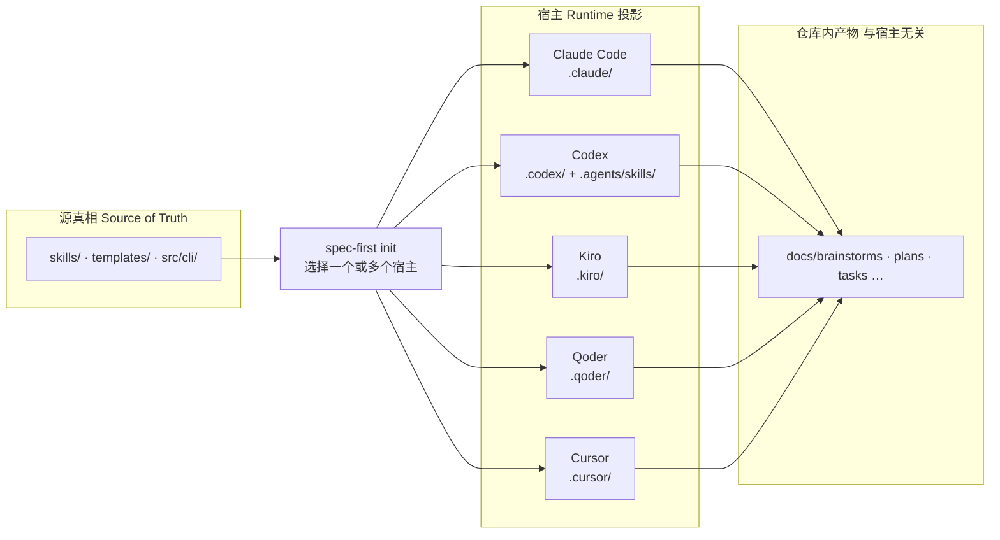
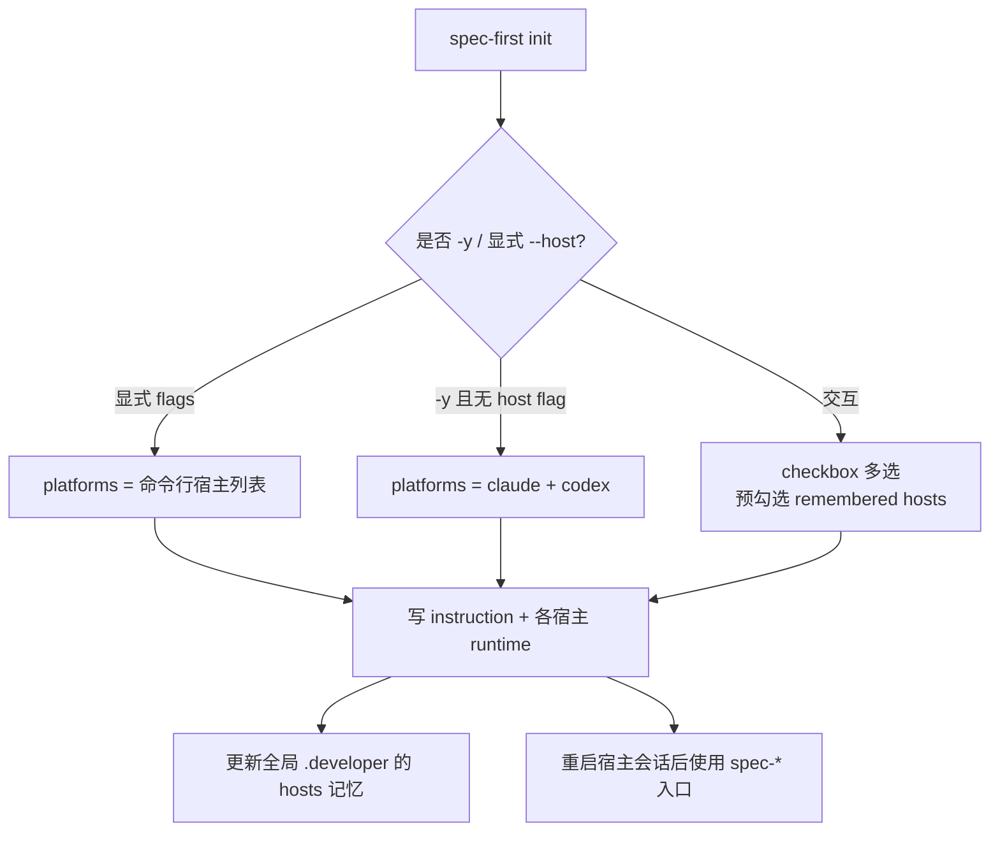

`spec-first` 不是某一家 AI 编辑器的插件，而是一套**同一源资产、多宿主投影**的工程 harness。你先选定日常使用的宿主（Claude Code、Codex、Kiro、Qoder 或 Cursor），再通过 `spec-first init` 把共享的 `spec-*` 工作流投影到该宿主的 runtime 目录。本页只回答一件事：**该选哪个宿主、每个宿主会生成什么、成熟度边界在哪里**。装包与 doctor 步骤见 [五分钟上手：安装、doctor 与 init](2-wu-fen-zhong-shang-shou-an-zhuang-doctor-yu-init)；装好后的第一次 workflow 见 [首次工作流走查：从 brainstorm 到可检查产物](4-shou-ci-gong-zuo-liu-zou-cha-cong-brainstorm-dao-ke-jian-cha-chan-wu)。

Sources: [README.zh-CN.md](README.zh-CN.md#L16-L18)

## 先建立心智模型：一套源，五块投影面

把宿主想成「运行时外壳」，把 `skills/`、`templates/`、`src/cli/` 想成「源真相」。`init` 不会让你为每个宿主手抄一份 prompt 库；它按宿主 adapter 把同一套 `spec-*` 工作流写到各自目录，并尽量改写路径与入口形态，使该宿主能发现它们。工作流**在宿主会话里**触发（例如 `spec-brainstorm`），不是 shell 里再敲一遍。

Sources: [README.zh-CN.md](README.zh-CN.md#L99-L108)



上图要抓住三点：**源只维护一份**；**runtime 可丢弃、可重建**；**业务证据写在仓库 docs 里，不绑死某一宿主**。adapter 注册表明确列出五个平台 id：`claude`、`codex`、`cursor`、`kiro`、`qoder`。

Sources: [index.js](src/cli/adapters/index.js#L1-L40) · [platform-registry.js](src/cli/adapters/platform-registry.js#L3-L142)

## 五宿主对照：能力、目录与成熟度

下表面向「我日常用哪个工具」做选择。成熟度列以代码与 README 的诚实边界为准，而不是营销口径。

| 宿主 | 选择动机 | 入口与指令文件 | 主要 runtime 目录 | Hooks 能力（registry） | 成熟度 |
| --- | --- | --- | --- | --- | --- |
| **Claude Code** | 需要最完整的门禁与命令入口 | `CLAUDE.md`；`spec-*.md` 命令 | `.claude/commands`、`.claude/skills`、`.claude/spec-first/workflows`、`.claude/agents`、`.claude/hooks` | SessionStart / PreToolUse / Stop 均为 **confirmed** | 默认宿主之一（`init -y` 会装） |
| **Codex** | 以 skill 发现为主、项目级 SessionStart | `AGENTS.md`；入口在 `.agents/skills`（无独立 command 安装） | `.agents/skills`、`.codex/agents`、`.codex/spec-first`、`.codex/hooks.json` | SessionStart **confirmed**；PreToolUse / Stop **not-supported**（spec-first 范围） | 默认宿主之一 |
| **Kiro** | 已在用 Kiro IDE，想 opt-in 试用 | `AGENTS.md`；pointer：`.kiro/steering/spec-first.md` | `.kiro/skills`、`.kiro/agents`、`.kiro/spec-first`；**不**依赖生成 commands | hooks：**platform-unsupported** | **opt-in preview**（需 `--kiro`） |
| **Qoder** | 需要 project commands + skills 的 preview | `AGENTS.md`；commands：`.qoder/commands/spec-*.md`；pointer：`.qoder/rules/spec-first.md` | `.qoder/commands`、`.qoder/skills`、`.qoder/agents`、`.qoder/spec-first`、managed hooks 脚本 | 脚本存在但 activation **degraded / unverified** | **opt-in preview**（需 `--qoder`） |
| **Cursor** | 仅验证「能否生成 runtime」 | `AGENTS.md`；pointer：`.cursor/rules/spec-first.mdc` | `.cursor/skills`、`.cursor/spec-first`、`.cursor/mcp.json`；**不**投影 agents/commands | hooks：**not-supported** | **generated_runtime_preview**（最窄；需 `--cursor`） |

Sources: [init-args.js](src/cli/commands/init-args.js#L3-L40) · [platform-registry.js](src/cli/adapters/platform-registry.js#L3-L142) · [README.zh-CN.md](README.zh-CN.md#L16-L18)

### Claude Code：完整门禁面

Claude adapter 安装 SessionStart、spec-plan guard、PRD prewrite / readiness 四类 managed hooks，并把 matchers 写入 `.claude/settings.json` 的 managed slice。指令文件是仓库根 `CLAUDE.md`。若你希望 PRD 与 plan 的硬门禁尽量接近「宿主原生拦截」，优先选 Claude。

Sources: [claude.js](src/cli/adapters/claude.js#L17-L82) · [platform-registry.js](src/cli/adapters/platform-registry.js#L4-L29)

### Codex：skill 发现 + 项目 SessionStart

Codex 的用户可见入口落在 `.agents/skills/`（与 `.codex` 并列的跨 runtime 根），`hasCommands` 为 false——不依赖 slash command 文件做主入口。SessionStart 由 `.codex/hooks.json` 与 hook 脚本组成；若当前项目目录的 `.codex` 恰好等于全局 `CODEX_HOME`，init 会**跳过 hook 写入**，避免全局会话双重注入。指令文件为 `AGENTS.md`。

Sources: [codex.js](src/cli/adapters/codex.js#L36-L75) · [global-config-dir.js](src/cli/helpers/global-config-dir.js#L1-L20) · [platform-registry.js](src/cli/adapters/platform-registry.js#L31-L51)

### Kiro：opt-in preview，steering pointer

Kiro 不安装 command 命名空间；skills 与 agents 写到 `.kiro/skills`、`.kiro/agents`。init 额外写入 **host-native pointer** `.kiro/steering/spec-first.md`，只把宿主指回根 `AGENTS.md` 与 `using-spec-first` skill，**不是**第二套真相源。Kiro 原生 `.kiro/specs/**` 仍归宿主，仅在你显式点名时作 advisory 输入。

Sources: [kiro.js](src/cli/adapters/kiro.js#L15-L54) · [README.zh-CN.md](README.zh-CN.md#L93-L95) · [platform-registry.js](src/cli/adapters/platform-registry.js#L77-L102)

### Qoder：commands 已投影，hooks 故意未启用

Qoder 会生成 `spec-*.md` project commands 与 skills/agents；旧的 `.qoder/commands/spec/` 命名空间已退役并由 init 清理。hook 脚本可以安装，但 registry 将 SessionStart / PreToolUse / Stop 标为 **degraded（activation-unverified）**；运行时文案要求把门禁当作「大声约定」而非 Claude 级硬拦截，并在 closeout 记录 `qoder_hook_activation_unverified`。

Sources: [qoder.js](src/cli/adapters/qoder.js#L38-L89) · [qoder.js](src/cli/adapters/qoder.js#L378-L384) · [platform-registry.js](src/cli/adapters/platform-registry.js#L104-L141)

### Cursor：最窄的 generated-runtime preview

Cursor adapter 关闭 commands 与 agents 投影（`hasCommands` / `supportsAgents` 为 false），只生成 skills 与 state，并写 pointer `.cursor/rules/spec-first.mdc`（`alwaysApply: true`）。doctor / inspect 会固定给出 **generated-runtime preview** 警告：本机尚未验证 skill discovery/invocation，生成的 skills **可能不会被 Cursor 加载**。MCP 默认写项目级 `.cursor/mcp.json`；用户级 `~/.cursor/mcp.json` 必须 `--user-scope` / `CURSOR_USER_SCOPE=1`。

Sources: [cursor.js](src/cli/adapters/cursor.js#L38-L98) · [cursor.js](src/cli/adapters/cursor.js#L138-L146) · [README.zh-CN.md](README.zh-CN.md#L90-L95)

## 怎么在 init 里选宿主

### 交互多选、记忆上次、脚本默认

运行 `spec-first init` 时，多选框列出五个宿主。**首次**默认不预勾选；**之后**会读取全局 `~/.spec-first/.developer` 里的 `hosts=`，把上次选择预勾上（仍可改）。非交互 `init -y` **只**默认 Claude Code 与 Codex（`defaultForYes: true`）；Kiro / Qoder / Cursor 必须显式 flag。

```bash
# 交互：多选宿主 → 姓名/语言 → 确认摘要
spec-first init

# 跳过宿主选择，只初始化指定宿主
spec-first init --claude --codex
spec-first init --kiro -y -u <name> --lang zh
spec-first init --qoder -y -u <name> --lang zh
spec-first init --cursor -y -u <name> --lang zh   # preview，非默认集

# 先看路径明细再写盘
spec-first init --claude --dry-run
```

Sources: [init-input.js](src/cli/commands/init-input.js#L74-L87) · [init-args.js](src/cli/commands/init-args.js#L3-L40) · [init-args.js](src/cli/commands/init-args.js#L158-L168) · [01-快速开始.md](docs/05-用户手册/01-快速开始.md#L60-L60)



Sources: [init-input.js](src/cli/commands/init-input.js#L74-L87) · [developer.js](src/cli/developer.js#L152-L195)

### 选型决策（新手路径）

| 你的情况 | 建议 |
| --- | --- |
| 团队已统一 Claude Code | 只选 **Claude**；需要双保险再加 Codex |
| 团队主力是 Codex / AGENTS.md 生态 | 只选 **Codex** |
| 两种都在用 | **同时勾选** Claude + Codex；源资产仍一份 |
| 试用 Kiro / Qoder | 显式 `--kiro` 或 `--qoder`，接受 preview 与降级门禁 |
| 想在 Cursor 里「先生成再看」 | 仅 `--cursor`，并阅读 loader 未验证警告；**不要**当生产默认宿主 |
| 脚本 / CI 初始化 | `init -y -u <name> --lang <zh\|en>` 加你需要的 host flags |

Sources: [README.zh-CN.md](README.zh-CN.md#L74-L80) · [init-args.js](src/cli/commands/init-args.js#L158-L161)

## 跨宿主时仍要统一的四条纪律

**1. 公开入口名统一为 `spec-*`。** 不论宿主，会话里都是 `spec-brainstorm`、`spec-plan`、`spec-mcp-setup` 这一类名字，而不是各宿主历史方言。

Sources: [README.zh-CN.md](README.zh-CN.md#L154-L154) · [init-args.js](src/cli/commands/init-args.js#L224-L226)

**2. Pointer 不是第二真相源。** Cursor / Kiro / Qoder 的 rules 或 steering 文件只指向 `AGENTS.md` 与 `using-spec-first`。若同路径已有**无** managed marker 的用户文件，init / clean **不会**覆盖或删除，doctor 会报冲突 warning。

Sources: [host-native-pointer.js](src/cli/adapters/host-native-pointer.js#L14-L61) · [README.zh-CN.md](README.zh-CN.md#L93-L95)

**3. 多宿主共存时给 setup 钉死 host pin。** 各 preview 宿主在生成的 `spec-mcp-setup` 文案中要求设置 `MCP_SETUP_HOST=<host>`，禁止仅靠 PATH 猜当前宿主，避免 Claude / Codex / Cursor / Kiro / Qoder CLI 同机时写错配置面。

Sources: [kiro.js](src/cli/adapters/kiro.js#L255-L262) · [cursor.js](src/cli/adapters/cursor.js#L319-L326)

**4. 不要手改 generated mirror。** 修漂移一律 `spec-first init` 重建；手改 `.claude/`、`.agents/skills/`、`.cursor/skills/` 等会在下次 init 被覆盖。宿主原生目录（如 `.cursor/rules/**` 中非 managed 文件、`.kiro/specs/**`）仍由团队自己治理。

Sources: [README.zh-CN.md](README.zh-CN.md#L207-L211)

## 装完后怎么确认选对了

1. 在目标宿主中**新开会话**（或重启宿主），让其加载 runtime。  
2. 确认能看到统一入口（至少 `using-spec-first` / `spec-mcp-setup` 一类 skill 或 command）。  
3. 跑 `spec-first doctor --claude`（或 `--codex` / `--kiro` / `--qoder` / `--cursor`）核对 managed state。  
4. Cursor 若只看到「生成成功」但会话加载不了 skill，这与 **preview 边界一致**，不要当成安装失败硬扛。  
5. Qoder 若 PRD 门禁未硬拦截，按 degraded 约定走 skill 内 finalize，而不是假设 hooks 已激活。

Sources: [01-快速开始.md](docs/05-用户手册/01-快速开始.md#L50-L70) · [init-i18n.js](src/cli/init-i18n.js#L106-L107) · [cursor.js](src/cli/adapters/cursor.js#L138-L146)

## 本页边界与下一步阅读

本页只覆盖**宿主选择与投影差异**。不展开：完整安装命令与 doctor 排错（见上手页）、brainstorm→plan 走查、各 `spec-*` 路由表、产物目录约定、单仓/多仓模式，以及 CLI 控制面细节——这些分别在目录后续页。

建议阅读顺序：

1. 若尚未 init 成功 → [五分钟上手：安装、doctor 与 init](2-wu-fen-zhong-shang-shou-an-zhuang-doctor-yu-init)  
2. 选定宿主并重启后 → [首次工作流走查：从 brainstorm 到可检查产物](4-shou-ci-gong-zuo-liu-zou-cha-cong-brainstorm-dao-ke-jian-cha-chan-wu)  
3. 需要按任务挑 workflow → [入口路由速查：按任务选择 spec-* 工作流](5-ru-kou-lu-you-su-cha-an-ren-wu-xuan-ze-spec-gong-zuo-liu)  
4. 想理解 runtime 投影与 pointer 治理的更深契约 → 目录「运行时与宿主集成」中的 [多宿主 Runtime 投影与 pointer 文件治理](20-duo-su-zhu-runtime-tou-ying-yu-pointer-wen-jian-zhi-li)  
5. 多仓 / monorepo 场景 → [三种开发模式：单仓、多 module 与多 Git 工作区](7-san-chong-kai-fa-mo-shi-dan-cang-duo-module-yu-duo-git-gong-zuo-qu)

**一句话行动建议：** 生产路径优先 **Claude Code 和/或 Codex**；Kiro / Qoder 用显式 opt-in 试用；Cursor 仅作 generated-runtime 实验。选完后执行 `spec-first init`，重启宿主，再进入第一次 `spec-brainstorm`。