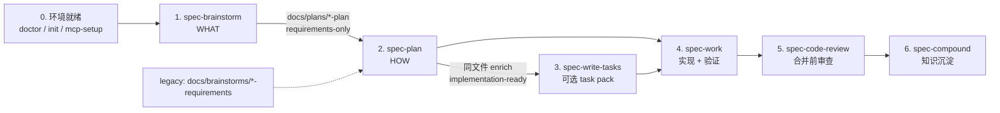

本页面向已经完成安装与 `init` 的初学者：用**一条真实主链路**，把一句模糊需求推进到仓库里可打开、可评审、可接力的产物。重点不是背命令，而是理解「每一步留下什么、下一步读什么、怎样判断够不够好」。

Sources: [09-首次工作流走查.md](docs/05-用户手册/09-首次工作流走查.md#L1-L12)、[README.md](docs/05-用户手册/README.md#L56-L67)

若你还没装 CLI、还没跑过 `doctor` / `init`，请先完成 [五分钟上手：安装、doctor 与 init](2-wu-fen-zhong-shang-shou-an-zhuang-doctor-yu-init)；宿主选择见 [多宿主选择：Claude Code、Codex、Kiro、Qoder 与 Cursor](3-duo-su-zhu-xuan-ze-claude-code-codex-kiro-qoder-yu-cursor)。走查结束后，用 [入口路由速查：按任务选择 spec-* 工作流](5-ru-kou-lu-you-su-cha-an-ren-wu-xuan-ze-spec-gong-zuo-liu) 与 [产物目录与成功信号：仓库内 artifact 去哪找](6-chan-wu-mu-lu-yu-cheng-gong-xin-hao-cang-ku-nei-artifact-qu-na-zhao) 做日常检索。

Sources: [01-快速开始.md](docs/05-用户手册/01-快速开始.md#L1-L40)、[README.md](docs/05-用户手册/README.md#L118-L137)

## 走查目标与一条示例需求

本页用一句足够小、又足够真实的需求句子：

```text
Improve onboarding for first-time CLI users
```

目标有三层：**把 WHAT 写清楚**（产品范围与成功标准）、**把 HOW 写成可执行计划**（实现单元与验证）、**把改动做成可检查结果**（diff、测试/命令输出、审查与可选知识沉淀）。主链路不是强制状态机：你只进入当前最需要的一步；handoff 由正在运行的 workflow 拥有。

Sources: [09-首次工作流走查.md](docs/05-用户手册/09-首次工作流走查.md#L1-L12)、[24-公开入口与Skill目录.md](docs/05-用户手册/24-公开入口与Skill目录.md#L30-L45)

脚本负责安装、路径、校验与确定性事实；LLM 负责范围取舍、实现判断与评审语义。不要把「跑完所有步骤」当成成功——**仓库里出现了下一步能直接读取的高质量上下文**才是成功。

Sources: [09-首次工作流走查.md](docs/05-用户手册/09-首次工作流走查.md#L7-L11)、[10-产物目录.md](docs/05-用户手册/10-产物目录.md#L5-L12)

## 主链路总览

下图是首次走查最常见的主路径。虚线表示可选步骤；实线表示默认接力关系。



Sources: [SKILL.md](skills/spec-brainstorm/SKILL.md#L11-L13)、[SKILL.md](skills/spec-plan/SKILL.md#L11-L13)、[09-首次工作流走查.md](docs/05-用户手册/09-首次工作流走查.md#L80-L186)

**统一 plan 产物**是当前主链路的核心：`spec-brainstorm` 先写出 `artifact_readiness: requirements-only` 的统一计划；`spec-plan` 在**同一文件上**充实为 `implementation-ready`；`spec-work` 只执行可实现就绪的代码计划。历史 `docs/brainstorms/*-requirements.*` 仍可作为 `spec-plan` 的合法输入，但**新的 brainstorm 默认不再写到该目录**。

Sources: [SKILL.md](skills/spec-brainstorm/SKILL.md#L85-L92)、[brainstorm-sections.md](skills/spec-brainstorm/references/brainstorm-sections.md#L25-L53)、[SKILL.md](skills/spec-plan/SKILL.md#L165-L183)

## 0. 前置：只在需要时准备环境

日常做需求时，不必每次重装。仅在**首次使用、换宿主、升级后重建 runtime、或 MCP/helper 环境变化**时执行本节。

Sources: [09-首次工作流走查.md](docs/05-用户手册/09-首次工作流走查.md#L14-L17)

### 0.1 安装 CLI 并检查状态

```bash
npm install -g spec-first
# 或在本仓库源码验证时：npm pack && npm install -g ./spec-first-<version>.tgz
spec-first doctor
```

`doctor` 回答的是「当前宿主与 runtime 是否健康」，不是业务需求本身。

Sources: [09-首次工作流走查.md](docs/05-用户手册/09-首次工作流走查.md#L18-L39)

### 0.2 初始化宿主 runtime

```bash
spec-first init
# 脚本场景示例：
# spec-first init -y --claude --codex -u <name> --lang zh
```

`init` 会安装项目级 runtime assets（如 `.claude/`、`.agents/skills/` 等），并让你选择宿主、开发者姓名与语言。**只勾选你实际使用的宿主**。初始化后重启宿主或新开会话；后续 `spec-*` 入口在**宿主会话里**运行，不是 shell 子命令。

Sources: [09-首次工作流走查.md](docs/05-用户手册/09-首次工作流走查.md#L40-L48)、[README.md](docs/05-用户手册/README.md#L1-L20)

### 0.3 准备 required harness runtime

在新宿主会话中：

```text
spec-mcp-setup
```

它安装并验证 required harness runtime、MCP servers 与 helper tools，输出的是**确定性环境事实**，不替代需求判断或实现判断。父 workspace 多子仓时，无参数运行会默认逐个 child 维护，父目录只写 `.spec-first/workspace/*summary.json` 这类 advisory summary——真正改某个项目时仍要明确 child repo scope。

Sources: [09-首次工作流走查.md](docs/05-用户手册/09-首次工作流走查.md#L49-L58)、[04-workflows-artifacts-map.md](docs/05-用户手册/04-workflows-artifacts-map.md#L1-L20)

### 0.4 代码图谱是可选导航，不是硬门槛

没有单独的「编译代码图谱」步骤。Graphify 等 exploration-tier 能力由 `mcp-setup` 在确认 provider pack 后一并处理；**baseline ready 即可进入业务 workflow**。plan / work / debug / review 的当前代码事实应来自有界源码阅读、`rg`、ast-grep、git diff、tests/logs 与用户证据；图谱结论必须回源核对。

Sources: [09-首次工作流走查.md](docs/05-用户手册/09-首次工作流走查.md#L60-L72)、[02-核心概念.md](docs/05-用户手册/02-核心概念.md#L234-L234)

## 1. 从 brainstorm 定 WHAT

宿主会话中：

```text
spec-brainstorm "Improve onboarding for first-time CLI users"
```

`spec-brainstorm` 通过协作对话回答 **WHAT to build**：用户是谁、当前卡点、必须做 / 明确不做、成功标准、后续规划边界。它**不写实现代码**；实现细节默认留给 `spec-plan`。

Sources: [SKILL.md](skills/spec-brainstorm/SKILL.md#L11-L17)、[09-首次工作流走查.md](docs/05-用户手册/09-首次工作流走查.md#L74-L98)

### 1.1 你会经历什么交互

典型规则对初学者很重要：

| 规则 | 体感 |
| --- | --- |
| 一次只问一个最高影响问题 | 不会被一长串问卷淹没 |
| 优先单选，少用多选 | 方向清晰，少「全选糊弄」 |
| 先评估 scope 再决定仪式感 | 小改动不会被写成巨石 PRD |
| 范围综合确认后再落盘 | 写文档前还有一次纠正机会 |

Sources: [SKILL.md](skills/spec-brainstorm/SKILL.md#L27-L36)、[SKILL.md](skills/spec-brainstorm/SKILL.md#L252-L252)

### 1.2 可检查产物：requirements-only 统一计划

当对话产生了值得保留的决策时，会写入：

```text
docs/plans/YYYY-MM-DD-NNN-<type>-<topic>-plan.md   # 或 .html
```

Frontmatter / 元数据至少应能读到：

| 字段 | 首次走查时的期望值 |
| --- | --- |
| `artifact_contract` | `spec-unified-plan/v1` |
| `artifact_readiness` | `requirements-only` |
| `product_contract_source` | `spec-brainstorm` |
| `execution`（有足够信号时） | 软件功能通常为 `code` |

Sources: [SKILL.md](skills/spec-brainstorm/SKILL.md#L268-L277)、[brainstorm-sections.md](skills/spec-brainstorm/references/brainstorm-sections.md#L25-L49)

文档体应轻量可读：`## Goal Capsule`（目标、产品权威、开放阻塞）+ `## Product Contract`（Summary、Requirements / R-ID、范围边界、成功标准等）。**不要**期待此时已有完整的 Implementation Units 或 Definition of Done——那些由 `spec-plan` 添加。若对话只是简短对齐且决策可直接流入 plan/commit，也可能**不落文档**，这是正确的 right-sizing，不是失败。

Sources: [brainstorm-sections.md](skills/spec-brainstorm/references/brainstorm-sections.md#L37-L80)、[brainstorm-sections.md](skills/spec-brainstorm/references/brainstorm-sections.md#L135-L150)

**成功信号（可自检）：**

- 仓库里能打开上述 `docs/plans/*-plan.*`（或你确认无需文档）
- 文件声明 `requirements-only`，且 Product Contract 能独立回答「为谁、解决什么、成功长什么样、本轮不做什么」
- 宿主会话报告了**可点击的绝对路径**

Sources: [SKILL.md](skills/spec-brainstorm/SKILL.md#L277-L277)、[09-首次工作流走查.md](docs/05-用户手册/09-首次工作流走查.md#L86-L96)

### 1.3 常见分支（首次可先跳过，但要知道）

| 情况 | 行为 |
| --- | --- |
| 已有同主题 requirements-only 计划 | 询问 resume 还是 start fresh |
| 非软件任务 | 走 universal brainstorming；**不**写统一代码计划契约 |
| 「要不要采用某个外部技术 X？」 | 更像 verdict，应考虑 `spec-pov`，而不是硬塞进 brainstorm |
| 历史 `docs/brainstorms/*-requirements.*` | 仍可被 `spec-plan` 读取；新 brainstorm 默认不写这里 |

Sources: [SKILL.md](skills/spec-brainstorm/SKILL.md#L85-L118)、[SKILL.md](skills/spec-plan/SKILL.md#L165-L169)

若你手里是**已有产品 PRD / 需求材料**要进研发，而不是从零 framing，应改走 `spec-prd`（棕地澄清），而不是强行 `spec-brainstorm`。细节见 [棕地 PRD：spec-prd 的 grill、write 与 readiness 闭环](14-zong-di-prd-spec-prd-de-grill-write-yu-readiness-bi-huan)。

Sources: [24-公开入口与Skill目录.md](docs/05-用户手册/24-公开入口与Skill目录.md#L30-L40)

## 2. 用 plan 把 WHAT 充实为 HOW

当 Product Contract 稳定后，在宿主会话中：

```text
spec-plan
# 或显式：spec-plan docs/plans/<你的 requirements-only 文件>
```

`spec-plan` 的职责是：在**不发明用户行为**的前提下，把同一份统一计划充实为可评审、可执行的工程决策上下文。它**不实现代码、不跑成套测试、不从执行结果「学习」**——那些属于 `spec-work`。

Sources: [SKILL.md](skills/spec-plan/SKILL.md#L11-L15)、[09-首次工作流走查.md](docs/05-用户手册/09-首次工作流走查.md#L99-L118)

### 2.1 对 requirements-only 计划的特殊规则

若输入是 `artifact_readiness: requirements-only` 的统一计划：

1. **它不是 resume 旧 plan**，而是 **enrichment 输入**
2. `spec-plan` 应宣布：将**原地**把同一文件 enrich 到 `implementation-ready`
3. 保留 Product Contract 的 ID 与内容，再补上 Planning Contract、Implementation Units、Verification Contract、Definition of Done

Sources: [SKILL.md](skills/spec-plan/SKILL.md#L112-L112)、[SKILL.md](skills/spec-plan/SKILL.md#L181-L183)、[SKILL.md](skills/spec-plan/SKILL.md#L710-L713)

若输入是 legacy `docs/brainstorms/*-requirements.*`，则会**新建** `docs/plans/*-plan.*`，并在元数据里用 `origin:` 指向旧文档。直接从一句描述开 plan 也可以（`product_contract_source: spec-plan-bootstrap`），但首次走查更推荐「先 brainstorm 再 plan」，避免 plan 阶段偷偷发明产品范围。

Sources: [SKILL.md](skills/spec-plan/SKILL.md#L167-L169)、[SKILL.md](skills/spec-plan/SKILL.md#L711-L712)

### 2.2 好 plan 的质量地板

| 必须包含 | 初学者检查法 |
| --- | --- |
| 问题框与范围边界 | 读完知道「不做什么」 |
| 需求可追溯 | 能指回 R-ID / 原请求 |
| 仓库相对路径 | 文件列表**不是**绝对路径 |
| 决策 + 理由 | 不是任务流水账 |
| 依赖与顺序 | 知道先改哪、后改哪 |
| 每单元可执行的测试场景 | 实现者不必自己发明验收 |

Sources: [SKILL.md](skills/spec-plan/SKILL.md#L51-L60)、[SKILL.md](skills/spec-plan/SKILL.md#L35-L35)

### 2.3 可检查产物与 handoff 菜单

完成后，同一路径上的元数据应变为：

| 字段 | 期望值 |
| --- | --- |
| `artifact_readiness` | `implementation-ready` |
| `execution`（软件实现） | `code` |
| `artifact_contract` | `spec-unified-plan/v1` |

Sources: [SKILL.md](skills/spec-plan/SKILL.md#L710-L713)、[2026-07-13-001-feat-per-requirement-workspace-multi-repo-graph-plan.md](docs/plans/2026-07-13-001-feat-per-requirement-workspace-multi-repo-graph-plan.md#L1-L10)

交互式软件实现计划在写完文件、置信检查与（markdown 的）文档审查之后，**必须以 handoff 菜单收尾**，例如询问下一步是否启动 `spec-work`。只写文件不展示菜单，不算完整完成。

Sources: [SKILL.md](skills/spec-plan/SKILL.md#L17-L25)、[SKILL.md](skills/spec-plan/SKILL.md#L797-L798)

**成功信号：**

- 打开 plan，已从「产品合同」扩展到「实现单元 + 验证合同 + DoD」
- 路径仍是 `docs/plans/...-plan.md|html`，且为 `implementation-ready`
- 会话给出 `Plan ready at <absolute path>` 与下一步选项

Sources: [SKILL.md](skills/spec-plan/SKILL.md#L23-L23)、[09-首次工作流走查.md](docs/05-用户手册/09-首次工作流走查.md#L109-L118)

## 3. （可选）大计划再编译 task pack

小计划可直接 `spec-work`。当 plan 跨多模块、多阶段，或需要多人/多 agent 交接时：

```text
spec-write-tasks
```

它是 `spec-plan` 与 `spec-work` 之间的**可选派生层**：不改范围、不改验收、不执行代码；只在需要时把 settled plan 编译成可执行索引。

Sources: [SKILL.md](skills/spec-write-tasks/SKILL.md#L1-L20)、[09-首次工作流走查.md](docs/05-用户手册/09-首次工作流走查.md#L119-L131)

产物路径：

```text
docs/tasks/YYYY-MM-DD-NNN-...-tasks.md
```

机器可读契约应包含：`spec_id`、`source_plan`、`source_plan_hash`、`generated_by: spec-write-tasks`、`mode: derived`，以及合法的 `Task Pack Contract` JSON 块。plan 变更后应重编译或校验 freshness——**task pack 永远不是第二真相源**。

Sources: [SKILL.md](skills/spec-write-tasks/SKILL.md#L34-L40)、[SKILL.md](skills/spec-write-tasks/SKILL.md#L85-L110)

| 决策信封 | 含义 |
| --- | --- |
| 可执行 task pack | 可交给 `spec-work` |
| `skip` | 无需派生层，直接 work |
| `return-to-plan` | plan 未 settled，先回 plan |
| `draft-only` / `validate-only` | 草稿或仅校验，不扩大 scope |

Sources: [SKILL.md](skills/spec-write-tasks/SKILL.md#L30-L32)

## 4. 进入 work：最小可验证改动

```text
spec-work
# 或：spec-work docs/plans/<implementation-ready-plan>
```

### 4.1 输入分流（避免「拿错文档开工」）

| 输入 | 行为 |
| --- | --- |
| 统一计划且 `requirements-only` | **停止**，提示先 `spec-plan` enrich |
| 统一计划且 `implementation-ready` + `execution: code` | 进入实现 |
| 空白调用 | 仅自动挑选最新 **implementation-ready 代码计划** |
| 裸描述（无文件） | 按复杂度 trivial / small / large 分流；过大应回 brainstorm/plan |
| 开放式 bug | 更适合 `spec-debug`，不要当 feature 硬做 |

Sources: [SKILL.md](skills/spec-work/SKILL.md#L27-L55)、[09-首次工作流走查.md](docs/05-用户手册/09-首次工作流走查.md#L133-L151)

### 4.2 执行时你应看到什么

`spec-work` 会读取 plan / task pack、项目指令、相关源码与测试，按实现单元做**最小可验证**改动。行为变更时，默认重视 proof-first / characterization-first：先有失败测试或行为基线，再改生产代码；并记录 `verification_evidence`（是否改行为、检查了哪些测试、跑了什么命令、例外理由）。

Sources: [SKILL.md](skills/spec-work/SKILL.md#L210-L230)、[SKILL.md](skills/spec-work/SKILL.md#L368-L384)

**可检查结果（首次走查最关心）：**

| 检查项 | 说明 |
| --- | --- |
| 代码或文档 diff | 范围应贴近 plan 的 Files / U-ID |
| 测试或检查命令的真实输出 | 不可由 LLM 伪造 |
| 残余风险 / 阻塞说明 | 有就写清，不要静默吞掉 |
| `CHANGELOG.md`（本仓库规范） | 源码/文档变更通常需同步记录 |
| 可选 `.spec-first/workflows/spec-work/<workspace-slug>/<run-id>/run.json` | closeout evidence，**不是** plan 权威 |

Sources: [09-首次工作流走查.md](docs/05-用户手册/09-首次工作流走查.md#L141-L149)、[10-产物目录.md](docs/05-用户手册/10-产物目录.md#L14-L24)、[04-workflows-artifacts-map.md](docs/05-用户手册/04-workflows-artifacts-map.md#L105-L110)

**边界：** 不要改 `.claude/`、`.agents/skills/` 等 generated runtime 来绕过 source truth。若改的是 skill/agent/template/CLI 能力本身，应改 `skills/`、`agents/`、`templates/`、`src/cli/`，再按需 `spec-first init` 重建 runtime。

Sources: [09-首次工作流走查.md](docs/05-用户手册/09-首次工作流走查.md#L149-L151)、[10-产物目录.md](docs/05-用户手册/10-产物目录.md#L40-L55)

## 5. 合并前 review，完成后 compound

### 5.1 `spec-code-review`

```text
spec-code-review
```

关注 bug、行为回归、测试缺口与残余风险，而不是写表扬稿。默认交互模式可对安全修复做本地 apply；`mode:agent` 只报告 JSON，供管线调用。详细 reviewer 产物写在 **OS temp** 下的临时目录，**默认不提交**；需要长期保留时，写 PR 的 Known Residuals 或 concise durable summary。

Sources: [SKILL.md](skills/spec-code-review/SKILL.md#L1-L40)、[04-workflows-artifacts-map.md](docs/05-用户手册/04-workflows-artifacts-map.md#L113-L119)、[09-首次工作流走查.md](docs/05-用户手册/09-首次工作流走查.md#L167-L173)

### 5.2 （场景可选）`spec-app-consistency-audit`

移动 App 在模拟器/真机/打包前，若需静态对齐 PRD / Figma / source / 路由 / 架构 / 埋点 / i18n，可插入 `spec-app-consistency-audit`。产物在 `.spec-first/app-audit/runs/<run-id>/`，属于执行证据，不是长期手工文档。

Sources: [09-首次工作流走查.md](docs/05-用户手册/09-首次工作流走查.md#L153-L165)、[README.md](docs/05-用户手册/README.md#L101-L101)

### 5.3 `spec-compound`

当问题已稳定解决、经验值得复用：

```text
spec-compound
```

把可复用解法写入 `docs/solutions/`（可搜索 frontmatter），让后续 brainstorm / plan / work / debug / review 继承，而不是从零再踩坑。未验证的猜测不要写进 durable knowledge。

Sources: [SKILL.md](skills/spec-compound/SKILL.md#L7-L23)、[09-首次工作流走查.md](docs/05-用户手册/09-首次工作流走查.md#L175-L181)、[24-公开入口与Skill目录.md](docs/05-用户手册/24-公开入口与Skill目录.md#L30-L42)

## 产物一览：谁写、谁读、是否提交

| 路径 / 形态 | 主要生成者 | 主要读取方 | Git 边界 | 首次走查怎么验 |
| --- | --- | --- | --- | --- |
| `docs/plans/*-plan.*` `requirements-only` | `spec-brainstorm` | `spec-plan`、人 | 通常提交 | frontmatter + Product Contract |
| 同上，`implementation-ready` | `spec-plan`（原地 enrich 或新建） | `spec-work`、`spec-write-tasks`、review | 通常提交 | U-ID、验证合同、DoD |
| `docs/brainstorms/*-requirements.*` | 历史 brainstorm / `spec-prd` 等 | `spec-plan`（legacy / 棕地） | 通常提交 | 仅当路径真实存在时 |
| `docs/tasks/*-tasks.md` | `spec-write-tasks` | `spec-work` | 视团队 | `source_plan_hash` 新鲜 |
| 代码 diff + 测试输出 | `spec-work` / shell | reviewer、CI | 提交代码与必要文档 | 命令真实退出码 |
| `.spec-first/workflows/spec-work/.../run.json` | `spec-work` closeout | review / 维护者 | 通常不提交 | 有则视为证据，非权威 |
| OS temp `.../spec-code-review/<run-id>/` | `spec-code-review` | 当前会话 | 不提交 | 会话内 findings |
| `docs/solutions/**` | `spec-compound` | 后续会话 | 通常提交 | 分类路径 + 可搜索 frontmatter |
| `.claude/`、`.agents/skills/` 等 | `spec-first init` | 宿主 | 可重建，非 source truth | 漂移则 re-init |

Sources: [10-产物目录.md](docs/05-用户手册/10-产物目录.md#L14-L55)、[04-workflows-artifacts-map.md](docs/05-用户手册/04-workflows-artifacts-map.md#L25-L35)、[brainstorm-sections.md](skills/spec-brainstorm/references/brainstorm-sections.md#L25-L53)

## 常见判断：下一步进哪个入口

| 你现在的状态 | 推荐入口 | 原因 |
| --- | --- | --- |
| 只有一句想法，成功标准未定 | `spec-brainstorm` | 先抬高 WHAT 质量 |
| 已有产品材料要进研发 | `spec-prd` | 棕地澄清与 plan 准入 |
| WHAT 清楚，HOW 未定 | `spec-plan` | 可评审实现路径 |
| plan 过大需交接 / 并行 | `spec-write-tasks` | 派生执行索引 |
| 已有 implementation-ready plan | `spec-work` | 最小可验证改动 |
| 实现失败 / 测试红 / 行为异常 | `spec-debug` | 先根因，不当 feature |
| 准备合并 | `spec-code-review` | 阻断问题与残余风险 |
| 经验值得复用 | `spec-compound` | 写入 `docs/solutions/` |
| 不知道选哪个 | `using-spec-first` | 只路由，不写 artifact |

Sources: [09-首次工作流走查.md](docs/05-用户手册/09-首次工作流走查.md#L183-L193)、[24-公开入口与Skill目录.md](docs/05-用户手册/24-公开入口与Skill目录.md#L12-L45)

## 关键边界（走查时反复对照）

- **长期协作层：** `docs/plans/`、`docs/tasks/`、`docs/solutions/`（以及仍在用的 `docs/brainstorms/`、`docs/ideation/`）应可被同事与下一次会话读取。
- **Generated runtime：** `.claude/`、`.codex/`、`.agents/skills/` 等可由 `init` 重建，**不要手改当 source truth**。
- **Source truth（框架自身）：** `skills/`、`agents/`、`templates/`、`src/cli/`。
- **Control-plane：** `.spec-first/` 多是机器事实与执行证据；`.spec-first/workspace/` 是父 workspace advisory，**不是** child repo 权威。
- **脚本 vs LLM：** 脚本做确定性检查；LLM 做语义判断——不要把主链路设计成多状态强编排状态机。

Sources: [09-首次工作流走查.md](docs/05-用户手册/09-首次工作流走查.md#L195-L201)、[10-产物目录.md](docs/05-用户手册/10-产物目录.md#L5-L12)

## 30 分钟最小闭环清单

按顺序打勾即可完成「首次可检查」：

1. `spec-first doctor` 健康；目标宿主已 `init` 且会话已重启  
2. 需要时跑过一次 `spec-mcp-setup`，baseline ready  
3. `spec-brainstorm` 得到 `docs/plans/...-plan` 且 `requirements-only`，或明确无需文档  
4. `spec-plan` 将同一文件（或新文件）推进到 `implementation-ready` + 验证合同  
5. （可选）`spec-write-tasks` 产出新鲜 `docs/tasks/*-tasks.md`  
6. `spec-work` 产生可解释 diff + 真实验证输出  
7. `spec-code-review` 给出 findings / residual risks  
8. 若经验可复用，`spec-compound` 写入 `docs/solutions/`  

Sources: [09-首次工作流走查.md](docs/05-用户手册/09-首次工作流走查.md#L14-L181)、[SKILL.md](skills/spec-plan/SKILL.md#L11-L13)

## 下一步阅读

- 想按任务选入口： [入口路由速查：按任务选择 spec-* 工作流](5-ru-kou-lu-you-su-cha-an-ren-wu-xuan-ze-spec-gong-zuo-liu)  
- 想精确找目录与 Git 边界： [产物目录与成功信号：仓库内 artifact 去哪找](6-chan-wu-mu-lu-yu-cheng-gong-xin-hao-cang-ku-nei-artifact-qu-na-zhao)  
- 想理解单仓 / 多 module / 多 Git： [三种开发模式：单仓、多 module 与多 Git 工作区](7-san-chong-kai-fa-mo-shi-dan-cang-duo-module-yu-duo-git-gong-zuo-qu)  
- 想深入 WHAT 阶段： [需求澄清：ideate、brainstorm 与 Product Contract](13-xu-qiu-cheng-qing-ideate-brainstorm-yu-product-contract)  
- 想深入 HOW 与执行： [实现规划：spec-plan 如何把 WHAT 充实为 HOW](15-shi-xian-gui-hua-spec-plan-ru-he-ba-what-chong-shi-wei-how)、[任务拆解与执行：write-tasks、work 与 verification evidence](16-ren-wu-chai-jie-yu-zhi-xing-write-tasks-work-yu-verification-evidence)  
- 想理解方法论总图： [Spec-First 方法论：从对话到可治理工程闭环](9-spec-first-fang-fa-lun-cong-dui-hua-dao-ke-zhi-li-gong-cheng-bi-huan)