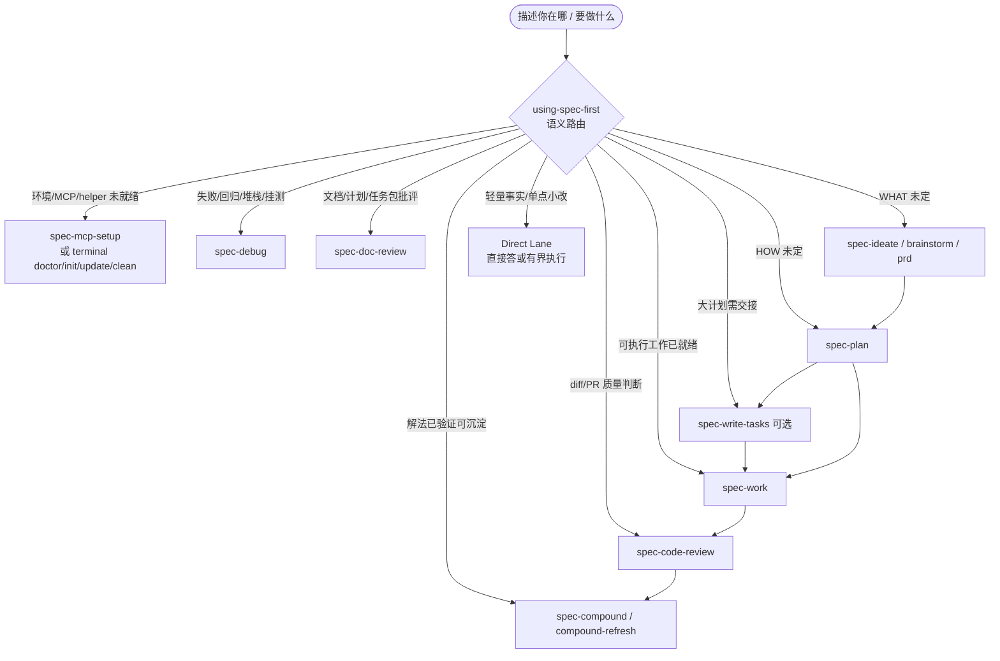
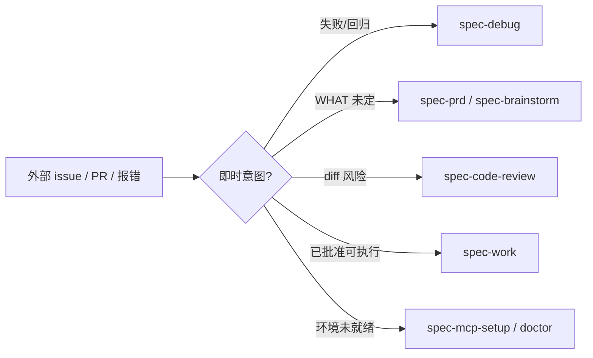

你不必背下整张 skill 菜单。`spec-first` 的公开入口很多，但日常决策只需回答一个问题：**我现在最缺的是 WHAT、HOW、可执行工作、质量判断，还是环境就绪？** 本页是面向初学者的入口路由速查：以 `using-spec-first` 为语义地图，按任务场景选出**唯一**下一步 `spec-*` 工作流、standalone skill 或终端命令，并说明何时应留在 Direct Lane（直接回答 / 有界读取 / 小改）。

Sources: [SKILL.md](skills/using-spec-first/SKILL.md#L1-L11)

## 先建立心智模型：路由员，不是流水线

`using-spec-first` 是 **standalone 入口治理器**，不是 command-backed workflow。它只做两件事：选中**一个**公开入口，然后移交控制权；**不写** workflow artifact。主链路、旁路入口与 standalone skill 构成一张**语义地图**，而不是强制状态机——不要因为「文档里写了 plan → work → review」就自动串跑整条链；handoff 由当前活跃 workflow 拥有。

Sources: [SKILL.md](skills/using-spec-first/SKILL.md#L7-L11) · [SKILL.md](skills/using-spec-first/SKILL.md#L27-L27)

机器可读的入口分层真相源是 `skills-governance.json` 的 `entry_surface`：

| `entry_surface` | 用户该怎么理解 | 示例 |
| --- | --- | --- |
| `workflow_command` | 公开主入口，宿主里以 `spec-*` 调用 | `spec-plan`、`spec-work`、`spec-debug` |
| `standalone_skill` | 按意图直接用，不包装成主链路节点；部分仅用户显式触发 | `using-spec-first`、`spec-explain`、`spec-lfg` |
| `internal_only` | **不是**用户菜单项，由公开 workflow 内部委派 | `spec-worktree`、`spec-commit`、`spec-test-browser` |

Sources: [skills-governance.json](src/cli/contracts/dual-host-governance/skills-governance.json) · [24-公开入口与Skill目录.md](docs/05-用户手册/24-公开入口与Skill目录.md#L1-L20) · [using-spec-first-contracts.test.js](tests/unit/using-spec-first-contracts.test.js#L32-L45)

下面这张图把「描述现状 → 选一个入口」压缩成可扫读的结构。先读图，再对照后文表格。



Sources: [SKILL.md](skills/using-spec-first/SKILL.md#L12-L61) · [24-公开入口与Skill目录.md](docs/05-用户手册/24-公开入口与Skill目录.md#L14-L40)

## 30 秒决策：你现在该进哪一类

按下面顺序做**语义判断**（不要用关键词碰运气）：

1. 用户已经点名一个**安全的**公开 workflow → 进那个  
2. 环境 readiness、失败/回归、文档评审、skill 包治理等 on-ramp 命中 → 优先旁路  
3. 否则看主链路：WHAT → HOW →（可选 tasks）→ work → review → knowledge  
4. 其余 → Direct Lane  

Sources: [SKILL.md](skills/using-spec-first/SKILL.md#L62-L65) · [24-公开入口与Skill目录.md](docs/05-用户手册/24-公开入口与Skill目录.md#L14-L20)

| 你现在的状态（一句话） | 选这个入口 | 不要误选 |
| --- | --- | --- |
| 还在找 0–1 方向 / 要候选想法 | `spec-ideate` | 不要在 ideate 里写实现 plan |
| 有想法，但问题框架 / 用户 / 成功标准未定 | `spec-brainstorm` | 不要直接 `spec-work` 开写代码 |
| 已有系统上的 PRD/材料，要研发澄清与 plan 准入 | `spec-prd` | 不要用它做 0–1 从零 framing（那是 brainstorm） |
| 结果清楚，实现路径 HOW 未定 | `spec-plan` | 不要在 plan 阶段大规模改代码 |
| 大计划、多模块、要可执行 task pack | `spec-write-tasks`（可选） | 小计划可跳过，直接 work |
| 计划 / task pack / 明确工作项已可执行 | `spec-work` | 开放式 bug 用 `spec-debug` |
| 有错误、回归、失败测试、根因不明 | `spec-debug` | 不要假装「再改两处试试」当 work |
| diff / 分支 / PR 要质量判断 | `spec-code-review` | 浏览器 dogfood 用 `spec-dogfood` |
| 批评需求/计划/任务 Markdown | `spec-doc-review` | 不是代码 review |
| 解法已验证，值得留下 | `spec-compound` | 未验证猜测不要写进 durable knowledge |
| MCP/helper/host 就绪事实缺失 | `spec-mcp-setup` | 不是每次 plan/work 的硬前置 |
| 安装健康 / 升级 / 重建 / 清理 runtime | 终端 `spec-first doctor/update/init/clean` | 不要手改 `.claude/` 等 generated mirror |
| 轻量解释、窄查询、目标已清的单点低风险改动 | **Direct Lane** | 一旦扩成多文件/未知根因 → 重新路由 |

Sources: [SKILL.md](skills/using-spec-first/SKILL.md#L14-L61) · [README.zh-CN.md](README.zh-CN.md)（快速路由表） · [24-公开入口与Skill目录.md](docs/05-用户手册/24-公开入口与Skill目录.md#L22-L90)

## 主链路：Intent → 可治理变更

主链路回答「从意图到可检查交付」的骨架。**只进入当前最合适的一步**；不要自动跑完 `plan → work → review → knowledge`。

Sources: [SKILL.md](skills/using-spec-first/SKILL.md#L14-L27)

### 1）定义 WHAT

| 意图 | 入口 | 典型 durable 产物（路由级） |
| --- | --- | --- |
| 需要方向、选项或意外可能性 | `spec-ideate` | `docs/ideation/*-ideation.md` |
| 想法在，问题框/用户/成功标准未定 | `spec-brainstorm` | requirements-only 统一计划（`spec-brainstorm` 写入 plan 路径下的 Product Contract；后续由 `spec-plan` 充实 HOW） |
| 棕地 PRD 编写、精炼或 code-aware readiness | `spec-prd` | `docs/brainstorms/*-requirements.md`（`artifact_kind: prd-requirements`） |
| 批评已有需求/计划/任务文档 | `spec-doc-review` | 审查结论（会话内或团队约定路径） |
| 写/精炼 PRD 或判断能否进入 planning 且不发明 WHAT | `spec-prd`（与 doc-review 的并列 tie-breaker） | 同上 |

Sources: [SKILL.md](skills/using-spec-first/SKILL.md#L16-L20) · [SKILL.md](skills/spec-brainstorm/SKILL.md#L11-L15) · [SKILL.md](skills/spec-prd/SKILL.md#L1-L25) · [24-公开入口与Skill目录.md](docs/05-用户手册/24-公开入口与Skill目录.md#L22-L40)

**初学者默认选择：**  
- 从零聊清楚「要不要做 / 做什么」→ `spec-brainstorm`  
- 手里已有产品 PRD/笔记，要进入研发 planning → `spec-prd`  
- 还在要点子 → `spec-ideate`，选定后再 brainstorm  

Sources: [README.zh-CN.md](README.zh-CN.md) · [09-首次工作流走查.md](docs/05-用户手册/09-首次工作流走查.md#L90-L120)

### 2）充实 HOW：`spec-plan`

当 **结果清楚但实现路径未定** 时进入 `spec-plan`。它把 WHAT 充实为可评审的 HOW：实施单元、取舍、验证范围、风险与非目标；**不实现代码、不跑测试当完成证明**。`spec-brainstorm` 产出的 requirements-only 计划需要 plan 富化后，才适合作为 `spec-work` 的 implementation-ready 输入。

Sources: [SKILL.md](skills/using-spec-first/SKILL.md#L21-L21) · [SKILL.md](skills/spec-plan/SKILL.md#L1-L18) · [SKILL.md](skills/spec-work/SKILL.md#L30-L40)

### 3）可选任务包：`spec-write-tasks`

大计划、并行交接或高复杂度时，可把已 settled 的 plan 编译为 `docs/tasks/*-tasks.md`。**plan 仍是 source of truth**；task pack 是派生层，小计划可跳过。

Sources: [SKILL.md](skills/using-spec-first/SKILL.md#L22-L22) · [24-公开入口与Skill目录.md](docs/05-用户手册/24-公开入口与Skill目录.md#L33-L34) · [workflow-skill-agent-map.md](docs/workflow-skill-agent-map.md#L1-L30)

### 4）执行：`spec-work`

计划、task pack、brief 或**具体可执行工作项**就绪后进入 `spec-work`。若 unified plan 仍是 `artifact_readiness: requirements-only`，work 应停止并引导先做 `spec-plan` 富化，而不是边猜 WHAT 边写代码。

Sources: [SKILL.md](skills/using-spec-first/SKILL.md#L23-L23) · [SKILL.md](skills/spec-work/SKILL.md#L1-L40)

### 5）审查与沉淀

| 阶段 | 入口 | 说明 |
| --- | --- | --- |
| 代码质量判断 | `spec-code-review` | 面向 diff / 分支 / PR |
| 可复用经验 | `spec-compound` | 已验证解法 → `docs/solutions/**` 等 |
| 知识库保鲜 | `spec-compound-refresh` | 纠正、合并或退役过时 learnings |

Sources: [SKILL.md](skills/using-spec-first/SKILL.md#L24-L25) · [04-workflows-artifacts-map.md](docs/05-用户手册/04-workflows-artifacts-map.md#L40-L55)

## 旁路入口（On-Ramps）：异常与准备优先

旁路不是「次要功能」，而是**比主链路更优先**的匹配：环境没就绪、根因不明、文档要审时，先走 on-ramp。

| 场景 | 入口 | 关键边界 |
| --- | --- | --- |
| 环境、MCP、helper、host readiness | `spec-mcp-setup` | 写 readiness facts；不是业务需求写作 |
| 安装健康 / 升级 / 生成 / 移除 managed runtime | 终端 `spec-first doctor --<host>`、`update`、`init`、`clean --<host>` | **仅路由命中不等于授权执行**状态变更；preview 优先 |
| 直接修补 generated runtime mirror | 路由标签 `runtime-maintenance` | 拒绝不安全 mirror 手改；改 source 后另开 `spec-write-skill` / `init` |
| 失败、异常、挂测、堆栈、回归、flake | `spec-debug` | 先因果链，再可选修复 |
| 需求/规格/计划/任务包 Markdown 批评 | `spec-doc-review` | 文档透镜，不是 code review |
| 创建/修订/迁移/校验 source skill 包 | `spec-write-skill` | 只读质量点评且无 package readiness → 有界 source review |
| 外部 issue/PR 正文 | **按即时意图再分** | 失败→debug；WHAT 未定→prd/brainstorm；diff 风险→code-review；已批准可执行→work |

Issue 正文、reporter 指令、PR 描述与 provider facts **都不是已确认真相**；下游 workflow 必须用源码、diff、测试、日志或 owner 证据复核。

Sources: [SKILL.md](skills/using-spec-first/SKILL.md#L29-L38) · [conditional-routing-boundaries.md](skills/using-spec-first/references/conditional-routing-boundaries.md#L1-L20)



Sources: [SKILL.md](skills/using-spec-first/SKILL.md#L36-L38)

## 质量与交付侧路

| 意图 | 入口 | 何时用 |
| --- | --- | --- |
| 可测目标的迭代实验 | `spec-optimize` | 有度量与实验环，不是普通 feature 交付 |
| 分支/PR 浏览器 QA | `spec-dogfood` | hands-off、diff-scoped dogfood |
| 跑起 UI 协作打磨 | `spec-polish` | 用户明确要 polish；常为 user-invoked |
| 移动 App PRD / Figma / 源码静态一致性 | `spec-app-consistency-audit` | 进模拟器/真机/打包前的一致性审查 |

Sources: [SKILL.md](skills/using-spec-first/SKILL.md#L40-L42) · [24-公开入口与Skill目录.md](docs/05-用户手册/24-公开入口与Skill目录.md#L70-L88)

## Standalone skills：按意图直达，勿硬塞主链路

下列能力**不要**包装成 command-backed 主链路节点；需要时直接调用。部分宿主仅允许用户显式触发——路由器应**推荐并等待**，不要擅自开跑。

| 意图 | 入口 |
| --- | --- |
| 入口治理 / 「下一步跑什么」 | `using-spec-first` |
| 面向你的 dense explainer / 学习辅助 | `spec-explain`（轻量 one-off 写法问题可走 Direct Lane） |
| 对外部输入做**项目语境**采纳/否决 verdict | `spec-pov` |
| 产品方向 / roadmap / 指标 → `STRATEGY.md` | `spec-strategy` |
| 行为不变的简化近期改动 | `spec-simplify-code`（真 bug 仍用 `spec-debug`） |
| 从代码证据挖项目约定 | `spec-rule-miner` |
| 产品信号 pulse / 反馈源扫掠 / Riffrec 分析 | `spec-product-pulse` / `spec-sweep` / `spec-riffrec-feedback-analysis` |
| 已上线特性推广文案 | `spec-promote` |
| **仅当用户明确要求**全自动到绿 PR | `spec-lfg` |

Sources: [SKILL.md](skills/using-spec-first/SKILL.md#L44-L54) · [24-公开入口与Skill目录.md](docs/05-用户手册/24-公开入口与Skill目录.md#L100-L120)

## Direct Lane：什么时候不要进 workflow

下列情况应**直接回答、有界读取或正常小执行**，不要为了「显得专业」硬开 workflow：

- 当前上下文解释、轻量事实、一次性 how-to  
- 命令输出解释、窄查询  
- 用户提供的**单份**文档清理  
- 目标、改动点与根因**已清楚**的单点低风险编辑  

一旦任务膨胀为多文件行为、架构/契约/治理/runtime、**未知根因**或敏感面，**重新路由**。

Sources: [SKILL.md](skills/using-spec-first/SKILL.md#L56-L60)

## 如何发起路由、路由结果长什么样

### 主动工作中

宿主会话里描述现状即可；治理器应输出一行等价于：

```text
Entering <entrypoint>: <一条具体理由>
```

然后按该 workflow 的调用契约进入。若 standalone 仅允许用户调用，则只推荐并等待。**不要背诵整张地图**；置信度低时只问一个能改变路由的问题。

Sources: [SKILL.md](skills/using-spec-first/SKILL.md#L66-L67)

### 只问「下一步呢？」（只读推荐）

推荐**恰好一个**入口，且**不要自动启动**：

```text
Recommended entrypoint: <spec-* / standalone skill / terminal command>
Reason: <一条具体理由>
Next action: <用户现在可做的一步>
```

字段语言跟随仓库配置的用户语言；用户明确说继续后，再进入该入口。

Sources: [SKILL.md](skills/using-spec-first/SKILL.md#L69-L78)

## 每条路由底下的硬边界（初学者必记）

- **活跃 workflow 优先：** 已在跑的公开流程、bounded subagent/reviewer/worker 应完成委托任务，而不是重新开始路由。  
- **命名与菜单：** 用户入口统一 `spec-*`；standalone 保持 standalone；`internal_only` 不进用户菜单。  
- **Source vs Runtime：** 只改 source-of-truth（如 `skills/`、`docs/`、业务源码）；不要手改 `.claude/`、`.codex/`、`.agents/skills/`、`.cursor/`、`.kiro/`、`.qoder/` 等 generated mirror。  
- **证据诚实：** 脚本/CLI 强制确定性不变量并准备事实；LLM 判断语义充分性；**advisory facts 不能证明完成**。  
- **条件边界：** 涉及 runtime maintenance、scenario fingerprint、Codex dispatch、普通上下文排除、或父级多仓写/测/autofix/commit 时，先读并应用 [conditional-routing-boundaries.md](skills/using-spec-first/references/conditional-routing-boundaries.md)。  
- **禁止：** 仅因路由匹配就跑状态变更命令；伪造测试、刷新、eval 或路由证据。

Sources: [SKILL.md](skills/using-spec-first/SKILL.md#L80-L85) · [conditional-routing-boundaries.md](skills/using-spec-first/references/conditional-routing-boundaries.md#L5-L34)

## 场景速查表（可打印）

| 任务句子 | 首选入口 | 成功时你会看到 |
| --- | --- | --- |
| 「帮我想几个方向」 | `spec-ideate` | ideation 文档 / 排序候选 |
| 「这个功能要不要做、做到哪」 | `spec-brainstorm` | requirements-only Product Contract |
| 「这是现有系统的 PRD，能进 plan 吗」 | `spec-prd` | `docs/brainstorms/*-requirements.md` 与 readiness 结论 |
| 「实现方案怎么拆」 | `spec-plan` | `docs/plans/*-plan.md`（implementation-ready） |
| 「计划太大，拆成 task pack」 | `spec-write-tasks` | `docs/tasks/*-tasks.md` |
| 「按 plan 实现」 | `spec-work` | 源码变更 + 可选 work evidence |
| 「测试挂了 / 这个 bug」 | `spec-debug` | 因果链说明与可选修复 |
| 「帮我看这个 PR」 | `spec-code-review` | 结构化 findings |
| 「这份需求文档写得行不行」 | `spec-doc-review` | 文档透镜 findings |
| 「刚解决的坑记下来」 | `spec-compound` | `docs/solutions/**` |
| 「MCP 报错 / helper 没有」 | `spec-mcp-setup` | readiness facts |
| 「init 之后宿主技能不对」 | `spec-first doctor` / `init` | runtime 健康与重建 |
| 「这个库我们要不要用」 | `spec-pov` | 项目 grounding 的采纳/否决 |
| 「只改这一行注释」 | Direct Lane | 直接改完，无 workflow 仪式 |

Sources: [SKILL.md](skills/using-spec-first/SKILL.md#L14-L61) · [04-workflows-artifacts-map.md](docs/05-用户手册/04-workflows-artifacts-map.md#L40-L70) · [24-公开入口与Skill目录.md](docs/05-用户手册/24-公开入口与Skill目录.md#L22-L90)

## 常见误路由（对照自查）

| 误操作 | 更好选择 | 原因 |
| --- | --- | --- |
| 根因不明就 `spec-work` 乱改 | `spec-debug` | work 面向可执行范围，不是开放诊断 |
| 棕地材料却从零 `spec-brainstorm` 发明产品 | `spec-prd` | prd 面向已有系统表面的澄清与 readiness |
| requirements-only 计划直接 work | 先 `spec-plan` | work 契约会拦截未富化的 Product Contract |
| 每次实现前强制 `spec-mcp-setup` | 仅 readiness 缺失时 | setup 是 on-ramp，不是主链路硬门 |
| 手改 `.claude/skills` 修 bug | 改 `skills/` 后 `spec-first init` 或 runtime-maintenance 路径 | generated mirror 不是 source |
| 把 `spec-lfg` 当默认 | 用户**明确**要求全自动时 | 默认应保留工程师在环的分步入口 |
| 把 `spec-commit` / `spec-worktree` 当用户入口 | 由 work/review 等内部委派 | `internal_only` |

Sources: [SKILL.md](skills/using-spec-first/SKILL.md#L29-L54) · [SKILL.md](skills/spec-work/SKILL.md#L30-L40) · [using-spec-first-contracts.test.js](tests/unit/using-spec-first-contracts.test.js#L32-L45) · [skills-governance.json](src/cli/contracts/dual-host-governance/skills-governance.json)

## 与目录中其他页的阅读顺序

本页只解决「**选哪个入口**」。装好环境并完成一次最小闭环后，再按主链路加深：

1. 尚未安装 / init → [五分钟上手：安装、doctor 与 init](2-wu-fen-zhong-shang-shou-an-zhuang-doctor-yu-init)  
2. 选宿主 → [多宿主选择：Claude Code、Codex、Kiro、Qoder 与 Cursor](3-duo-su-zhu-xuan-ze-claude-code-codex-kiro-qoder-yu-cursor)  
3. 第一次完整走查 → [首次工作流走查：从 brainstorm 到可检查产物](4-shou-ci-gong-zuo-liu-zou-cha-cong-brainstorm-dao-ke-jian-cha-chan-wu)  
4. **当前页** → 日常按任务选入口  
5. 产物写在哪、能不能提交 → [产物目录与成功信号：仓库内 artifact 去哪找](6-chan-wu-mu-lu-yu-cheng-gong-xin-hao-cang-ku-nei-artifact-qu-na-zhao)  
6. 单仓 / 多 module / 多 Git → [三种开发模式：单仓、多 module 与多 Git 工作区](7-san-chong-kai-fa-mo-shi-dan-cang-duo-module-yu-duo-git-gong-zuo-qu)  

深入阶段可继续：  
- WHAT 澄清 → [需求澄清：ideate、brainstorm 与 Product Contract](13-xu-qiu-cheng-qing-ideate-brainstorm-yu-product-contract) · [棕地 PRD：spec-prd 的 grill、write 与 readiness 闭环](14-zong-di-prd-spec-prd-de-grill-write-yu-readiness-bi-huan)  
- HOW 与执行 → [实现规划：spec-plan 如何把 WHAT 充实为 HOW](15-shi-xian-gui-hua-spec-plan-ru-he-ba-what-chong-shi-wei-how) · [任务拆解与执行：write-tasks、work 与 verification evidence](16-ren-wu-chai-jie-yu-zhi-xing-write-tasks-work-yu-verification-evidence)  
- 入口治理机制本身 → [using-spec-first 入口治理与场景路由](24-using-spec-first-ru-kou-zhi-li-yu-chang-jing-lu-you)

Sources: 目录结构见本 wiki Navigation Catalog；路由权威见 [SKILL.md](skills/using-spec-first/SKILL.md#L1-L85)

## 一页总结

**描述你在哪 → 用 `using-spec-first` 语义选出一个入口 → 让该 workflow 拥有 handoff → 用仓库里的 artifact 与证据判断是否成功。** 主链路服务可治理变更；on-ramp 服务就绪与失败；standalone 服务特定意图；Direct Lane 服务轻量任务。只记地图骨架，不背全表——需要完整命令清单与 entry_surface 投影时，以 `skills/*/SKILL.md` 与 `skills-governance.json` 为准，用户可读投影见仓库手册 [24-公开入口与Skill目录.md](docs/05-用户手册/24-公开入口与Skill目录.md)。