跑完 `spec-*` 之后，最容易慌的不是“对话结束了”，而是：**文件写到哪了？怎么判断这一步真的成功？哪些该提交、哪些绝不能当真相源手改？** 本页只回答这三件事：仓库里 durable 文档、`.spec-first/` 机器事实、以及 OS 临时 handoff 各自落在哪；每类产物的**成功信号**长什么样；以及“看起来成功、其实还不能往下走”的常见假象。读完后，你应能用路径 + 几个 frontmatter/字段在 30 秒内自检，而不是在宿主会话记录里翻聊天。

Sources: [10-产物目录.md](docs/05-用户手册/10-产物目录.md#L1-L12) · [04-workflows-artifacts-map.md](docs/05-用户手册/04-workflows-artifacts-map.md#L1-L40)

## 先建立心智模型：三类“产物层”

spec-first 把仓库内可观察输出分成三层。混淆它们会导致两种事故：把可重建 runtime 当 source truth 手改；或把机器事实当长期需求文档提交。

| 层 | 典型路径 | 回答的问题 | 是否长期提交 | 失败时怎么修 |
| --- | --- | --- | --- | --- |
| **Durable 协作文档** | `docs/ideation/`、`docs/plans/`、`docs/brainstorms/`、`docs/tasks/`、`docs/solutions/` | 团队共识的 WHAT / HOW / 经验 | 通常提交 | 回到对应 workflow 重写或 refine，不靠 init 恢复语义 |
| **Control-plane / 执行证据** | `.spec-first/config/`、`workspace/`、`workflows/`、`app-audit/` 等 | 本机 setup 与 run 的机器事实 | 默认不提交 | 重跑 `spec-mcp-setup`、对应 skill 或 clean；stale 时降级到 direct reads |
| **Generated runtime mirror** | `.claude/`、`.codex/`、`.agents/skills/spec-*`、`.cursor/skills/spec-*` 等 | 宿主如何加载 skill | 默认不提交 | `spec-first init` 按宿主重建，禁止手改 mirror 当修复 |

Sources: [10-产物目录.md](docs/05-用户手册/10-产物目录.md#L5-L12) · [12-gitignore参考.md](docs/05-用户手册/12-gitignore参考.md#L9-L24) · [gitignore-policy.js](src/cli/gitignore-policy.js#L6-L87)

用一张总览图把“工作流写什么、读什么”固定下来（图中路径是仓库内相对路径；OS temp 单独标出）：

```mermaid
flowchart TB
  subgraph durable["Durable 协作文档（通常提交）"]
    I["docs/ideation/*"]
    P["docs/plans/*-plan.md|html"]
    B["docs/brainstorms/*-requirements.md"]
    T["docs/tasks/*-tasks.md"]
    S["docs/solutions/**"]
  end

  subgraph control[".spec-first/ 机器事实（默认不提交）"]
    C["config/runtime-capabilities.json"]
    W["workspace/*-summary.json"]
    V["workflows/verification/.../verification-evidence.json"]
    RW["workflows/spec-work/.../run.json"]
    A["app-audit/runs/<run-id>/"]
  end

  subgraph temp["OS 临时 handoff（不提交）"]
    CR["&lt;os-temp&gt;/spec-first/spec-code-review/&lt;run-id&gt;/"]
    CP["/tmp/spec-first/spec-compound/&lt;run-id&gt;/"]
  end

  ideate["spec-ideate"] --> I
  brainstorm["spec-brainstorm"] --> P
  prd["spec-prd"] --> B
  plan["spec-plan"] --> P
  tasks["spec-write-tasks"] --> T
  work["spec-work"] --> RW
  work --> code["源码 / 测试 diff"]
  compound["spec-compound"] --> S
  mcp["spec-mcp-setup"] --> C
  mcp --> W
  review["spec-code-review"] --> CR
  audit["spec-app-consistency-audit"] --> A
  doctor["spec-first doctor"] --> V
  doctor --> C
```



Sources: [04-workflows-artifacts-map.md](docs/05-用户手册/04-workflows-artifacts-map.md#L8-L40) · [09-首次工作流走查.md](docs/05-用户手册/09-首次工作流走查.md#L68-L155) · [artifact-paths.js](src/verification/artifact-paths.js#L35-L52)

## 主链路 durable 产物：去哪找 + 成功信号

下面按**初学者最常走的顺序**列出路径约定与“可以往下走”的信号。命名里的日期与序号是仓库惯例（`YYYY-MM-DD-NNN-...`），以实际写出的绝对/相对路径为准。

### 1. 想法排序：`docs/ideation/`

| 项目 | 内容 |
| --- | --- |
| 生成者 | `spec-ideate` |
| 典型路径 | `docs/ideation/*-ideation.md` 或 `.html`（默认偏 HTML；无 repo 时可落到 temp） |
| 成功信号 | 文档存在，且内容是**候选方向排序/批判**，不是 requirements 或 plan |
| 下一步 | 选定一个方向后进 [首次工作流走查](4-shou-ci-gong-zuo-liu-zou-cha-cong-brainstorm-dao-ke-jian-cha-chan-wu) 中的 brainstorm / plan |

Sources: [10-产物目录.md](docs/05-用户手册/10-产物目录.md#L16-L18) · [SKILL.md](skills/spec-ideate/SKILL.md#L15-L18)

### 2. 需求成型：统一 plan 的 `requirements-only` 形态

当前 `spec-brainstorm` 的**新默认 durable 输出**不是 `docs/brainstorms/`，而是写在 **`docs/plans/`** 的统一 plan 文件，并标为“只有 Product Contract、尚未可执行”：

| 项目 | 内容 |
| --- | --- |
| 生成者 | `spec-brainstorm` |
| 典型路径 | `docs/plans/YYYY-MM-DD-NNN-<type>-<topic>-plan.md`（或 `.html`） |
| 成功信号（必看 frontmatter） | `artifact_contract: spec-unified-plan/v1` **且** `artifact_readiness: requirements-only` **且** `product_contract_source: spec-brainstorm` |
| 假成功 | 只有聊天结论、没有落盘；或文件存在但缺少 Product Contract / 成功标准仍空 |
| 下一步 | 用 `spec-plan` **就地 enrich** 到 `implementation-ready`，不要另起第二份互相矛盾的需求文档 |

历史路径 `docs/brainstorms/*-requirements.md` 仍可能被旧文档或下游读取；**新 brainstorm 不再默认写到那里**。

Sources: [SKILL.md](skills/spec-brainstorm/SKILL.md#L11-L13) · [SKILL.md](skills/spec-brainstorm/SKILL.md#L92-L92) · [SKILL.md](skills/spec-brainstorm/SKILL.md#L277-L279) · [plan-sections.md](skills/spec-plan/references/plan-sections.md#L31-L45)

### 3. 棕地 PRD：`docs/brainstorms/*-requirements.md`

| 项目 | 内容 |
| --- | --- |
| 生成者 | `spec-prd` |
| 典型路径 | `docs/brainstorms/*-requirements.md` |
| 成功信号 | frontmatter 含 `artifact_kind: prd-requirements`；closeout 后机器侧 `status: ready-for-planning` 由 **finalize 脚本**写入；LLM 可先写 `write_mode: final-prd` / `can_enter_spec_plan: yes`，但**不能**在没有 finalize receipt 时口头宣称 ready |
| 假成功 | 只有漂亮正文、`status` 仍是 draft；或 `write_mode=checkpoint-prd` 却被当成可进 plan |
| 下一步 | 仅在 ready 时进入 `spec-plan`；否则 `revise-prd` / `ask-owner` |

Sources: [SKILL.md](skills/spec-prd/SKILL.md#L18-L22) · [SKILL.md](skills/spec-prd/SKILL.md#L40-L44) · [SKILL.md](skills/spec-prd/SKILL.md#L334-L337) · [10-产物目录.md](docs/05-用户手册/10-产物目录.md#L18-L20)

### 4. 实施计划：`docs/plans/` 的 `implementation-ready`

| 项目 | 内容 |
| --- | --- |
| 生成者 | `spec-plan`（也可从 requirements-only 文件就地升级） |
| 典型路径 | `docs/plans/YYYY-MM-DD-NNN-<type>-<name>-plan.md` |
| 成功信号 | `artifact_contract: spec-unified-plan/v1` + `artifact_readiness: implementation-ready` +（代码执行）`execution: code`；正文具备 Product / Planning / Implementation Units / Verification / Definition of Done |
| 假成功 | 仍是 `requirements-only` 却被 `spec-work` 执行；或正文完整但 **launch-blocking** 问题未关闭（规范要求此时不得标 implementation-ready） |
| 下一步 | 小计划直接 `spec-work`；大计划可选 `spec-write-tasks` |

Sources: [plan-sections.md](skills/spec-plan/references/plan-sections.md#L31-L45) · [plan-sections.md](skills/spec-plan/references/plan-sections.md#L68-L84) · [SKILL.md](skills/spec-plan/SKILL.md#L481-L482) · [SKILL.md](skills/spec-plan/SKILL.md#L713-L714)

### 5. 任务包：`docs/tasks/`

| 项目 | 内容 |
| --- | --- |
| 生成者 | `spec-write-tasks`（**可选**派生层，不是必经状态机） |
| 典型路径 | `docs/tasks/*-tasks.md` |
| 成功信号 | 含 `spec_id`、`source_plan`、`source_plan_hash`、`generated_by: spec-write-tasks`、`mode: derived` 与合法 **Task Pack Contract** JSON；hash 与源 plan 一致（可用 CLI `spec-first tasks hash <plan-path>` 对照） |
| 假成功 | plan 已改但 task pack hash 陈旧（`stale_hash`）；或把 task pack 当第二份需求真相源改 scope |
| 下一步 | `spec-work` 读 task pack + 源 plan；plan 变更后重新 compile / validate |

Sources: [SKILL.md](skills/spec-write-tasks/SKILL.md#L8-L40) · [SKILL.md](skills/spec-write-tasks/SKILL.md#L100-L110) · [10-产物目录.md](docs/05-用户手册/10-产物目录.md#L21-L22)

### 6. 执行与知识：`diff` + 可选 `docs/solutions/`

| 产物 | 生成者 | 成功信号 |
| --- | --- | --- |
| 源码/测试变更 | `spec-work` | 可对照 plan 的 Implementation Units；行为变更带验证命令结果或明确 no-test 例外；**不**靠改 plan 勾选框表示进度 |
| Work run evidence（可选 durable closeout） | `spec-work` producer | `.spec-first/workflows/spec-work/<workspace-slug>/<run-id>/run.json`（机器证据，不是 plan 权威） |
| 可复用经验 | `spec-compound` | `docs/solutions/<category>/...md` 落盘且可被后续会话检索 |

Sources: [SKILL.md](skills/spec-work/SKILL.md#L63-L73) · [04-workflows-artifacts-map.md](docs/05-用户手册/04-workflows-artifacts-map.md#L16-L17) · [SKILL.md](skills/spec-compound/SKILL.md#L13-L13) · [SKILL.md](skills/spec-compound/SKILL.md#L327-L328)

### 7. 审查类：多数“成功”在会话 + temp，不在 `docs/`

| 形态 | 路径 | 成功信号 | Git |
| --- | --- | --- | --- |
| Code review 全量细节 | `<os-temp>/spec-first/spec-code-review/<run-id>/` | 会话内 verdict + findings；`mode:report-only` **不写** temp | 不提交 |
| App consistency audit | `.spec-first/app-audit/runs/<run-id>/`（如 `audit-report.json`、`app-consistency-audit.md`） | run 目录完整、manifest 列出产物 | 默认不提交；共享时摘录 durable 文档 |

Sources: [04-workflows-artifacts-map.md](docs/05-用户手册/04-workflows-artifacts-map.md#L22-L28) · [04-workflows-artifacts-map.md](docs/05-用户手册/04-workflows-artifacts-map.md#L150-L180) · [SKILL.md](skills/spec-code-review/SKILL.md#L64-L64)

## `.spec-first/`：机器事实地图与路径解析

控制面目录回答的是“**当前机器上知道什么**”，不是产品需求。脚本解析 workflow 证据目录时使用统一布局：

```text
<repoRoot>/.spec-first/workflows/<workflow>/<slug>/
```

例如 `doctor` 读取 verification 证据时，会解析到：

```text
.spec-first/workflows/verification/<项目目录名>/verification-evidence.json
```

Sources: [artifact-paths.js](src/verification/artifact-paths.js#L35-L52) · [doctor.js](src/cli/commands/doctor.js#L696-L700)

| 目录 | 谁写 | 你找什么文件 | 成功 / 可用信号 |
| --- | --- | --- | --- |
| `.spec-first/config/` | `spec-mcp-setup` | `runtime-capabilities.json`（及 setup 相关 facts） | setup baseline / helper readiness 可读；**不是** live MCP 查询证明 |
| `.spec-first/workspace/` | 父 workspace 下的 mcp-setup / clean | `mcp-setup-summary.json`、`mcp-verify-summary.json`、`project-config-bootstrap-summary.json` 等 | 能看到 per-child 汇总；**不能**替代 child 仓内 config 与源码 |
| `.spec-first/workflows/verification/<slug>/` | verification 流程 | `verification-evidence.json` | schema 合法、evidence 项非空且 **fresh** 时，doctor 可报 `verified` |
| `.spec-first/workflows/spec-work/...` | `spec-work` closeout | `run.json` | 有 compact evidence 供 review 侧 best-effort 读取；缺失只记 unavailable，不伪造 |
| `.spec-first/app-audit/runs/<run-id>/` | `spec-app-consistency-audit` | `issues.json`、`audit-report.json` 等 | 审查报告可读；共享靠摘录 |
| `.spec-first/workflows/quality-gates/ai-dev-quality-gate/` | `npm run test:ai-dev:gate` | `ai-dev-quality-gate-result.json` 等 | gate 结果留痕 |
| `.spec-first/audits/skill-review/` | **已退役** | 历史残留 | 可删；当前 skill 质量走 `spec-write-skill` |

Sources: [04-workflows-artifacts-map.md](docs/05-用户手册/04-workflows-artifacts-map.md#L8-L20) · [04-workflows-artifacts-map.md](docs/05-用户手册/04-workflows-artifacts-map.md#L55-L95) · [10-产物目录.md](docs/05-用户手册/10-产物目录.md#L62-L78)

## CLI 级成功信号：`spec-first doctor`

安装与 init 之后，shell 侧最快的“环境是否可用”检查是：

```bash
spec-first doctor
# 可选：--claude --codex --cursor --kiro --qoder --json
```

doctor 会综合 runtime assets、host readiness、workflow surface，以及（若存在）`.spec-first/workflows/verification/.../verification-evidence.json`：

| doctor 状态 | 含义 | 你该做什么 |
| --- | --- | --- |
| **verified** | runtime 就绪 **且** verification evidence 存在、schema 合法、fresh | 可信任“可运行 + 有近期验证证据” |
| **simulated** | runtime 就绪，但 evidence 缺失/过期/不完整 | 可开发，但不要把环境当成已验证闭环 |
| **not_verified** | runtime 或 workflow surface 不完整 | 回到 [五分钟上手](2-wu-fen-zhong-shang-shou-an-zhuang-doctor-yu-init)：init / mcp-setup |

Sources: [doctor.js](src/cli/commands/doctor.js#L590-L675) · [doctor.js](src/cli/commands/doctor.js#L1118-L1127) · [09-首次工作流走查.md](docs/05-用户手册/09-首次工作流走查.md#L28-L40)

## Summary-first handoff：成功不等于“整份长文被下游读完”

跨 workflow 交接优先传递 **artifact-summary** 形态：短 goal/scope/结论 + `evidence_paths` + 何时才读全文的 triggers。下游先读 summary，只有触发条件命中才打开完整 plan/review/audit。这是性能与可追踪性设计，**不是**省略 durable 文件本身。

Sources: [artifact-summary.md](docs/contracts/artifact-summary.md#L1-L14) · [artifact-summary.md](docs/contracts/artifact-summary.md#L68-L75)

## 30 秒自检清单（按场景）

| 你刚做完… | 立刻检查 | 绿灯 | 红灯 |
| --- | --- | --- | --- |
| init | 宿主目录是否出现 `spec-*` skill/command；`.gitignore` 是否有 `# spec-first:start` managed block | doctor 不报 surface 缺失 | 手改了 `.claude/skills/spec-*` 当“修复” |
| mcp-setup | `.spec-first/config/` 是否有 setup facts；父仓是否只在 `workspace/` 有 summary | baseline ready 可进业务 workflow | 把 workspace summary 当 child 仓真相 |
| brainstorm | `docs/plans/*` frontmatter | `requirements-only` + Product Contract | 只有聊天、无文件 |
| prd | `docs/brainstorms/*-requirements.md` | finalize 后 ready + 无 blocking reason_codes | draft 却 handoff 到 plan |
| plan | 同一 plan 文件 | `implementation-ready` + `execution: code` | 仍 `requirements-only` 却 work |
| write-tasks | `docs/tasks/*` | hash 新鲜 + Contract JSON | stale_hash / 改了 scope |
| work | git diff + 测试输出 | 验证证据或合法例外 | 只改了 plan 勾选框 |
| code-review | 会话 verdict；需要细节时看 OS temp run-id | findings 可行动 | 期望仓库里默认有 full JSON bundle |
| compound | `docs/solutions/**` | 新/更新一篇可检索经验 | 把 scratch `/tmp/spec-first/spec-compound/` 当交付物 |

Sources: [10-产物目录.md](docs/05-用户手册/10-产物目录.md#L80-L88) · [12-gitignore参考.md](docs/05-用户手册/12-gitignore参考.md#L26-L30) · [09-首次工作流走查.md](docs/05-用户手册/09-首次工作流走查.md#L157-L187)

## 提交边界：哪些进 Git

**优先提交 durable 文档与源码真相源**：`docs/ideation|brainstorms|plans|tasks|solutions/`、`AGENTS.md`/`CLAUDE.md`、业务源码与测试、以及 `.gitignore` 中的 managed block 本身（让团队共享忽略规则）。

**默认不提交**：`.spec-first/config|workspace|workflows|app-audit|audits|sessions/`、各宿主 `spec-*` generated mirror、`.codegraph/`、`.graphify/` 等。完整列表以 init 写入的 managed block 为准。

Sources: [12-gitignore参考.md](docs/05-用户手册/12-gitignore参考.md#L210-L230) · [12-gitignore参考.md](docs/05-用户手册/12-gitignore参考.md#L245-L275) · [gitignore-policy.js](src/cli/gitignore-policy.js#L65-L86)

## 常见找错路径

| 误判 | 正确理解 |
| --- | --- |
| “brainstorm 一定在 `docs/brainstorms/`” | 新 `spec-brainstorm` 写 `docs/plans/` 的 requirements-only；`docs/brainstorms/` 主要由 `spec-prd` 与历史文档使用 |
| “review 报告一定在 docs 里” | code-review 全量细节默认在 OS temp；shipping 只保留 residual 摘要策略 |
| “`.spec-first/workspace` 告诉我该改哪个仓” | 仅 advisory；真正 scope 写在 plan/task 的 `target_repo` |
| “runtime 坏了就手改 `.claude/skills`” | 改 source skill 后 `spec-first init` 重建 |
| “doctor 绿了 = 需求写对了” | doctor 管 runtime/evidence 可运行性，不评价 Product Contract 质量 |

Sources: [SKILL.md](skills/spec-brainstorm/SKILL.md#L277-L279) · [04-workflows-artifacts-map.md](docs/05-用户手册/04-workflows-artifacts-map.md#L100-L120) · [10-产物目录.md](docs/05-用户手册/10-产物目录.md#L85-L88)

## 建议阅读路径

1. 若尚未跑通安装与 init：先读 [五分钟上手：安装、doctor 与 init](2-wu-fen-zhong-shang-shou-an-zhuang-doctor-yu-init)。  
2. 若还没走过完整一次业务闭环：接着 [首次工作流走查：从 brainstorm 到可检查产物](4-shou-ci-gong-zuo-liu-zou-cha-cong-brainstorm-dao-ke-jian-cha-chan-wu)。  
3. 选对入口后再对照本页查产物： [入口路由速查：按任务选择 spec-* 工作流](5-ru-kou-lu-you-su-cha-an-ren-wu-xuan-ze-spec-gong-zuo-liu)。  
4. 多仓路径差异： [三种开发模式：单仓、多 module 与多 Git 工作区](7-san-chong-kai-fa-mo-shi-dan-cang-duo-module-yu-duo-git-gong-zuo-qu)。  
5. 概念层深化： [核心词汇：Skill、Workflow、Artifact 与证据边界](10-he-xin-ci-hui-skill-workflow-artifact-yu-zheng-ju-bian-jie)。