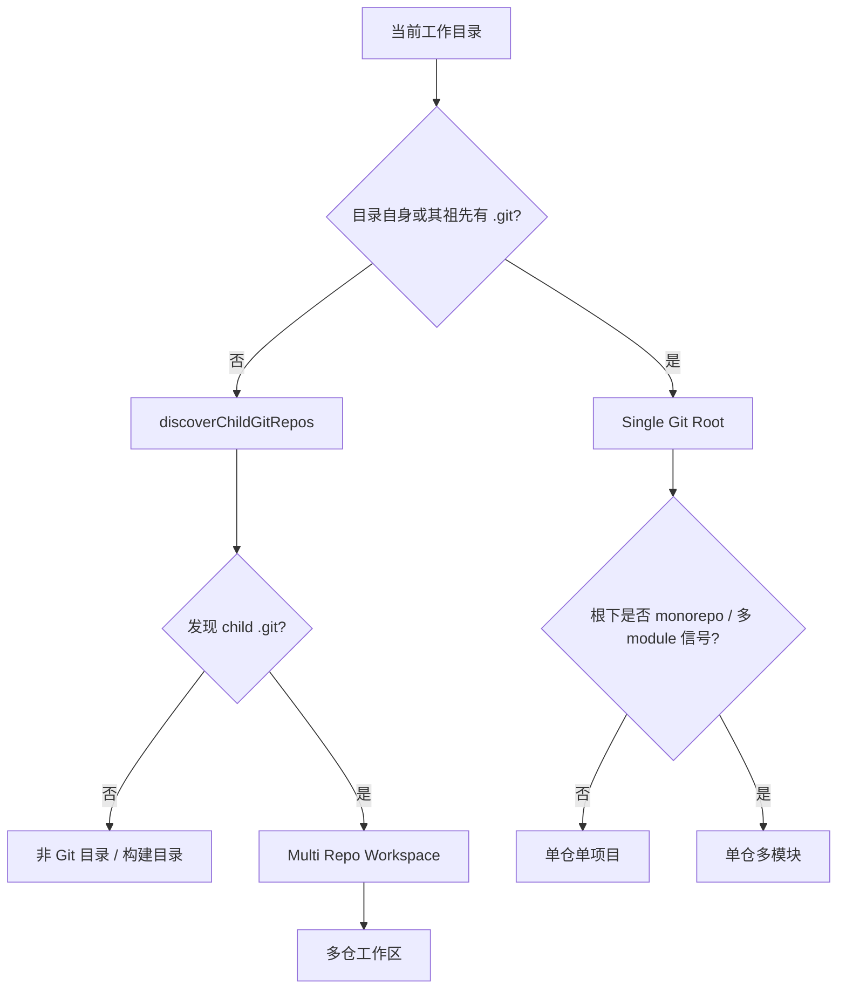
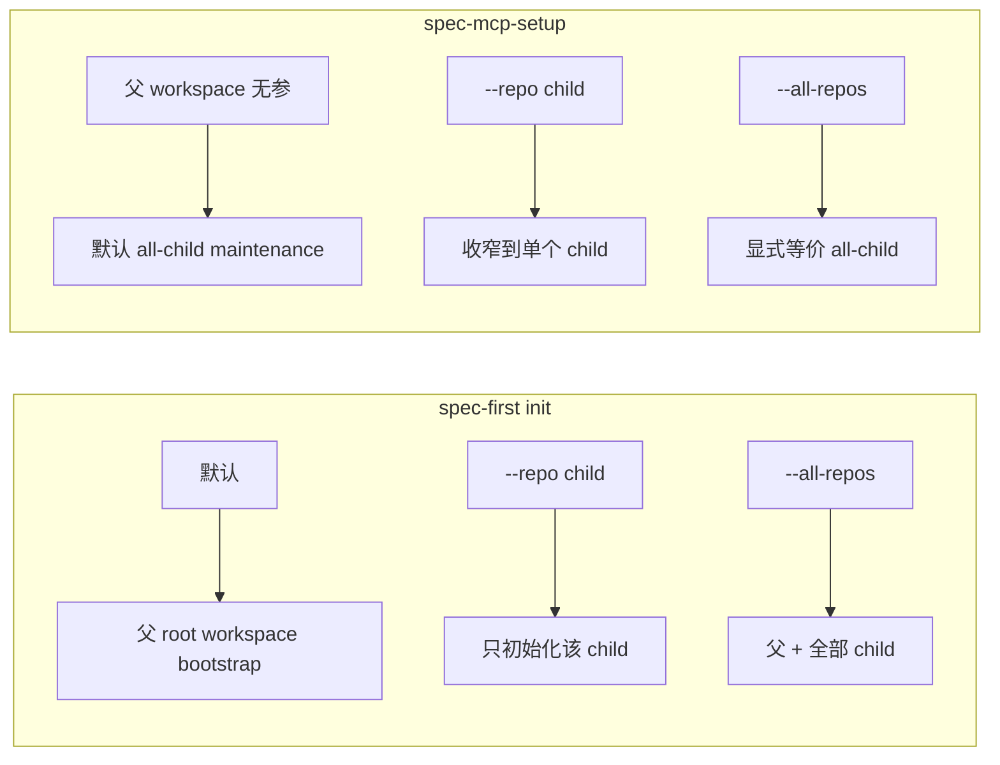

spec-first 不假设你只有一种仓库形态。真实工程里常见的是三种 **Git 拓扑**：单个 Git 工程单项目、单个 Git 工程多 module，以及父目录下多个独立 Git 工程。选择错拓扑，最常见的后果不是“装不上”，而是 **事实源分裂**——`.spec-first` 放错位置、父 workspace 的 summary 被当成 child 真相、plan/work/review 在多仓场景下缺 `target_repo`。本页只回答一件事：在这三种模式下，**控制面写哪里、证据读哪里、变更作用到哪里**。

Sources: [08-三种开发模式.md](docs/05-用户手册/08-三种开发模式.md#L1-L20)

## 先认拓扑，再谈工作流

三种模式的分界线不是“目录多不多”，而是 **有几个 `.git` 根**，以及 **`.spec-first` 与 setup/readiness 真相属于谁**。脚本侧会发现 child Git repos（默认深度 3、跳过 `node_modules` 等目录），并把父 workspace 产物的权威写死为 advisory；LLM 侧则在多仓写入前要求显式 `target_repo`。



Sources: [init-workspace.js](src/cli/commands/init-workspace.js#L35-L86), [init-input.js](src/cli/commands/init-input.js#L227-L247), [08-三种开发模式.md](docs/05-用户手册/08-三种开发模式.md#L200-L223)

## 三种模式对照

| 模式 | 形态 | 典型信号 | `.spec-first` 放置 | plan / work / review 边界 | setup 默认行为 |
| --- | --- | --- | --- | --- | --- |
| **单仓单项目** | 一个 `.git` + 一个应用边界 | 单服务 / CLI / SDK | 仅 repo root | 全仓即 scope | `init` / `spec-mcp-setup` 都在当前 repo |
| **单仓多模块** | 一个 `.git` + 多个 module/package | `pnpm-workspace.yaml`、`nx.json`、`apps/`、`packages/`、Android modules | 仍只在 **repo root** 一套 | 按 module 语义拆分，但 Git/证据仍是 **repo-local** | 与单仓相同；**不要**当成 multi-repo group readiness |
| **多仓工作区** | 父目录 **不是** 统一 Git root；每个 child 有独立 `.git` | `workspace/a/.git`、`workspace/b/.git` | **每个 child 一套**；父 root 可有 init-owned bootstrap + advisory summary | 写入/测试/commit 前必须 `target_repo` 或 per-task 范围 | `init` 默认父 root bootstrap；`spec-mcp-setup` 无参默认 all-child maintenance |

Sources: [08-三种开发模式.md](docs/05-用户手册/08-三种开发模式.md#L1-L20), [scenario-capability-matrix.md](docs/contracts/workflows/scenario-capability-matrix.md#L42-L47), [01-快速开始.md](docs/05-用户手册/01-快速开始.md#L107-L115)

## 模式 1：单仓单项目

这是最自然、最稳定的默认形态。仓库根同时是 Git 根、项目根和 `.spec-first` 根。

```text
my-app/
  .git/
  .spec-first/
  src/
  docs/
  README.md
```

在这个模式下：

- **direct source evidence** 覆盖当前 repo 全局代码认知与 diff impact。
- **spec-first 主链路**（brainstorm / plan / tasks / work / review / compound）都以当前 repo 为唯一物理边界。
- scenario fingerprint 的常见类是 `clean-single-repo` 或 `dirty-single-repo`：能力类分别为 `full` / `bounded`，不必引入 `target_repo`。

Sources: [08-三种开发模式.md](docs/05-用户手册/08-三种开发模式.md#L24-L52), [scenario-capability-matrix.md](docs/contracts/workflows/scenario-capability-matrix.md#L42-L44)

## 模式 2：单仓多模块

这是 **一个 Git 工程里的多个项目模块**，不是多个 repo。 monorepo、backend/frontend 同仓、Android 多 module 都属于这里。

```text
platform/
  .git/
  .spec-first/          # 只放这里
  packages/cli/
  packages/core/
  services/api/
  services/worker/
```

规划阶段会用浅层 monorepo 信号识别 module 地图，例如：

| 信号 | 含义 |
| --- | --- |
| root `package.json` 的 `workspaces` | npm / Yarn workspaces |
| `pnpm-workspace.yaml` | pnpm workspaces |
| `nx.json` / `lerna.json` | Nx / Lerna monorepo |
| `Cargo.toml` 的 `[workspace.members]` | Cargo workspace |
| `apps/`、`packages/`、`services/` 下各自有 manifest | 约定式 monorepo |
| 一层深的 `*/go.mod` | Go multi-module |

关键约束只有三条：

1. **`.spec-first` 只在 repo root**。每个 module 各放一套会把 plan/work/review 的事实源拆碎。
2. **查询与 refresh 仍按 repo-local facts**。存在 `packages/` 不等于启用 multi-repo workspace 的 group readiness。
3. **规划可按 module 拆分**，但 Git diff、验证证据与 setup facts 仍以 **该 Git root** 为权威边界。

Sources: [08-三种开发模式.md](docs/05-用户手册/08-三种开发模式.md#L55-L100), [repo-research-analyst.md](skills/spec-plan/references/agents/repo-research-analyst.md#L72-L89)

## 模式 3：多仓工作区

父目录下有多个独立 Git 工程时，你进入 **Multi Repo Workspace**。父目录本身通常 **没有** 可当作唯一真相的 Git root；每个 child 自有 `.git` 与 `.spec-first`。

```text
workspace/                 # 通常不是统一 Git repo
  product-website/.git/
  backend-api/.git/
  mobile-app/.git/
  .spec-first/workspace/   # 父级 advisory summaries
```

### 父级写什么、不能写什么

代码把父级产物权威写成固定结构：物理上可以落在 workspace root，但 **绝不是 child 的 canonical / setup / readiness 真相**。

| 父 workspace 合法产物 | 权威级别 | 说明 |
| --- | --- | --- |
| instruction、`.gitignore`、缺失时的 `CHANGELOG.md`、selected host runtime/state | init-owned，父会话治理 | `init` 默认父 root bootstrap |
| `.spec-first/workspace/*summary.json`、scenario fingerprint | **advisory** | 候选、摘要、下一命令提示 |
| child 的 `.spec-first/config/*`、`config.local*.yaml` | **禁止冒充写在父级** | 必须写到各个 child repo |

若父 root 误放了 repo-local setup artifacts，`spec-mcp-setup` 会产出 `.spec-first/workspace/parent-artifact-quarantine.json`；清理走 `spec-first clean --workspace-orphans`（先预览，再 `--confirm` 删除）。

Sources: [init-workspace.js](src/cli/commands/init-workspace.js#L24-L33), [parent-artifact-quarantine.md](docs/contracts/parent-artifact-quarantine.md#L1-L54), [01-快速开始.md](docs/05-用户手册/01-快速开始.md#L107-L112)

### 目标选择：`init` 与 `spec-mcp-setup` 并不对称



可操作约定：

```bash
# 父 workspace：默认只 bootstrap 父 root
spec-first init

# 只初始化某个 child
spec-first init --repo project-a -y -u <name> --lang zh

# 父 + 全部 child（高级批量维护；必须从父 workspace 运行，不能在 Git repo 内）
spec-first init --all-repos -y -u <name> --lang zh

# 父 workspace setup：默认逐个 child
spec-mcp-setup
spec-mcp-setup --verify-only --repo project-a
spec-mcp-setup --only codegraph --repo project-a
```

`--all-repos` 在 **Git repo 内部**会直接报错：它只属于父 workspace。交互式 `init` 在检测到 child 时，会让你在「仅父级 / 所有子仓 / 单个 child」之间显式选择。

Sources: [init-input.js](src/cli/commands/init-input.js#L227-L310), [01-快速开始.md](docs/05-用户手册/01-快速开始.md#L107-L112), [spec-mcp-setup/SKILL.md](skills/spec-mcp-setup/SKILL.md#L73-L73)

### 写入边界：没有 `target_repo` 就不要动刀

多仓场景的能力类是 `bounded`（脏 child 时为 `partial`）。任何 **write / test / autofix / commit** 都必须先有明确范围：

- single-repo plan：顶层写 `target_repo: <child>`
- cross-repo plan：每个 implementation unit / task 写 `target_repo`
- task pack：父 workspace 范围缺失 `target_repo` 时 **退回 `spec-plan`**，不算可执行 handoff

错误心智与正确心智对照：

| 不要这样理解 | 正确边界 |
| --- | --- |
| 父目录一套 `.spec-first` 管所有 repo | 每个 Git repo 一套 `.spec-first` |
| 父目录自动选中唯一 child | 无参 setup 是 all-child maintenance；plan/work 必须显式 scope |
| 父级 advisory summary = child source truth | summary 只是候选与治理提示 |
| dirty 就强制 commit/stash 才能只读 | dirty-advisory 仍可读；要对结论负责时再读源码/跑验证 |

Sources: [conditional-routing-boundaries.md](skills/using-spec-first/references/conditional-routing-boundaries.md#L3-L28), [spec-write-tasks/SKILL.md](skills/spec-write-tasks/SKILL.md#L62-L62), [task-pack-schema.md](skills/spec-write-tasks/references/task-pack-schema.md#L54-L54), [scenario-capability-matrix.md](docs/contracts/workflows/scenario-capability-matrix.md#L45-L47), [05-最佳实践.md](docs/05-用户手册/05-最佳实践.md#L54-L61)

## 如何快速自检你落在哪种模式

1. **在当前目录找 `.git`**：找到 → 单仓（再判断是否多 module）；找不到 → 继续。
2. **扫一层到三层子目录是否有独立 `.git`**：有 → 多仓工作区。
3. **看 monorepo 信号**：`pnpm-workspace.yaml` / `apps|packages|services` 等 → 单仓多模块，而不是多仓。
4. **看 `.spec-first` 数量与位置**：单仓应只有 root 一套；多仓应是 **每 child 一套**，父级只有 workspace advisory。
5. **若要写代码**：多仓时检查 plan/task 是否已有 `target_repo`。

Sources: [init-workspace.js](src/cli/commands/init-workspace.js#L35-L104), [repo-research-analyst.md](skills/spec-plan/references/agents/repo-research-analyst.md#L72-L89), [08-三种开发模式.md](docs/05-用户手册/08-三种开发模式.md#L200-L223)

## 场景指纹与降级姿势（多仓相关）

setup 会在适用时写入 `.spec-first/workspace/scenario-fingerprint-setup.json`。它是 **advisory facts**，不是门禁引擎；但多仓相关类会直接改变你的默认姿势：

| scenario class | capability | 你该怎么做 |
| --- | --- | --- |
| `multi-repo-workspace` | `bounded` | 写入前强制 `target_repo` / per-child scope |
| `multi-repo-dirty-workspace` | `partial` | 只在已理解/已声明范围的 child 上继续，并披露脏仓 |
| `foreign-residual-workspace` | `blocked-action-required` | 先 `clean --workspace-orphans` 预览 + `init`，或显式接受 degraded evidence |
| `non-git-build-workspace` | `partial` | 动作限制在已覆盖的 git roots，或直接检视未覆盖构建模块 |

Sources: [developer-scenario-fingerprint.md](docs/contracts/developer-scenario-fingerprint.md#L34-L52), [scenario-capability-matrix.md](docs/contracts/workflows/scenario-capability-matrix.md#L42-L49)

## 命名约定（文档与口头统一）

后续文档与对话统一使用：

```text
1. 单仓单项目   ← Single Repo / Single Project
2. 单仓多模块   ← Single Repo / Multi Module
3. 多仓工作区   ← Multi Repo Workspace
```

“多 module” 永远指 **同一 `.git` 内的模块边界**；“多 Git 工作区” 永远指 **多个 `.git` 根的父目录编排**。两者不可互换。

Sources: [08-三种开发模式.md](docs/05-用户手册/08-三种开发模式.md#L200-L223)

## 建议阅读顺序

- 若还没装过：先走 [五分钟上手：安装、doctor 与 init](2-wu-fen-zhong-shang-shou-an-zhuang-doctor-yu-init)，再回来对照本页选拓扑。
- 装完后第一次跑通主链路：[首次工作流走查：从 brainstorm 到可检查产物](4-shou-ci-gong-zuo-liu-zou-cha-cong-brainstorm-dao-ke-jian-cha-chan-wu)。
- 需要确认产物落点：[产物目录与成功信号：仓库内 artifact 去哪找](6-chan-wu-mu-lu-yu-cheng-gong-xin-hao-cang-ku-nei-artifact-qu-na-zhao)。
- 多仓图证据与 advisory 边界（跨仓只读、结论回子仓确认）：[工作区图与跨仓证据：CodeGraph、Graphify 的 advisory 边界](21-gong-zuo-qu-tu-yu-kua-cang-zheng-ju-codegraph-graphify-de-advisory-bian-jie)。
- Runtime 安装与 provider readiness：[Runtime Setup：spec-mcp-setup 与 provider readiness](19-runtime-setup-spec-mcp-setup-yu-provider-readiness)。